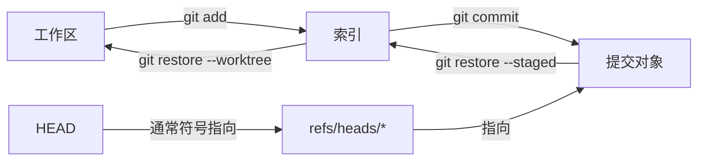

# `Git` 核心原理与日常工作流


[toc]

---

## 🔥 <font id=前言>前言</font>

> Git 的命令不是对“同一份代码”做不同操作，而是在工作区、索引、对象库和引用之间移动内容或指针。先知道命令影响哪一层，再决定怎样提交、整合、撤销和恢复。

## 一、对象、快照与引用 <a href="#前言" style="font-size:17px; color:green;"><b>🔼</b></a> <a href="#🔚" style="font-size:17px; color:green;"><b>🔽</b></a>

### 1.1、四类核心对象

| 对象 | 保存什么 | 关键事实 |
| --- | --- | --- |
| blob | 文件内容 | 不直接保存文件名。相同内容可复用同一对象。 |
| tree | 目录快照 | 把名称、模式与 blob / 子 tree / gitlink 关联起来。 |
| commit | 根 tree、父提交、作者、提交者、时间与消息 | Commit 保存快照和关系，不是只保存一份 diff。 |
| annotated tag | 标签名之外的说明、打标签者、时间和可选签名 | 轻量标签只是一个 ref，不创建 tag 对象。 |

常用观察命令：

```shell
git cat-file -t <object-id>
git cat-file -p <object-id>
git ls-tree -r HEAD
git show --stat --summary HEAD
```

### 1.2、四层可变状态



- 工作区：当前磁盘文件。
- 索引：下一次提交的候选快照，也承载冲突的多阶段条目。
- 对象库：不可变对象集合；对象存在不等于有分支仍引用它。
- 引用：分支、标签和远端跟踪分支等可移动名字。
- `HEAD` 通常是当前分支的符号引用；检出某个提交时会成为 detached HEAD。

## 二、创建、克隆与识别仓库

### 2.1、新仓库

```shell
mkdir project
cd project
git init --initial-branch=main
git status
```

初始化不会替你创建首次提交、远端或忽略规则。

### 2.2、克隆

```shell
git clone <repository-url>
git -C <repository-directory> remote -v
git -C <repository-directory> branch --verbose --verbose
```

Clone 通常会创建远端 `origin`、远端跟踪引用和一个跟踪默认远端分支的本地分支。它不保证自动初始化子模块；含子模块时使用 `--recurse-submodules` 或克隆后执行 `git submodule update --init --recursive`。

### 2.3、先确认自己在哪个仓库

```shell
git rev-parse --show-toplevel
git rev-parse --git-dir
git rev-parse --git-common-dir
git status --short --branch
```

子模块、linked worktree 和普通仓库的 Git 目录结构不同。脚本不能只用“当前目录是否有 `.git/` 文件夹”判断仓库根。

## 三、文件生命周期与暂存

### 3.1、观察再暂存

```shell
git status --short --branch
git diff
git diff --cached
git diff --check
git add --patch
git diff --cached --stat
```

- `git diff` 默认比较工作区与索引。
- `git diff --cached` 比较索引与 `HEAD`。
- `git add --patch` 按 hunk 选择内容，适合把混杂修改拆成语义清晰的提交。
- `git add -A -- .` 在当前路径范围统一记录新增、修改和删除；执行位置会影响范围。

### 3.2、状态含义

| 状态 | 含义 | 常用动作 |
| --- | --- | --- |
| untracked | 文件未进入索引 | 审查后 `git add`，或加入忽略规则。 |
| tracked + modified | 工作区不同于索引 | `git diff` 审查，再暂存或恢复。 |
| staged | 索引不同于 `HEAD` | `git diff --cached` 审查，再 Commit。 |
| deleted | 工作区或索引记录删除 | 确认是有意删除，不要只为消除红色状态而恢复。 |
| unmerged | 索引存在冲突阶段 | 解决冲突后 `git add`，不能直接普通 Commit 绕过。 |

停止跟踪但保留工作区文件：

```shell
git rm --cached -- <path>
```

这只影响后续提交；已经存在于历史中的内容不会因此从旧提交消失。

## 四、提交设计与身份

### 4.1、提交前核对

```shell
git diff --cached --check
git diff --cached --stat
git diff --cached
git config --show-origin --get-regexp '^user\.(name|email)$'
git commit
```

一个可审查提交应尽量满足：

- 只完成一个清晰目的。
- 代码、测试、文档和必要配置保持一致。
- 不混入构建产物、临时日志、凭据和无关格式化。
- 提交消息说明结果和原因，不重复文件名列表。

### 4.2、修改最后一次提交

```shell
git commit --amend
```

Amend 会创建新提交并移动当前分支，提交 ID 改变。只在提交尚未共享，或团队明确允许改写时使用；已经发布的修复通常追加新提交或使用 `git revert` 更安全。

## 五、分支、合并与冲突

### 5.1、分支是可移动引用

```shell
git branch --all --verbose --verbose
git switch --create feature/example
git switch main
git branch --merged
git branch --no-merged
```

创建分支不会复制整个工作区。删除分支只是删除名字；只要提交仍被其它引用或 reflog 保留，对象可能继续存在。

### 5.2、整合前先更新观察面

```shell
git fetch --prune origin
git log --oneline --graph --decorate --all -30
git merge-base HEAD origin/main
```

常见整合策略：

| 策略 | 历史结果 | 适用边界 |
| --- | --- | --- |
| fast-forward | 只移动分支引用 | 当前分支没有独有提交。 |
| merge commit | 保留两条父历史 | 需要保留分支整合节点或共享分支不宜改写。 |
| rebase | 重放并改写当前分支独有提交 | 适合尚未共享的主题分支整理。 |
| squash merge | 把主题变化压成一个新提交 | 平台合并时简化主线，但不保留每个主题提交。 |

### 5.3、冲突不是随机覆盖

```shell
git status
git diff --name-only --diff-filter=U
git diff --cc
```

解决后：

```shell
git add -- <resolved-paths>
git status
```

然后执行当前流程对应的 `git merge --continue`、`git rebase --continue` 或 `git cherry-pick --continue`。放弃时也必须使用同一流程对应的 `--abort`。

`ours` / `theirs` 的含义会随 merge、rebase 等上下文改变，不能把它们永久理解成“本地”和“远端”。先看 `HEAD`、当前操作和冲突基线。

## 六、撤销与恢复决策表

| 目标 | 命令方向 | 主要影响 | 风险 |
| --- | --- | --- | --- |
| 取消某路径的暂存，保留工作区 | `git restore --staged -- <path>` | 索引 | 低，仍要检查工作区。 |
| 丢弃 tracked 文件的未暂存修改 | `git restore --worktree -- <path>` | 工作区 | 会覆盖未提交内容。 |
| 公开历史中撤销某提交 | `git revert <commit>` | 新建反向提交 | 保留历史，可能冲突。 |
| 移动当前分支但保留索引和工作区 | `git reset --soft <target>` | 引用 | 改写当前分支历史。 |
| 移动分支并重置索引，保留工作区 | `git reset --mixed <target>` | 引用、索引 | 默认 reset 模式。 |
| 让分支、索引和工作区都匹配目标 | `git reset --hard <target>` | 引用、索引、工作区 | 会覆盖 tracked 修改。 |

执行改写前先：

```shell
git status --short --branch
git diff
git diff --cached
git reflog -20 --date=iso
```

- `reset` 的提交级形式会移动当前分支或 detached HEAD；路径级形式主要修改索引，语义不同。
- `restore` 默认不会删除 untracked 文件。
- `revert` 对 merge commit 需要用 `-m <parent-number>` 指定主线，选择错误会得到相反语义。
- reflog 是本地、会过期的恢复线索，不是永久备份。

## 七、远端协作

### 7.1、远端、本地分支与远端跟踪引用

```shell
git remote -v
git remote show origin
git branch --verbose --verbose
git for-each-ref --format='%(refname:short) %(upstream:short)' refs/heads/
```

`origin/main` 是本地远端跟踪引用，不是服务器上的分支本体。它只反映最后一次成功 Fetch 后本地知道的状态。

### 7.2、Fetch、Pull 与 Push

```shell
git fetch --prune origin
git pull --ff-only
git push --set-upstream origin feature/example
```

- Fetch 下载对象并更新引用，不整合当前工作分支。
- Pull 是 Fetch 加 merge/rebase 等整合；团队应明确 `--ff-only`、`--rebase` 或 `--no-rebase`，不要依赖含糊默认值。
- Push 把本地对象和引用更新请求发送给远端；服务器权限、保护规则和 Hook 决定是否接受。
- `--prune` 删除的是远端已经不存在的本地远端跟踪引用，不会删除本地普通分支。

## 八、忽略规则、属性与跨平台文件名

### 8.1、三类忽略来源

| 来源 | 是否提交 | 用途 |
| --- | --- | --- |
| `.gitignore` | 是 | 团队共享的生成物、缓存与本地配置规则。 |
| `.git/info/exclude` | 否 | 当前克隆私有忽略。 |
| `core.excludesFile` | 否 | 当前用户跨仓库全局忽略。 |

诊断规则来源：

```shell
git check-ignore --verbose --no-index <path>
```

忽略规则不自动停止跟踪已经进入索引的文件；需要明确执行 `git rm --cached` 并提交索引变化。

### 8.2、`.gitattributes`

示例：

```gitattributes
* text=auto
*.sh text eol=lf
*.command text eol=lf
*.bat text eol=crlf
*.png binary
```

属性可控制文本规范化、diff/merge driver、export-ignore 与语言统计等行为。修改换行策略后先在独立提交中执行并审查：

```shell
git add --renormalize .
git diff --cached --stat
```

不要同时混入业务逻辑修改，否则真实差异会被全库换行变化淹没。

### 8.3、大小写与 Unicode

macOS、Windows 和 Linux 的文件系统行为可能不同。只改大小写时使用临时名分两步记录：

```shell
git mv oldname temporary-name
git mv temporary-name NewName
```

不要随意全局修改 `core.ignoreCase` 或 `core.precomposeUnicode`；它们通常由 Git 初始化时根据文件系统探测，错误配置会制造重复路径、无法检出或大小写碰撞。

## 九、标签与发布点

```shell
git tag --list
git tag --annotate v1.0.0 --message 'Release v1.0.0'
git show v1.0.0
git push origin v1.0.0
```

- 普通 `git push` 默认不一定推送本地标签；需要显式推送目标标签。`--follow-tags` 只会随所推送提交补充可达且缺失的 annotated tag，不包含全部轻量标签。
- 已发布标签应视为不可变发布标识。确需移动时要同步说明旧对象、新对象、制品和下游缓存影响。
- Git tag 不等同于 GitHub Release；Release 是托管平台在 tag 之上的说明与资产层。

## 十、可复核的日常流程

```shell
git status --short --branch
git fetch --prune origin
git switch main
git pull --ff-only
git switch --create feature/example
git add --patch
git diff --cached --check
git diff --cached
git commit
git push --set-upstream origin feature/example
```

这不是所有团队的唯一流程。使用 trunk-based、GitHub Flow、Git Flow 或 release branch 时，应把分支寿命、合并方式、发布权限和回滚策略写进仓库规范，而不是靠个人记忆。

## 十一、官方资料

- [**Git 用户手册**](https://git-scm.com/docs/user-manual)
- [**gitglossary**](https://git-scm.com/docs/gitglossary)
- [**git-add**](https://git-scm.com/docs/git-add)
- [**git-commit**](https://git-scm.com/docs/git-commit)
- [**git-switch**](https://git-scm.com/docs/git-switch)
- [**git-merge**](https://git-scm.com/docs/git-merge)
- [**git-restore**](https://git-scm.com/docs/git-restore)
- [**git-reset**](https://git-scm.com/docs/git-reset)
- [**git-revert**](https://git-scm.com/docs/git-revert)
- [**gitignore**](https://git-scm.com/docs/gitignore)
- [**gitattributes**](https://git-scm.com/docs/gitattributes)
- [**git-tag**](https://git-scm.com/docs/git-tag)

<a id="🔚" href="#前言" style="font-size:17px; color:green; font-weight:bold;">我是有底线的➤点我回到首页</a>
