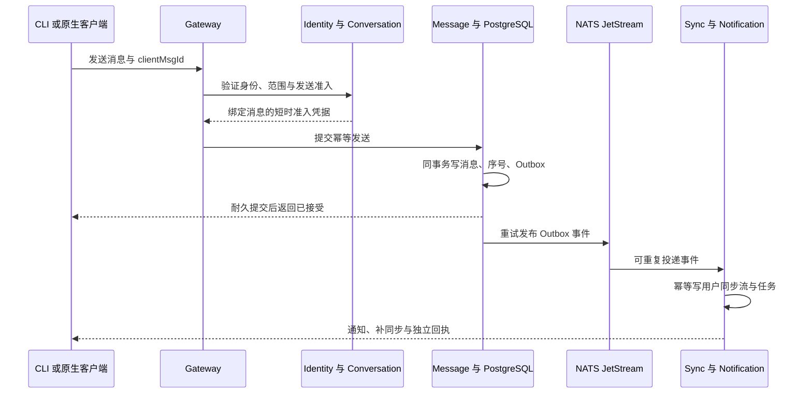
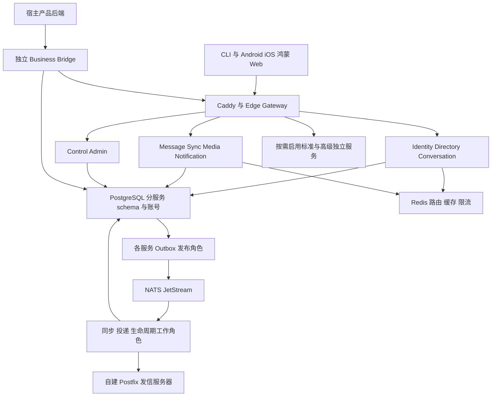

# IM 后端架构表

[toc]

---

| 导航 | 内容 |
| --- | --- |
| [一、架构基线](#architecture-baseline) | 三阶段继承、源码与服务边界 |
| [二、微服务职责](#service-boundaries) | 基础、标准、高级服务和表所有权 |
| [三、协议与可靠消息](#contracts-reliability) | API、授权、Outbox、同步、机器人和业务桥接 |
| [四、账号与邮件](#identity-security) | 密码、邮件 OTP、封禁与墓碑 |
| [五、Redis](#redis-design) | 缓存、路由、限流和失效策略 |
| [六、数据库与字段](#data-design) | 分服务 schema、具体字段、索引与约束 |
| [七、配置与会员](#configuration-membership) | 能力开关、等级继承、发布回滚 |
| [八、服务器与部署](#hardware-deployment) | 最低/推荐机器、拓扑、容量模型 |
| [九、依赖版本](#dependency-versions) | 经核查版本、源码/许可与锁定合同 |
| [十、运维与封版](#operations-release) | 探针、告警、灾备、迁移与验收 |
| [产品需求](./IM需求明细表.md) | 功能目标与版本边界 |
| [功能验收](./IM功能验收表.md) | 每项结果和证据 |

## 🔥 前言

本文是可评审的后端工程设计基线，核查日为 **2026-10-07**。产品行为由 [IM需求明细表](./IM需求明细表.md) 定义；本文负责服务、协议、数据、部署和依赖，验收结果写入 [IM功能验收表](./IM功能验收表.md)。当前尚未实现、部署或压测，不把设计值当作已通过的事实。

已确定使用 [**Redis**](https://redis.io/) 辅助后端，采用 [**PostgreSQL**](https://www.postgresql.org/) 保存权威业务事实，[**Go**](https://go.dev/) 实现业务微服务。Redis 的具体许可证按 [依赖清单](#dependency-versions) 纳入交付；不以缓存替代聊天历史、账号权限或资金账本。

## 一、架构基线与三阶段目标 <a href="#前言" style="font-size:17px; color:green;"><b>🔼</b></a> <a href="#🔚" style="font-size:17px; color:green;"><b>🔽</b></a>

### 1.1、继承、封版与一套工程 <a href="#前言" style="font-size:17px; color:green;"><b>🔼</b></a> <a href="#🔚" style="font-size:17px; color:green;"><b>🔽</b></a>

| 阶段 | 工程标段与交付目标 | 进入下一阶段的门槛 |
| --- | --- | --- |
| I 基础版 | CLI 先贯通最小协议；Android/iOS/鸿蒙/Web 完成基础账号、私聊图文、设备同步、通知、字体与无障碍；邮件 OTP、管理员账户状态、手工联系人、能力配置、最小宿主身份/资源桥接；Bot API 合同先确定 | 本阶段五类客户端与后端的必验项全部通过；源码/协议/配置/迁移/恢复证据封版，CLI 单独成功不能代表全基础通过 |
| II 标准版 | 在基础版同一工程上增量：群与普通聊天全功能、音视频、搜索收藏、用户确认的通讯录同步、开放机器人/默认机器人/批量计划任务、免费会员等级能力配置 | 基础回归加新增功能通过；旧端兼容、升级迁移、机器人权限和会员继承验收；标准版形成新的封版基线 |
| III 高级版 | 在标准版上按场景增量：企业工作区、客服、E2EE/阅后即焚、券积分资金、Web3、AI 等独立微服务；会员能力树可包含新增能力；收费订阅/数字购买/广告仍按独立合同预留 | 每个启用场景独立交付与验收，基础/标准回归不得回退；未实现或未验收模块不能显示已可用 |

三阶段是开发继承，运行时基础/标准/高级是可配置能力预设。封版冻结的是可重建、可恢复的证据基线，不复制三套源码、不另建三套用户/消息数据；下一阶段保留基础能力并执行增量迁移。封版后安全修复形成补丁基线并重验受影响项。[阶段目标](./IM需求明细表.md#phase-goals)、[版本预设](./IM需求明细表.md#edition-profiles)

### 1.2、不变的工程合同 <a href="#前言" style="font-size:17px; color:green;"><b>🔼</b></a> <a href="#🔚" style="font-size:17px; color:green;"><b>🔽</b></a>

- 当前及长期可预见阶段产品免费、源码完整公开；客户端、CLI、后台、业务服务、桥接中间件、协议、构建/部署、迁移和测试均进入交付。必要平台推送/邮件收件服务是外部边界，不能以此隐藏自有核心代码。
- 按关键业务域建立微服务，可在同一台机器分别运行容器；每个服务有独立入口、依赖、数据库账号、迁移、探针和扩容方式。一个按钮不等于一个微服务，业务接口也不等于允许业务代码混入 IM。
- 不信任任何客户端或宿主传入的用户 ID、价格、权限、群成员、等级、时间与状态。鉴权、范围隔离、字段验证、幂等和审计属于全部版本的基座，不能关闭。
- 基础/标准/高级共享身份、会话、消息与权威事件；扩展有自己的 schema。服务只能写自己拥有的表，同机同库也不允许绕过接口跨服务读写私有表。
- 配置只启用已经实现且依赖齐全的能力。停用先禁止新操作、排空任务，已接受的消息、到期删除和结算责任继续完成；高级服务未启用时不启动其容器、连接池、订阅和媒体/模型引擎。

### 1.3、现代稳定与原生端合同 <a href="#前言" style="font-size:17px; color:green;"><b>🔼</b></a> <a href="#🔚" style="font-size:17px; color:green;"><b>🔽</b></a>

服务端采用 [**Go**](https://go.dev/) 并锁定正式受支持版本；前端原生优先，Android 采用 [**Kotlin**](https://kotlinlang.org/) 与 [**Jetpack Compose**](https://developer.android.com/compose)，iOS 采用 <u>[**Swift**](https://www.swift.org/)</u> 与 [**SwiftUI**](https://developer.apple.com/swiftui/) / [**UIKit**](https://developer.apple.com/documentation/uikit)，鸿蒙采用 [**ArkTS/ArkUI**](https://developer.huawei.com/consumer/cn/doc/harmonyos-guides/arkts-overview)，Web 使用 [**TypeScript**](https://www.typescriptlang.org/) 与 [**React**](https://react.dev/)。这里定义技术路径，客户端工具链/最低系统/依赖另由对应端的锁定清单交付，不把后端版本表充当前端实测结果。[目标能力矩阵](./IM需求明细表.md#client-matrix)

同一源码工程可以有多种平台语言，共享身份/消息协议、能力 ID 与测试样本；原生通知、生命周期、密钥、本地待发、无障碍需分别适配。新技术和 AI 的收益通过构建、资源、故障、兼容和维护结果验证，不以生成成功替代质量证明。

## 二、业务微服务、职责与数据所有权 <a href="#前言" style="font-size:17px; color:green;"><b>🔼</b></a> <a href="#🔚" style="font-size:17px; color:green;"><b>🔽</b></a>

### 2.1、基础服务 <a href="#前言" style="font-size:17px; color:green;"><b>🔼</b></a> <a href="#🔚" style="font-size:17px; color:green;"><b>🔽</b></a>

| 服务 | 责任与接口 | 自有 schema / 状态 | 故障边界 |
| --- | --- | --- | --- |
| `edge-gateway` | HTTPS/WebSocket、连接鉴权、连接限额、心跳、请求路由；协议不含宿主业务实现 | 无权威业务表；Redis 存短时连接路由 | 重连后从同步服务补洞，内存连接不是消息事实 |
| `identity-service` | 用户/身份、密码/OTP/MFA、设备与会话、权限验证、封禁/墓碑/恢复 | `auth` | 关键鉴权不可用时拒绝新受保护操作，不信任缓存授权 |
| `directory-service` | 公开资料、手工联系人、拉黑与隐私；标准阶段增加明确同意的通讯录发现 | `directory` | 资料缓存失效可回源；拉黑等权限规则用当前权威判定 |
| `conversation-service` | 私聊唯一性、成员、发送准入、角色、历史可见范围；标准阶段承载群/频道权限 | `conversation` | 无法确认发言权限时不接受新消息；授权与权限撤销有明确先后边界 |
| `message-service` | 消息幂等、会话内序号、耐久提交、ACK、编辑/撤回/过期事件 | `message` | 数据库未提交不返回已接受；提交后投递故障由 Outbox 重放 |
| `sync-service` | 用户增量流、设备游标、收讫/已读、快照与补洞 | `sync` | 断线不丢事实；Redis 在线路由失效可由持久游标恢复 |
| `notification-service` | 推送适配器、免打扰、推送尝试；邮件任务投递与反馈 | `notify` | 推送/SMTP 受理不等于用户已收到；不影响已经接受的聊天事实 |
| `media-service` | 私有图片/附件、上传/下载授权、对象元数据、校验与回收 | `media`；私有对象目录/对象存储 | 媒体不可用时不虚构上传完成；聊天中的旧媒体有明确失败状态 |
| `control-service` | 能力定义、配置发布、部署应用/作用域、审计、阶段基线；标准阶段增加会员配置 | `control` | 期望配置与有效配置分离；非法配置不发布 |
| `admin-service` | 管理后台 API、管理员操作编排、审计查询；请求转交数据所有者 | `admin` 仅管理操作编排与审计副本 | 无权直接改其他 schema；管理员身份仍由 identity 权威验证 |
| `business-bridge` | 宿主身份映射、业务资源/事件绑定、Webhook，独立中间件 | `bridge` | 宿主失败不污染 IM 核心；可随独立 IM 实例一并交付 |
| `governance-service` | 基础举报/管理员处置、本人数据导出/注销与清理编排；高级阶段扩展企业审核工作流 | `governance` | 状态转换与物理清理分别执行；服务停用不能遗失已经成立的清理任务 |

后台发信组件连接自建 SMTP 服务，基础阶段不需要给终端用户建设邮箱收件箱。Outbox 发布器、投递工作进程、生命周期清理器属于对应服务的独立运行角色，可同镜像不同启动命令，迁移与表所有权不变。

### 2.2、标准与高级扩展服务 <a href="#前言" style="font-size:17px; color:green;"><b>🔼</b></a> <a href="#🔚" style="font-size:17px; color:green;"><b>🔽</b></a>

| 阶段 | 独立服务 | 责任 / schema |
| --- | --- | --- |
| II | `interaction-service` | 反应、投票、置顶、收藏、结构化卡片 / `interaction`；消息正文仍归 message |
| II | `search-service` | 被授权的云会话搜索索引、个人查询 / `search`；权限在返回结果时重验 |
| II | `rtc-service` | 通话状态、首个接听获胜、房间授权 / `rtc`；媒体转发部署为独立 RTC 服务 |
| II | `bot-service` | Bot API、机器人凭据/权限、Webhook/轮询、默认机器人、执行审计 / `bot` |
| II | `scheduler-service` | 定时/周期/批量任务、运行租约、幂等执行、暂停取消 / `schedule` |
| III | `workspace-service` | 企业组织、成员/访客、工作区授权 / `workspace` |
| III | `support-service` | 客服队列、坐席、会话分配、工单关联 / `support` |
| III | `key-service` | 设备公钥/预密钥、会话安全模式与备份元数据 / `keyring`；不接收端侧私钥 |
| III | `benefit-service` | 券库存、领取/核销、积分账本和兑换 / `benefit` |
| III | `ledger-service` | 资金双分录账本、红包、支付状态、对账退款 / `ledger`；不向聊天服务开放任意改余额接口 |
| III | `web3-service` | 钱包签名验证、链适配、交易回执和确认数 / `web3` |
| III | `ai-service` | 用户授权的摘要/翻译/助手、提供商适配、配额 / `ai` |
| III 增量 | `governance-service` | 在基础举报/数据权利服务上增加企业审核、复杂工单与保留策略 / `governance` |

基础数据权利、附件过期和账号注销清理在阶段 I 就具备；阶段 III 的治理服务增加复杂工作流，不允许借“高级模块未启用”停止基础删除责任。阅后即焚的执行仍由 message/media 的耐久生命周期角色负责，不新增一个只负责按钮的微服务。

### 2.3、微服务模块启停与按需资源 <a href="#前言" style="font-size:17px; color:green;"><b>🔼</b></a> <a href="#🔚" style="font-size:17px; color:green;"><b>🔽</b></a>

服务模块状态为 `registered/disabled/initializing/ready/draining/stopped/failed`。声明 moduleId、版本、依赖、接口/事件、数据所有权、配置、初始化/停止合同、探针及资源预算；只有 ready 接受新工作。初始化幂等且有超时，失败释放已获取资源；停用停止新准入、排空或持久交接在途任务，再停止容器和专属连接/队列/定时器。必要收尾角色继续完成既定责任，后台显示实际状态。

采用源码中明确的服务/模块注册与独立部署，不通过下载用户二进制或 Go 动态 plugin 执行未经信任代码。前端高阶页面与媒体引擎同样按需创建。未启用的源码不等于全部常驻内存；配置预设的资源收益通过同硬件/同数据/同负载的启动、常驻内存、CPU、连接、任务和首次访问延迟对照测量。

## 三、协议、可靠消息与开放集成 <a href="#前言" style="font-size:17px; color:green;"><b>🔼</b></a> <a href="#🔚" style="font-size:17px; color:green;"><b>🔽</b></a>

### 3.1、同步 API 与事件合同 <a href="#前言" style="font-size:17px; color:green;"><b>🔼</b></a> <a href="#🔚" style="font-size:17px; color:green;"><b>🔽</b></a>

外部与阶段 I 内部接口统一为 HTTPS + JSON，实时通知使用 WebSocket；以 [**OpenAPI**](https://www.openapis.org/) 保存版本化可生成的合同。CLI 与原生客户端使用同一身份和消息 API，不拥有后门接口。内部服务采用双向 TLS/服务身份，网络白名单不能代替服务鉴权。当前不为基础版强制增加另一套 RPC 框架。

| 合同 | 字段 / 规则 |
| --- | --- |
| 请求上下文 | `requestId`、`traceId`、认证会话、服务端解析的 `scopeId`；幂等写入增加 `idempotencyKey`、`expectedVersion` |
| 同步结果 | 业务对象、权威 `version`、服务端时间；错误统一 `code/message/retryable/requestId`，明确 `UNAUTHORIZED/FORBIDDEN/FEATURE_DISABLED/VERSION_CONFLICT/RATE_LIMITED` |
| 消息发送 | `clientMsgId/conversationId/type/schemaVersion/payload/attachmentIds`；身份、发送时间、成员、权限、序号、成功状态由服务端决定 |
| WebSocket 通知 | 通知类型、对象 ID、权威版本、增量游标；有界载荷，收到通知后按权限拉取，不把通知当作唯一历史 |
| 事件信封 | `eventId/scopeId/eventType/schemaVersion/aggregateId/aggregateVersion/occurredAt/causationId/traceId/payload`；订阅方按事件 ID 幂等 |
| 对外 Webhook | 事件 ID、时间戳、签名、重试号；密钥轮换、重放时间窗、幂等与停用；未知字段兼容，未知事件不崩溃 |

接口路径分 `/v1/auth`、`/v1/conversations`、`/v1/messages`、`/v1/sync`、`/v1/media`、`/v1/capabilities`、`/v1/bots`、`/v1/bridge` 和管理员路径。认证来自令牌与服务身份，不来自路径中的用户 ID。分页用稳定游标，所有批量请求限制条数、字节、执行时间和并发。

### 3.2、消息接受、投递与事务 Outbox <a href="#前言" style="font-size:17px; color:green;"><b>🔼</b></a> <a href="#🔚" style="font-size:17px; color:green;"><b>🔽</b></a>

发送先由身份/会话所有者确认当前账号、会话、拉黑、成员和能力。identity-service 从权威数据库校验 `security_version/state`，control-service 判定当前有效会员/能力策略，conversation-service 在本服务事务中按当前成员版本记录发送准入。准入凭据绑定作用域、发送者、会话、`clientMsgId`、内容摘要、账号 generation、会员/config 版本、成员版本及过期时间，签名限定 message-service 使用，初始有效期不超过 5 秒，不能跨消息复用。任何必要权威服务不可用都不发新准入，Redis 旧值不能放行。

账号、会员和群权限由不同服务拥有，不宣称跨域撤权与消息提交是全球瞬时原子事务。每个权威服务在本域事务中排序授权决定与撤权，短时凭据的有效期取所有权威验证时限中的最早值，不能从最后一步开始重新计算 5 秒。撤权后该权威服务不再签发有效授权，撤权前已签发的凭据只能在这个有界窗口内进入提交，超时须重新验证。事务设置受请求截止约束的超时，已经提交/结果暂时未知的操作按数据库最终事实核对；5 秒是准入有效期，不能仅按计时器认定所有事务排空。后台显示“新授权已禁用/正在排空/完成”，不能在排空期间宣传所有在途操作已取消。消息收到并不自动赋予撤权后阅读历史的权限，拉取/下载仍校验当前权限。客户端时间、缓存版本不能改变先后。

message-service 在同一数据库事务内完成幂等键检查、准入凭据验证、会话序号递增、消息/事件插入和 `outbox` 插入。使用耐久提交，只有事务成功才返回“服务端已接受”；相同 `clientMsgId` 重试返回原结果，内容摘要不同则冲突。会话头行锁将会话内写入排序，热点会话以分片/配额优化，不能用客户端时间排序。

有附件时，先登记持久 `send_attempts`，再向 media-service 取得绑定该发送尝试的临时保留凭据；上传对象已完成大小/类型/摘要验证，但尚未成为永久消息引用。message 的提交事务锁定发送尝试行、确认状态仍可提交并写消息/附件引用事件；Outbox 异步完成媒体绑定确认。两服务不使用跨表强事务，确认失败进入持久重试，已提交消息不会因通知延迟直接删除对象。

孤儿清理器仅在保留到期后向 message 请求“确认已提交或原子取消未提交尝试”。message 使用与提交相同的尝试行锁：已提交返回消息引用，未提交转为不可再提交的 aborted；状态未知/超时则继续保留并报警。media 只有收到明确 aborted 或无需保留的权威结果才回收对象，不能只凭 TTL 或一次“暂未查询到消息”删除附件。重试/清理竞争、服务宕机和延迟确认列入基础验收。

可靠异步传递使用 [**NATS JetStream**](https://docs.nats.io/concepts/jetstream)，启用文件存储、耐久消费者、显式 ACK、失败重投及死信处理。发布器仅在收到消息总线确认后标记 Outbox 已发布；崩溃会重复发布，消费者以 `(consumer,eventId)` 去重，完成自己的数据库事务后才 ACK。JetStream 发布 ACK 与副本数不直接等于关联掉电时立即 fsync 的保证；保留可重放的 PostgreSQL Outbox/业务事件，并记录消费者覆盖游标及重放窗口，不能发出总线 ACK 后立即删除唯一补发事实。业务服务仍以 PostgreSQL 为事实来源，不宣称端到端“绝不会重复”。[JetStream 官方合同](https://docs.nats.io/concepts/jetstream)

在线/离线/多设备都读取持久同步流；每设备游标独立。用户已读游标单调前进，最大值不能越过其可见范围；编辑、撤回、删除和入退群有版本化事件。游标保留期过后进入权限过滤的快照重建，不能直接跳到最新位置而丢失删除事实。推送是提醒；“服务器接受、设备收讫、用户已读”是三个不同状态。

个人隐藏/删除与全局撤回分别持久记录：个人动作只过滤本人的消息视图，不能改掉另一人的消息事实；全局撤回/到期删除保留不含正文的消息墓碑与删除序号。游标过期必须使用带边界游标的完整快照重建本地派生视图，再补边界后的增量；未在快照中获授权保留的旧消息/附件缓存按合同清理，不能把旧本地列表直接合并回服务器。离线终端未连接期间不能保证远程擦除已下载内容。

### 3.3、机器人接口、默认能力与计划任务 <a href="#前言" style="font-size:17px; color:green;"><b>🔼</b></a> <a href="#🔚" style="font-size:17px; color:green;"><b>🔽</b></a>

机器人采用 [**Telegram Bot API**](https://core.telegram.org/bots/api) 的开放接入思路，接口与实现自行设计，不承诺兼容其完整协议。高级用户注册机器人后，在自己的进程/服务器编写代码，通过 Bot API、Webhook 或长轮询处理事件；IM 服务不在用户聊天进程中直接执行任意上传脚本。[产品范围](./IM需求明细表.md#bot-platform)

| 合同 | 具体设计 |
| --- | --- |
| 身份和令牌 | 专用 `botId`、owner、可撤销随机令牌；数据库仅存令牌摘要；人类用户、机器人与服务账号身份分开 |
| 权限 | 创建者授予能力，加入会话仍按群/用户授权；默认只见直接发送给机器人、命令和被明确授权的事件；不默认读取全部私聊/历史 |
| 默认机器人 | 帮助/命令发现、个人提醒、经授权的群欢迎与群规则、定时公告、本人或管理范围内的批量通知；全部可关闭，不默认开启外部 AI 或商业发送 |
| 计划任务 | 一次定时/周期规则、时区、首次/结束时间、漏执行策略、最大次数、受众快照或执行时解析、暂停/取消；执行前重验账号/会话/机器人权限 |
| 批量任务 | 幂等批次 ID、逐收件人结果、总量与速率上限、重试/部分成功；限制到授权且同意的受众，不能自动给所有注册账号群发 |
| 调度可靠性 | PostgreSQL 持久计划/运行记录，工作者按租约领取；Redis 可作短时互斥辅助，数据库唯一执行键与状态是最终保证 |
| Webhook | 固定 HTTPS 目标、原始 body 签名/时间戳/事件 ID 与重放保护；公网用户目标防 SSRF/DNS 重绑定，拒绝内网/元数据地址；受控私有宿主可由运维明确 allowlist 与隔离出口开放必要内网；失败退避、停用、可查询待投递事件 |

默认机器人也通过同一接口和权限运行，不拥有跳过鉴权的系统后门。WebHook 返回成功仅代表事件已接收，不代表计划任务或消息发送已经成功；执行结果独立查询与回报。周期任务的本地时区/夏令时、服务停机后补跑/跳过、修改任务版本后的去重规则纳入标准版验收。

回调接收方应验证签名并先持久入队/去重再返回 2xx；失败进入退避、死信与受控回放。公网与私有桥接采用不同受控出口策略，不能以开放任意 URL 换取方便，也不能一律拒绝合法私有部署。[OWASP Webhook 安全](https://cheatsheetseries.owasp.org/cheatsheets/Webhook_Security_Cheat_Sheet.html)

### 3.4、嵌入别的产品与独立中间件 <a href="#前言" style="font-size:17px; color:green;"><b>🔼</b></a> <a href="#🔚" style="font-size:17px; color:green;"><b>🔽</b></a>

宿主通过原生 SDK/界面组件/CLI/HTTP 接入，可以为某个产品独立部署完整 IM 实例或服务器。桥接中间件持有宿主连接配置，将经宿主服务端签发、经验证的身份映射到 IM 用户；不能由前端提交 `externalUserId` 即获取他人会话。宿主凭据与 IM 用户会话分离，短时换票绑定 app、audience、nonce 和过期时间。[产品合同](./IM需求明细表.md#external-integration)

| 绑定对象 | 中间件持久数据 | 核心边界 |
| --- | --- | --- |
| 外部身份 | `appId + issuer + externalSubject → imUserId` | 相同文本 ID 在不同 app 不能互认；宿主管理员不是 IM 全局管理员 |
| 业务资源 | `appId + resourceType + resourceId → conversationId` | 资源所有权由宿主权威接口确认；IM 不查询宿主订单/财务表 |
| 业务事件 | 外部事件 ID、类型、映射版本、处理状态 | 订单变化可生成获授权的结构化消息；事件幂等、可重放，不在 IM 内实现订单业务 |
| IM 事件 | 消息/成员/状态事件的获授权裁剪与外发记录 | 默认不外发聊天正文、联系人、E2EE 私钥；业务需要的字段另行授权 |

中间件可以替换而不修改消息核心。Webhook/事件暂时失败进入持久重试和待处理状态，宿主与 IM 不共用数据库事务，也不承诺用分布式回调自动实现跨系统原子提交。基础版完成一个最小身份换票与业务资源绑定演示，随后每种宿主连接器单独验收。

## 四、账号安全、邮件 OTP 与管理员状态控制 <a href="#前言" style="font-size:17px; color:green;"><b>🔼</b></a> <a href="#🔚" style="font-size:17px; color:green;"><b>🔽</b></a>

### 4.1、密码的不可逆哈希 <a href="#前言" style="font-size:17px; color:green;"><b>🔼</b></a> <a href="#🔚" style="font-size:17px; color:green;"><b>🔽</b></a>

用户表保存 `password_hash`，使用 **Argon2id + 每个密码独立随机盐**，保存带算法/参数/盐的 PHC 编码；不保存明文，也不使用可解密的密码密文。初始设计参数 `m=64 MiB、t=3、p=1、salt=16 bytes、hash=32 bytes`，上线前按真实机器测耗时和认证并发，以有界工作池避免内存耗尽；不能为更快而降到不满足安全基线。参数升级在成功验证后重新哈希，重置密码同时处理旧会话。[OWASP 密码存储](https://cheatsheetseries.owasp.org/cheatsheets/Password_Storage_Cheat_Sheet.html)

密码可选和 OTP 登录是不同登录方式：无密码账号的字段可为空，但密码接口不得把空值当作有效密码；OTP 验证不自动授予管理员身份。日志、指标和管理员后台不返回密码哈希。短期高熵令牌可以存摘要；低熵验证码不能只存不带密钥的普通哈希。

### 4.2、自建发信服务与 OTP <a href="#前言" style="font-size:17px; color:green;"><b>🔼</b></a> <a href="#🔚" style="font-size:17px; color:green;"><b>🔽</b></a>

使用自建 [**Postfix**](https://www.postfix.org/) 发信，独立发信域名与服务账号；用户绑定自己的现有邮箱，基础版无需运营用户邮箱。IM 邮件任务只经受限 SMTP 提交进入发信队列，禁止开放转发；公网 SMTP 端口、固定 IP、反向 DNS、SPF/DKIM/DMARC、TLS 与退信地址在采购前自检。送达率须在真实收件服务测试，发信软件免费不等于服务器和域名没有成本。[Google 发信要求](https://support.google.com/mail/answer/81126?hl=zh-Hans)

notification-service 的发信角色使用 [**go-msgauth**](https://github.com/emersion/go-msgauth) 为最终邮件签 DKIM 后提交 Postfix，验证投递管线不改写已签名头/正文；不为基础版强制增加另一套收件/网页邮箱系统。域名 DNS、签名密钥/轮换与退信处理属于部署合同。

| OTP 合同 | 初始设计默认值 / 权威处理 |
| --- | --- |
| 用途隔离 | `registration/email_binding/login/password_reset/recovery`；验证码绑定挑战 ID、邮箱、用途、申请会话及配置版本 |
| 生成与有效期 | 安全随机 6 位数字，5 分钟；参数受安全下限与速率共同约束；服务端时间为准 |
| 发送控制 | 同邮箱 60 秒冷却、每小时 5 次；IP/设备/作用域追加独立限额，反枚举响应统一；数值是可调设计起点 |
| 校验控制 | 单挑战最多 5 次失败；成功原子消费，过期/已消费拒绝；重发使先前同用途挑战失效，不出现多个并行有效码 |
| 存储 | 验证值存服务端密钥 HMAC；投递所需短期码在受控邮件任务中加密，仅投递者可取，用后或过期清除；不进入日志 |
| 投递与重试 | 任务幂等、可追踪 SMTP 接受/退信/延迟；过期后不继续重发旧码，用户可重新申请 |
| 换绑/恢复 | 当前账号验证、确认新邮箱、通知原邮箱；冲突不自动合并账号；恢复与敏感换绑可要求 MFA |

Redis 用于发送限流和冷却加速；挑战及原子消费写 PostgreSQL。Redis 故障不能跳过限流，邮件请求进入有界数据库限流回退或暂时拒绝；邮件故障返回可重试状态，不虚构“已经送达”。[需求](./IM需求明细表.md#otp-email)

邮箱验证成功不能自动解封或恢复墓碑。发起密码恢复不锁死账号，也不改密码或撤销会话；只有挑战成功且新密码提交后才执行凭据更新/会话策略并通知原可信通道，随后正常重新登录。系统不允许攻击者通过替他人发恢复邮件来禁用对方账号。

### 4.3、封禁、墓碑与逆向恢复 <a href="#前言" style="font-size:17px; color:green;"><b>🔼</b></a> <a href="#🔚" style="font-size:17px; color:green;"><b>🔽</b></a>

账号权限状态为 `active / banned / tombstoned`，另有独立 `deletion_state=none/requested/processing/completed`。只有具备明确权限的管理员可封禁、解除封禁、建立墓碑或恢复；用户本人申请注销另走数据权利合同，注销处理中/已完成与不可恢复标记优先于普通状态，完成清理后禁止恢复登录。每次状态变化写入前后状态、管理员 ID、理由、工单/请求 ID、生效时间与可恢复范围；更新 `security_version`，撤销会话/机器人凭据并通知网关，后续授权以权威状态拒绝旧令牌。[需求](./IM需求明细表.md#account-lifecycle)

| 操作 | 状态与作用 |
| --- | --- |
| 封禁 / 解封 | `active ↔ banned`；禁止规定的新操作，资料/历史保留按明示策略；解封要求重新登录，旧会话不会自动复活 |
| 墓碑 / 恢复 | `active 或 banned → tombstoned`；保留稳定 userId/占位与审计，记录 `state_before_tombstone`；禁止普通登录/发现/发消息，收尾责任继续执行；`banned → tombstoned → restore` 返回 banned，另行明确解封才可 active；恢复只针对仍保留且允许恢复的身份和权限 |
| 注销 / 物理清理 | 独立的请求、等待/撤销期与各服务清理任务；清理后的原始身份、消息、附件或密钥不承诺可恢复，墓碑状态逆转不能创造已删除数据 |

恢复不能绕过原封禁理由或重新加入所有曾退出的群，也不能把已经到期的阅后即焚消息复活。identity-service 的恢复事务必须检查原处罚、独立注销请求、`deletion_state`、清理完成/不可恢复记录与保留期，不能只把 state 改 active；管理员也不能逆转已完成物理清理。管理员首次创建依靠一次性初始化/受控恢复流程，不交付所有部署共用的默认密码。高风险管理员操作要求再次验证/MFA，禁止给机器人或宿主应用授予该权限。

## 五、Redis 的用途、键空间与失效行为 <a href="#前言" style="font-size:17px; color:green;"><b>🔼</b></a> <a href="#🔚" style="font-size:17px; color:green;"><b>🔽</b></a>

| 用途 / 键模式 | TTL / 规则 | 故障处理 |
| --- | --- | --- |
| `im:{scope}:route:{user}:{device}` | 网关实例/连接代号，初始 90 秒、心跳刷新；连接代号防旧离线事件删新连接 | 路由可重建，客户端补同步；不丢持久消息 |
| `im:{scope}:presence:{user}` | 在线/输入等短时状态；在线 90 秒、输入 10 秒；返回前应用隐私 | 标记未知/离线，不影响账号权限 |
| `im:{scope}:cache:{object}:{id}:{version}` | 资料/配置缓存，初始 60～300 秒，随机抖动；只缓存获授权裁剪或内部对象 | 有界回源、单飞、防穿透，不把历史缓存当当前权限 |
| `im:{scope}:rate:{purpose}:{subject}` | 原子计数/令牌桶、服务端 TTL，主体使用带密钥摘要，日志不含邮箱/IP原值 | 安全限流有界数据库回退或拒绝，不默认放行 |
| `im:{scope}:lease:{worker}:{job}` | 辅助租约与唯一持有者，续期/释放需校验 token | 持久任务状态与唯一键保证最终幂等；Redis 锁失效不能造成重复扣款 |
| `im:{scope}:hint:{channel}` | 可丢的刷新/在线通知 | 普通 Pub/Sub 断线可丢通知；可靠消息从持久流恢复 |

Redis 不保存密码明文/邮件验证码明文、E2EE 私钥、唯一投递事实和资金余额。普通 Pub/Sub 的官方语义是至多一次，不能充当唯一聊天可靠队列。[Redis Pub/Sub](https://redis.io/docs/latest/develop/pubsub/)

基础部署 Redis 单实例、启用访问控制/TLS与内网隔离、明确 `maxmemory`，内存不与数据库/媒体无界争抢；持久化开启与否按缓存恢复成本配置，不能作为数据不丢失保证。基础单实例采用 `noeviction` 与有界 TTL/写入额度，避免限流状态被淘汰。推荐将可淘汰资料缓存与不可随意淘汰的限流/租约状态拆为两个实例：缓存实例可按访问频率淘汰，状态实例用 `noeviction`，满额明确失败。Redis 的逻辑库号不作为租户或权限隔离，RDB/AOF 重写及 fork 的写时复制内存单独预留。

多机时先选主从与故障切换部署合同，验证客户端重连、短期重复/丢失与限流安全回退；Redis 不可用时普通聊天允许退化为持久拉取，短时在线提示降级。核心鉴权不会因“缓存模式”而降级为相信前端。

## 六、数据库设计、表字段与约束 <a href="#前言" style="font-size:17px; color:green;"><b>🔼</b></a> <a href="#🔚" style="font-size:17px; color:green;"><b>🔽</b></a>

### 6.1、作用域、共用字段与表所有权 <a href="#前言" style="font-size:17px; color:green;"><b>🔼</b></a> <a href="#🔚" style="font-size:17px; color:green;"><b>🔽</b></a>

一台 PostgreSQL 可承载多个 schema，但每个服务使用仅有本 schema 权限的独立账号，撤销 `public` 默认建表权限，使用显式限定表名/受控 `search_path`。schema 本身不会自动形成安全边界；隔离依赖实际数据库授权。容量增长可迁出独立数据库，接口/事件合同保持一致。[PostgreSQL schema 与权限](https://www.postgresql.org/docs/current/ddl-schemas.html)

下表是可直接细化为迁移 SQL 的字段合同。字段默认 `NOT NULL`；标 `?` 的字段可空。业务表标 **C** 时包含 `scope_id uuid、id uuid、created_at timestamptz、updated_at timestamptz、row_version bigint DEFAULT 1`，主键 `(scope_id,id)`，约束 `row_version > 0`；无 C 的表已列出主键字段。`scope_id` 是服务端从部署/app授权解析的隔离范围，不能直接采用客户端声称的范围。时间存 UTC，计划任务另存 IANA 时区；内容长度、枚举、金额/次数边界在 API 与数据库双重验证。

`user_id`、`conversation_id` 等跨服务引用是稳定 ID，通过权威 API 和事件校验，不建立跨服务外键或直接 JOIN 私有表；同服务引用用含 `scope_id` 的复合外键。`jsonb` 仅承载带 schemaVersion 的已验证扩展字段，不能代替成员权限、金额、状态和索引字段。下面每表的唯一键/索引也包含作用域，除特别注明的全局随机凭据查找摘要。可空字段参与业务唯一性时，使用 `NULLS NOT DISTINCT` 或与业务范围一致的部分唯一索引，不能让空值绕过去重；活跃唯一约束明确对应的状态条件。

### 6.2、身份、认证与资料表 <a href="#前言" style="font-size:17px; color:green;"><b>🔼</b></a> <a href="#🔚" style="font-size:17px; color:green;"><b>🔽</b></a>

| 表 / 阶段 | 字段（含类型） | 主键 / 索引 / 关键约束 |
| --- | --- | --- |
| `auth.users` / I | C；`password_hash text?、password_version bigint、security_version bigint、state text、state_before_tombstone text?、ban_until timestamptz?、tombstoned_at timestamptz?、restore_until timestamptz?、deletion_state text、deletion_request_id uuid?、redaction_completed_at timestamptz?` | C 主键；state 三值、deletion_state 四值；完成注销不可恢复，墓碑恢复保留原处罚；安全版本单调；password_hash 不回传 |
| `auth.identities` / I | C；`user_id uuid、kind text、provider text、lookup_mac bytea、value_ciphertext bytea、verified_at timestamptz?` | UNIQUE `(scope_id,kind,provider,lookup_mac)`；用户复合 FK；邮箱规范化有版本，不随意合并提供商别名 |
| `auth.devices` / I | C；`user_id uuid、platform text、client_version text、name text、last_seen_at timestamptz、revoked_at timestamptz?` | INDEX `(scope_id,user_id,revoked_at)`；平台白名单；设备名长度上限 |
| `auth.sessions` / I | C；`user_id uuid、device_id uuid、refresh_digest bytea、family_id uuid、security_version bigint、expires_at timestamptz、revoked_at timestamptz?、replaced_by uuid?` | UNIQUE `refresh_digest`；INDEX 用户/设备/过期；轮换与重用检测同事务，旧令牌不可反复刷新 |
| `auth.otp_challenges` / I | C；`target_user_id uuid?、target_security_version bigint?、identity_lookup_mac bytea、purpose text、request_session_id uuid?、code_mac bytea、key_version int、expires_at timestamptz、attempt_count int、max_attempts int、consumed_at timestamptz?、superseded_at timestamptz?` | INDEX 目标账号/邮箱MAC/用途/到期；注册前 user 可空，绑定/恢复必须与权威账号/用途/邮箱一致；次数 `0..max_attempts`，并发原子消费、重发废弃旧码，状态/security_version 变化须重新检查 |
| `auth.rate_windows` / I | `scope_id uuid、purpose text、subject_mac bytea、window_start timestamptz、count int、expires_at timestamptz` | PK `(scope_id,purpose,subject_mac,window_start)`；count 非负；数据库限流回退原子更新并有并发上限 |
| `auth.mfa_factors` / I 管理员→II 用户 | C；`user_id uuid、factor_type text、public_key bytea?、secret_ciphertext bytea?、verified_at timestamptz?、revoked_at timestamptz?` | INDEX `(scope_id,user_id)`；因子类型决定所需字段；私密因子加密、恢复码仅存摘要 |
| `auth.recovery_codes` / I 管理员→II 用户 | C；`user_id uuid、code_digest bytea、consumed_at timestamptz?` | UNIQUE `(scope_id,code_digest)`；一次性原子消费 |
| `auth.admin_grants` / I | C；`user_id uuid、permission_id text、granted_by uuid、expires_at timestamptz?、revoked_at timestamptz?` | UNIQUE 活跃 `(scope_id,user_id,permission_id)`；普通用户/机器人不能自行授权；初始化受控 |
| `auth.account_actions` / I | C；`user_id uuid、actor_admin_id uuid、action text、from_state text、to_state text、reason text、request_id uuid、recoverable_until timestamptz?、result jsonb` | UNIQUE `(scope_id,request_id)`；INDEX 用户/时间；追加审计，不能覆盖前次理由 |
| `directory.profiles` / I | `scope_id uuid、user_id uuid、username text、display_name text、avatar_object_id uuid?、bio text、privacy jsonb、font_preset text、row_version bigint、updated_at timestamptz` | PK `(scope_id,user_id)`；唯一规范化 username；字体 `small/standard/large`；私密字段按权限裁剪 |
| `directory.contacts` / I | `scope_id uuid、owner_user_id uuid、peer_user_id uuid、state text、alias text?、labels jsonb、created_at timestamptz、updated_at timestamptz、row_version bigint` | PK `(scope_id,owner_user_id,peer_user_id)`；禁止 self；state 区分申请/好友/拒绝/移除；反向关系同服务事务处理 |
| `directory.blocks` / I | `scope_id uuid、owner_user_id uuid、peer_user_id uuid、created_at timestamptz` | PK 用户对；与管理员封禁分别建模；只本人或明确治理权限可修改 |
| `directory.addressbook_consents` / II | C；`user_id uuid、device_id uuid、policy_version text、granted_at timestamptz、revoked_at timestamptz?、sync_mode text` | INDEX `(scope_id,user_id,device_id)`；OS 联系人授权与 IM 明确同意分别检查 |
| `directory.addressbook_syncs` / II | C；`user_id uuid、device_id uuid、consent_id uuid、requested_count int、matched_count int、status text、expires_at timestamptz、result_ciphertext bytea?` | INDEX 到期/用户；结果短期保存、数量有上限；撤回同意停止增量并删除可清理数据，不自动加好友 |

通讯录上传前说明目的、字段与范围，用户确认后匹配，候选好友再次由用户选择。默认不持久保存第三方联系人姓名和完整原始通讯录；传输/短期匹配采取保密与防枚举措施。普通手机号/邮箱哈希不被视为天然匿名数据。

### 6.3、会话、消息、同步和共同事件表 <a href="#前言" style="font-size:17px; color:green;"><b>🔼</b></a> <a href="#🔚" style="font-size:17px; color:green;"><b>🔽</b></a>

| 表 / 阶段 | 字段（含类型） | 主键 / 索引 / 关键约束 |
| --- | --- | --- |
| `conversation.conversations` / I→II | C；`kind text、direct_pair_key bytea?、owner_user_id uuid?、title text?、avatar_object_id uuid?、description text?、security_mode text、membership_version bigint、command_seq bigint、state text、policy jsonb` | 私聊对以 `WHERE kind='direct'` 的部分唯一索引约束 `(scope_id,direct_pair_key)`，私聊 key 不可空；kind 私聊/自聊/群/频道；安全模式不得因普通开关静默降为明文 |
| `conversation.members` / I→II | `scope_id uuid、conversation_id uuid、user_id uuid、role text、state text、member_display_name text?、joined_at timestamptz、left_at timestamptz?、history_from_seq bigint、membership_version bigint` | PK `(scope_id,conversation_id,user_id)`；本 schema 复合 FK；INDEX 用户/状态；角色/历史范围受权限控制，群昵称按权限编辑 |
| `conversation.admissions` / I | C；`conversation_id uuid、sender_id uuid、client_msg_id uuid、payload_digest bytea、security_version bigint、config_version bigint、level_generation bigint、membership_version bigint、command_seq bigint、identity_checked_at timestamptz、capability_checked_at timestamptz、expires_at timestamptz、status text` | UNIQUE `(scope_id,sender_id,client_msg_id)`；准入绑定摘要且限时；撤权与准入按各权威处理顺序判定 |
| `conversation.invites` / II | C；`conversation_id uuid、token_digest bytea、created_by uuid、expires_at timestamptz、max_uses int、used_count int、revoked_at timestamptz?、approval_required boolean` | UNIQUE token_digest；次数有界、领取原子；链接不直接授予管理员权限 |
| `message.heads` / I | `scope_id uuid、conversation_id uuid、last_event_seq bigint、updated_at timestamptz` | PK `(scope_id,conversation_id)`；事件序号在消息事务内行锁递增 |
| `message.send_attempts` / I | C；`conversation_id uuid、sender_id uuid、client_msg_id uuid、payload_digest bytea、state text、reservation_ids jsonb、expires_at timestamptz、message_id uuid?、abort_reason text?` | UNIQUE sender/client_msg_id；pending/preparing/committed/aborted；消息提交与取消共用行锁/状态栅栏，aborted 不可再次提交 |
| `message.messages` / I | C；`conversation_id uuid、sender_id uuid、client_msg_id uuid、admission_id uuid、created_seq bigint、type text、schema_version int、payload_ciphertext bytea?、encryption_key_ref text?、content_digest bytea、state text、edited_version bigint、expires_at timestamptz?` | UNIQUE `(scope_id,sender_id,client_msg_id)`；UNIQUE 会话/created_seq；INDEX 会话/序号、到期；有效消息必须有正文载荷，已撤回/物理清理可仅保留墓碑 |
| `message.events` / I | C；`conversation_id uuid、message_id uuid?、event_seq bigint、event_type text、actor_id uuid、object_version bigint、payload jsonb、occurred_at timestamptz` | UNIQUE 会话/event_seq；事件追加；敏感正文不进入普通事件载荷；消息变更与 Outbox 同事务 |
| `message.user_message_actions` / I | `scope_id uuid、user_id uuid、conversation_id uuid、message_id uuid、action text、action_version bigint、acted_at timestamptz` | PK scope/user/message；action 区分 hidden/deleted_for_me，事件仅发本人；查询按本人事实过滤，不修改全局消息状态 |
| `message.user_history_limits` / I | `scope_id uuid、user_id uuid、conversation_id uuid、cleared_through_seq bigint、visibility_version bigint、updated_at timestamptz` | PK scope/user/conversation；清空本人历史截断点单调，后续新消息仍可见；不能给其他用户清空 |
| `message.tombstones` / I | `scope_id uuid、message_id uuid、conversation_id uuid、created_seq bigint、deletion_seq bigint、object_version bigint、reason text、deleted_at timestamptz、retain_until timestamptz?` | PK scope/message；INDEX 会话/deletion_seq；无正文/密钥；删除事实覆盖增量/快照与旧端迁移窗口，内容清理与事实保留分别执行 |
| `message.lifecycle_jobs` / I→III | C；`message_id uuid、kind text、due_at timestamptz、status text、attempt_count int、lease_until timestamptz?、last_error_code text?` | UNIQUE 活跃消息/任务类型；INDEX `(status,due_at)`；到期事件耐久，即使降档仍执行 |
| `sync.user_heads` / I | `scope_id uuid、user_id uuid、last_cursor bigint、updated_at timestamptz` | PK 作用域/用户；用户增量游标事务内递增 |
| `sync.inbox_events` / I | `scope_id uuid、user_id uuid、cursor bigint、origin_event_id uuid、conversation_id uuid?、event_type text、object_id uuid?、object_version bigint、payload jsonb、created_at timestamptz` | PK `(scope_id,user_id,cursor)`；UNIQUE 用户/origin_event_id；按保留期分区，快照补偿明确 |
| `sync.device_cursors` / I | `scope_id uuid、user_id uuid、device_id uuid、received_cursor bigint、updated_at timestamptz` | PK 用户/设备；游标只能单调且不得超过该用户已发范围 |
| `sync.read_cursors` / I | `scope_id uuid、user_id uuid、conversation_id uuid、read_seq bigint、updated_at timestamptz` | PK 用户/会话；`read_seq >= 0`；服务端校验可见范围，跨设备取单调最大值 |
| `sync.conversation_views` / I | `scope_id uuid、user_id uuid、conversation_id uuid、pinned_rank int?、muted_until timestamptz?、archived boolean、hidden boolean、manual_unread_from_seq bigint?、draft_ciphertext bytea?、draft_version bigint、row_version bigint、updated_at timestamptz` | PK 用户/会话；个人状态不改变群级权限；标记未读仅为本人提醒，不回退真实已读游标；草稿显式冲突/版本策略 |
| `sync.snapshots` / I | C；`user_id uuid、boundary_cursor bigint、schema_version int、permission_generation bigint、state text、expires_at timestamptz` | INDEX user/到期；按权威 API 构建后固定页面，边界后事件再补同步；权限变化重验或使快照失效 |
| `sync.snapshot_pages` / I | `scope_id uuid、snapshot_id uuid、page_no int、payload_ciphertext bytea、next_page_no int?、created_at timestamptz` | PK scope/snapshot/page；同服务 FK；页面有界，包含当前可见对象及删除/排除规则，不返回失效私密历史 |
| `各服务.outbox` / I | C；`event_type text、aggregate_id uuid、aggregate_version bigint、payload jsonb、status text、available_at timestamptz、published_at timestamptz?、attempt_count int、last_error_code text?` | INDEX 部分 `(available_at) WHERE status='pending'`；事件 ID 固定；仅随本服务业务同事务写入 |
| `各服务.inbox_dedup` / I | `scope_id uuid、consumer_id text、event_id uuid、processed_at timestamptz` | PK `(scope_id,consumer_id,event_id)`；与消费产生的业务修改同事务；保留覆盖重放窗口 |
| `各服务.schema_migrations` / I | `version text、checksum text、applied_at timestamptz、release_id text` | PK version；历史迁移 checksum 不得原地修改；迁移者与运行者权限分开 |

聊天正文主存储和多端同步不依赖 Redis 存活。万人群不能从表结构推导吞吐：会话热点、扇出批次、设备数、每秒消息与出站带宽按 [容量模型](#capacity-model) 逐项测量。

### 6.4、媒体、推送和发信表 <a href="#前言" style="font-size:17px; color:green;"><b>🔼</b></a> <a href="#🔚" style="font-size:17px; color:green;"><b>🔽</b></a>

| 表 / 阶段 | 字段（含类型） | 主键 / 索引 / 关键约束 |
| --- | --- | --- |
| `media.objects` / I | C；`owner_user_id uuid、storage_key text、content_type text、size_bytes bigint、sha256 bytea、state text、encryption_mode text、expires_at timestamptz?、linked_count int` | UNIQUE storage_key；size 非负且受额度限制；INDEX owner/expiry；对象默认私有，不能以文件名拼接任意路径 |
| `media.uploads` / I | C；`object_id uuid、owner_user_id uuid、expected_size bigint、chunk_size int、uploaded_parts jsonb、expires_at timestamptz、state text` | INDEX 过期/owner；完成前验证大小/类型/摘要；临时文件与孤儿对象可回收 |
| `media.access_links` / I | C；`object_id uuid、conversation_id uuid、message_id uuid、state text、created_by uuid` | UNIQUE 对象/消息；对象访问经消息权限确认，客户端知道 objectId 不等于可下载 |
| `media.reservations` / I | C；`object_id uuid、send_attempt_id uuid、sender_user_id uuid、conversation_id uuid、client_msg_id uuid、expires_at timestamptz、state text、confirmed_message_id uuid?、last_checked_at timestamptz?` | UNIQUE object/send_attempt；prepared/confirmed/cancelled/released；到期仅触发权威核对，不直接删除可能已提交消息的对象 |
| `media.processing_jobs` / II | C；`object_id uuid、kind text、profile_version text、state text、attempt_count int、lease_until timestamptz?、output_object_id uuid?` | UNIQUE 对象/类型/配置版本；E2EE 密文不能被服务器假称已转码/查正文 |
| `notify.push_endpoints` / I | C；`user_id uuid、device_id uuid、provider text、token_ciphertext bytea、token_digest bytea、state text、last_validated_at timestamptz?` | UNIQUE provider/token_digest；INDEX user/device；撤销设备同时停用关联端点 |
| `notify.delivery_jobs` / I | C；`user_id uuid、device_id uuid?、event_id uuid、channel text、payload_ciphertext bytea、expires_at timestamptz、status text、next_attempt_at timestamptz、attempt_count int、provider_receipt text?` | UNIQUE 事件/设备/渠道；INDEX status/next_attempt；受理/失败/到期分开 |
| `notify.email_jobs` / I | C；`challenge_id uuid?、recipient_ciphertext bytea、template_id text、template_version text、payload_ciphertext bytea、expires_at timestamptz、status text、next_attempt_at timestamptz、attempt_count int、smtp_message_id text?、last_error_code text?` | UNIQUE 非空 challenge_id/template；INDEX status/next_attempt；短期验证码载荷投递后/到期清理 |
| `notify.email_feedback` / I | C；`email_job_id uuid、feedback_type text、received_at timestamptz、provider_code text、detail_redacted jsonb` | INDEX job/时间；退信/延迟与提交成功独立；不把原始含验证码邮件写入审计 |

基础版可由 media-service 的私有本地对象目录提供图片存取，原子写入与对象元数据回收对账；元数据不能代替实际对象备份。多节点/标准版启用共享或开放源码对象存储前必须锁定具体版本、访问授权和恢复合同，不默认共享宿主公开目录。

### 6.5、能力、会员、业务桥接与机器人表 <a href="#前言" style="font-size:17px; color:green;"><b>🔼</b></a> <a href="#🔚" style="font-size:17px; color:green;"><b>🔽</b></a>

| 表 / 阶段 | 字段（含类型） | 主键 / 索引 / 关键约束 |
| --- | --- | --- |
| `control.scopes` / I | `id uuid、name text、state text、created_at timestamptz、updated_at timestamptz` | PK id；部署/app 隔离范围由管理员配置 |
| `control.features` / I | `feature_id text、module_id text、minimum_profile text、schema_version int、dependencies jsonb、conflicts jsonb、parameter_schema jsonb、apply_mode text、minimum_clients jsonb` | PK feature_id；定义属于源码与锁定合同，后台不能填任意执行代码 |
| `control.config_releases` / I | C；`config_version bigint、profile text、desired jsonb、effective jsonb、state text、effective_at timestamptz?、created_by uuid、reason text、rollback_from uuid?、validation_report jsonb` | UNIQUE scope/config_version；状态 draft/validated/applying/effective/failed/rolled_back；effective 只在健康/合同检查后更新 |
| `control.module_states` / I | `scope_id uuid、module_id text、instance_id text、release_id uuid、desired_state text、actual_state text、heartbeat_at timestamptz、error_code text?` | PK 作用域/模块/实例；未就绪不得宣告已开放 |
| `control.membership_policies` / II | `scope_id uuid、policy_version bigint、max_level int、state text、created_by uuid、created_at timestamptz` | PK scope/policy_version；max_level 有管理上限；发布前检查现有分配级别与迁移 |
| `control.membership_levels` / II | `scope_id uuid、policy_version bigint、level int、name text、description text` | PK scope/policy/level；完整 `0..N`，等级递增；不按等级动态建立物理表 |
| `control.level_feature_grants` / II | `scope_id uuid、policy_version bigint、level int、feature_id text、enabled boolean、parameters jsonb` | PK scope/policy/level/feature；复合 FK；继承能力不可取消；参数按能力定义的比较器校验不降级 |
| `control.user_levels` / II | `scope_id uuid、user_id uuid、policy_version bigint、level int、assigned_by uuid、assigned_at timestamptz、expires_at timestamptz?、row_version bigint` | PK scope/user；FK level；等级授权来自后台/获授权策略，不接受前端自报等级 |
| `control.quota_buckets` / II | `scope_id uuid、subject_id uuid、feature_id text、window_start timestamptz、window_end timestamptz、limit_value bigint、reserved_value bigint、consumed_value bigint、policy_version bigint、row_version bigint` | PK scope/subject/feature/window_start；值非负；reserve 行锁/CAS 保证剩余额度，调低上限后剩余可为零而不改历史用量 |
| `control.quota_reservations` / II | C；`subject_id uuid、feature_id text、window_start timestamptz、idempotency_key text、amount bigint、state text、owner_service text、owner_operation_id uuid、policy_version bigint、expires_at timestamptz、consumed_at timestamptz?` | UNIQUE scope/idempotency_key；reserve/consume/release 幂等且与桶同事务；expire 先核对业务是否提交，未确认不释放可能已消费额度 |
| `admin.operation_requests` / I | C；`actor_admin_id uuid、permission_id text、target_service text、target_id uuid、request_id uuid、reason text、state text、result_redacted jsonb` | UNIQUE scope/request_id；管理员操作 API 与数据所有者审计关联 |
| `bridge.apps` / I | C；`name text、issuer text、audience text、verification_config jsonb、credential_ref text、state text` | UNIQUE scope/issuer/audience；密钥只存外部秘密引用，限制换票作用域 |
| `bridge.identities` / I | C；`app_id uuid、issuer text、external_subject text、im_user_id uuid、state text、mapping_version bigint` | UNIQUE scope/app/issuer/external_subject；不可跨 app 自动合并 |
| `bridge.resource_bindings` / I | C；`app_id uuid、resource_type text、external_resource_id text、conversation_id uuid、policy_version bigint、state text` | UNIQUE scope/app/type/resourceId；宿主授权成功后绑定；不复制完整业务对象表 |
| `bridge.event_deliveries` / I | C；`app_id uuid、direction text、external_event_id text、event_type text、mapping_version int、payload_ciphertext bytea、state text、attempt_count int、next_attempt_at timestamptz、last_error_code text?` | UNIQUE scope/app/direction/external_event_id；重放有界、外发字段经授权 |
| `bot.bots` / II | C；`owner_user_id uuid、name text、username text、kind text、state text、description text、privacy_mode text` | UNIQUE scope/username；kind 默认/用户；owner 被封禁/墓碑时停止新任务 |
| `bot.credentials` / II | C；`bot_id uuid、token_digest bytea、permission_version bigint、expires_at timestamptz?、revoked_at timestamptz?` | UNIQUE token_digest；随机高熵令牌仅首次显示；撤销即时影响 API |
| `bot.grants` / II | C；`bot_id uuid、conversation_id uuid?、permission_id text、granted_by uuid、parameters jsonb、revoked_at timestamptz?` | INDEX bot/会话；活跃授权唯一；没有全库历史默认授权 |
| `bot.subscriptions` / II | C；`bot_id uuid、mode text、event_types jsonb、webhook_url text?、signing_secret_ref text?、last_cursor bigint、state text` | UNIQUE 活跃 bot；轮询/Webhook 消费合同明确；URL 审核与出口隔离 |
| `bot.updates` / II | `scope_id uuid、bot_id uuid、update_id bigint、origin_event_id uuid、payload jsonb、created_at timestamptz、acknowledged_at timestamptz?、expires_at timestamptz` | PK scope/bot/update；UNIQUE bot/origin；仅获授权字段入流 |
| `schedule.plans` / II | C；`owner_user_id uuid、bot_id uuid?、action_type text、action_schema_version int、action_payload_ciphertext bytea、timezone text、schedule_rule text、next_run_at timestamptz、end_at timestamptz?、max_runs int?、missed_run_policy text、state text` | INDEX state/next_run；规则先验证后解析；取消/版本变化对待执行记录有明确策略 |
| `schedule.runs` / II | C；`plan_id uuid、plan_version bigint、scheduled_at timestamptz、status text、lease_owner text?、lease_until timestamptz?、attempt_count int、result jsonb` | UNIQUE plan/plan_version/scheduled_at；租约不代替幂等；失败可重试/终止 |
| `schedule.batch_items` / II | C；`run_id uuid、recipient_user_id uuid、idempotency_key text、state text、result_object_id uuid?、error_code text?` | UNIQUE run/recipient；UNIQUE scope/idempotency_key；逐项反馈，重试不重复可见消息 |

### 6.6、标准聊天扩展表 <a href="#前言" style="font-size:17px; color:green;"><b>🔼</b></a> <a href="#🔚" style="font-size:17px; color:green;"><b>🔽</b></a>

| 表 / 阶段 | 字段（含类型） | 主键 / 索引 / 关键约束 |
| --- | --- | --- |
| `interaction.reactions` / II | `scope_id uuid、message_id uuid、user_id uuid、reaction_key text、created_at timestamptz` | PK scope/message/user/reaction；消息访问/互动权限当前重验 |
| `interaction.pins` / II | C；`conversation_id uuid、message_id uuid、pinned_by uuid、expires_at timestamptz?、state text` | UNIQUE 活跃会话/消息；群级与个人置顶分开 |
| `interaction.favorites` / II | C；`user_id uuid、source_message_id uuid、snapshot_ciphertext bytea?、source_security_mode text、state text` | UNIQUE 用户/源消息；E2EE 收藏不能偷改成服务端明文副本 |
| `interaction.polls` / II | C；`conversation_id uuid、creator_id uuid、question text、options jsonb、multiple boolean、anonymous boolean、closes_at timestamptz?、state text` | INDEX 会话；选项 ID 稳定、有界；匿名规则不在公开 API 暴露用户投票 |
| `interaction.votes` / II | `scope_id uuid、poll_id uuid、user_id uuid、option_id text、created_at timestamptz` | PK scope/poll/user/option；同服务 FK；是否可改单按投票规则原子验证 |
| `search.documents` / II | `scope_id uuid、message_id uuid、conversation_id uuid、message_version bigint、body_tsv tsvector、state text、indexed_at timestamptz` | PK scope/message；GIN(body_tsv)、INDEX 会话；仅可索引云明文安全模式，结果按当前权限过滤 |
| `rtc.calls` / II | C；`conversation_id uuid、initiator_user_id uuid、type text、state text、accepted_device_id uuid?、started_at timestamptz?、ended_at timestamptz?、expires_at timestamptz、room_id text?` | INDEX 会话/时间；row_version CAS 首个有效接听获胜，迟到取消/接听不能复活通话 |
| `rtc.participants` / II | `scope_id uuid、call_id uuid、user_id uuid、device_id uuid、state text、joined_at timestamptz?、left_at timestamptz?` | PK scope/call/user/device；同服务 FK；媒体 token 绑定 call/成员/时限/发布订阅权限 |
| `rtc.recordings` / III | C；`call_id uuid、consent_snapshot jsonb、storage_object_id uuid?、state text、started_at timestamptz、ended_at timestamptz?、expires_at timestamptz?` | 不随标准通话自动启用；录制/转写与 E2EE 组合必须有独立授权合同 |

标准版搜索先使用 PostgreSQL 全文索引，语言分词与准确性单独验收；中文分词扩展未锁定时不能宣称中文搜索完成。需要新增搜索引擎/分词依赖时加入 [版本清单](#dependency-versions)，服务接口与业务权属保持一致。

### 6.7、高级场景扩展表 <a href="#前言" style="font-size:17px; color:green;"><b>🔼</b></a> <a href="#🔚" style="font-size:17px; color:green;"><b>🔽</b></a>

| 表 / 阶段 | 字段（含类型） | 主键 / 索引 / 关键约束 |
| --- | --- | --- |
| `workspace.workspaces` / III | C；`name text、owner_user_id uuid、state text、policy jsonb` | INDEX owner；工作区不是管理员全局 scope 越权入口 |
| `workspace.members` / III | `scope_id uuid、workspace_id uuid、user_id uuid、role text、state text、guest_expires_at timestamptz?、row_version bigint` | PK scope/workspace/user；guest 到期撤权；角色修改审计 |
| `support.queues` / III | C；`workspace_id uuid、name text、routing_policy jsonb、state text` | workspace_id 为跨服务稳定 ID，由 workspace 权威 API 校验；不建跨 schema FK；队列角色与管理员角色分开 |
| `support.tickets` / III | C；`queue_id uuid、conversation_id uuid、requester_user_id uuid、assignee_user_id uuid?、external_ticket_ref text?、state text、assigned_at timestamptz?、closed_at timestamptz?` | INDEX queue/state；CAS 分配避免两人同时抢单；宿主工单经 bridge 关联 |
| `keyring.device_keys` / III | C；`user_id uuid、device_id uuid、identity_public_key bytea、algorithm_version text、fingerprint text、revoked_at timestamptz?` | UNIQUE 用户/设备/有效版本；不存设备私钥；设备撤销推动密钥状态更新 |
| `keyring.prekeys` / III | C；`device_key_id uuid、key_type text、key_number bigint、public_key bytea、signature bytea?、claimed_at timestamptz?` | UNIQUE 设备/key_number；一次性预密钥原子领取；签名版本验证 |
| `keyring.backups` / III | C；`user_id uuid、backup_object_id uuid、format_version int、recovery_public_metadata jsonb、expires_at timestamptz?` | 备份正文端侧加密；服务器没有可自行恢复端侧私钥的明文材料 |
| `benefit.coupon_templates` / III | C；`issuer_id uuid、name text、terms jsonb、stock_total bigint、stock_available bigint、starts_at timestamptz、expires_at timestamptz、state text` | 可用库存 `0..stock_total`；发行/核销主体与规则授权；库存原子扣减 |
| `benefit.coupons` / III | C；`template_id uuid、holder_user_id uuid、claim_key text、state text、claimed_at timestamptz、redeemed_at timestamptz?、redemption_ref text?` | UNIQUE scope/claim_key；INDEX holder/state；状态未核销/核销/过期/作废明确 |
| `benefit.point_accounts` / III | `scope_id uuid、user_id uuid、point_type text、balance bigint、reserved bigint、state text、row_version bigint、updated_at timestamptz` | PK scope/user/type；余额/预留非负；积分变动先锁余额行，与分录/兑换同事务，不可只读后分别写 |
| `benefit.point_entries` / III | C；`user_id uuid、point_type text、delta bigint、balance_after bigint、business_ref text、idempotency_key text、reversal_of uuid?` | UNIQUE 幂等键；对应 point_accounts；分录追加、冲正新分录，不直接改历史；不可兑换货币的积分与资金分账 |
| `benefit.exchanges` / III | C；`user_id uuid、item_ref text、points_cost bigint、quantity int、state text、idempotency_key text、reversal_entry_id uuid?` | UNIQUE 幂等键；成本/数量非负且有上限；失败补偿可追踪，不能先显示到账 |
| `ledger.assets` / III | `scope_id uuid、asset_code text、asset_type text、decimal_scale smallint、maximum_minor numeric(38,0)、state text、created_at timestamptz` | PK scope/asset；精度 `0..18` 且启用后不原地变更，最大值正数；注册资产/渠道与适用性经审核 |
| `ledger.accounts` / III | C；`owner_user_id uuid?、asset_code text、account_type text、state text` | UNIQUE owner/asset/type；同服务 FK assets；聊天用户不能任意开结算账号 |
| `ledger.transactions` / III | C；`business_type text、business_ref text、idempotency_key text、state text、external_ref text?、posted_at timestamptz?、reversal_of uuid?` | UNIQUE 幂等键与受约束外部回调号；已入账交易不直接改成另一笔 |
| `ledger.entries` / III | `scope_id uuid、transaction_id uuid、line_no int、account_id uuid、asset_code text、amount_minor numeric(38,0)、created_at timestamptz` | PK scope/transaction/line；同服务 FK；每交易每资产金额代数和为 0，入账事务强制校验；整数最小单位，不用浮点金额 |
| `ledger.red_packets` / III | C；`issuer_user_id uuid、conversation_id uuid、asset_code text、total_minor numeric(38,0)、remaining_minor numeric(38,0)、piece_count int、remaining_count int、expires_at timestamptz、state text、funding_transaction_id uuid` | 金额/份数有界；冻结/领取/到期退回通过账本接口；Redis 抢锁不是财务事实 |
| `ledger.red_packet_claims` / III | C；`red_packet_id uuid、claimant_user_id uuid、amount_minor numeric(38,0)、transaction_id uuid、idempotency_key text、claimed_at timestamptz` | UNIQUE 红包/领取者、幂等键；并发不超发；余额与分录同本服务事务 |
| `ledger.reconciliations` / III | C；`channel text、period_start timestamptz、period_end timestamptz、state text、difference_count int、report_object_id uuid?` | 唯一渠道/周期；差异工单、退款与支付回调状态有专项合同 |
| `web3.wallet_bindings` / III | C；`user_id uuid、chain_id text、address text、verification_challenge_id uuid、verified_at timestamptz、revoked_at timestamptz?` | UNIQUE 用户/链/地址；挑战绑定域/nonce/用途/时限，签名不自动授予资金权限 |
| `web3.chain_operations` / III | C；`wallet_binding_id uuid、operation_type text、chain_id text、transaction_hash text?、required_confirmations int、observed_confirmations int、state text、idempotency_key text` | UNIQUE 幂等键；链/交易 hash 受约束；重组、失败、待确认与完成分开 |
| `ai.jobs` / III | C；`requester_user_id uuid、conversation_id uuid?、purpose text、consent_ref uuid、provider_id text、model_version text、input_ref text、state text、result_object_id uuid?、expires_at timestamptz` | 范围/同意/额度验证；E2EE 明文不自动外发，故障不阻断普通聊天 |
| `governance.reports` / I→III | C；`reporter_user_id uuid、target_type text、target_id uuid、reason_code text、evidence_object_id uuid?、state text、reviewer_id uuid?` | INDEX state/时间；基础举报/管理员处置先具备，复杂工作区流程增量扩展 |
| `governance.data_requests` / I→III | C；`user_id uuid、request_type text、state text、requested_at timestamptz、cancel_until timestamptz?、manifest jsonb、completed_at timestamptz?` | 请求独立于封禁/墓碑；各服务结果可核验，物理清理不假称可恢复 |
| `governance.cleanup_steps` / I→III | C；`request_id uuid、owner_service text、target_id uuid、action text、due_at timestamptz、state text、attempt_count int、result_redacted jsonb` | UNIQUE request/service/target/action；持久重试、备份保留/删除责任明确 |

高级表按模块迁移和启用，不因“有字段合同”宣称能力已实现。E2EE 协议/密码库、支付渠道、区块链和 AI 提供商必须完成专项合同与版本锁定后才能上线。会员收费订单、数字购买、广告当前不建空壳交易表；只保留能力 ID/事件接入边界，实际启用时新增受审查的独立 schema 与迁移。

账本入账使用受限服务账号/受控写接口与数据库约束，posted 交易的业务字段及 entries 禁止 UPDATE/DELETE；撤销、退款、更正追加关联原交易的平衡冲正交易，不原地改余额或删除历史。重放同幂等键/相同摘要返回原结果，不同摘要拒绝。余额读取可使用从分录构建的可核对投影，投影可重建，不成为独立随意可写的事实源。

### 6.8、共享核心与升级降档保护 <a href="#前言" style="font-size:17px; color:green;"><b>🔼</b></a> <a href="#🔚" style="font-size:17px; color:green;"><b>🔽</b></a>

三个阶段共用基础 schema 与稳定 ID，扩展数据按所属服务迁移，无需每次升级重新建立用户/消息表。升档先验证依赖/字段/容量与客户端兼容；降档停止新高级业务，保留只读历史、必要密钥、到期删除、结算/退款和审计。未知高级消息显示受控类型占位并保留获授权原始协议，不能错误转换为普通文本；E2EE 不能静默改明文，已成立的 TTL 不能取消。物理删除前按照数据权利与保留合同执行，不承诺删掉的数据能靠恢复账号找回。

## 七、能力配置、递增会员与发布回滚 <a href="#前言" style="font-size:17px; color:green;"><b>🔼</b></a> <a href="#🔚" style="font-size:17px; color:green;"><b>🔽</b></a>

### 7.1、每等级一张后台表与继承公式 <a href="#前言" style="font-size:17px; color:green;"><b>🔼</b></a> <a href="#🔚" style="font-size:17px; color:green;"><b>🔽</b></a>

管理员定义最高等级 `N`，后台显示 `0..N` 每个等级一张能力配置表。上一等级已拥有的能力在下一等级显示为“继承勾选”，不能取消；本等级可新增能力并调整符合单调规则的限额。数据库使用等级表与等级能力关联表，不动态创建 `VIP1/VIP2/...` 物理表。[产品合同](./IM需求明细表.md#membership-policy)

`Effective(level k) = 基础公共能力 ∪ Grant(0) ∪ ... ∪ Grant(k)`。能力越级只增不减；配额类参数按该能力定义的比较器校验，例如文件额度/人数上限上升，等待时间下降才代表增强。隐私、安全模式和资金授权不能简单当作“等级越高越强”的数值，仍按用户同意与专项权限校验。等级不能覆盖服务器停用、角色限制或平台不支持。

阶段 II 的会员等级是**免费能力分配机制**，默认公开功能不因未付费被阻挡。管理员可按用户/场景分配级别，后台明确当前无收费；未来收费订阅不自动成为等级来源。减少 N、修改能力或降低用户等级必须预览已有授权与在途任务影响，发布新策略版本后按合同处理，不直接删除旧记录。

等级变更增加 `user_levels.row_version`，签发的能力结果绑定该 generation 与当前策略版本。界面可通过事件/短期缓存刷新，设计刷新上限 60 秒；界面延迟不代表权限延迟，写操作/机器人每次执行/每个受众发送仍由 control-service 权威检查，失联不沿用旧缓存授权。会员降级与已准入操作遵守 [短时并发边界](#durable-message-flow)，普通计划的创建许可不永久授权未来执行。

并发配额使用权威桶与额度预留：reserve 在同一事务锁定桶、检查当前策略/余量、增加 reserved；业务提交后幂等 consume 转为 consumed；明确失败才 release。到期先与业务所有者核对提交状态，已提交必须消费、状态未知继续保留/报警，不能只靠 Redis TTL 自动退回额度。降低等级/配额不抹除已用量，已经准入的预留按截止/收尾合同处理；后台能看到预留、消费、补偿和积压。

### 7.2、配置发布与服务实际状态 <a href="#前言" style="font-size:17px; color:green;"><b>🔼</b></a> <a href="#🔚" style="font-size:17px; color:green;"><b>🔽</b></a>

管理后台按“编辑 → 校验依赖/互斥/继承 → 预览资源/停机/数据影响 → 保存不可变版本 → 排空与重启受影响服务 → 探针/核心链路确认 → 发布 effective 能力 → 各端刷新”的合同执行。单机给出维护窗口，多实例滚动重启，失败回滚到上一可运行版本。安全撤权先阻止新操作，不能等待下一次客户端刷新。

最终可用能力取 `客户端构建支持 ∩ 服务端有效配置 ∩ 会员有效能力 ∩ 用户/会话权限 ∩ 地区/安全约束`；客户端只是显示此结果，服务端每个写操作重验。缺失/过期配置拒绝未经确认的敏感新业务，保留允许的账号恢复、查询待发和数据权利入口。默认“未实现”“未验收”“依赖未就绪”均不是启用状态。

## 八、部署拓扑、硬件最低与推荐支持 <a href="#前言" style="font-size:17px; color:green;"><b>🔼</b></a> <a href="#🔚" style="font-size:17px; color:green;"><b>🔽</b></a>

### 8.1、同机独立容器与多机拓扑 <a href="#前言" style="font-size:17px; color:green;"><b>🔼</b></a> <a href="#🔚" style="font-size:17px; color:green;"><b>🔽</b></a>

基础环境采用 [**Docker Engine**](https://docs.docker.com/engine/) + [**Docker Compose**](https://docs.docker.com/compose/) 管理独立服务，反向代理使用 [**Caddy**](https://caddyserver.com/)。只公开 HTTPS/WebSocket 和必要媒体端口；PostgreSQL、Redis、NATS、管理探针与 SMTP 提交口位于内网，管理员入口单独权限和网络策略。媒体文件、数据库、邮件队列与备份使用独立卷；容器可重建不等于数据可丢。

一个 `scope` 可以服务一个外部产品；强隔离场景为该产品部署独立 IM 实例/服务器/数据库/密钥，不让多个宿主仅靠前端参数分开。共用部署时做全链路作用域测试、限额和防越权；scope 与宿主 app 的关系由管理员建立。

### 8.2、采购起点与硬件预算 <a href="#前言" style="font-size:17px; color:green;"><b>🔼</b></a> <a href="#🔚" style="font-size:17px; color:green;"><b>🔽</b></a>

下列最低值是**设计支持的启动/低负载验收目标**，尚未实测；推荐值是采购起点，不是任意人数/万人群/视频容量承诺。单机最低不能等同于高可用生产配置。操作系统采用 [**Ubuntu Server**](https://ubuntu.com/server) `26.04.1 LTS`，x86-64 优先完成基线验收，ARM64 需验证全部依赖镜像/构建及性能；确切 OS 镜像与 digest 随版本锁定。

| 场景 / 机器 | 设计最低支持 | 推荐采购起点 | 明确边界 |
| --- | --- | --- | --- |
| I 基础服务同机 | 4 vCPU、8 GiB RAM、100 GiB SSD、10 Mbps 公网出站 | 8 vCPU、16 GiB RAM、200 GiB SSD、50 Mbps；单独备份存储 | 核心微服务 + PG/Redis/NATS，私聊图文低负载；不包含 RTC/大型媒体转码或高可用 |
| 自建邮件独立机器 | 1 vCPU、2 GiB RAM、20 GiB SSD、固定公网 IP | 2 vCPU、4 GiB RAM、40 GiB SSD；可控 DNS/PTR、端口和出站信誉 | 域名/服务器有成本；送达率不可由 CPU 保证；不运营用户邮箱 |
| II 标准低负载核心机 | 8 vCPU、16 GiB RAM、200 GiB SSD、50 Mbps | 应用 2 × 4 vCPU/8 GiB；PG 8 vCPU/32 GiB/500 GiB SSD；Redis 2 vCPU/8 GiB；按负载拆分 | 比基础多群/Bot/调度/检索服务；开启视频需独立媒体预算 |
| II RTC/媒体机器 | 4 vCPU、8 GiB RAM、100 GiB SSD、100 Mbps，仅低负载联调 | 8 vCPU、16 GiB RAM、200 GiB SSD、独立计算型节点；生产优先 10 Gbps 内网，公网按订阅码率采购 | 不保证通话路数；SFU 转发与转码/录制分别测；无需默认 GPU；[LiveKit 部署依据](https://docs.livekit.io/transport/self-hosting/deployment/) |
| II 推荐可靠事件集群 | 单节点 NATS 仅适用于非 HA | 3 节点，每节点 2 vCPU、4 GiB RAM、100 GiB SSD，JetStream 复制因子 3 | 独立故障域；多数派可用与磁盘延迟验收，不能把同机三容器当抗整机故障 |
| II 推荐数据库 HA | 单机仅有备份恢复 | 主库 + 同步备用各 8 vCPU/32 GiB/500 GiB SSD，另准备受控故障切换与见证/编排 | 这是资源预算，自动切换组件需锁定/演练；未经演练不宣称 HA |
| III 高级模块 | 在已验收标准部署上，启用的扩展服务起点 4 vCPU/8 GiB；涉及账本另配 4 vCPU/16 GiB DB | 按工作区、券积分、资金、链、AI 各自隔离/实测；业务数据盘按保留模型采购 | 没有“所有高级模块通用最低机”；AI 本地推理、链节点、录制/GPU 单独预算 |

资源预算给出卷容量阈值、CPU/内存上限、数据库连接池总额与备份空间。基础 8 GiB 试算上限：PG 2 GiB、Redis 0.5 GiB、NATS 0.5 GiB、业务进程 2 GiB、OS/观测/余量 3 GiB；实际启动/压力测试不满足就提升最低支持值，不通过压缩安全参数硬塞。Redis `maxmemory` 之外仍有额外进程/持久化内存，必须计入测量。

### 8.3、容量、网络与存储模型 <a href="#前言" style="font-size:17px; color:green;"><b>🔼</b></a> <a href="#🔚" style="font-size:17px; color:green;"><b>🔽</b></a>

采购前固定试验模型：注册/日活/峰值在线、每用户设备数、峰值消息每秒、群大小/活跃比例、平均正文/附件大小、保留期、重复/离线补同步比例、Bot 批次与通话发布/订阅数。人数不是唯一负载；一万订阅者和一万同时发消息的群分别验收。

| 阶段验收负载草案 | 并发与业务范围 | 用途与边界 |
| --- | --- | --- |
| I 基础 | 100 活跃账号/200 连接、10 条消息/秒，私聊正文平均 1 KiB；图片持续上传另测；五类客户端交叉与重连峰值 | 为最低机器建立可重复试验；是待验设计目标，未承诺该机器已达到 |
| II 标准 | 1000 连接、100 条消息/秒作为常规试验；万人群广播、群内活跃聊天、Bot 批次和 RTC 各建专项负载，不混算 | 验证标准增量与单会话热点；实际连接/发送/接收设备数完整记录，不以注册人数报容量 |
| III 高级 | 继承基础/标准回归，逐启用模块增加密钥/TTL、券核销/红包并发、工作区/客服与外部回调/链重组负载 | 每种特殊场景独立确定业务额度和硬件；不能由总人数推导金融/链/AI能力 |

上述数值是工程试验起点，压测后记录支持的容量与余量；扩大目标时同步调整采购，不把草案数值写进产品为既成容量。

| 预算项 | 计算起点 / 实测修正 |
| --- | --- |
| 连接内存 | `峰值连接数 × 每连接实测内存`，加心跳、缓冲、设备路由和重连峰值 |
| 文本出站 | `消息/秒 × 平均接收设备数 × 平均载荷字节 × 8`，另加协议/重试/历史拉取 |
| 历史磁盘 | `消息/秒 × 86400 × 平均持久字节 × 保留天数`，另计索引、WAL、事件/游标、副本和备份 |
| 附件磁盘 | 每日上传总字节 × 保留期 × 副本系数，加衍生图/转码、临时分片和恢复余量 |
| RTC 带宽 | 房间发布流/订阅流码率、TURN 比例、区域、屏幕共享；不能用文本机器配置推导视频容量 |
| 密码验证 | Argon2id 单次 CPU/内存 × 认证并发，受工作池与限流约束，不与消息进程无限争抢 |

报告同时给 p50/p95/p99、吞吐、错误/重复可见消息、ACK 耐久、队列积压年龄、连接重建、CPU/RAM/IOPS/带宽、成本与测试持续时长。扩容依据实测拐点与安全余量，服务资源不足时有界排队/限流，不把无限缓存当扩容。

## 九、外源框架、确切版本与源码交付 <a href="#前言" style="font-size:17px; color:green;"><b>🔼</b></a> <a href="#🔚" style="font-size:17px; color:green;"><b>🔽</b></a>

### 9.1、经核查的后端版本基线 <a href="#前言" style="font-size:17px; color:green;"><b>🔼</b></a> <a href="#🔚" style="font-size:17px; color:green;"><b>🔽</b></a>

下表采用 2026-10-07 官方页面可核查的正式版本，作为后续实施的初始锁定基线；不是永远不升级的承诺。构建必须补齐仓库标签/提交、下载校验值、镜像 digest、平台、实际许可证和完整传递依赖，禁止用 `latest` 代替。阶段 II/III 尚未启用的依赖可先确定研究基线，启用前复核支持/漏洞/兼容并重新锁定。

| 组件 / 阶段 | 版本 | 主体许可 | 作用 / 官方版本依据 |
| --- | --- | --- | --- |
| Ubuntu Server / I | `26.04.1 LTS` | 按系统各包分别记录 | 系统基线 / [官方发行公告](https://lists.ubuntu.com/archives/ubuntu-announce/2026-August/000326.html)，[Docker 支持平台](https://docs.docker.com/engine/install/ubuntu/) |
| Go / I | `1.27.1` | BSD-3-Clause | 业务服务与 CLI；HTTP/slog 使用标准库 / [官方下载](https://go.dev/dl/) |
| PostgreSQL / I | `18.6` | PostgreSQL License | 权威关系数据库与自带备份工具 / [受支持版本](https://www.postgresql.org/support/versioning/) |
| Redis / I | `8.10.2` | 选择 AGPLv3；另有 RSALv2/SSPLv1 选项 | 缓存、路由、限流 / [官方下载目录](https://download.redis.io/releases/)、[该版本许可](https://github.com/redis/redis/blob/8.10.2/LICENSE.txt) |
| [**pgx**](https://github.com/jackc/pgx) / I | `v5.11.0` | MIT | PostgreSQL 驱动/连接池 / [官方标签](https://github.com/jackc/pgx/releases/tag/v5.11.0) |
| [**go-redis**](https://github.com/redis/go-redis) / I | `v9.23.0` | BSD-2-Clause | Redis 客户端，实验性 auto-pipelining/CSC 默认关闭 / [官方标签](https://github.com/redis/go-redis/releases/tag/v9.23.0) |
| [**golang.org/x/crypto**](https://pkg.go.dev/golang.org/x/crypto) / I | `v0.57.0` | BSD-3-Clause | Argon2id / [官方包与版本](https://pkg.go.dev/golang.org/x/crypto/argon2) |
| [**coder/websocket**](https://github.com/coder/websocket) / I | `v1.8.15` | ISC | 长连接实现 / [官方标签](https://github.com/coder/websocket/releases/tag/v1.8.15) |
| NATS Server / I | `2.15.0` | Apache-2.0 | JetStream 事件传递 / [官方标签](https://github.com/nats-io/nats-server/releases/tag/v2.15.0) |
| [**nats.go**](https://github.com/nats-io/nats.go) / I | `v1.54.0` | Apache-2.0 | 事件客户端 / [官方标签](https://github.com/nats-io/nats.go/releases/tag/v1.54.0) |
| Caddy / I | `2.11.7` | Apache-2.0 | HTTPS/WSS 入口 / [官方标签](https://github.com/caddyserver/caddy/releases/tag/v2.11.7) |
| Docker Engine / I | `29.8.2` | Apache-2.0 | Linux 容器运行 / [官方版本记录](https://docs.docker.com/engine/release-notes/29/#2982) |
| Docker Compose / I | `5.6.0` | Apache-2.0 | 基础同机部署 / [官方标签](https://github.com/docker/compose/releases/tag/v5.6.0) |
| Postfix / I | `3.11.7` | EPL-2.0 或 IPL-1.0 | 发信 MTA / [官方公告](https://www.postfix.org/announcements/postfix-3.11.7.html)、[双许可说明](https://www.postfix.org/announcements/postfix-3.3.0.html) |
| go-msgauth / I | `v0.7.0` | MIT | 邮件 DKIM 签名 / [官方标签](https://github.com/emersion/go-msgauth/releases/tag/v0.7.0) |
| [**Prometheus**](https://prometheus.io/) / I | `3.15.0` | Apache-2.0 | 指标、告警规则 / [官方标签](https://github.com/prometheus/prometheus/releases/tag/v3.15.0) |
| [**OpenTelemetry Collector**](https://opentelemetry.io/docs/collector/) / I | `0.162.0` | Apache-2.0 | 遥测汇聚，各启用组件稳定性单独核查 / [官方发行](https://github.com/open-telemetry/opentelemetry-collector-releases/releases/tag/v0.162.0) |
| [**OpenTelemetry Go SDK**](https://github.com/open-telemetry/opentelemetry-go) / I | `1.47.0` | Apache-2.0 | Trace/Metrics；日志先用标准 slog / [官方标签](https://github.com/open-telemetry/opentelemetry-go/releases/tag/v1.47.0) |
| [**LiveKit Server**](https://github.com/livekit/livekit) / II | `1.13.8` | Apache-2.0 | 自托管 SFU，基础 TURN 使用其内置能力 / [官方标签](https://github.com/livekit/livekit/releases/tag/v1.13.8) |
| [**coturn**](https://github.com/coturn/coturn) / II 可选 | `4.18.0` | BSD-3-Clause | 需要独立 TURN 故障域时采用，不强制重复部署 / [源码标签](https://github.com/coturn/coturn/releases/tag/4.18.0) |
| [**FFmpeg**](https://ffmpeg.org/) / II 媒体处理可选 | `9.0.2` | 默认 LGPL-2.1-or-later，构建选项可改变 | 按需转码，不是 SFU 转发的必需依赖 / [官方下载](https://ffmpeg.org/download.html)、[构建许可](https://ffmpeg.org/legal.html) |

本期无需 gRPC/Protobuf 强依赖；自建 Bot API `v1` 和调度器随自有源码版本锁定，不搬用 Telegram 的 API 版本号。未列明并核查的新增运行依赖是**启用/封版阻塞项**，不是可以随意装最新版的空白许可。以上 tag/版本已核查，实际全栈兼容与两个 CPU 架构尚未实测。

### 9.2、源码、许可证与构建锁定 <a href="#前言" style="font-size:17px; color:green;"><b>🔼</b></a> <a href="#🔚" style="font-size:17px; color:green;"><b>🔽</b></a>

每次封版交付自有源码、依赖清单/SBOM、第三方许可证/NOTICE、构建锁文件、源码来源与构建步骤；新机器可按公开源与锁定记录重建，不依赖厂商私有 IM/RTC 二进制或隐藏授权服务器。发行许可证尚未由用户确定，不把本设计的依赖选择写成已经完成法律审核。

Redis 8 的 AGPLv3/RSALv2/SSPLv1 可选许可必须按实际采用版本选择并遵守；本基线选择 AGPLv3 的独立 Redis 服务并保留对应源码/声明，未来闭源/托管商业模式需重新核对依赖与贡献权属。仅通过标准协议连接也不能直接断言整个 IM 都必须采用 AGPL；具体修改、融合、分发和网络服务义务按事实核查。将组件打包成二进制或拆成微服务不自动免除许可证义务。[Redis 许可说明](https://redis.io/legal/licenses/)

高级扩展的 E2EE 协议库、中文分词、共享对象存储、TURN、转码/录制、支付渠道/链 SDK、AI 模型与部署编排，只能在具体场景启用前列出版本、许可、配置、硬件和替换路径；不得在缺失此清单时宣称“高级版已封版”。协议可自行实现，但不自创加密算法或把未知依赖称为自有源码。

## 十、探针、运维、灾备与阶段封版 <a href="#前言" style="font-size:17px; color:green;"><b>🔼</b></a> <a href="#🔚" style="font-size:17px; color:green;"><b>🔽</b></a>

### 10.1、健康探针与关键节点 <a href="#前言" style="font-size:17px; color:green;"><b>🔼</b></a> <a href="#🔚" style="font-size:17px; color:green;"><b>🔽</b></a>

每服务提供进程存活 `/livez`、依赖就绪 `/readyz` 与仅内网开放的指标端点。数据库/邮件外部故障不让所有实例反复自杀；readiness 按业务是否可受理区分，恢复有退避、次数上限、熔断和人工入口。正常权限拒绝属于业务结果，不能触发重启。

| 节点 | 指标 / 日志合同 | 初始告警设计，须实测调优 |
| --- | --- | --- |
| 身份/OTP | 验证成功/拒绝/异常、耗时、发送/退信/消费、速率窗口 | 内部错误率 5 分钟超 1%；异常拒绝另做安全分析，不逐次告警 |
| 消息事务 | 持久提交/ACK、幂等命中、冲突、序号分配、耐久错误 | 已接受消息不可查询或重复可见立即高优先级；延迟阈值由 SLO 测试确定 |
| Outbox/同步 | 最老待发布年龄、积压、死信、去重、游标补洞 | 待发布超过 60 秒持续 5 分钟预警；恢复通知与失效依赖关联 |
| 媒体/RTC | 上传/授权/处理失败、信令状态、建连与丢包/抖动 | 按地区/客户端版本聚合；推送受理与设备收讫分别统计 |
| 账号/配置 | 状态转换、权限撤销、期望/实际版本、模块启停 | 未授权管理员转换、非法配置生效立即告警；失败保留诊断证据 |
| 账本/券积分 | 幂等、核销、分录平衡、外部回调、对账差异 | 不平衡/超发立即阻断并告警，重启不能代替资金核查 |
| 主机/依赖 | CPU/内存、磁盘/WAL、连接池、Redis/NATS、备份年龄 | 磁盘 80% 预警/90% 严重作为起点；备份/复制滞后按恢复目标报警 |

告警包含级别、时间窗、去重键、影响范围、责任角色、恢复通知和运行手册；关联 requestId/traceId/eventId/版本，禁止采集聊天明文、密码、验证码、Token、密钥和完整原始通讯录。关键合成测试使用隔离账号/会话，不给真实用户发送测试消息。

Prometheus 标签仅使用有界的服务/版本/状态/错误分类，不使用 userId/messageId/email 等高基数或敏感值；细粒度定位放入获授权的采样日志/链路。指标保留与压缩预留磁盘余量，基础默认保留 7 天并按实测调整，Prometheus/Collector 单独限制资源。[Prometheus 存储](https://prometheus.io/docs/prometheus/latest/storage/)

### 10.2、备份、恢复与升级降档 <a href="#前言" style="font-size:17px; color:green;"><b>🔼</b></a> <a href="#🔚" style="font-size:17px; color:green;"><b>🔽</b></a>

阶段 I 采购方案设计为每日全量/增量备份加连续 WAL 异机归档，目标 RPO ≤ 5 分钟、RTO ≤ 2 小时；这些是待验证的恢复目标。单机故障仍有停机/恢复窗口，异机备份要包含数据库、对象、配置、密钥恢复资料、邮件队列和版本清单；不能只备份 PostgreSQL 却声称聊天图片可恢复。备份加密、密钥另存、保留期与数据删除义务统一记录。[PostgreSQL 连续归档](https://www.postgresql.org/docs/current/continuous-archiving.html)

阶段 II 的 HA 需独立故障域、受控主备切换、防双主与恢复演练；核心 ACK 的耐久策略记录是否等待同步备用，不能用异步复制宣传故障时零损失。恢复到隔离环境后验证消息/权限/过期事实，未核对截止时间的旧备份不能直接上线复活已删除内容。

迁移采用新增兼容字段/表 → 新旧程序兼容 → 回填验证 → 切换 → 后续版本清理的方式。服务分批发布并记录数据库/事件/客户端兼容矩阵；不能随手改历史迁移。基础升标准、标准升高级先迁移对应 schema，随后初始化并通过探针才开放能力；降档保留必要历史/密钥/审计与收尾工作，不删表、不重新搬一套消息库。无法安全回滚的数据变更提供恢复点和前向修复步骤。

### 10.3、封版交付清单与验收门禁 <a href="#前言" style="font-size:17px; color:green;"><b>🔼</b></a> <a href="#🔚" style="font-size:17px; color:green;"><b>🔽</b></a>

| 交付物 | 每阶段必须记录 |
| --- | --- |
| 源码基线 | 所有自有工程/服务/中间件与锁定依赖；具体源码版本、可重建说明、完整权利/许可证来源；本文件不自动创建提交或标签 |
| 协议基线 | OpenAPI/WebSocket/Bot/桥接事件、消息 schema、错误、权限、幂等、兼容/过期合同和测试样本 |
| 配置基线 | 基础/标准/高级预设、能力 ID/依赖/互斥、会员策略版本、资源/安全参数、期望/实际状态 |
| 数据基线 | 每服务 schema/字段/索引/约束、迁移 checksum、数据回填/恢复/升级降档证据 |
| 运行基线 | 最低机器实跑、推荐容量试验、端口/卷/秘密、健康探针、告警手册、备份恢复、滚动/维护窗口与回滚 |
| 产品证据 | CLI + Android/iOS/鸿蒙/Web 的阶段范围、逐项测试和异常/跨端/迁移/权限回归；通过/存疑/不通过/未验收/不适用及证据 |

任何基础鉴权、可靠接受/同步、scope 隔离、密码/OTP、管理员权限或恢复合同失败，都不能通过关闭功能或标“不适用”绕过封版。阶段 II 保留 I 的合格能力，阶段 III 保留 I/II；扩展未启用只代表本期范围不包含，不能代表代码通过。需求、架构、数据库迁移与验收表以同一发布基线对账，AI 生成和 AI 评审均保留可重复证据。

<a id="🔚" href="#前言" style="font-size:17px; color:green; font-weight:bold;">我是有底线的➤点我回到首页</a>
