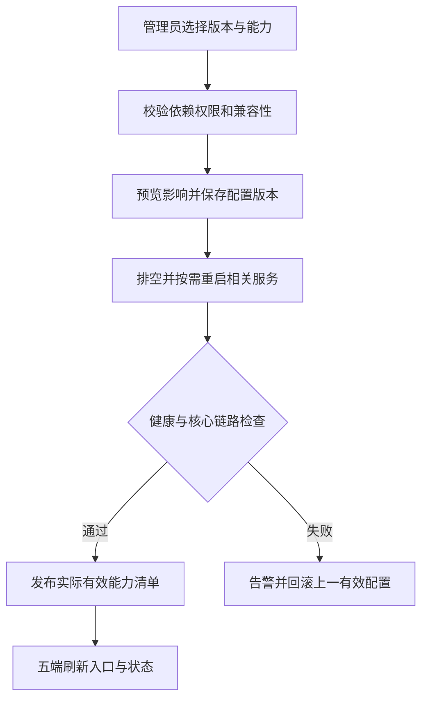
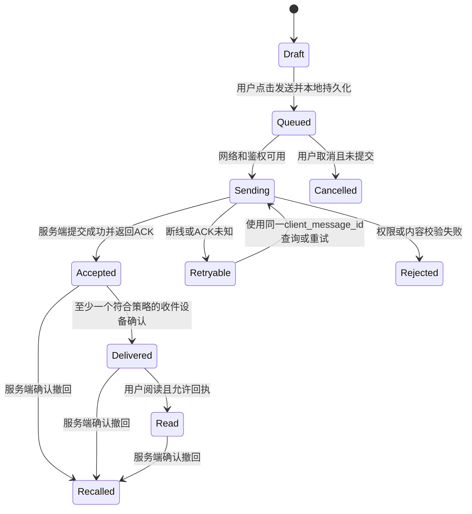

# IM需求明细表

[toc]

---

## 🔥 前言

打造免费、完整源码公开、可独立部署且可嵌入其他产品的通用 IM。基础版解决简单可靠收发，标准版完成正常社交聊天，高级版解决特殊场景；三个版本按阶段增量继承，共用同一源码体系和通信合同。终端包含 CLI、[**Android**](https://developer.android.com/)、[**iOS**](https://developer.apple.com/ios/)、[**鸿蒙**](https://developer.huawei.com/consumer/cn/) 和 [**Web**](https://developer.mozilla.org/zh-CN/docs/Web)。文档基线：**2026年10月7日**。

本文只定义最终产品行为、阶段边界和验收合同。微服务拆分、技术及版本、硬件配置、数据库表和字段见 [IM后端架构表](./IM后端架构表.md)；逐项实测结果见 [IM功能验收表](./IM功能验收表.md)。当前完成的是文档设计，软件尚未实现，三个阶段尚未验收或封版。

| 阅读入口 | 内容 |
| --- | --- |
| [产品与三阶段](#chapter-1) | 版本继承、阶段目标、工程标段、源码交付 |
| [关键规则](#chapter-2) | 后端开关、账户墓碑、邮件 OTP、通讯录、机器人、业务中间件、会员等级 |
| [前端需求](#chapter-3) | FE-001～102，全端可见行为与异常 |
| [状态与权限合同](#chapter-4) | 演示隔离、消息状态、同步、撤权 |
| [后端能力需求](#chapter-5) | BE-001～036，应提供的服务能力 |
| [安全与平台](#chapter-6) | SEC-01～12及加密、发布边界 |
| [参数与兼容组合](#chapter-7) | 可配置项目、依赖和互斥 |
| [验收场景](#chapter-8) | T-01～26，端到端异常与恢复 |
| [交付与验收](#chapter-9) | 206 项验收台账、源码与证据要求 |

## 一、产品定位、继承版本与阶段目标 <a href="#前言" style="font-size:17px; color:green;"><b>🔼</b></a> <a href="#🔚" style="font-size:17px; color:green;"><b>🔽</b></a>

### 1.1、免费公开与完整源码 <a href="#前言" style="font-size:17px; color:green;"><b>🔼</b></a> <a href="#🔚" style="font-size:17px; color:green;"><b>🔽</b></a>

当前及长期可预见阶段，全部版本免费使用、完整源码公开，不以闭源核心、私有构建包或项目方授权服务器作为运行门槛。部署产生的服务器、域名、邮件、平台推送、存储和带宽费用属于运行成本，应在架构与部署说明中列明。

| 交付对象 | 必须交付 |
| --- | --- |
| 产品代码 | CLI、Android、iOS、鸿蒙、Web、管理后台、后端微服务、自建 SDK、机器人平台与业务中间件源码 |
| 协议与数据 | API、事件、能力 ID、消息格式、错误码、状态机、权限合同、数据库字段、迁移与配置样例 |
| 构建与运维 | 精确依赖及许可证、锁定文件、镜像信息、构建/部署脚本、备份恢复、升级回滚、测试用例、告警与排障说明 |
| 依赖边界 | 核心消息/音视频/SDK 能取得源码并可重建；平台服务采用有文档的适配接口；列清自研、开源与外部服务范围 |

采用原创设计与独立实现，可依法使用开放协议和开源组件；不复制竞品私有代码、素材和商标。AI 生成代码仍需检查来源、许可证、正确性和维护质量。操作系统、硬件固件及厂商推送服务的源码不属于自研产品能交付的范围。

未来收费或发布闭源版本由用户另行决定，本期收费、订阅和广告投放均不启用。自研产品正式许可证在首次公开发行前确定；第三方许可、外部贡献者权利和已经授予的许可需要保留。依赖许可审计见 [架构依赖基线](./IM后端架构表.md#dependency-versions)。

### 1.2、基础 → 标准 → 高级的继承边界 <a href="#前言" style="font-size:17px; color:green;"><b>🔼</b></a> <a href="#🔚" style="font-size:17px; color:green;"><b>🔽</b></a>

统一称为 **基础版（轻量）→ 标准版（中度）→ 高级版（重度/定制）**。标准版包含基础版，高级版包含标准版；代码增量演进，身份、历史和消息合同保持可兼容。运行时选基础预设可以关闭扩展，但不代表建立另一套产品或另一套用户库。

| 版本 | 默认功能边界 | 扩展与关闭规则 |
| --- | --- | --- |
| 基础 | 邮箱注册/绑定与密码、邮件 OTP、账号恢复、设备与会话撤销、资料与手工联系人；一对一文字/emoji/图片、会话/历史、草稿、待发重试、删除/撤回、未读、离线补同步；基础通知、拉黑举报、隐私/数据权利；CLI 与四图形端；后台能力配置、封禁/墓碑及恢复；最小 SDK 与业务中间件 | 默认不开群、语音条、普通文件/视频、音视频通话、机器人执行与商业模块；安全、可靠性、管理审计与探针完整交付 |
| 标准 | 基础全部，加正常社交聊天：经确认的通讯录发现/同步、名片、状态；语音/视频/文件/表情；编辑、回复/线程/反应、转发、消息置顶/收藏、搜索、定时消息；群/角色/邀请/公告/@/话题/频道；单聊与群语音视频、位置分享、历史/备份恢复；开放机器人及默认机器人、批量/定时任务；非付费会员等级与能力表 | 普通聊天无需钱包、区块链、AI 或购买权限即可构成完整产品；每项仍能由后台配置 |
| 高级 | 标准全部，加按场景启用的 E2EE、阅后即焚、特殊保留、企业工作区、复杂社区、客服、专项会议/录制、AI、优惠券/积分、支付红包/资金账务、钱包身份、去中心化/联邦适配等 | 新增模块逐项显式配置；特殊能力各有安全及适用条件。选择高级预设不自动启动全部扩展，也不自动开启收费 |

基础的安全传输、密码保护、权限校验和存储保护始终启用。高级 E2EE 是会话安全模式，与基础加密分开。一个 FE 编号含多种能力时，实施拆成稳定子能力，例如 `message.image`、`message.video`、`rtc.group_call`、`meeting.recording`；阶段验收按子能力和平台记录。

### 1.3、三阶段工作目标与封版门禁 <a href="#前言" style="font-size:17px; color:green;"><b>🔼</b></a> <a href="#🔚" style="font-size:17px; color:green;"><b>🔽</b></a>

| 阶段 | 明确目标 | 本阶段交付与通过条件 |
| --- | --- | --- |
| 第一阶段：基础建设与封版 | 交付可真实使用的简单可靠 IM，同时形成后续可继承的基座 | 身份/邮件 OTP、可靠图文、五端基础互通、管理生命周期、Redis、独立微服务、最小业务中间件、完整源码/部署/数据迁移及探针；基础范围逐项通过、故障恢复和安全必测通过后封版 |
| 第二阶段：标准增量与封版 | 在已封版基础上完成正常社交聊天全功能 | 群与标准媒体/RTC、通讯录授权同步、机器人平台与计划任务、会员等级配置、普通聊天完整交互；第一阶段回归保持通过，新增标准范围通过后封版 |
| 第三阶段：高级定制增量 | 在已封版标准版上解决已选定的特殊业务 | 按定制模块明确范围、依赖、数据和安全模式，分别验收；基础和标准回归仍通过，新增模块通过后形成高级发布基线 |

第一阶段可以先以 CLI 打通端到端链路，再接四个图形端；**仅 CLI 通过不能代表完整基础版封版**。Android/iOS/鸿蒙/Web 的目标系统与设备清单在实施计划中锁定，图形界面不要求 CLI 模拟；五端均遵守相同身份、鉴权、消息与同步合同。

封版必须锁定源码修订、协议/消息格式、数据库迁移、依赖、构建/部署材料、配置预设、能力矩阵和验收证据。没有通过证据不能写成“已封版”。封版后的修复形成新补丁基线，不覆盖原记录；标准/高级从上一基线增量演进，迁移、回滚和禁用扩展仍须保护已有消息、密钥和删除事实。具体门禁见 [验收表阶段规则](./IM功能验收表.md#phase-gates)。

### 1.4、工程标段与交付边界 <a href="#前言" style="font-size:17px; color:green;"><b>🔼</b></a> <a href="#🔚" style="font-size:17px; color:green;"><b>🔽</b></a>

标段按功能域分工，通过协议、事件和可验收结果交接；后端按域使用独立微服务。标段是交付责任单元，可以包含多个相关服务；不把每个按钮拆成独立进程。各域数据私有化、部署拓扑与硬件在 [后端架构](./IM后端架构表.md#service-boundaries) 中独立定义。

| 标段 | 工作范围 | 依赖与交付物 | 验收重点 |
| --- | --- | --- | --- |
| I-01 身份与安全 | 邮箱/密码/OTP、设备、恢复、管理员封禁/墓碑/恢复 | 邮件域名与通道、身份 API/权限合同、管理界面 | OTP 单次有效、全会话撤销、管理员独占与审计 |
| I-02 消息与同步 | 会话、可靠文本/图片、幂等、离线/多端、删除/未读 | I-01；消息/事件合同、恢复用例 | ACK 未知重试、乱序补洞、删除不复活 |
| I-03 五端基础 | CLI、Android、iOS、鸿蒙、Web 的基础功能和无障碍 | I-01/02；五端能力矩阵、构建包与 CLI 文档 | 真服务互通、平台差异、三档字体与离线恢复 |
| I-04 嵌入与中间件 | 最小 SDK、宿主身份映射、业务资源绑定、回调 | I-01/02；独立中间件源码/API/接入示例 | 租户隔离、绑定幂等、宿主故障不阻塞聊天 |
| I-05 平台与基础封版 | 配置、Redis、微服务部署、数据迁移、探针/告警/备份 | I-01～04；运维手册、依赖/硬件表、封版清单 | 恢复演练、源码可重建、基础全部适用项通过 |
| II-01 标准聊天 | 联系人同步、群/频道/话题、名片、完整消息交互 | 基础封版；增量协议与五端页面 | 权限变化、群历史边界、搜索与同步 |
| II-02 媒体与通话 | 语音/视频/文件、单聊/群 RTC、正常通话控制 | II-01 与媒体服务；格式矩阵和网络预算 | 取消/接听竞争、弱网、权限/系统中断 |
| II-03 机器人自动化 | Bot API、命令/事件、默认机器人、批量/定时/计划 | 基础接口合同；外部机器人示例与调度管理 | 授权、幂等、取消/撤权、宕机恢复 |
| II-04 会员能力 | 最大等级 N、每级能力表、继承和配额 | 基础能力目录；配置界面与策略 API | 能力单调增加、继承锁定、变更原子生效 |
| II-05 标准封版 | 标准集成、迁移/停用、全端与基础回归 | II-01～04；标准封版清单 | 新增范围与基础回归全部适用项通过 |
| III-01 特殊隐私 | E2EE、阅后即焚、加密备份与专门保留 | 标准封版；协议与密钥威胁模型 | 不降级明文、设备撤销、到期清理 |
| III-02 组织与协作 | 企业/客服/复杂社区、专项会议及定制机器人工作流 | 标准封版；租户/组织与人员授权 | 个人/企业边界、来宾及管理员权限 |
| III-03 营销与财务 | 优惠券/积分，按立项启用资金与红包 | 标准封版；独立业务服务与账务接口 | 并发、幂等、核销/冲正/对账 |
| III-04 外部协议 | 钱包身份、去中心化、联邦/桥接 | 标准封版；明确网络、协议和版本 | 重放/重组、断网、信任与删除边界 |
| III-05 AI与高级封版 | 可选 AI/定制扩展、专项审计和继承回归 | 已选高级标段；数据授权及发布基线 | 授权外发、成本/隐私、基础/标准回归 |

## 二、关键产品规则与开放能力 <a href="#前言" style="font-size:17px; color:green;"><b>🔼</b></a> <a href="#🔚" style="font-size:17px; color:green;"><b>🔽</b></a>

### 2.1、后台开关决定能力与前端入口 <a href="#前言" style="font-size:17px; color:green;"><b>🔼</b></a> <a href="#🔚" style="font-size:17px; color:green;"><b>🔽</b></a>

后台提供基础/标准/高级预设、细粒度能力树、参数、依赖、互斥和期望/实际状态。每项说明是否即时生效、需要重连还是需要重启相关服务；保存前预览影响，初始化和核心链路检查通过后发布有效能力清单，失败报警并回滚。

**实际可用能力 = 客户端已支持能力 ∩ 服务端有效配置 ∩ 会员能力策略 ∩ 当前身份/资源权限 ∩ 适用地区与安全规则。** 基础阶段的会员策略为默认开放基线；标准阶段才启用自定义等级。客户端只展示当前交集，不能因服务端勾选而获得尚未交付的代码。服务端验证所有输入与权限，包括备注、昵称、偏好等普通数据。

配置须包含稳定能力 ID、模块/阶段、版本、默认值、类型/范围、依赖/互斥、作用范围、最低客户端版本、变更人与理由、生效方式、失败/回滚记录。用户隐私与授权不能被管理员用业务开关越权替代；关闭功能时拒绝新业务，但保留必要历史阅读、取消、恢复和清理入口。

扩展未启用时不启动其服务进程或专属任务；前端不初始化其页面与引擎。已成立的删除、投递、结算等责任由受控收尾组件继续执行。按相同负载测量启动、常驻内存、CPU 和首次使用延迟后判断节省，不能仅凭“未 init”宣称运行效率必然提高。详见 [模块生命周期](./IM后端架构表.md#module-lifecycle)。

### 2.2、管理员封禁、账户墓碑与恢复 <a href="#前言" style="font-size:17px; color:green;"><b>🔼</b></a> <a href="#🔚" style="font-size:17px; color:green;"><b>🔽</b></a>

| 状态/操作 | 产品行为 | 操作权限与恢复边界 |
| --- | --- | --- |
| 正常 | 按有效配置、关系与角色正常使用 | 普通用户不能改变运营状态 |
| 封禁 | 立即阻止新的登录/通信准入，显示原因、期限及申诉；保留数据按既定策略处理 | 仅具备封禁权限的管理员操作；解封同样鉴权、二次验证和审计，恢复后重新登录 |
| 墓碑 | 保留稳定身份占位与历史引用，隐藏正常资料/发现入口，禁止新通信和身份重新占用 | 仅具备墓碑权限的管理员执行；进入墓碑前预览数据/成员/机器人影响。恢复需明确可恢复范围与期限 |
| 恢复墓碑 | 在数据仍存在且允许恢复时回到有效状态，重新核验身份和会话 | 仅管理员操作；不恢复旧令牌、被删除内容、过期即焚消息或已撤销密钥 |
| 注销/物理删除 | 用户可按数据权利发起；按照确认的处理范围、期限及必要保留执行 | 与管理员墓碑分开。不可恢复的删除不得由“恢复墓碑”按钮反向还原 |

封禁/墓碑必须联动撤销设备会话、实时连接和推送权限，并暂停或取消相关机器人、定时任务与外部授权；各服务按最新账户状态重新鉴权。新准入的阻止与已准入工作的排空分别显示，撤权竞争窗口及完成条件由架构合同限定，不宣称跨微服务全球瞬时原子。恢复墓碑保留原有独立处罚，不自动解封；需要解封时另行执行相应管理员操作。操作记录操作者、理由、目标、前后状态、关联工单、时间和结果。并发请求、服务重启和恢复不允许旧凭证复活；共享 IP 不作为永久封禁所有账户的依据。

### 2.3、自建邮件 OTP 与密码保护 <a href="#前言" style="font-size:17px; color:green;"><b>🔼</b></a> <a href="#🔚" style="font-size:17px; color:green;"><b>🔽</b></a>

第一阶段自建用于验证通知的邮件发送服务，用户绑定其已有邮箱，不索取第三方邮箱密码，也不要求为每个用户建设新的邮箱收件系统。邮件一次性验证码（OTP）用于注册、邮箱绑定/换绑、登录验证、恢复及适用的敏感操作再验证；每次挑战绑定租户、账户/目标邮箱、用途、有效期和尝试次数，成功后只能消费一次。重发废弃旧码，发送与验证分别限速；并发验证、退信与延迟投递不得使旧码再次有效。

邮件服务与身份认证分工：邮件负责投递，身份服务负责生成与验证。SMTP 接受不代表用户收到，邮箱验证完成之前不能授予已验证身份。邮箱换绑重新认证并验证新邮箱，通知旧可信渠道；不能删除最后一种有效登录/恢复方式。邮件 OTP 是一种较弱验证手段，不能将单独邮件码宣传为强 MFA；管理员处罚、资金、密钥变更等操作按独立强验证策略执行。登录/恢复回复避免账号枚举，他人发起恢复不能自动锁定受害者账户；OTP 或密码恢复不能解封或恢复墓碑。[账户恢复依据](https://cheatsheetseries.owasp.org/cheatsheets/Forgot_Password_Cheat_Sheet.html)

用户密码采用 [**Argon2id**](https://cheatsheetseries.owasp.org/cheatsheets/Password_Storage_Cheat_Sheet.html) **加盐单向哈希**，数据库只保存哈希、算法/参数版本，不保存明文或可逆“加密密码”；客服和管理员不能查看原密码。密码重置生成新凭证并撤销旧会话，成本参数和邮件服务器部署见 [认证及邮件架构](./IM后端架构表.md#email-delivery)。本项目代码和开源邮件软件可免费自托管，域名、机器、维护与送达成本仍存在。[邮箱验证依据](https://cheatsheetseries.owasp.org/cheatsheets/Email_Validation_and_Verification_Cheat_Sheet.html)

### 2.4、确认后同步通讯录好友 <a href="#前言" style="font-size:17px; color:green;"><b>🔼</b></a> <a href="#🔚" style="font-size:17px; color:green;"><b>🔽</b></a>

通讯录发现/同步在第二阶段交付。先申请系统权限，再由用户在 IM 内确认上传用途、字段、范围和保留期限；预览并选择联系人后才发起匹配。系统曾授予通讯录权限不等于允许永久后台上传。匹配展示结果，用户再确认发送好友申请或按已选择的关系策略处理，不默认把全部匹配对象添加为好友或允许名单。

支持有限联系人授权、增量同步、取消/撤回、删除已上传发现数据、重新授权和同步结果明细；记录同意版本与时间。拒绝通讯录仍可按用户名/二维码手工加好友。通讯录散列也不能当作绝对匿名数据，发现接口须防批量枚举并尊重对方可发现性。CLI 的联系人导入同样先预览、明确确认并可取消，不能利用非图形端绕过授权。

### 2.5、开放机器人与默认功能 <a href="#前言" style="font-size:17px; color:green;"><b>🔼</b></a> <a href="#🔚" style="font-size:17px; color:green;"><b>🔽</b></a>

第一阶段定义机器人身份、命令、事件、授权和回调协议；第二阶段交付完整 Bot API 与默认机器人。借鉴 [**Telegram**](https://core.telegram.org/bots/api) 的开放机器人模式，允许高级用户创建/编辑机器人资料、命令与权限，用自己的程序接收事件并执行允许的 IM 动作。机器人是独立、明确标识的身份，不能伪装用户或管理员。

| 开放能力 | 产品要求 |
| --- | --- |
| 创建与编辑 | 所有者、名称/说明、命令、事件订阅、权限、回调地址、密钥轮换/撤销；公开/私有范围可配 |
| 开发接入 | 公开 API/SDK/事件格式与示例；签名 Webhook 或拉取事件模式；版本、错误码、限额和重试文档 |
| 权限 | 所有者/租户、显式加入的会话、事件和动作 scopes；私聊/群读权限分别授予，默认无权读取全部历史 |
| 外部程序 | 用户程序独立运行，通过开放接口调用；不在 IM 核心服务中直接执行用户提交的脚本。图形工作流或隔离沙箱作为高级扩展另行验收 |
| 撤销与管理 | 用户可停止订阅、移出会话或撤销授权；管理员可停用违规机器人；其待执行任务随权限状态重新判定 |

默认机器人采用以下设计起点，全部源码公开，可禁用和替换；不依赖付费模型才能运作：

| 默认机器人 | 基础功能 | 默认授权范围 |
| --- | --- | --- |
| 帮助机器人 | 命令发现、使用说明、服务状态链接 | 用户主动发给机器人的指令；无私聊历史读取 |
| 个人提醒机器人 | 创建/查看/取消个人提醒、时区和重复规则 | 用户本人提醒和主动选择的消息引用 |
| 计划发送机器人 | 预览并确认定时/批量发送、查看结果、取消未执行任务 | 仅授权目标会话；受用户权限、限速与屏蔽规则约束 |
| 群助手机器人 | 欢迎语、群规则、公告提醒、投票；管理动作默认关闭 | 群管理员显式配置；禁言/移除等动作需单独授予相应权限 |

机器人不等于 AI：规则、消息转发和定时任务可以通过普通代码完成。E2EE 会话不允许机器人默认获得明文或成员密钥；需要可信机器人参与时，应作为明确授权的会话参与者显示并遵守所选协议。机器人拥有者的权限不能超过当前账户、会话角色和部署能力。

### 2.6、批量、定时与计划任务 <a href="#前言" style="font-size:17px; color:green;"><b>🔼</b></a> <a href="#🔚" style="font-size:17px; color:green;"><b>🔽</b></a>

支持一次性、周期性、批次任务；配置目标、时区、触发时间/规则、开始/结束、执行上限、重试和失败处置。发送前预览收件范围与内容并明确授权，批次记录目标快照，并在实际执行时重新过滤有效授权；不能向未同意的陌生人无限群发。批量联系人管理、消息发送与群操作使用各自权限，不通过机器人绕过拉黑、群限制或封禁。开放接口与通用调度是两项分别交付的能力。[机器人命令与权限参考](https://core.telegram.org/bots/features#commands)

任务可查看、暂停、取消、重新排期和审计；重复投递不得重复执行业务。执行时重新验证账户、机器人、成员、权益、资源和会话安全模式；权限撤销后取消或失败，不继续使用创建时的旧授权。服务宕机、重启、时区/DST 变化、错过时间、部分批次失败须有确定策略；已完成动作不虚称可撤销。E2EE 排期不得由服务端解密修复密文，失效时暂停并请求受权端重新加密。

### 2.7、嵌入其他产品与独立业务中间件 <a href="#前言" style="font-size:17px; color:green;"><b>🔼</b></a> <a href="#🔚" style="font-size:17px; color:green;"><b>🔽</b></a>

提供可嵌入 SDK、公开 API、事件和示例，使宿主产品把 IM 功能交给本项目承担。可给一个宿主单独部署 IM 微服务/服务器，也可共享集群并严格隔离租户；使用同一公开产品源码与合同。

宿主与 IM **代码、数据库及发布周期分别维护**，通过独立中间件绑定用户、订单/客户/工单等业务资源与会话。中间件只持有必要的身份映射和绑定信息，调用公开接口；不嵌入宿主业务源码，不直写 IM 私有表，也不把业务字段不断塞入消息核心表。业务卡片通过带版本的结构化消息表达，点击动作仍回到对应业务权威服务验证。

| 绑定合同 | 必须定义 |
| --- | --- |
| 身份 | 应用/租户/宿主账号到 IM 身份的服务端映射；短期凭据兑换、签发方/受众/用途/到期与撤销；不信任前端传来的 user_id |
| 资源 | 业务类型/ID与会话的映射、参与者及可见性；创建、更新、解除和删除的幂等规则；跨租户冲突拒绝 |
| 数据进出 | 聊天事件/API按授权推送或查询；范围、字段、留存和用途明确，E2EE不因此变成可读明文 |
| 事件 | 签名、事件ID/版本、超时、重试、去重、失败查询/补偿；回调不阻塞聊天核心事务 |
| 故障隔离 | 宿主/中间件宕机不导致已接受消息丢失；恢复可重放许可事件，不重复建会话或重复执行业务 |
| 生命周期 | 宿主用户注销、解绑、封禁与租户停用对 IM 映射/权限/历史的处置；保留合法数据权利入口 |

第一阶段交付最小身份兑换、单聊绑定及签名事件回调；第二阶段扩展群/机器人等已交付能力；第三阶段按定制业务增加协议适配，保持隔离边界。

### 2.8、会员最高等级与继承勾选 <a href="#前言" style="font-size:17px; color:green;"><b>🔼</b></a> <a href="#🔚" style="font-size:17px; color:green;"><b>🔽</b></a>

会员等级是后台可配置的能力策略，与基础/标准/高级运行版本分开；当前免费，不由支付自动赋予等级。后台可定义最高等级 **N**、等级名称和分配规则，等级 0 为基础权益；每个等级呈现一张能力配置表。

| 配置规则 | 必须实现 |
| --- | --- |
| 逐级继承 | 第 k 级继承第 k−1 级所有允许能力；继承项自动勾选并标明来源，在高等级不能取消，新增能力可自主勾选 |
| 配额单调 | 存储/文件/人数/频率等同一口径配额不小于低等级；“不限”按最大权限语义处理，不用负数比较误减权限 |
| 能力边界 | 只分配服务端已实现且当前部署/预设允许的能力；账号封禁、对象角色、隐私授权、区域和安全条件继续生效 |
| 变更发布 | 修改低等级后计算高等级继承结果，预览受影响用户/配额，统一发布配置版本；前后端最终使用同一生效版本 |
| 降级与降低 N | 显示受影响用户和迁移规则，明确确认后执行；已有消息/附件/在途任务按保留和收尾合同处理，不为达配额直接删除 |
| 审计与纠错 | 等级分配、能力与配额变更、继承结果、操作者和回滚记录可查；不允许数据库直改绕过校验 |

“每级一张表”指后台的等级能力配置界面；数据库采用规范化等级/能力关系，字段见 [数据库设计](./IM后端架构表.md#data-design)。标准版完成这套免费能力策略，高级版增加可分配的定制能力。未来收费订阅、数字购买、广告作为独立接口预留，当前不自动启用。

### 2.9、五端范围、原生优先与字体 <a href="#前言" style="font-size:17px; color:green;"><b>🔼</b></a> <a href="#🔚" style="font-size:17px; color:green;"><b>🔽</b></a>

各端共享协议和验收标准，原生能力单独实现。优先采用当前主流、稳定且可维护的原生路径；实际框架版本在实施时锁定。CLI 以文本/结构化输入输出支持基础收发、图片文件路径、历史、同步、身份和管理脚本接入，不要求显示图形气泡、摄像头预览或移动系统通知。

| 能力族 | Android | iOS | 鸿蒙 | Web | CLI |
| --- | --- | --- | --- | --- | --- |
| 基础身份/联系人/图文/历史/同步 | 完整基础 | 完整基础 | 完整基础 | 完整基础 | 完整基础，图片以路径上传/下载 |
| 通知与后台 | 按系统验证 | 按系统验证 | 按系统验证 | 按浏览器验证 | 在线事件/轮询及可选终端提示，不承诺后台常驻 |
| 标准群/媒体/机器人/能力策略 | 原生交互 | 原生交互 | 原生交互 | 浏览器交互 | 数据/控制 API与脚本交互，媒体保存文件 |
| RTC/地图/专门会议 | 按设备验证 | 按设备验证 | 按设备验证 | 按浏览器验证 | 明确不提供图形/音视频采集；已交付控制接口可使用 |
| 私密模式与备份 | 按端安全实现 | 按端安全实现 | 按端安全实现 | 按浏览器边界实现 | 选定 CLI 支持的安全协议才可读写，不转明文兼容 |

平台与最低系统范围必须记录，能力不支持时说明原因；后台勾选不能超越操作系统/浏览器能力。所有端同样保护凭据、本地数据与待发队列，并接受弱网/重启/撤权测试。现代原生技术与后端版本见 [架构技术基线](./IM后端架构表.md#quality-native)。

### 2.10、三档字体与无障碍 <a href="#前言" style="font-size:17px; color:green;"><b>🔼</b></a> <a href="#🔚" style="font-size:17px; color:green;"><b>🔽</b></a>

图形端提供 **小字体、标准字体、大字体**，默认标准，不提供任意滑杆；即时生效并持久化。正文、标题、按钮和提示按语义重排，核心内容不能裁剪，不能缩小正文抵消用户的大字体选择。系统更大的辅助字号采用换行、滚动或专门布局，支持读屏、足够点击区域、键盘焦点、减少动态效果和必要的 RTL。

无障碍意味着老人、视力较弱者以及使用读屏/键盘的人仍能完成核心流程。发送、搜索、加好友、入群、接听、恢复账号及管理确认覆盖三档与系统辅助字号。CLI 尊重终端字号和屏幕阅读器，提供纯文本/无色与结构化输出，不依赖仅以颜色表达状态。字体属于用户偏好，会员等级和后台预设不能关闭必要的无障碍能力。

## 三、前端全量需求与后端对应 <a href="#前言" style="font-size:17px; color:green;"><b>🔼</b></a> <a href="#🔚" style="font-size:17px; color:green;"><b>🔽</b></a>

### 3.1、账号、登录和设备（FE-001～010） <a href="#前言" style="font-size:17px; color:green;"><b>🔼</b></a> <a href="#🔚" style="font-size:17px; color:green;"><b>🔽</b></a>

| 需求编号 | 功能与前端合同 | 对应后端 | 关键验收 |
| --- | --- | --- | --- |
| FE-001 | 注册、登录、退出、账号存在性处理；手机号含国际代码，邮箱验证；本人修改密码，手机/邮箱绑定、换绑、解绑；错误提示避免批量枚举账号 | BE-001、BE-002 | 换号保持原user_id；新凭证验真、旧可信通道通知，解绑不能移除最后有效登录/恢复途径；注册中断、旧号遗失/回收、绑定冲突均可验证 |
| FE-002 | 基础采用密码/邮件 OTP 登录验证；短信为可替换渠道扩展；验证码倒计时、重发、风险挑战、限流提示 | BE-001、BE-021、BE-035 | 服务端签发与单次验证；客户端绕过、跨用途/邮箱重放、并发与过期均被拒绝，邮件失败不误标验证成功 |
| FE-003 | [**Apple**](https://developer.apple.com/sign-in-with-apple/) 及审核通过的第三方登录；绑定/解绑、授权撤销、重复身份合并提示 | BE-001、BE-002 | 不能按邮箱相同直接合并账号；保留至少一种有效登录途径 |
| FE-004 | 通行密钥、强验证及新设备验证；系统验证失败可使用受控恢复途径 | BE-001、BE-002 | 验证挑战一次性，凭证可删除，跨设备登录语义清楚 |
| FE-005 | 找回密码、恢复码、可信设备恢复、人工申诉入口；凭证变更重新认证，风险冷静期与撤销旧会话 | BE-001、BE-002、BE-021 | 重置后旧会话按策略失效，客服无法查看原密码；新号码持有人不能自动获得旧账号或E2EE历史 |
| FE-006 | 场景所需实名、年龄/企业身份认证；资料脱敏、进度、失败原因、复核 | BE-003、BE-021、BE-030 | 非必需通信功能不强收身份证；验证材料保留期限可查 |
| FE-007 | 本地应用锁、系统生物识别、锁屏预览控制；本地手势为可选弱保护 | BE-002、BE-018 | 锁定态不能从通知/深链进入敏感会话；不上传系统生物模板 |
| FE-008 | 单/多设备策略；设备链接、可信设备确认、扫码登录、历史授权与会话撤销 | BE-002、BE-007、BE-018 | QR 短期且一次性；显示待登录设备并手机确认；撤销后不能继续收发 |
| FE-009 | 设备列表：型号、近似地区、最后活跃、安全事件；新设备提醒、退出指定/全部设备 | BE-002、BE-014 | 不伪造精确地理位置；撤销令牌、连接、推送和密钥权限同步 |
| FE-010 | 登录过期、账号冻结、设备风险、服务维护、Token 刷新与并发请求恢复 | BE-001、BE-002、BE-021、BE-024 | 刷新失败收口为一个登录入口，不重复弹窗，不无限重试 |

### 3.2、资料、好友和消息请求（FE-011～018） <a href="#前言" style="font-size:17px; color:green;"><b>🔼</b></a> <a href="#🔚" style="font-size:17px; color:green;"><b>🔽</b></a>

| 需求编号 | 功能与前端合同 | 对应后端 | 关键验收 |
| --- | --- | --- | --- |
| FE-011 | ID/用户名/昵称、头像、简介；昵称和签名审核；动图/短视频头像为受限扩展 | BE-003、BE-010、BE-021 | 唯一标识与显示名分开；签名长度和计数方式可配置；格式失败有静态兜底 |
| FE-012 | 好友列表、分组/标签、备注、添加来源、删除好友与关系状态 | BE-004 | 删除好友不等于双方删除聊天；两端状态按关系策略一致 |
| FE-013 | ID/用户名/手机号/二维码/群名片搜索与添加申请；搜索隐私设置 | BE-003、BE-004、BE-021 | 关闭手机号搜索后不能被该方式发现；不默认按真实姓名公开搜索 |
| FE-014 | 陌生人消息请求、接受/拒绝/举报、屏蔽附件预加载与危险链接 | BE-004、BE-021 | 未接受请求不能自动来电、读回执或获取在线状态 |
| FE-015 | 系统通讯录权限与 IM 内同步确认；预览并选择联系人，发现匹配结果、确认添加/申请，增量同步、取消与撤回 | BE-003、BE-004 | 不自动上传或添加全部好友/允许名单；撤回停止同步并处理已上传发现数据；拒绝权限仍可手工加好友 |
| FE-016 | 拉黑、解除、允许名单、谁可发消息/来电/加群；可按文本、图片、语音、文件、来电分别设许可；好友与系统封禁分开展示 | BE-003、BE-004、BE-021 | 服务端强制执行，不能只靠前端隐藏按钮；拉黑默认阻断私聊/来电，特殊例外可见且可撤销；群内交互规则明确 |
| FE-017 | 好友/群名片、共同群、资料可见范围；生日等额外资料按需收集 | BE-003、BE-004、BE-011 | 共同群仅展示可见交集；转发名片不授予查看私有资料权限 |
| FE-018 | 在线/最后活跃、正在输入、忙碌/勿扰状态及可见性控制 | BE-003、BE-008 | 状态有有效期；允许关闭；断网与后台不误判为仍持续在线 |

### 3.3、会话与导航（FE-019～025） <a href="#前言" style="font-size:17px; color:green;"><b>🔼</b></a> <a href="#🔚" style="font-size:17px; color:green;"><b>🔽</b></a>

| 需求编号 | 功能与前端合同 | 对应后端 | 关键验收 |
| --- | --- | --- | --- |
| FE-019 | 会话列表、最新摘要、未读/提及、时间排序、未知消息降级 | BE-005、BE-007、BE-008 | 编辑/撤回/删除后摘要正确；隐私模式不泄漏锁屏文字 |
| FE-020 | 会话免打扰、置顶、归档、标记未读、隐藏/移除、通知粒度 | BE-005、BE-008、BE-014 | 标记未读是提醒，不回滚真实阅读游标；不能取消已发出的回执 |
| FE-021 | 草稿、输入恢复、回复目标、附件队列、发送键习惯和输入法适配 | BE-005、BE-006、BE-010 | 崩溃恢复不把草稿自动发出；跨端草稿冲突有明确策略 |
| FE-022 | 历史分页、定位消息、跳到最新、未读分界与返回原位置 | BE-005、BE-007、BE-020 | 删除/过期目标显示原因，不跳到错误消息；加载不改变阅读位置 |
| FE-023 | 全局/会话搜索，中文、英文、拼音索引；按人/日期/媒体/文件过滤 | BE-020 | 拼音误差可解释；E2EE 内容只在授权端索引；结果仍做权限校验 |
| FE-024 | 自己的收藏/笔记会话、收藏夹、文件聚合和跨端查看 | BE-005、BE-010、BE-019 | 收藏是独立副本或引用需声明；原消息删除后的行为一致 |
| FE-025 | 手机单栏、平板/桌面分栏、多窗口、多账号切换、键盘导航 | BE-002、BE-005、BE-007 | 多账号数据库/缓存/通知隔离；切账号不泄漏上一账号内容 |

### 3.4、消息、媒体与一致性（FE-026～040） <a href="#前言" style="font-size:17px; color:green;"><b>🔼</b></a> <a href="#🔚" style="font-size:17px; color:green;"><b>🔽</b></a>

| 需求编号 | 功能与前端合同 | 对应后端 | 关键验收 |
| --- | --- | --- | --- |
| FE-026 | 文本、emoji、提及、链接、安全预览、卡片与未知类型降级 | BE-006、BE-010、BE-013 | Unicode 组合字符计数清楚，超长分段/拒绝统一；富文本不执行脚本 |
| FE-027 | 发送中/已接受/已送达/已读/失败；失败重发、取消队列、离线发送 | BE-006、BE-007 | ACK 丢失后重发同一消息不重复；本地写成功不当作服务端成功 |
| FE-028 | 语音条录制、取消、播放、倍速、续播、未听标记；转写为可选 | BE-010、BE-027 | 录音中断可恢复或明确失败；转写失败不影响原音频；外发转写需知情选择 |
| FE-029 | 图片/动图/视频/文件：选取、编辑、压缩、原图选项、缩略图、上传进度、暂停/重试、断点续传、下载保存；视频预览/播放、暂停、拖动与续播进度 | BE-006、BE-010、BE-019 | 前后端都校验大小/类型；退出会话/切后台再进入可从合法续点播放，明确进度仅本机或跨端同步；过期链接可刷新；元数据去除与原图保留策略清楚 |
| FE-030 | 贴纸、动画、自定义表情包；资源版本、配额、静音、减少动态效果 | BE-010、BE-013 | 动画格式由跨端能力评审决定；不支持时展示可识别静态图，不远程执行代码 |
| FE-031 | 本人视图删除、本地清理、双方撤回，区分时间窗/权限与提示 | BE-009、BE-019、BE-020 | 离线设备补同步后不复活已撤回消息；删除不能保证接收者已保存副本消失 |
| FE-032 | 消息编辑、编辑标记、冲突版本、允许时间和类型 | BE-009 | 两端编辑版本收敛，不能越权编辑他人消息；保留策略按会话类型定义 |
| FE-033 | 引用回复、线程/话题、跳转原消息、表情反应与取消 | BE-009、BE-012、BE-013 | 被引用消息删除后只保留允许的残余信息；重复反应请求幂等 |
| FE-034 | 单条/多选转发、合并转发、来源与说明、禁止转发策略 | BE-009、BE-013 | 不把源会话权限带给新收件人；钱款/登录卡片不能当可重复执行消息转发 |
| FE-035 | 消息置顶、多个置顶列表、定位原文、权限与到期 | BE-011、BE-013 | 顶部显示最新一条或轮播策略明确；个人置顶与全群置顶分开 |
| FE-036 | 本人阅读游标、未读数与对外已读回执分开；多端一致；群回执按用户聚合 | BE-008 | 阅读不倒退；关闭回执仍同步本人未读但不外发已读；群人数按用户而非设备去重，分母和隐私规则明确；大群可关闭逐人回执 |
| FE-037 | 多端增量同步、断线重连、补洞、重复乱序处理、新设备历史与加密状态 | BE-002、BE-007、BE-018、BE-019 | 至少测试重连、撤回后上线、设备时钟错误、旧端升级和游标过期 |
| FE-038 | 定时发送、静默发送、提醒/稍后处理、取消计划与时区；E2EE采用支持该能力的协议/端侧或受控密文调度 | BE-009、BE-014 | 执行时身份/成员/密钥版本有效，否则暂停并请授权设备重加密或明确失败；服务端不得取得正文修复密文；不能把后台未运行误判为计划已发 |
| FE-039 | 投票、活动/事件提醒、任务/待办卡片；选项与变更权限 | BE-013、BE-014 | 一人一票/多选/匿名规则明确；取消活动传播；机器人卡片不能越权写数据 |
| FE-040 | 系统事件：入退群、权限改变、来电未接、公告、服务通知 | BE-011、BE-013、BE-015 | 可信事件由服务端签发，普通用户不能伪造管理消息 |

### 3.5、群、频道和社区（FE-041～048） <a href="#前言" style="font-size:17px; color:green;"><b>🔼</b></a> <a href="#🔚" style="font-size:17px; color:green;"><b>🔽</b></a>

| 需求编号 | 功能与前端合同 | 对应后端 | 关键验收 |
| --- | --- | --- | --- |
| FE-041 | 创建/解散/退出群、群名头像简介、成员上限、群角色与可见规则 | BE-011、BE-024 | 群主/管理员/成员权限明确；万人成员和在线压测分别报告 |
| FE-042 | 邀请、入群申请、链接/二维码、过期撤销、反刷、历史可见起点 | BE-011、BE-021 | 被踢成员旧链接不可绕过封禁；退群后媒体链接失效策略生效 |
| FE-043 | 转让群主、任命管理员、踢人、禁言、全员禁言、慢速模式、权限提示 | BE-011、BE-021、BE-022 | 前后端同权限；失去权限后旧页面操作被拒绝且刷新状态 |
| FE-044 | 群公告、置顶、群昵称/成员标签、文件/媒体、搜索与提及 | BE-011、BE-013 | 全员提及有角色/频率限制；公告修改和到期一致 |
| FE-045 | 群话题/子频道、频道订阅/广播、评论权限、分类与发现 | BE-012、BE-020 | 私有频道不可被非成员搜索内容；订阅不等于双向好友关系 |
| FE-046 | 社区容纳多个群/频道，分层角色、规则入门、审核与内容分区 | BE-011、BE-012、BE-021 | 社区成员与频道权限独立，退出社区撤销相关能力 |
| FE-047 | 大群通知/回执降级、管理员工具、风险提示、屏蔽与举报 | BE-008、BE-012、BE-014、BE-021、BE-024 | 不能给每个成员推送所有输入状态和逐人已读；限流有可理解反馈 |
| FE-048 | 企业工作区、组织目录、游客、单点登录、保留/导出政策提示 | BE-003、BE-011、BE-030 | 企业空间与个人空间数据隔离；管理员能力和会话可见模式事前告知 |

### 3.6、音视频、会议与位置（FE-049～057） <a href="#前言" style="font-size:17px; color:green;"><b>🔼</b></a> <a href="#🔚" style="font-size:17px; color:green;"><b>🔽</b></a>

| 需求编号 | 功能与前端合同 | 对应后端 | 关键验收 |
| --- | --- | --- | --- |
| FE-049 | 单人语音/视频呼叫、取消、拒绝、未接、通话记录、权限引导；隐私通话模式按策略强制中继 | BE-014、BE-015、BE-016 | 呼叫超时和取消可靠传达；失败不产生持续响铃；陌生人来电接听前不交换可暴露对端地址的候选；中继失败不静默改直连 |
| FE-050 | 群语音/视频：邀请、房间、举手、主持人、禁麦、移除、加入权限 | BE-011、BE-015、BE-016 | 上麦人数、观看人数、房间数分别限制；踢出后不能继续订阅媒体 |
| FE-051 | 麦克风/摄像头切换、扬声器/耳机/蓝牙、前后摄像头、弱网降级、视频质量 | BE-016、BE-024 | 自动适配优先；当前免费，部署/能力配置限定预算和质量上限，不能保证网络或设备条件之外的清晰度 |
| FE-052 | 单线忙线、多线等待、保持/恢复、电话打断、系统来电集成与跨设备接听 | BE-002、BE-014、BE-015 | 一台设备接听后其他设备停止响铃；来电 UI 与服务端状态一致 |
| FE-053 | 通话/播放状态恢复、音频焦点、路由中断、网络切换与异常终止 | BE-015、BE-016 | Wi-Fi/蜂窝切换可恢复或明确结束；系统电话后状态不会卡死 |
| FE-054 | 会议排期、屏幕共享、主持人、成员列表、字幕、录制、会议分钟数 | BE-013、BE-015、BE-016、BE-027 | 录制/云转写先提示参与者；用户拒绝权限可继续使用基础通话 |
| FE-055 | 滤镜、背景虚化、变声、噪声抑制与低端机降级 | BE-016 | 过热/低电时可降低效果；变声/滤镜不能作为远程实名认证凭据 |
| FE-056 | 单次位置和限时实时位置分享、地图卡片、停止共享、过期 | BE-017 | 可立即停止，最小精度/时长可配置；关闭权限不继续采集 |
| FE-057 | 附近的人默认关闭，粗粒度距离、可见时长、屏蔽、反跟踪 | BE-017、BE-021 | 500 米仅是产品参数；不暴露精确坐标或原始 IP；关闭后及时移出发现列表 |

### 3.7、隐私、数据、安全和用户权利（FE-058～067） <a href="#前言" style="font-size:17px; color:green;"><b>🔼</b></a> <a href="#🔚" style="font-size:17px; color:green;"><b>🔽</b></a>

| 需求编号 | 功能与前端合同 | 对应后端 | 关键验收 |
| --- | --- | --- | --- |
| FE-058 | 本地/云历史、缓存体积、媒体清理、保留期、备份/恢复、存储不足提示 | BE-010、BE-019、BE-020 | 保留期限由后台按正文/媒体/备份分别配置，当前不按付费套餐区分；文本/媒体/备份保留分开；清缓存不误删待发附件 |
| FE-059 | 账户注销、数据导出/删除请求、处理进度、合法保留例外说明 | BE-002、BE-019、BE-020、BE-030 | 注销与退出/冻结不同；旧令牌不能复活账号；支付/法定记录保留有独立理由与期限 |
| FE-060 | 传输/本地加密；正文、附件/缩略图、单人通话、群媒体、屏幕共享、备份逐项声明E2EE范围；设备安全码/身份验证、密钥变化提醒 | BE-018 | 不把 TLS 或媒体逐跳加密叫完整E2EE；录制/字幕改变可见性时需参与者明确知情；不兼容功能关闭或提示，不静默降级；所有端支持范围一致 |
| FE-061 | 阅后即焚、一次查看媒体、敏感预览遮挡、计时与到期通知 | BE-009、BE-018、BE-019 | 明确计时起点与最大暂存；日志/通知/备份遵守清理；不作绝对防截屏承诺 |
| FE-062 | 应用锁、敏感操作二次验证、密钥恢复码、恢复失败反馈 | BE-001、BE-002、BE-018 | 登录恢复不代表 E2EE 历史恢复；恢复因子遗失的后果提前说明 |
| FE-063 | E2EE 备份选择、端对端设备迁移、可信设备交接与密钥失效 | BE-002、BE-018、BE-019 | 服务端无法明文还原私密备份；撤销设备不等于抹除该设备已经保存的历史 |
| FE-064 | 隐私政策/协议版本、用途授权、撤回、未成年人策略、举报证据选择 | BE-003、BE-019、BE-021、BE-030 | 不用“后台新增隐私策略”代替用户知情；敏感信息最少收集、用途受限 |
| FE-065 | 手机号/真实姓名/头像/在线/已读/来电/群邀请可见与发现控制 | BE-003、BE-004、BE-008 | 可见性和可搜索性分开；原始 IP/风险设备号不展示给他人 |
| FE-066 | 权限中心、最小授权、相册/通讯录有限访问、权限撤回后的降级 | BE-003、BE-004、BE-010、BE-017 | 拒绝通讯录/定位/相册不影响纯文本通信；不重复诱导授权 |
| FE-067 | 拉黑、举报、诈骗警示、证据预览、进度、申诉与安全帮助 | BE-004、BE-021、BE-022 | 选择证据后才上传；不把整个私密会话自动上报；举报限流防恶意滥用 |

### 3.8、iOS、Web、桌面与体验工程（FE-068～077） <a href="#前言" style="font-size:17px; color:green;"><b>🔼</b></a> <a href="#🔚" style="font-size:17px; color:green;"><b>🔽</b></a>

| 需求编号 | 功能与前端合同 | 对应后端 | 关键验收 |
| --- | --- | --- | --- |
| FE-068 | Android/iOS/鸿蒙/Web 的推送与通知适配、锁屏摘要、通知动作、会话分组、角标、免打扰与深链 | BE-008、BE-014 | 按各端实际支持范围验证；推送丢失/重复/延迟不丢消息；以消息同步修正角标；敏感内容默认受保护，详见[五端能力范围](#client-matrix) |
| FE-069 | 相机/麦克风/照片/定位/通讯录权限；相机临时文件，保存相册由用户选择 | BE-010、BE-017 | 取消拍摄不保存；有限相册可继续选取；录音与来电前按场景请求权限 |
| FE-070 | 前台/后台/被系统终止/离线/锁屏/重新安装的生命周期 | BE-002、BE-007、BE-014、BE-015 | 不依赖后台永久长连接；冷启动补同步；用户强退和系统限制下不作即时送达承诺 |
| FE-071 | Web HTTPS、登录保护、跨标签页协调、拖拽/粘贴上传、浏览器通知与缓存 | BE-001、BE-002、BE-007、BE-010、BE-023 | 防脚本注入和跨站请求；Cookie/Token 策略明确；浏览器不支持的能力可识别降级 |
| FE-072 | 本地数据库/索引、事务、分页、迁移、账号隔离、崩溃恢复与低磁盘保护 | BE-007、BE-019、BE-020 | 十万条消息量级滚动/搜索按目标机压测；索引不泄漏私密明文；异常不无限重建 |
| FE-073 | 多语言、时区、深浅/跟随系统主题、小/标准/大三档字体、系统无障碍缩放、读屏、键盘、减少动态效果、RTL | BE-003、BE-005、BE-013 | 应用不提供无限字体滑杆；三档切换实时生效且持久化，正文与控件按语义缩放，长文不截断关键内容；系统更大辅助字号可通过重排/滚动完成核心流程，详见[关键产品规则](#chapter-2)；排序用服务端事件序 |
| FE-074 | 系统分享面板、Share Extension、二维码/链接、受控第三方分享、跨端交接 | BE-002、BE-010、BE-023 | 分享扩展内不能越过账号锁；邀请参数可撤销，不泄漏Token；禁转发策略有边界 |
| FE-075 | API 请求优先、本地演示回退、完整空态/重载、连接状态和数据来源 | BE-006、BE-007、BE-024 | 无服务可演示、恢复后真数据覆盖；演示与真账号数据隔离，详见第四章 |
| FE-076 | 环境配置、接入点健康与故障切换、离线反馈、代理/网络限制提示 | BE-024 | 安全验证服务端配置，不信任任意域名；Debug 环境切换不进入 Release 用户入口 |
| FE-077 | 版本兼容、最低支持版、非强制/必要强制更新、更新说明、维护状态 | BE-024、BE-025 | iOS 进入商店更新；旧版可读取基本状态/帮助；强更不困住资金和数据权利入口 |

### 3.9、运营、审核、开放集成（FE-078～084） <a href="#前言" style="font-size:17px; color:green;"><b>🔼</b></a> <a href="#🔚" style="font-size:17px; color:green;"><b>🔽</b></a>

| 需求编号 | 功能与前端合同 | 对应后端 | 关键验收 |
| --- | --- | --- | --- |
| FE-078 | 商店发布、登录/UGC/隐私/删除/购买审核、地区开关、审核演示账号 | BE-001、BE-019、BE-021、BE-024、BE-026、BE-030 | 声明 SDK 采集与隐私要求；实际端到端流程和审核资料一致 |
| FE-079 | 后端管理基础/标准/高级预设与细粒度功能开关，能力清单驱动入口；灰度、公告、服务状态与帮助客服 | BE-003、BE-022、BE-024 | 前端按本构建支持能力与后端有效授权的交集展示，不能下发任意执行代码；依赖/互斥/生效方式/重启/回滚可查；修改客户端仍不能绕过服务端校验，详见[关键产品规则](#chapter-2) |
| FE-080 | 邀请码、注册来源/关系来源、二维码和链接归因、活动参数 | BE-004、BE-022、BE-023 | 不自动形成多级资金上下线；过期/欺诈邀请可撤销；不把用户关系公开给邀请人 |
| FE-081 | 嵌入 SDK、宿主身份兑换、独立业务中间件、业务资源绑定与签名事件回调；支持独立 IM 部署 | BE-001、BE-023、BE-032 | 宿主/IM 代码与数据不合并；映射与授权在服务端，租户隔离、绑定幂等，宿主宕机不丢聊天消息 |
| FE-082 | 管理端：举报队列、内容/资料审核、禁言/封禁、申诉、权限审批和审计 | BE-021、BE-022 | 最小权限；处罚说明/期限；禁止无边界私聊监控；敏感操作可追溯 |
| FE-083 | 开放机器人创建/编辑、命令与事件订阅、身份标识、授权审阅、密钥轮换/撤销；默认机器人和外部代码接入 | BE-013、BE-023、BE-031 | 标准阶段可通过公开 API 编程；机器人默认无全历史权限，不执行未受控用户代码；被撤权后任务停止或失败 |
| FE-084 | 开屏资源/品牌信息/广告：本地兜底、远程缓存、频控、跳过、投诉 | BE-010、BE-022 | 首次显示内置资源；仅使用完整有效缓存；通话/发送/支付不能被强制广告打断 |

### 3.10、AI、付费、钱包与 Web3（FE-085～095） <a href="#前言" style="font-size:17px; color:green;"><b>🔼</b></a> <a href="#🔚" style="font-size:17px; color:green;"><b>🔽</b></a>

| 需求编号 | 功能与前端合同 | 对应后端 | 关键验收 |
| --- | --- | --- | --- |
| FE-085 | AI 转写/翻译/摘要/搜索/建议回复；逐功能开关、输入选择、模型处理说明 | BE-020、BE-027 | 默认不自动上传全部私聊；生成内容可编辑并标记；无法处理时保留原消息 |
| FE-086 | 端侧 AI、可选云 AI 和企业知识助手；用量、成本、保留、撤回 | BE-018、BE-023、BE-027 | 私密模式优先端侧或用户明确授权选段；提示注入防护；AI 不自行执行支付/封禁 |
| FE-087 | 免费会员等级/能力策略、等级可见信息和额度提示；最高等级 N 与逐级继承后台配置；收费订阅接口独立预留 | BE-026、BE-034 | 会员等级不等于版本预设；能力不能绕过封禁/角色/隐私；当前不以订阅收费授予能力，后端配置和前端实际状态一致 |
| FE-088 | 未来数字贴纸/主题/额外配额购买的预留模块；权益说明、退款/撤销、购买历史 | BE-026 | 当前关闭，不作为三档聊天能力门禁；未来启用按平台/地区购买规则实施，客户端显示成功不直接授予权益 |
| FE-089 | 法币红包/转账/AA 收款/付款请求；明确确认、状态、过期、退回、争议 | BE-028 | 未点确认不扣款；超时与重复操作不多扣；红包过期退回不是前端计时器记账 |
| FE-090 | 钱包、优惠券领取/核销/过期、积分余额/兑换、账单筛选（目标/金额/日期/类型）、充值/提现 | BE-020、BE-028、BE-029 | 优惠券/不可兑付积分/法币/链上资产分开；券核销和兑换服务端校验且幂等；金额使用最小单位/精确定点；账单来自账务事实 |
| FE-091 | 钱包身份登录/绑定、地址展示/校验、签名确认、身份恢复与解绑 | BE-001、BE-002、BE-029 | 地址不是公开全部关系的许可；签名包含域、链、随机挑战、到期；私钥不上传 |
| FE-092 | 去中心化消息传输、节点发现、密文暂存、离线同步、节点故障与延迟说明 | BE-007、BE-018、BE-023、BE-024、BE-029 | 清楚说明网络/运营边界，不把消息正文上链；能测连接、离线送达与删除限制 |
| FE-093 | 可选链上转账卡片、网络/合约/币种/费用、授权和交易状态 | BE-029 | 广播/待确认/已确认/失败/重组分开；不承诺交易可撤回；公链交易可见性提示 |
| FE-094 | Token-gated 社区、可验证成员资格、链上凭证与可撤销证明 | BE-011、BE-012、BE-018、BE-029 | 检查资格不是读取钱包全部资产；资格失效后撤权；可保留不依赖代币的替代认证 |
| FE-095 | 跨协议/联邦互通、外部桥接身份、会话能力协商与安全提示 | BE-018、BE-023、BE-030 | 身份、权限、加密和删除语义不能完整保持时提示并限制，不静默跨信任边界 |

### 3.11、CLI、开放自动化与阶段管理（FE-096～102） <a href="#前言" style="font-size:17px; color:green;"><b>🔼</b></a> <a href="#🔚" style="font-size:17px; color:green;"><b>🔽</b></a>

| 需求编号 | 功能与前端合同 | 对应后端 | 关键验收 |
| --- | --- | --- | --- |
| FE-096 | CLI 无 GUI 注册/登录/邮箱验证、联系人、文本/图片路径收发、历史/监听/补同步、重试/删除/撤回/未读、退出与凭据撤销；交互及 JSON/退出码机器接口 | BE-001、BE-002、BE-004～009、BE-023 | 同一服务和权限合同，终端重启不丢已提交状态，凭据不放命令参数或日志，脚本超时/重试幂等；支持明确隔离的本地演示 |
| FE-097 | 开放机器人编辑、管理、授权和默认帮助/提醒/计划发送/群助手；高级用户自编程序调用 | BE-023、BE-031 | 默认功能可关闭/替换；令牌与回调验证、会话范围和撤权有效，不因机器人获得所有聊天数据 |
| FE-098 | 批量/定时/周期计划任务，预览目标、时区、结果、失败、暂停/取消/重排；控制台和 CLI/API 操作 | BE-009、BE-031 | 宕机恢复、错过触发/部分失败策略确定；重复事件不重复执行，执行时重新鉴权 |
| FE-099 | 宿主接入管理、身份/资源绑定、解除、数据出入范围和失败重放；独立中间件示例 | BE-023、BE-032 | 宿主 ID 不自证权限，跨租户绑定拒绝，解绑和删号可追踪；IM 与宿主可分别升级 |
| FE-100 | 管理员封禁/解封、墓碑/恢复、原因/期限、申诉和审计；预览可恢复范围 | BE-002、BE-021、BE-022、BE-033 | 普通用户/普通运营无权处罚或恢复；旧令牌/连接/任务被撤销，恢复不还原已物理删除数据 |
| FE-101 | 阶段范围、冻结基线与验收证据管理；标准继承基础、高级继承标准 | BE-024、BE-025 | 基础未通过不能封版；新增功能与历史/协议/迁移兼容，继承回归失效须重新验收 |
| FE-102 | 最大会员等级 N、每级能力勾选表、自动继承与配额、用户分配、变更预览/回滚 | BE-022、BE-034 | 高等级不能取消低等级能力或减少同口径配额；降低 N 显示迁移影响，实际权限仍经服务端校验 |

逐项合同按 [阶段边界](#edition-profiles) 分解适用子能力；默认未开启的扩展仍保留完整需求，不等于已实现。管理端只向受权管理员展示管理能力。

## 四、跨端数据合同与关键状态机 <a href="#前言" style="font-size:17px; color:green;"><b>🔼</b></a> <a href="#🔚" style="font-size:17px; color:green;"><b>🔽</b></a>

### 4.1、服务端优先与本地演示回退 <a href="#前言" style="font-size:17px; color:green;"><b>🔼</b></a> <a href="#🔚" style="font-size:17px; color:green;"><b>🔽</b></a>

所有进入/刷新页面、列表加载与用户写操作都正常请求 API。首屏可以先显示打包的本地演示数据，成功后用服务端响应替换；失败、短超时或解析失败时继续可操作的本地演示。**演示模式必须可识别并使用隔离的演示账号、数据库和命名空间**，不能把模拟消息伪装为已经送达真实收件人。

已登录正式账号优先展示该账号上次已验证的本地缓存和待发队列；接口不可用时，可自动进入明确标记且隔离的演示视图，不能用假历史、余额或未读数覆盖正式账号数据库。切换账号/环境/会话后，旧请求、上传和订阅结果按归属与请求代次丢弃；服务恢复后重新对账，不丢正式 Outbox、真实分页位置或尚未确认的操作，也不把演示编辑合并进真历史。

- 建议交互 API 超时起点为 3～5 秒并可配置；媒体上传与 RTC 分别定义超时，不能共用短超时。
- 正式账号的断网待发消息进入独立 Outbox。网络恢复后只重试这些用户明确提交的消息，并按幂等 ID 对账；演示账号操作不自动回放成真实消息。
- 真请求成功后自动切回服务端状态；删除/撤回、支付、会员、设备撤销等敏感结果须经服务端确认，演示仅显示模拟结果。
- 对所有动态列表提供加载中、有数据、空数据、失败/离线、权限受限和重载状态。iOS 优先复用项目已有 `JobsEmptyAuto` 等完整空态控件。
- 附件/头像等先展示已打包的本地品牌资源或合法的既有资源；远程失败保留兜底。产品素材优先来源为 [**iconfont**](https://www.iconfont.cn/)，无合适素材时使用可追溯官方/开放许可来源，下载到项目资源目录并记出处。
- 部署说明须包含 API 回退、空态、图片兜底、离线预览、演示隔离与服务恢复方法。

### 4.2、消息状态机 <a href="#前言" style="font-size:17px; color:green;"><b>🔼</b></a> <a href="#🔚" style="font-size:17px; color:green;"><b>🔽</b></a>

服务端接受代表已达到合同约定的持久提交点，不代表对方已经收到。发送超时代表结果未知，必须查询/幂等重试，不能直接生成一条新消息。撤回受时间窗和权限约束；“用户视图删除”与该状态机中的“撤回”是不同事件。媒体先上传或采用明确的附件待就绪状态，不能展示永远无法下载的成功消息。

上图的送达表示单聊中收件用户至少一台合格设备收讫。群聊按用户去重展示送达/阅读人数或明确聚合状态，不能将一个成员收到说成全群收到；全员回执的分母采用发送时有权收取的成员集或经声明的其他规则。本人内部阅读游标始终用于未读同步，对外已读事件只在允许时发布。

仅尚未提交的本地队列可以立即取消。发送中或 ACK 未知时，“停止重试”不保证消息没有提交；必须查询权威结果，已接受消息改走撤回流程。服务端取消能力若存在，应定义取消与提交的竞争结果，前端不能先宣称取消成功。

### 4.3、同步、数据对象和冲突规则 <a href="#前言" style="font-size:17px; color:green;"><b>🔼</b></a> <a href="#🔚" style="font-size:17px; color:green;"><b>🔽</b></a>

| 对象/字段 | 必须定义的合同 |
| --- | --- |
| 账号/设备/会话 | `user_id`、`device_id`、`session_id`、`conversation_id` 分离；外部账号映射按应用/租户隔离；标识符不可猜测不等于授权 |
| 消息 | 客户端幂等 ID、服务端消息 ID、会话序号/游标、发送者、类型/协议版本、服务端时间、编辑版本、附件引用、加密模式 |
| 事件流 | 消息、编辑、撤回、删除、已读、成员/角色变化都进入可同步事件；游标过期返回明确的重建方案 |
| 顺序 | 定义会话内权威顺序；不依赖手机时钟，不要求全系统全局唯一严格顺序；断线补洞与去重分别处理 |
| 阅读 | `last_read_seq` 单调推进；标记未读仅提醒；新加入成员历史起点、不可见事件与过期消息不应产生幽灵未读 |
| 草稿/偏好 | 本地专属还是跨端同步逐字段声明；多端修改按版本/字段合并，不能一律依赖客户端时间覆盖 |
| 删除/撤回 | 删除范围、执行人、版本、时间、到期、墓碑保留；搜索、缓存、CDN、备份及长时间离线设备行为一致 |
| 恢复/迁移 | 新设备是否有历史、谁授权密钥、备份密码遗失后果、旧设备撤销、账号切换与重装分别定义 |
| 协议演进 | 未知字段可忽略，未知类型可展示占位并升级提示；安全必需版本不可静默降级；服务端可撤销最低版本 |

普通消息采用 **至少一次传输 + 服务端/客户端幂等处理** 达到用户可见不重复。不能把 WebSocket 或队列本身写成“恰好一次业务提交”的保证。[**WebSocket RFC 6455**](https://www.rfc-editor.org/info/rfc6455/) 定义双向传输，不替应用实现离线历史、业务确认和去重；这些属于本需求合同。

### 4.4、权限模型与失效策略 <a href="#前言" style="font-size:17px; color:green;"><b>🔼</b></a> <a href="#🔚" style="font-size:17px; color:green;"><b>🔽</b></a>

账号有效、设备有效、会话成员、角色权限、关系/屏蔽、功能权益、区域限制与风控状态应分别计算。所有写操作在服务器重新鉴权；实时通道和媒体下载也要鉴权，不能只保护 HTTP 页面入口。

退出群、禁言、设备撤销、账户冻结、会员到期和 Token 刷新失败，必须明确前端当前页面/待发队列/通话/附件下载的即时行为。预签名下载链接采用短期有效与合理撤销策略，不能承诺已下载数据远程抹除。

撤权、封禁、墓碑和会员配置变更必须具有服务端生效点。调用使用最新可接受的权限版本；缓存无法确认时不放行新的敏感操作。旧页面、令牌、机器人和延迟任务不能沿用已撤销权限。消息已被权威提交时如实返回结果，后续处理走撤回/取消或既定收尾，不伪称从未发生。实现方式见 [账户与权限架构](./IM后端架构表.md#data-design)。

## 五、后端全量能力需求 <a href="#前言" style="font-size:17px; color:green;"><b>🔼</b></a> <a href="#🔚" style="font-size:17px; color:green;"><b>🔽</b></a>

后端按功能域使用独立微服务、版本化协议与事件，隔离数据和故障；同一源码体系支撑全部版本预设。基础服务始终运行，扩展服务按能力启用并独立启动/排空/重启，关键节点具备探针和告警。[**Redis**](https://redis.io/) 明确列为后端依赖，用于适合的缓存/在线态/限速与协调；可靠历史、授权和任务事实必须有持久权威来源。具体职责、框架版本、硬件及表字段全部在 [架构表](./IM后端架构表.md) 定义。

### 5.1、后端基础能力目录 <a href="#前言" style="font-size:17px; color:green;"><b>🔼</b></a> <a href="#🔚" style="font-size:17px; color:green;"><b>🔽</b></a>

“核心”指建设 IM 时必须理清并有明确责任人的领域；频道、附近的人等产品功能可以关闭，但其权限、隐私和资源限制在启用前必须补齐。

| 后端 ID | 前端对应域 | 后端职责 | 边界与验收要求 |
| --- | --- | --- | --- |
| BE-001 身份与认证 | FE-001～010 账号身份 | 内部不可变 userId；账号、手机、邮箱、第三方身份绑定；注册、登录、OTP、Passkey、MFA；号码与邮箱变更；反枚举、限速、验证码服务端签发校验；第三方凭证服务端验真 | OTP 限次、限时、单次使用并绑定用途；客户端不能自证验证码正确。账号绑定冲突不可自动合并。密码明确采用独立盐和有版本成本参数的 Argon2id 单向哈希；本地 [**Face ID**](https://developer.apple.com/documentation/localauthentication) / [**Touch ID**](https://developer.apple.com/documentation/localauthentication) 不等同于把人脸数据上传服务器。第三方登录采用适用的 OAuth / [**OIDC**](https://openid.net/developers/how-connect-works/) 验证流程。 |
| BE-002 设备会话与账号恢复 | FE-001～010、058～067 | 每设备会话、令牌刷新与撤销；设备上线/下线；单端/多端策略；二维码登录挑战、已登录设备确认；恢复码、恢复凭据、人工申诉工单 | 扫码挑战短时、一次性，并绑定浏览器/设备会话；扫码不直接代表授权。移除设备同时撤销后续令牌和推送关联；已下载数据无法远程保证抹除。恢复成功触发风险通知和会话处置；客服发一次性重置链接，禁止配置人人可知的初始密码。 |
| BE-003 资料与隐私配置 | FE-011～018、058～067 | 昵称、唯一用户名、头像衍生图、个性签名、资料版本；可发现性、在线态/已读可见性、通讯录匹配同意；隐私策略版本与用户选择 | 修改资料有鉴权和版本冲突处理。真实姓名、号码、邮箱、IP、实名材料不是公开资料；按可见性返回裁剪字段。隐私设置默认值、变化生效范围和撤回同意流程可测试；后台新增配置项不能自动视为用户同意。 |
| BE-004 联系人与发现 | FE-011～018 | 好友申请/接受/拒绝/撤回、单向或双向关系、备注、标签、删除、拉黑；用户名搜索、二维码、共同群；受控通讯录发现 | 拉黑、好友、系统封禁分别建模；群内看到被拉黑者消息的策略另行定义。通讯录匹配不自动加好友、不自动放进白名单；防批量枚举，联系人哈希也不能视为天然匿名。共同群只返回双方有权见到的群。 |
| BE-005 会话状态 | FE-019～025 | 私聊/群聊/频道/自聊会话；会话成员、置顶、静音、归档、草稿同步、隐藏/清空、最后消息、分页与同步版本 | 会话唯一性和并发创建幂等；用户个人置顶/静音与群级操作隔离；草稿跨端按明示规则处理冲突。隐藏会话、清空本地、删除云记录是不同动作；最后一条消息被撤回后预览正确。 |
| BE-006 消息接入与幂等 | FE-026～040 | 发送权限和群成员状态校验；clientMsgId 去重；serverMsgId；会话内服务端序号；持久化、ACK；发送状态查询；过载和消息配额 | ACK “已接受”只能在满足既定耐久策略后返回，不能代表对方已收到。发送超时可用 clientMsgId 查结果，重试不生成重复可见消息；相同幂等键与不同内容发生冲突时明确拒绝。客户端时间不可决定权威顺序。 |
| BE-007 消息分发与多端同步 | FE-019～040、068～077 | 长连接鉴权、心跳、路由；在线分发与离线队列；会话流/用户同步流、断点游标、补洞、快照；其他设备同步 | 网络允许重复、延迟、乱序，客户端和服务端以去重、序号和补偿达成一致。禁止把单条 WebSocket 送达当作永久可靠性。每设备游标独立；删除/撤回事件同步到离线设备，游标过期可恢复快照；退出群、封禁、删号后的历史可见范围明确。 |
| BE-008 已读未读与在线态 | FE-019～025、026～040、058～067 | 设备收讫回执、用户已读游标、未读数、提及未读；最后在线、正在输入、通话占用、隐私过滤 | “服务端接受”“设备收到”“用户已读”三个状态分开。任何设备读过后用户已读游标单调前进；重复回执不增加计数；自身发送、系统消息、隐藏消息是否计未读写入规则。万人群避免逐消息广播每位成员的回执，支持聚合与查询上限。 |
| BE-009 消息变更与生命周期 | FE-026～040、058～067 | 编辑、撤回、删除、TTL、阅后即焚、定时发送、引用、转发；版本与审计；过期附件访问撤销 | 编辑/撤回时间窗、操作者权限、引用失效样式和离线补偿明确；定时消息执行时重新校验身份和群权限。区分个人删除与向所有参与者撤回。阅后即焚写清计时触发、最长待投递期限、多端生效和备份策略，不能承诺接收者无法截图或另行保存。 |
| BE-010 媒体附件处理 | FE-026～040、068～077 | 分片与断点续传、上传授权、配额、校验、缩略图/转码、CDN、对象生命周期、下载权限、媒体任务队列 | 文件后缀、MIME 和实际内容联合校验；原文件名不可用作可执行路径。下载时校验授权，分享凭据限时；对象存储默认私有。非 E2EE 内容可做查毒/内容检查；E2EE 附件由端侧加密、处理缩略图和必要扫描，服务器不能声称扫描了不可解密正文。孤儿文件可回收。 |
| BE-011 群成员与权限 | FE-041～048 | 群创建、入群/审批/邀请、退出/移除、群主转让、管理员、禁言、公告、群名片、成员分页；权限和成员版本 | 每次写操作按当前角色校验，不能仅在按钮上限制；邀请链接可限次、到期、撤销。新人历史、退群历史、被踢历史分别定义。群主异常离线/注销后的继承策略明确；万人群不返回完整成员和在线名单，必须分页并限制查询速率。 |
| BE-012 频道话题社区 | FE-041～048、078～084 | 广播频道、公告频道、帖子/话题/线程、订阅、公开/私密目录、举报、检索；按消息类型区分写入和分发策略 | 频道浏览和发言权限分开；私密频道内容与成员不能出现在公开搜索。广播万人订阅、万人同时发言与普通群是不同容量合同；跨频道搜索先校验授权。可通过功能开关关闭，不必让初版普通群同时实现社区系统。 |
| BE-013 互动与结构化消息 | FE-026～048、078～084 | 回复/引用、反应、置顶、投票、活动、联系人/群名片、富卡片、可扩展消息 schema；未知消息类型兜底 | 重复点赞/投票请求幂等，匿名投票不可泄露投票者；多选/改单规则明确。卡片 action 执行时二次校验，展示 URL 不代表可信。消息结构版本兼容旧端，无法识别时展示可理解的占位和升级入口，不能使会话崩溃。 |
| BE-014 推送通知 | FE-068～077、049～057 | [**APNs**](https://developer.apple.com/documentation/usernotifications) / Android 厂商通道 / Web Push；设备 token 生命周期；静音、提及、免打扰、badge；推送去重、失效 token 清理 | 推送作为提醒和触发同步的通道，消息以服务器同步流为准。APNs 接受请求不代表设备已收到；用户禁止通知后正常登录仍能补齐消息。锁屏预览遵循隐私设置；E2EE 不在载荷放明文正文。通话推送专用于真实来电，并带短有效期和 callId。 |
| BE-015 RTC 信令与通话状态 | FE-049～057 | 呼叫、响铃、接受、拒绝、取消、忙线、超时、挂断；通话 token；多设备抢答；房间成员、通话记录、来电权限 | 用 callId 和版本化状态机处理双方同时呼叫、取消晚于接听、多个设备接听、重复挂断；首个有效接听获胜，其余设备停止响铃。候接/保持需要系统端能力和产品明确支持；客户端断开不直接等同永久挂断。过期来电不得复活。 |
| BE-016 RTC 媒体与会议 | FE-049～057 | STUN / TURN 或同等穿透服务；媒体转发/混流；音频、视频、屏幕共享、主讲人、举手、字幕、录制；带宽自适应与入会配额 | 1 对 1、多人互动会议与大规模观看分开测试。配置上行发布数、每端订阅数、分辨率、帧率、码率、TURN 比例和区域。录制、转写、AI 参会需明示并取得适用同意；采用媒体 E2EE 时服务器录制/转写需另作可见授权设计。不能从万人群推导出万人互动视频。 |
| BE-017 位置共享与附近的人 | FE-049～057、058～067 | 静态位置、限时实时共享、附近的人；空间查询、同意、到期清理、会话受众、反跟踪与反刷接口 | 定位由系统权限和用户授权控制；IP 是网络层信息，读取 IP 不需定位权限，且不能视为精确经纬度。附近的人双向自愿、可立即关闭，默认返回粗粒度距离而非精确坐标；不承诺 GPS 一定准确。位置 TTL、精度和查询限速单独配置。 |
| BE-018 加密密钥与 E2EE | FE-058～067、026～040、049～057 | TLS、服务端存储加密、密钥托管/轮换/撤销；设备身份与预密钥；E2EE 密文投递、群密钥成员变更、安全码/设备验证、加密备份 | 密钥与业务数据隔离，日志无明文密钥；设备私钥不上传业务库。协议版本经设计、测试和审计，后台只可在已支持版本中选择，不能任意上传新算法让旧端自动安全兼容。E2EE 模式不提供任意服务端明文搜索、监控、转写和模型读取；普通云会话也不可声称拥有 E2EE。 |
| BE-019 数据保留删除与备份 | FE-058～067 | 数据分类、保留期限、删除队列、账号注销、对象与索引清理、缓存/CDN 失效、备份生命周期、恢复后的删除重放 | 私人本地删除、个人云副本删除、双方撤回、自动过期、注销分别有状态机。允许用户发起适用范围的数据删除，不能一律“云端只能增量”。存在合法保留项时显示范围、依据与期限；备份删除时限和业务删除时限分别说明，恢复不得把已删除内容再次公开。 |
| BE-020 搜索导出与迁移 | FE-019～040、058～067 | 云会话全文/类型/时间检索、索引同步、媒体定位；导出任务、账户数据副本、跨端迁移、导入去重 | 搜索返回前按当前成员身份、删除状态和可见范围过滤；撤回/删除同步清理索引。E2EE 正文搜索以本地索引为主，服务器只查获授权的元数据；加密导出由用户控制解密凭据。大文件导出异步、限流、可取消，链接到期且归属明确。 |
| BE-021 举报风控治理 | FE-058～067、078～084 | 用户举报、证据上传、工单、分级处置、反垃圾/反诈骗、限速、申诉、处罚到期；实名验证按业务与市场需要启用 | IP/设备异常是风险信号，不能因共享 IP 自动永久封禁所有人。禁言、用户拉黑、系统限制、账户冻结分别建模；处罚原因、期限和申诉可查询。E2EE 举报由举报者主动提交选定证据，不能后台批量解密；实名材料最小收集、隔离授权并有删除周期。 |
| BE-022 运营管理与审计 | FE-078～084、058～067 | 管理员角色、最小权限、运营配置、公告/广告、活动、客服工单、配置发布、操作审计、紧急操作与审批 | 普通运营无权导出聊天或实名材料；敏感访问需明确授权、理由、审计及适用告知。不能把“超管可监控任何私聊”作为默认。审计记录包含操作者、时间、对象、前后状态和结果，查询需授权；权限变更与大规模删号可回溯，禁止只做数据库直改。 |
| BE-023 开放平台 SDK 与集成 | FE-078～084、068～077 | API / SDK、机器人、Webhook、应用身份、租户隔离、授权 scopes、回调签名与重试；深链与邀请链接；嵌入业务系统身份映射 | 用户 ID 不是访问凭据；每次读取/动作都校验参与者/租户/作用域。机器人显式加入且权限可撤销；Webhook 带事件 ID、时间和验签，重复事件幂等、失败可重放。应用回调 URL 校验、防 SSRF；跨 App 跳转只传短时授权码或必要标识，不能把长期 token 放进链接。 |
| BE-024 部署配置容量与灾备 | FE-全部核心域 | 环境隔离、域名与连接策略、服务发现、限流、资源配额、容量规划、多故障域、备份恢复、证书轮换、版本兼容、灰度回滚 | 域名轮询只属于连接容错，不能因此称为 VPN；候选端点仍需 TLS 和合法配置校验。鉴权策略、密码哈希参数、消息期限等配置版本化并可回滚。故障演练覆盖区域/节点/数据库/队列/对象存储/第三方服务；清楚记录 SLO、RPO、RTO 和预算。 |
| BE-025 可观测性质量与交付 | FE-全部核心域 | traceId、结构化日志、消息生命周期指标、重连/积压/推送/RTC 指标、成本指标；联调环境、接口契约、兼容测试、压测与故障注入、发布门禁、值班手册 | 日志对正文、号码、token、位置、实名信息脱敏。可定位“客户端已发、服务端未接受、未投递、未拉取、无法解密”等阶段。发布验证不只测接口 200；须覆盖重复、乱序、断网、进程崩溃、权限变化、过期和历史版本。告警阈值与处理责任明确。 |

密码哈希、安全问题、找回流程、上传校验分别依据 [OWASP Password Storage](https://cheatsheetseries.owasp.org/cheatsheets/Password_Storage_Cheat_Sheet.html)、[OWASP Authentication](https://cheatsheetseries.owasp.org/cheatsheets/Authentication_Cheat_Sheet.html)、[OWASP Forgot Password](https://cheatsheetseries.owasp.org/cheatsheets/Forgot_Password_Cheat_Sheet.html)、[OWASP File Upload](https://cheatsheetseries.owasp.org/cheatsheets/File_Upload_Cheat_Sheet.html)。OAuth 的 PKCE、刷新令牌重放防护参见 [RFC 9700](https://www.rfc-editor.org/rfc/rfc9700.html)，Passkey 服务端挑战和校验参见 [WebAuthn](https://www.w3.org/TR/webauthn-3/)。本表不把可配置参数当作不用设计和测试的万能开关。

### 5.2、后端扩展能力目录 <a href="#前言" style="font-size:17px; color:green;"><b>🔼</b></a> <a href="#🔚" style="font-size:17px; color:green;"><b>🔽</b></a>

这些功能属于全量能力边界，启用顺序取决于产品定位和预算。钱包、链上资产和企业合规不应成为基础 IM 是否完整的判定条件。

| 后端 ID | 前端对应域 | 后端职责 | 边界与验收要求 |
| --- | --- | --- | --- |
| BE-026 | FE-087～088、102 | 非付费等级策略与未来商业购买接口分离；会员能力由 BE-034 管理；订阅/订单/购买凭证/退款等独立预留 | 当前收费关闭。启用未来购买需独立范围、许可和验收；平台购买核验不由客户端成功页替代，会员等级不等于收费套餐。 |
| BE-027 AI、语音识别、翻译与助手 | FE-028、054、085～086 | ASR / TTS、翻译、摘要、智能搜索、助手、机器人；模型路由、任务队列、取消、配额、成本、输出审核与工具授权 | 用户/会话选择启用，明确第三方数据流、留存和训练用途。E2EE 优先端侧计算；云处理仅上传用户明确选定内容，不能默默获得整段会话密钥。模型输出标识可能错误；会话内容是数据，不能自动转成工具命令；发消息、付款、加群等动作须有独立授权及审计。 |
| BE-028 优惠券积分与资金账务 | FE-089～090 | 独立营销/账务模块：券模板、领取、库存、核销、过期；积分发放/扣减/兑换/冲正；可选支付订单、充值/提现/红包/退款/对账 | 券/积分和真实资金分账，分别定义库存、有效期、兑换规则、幂等和审计；不能直接改用户资料中的余额。资金采用独立复式账本和支付风控，渠道不等于币种；并发无超领/超兑，账务事实先成立再更新卡片。产品免费不代表红包/转账是虚假资金；真实资金仍须完成专项条件。 |
| BE-029 Web3 身份与链上交易 | FE-091～094 | 钱包地址签名登录/绑定、链和 token 元数据、交易意图、广播、确认、重组/失败、费用、合约交互、社区持仓凭证；托管模式下还需托管与提现风控 | 钱包私钥/助记词不进 IM 聊天或日志。签名绑定域名、nonce、到期和用途；资产权限按有效持仓重新校验。“内部账本记 USDT”与“链上 USDT 转账”区分，链/token/精度/确认数明确；广播成功不是到账，重组可回退待确认。若无需资产，去中心化消息也可独立实现，不强制发币。 |
| BE-030 企业合规与联邦互通 | FE-048、059、064、095 | 组织/租户、SSO、组织成员同步、来宾、DLP、留存与法律保留、企业审计、数据驻留；可选联邦身份、跨服务器路由与治理 | 企业归档访问范围、个人空间边界、管理员可见性要明示；E2EE 与可解密归档分别设计并标注模式。联邦只对接有互通协议的服务，不承诺任意微信/WhatsApp/Telegram 账号天然互聊；处理远端不可达、跨域身份、垃圾消息、能力不匹配与撤回无法控制远端副本。 |

### 5.3、新增平台与管理能力（BE-031～036） <a href="#前言" style="font-size:17px; color:green;"><b>🔼</b></a> <a href="#🔚" style="font-size:17px; color:green;"><b>🔽</b></a>

| 后端 ID | 前端对应域 | 必须提供的能力 | 验收边界 |
| --- | --- | --- | --- |
| BE-031 机器人与调度 | FE-038、039、083、097～098 | 机器人身份/所有权、令牌/scopes、公开命令与事件、Webhook/拉取、默认机器人；批次/定时/周期、暂停/取消、重试与结果 | 默认无全历史权限；用户程序独立运行；执行时重验授权，宕机/重投不重复业务；E2EE 不由服务端取得明文 |
| BE-032 独立业务中间件 | FE-081、099 | 宿主凭据兑换、应用/租户用户映射、业务资源会话绑定、签名事件、查询与重放、解除映射 | 不融合宿主代码、不直写 IM 表；租户/会话双重授权，绑定与回调幂等；宿主故障不阻塞可靠收发 |
| BE-033 账户生命周期 | FE-010、059、082、100 | 管理员封禁/解封、墓碑/恢复；状态、期限、申诉、审计、会话/连接/授权与任务撤销；独立处理账号注销 | 仅获权管理员执行，恢复不复活旧会话或已删除数据，状态并发与恢复可测试 |
| BE-034 递增会员能力 | FE-087、102 | 最大 N、等级名称、每级能力/配额、继承计算、用户分配、预览/发布/回滚、配置版本 | 能力集合与配额单调，继承项高等级锁定；降低 N 有明确用户迁移，安全/资源权限不被会员绕过 |
| BE-035 自建邮件投递 | FE-001、002、005 | 注册/绑定/恢复邮件、模板、独立发送队列、签名/退信、速率与通道健康；身份服务掌握 OTP 判定 | 单码单用途/邮箱、限时限次；投递失败可重试但不误授予身份；不保存用户外部邮箱密码，OTP 和内容不进入普通日志 |
| BE-036 Redis 缓存与协调 | FE-018、027、036、079及平台 | 缓存、短期在线态、限速、路由与受控协调；命名空间、TTL、失效/重建、故障策略 | 不将 Redis 临时数据当作唯一消息/任务/权限事实；缓存或协调失效不导致安全放行、历史丢失或重复账务 |

## 六、安全、平台与发布合同 <a href="#前言" style="font-size:17px; color:green;"><b>🔼</b></a> <a href="#🔚" style="font-size:17px; color:green;"><b>🔽</b></a>

### 6.1、官方平台规则与适用边界 <a href="#前言" style="font-size:17px; color:green;"><b>🔼</b></a> <a href="#🔚" style="font-size:17px; color:green;"><b>🔽</b></a>

Apple 登录、UGC、账户删除、数字权益计费和更新需按实际发行方案核验。4.8 针对第三方/社交主账号登录及列明例外，不能推导为所有应用必须 Apple ID。创建账户的应用需允许应用内发起删除；账号删除不自动取消商店订阅。数字权益在常规 App Store 路径依购买规则处理，地区例外另行核查。[登录规则](https://developer.apple.com/app-store/review/guidelines/#login-services)、[账户删除](https://developer.apple.com/help/app-review/guideline-reference/5-1-1-account-deletion)、[购买规则](https://developer.apple.com/app-store/review/guidelines/#payments)

普通消息使用 APNs；后台更新推送可能节流且不保证送达。真实来电按最低 OS/发行地区选用 CallKit 或 [**LiveCommunicationKit**](https://developer.apple.com/documentation/livecommunicationkit)，经典 PushKit 回调按官方要求上报来电，不能用于普通聊天保活。[后台推送](https://developer.apple.com/documentation/usernotifications/pushing-background-updates-to-your-app)、[PushKit](https://developer.apple.com/documentation/pushkit/responding-to-voip-notifications-from-pushkit)、[LiveCommunicationKit](https://developer.apple.com/documentation/livecommunicationkit)

iOS 系统选图与整库读取权限分开；有限相册/通讯录授权、拒绝和后续撤销都需支持。截屏通知发生在截图之后，录屏/镜像状态可用于降低暴露，不能作为绝对防留存能力。[照片选择](https://developer.apple.com/documentation/photokit/selecting-photos-and-videos-in-ios)、[联系人访问](https://developer.apple.com/documentation/contacts/accessing-the-contact-store)、[截图通知](https://developer.apple.com/documentation/uikit/uiapplication/userdidtakescreenshotnotification)

### 6.2、安全模式与恢复边界 <a href="#前言" style="font-size:17px; color:green;"><b>🔼</b></a> <a href="#🔚" style="font-size:17px; color:green;"><b>🔽</b></a>

会话安全模式必须明确，按实际选定模式制定“搜索、AI、举报、备份、归档”实现，不把互相冲突的保证拼在一起。

| 模式 | 服务端可见范围 | 前端体验 | 后端依赖与边界 |
| --- | --- | --- | --- |
| 云端可读受管会话 | 服务端可解密内容，可按约定进行全文检索/审核/归档 | 清楚说明处理方、使用目的、存储周期；敏感权限最小化 | TLS、存储加密、KMS、资源授权、明文访问审计与审批；不能标注“服务端不可读” |
| 端到端加密私聊/群聊 | 正常转发节点不取得消息明文；仍可能看到必要路由元数据 | 设备认证、密钥变化提示、可信设备添加/撤销、端侧搜索；用户主动选取举报证据 | 异步密钥分发、设备身份、会话/群成员变更、密钥更新、密文离线队列；AI 服务若收取所选明文需单独明确同意 |
| 用户控制的加密备份 | 备份服务存密文，恢复权限由单独恢复凭证决定 | 告知恢复码/密码遗失后无法恢复的情形；加入新设备不是自动取得所有旧记录 | 备份密钥与登录密码/会话密钥分离；恢复、版本、撤销、迁移及保留期独立验收 |

私聊可评估成熟 Signal 类协议，群聊可评估 [IETF MLS（RFC 9420）](https://www.rfc-editor.org/rfc/rfc9420.html)，其中前向保密与泄露后恢复依赖实际更新和密钥删除流程；“采用 MLS”不自动解决账号身份、历史备份、多设备、推送、内容治理或法律合规。客户端、备份和成员设备本身被攻破时也不能保证消息保密。相关私聊机制可参考 [Signal Double Ratchet 官方规格](https://signal.org/docs/specifications/doubleratchet/)。

### 6.3、平台安全共同验收 <a href="#前言" style="font-size:17px; color:green;"><b>🔼</b></a> <a href="#🔚" style="font-size:17px; color:green;"><b>🔽</b></a>

| 编号 | 前端必须交付 | 后端/平台必须对应 | 关键验收场景 |
| --- | --- | --- | --- |
| SEC-01 | 注册/登录/绑定/恢复错误说明、频率限制提示、Passkey/恢复入口 | 挑战签发与验证、凭证生命周期、滥用限速、登录风控 | 修改客户端参数不能绕过验证；旧码、跨用途码和重复使用码拒绝 |
| SEC-02 | 扫码显示被授权设备信息并由已登录端主动确认 | 一次性二维码、到期、挑战与设备绑定、服务端会话撤销 | 扫码不立刻授权；截图重放失败；撤销后新请求无权访问 |
| SEC-03 | 应用内账号删除、二次确认、导出/删除进度、订阅管理链接 | 全部设备撤销、第三方 token 撤销、分存储删除作业、失败重试、保留例外 | 注销完成可验证；不得只停用账号；删除账号不虚称自动取消 Apple 订阅。[账户删除指引](https://developer.apple.com/help/app-review/guideline-reference/5-1-1-account-deletion) |
| SEC-04 | 权限有限/拒绝/撤销/设置返回后的空态与回退 | 媒体上传、联系人发现与定位接口能在缺权限时正常降级 | 拒绝相册仍能用系统选择器；拒绝通讯录仍能通过用户名添加好友 |
| SEC-05 | 通知预览隐私、会话静音、角标、推送点击目标验证 | 设备 token 更新/失效清理、合并策略、增量同步、内容最小化 | 乱序、重复、静默通知未送达后恢复正确；点击旧通知不泄露已撤权内容 |
| SEC-06 | 通话权限、系统中断、忙线、等待、耳机路由、后台恢复 | 信令幂等、呼叫有效期、取消竞争、多设备接听仲裁、TURN/SFU | 对方挂断先于推送到达；重复 push；锁屏/后台/系统来电竞争 |
| SEC-07 | Web 富文本/文件预览/外链严格处理，重新登录与多标签同步 | HTML 清洗/CSP、Cookie/CSRF、防越权、上传隔离与安全下载 | 恶意文本不可执行脚本；已登录用户不能猜 ID 下载别人的文件 |
| SEC-08 | E2EE 安全状态、密钥变化/新设备提示、端侧搜索与备份管理 | 协议实现、密钥分发版本、成员退出/撤销后的轮换 | 被撤销设备不能解密后续消息；新增成员历史权限符合声明 |
| SEC-09 | 拉黑、举报消息/用户/群/广告、申诉、可达客服入口 | 举报工单、证据最小化、角色审批、处置通知与审计 | E2EE 举报只提交用户所选证据；拉黑后各消息/通话路径一致。Apple UGC 要求含过滤、举报、屏蔽和公开联系方式。[Apple 1.2](https://developer.apple.com/app-store/review/guidelines/#user-generated-content) |
| SEC-10 | 合法隐私文案、SDK 和权限用途说明、发行地区差异提示 | 数据字典、第三方处理清单、保留周期和配置变更记录 | App Privacy 与实际行为一致；所用 required reason APIs/适用第三方 SDK 正确声明。[Privacy manifest](https://developer.apple.com/documentation/bundleresources/privacy-manifest-files)、[Required reason API](https://developer.apple.com/documentation/bundleresources/describing-use-of-required-reason-api) |
| SEC-11 | [**StoreKit**](https://developer.apple.com/documentation/storekit) 购买/恢复/退款状态及跨端权益刷新 | 服务端核验交易、处理订阅生命周期及重复通知、权益幂等 | 支付完成前不发真实权益；退款/到期后权益一致；删除账号能提示续订关系 |
| SEC-12 | IPv6/弱网/断网/系统版本兼容；安全失败可解释 | 网络路径兼容、服务发现、证书轮换、版本协商 | IPv6-only、DNS 失败、证书过期不关闭证书验证；重连不重发重复业务。iOS 的 IPv6-only 支持属于 [Apple 2.5.5](https://developer.apple.com/app-store/review/guidelines/#software-requirements) 平台要求 |

地区通话说明：官方当前框架文档已同时涵盖 CallKit 与 LiveCommunicationKit；经典 PushKit 回调仍保留严格上报通话要求。中国大陆商店等地区的具体可用接口/审核条件需在选定最低 OS 和发行地区后向官方最新文档/审核渠道复核。发行前按目标地区、最低系统版本和发行渠道核验可用框架与审核要求，不采用修改地区信息规避审核的方案。

### 6.4、安全实施基线 <a href="#前言" style="font-size:17px; color:green;"><b>🔼</b></a> <a href="#🔚" style="font-size:17px; color:green;"><b>🔽</b></a>

密码使用成熟慢散列实现（明确采用 Argon2id），随机独立盐和经负载验证的成本参数；访问凭证、刷新会话与恢复凭证分开。HTTPS/WSS 使用现代 TLS，正常校验证书和域名；优先 TLS 1.3，按实际兼容需求支持 TLS 1.2，禁用旧 SSL/TLS 版本。端侧密钥使用安全存储；服务端可读数据采用受控密钥托管和轮换，密钥不进入普通业务库、日志或分析系统。[OWASP 密码存储](https://cheatsheetseries.owasp.org/cheatsheets/Password_Storage_Cheat_Sheet.html)、[OWASP TLS](https://cheatsheetseries.owasp.org/cheatsheets/Transport_Layer_Security_Cheat_Sheet.html)、[Apple Keychain](https://developer.apple.com/documentation/security/storing-keys-in-the-keychain)

通行密钥已形成可采用的标准体系；[**WebAuthn Level 3**](https://www.w3.org/TR/webauthn-3/) 于 2026年8月25日发布为 W3C Recommendation，但仍须按目标浏览器、系统和凭证恢复路径逐端验证支持。登录通行密钥和聊天备份密钥保护是不同需求。Web侧还须实现安全渲染、CSP、CSRF/会话保护、上传隔离和对象级鉴权；协议实现与客户端本地存储接受独立安全评审。

### 6.5、媒体加密与通话网络隐私 <a href="#前言" style="font-size:17px; color:green;"><b>🔼</b></a> <a href="#🔚" style="font-size:17px; color:green;"><b>🔽</b></a>

聊天正文、附件/缩略图、单人通话、群会议、屏幕共享和备份分别列安全范围，不把同一“加密”标识覆盖全部数据路径。若承诺媒体转发节点无法读内容，需独立媒体E2EE与成员密钥管理；录制/字幕采用端侧或明确授权的受信参与端，改变信任模式时向全体参与者说明。[**SFrame RFC 9605**](https://www.rfc-editor.org/rfc/rfc9605.html) 可供选型，它区分媒体逐跳保护与端间保护，不能据此认定某SDK已具备实现。

“不在UI显示IP”与“通话对端在网络层无法获取连接地址”不同。直接P2P协商可能向对端暴露地址；提供强制中继隐私模式，陌生人按策略默认使用，接听前不交换可暴露地址的候选。中继不可用时提示失败，不静默转直连；检验真实网络路径并计入TURN费用。[WebRTC 安全架构 RFC 8827 §6.4](https://www.rfc-editor.org/rfc/rfc8827.html#section-6.4)

## 七、配置参数与特殊场景组合 <a href="#前言" style="font-size:17px; color:green;"><b>🔼</b></a> <a href="#🔚" style="font-size:17px; color:green;"><b>🔽</b></a>

### 7.1、参数定义与默认值 <a href="#前言" style="font-size:17px; color:green;"><b>🔼</b></a> <a href="#🔚" style="font-size:17px; color:green;"><b>🔽</b></a>

后台可配置业务选择，但每个参数都须声明类型、范围、默认值、单位、作用范围、版本与生效方式；不采用无边界的任意输入。上线前的初始数值须经过目标场景与容量验证，不能把示例值当行业标准。

| 参数域 | 必须配置并说明 |
| --- | --- |
| 身份与账户 | 会话期限、设备数、OTP有效期/尝试/重发/限速、恢复冷静期、封禁期限、墓碑可恢复范围与保留期限 |
| 消息与媒体 | 字符/字节限制、类型/大小、图像像素/视频时长、编辑/撤回窗、发送速率、陌生请求与已读策略 |
| 群与频道 | 成员/管理员数、历史起点、邀请/全员提及、慢速模式、逐人或聚合回执 |
| 存储与删除 | 正文/媒体/备份保留分别配置，本地缓存、消息删除墓碑、账号清理期限与必要保留 |
| RTC | 上麦/观看/房间数、质量/带宽、超时、强制中继、录制提示/保留与媒体E2EE能力 |
| 机器人与任务 | 机器人/订阅数、收件范围、批次量/速率、时区、错过触发策略、重试/截止时间、并发/配额 |
| 业务中间件 | 租户/应用、身份兑换期限、业务类型/绑定规则、字段与事件范围、回调重试/保留 |
| 会员 | 最大等级N、每级能力/配额、继承口径、分配/到期规则、降低N的迁移处理 |
| 高级业务 | AI数据授权/配额/保留；优惠券/积分规则；资金精度/限额/渠道；钱包/协议/区域条件 |

参数变更不允许静默取消隐私授权、到期删除或已成立的业务责任。硬件、容量、SLO、版本与数据类型见 [架构表](./IM后端架构表.md#hardware-baseline)，实现后用实测结果校正。

### 7.2、安全模式与功能互斥 <a href="#前言" style="font-size:17px; color:green;"><b>🔼</b></a> <a href="#🔚" style="font-size:17px; color:green;"><b>🔽</b></a>

| 选择 | 可兼容能力 | 必须拒绝或说明的组合 |
| --- | --- | --- |
| E2EE 会话 | 服务端转发密文、端侧搜索、用户控制的备份、选择性举报 | 服务端任意明文搜索/私聊监控/自动云AI；未授权机器人读历史 |
| 阅后即焚 | 临时密文、到期清理、明确起点与离线期限 | 永久不存储与无限离线送达同时承诺；绝对禁止对方留存 |
| 长期云历史 | 可恢复游标、分层保留、删除事件与快照 | 保证永不删除且同时支持所有不可恢复数据删除；无限容量且无运行成本 |
| 大群 | 受控发言、扇出与回执聚合、治理 | 万人成员等同万人双向高清通话或逐条全员回执零成本 |
| 外部网络/联邦 | 明确协议/节点/身份、能力协商与可迁移历史 | 任意竞品账户天然互聊、远端副本立即物理删除、绝对无元数据 |

### 7.3、高级 Web3 与资金边界 <a href="#前言" style="font-size:17px; color:green;"><b>🔼</b></a> <a href="#🔚" style="font-size:17px; color:green;"><b>🔽</b></a>

去中心化传输、E2EE、钱包身份、链上交易是独立能力，不把聊天正文、通讯录或证件写入公共链；不以钱包功能为基础/标准版上线前提。资产卡片只表达经权威来源核验的事实，不能通过点击聊天卡片暗中触发签名、扣款或无限授权。

| ID | 前端需求 | 后端 / 协议需求 | 验收与边界 |
|---|---|---|---|
| WEB3-01 | 可选钱包连接 / 登录；显示域名、地址、链、目的与有效期，支持拒绝 | 如采用 Ethereum 身份，按 SIWE 校验签名、域名 / URI、链、一次性 nonce 与时效；支持所选钱包类型，不收集私钥。[SIWE 标准](https://eips.ethereum.org/EIPS/eip-4361) | 重放 / 错域签名被拒绝；登录签名不伪装成交易、授权或资产转移 |
| WEB3-02 | 钱包与 IM 账号的绑定、解绑、换绑、撤销设备；说明恢复边界 | 强验证钱包占有权与现有账号，防抢绑；登录、消息、钱包和备份密钥分域 | 改 IM 密码不等于恢复钱包 / 历史消息密钥；丢失某一身份时不自动接管其他身份 |
| WEB3-03 | 持有凭证的群 / 频道入口；可显示待核验、无资格、已过期、资格恢复 | 配置支持链和资产；按确定区块核验；处理转移、撤销、节点故障与链重组；资格撤销后轮换后续消息密钥 | 旧成员已看到的历史无法“撤回记忆”；不得只凭前端余额解锁，链查询失败不能误授予权限 |
| WEB3-04 | 转账 / 收款请求卡片先展示收款地址、链、资产、金额、手续费；用户明确确认 | 订单与链交易分离；校验链、资产合约与精度；广播、确认数、失败 / 替换 / 重组状态跟踪；重复回调幂等 | 点击聊天卡片不直接扣款；避免浮点金额；已发起 / 已上链 / 最终确认分开显示，链上退款不是自动回滚 |
| WEB3-05 | 钱包连接会话列表与撤销；dApp 请求展示对象、方法、范围、资产风险 | 接入 [**WalletConnect**](https://walletconnect.com/) 等经选型的协议；允许链 / 方法约束、会话有效期、审计与风险策略 | 钱包连接不等于无限授权；高风险签名不被“消息确认”按钮暗中触发；不把旧内置浏览器作为必做功能 |
| WEB3-06 | 外部协议联系人 / 会话标识、消息请求、已授权应用 / 设备可见 | 评估 [**XMTP**](https://xmtp.org/) / [**Waku**](https://waku.org/) / [**Session**](https://getsession.org/) 的 SDK 成熟度、身份映射、推送、附件、TTL、离线同步、节点成本和停服迁移 | 明确支持的协议与版本；不同协议不承诺天然互通；外部网络故障不伪装已送达 |
| WEB3-07 | 默认不公开钱包与 IM 关系；连接链服务前披露必要的数据流 | 最小化地址、IP、社交图谱和 RPC 查询关联；聊天正文、通讯录、证件和敏感资料不上公共链 | 不承诺绝对匿名；区块链公开可追踪，不把永久公开账本当可删聊天数据库 |
| WEB3-08 | 自托管钱包安全备份、恢复与丢失提示；高风险操作二次确认 | 自托管 / 托管 / 外部钱包三种路线明确取一或分产品；自托管私钥默认只在端侧，由专项安全设计管理 | 普通客服不能重置自托管私钥；不把助记词上传到 IM、日志、分析、剪贴板或 AI 上下文 |
| WEB3-09 | 不支持地区 / 渠道 / 功能有清楚的关闭态与替代入口 | 支付与数字资产能力独立开关，按实际上线市场、商店规则、许可、风控与资金责任专项评审 | 项目不因加入钱包就默认发行币、交易所、理财或跨境结算；普通 IM 可独立上线 |

上表是 FE-091～095、BE-029～030 与 T-17 的高级专项子场景，验收证据链接到这些主编号，不能因主编号通过就省略已启用子场景。托管/自托管/外部钱包、法币/非兑付积分/链上资产分开定义；使用哪些渠道、协议和市场在该模块立项时确定，按实际发行地区核验适用要求。

## 八、关键端到端验收场景 <a href="#前言" style="font-size:17px; color:green;"><b>🔼</b></a> <a href="#🔚" style="font-size:17px; color:green;"><b>🔽</b></a>

| 编号 | 场景 | 可验收结果 |
| --- | --- | --- |
| T-01 | 发送后服务器提交成功，但 ACK 丢失，再次重试 | 收件端只出现一次；发送端恢复同一消息状态 |
| T-02 | 接收乱序/重复事件、离线后跨天上线 | 补齐可见事件且不重复；游标和会话摘要正确 |
| T-03 | 同账号两设备同时编辑、撤回、阅读，关闭公开已读；E2EE排期后变更成员/密钥/设备 | 版本收敛；本人未读仍同步但不外发已读；不会复活撤回消息；无效计划暂停/失败，不由服务端解密修复 |
| T-04 | 设备离线超过删除墓碑保留期后再上线 | 强制按权威快照/可见历史重建，旧本地消息不回灌 |
| T-05 | 上传中断、对象已上传但消息未提交、链接到期 | 可恢复或取消；孤立对象到期回收；下载链接可刷新 |
| T-06 | 群内撤权/踢出后继续调用旧接口/订阅/下载 | 拒绝越权并及时关闭相应能力；客户端解释状态 |
| T-07 | APNs 未送达、重复推送、通知点入、冷启动 | 通过同步拿到正确历史；不重复插入；角标最终正确 |
| T-08 | App 进入后台、系统终止、强退、重装 | 不承诺永久后台在线；重启恢复已提交状态，密钥/备份行为符合告知 |
| T-09 | E2EE 新设备、密钥改变、遗失恢复码、后台查询 | 安全提示出现；未授权设备不能解密；服务端不能任意读私密正文 |
| T-10 | 阅后即焚在离线设备、备份、通知和日志中的副本 | 到期处理符合声明；不泄漏预览；说明不可控制的外部副本 |
| T-11 | 权限拒绝、有限相册/通讯录、后续撤回授权 | 基础聊天可用，相关功能降级并能重新尝试 |
| T-12 | 低磁盘/大历史/弱网/旧机/大字体/读屏/RTL | 不丢未确认消息，不崩溃；核心收发/搜索/恢复可完成 |
| T-13 | 无后端演示、正式账号已有历史时刷新失败、A→B→演示切换后旧响应晚到、网络恢复、模拟支付、真账号 Outbox | 演示不误发真人、不记真实账、不覆盖真缓存；旧异步结果不跨账号/环境写入；真账号重试只处理明确提交的消息 |
| T-14 | 红包最后一份并发抢领、支付重复回调、退款超时 | 账平且不多付；状态可查；补偿由后端执行 |
| T-15 | 注销、搜索残留、媒体CDN、备份到期和合法保留 | 各存储按合同处理；旧账号令牌失效；保留例外有记录 |
| T-16 | 通话跨设备同时接听、忙线、电话打断、弱网切换 | 只有一个有效接听结果；其余端停铃；资源及时释放 |
| T-17 | 链上广播失败/重组、签名重放、节点故障、桥接降级 | 展示真实状态，不重复发资产；不能重放签名；安全模式不静默降低 |
| T-18 | 机器人/AI/管理员伪造权限、恶意链接和举报滥用 | 强制鉴权、限流与审计；无授权不能读取数据或执行资金/处罚动作 |

| 编号 | 场景 | 可验收结果 |
| --- | --- | --- |
| T-19 | CLI与Android/iOS/鸿蒙/Web互发基础消息，终端无GUI登录/邮箱验证/图片下载/重启 | 同一身份与权限合同、消息只出现一次、历史/未读收敛；脚本状态和退出码明确，无凭据泄漏 |
| T-20 | 机器人定时/周期/批量任务执行中宕机、重复事件、权限撤销、部分失败、取消与DST变化 | 按已定义规则恢复/跳过/补执行；不重复已成功动作，失权任务不执行，结果可查 |
| T-21 | 宿主/中间件停机、身份伪造、跨租户资源绑定、重复回调与解除绑定 | IM不丢已接受消息，拒绝越权；绑定/回调幂等，业务恢复可追踪重放；无直写IM库 |
| T-22 | 普通用户/管理员并发封禁或墓碑、设备离线、任务在途、恢复后使用旧token | 仅获权管理员能操作；连接与授权撤销、处罚审计完整；恢复后新登录，已物理删除历史不复活 |
| T-23 | 配置N级会员，取消继承项、降低配额、修改低等级、降低N并有高等级用户 | 拒绝不单调组合，继承项锁定；发布版本一致，降低N有预览/迁移，历史和安全规则保留 |
| T-24 | Redis失效、重启、过期/淘汰、主从切换、缓存陈旧与协调重复 | 消息/授权/任务权威事实可恢复；无法确认权限时不放行敏感操作；不丢历史或重复账务 |
| T-25 | 自建邮件OTP重发/乱序/重放/过期/并发验码、换绑、退信与投递延迟 | 一次性/用途/邮箱校验与限次有效，未验证不赋权；旧验证码规则一致，不泄露密码或OTP |
| T-26 | 基础封版后标准增量，再升级高级、关闭扩展、旧端重连、数据库迁移/回滚 | 前阶段基线与证据保留，继承回归通过；历史/删除/密钥不损坏；未通过范围不宣称封版 |

每项按阶段、子能力、平台、系统/设备、构建和配置版本执行。扩展未在某阶段纳入时可以说明阶段不适用，但不能据此将该扩展写成已验收；基础安全与核心收发不能用关闭开关规避失败。

## 九、源码交付、验收证据与持续完善 <a href="#前言" style="font-size:17px; color:green;"><b>🔼</b></a> <a href="#🔚" style="font-size:17px; color:green;"><b>🔽</b></a>

### 9.1、全量验收台账 <a href="#前言" style="font-size:17px; color:green;"><b>🔼</b></a> <a href="#🔚" style="font-size:17px; color:green;"><b>🔽</b></a>

[IM功能验收表](./IM功能验收表.md) 包含 **102 FE + 36 BE + 12 SEC + 26 T + 30 ARCH = 206 项**，当前全部“未验收”。状态为“通过 / 存疑 / 不通过 / 未验收 / 不适用”；状态以明确的当前阶段适用范围为准，部分适用子能力或平台通过不能直接将整项标成通过。例如 FE-029 第一阶段验收图片，第二阶段增加视频/文件；基础图片通过可以满足基础封版，但不能记成全量媒体能力通过。

证据记录源码修订/构建、依赖、协议/迁移与配置版本、平台/系统/设备、环境、用例、预期与实际结果、日志/录屏/报告、日期和执行人。AI 可以执行和整理验收，但不能仅凭代码生成、文档补齐或 Demo 运行声称通过。影响行为的变更后重新评估相关证据，失效项回到未验收。

阶段封版要求本阶段全部适用项通过、存疑/不通过有处理结果、必要跨端/安全/故障恢复测试通过，继承阶段回归保持通过。实际承诺的容量、延迟、可用性和恢复时间须有压测及演练结果。

### 9.2、实现前锁定与独立文档职责 <a href="#前言" style="font-size:17px; color:green;"><b>🔼</b></a> <a href="#🔚" style="font-size:17px; color:green;"><b>🔽</b></a>

| 文档 | 唯一职责 | 实施前补充并锁定 |
| --- | --- | --- |
| 本需求表 | 功能边界、用户/管理员行为、阶段与可验收结果 | 目标端/系统、子能力拆分、首版默认参数、具体高级定制范围 |
| [后端架构表](./IM后端架构表.md) | 服务/接口/数据归属、数据库字段、依赖及版本、硬件/部署/观测/升级 | 构建依赖锁定与镜像digest、目标负载、实测容量/成本、安全审计与可恢复迁移 |
| [功能验收表](./IM功能验收表.md) | 每项状态、阶段适用、证据和封版门禁 | 测试构建、配置、环境、用例与真实结果 |

### 9.3、原创、简洁体验与长期需求 <a href="#前言" style="font-size:17px; color:green;"><b>🔼</b></a> <a href="#🔚" style="font-size:17px; color:green;"><b>🔽</b></a>

公开资料与真实场景用于持续补齐需求，不宣称一份表永久穷尽所有行业场景。新增需求落到稳定编号、功能域、协议与证据，优先复用基座及独立扩展，使同一框架服务不同产品。

标准版围绕聊天主线：入口按后台能力呈现，复杂配置放到管理端，给用户清楚的默认路径和失败/取消/恢复反馈。社交信息流、交易平台或大型会议有明确场景后作为扩展，不挤占简单收发体验。隐私外发、授权、不可恢复删除和扣款保留必要确认。

<a id="🔚" href="#前言" style="font-size:17px; color:green; font-weight:bold;">我是有底线的➤点我回到首页</a>
