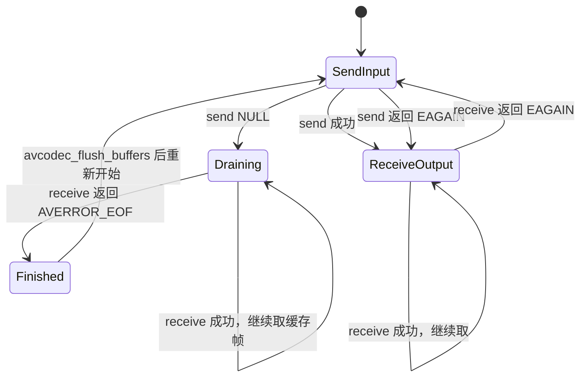
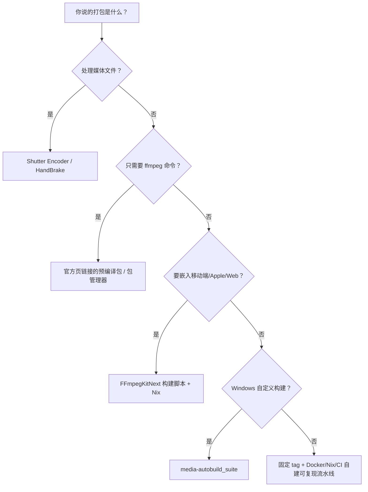

---

## 🔥 <font id=前言>前言</font>

> 这不是一份只教命令的速查表，而是一份面向音视频面试、源码追问和工程落地的 FFmpeg 手册。阅读主线是：先能说清整体架构，再能画出数据流，最后能解释关键结构体、关键函数、状态机、时间戳和平台打包。

- 文档版本基线：[`FFmpeg 8.1.2 "Hoare"`](https://ffmpeg.org/download.html)。
- FFmpeg 发布日期：`2026-06-17`。
- 文档版本核验日期：`2026-08-04`，时区 `Asia/Shanghai`。
- 选型口径：以核验日的“最新稳定发行版”为准，不以每日变化的 `master` / snapshot 作为面试源码基线。
- 源码定位口径：公开 API 以 FFmpeg 8.1.2 的头文件和官方文档为准；`fftools` 内部函数不承诺跨版本兼容。

> 一句话先定性：[`FFmpeg`](https://ffmpeg.org) 不是“一个转码函数”，而是“一组音视频基础库 + 三个主要命令行工具 + 一套可裁剪、可跨平台编译的构建系统”。

## 一、面试先背这组结论 <a href="#前言" style="font-size:17px; color:green;"><b>🔼</b></a> <a href="#🔚" style="font-size:17px; color:green;"><b>🔽</b></a>

### 1.1、30 秒介绍 FFmpeg

**问题：什么是 FFmpeg？**

**核心回答：**

FFmpeg 是一个跨平台多媒体框架。它通过 `libavformat` 处理协议、封装和解封装，通过 `libavcodec` 编解码，通过 `libavfilter` 组织音视频滤镜图，通过 `libswscale` 做图像缩放与像素格式转换，通过 `libswresample` 做音频重采样；上层的 `ffmpeg`、`ffprobe`、`ffplay` 分别负责处理、分析和播放。典型转码链路是：

```text
输入协议/文件 → 解封装 → 压缩包 AVPacket → 解码 → 原始帧 AVFrame
            → 滤镜/缩放/重采样 → 编码 → AVPacket → 封装 → 输出
```

**干货拆解：**

- “MP4、FLV、MKV”通常说的是容器；“H.264、H.265、AAC、Opus”通常说的是编码格式，两者不是一回事。
- `AVPacket` 主要承载压缩数据，`AVFrame` 主要承载解码后的原始音视频数据。
- 只换容器时可以走 stream copy，数据通常不经过解码和编码。
- 转码时要处理的不只是编解码，还有时间基、PTS/DTS、音画同步、像素/采样格式、线程、缓存和资源生命周期。

<details>
<summary>面试官为什么喜欢从这里追问？</summary>

因为只会写 `ffmpeg -i` 的候选人通常说不清“容器与编码”“Packet 与 Frame”“解封装与解码”的边界。只要这三组概念答稳，后面的函数题就有主线。

</details>

### 1.2、10 秒架构回答

**问题：FFmpeg 的架构是什么？**

**核心回答：**

FFmpeg 是分层流水线架构。最下层由 `libavutil` 提供公共数据结构、内存、时间和日志能力；中间层由 `libavformat`、`libavcodec`、`libavfilter`、`libswscale`、`libswresample` 等库完成媒体处理；最上层的 `fftools` 把命令行参数解析成输入、解码、滤镜、编码和输出任务，并由调度器并行驱动这些组件。

### 1.3、函数题的万能回答模板

面试官突然指着一个函数问“它干嘛的”，按下面五步回答：

1. 它属于哪个库、位于流水线哪一段。
2. 输入和输出是什么，尤其是 `AVPacket` 还是 `AVFrame`。
3. 它是否分配资源、增加引用或转移所有权。
4. 成功、`EAGAIN`、`EOF` 和普通负错误码分别意味着什么。
5. 它前后必须调用什么，异常和结束时如何释放。

示例：

> `avcodec_send_packet()` 属于 `libavcodec` 的解码输入端，把含压缩码流的 `AVPacket` 送进已经由 `avcodec_open2()` 打开的解码器。它不保证一包立刻对应一帧；送入后要循环调用 `avcodec_receive_frame()` 取出零到多帧。`EAGAIN` 表示要先取输出，送 `NULL` 表示开始 drain，最终由 receive 返回 `AVERROR_EOF`。

## 二、版本基线与库版本

### 2.1、为什么选 FFmpeg 8.1.2

截至 `2026-08-04`，FFmpeg 官方下载页把 `8.1.2 "Hoare"` 标为 8.1 分支的最新稳定版。该版本发布于 `2026-06-17`，8.1 分支于 `2026-03-08` 从 `master` 切出。

官方同时说明：发行分支适合发行商和系统集成；开发分支更新更快、接受全部新功能和修复。面试或稳定工程复盘最好固定到明确 tag，线上跟进安全修复时再评估新版或开发分支。

### 2.2、FFmpeg 8.1.2 的库版本

| 组件 | 版本 | 主要职责 |
| --- | --- | --- |
| `libavutil` | `60.26.102` | 公共数据结构、内存、日志、时间、像素/采样格式、硬件上下文等 |
| `libavcodec` | `62.28.102` | 音频、视频、字幕编解码和 bitstream filter |
| `libavformat` | `62.12.102` | 协议、I/O、探测、解封装、封装 |
| `libavdevice` | `62.3.102` | 摄像头、麦克风、屏幕、音频设备等输入输出设备 |
| `libavfilter` | `11.14.102` | 音视频滤镜图、格式协商、帧处理 |
| `libswscale` | `9.5.102` | 图像缩放、像素格式和部分颜色空间转换 |
| `libswresample` | `6.3.102` | 音频重采样、采样格式转换、声道重混 |

### 2.3、版本号怎么理解

- FFmpeg 发行版号，例如 `8.1.2`，描述整个项目的发布。
- 各 `libav*` 库有独立的 `major.minor.micro`。
- 库的 `major` 变化可能包含 ABI/API 不兼容变化；不能看到 FFmpeg 只升了一个发行版号，就假定旧二进制一定兼容。
- 运行时可用 `ffmpeg -version`、`ffmpeg -buildconf` 和 `ffmpeg -libraries` 核对真实二进制，不要只看文件名。

```shell
ffmpeg -version
ffmpeg -buildconf
ffmpeg -formats
ffmpeg -codecs
ffmpeg -filters
ffmpeg -hwaccels
```

## 三、FFmpeg 到底由什么组成

### 3.1、工具层

| 工具 | 定位 | 高频用途 |
| --- | --- | --- |
| `ffmpeg` | 媒体处理命令行前端 | 转码、推拉流、裁剪、混流、滤镜、截图、录制 |
| `ffprobe` | 媒体分析工具 | 查看流、包、帧、格式、时长、时间戳和 metadata |
| `ffplay` | 基于 FFmpeg 库和 SDL 的轻量播放器 | 调试流、验证解码和滤镜，不是完整商用播放器 |

### 3.2、库层

| 库 | 面试表达 | 常见对象/函数 |
| --- | --- | --- |
| `libavutil` | 所有模块的公共底座 | `AVFrame`、`AVRational`、`AVDictionary`、`av_malloc()`、`av_rescale_q()`、`av_log()` |
| `libavformat` | “容器和 I/O 层” | `AVFormatContext`、`AVStream`、`AVIOContext`、`avformat_open_input()`、`av_read_frame()` |
| `libavcodec` | “压缩数据与原始帧的转换层” | `AVCodecContext`、`AVPacket`、`avcodec_send_packet()`、`avcodec_receive_frame()` |
| `libavfilter` | “有向滤镜图” | `AVFilterGraph`、`AVFilterContext`、buffersrc、buffersink |
| `libavdevice` | “采集和播放设备适配层” | 摄像头、麦克风、屏幕采集和平台设备格式 |
| `libswscale` | “视频格式变换层” | `SwsContext`、`sws_scale()` |
| `libswresample` | “音频格式变换层” | `SwrContext`、`swr_convert()` |

### 3.3、源码目录地图

```text
FFmpeg/
├── fftools/             # ffmpeg、ffprobe 等命令行前端
├── libavutil/           # 公共底座
├── libavformat/         # 协议、AVIO、demuxer、muxer
├── libavcodec/          # decoder、encoder、parser、bitstream filter
├── libavfilter/         # filter graph、buffersrc、buffersink、具体滤镜
├── libavdevice/         # 采集/输出设备
├── libswscale/          # 图像缩放、像素格式转换
├── libswresample/       # 音频重采样和声道/采样格式转换
├── doc/examples/        # 官方 API 示例，读源码前先看这里
├── tests/               # FATE 与其它测试
├── configure            # 特性探测与构建配置入口
└── Makefile             # 构建入口
```

### 3.4、接口表驱动，而不是巨型 `switch`

FFmpeg 大量模块使用“统一接口 + 具体实现函数表”的方式解耦：

| 抽象 | 代表对象 | 作用 |
| --- | --- | --- |
| 输入格式 | `AVInputFormat` | 某种容器/输入格式如何探测、读头、读包、seek |
| 输出格式 | `AVOutputFormat` | 某种容器如何写头、写包、写尾 |
| 编解码器 | 公共 `AVCodec` 与内部 codec 实现 | 某个 codec 如何初始化、解码、编码、flush |
| 滤镜 | `AVFilter` | 滤镜的输入输出 pad、格式协商、处理回调 |
| 协议 | `URLProtocol`（内部） | `file`、HTTP、TCP、UDP 等如何 open/read/write/seek/close |

这个设计带来三个好处：

- 上层按统一 API 工作，不需要知道 H.264、AAC、MP4、RTMP 的具体内部实现。
- 编译时可以按 `configure` 结果裁剪未使用模块。
- 新增 codec、demuxer、muxer、filter 时主要是实现对应接口并进入组件列表。

## 四、完整数据流与三条关键路径

### 4.1、转码主链路


### 4.2、播放路径

```text
读取 → 解封装 → 解码 → 音视频时钟同步 → 渲染音频/视频
```

播放比“解码成功”多了同步、队列、缓冲、丢帧、暂停、seek、倍速和设备渲染。`ffplay` 值得研究，但不能把它等同于完整播放器架构。

### 4.3、stream copy 路径

```text
读取 → 解封装 → 必要的 bitstream filter / 时间戳换算 → 重新封装 → 写出
```

命令示例：

```shell
ffmpeg -i input.mp4 -c copy output.mkv
```

这里没有解码和重编码，因此速度快、无重编码质量损失。但它仍可能遇到容器不兼容、extradata 形式差异、时间戳和 bitstream filter 问题。

## 五、核心数据结构：面试必须能讲清

### 5.1、结构体关系

| 结构体 | 一句话职责 | 关键字段/关系 |
| --- | --- | --- |
| `AVFormatContext` | 一次输入或输出的容器级上下文 | `iformat/oformat`、`pb`、`streams`、`duration` |
| `AVIOContext` | 字节 I/O 抽象 | 支持文件、网络和自定义 read/write/seek 回调 |
| `AVStream` | 容器中的一条逻辑流 | `index`、`codecpar`、`time_base`、`avg_frame_rate` |
| `AVCodecParameters` | 流中描述 codec 的轻量参数 | codec id、宽高、采样率、声道布局、extradata；不是工作状态机 |
| `AVCodec` | 某个编解码器的描述/实现入口 | decoder 或 encoder 的能力与回调 |
| `AVCodecContext` | 一次编解码实例的状态 | 参数、线程、内部缓冲、私有选项、硬件上下文 |
| `AVPacket` | 通常承载压缩码流 | `data`、`size`、`stream_index`、`pts`、`dts`、`duration` |
| `AVFrame` | 承载原始音视频帧 | 视频 plane/linesize；音频 samples/channel layout；`pts` |
| `AVFilterGraph` | 一张滤镜有向图 | 多个 `AVFilterContext` 与 link |
| `AVDictionary` | 字符串键值参数 | 向 demuxer、decoder、muxer 等传私有选项 |

### 5.2、`AVPacket` 和 `AVFrame` 的区别

**问题：Packet 和 Frame 是一一对应吗？**

**核心回答：**

不保证。视频中一个 packet 常常对应一个压缩访问单元，但也可能零包多帧或多包一帧；音频中一个 packet 可能解出多个 frame。编解码器内部还有缓存和重排序，所以 FFmpeg 使用 send/receive 状态机，而不是简单的“一次调用输入一包、返回一帧”。

**关键边界：**

- `AVPacket` 处在 demuxer、decoder 输入、encoder 输出和 muxer 之间。
- `AVFrame` 处在 decoder 输出、filter、scale/resample 和 encoder 输入之间。
- `AVPacket` 不是 MPEG-TS 固定 188 字节包的同义词；它是 FFmpeg 的通用压缩数据对象。
- `AVFrame` 对音频来说往往是一批每声道 samples，不等于“一个瞬时采样点”。

### 5.3、`AVCodecParameters` 和 `AVCodecContext`

**核心回答：**

`AVCodecParameters` 是容器流里可传递的 codec 参数快照，适合 demuxer 与 muxer 交换信息；`AVCodecContext` 是真正工作的编解码实例，包含线程、缓存、私有选项和运行状态。通常用 `avcodec_parameters_to_context()` 把前者复制到后者，再 `avcodec_open2()` 打开 decoder。

反向写输出流时，通常在 encoder 参数确定后调用 `avcodec_parameters_from_context()`，把编码参数复制给输出 `AVStream->codecpar`。

### 5.4、时间基、PTS、DTS

| 名词 | 含义 |
| --- | --- |
| `time_base` | 时间戳的计量单位，是 `AVRational`，不是固定毫秒 |
| `PTS` | Presentation Timestamp，应该何时显示/播放 |
| `DTS` | Decoding Timestamp，应该何时送入解码 |
| `duration` | 当前 packet/frame 的持续时长，单位取决于所属时间基 |

换算公式：

```text
秒 = timestamp × av_q2d(time_base)
```

跨时间基不要手写浮点乘法，使用：

```c
int64_t dst_ts = av_rescale_q(src_ts, src_time_base, dst_time_base);
av_packet_rescale_ts(pkt, src_time_base, dst_time_base);
```

有 B 帧时显示顺序和解码顺序可能不同，因此 `PTS != DTS` 很正常。muxer 通常要求 DTS 单调，音画同步通常围绕各自 PTS 和主时钟展开。

## 六、公开 API 核心函数：按流水线记忆

### 6.1、总调用顺序

```text
avformat_open_input
  → avformat_find_stream_info
  → av_find_best_stream
  → avcodec_alloc_context3
  → avcodec_parameters_to_context
  → avcodec_open2
  → av_read_frame
  → avcodec_send_packet
  → avcodec_receive_frame
  → filter / sws / swr
  → avcodec_send_frame
  → avcodec_receive_packet
  → av_packet_rescale_ts
  → av_interleaved_write_frame
  → drain decoder / filter / encoder
  → av_write_trailer
  → unref / free / close
```

### 6.2、输入、探测和解封装函数

| 函数 | 核心作用 | 高频陷阱 |
| --- | --- | --- |
| `avformat_alloc_context()` | 预分配 `AVFormatContext`，便于先设置 interrupt、自定义 IO 等 | 普通输入可让 `avformat_open_input()` 内部分配，不是每次都必须手动调用 |
| `avformat_open_input()` | 打开 URL/IO、探测输入格式、读取容器头 | 只是打开并读头，不等于已经完整获得所有流信息 |
| `avformat_find_stream_info()` | 继续读取和分析数据，补齐 codec、帧率、时长等流信息 | 可能增加首开延迟；直播要关注 `probesize`、`analyzeduration` |
| `av_find_best_stream()` | 按媒体类型选出最合适的流，可同时返回 decoder | “best” 是 FFmpeg 的选择策略，不一定等于产品业务想要的语言/清晰度 |
| `av_read_frame()` | 从 demuxer 取下一个 `AVPacket` | 名字里有 frame，但返回的是压缩 packet，不是 `AVFrame` |
| `av_seek_frame()` | 按某条流的时间基 seek 到目标附近的关键帧 | seek 后 decoder 内部旧帧必须 flush |
| `avformat_seek_file()` | 在 `min_ts/ts/max_ts` 范围内做更精细的 seek | 时间戳单位由 `stream_index` 决定，不能默认毫秒 |
| `avformat_close_input()` | 关闭输入、释放相关上下文并把指针置空 | 自定义 `AVIOContext` 的 buffer/opaque 仍要按自身所有权清理 |

#### 6.2.1、`avformat_open_input()` 到底做了什么

可以按下面的层次理解，不要死背每一个内部函数名：

1. 接收 URL、可选指定格式、选项字典和可选预建上下文。
2. 选择/探测输入格式。
3. 建立底层 I/O；如果使用自定义 `AVIOContext`，则走调用方提供的回调。
4. 调用具体 demuxer 的读头逻辑。
5. 填充 `AVFormatContext` 和已能确认的流信息。

它不负责解码，也不保证容器头里缺失的帧率、时长和 codec 细节已经全部推断出来，所以通常紧跟 `avformat_find_stream_info()`。

#### 6.2.2、`av_read_frame()` 到底做了什么

它位于 `libavformat`，核心是让具体 demuxer 继续从输入读取并产出一条流的压缩 `AVPacket`。调用方通过 `pkt->stream_index` 分流给音频、视频、字幕等 decoder。

返回语义：

- `>= 0`：成功拿到一个 packet。
- `AVERROR(EAGAIN)`：非阻塞输入暂时没有数据，不是文件结束。
- `AVERROR_EOF`：输入结束。
- 其它负数：I/O、格式或协议错误。

每次处理完 packet 后要 `av_packet_unref()`，否则循环中会持续持有底层 buffer 引用。

### 6.3、解码函数

| 函数 | 核心作用 | 高频陷阱 |
| --- | --- | --- |
| `avcodec_find_decoder()` | 按 codec id 找 decoder | 只返回描述，不创建解码实例 |
| `avcodec_alloc_context3()` | 分配 `AVCodecContext` | 还没复制流参数，也没打开 |
| `avcodec_parameters_to_context()` | 把 `AVCodecParameters` 复制进 codec context | 不复制压缩数据，不启动 decoder |
| `avcodec_open2()` | 根据参数和选项初始化 decoder/encoder | 之后才能 send；失败时读取负错误码 |
| `avcodec_send_packet()` | 向 decoder 输入压缩 `AVPacket` | 一包不保证一帧；`NULL` 表示 drain |
| `avcodec_receive_frame()` | 从 decoder 取解码后的 `AVFrame` | 要循环取到 `EAGAIN` 或 `EOF` |
| `avcodec_flush_buffers()` | 清掉 codec 内部缓存并重置状态 | seek 后常用；不能代替正常 EOF drain |
| `avcodec_free_context()` | 关闭并释放 context，将指针置空 | 与早期手动 `avcodec_close()` 的习惯区分 |

#### 6.3.1、send/receive 状态机



**必须会说的四句话：**

- decoder：`AVPacket → avcodec_send_packet() → avcodec_receive_frame() → AVFrame`。
- encoder：`AVFrame → avcodec_send_frame() → avcodec_receive_packet() → AVPacket`。
- `EAGAIN` 不是失败；send 端的 `EAGAIN` 让你先 receive，receive 端的 `EAGAIN` 让你再 send。
- EOF 时向 send 端传 `NULL` 进入 draining，再 receive 到 `AVERROR_EOF`，否则 B 帧或音频缓存可能丢尾。

### 6.4、编码函数

| 函数 | 核心作用 | 高频陷阱 |
| --- | --- | --- |
| `avcodec_find_encoder()` | 找 encoder | codec 名称和 codec id 的选择语义不同 |
| `avcodec_send_frame()` | 输入原始 `AVFrame` | `NULL` 表示 drain encoder |
| `avcodec_receive_packet()` | 取编码后的 `AVPacket` | 一帧不保证一包，仍按 `EAGAIN/EOF` 状态机处理 |
| `avcodec_parameters_from_context()` | 把 encoder 参数写入输出 stream 的 `codecpar` | 通常在写 header 前完成 |

编码时常见顺序：

```text
创建输出 stream
→ 创建 encoder context
→ 设置 width/height/pix_fmt/time_base 或 sample_fmt/sample_rate/ch_layout
→ avcodec_open2
→ avcodec_parameters_from_context
→ avformat_write_header
→ send frame / receive packet
```

### 6.5、滤镜函数

| 函数 | 核心作用 | 高频陷阱 |
| --- | --- | --- |
| `avfilter_graph_alloc()` | 创建滤镜图 | 只是空图 |
| `avfilter_graph_create_filter()` | 在图里实例化具体 filter | 参数、输入输出格式要匹配 |
| `avfilter_link()` | 手工连接两个滤镜 pad | 复杂字符串图通常用 parse API |
| `avfilter_graph_parse_ptr()` | 解析 `scale=...` 等滤镜字符串并接入图 | 解析成功不代表格式协商已经完成 |
| `avfilter_graph_config()` | 检查拓扑并完成像素/采样格式等协商 | 应在送帧前调用 |
| `av_buffersrc_add_frame_flags()` | 从应用向图输入 frame | 是否保留/消费 frame 受 flags 影响 |
| `av_buffersink_get_frame()` | 从图的 sink 取处理后 frame | 同样要处理 `EAGAIN` 和 EOF |
| `avfilter_graph_free()` | 释放整张滤镜图 | 释放图后不要继续使用其中 context |

滤镜图是有向图，不只是链。它能做分支、合并、多输入，例如 overlay、amix、concat。格式不兼容时，FFmpeg 可能自动插入 scale/aresample；面试时应说“有格式协商”，不要说“滤镜永远原样传帧”。

### 6.6、视频缩放与像素格式转换

| 函数 | 核心作用 |
| --- | --- |
| `sws_getContext()` | 按输入输出宽高、像素格式和算法创建 `SwsContext` |
| `sws_getCachedContext()` | 参数不变时复用 context，参数变化时更新，适合循环场景 |
| `sws_scale()` | 转换一个图像或图像 slice，返回输出的行数 |
| `sws_freeContext()` | 释放 context |

常见用途：`YUV420P → RGB`、解码尺寸到渲染尺寸、编码前像素格式转换。不要把 `sws_scale()` 只说成“缩放”，它也承担像素格式转换。

### 6.7、音频重采样

| 函数 | 核心作用 |
| --- | --- |
| `swr_alloc_set_opts2()` | 创建/配置输入输出采样格式、采样率、声道布局 |
| `swr_init()` | 初始化 `SwrContext` |
| `swr_get_delay()` | 查询内部延迟，用于估算输出 sample 数 |
| `swr_convert()` | 输入若干 samples，输出转换后的 samples |
| `swr_free()` | 释放并置空 context |

音频重采样可能有内部延迟，输出 sample 数不一定等于输入 sample 数。结束时还要考虑用空输入 drain 剩余 samples，输出 buffer 容量应结合 `swr_get_delay()` 和 `av_rescale_rnd()` 计算。

### 6.8、输出、封装和写文件

| 函数 | 核心作用 | 高频陷阱 |
| --- | --- | --- |
| `avformat_alloc_output_context2()` | 按文件名或显式格式创建输出容器上下文 | 只创建上下文，没有打开文件 |
| `avformat_new_stream()` | 创建输出流 | 仍要填 `codecpar` 和时间基等信息 |
| `avio_open()` | 打开输出 I/O | `AVFMT_NOFILE` 格式不需要自己开 `pb` |
| `avformat_write_header()` | 写容器头并最终确认部分 muxer 参数 | muxer 可能调整输出 stream 的 `time_base` |
| `av_packet_rescale_ts()` | 把 packet 的时间戳换到输出 stream 时间基 | 编码器时间基与 stream 时间基不能混用 |
| `av_interleaved_write_frame()` | 按各流 DTS 排序/交织后写包 | 写音视频多流时通常优先用它 |
| `av_write_frame()` | 直接写包，由调用方保证正确交织顺序 | 不要拿它和 interleaved 版本当同义词 |
| `av_write_trailer()` | drain/结束后写容器尾和索引 | 漏掉会导致部分文件不完整或不可 seek |
| `avio_closep()` | 关闭输出 I/O 并置空指针 | `AVFMT_NOFILE` 时不要乱关 |
| `avformat_free_context()` | 释放输出 context | 与输入侧 `avformat_close_input()` 区分 |

常见时间戳代码：

```c
av_packet_rescale_ts(packet,
                     encoder_context->time_base,
                     output_stream->time_base);
packet->stream_index = output_stream->index;
ret = av_interleaved_write_frame(output_format_context, packet);
```

`av_interleaved_write_frame()` 会按多流时间戳交织，并按 API 约定接管/释放传入 packet 的引用；调用后不要继续依赖原 packet 内容。`av_write_frame()` 不做同等程度的交织管理，对调用方时序要求更高。

### 6.9、内存、引用和错误处理

| 函数 | 作用 |
| --- | --- |
| `av_packet_alloc()` / `av_packet_free()` | 创建/释放 packet 对象 |
| `av_packet_unref()` | 释放 packet 当前持有的 buffer 引用，packet 本体可复用 |
| `av_packet_ref()` / `av_packet_move_ref()` | 增加引用或移动引用，常用于队列和跨线程 |
| `av_frame_alloc()` / `av_frame_free()` | 创建/释放 frame 对象 |
| `av_frame_unref()` / `av_frame_ref()` | 清理或增加 frame 对底层 buffer 的引用 |
| `av_frame_get_buffer()` | 给 frame 分配引用计数 buffer |
| `av_frame_make_writable()` | 确保调用方可以安全修改 frame 数据，必要时触发复制 |
| `av_strerror()` | 把负错误码转为可读文本 |
| `av_log()` | 统一日志接口 |

错误处理模板：

```c
char errbuf[AV_ERROR_MAX_STRING_SIZE] = {0};
av_strerror(ret, errbuf, sizeof(errbuf));
fprintf(stderr, "FFmpeg error: %s\n", errbuf);
```

队列中最容易出错的是浅拷贝 `AVPacket` / `AVFrame` 结构体而没有增加 buffer 引用。跨线程或异步保存时，要明确使用 `ref`、`clone` 或 `move_ref`，并明确由谁 `unref`。

## 七、FFmpeg 8.1.2 命令行前端的源码主线

### 7.1、先区分两类函数

- `avformat_*`、`avcodec_*`、`avfilter_*` 等是库的公开 API，业务 App 主要调用它们。
- `fftools/ffmpeg*.c` 里的 `main()`、`transcode()`、`sch_*()` 等是 `ffmpeg` 命令行工具的内部实现，不等于公共 SDK API。

面试官给出源码片段时先看路径。看到 `fftools/`，答“CLI orchestration”；看到 `libavcodec/`，答“codec 层”；看到 `libavformat/`，答“容器/I/O 层”。

### 7.2、`ffmpeg` CLI 主调用链

FFmpeg 8.1.2 中可以抓住这条主线：

```text
main()                                  fftools/ffmpeg.c
├── init_dynload()
├── parse_loglevel()
├── avdevice_register_all()             按构建条件启用
├── avformat_network_init()
├── sch_alloc()
├── ffmpeg_parse_options()              fftools/ffmpeg_opt.c
│   ├── split_commandline()
│   ├── parse_optgroup()                全局参数
│   ├── term_init()
│   ├── fg_create()                     复杂滤镜图
│   ├── open_files(..., ifile_open)     输入
│   ├── open_files(..., of_open)        输出
│   └── open_files(..., dec_create)     loopback decoder
├── transcode()                         fftools/ffmpeg.c
│   ├── print_stream_maps()
│   ├── sch_start()
│   ├── sch_wait()                      等待任务、周期性打印进度
│   ├── check_keyboard_interaction()
│   ├── print_report()
│   ├── sch_stop()
│   └── of_write_trailer()
├── ffmpeg_cleanup()
└── sch_free()
```

### 7.3、重点内部函数卡片

#### 7.3.1、`main()`

**作用：** 命令行进程总入口，初始化日志/网络/设备和调度器，解析参数并搭建任务图，调用 `transcode()`，最后统一清理与返回退出码。

**不要答错：** `main()` 自己不逐帧完成所有解码编码；FFmpeg 8.1.2 的主工作由调度器中的组件任务驱动。

#### 7.3.2、`ffmpeg_parse_options()`

**作用：** 把线性的命令行拆成全局参数、输入组、输出组和 decoder 组，然后创建复杂滤镜、打开输入和输出，构造后续调度需要的节点与连接。

**为什么参数顺序重要：** `-c:v`、`-ss` 等选项可能属于某个输入或输出组；CLI 不是把所有参数放进一个全局字典。

#### 7.3.3、`open_files()`

**作用：** 通用遍历某类参数组，对每组初始化 `OptionsContext`、解析组选项，并通过函数指针分别调用 `ifile_open`、`of_open` 或 `dec_create`。

**架构价值：** 它把“遍历和错误处理”与“具体打开哪种对象”分开，是典型的回调式复用。

#### 7.3.4、`transcode()`

**作用：** 启动 scheduler，等待各组件运行，处理终端按键和进度输出，停止调度，给所有输出写 trailer，并打印最终报告。

**源码重点：** 8.1.2 的 `transcode()` 主循环围绕 `sch_start()`、`sch_wait()`、`sch_stop()`，不是老版本里单线程不断挑选下一个输出流的 `transcode_step()` 模型。

#### 7.3.5、`sch_start()` / `sch_wait()` / `sch_stop()`

**作用：** 启动已构造的 demux、decode、filter、encode、mux 等任务；等待完成或定时醒来；最终停止任务、合并结果并完成收尾。

**面试加分点：** FFmpeg CLI 自 2023 年完成重大多线程重构后，主要转码组件可以并行运行。多线程的价值是提高流水线并行度和 CPU 利用率；如果绝大部分时间都耗在单个 encoder，上层调度并行不会凭空带来数量级提升。

### 7.4、源码阅读顺序

1. [`fftools/ffmpeg.c`](https://github.com/FFmpeg/FFmpeg/blob/n8.1.2/fftools/ffmpeg.c)：先看 `main()` 和 `transcode()`。
2. [`fftools/ffmpeg_opt.c`](https://github.com/FFmpeg/FFmpeg/blob/n8.1.2/fftools/ffmpeg_opt.c)：看参数分组和任务图搭建。
3. [`fftools/ffmpeg_sched.c`](https://github.com/FFmpeg/FFmpeg/blob/n8.1.2/fftools/ffmpeg_sched.c)：看 scheduler 节点、队列、线程与连接。
4. [`fftools/ffmpeg_demux.c`](https://github.com/FFmpeg/FFmpeg/blob/n8.1.2/fftools/ffmpeg_demux.c)：看输入、读包和 demux task。
5. [`fftools/ffmpeg_dec.c`](https://github.com/FFmpeg/FFmpeg/blob/n8.1.2/fftools/ffmpeg_dec.c)：看 packet 如何进入 decoder。
6. [`fftools/ffmpeg_filter.c`](https://github.com/FFmpeg/FFmpeg/blob/n8.1.2/fftools/ffmpeg_filter.c)：看滤镜图配置和帧流动。
7. [`fftools/ffmpeg_enc.c`](https://github.com/FFmpeg/FFmpeg/blob/n8.1.2/fftools/ffmpeg_enc.c)：看 frame 如何进入 encoder。
8. [`fftools/ffmpeg_mux.c`](https://github.com/FFmpeg/FFmpeg/blob/n8.1.2/fftools/ffmpeg_mux.c)：看 packet 排序、写出和 trailer。
9. 最后再追进 `libavformat`、`libavcodec`、`libavfilter` 的公共 API 和内部实现。

### 7.5、重点公开函数的源码落点

| 源码文件 | 重点入口 | 阅读时要抓住什么 |
| --- | --- | --- |
| [`libavformat/demux.c`](https://github.com/FFmpeg/FFmpeg/blob/n8.1.2/libavformat/demux.c) | `avformat_open_input()`、`avformat_find_stream_info()`、`av_read_frame()` | 输入探测、demuxer 回调、内部 packet 缓冲和流信息分析 |
| [`libavformat/seek.c`](https://github.com/FFmpeg/FFmpeg/blob/n8.1.2/libavformat/seek.c) | `av_seek_frame()`、`avformat_seek_file()` | 时间基、索引、关键帧与格式私有 seek 回调 |
| [`libavformat/mux.c`](https://github.com/FFmpeg/FFmpeg/blob/n8.1.2/libavformat/mux.c) | `avformat_write_header()`、`av_write_frame()`、`av_interleaved_write_frame()`、`av_write_trailer()` | 包校验、时间戳、交织队列和 muxer 写回调 |
| [`libavcodec/avcodec.c`](https://github.com/FFmpeg/FFmpeg/blob/n8.1.2/libavcodec/avcodec.c) | `avcodec_open2()`、codec 公共状态管理 | 公共 context 如何进入具体 codec 实现 |
| [`libavcodec/decode.c`](https://github.com/FFmpeg/FFmpeg/blob/n8.1.2/libavcodec/decode.c) | decoder send/receive 相关实现 | packet 缓冲、内部 bitstream filter、frame 输出和 drain |
| [`libavcodec/encode.c`](https://github.com/FFmpeg/FFmpeg/blob/n8.1.2/libavcodec/encode.c) | encoder send/receive 相关实现 | frame 输入、packet 输出、内部缓存和 EOF 状态 |
| [`libavfilter/graphparser.c`](https://github.com/FFmpeg/FFmpeg/blob/n8.1.2/libavfilter/graphparser.c) | filter 字符串解析 | 文本描述如何变成 filter 节点与连接 |
| [`libavfilter/avfiltergraph.c`](https://github.com/FFmpeg/FFmpeg/blob/n8.1.2/libavfilter/avfiltergraph.c) | graph 配置与格式协商 | link 配置、格式选择、自动转换和执行准备 |
| [`libavfilter/buffersrc.c`](https://github.com/FFmpeg/FFmpeg/blob/n8.1.2/libavfilter/buffersrc.c) / [`buffersink.c`](https://github.com/FFmpeg/FFmpeg/blob/n8.1.2/libavfilter/buffersink.c) | `av_buffersrc_add_frame_flags()` / `av_buffersink_get_frame()` | 应用如何把 frame 送进图并取回结果 |
| [`libswresample/swresample.c`](https://github.com/FFmpeg/FFmpeg/blob/n8.1.2/libswresample/swresample.c) | `swr_init()`、`swr_convert()` | sample 缓冲、延迟、格式和声道转换 |

函数实现可能被薄包装再转到内部 `ff_*` 函数，也可能在后续版本拆文件。面试时先解释公开语义，再沿当前 tag 追内部实现；不要把某个内部函数名背成永久 API。

## 八、最小解码伪代码：把函数串起来

下面代码突出调用关系和状态机，省略了产品级超时、硬件解码、音画同步、像素转换和完整错误标签：

```c
AVFormatContext *fmt = NULL;
AVCodecContext *dec = NULL;
const AVCodec *codec = NULL;
AVPacket *pkt = av_packet_alloc();
AVFrame *frame = av_frame_alloc();
int video_index = -1;
int ret = 0;

ret = avformat_open_input(&fmt, input_url, NULL, NULL);
if (ret < 0) goto end;

ret = avformat_find_stream_info(fmt, NULL);
if (ret < 0) goto end;

video_index = av_find_best_stream(fmt,
                                  AVMEDIA_TYPE_VIDEO,
                                  -1,
                                  -1,
                                  &codec,
                                  0);
if (video_index < 0) goto end;

dec = avcodec_alloc_context3(codec);
if (!dec) goto end;

ret = avcodec_parameters_to_context(
    dec,
    fmt->streams[video_index]->codecpar
);
if (ret < 0) goto end;

ret = avcodec_open2(dec, codec, NULL);
if (ret < 0) goto end;

while ((ret = av_read_frame(fmt, pkt)) >= 0) {
    if (pkt->stream_index == video_index) {
        ret = avcodec_send_packet(dec, pkt);
        if (ret < 0) {
            av_packet_unref(pkt);
            goto end;
        }

        while ((ret = avcodec_receive_frame(dec, frame)) >= 0) {
            consume_video_frame(frame);
            av_frame_unref(frame);
        }

        if (ret != AVERROR(EAGAIN) && ret != AVERROR_EOF) {
            av_packet_unref(pkt);
            goto end;
        }
    }

    av_packet_unref(pkt);
}

/* 输入 EOF 后 drain decoder，取出 B 帧等内部缓存。 */
if (ret == AVERROR_EOF) {
    ret = avcodec_send_packet(dec, NULL);
    if (ret >= 0) {
        while ((ret = avcodec_receive_frame(dec, frame)) >= 0) {
            consume_video_frame(frame);
            av_frame_unref(frame);
        }
    }
}

end:
av_packet_free(&pkt);
av_frame_free(&frame);
avcodec_free_context(&dec);
avformat_close_input(&fmt);
```

**这段代码最容易被追问的点：**

- `av_read_frame()` 拿到的是 packet，不是 decoded frame。
- 每个 packet 用完都 `av_packet_unref()`，packet 对象本身循环复用。
- 每次 send 后 receive 要循环，因为可能输出多帧。
- `EAGAIN` 是状态切换，不是普通失败。
- 输入 EOF 后还要 send `NULL` drain decoder。
- 真正工程中还要处理 `av_read_frame()` 的 `EAGAIN`、网络超时、取消、格式变化和并发队列。

## 九、源码函数高频追问与答案

### 9.1、`avformat_open_input()` 和 `avformat_find_stream_info()` 为什么分开

**核心回答：**

前者负责打开输入、识别 demuxer、建立 I/O 并读容器头；后者在需要时继续读取/分析包，补充仅靠容器头无法可靠得到的 codec、帧率、时长等流信息。拆开可以让调用方控制探测成本，尤其是直播首开时延。

**追问：能不能不调 `avformat_find_stream_info()`？**

可以，但后续可用信息可能不完整。若协议和封装保证头信息充分、业务又极度在意首开延迟，可以评估跳过或限制探测；不能机械删除后假定所有流参数仍正确。

### 9.2、为什么 `av_read_frame()` 返回的是 `AVPacket`

**核心回答：**

它属于 demux 层，这里的“frame”更接近某条流的一个压缩数据单元。真正的原始帧要把 packet 送进 decoder，再从 `avcodec_receive_frame()` 得到 `AVFrame`。

### 9.3、`avcodec_parameters_to_context()` 是否会打开 decoder

**核心回答：**

不会。它只复制 codec 参数。必须再调用 `avcodec_open2()` 才建立可工作的 codec 实例。

### 9.4、为什么 send 成功后 receive 可能是 `EAGAIN`

**核心回答：**

decoder 可能需要更多输入才能输出完整帧，也可能存在重排序/缓存。`receive` 返回 `EAGAIN` 表示当前没有输出，需要继续送输入，不代表码流坏了。

**追问：send 和 receive 能同时 `EAGAIN` 吗？**

合法状态机不应让两端同时卡死为 `EAGAIN`。send 返回 `EAGAIN` 意味着应先 receive；receive 返回 `EAGAIN` 意味着需要 send 新输入。

### 9.5、flush 和 drain 有什么区别

**核心回答：**

- drain：流结束时 send `NULL`，把 decoder/encoder 已缓存的有效输出取完。
- flush：调用 `avcodec_flush_buffers()` 丢弃旧状态，让 codec 在 seek 或不连续点后重新开始。

结束播放时只 flush 会丢尾；seek 后只 drain 也不能清除旧时间线状态。

### 9.6、`av_packet_unref()` 和 `av_packet_free()` 有什么区别

**核心回答：**

`unref` 释放当前 packet 对数据 buffer 的引用，但保留 packet 对象以便复用；`free` 连 packet 对象一起释放并把指针置空。高频循环通常每轮 `unref`，退出时 `free`。

### 9.7、`av_frame_make_writable()` 为什么必要

**核心回答：**

`AVFrame` 底层 buffer 可能被多个引用共享。直接修改会污染其它持有者；`av_frame_make_writable()` 确保当前 frame 独占可写 buffer，必要时 copy-on-write。

### 9.8、`av_interleaved_write_frame()` 比 `av_write_frame()` 多做什么

**核心回答：**

它会缓存并按照不同 stream 的 DTS 交织写出，适合音视频多流；`av_write_frame()` 更接近直接交给 muxer，调用方要自己保证包顺序满足格式要求。

### 9.9、seek 为什么经常不是精确落在目标帧

**核心回答：**

视频通常只能从关键帧独立解码。常规策略是 seek 到目标之前最近的关键帧，flush decoder，再向前解码并丢弃早于目标时间的帧，最终显示目标附近第一帧。

### 9.10、`sws_scale()` 和 filter `scale` 怎么选

**核心回答：**

只做明确的一次像素格式/尺寸转换，`libswscale` 直接高效；复杂媒体处理链、动态参数、与其它滤镜组合时用 `libavfilter` 更自然。filter 内部也可能使用 scale 能力，两者不是完全割裂。

### 9.11、软解和硬解怎么切换

**核心回答：**

硬件路径通常通过 `AVHWDeviceContext`、codec 的硬件配置和硬件 frame context 接入，例如 VideoToolbox、MediaCodec、VAAPI、CUDA/D3D11VA。它不是把 decoder 名称换掉就结束，还要处理硬件像素格式、surface 池、设备上下文，以及必要时 `av_hwframe_transfer_data()` 在 GPU/CPU 间转移。

**追问：硬解一定更快吗？**

不一定。分辨率很小、频繁 GPU/CPU 回读、后续滤镜只支持软件帧或硬件队列配置不当时，传输和同步成本可能抵消收益。

### 9.12、自定义 I/O 怎么做

**核心回答：**

分配 buffer，使用 `avio_alloc_context()` 提供 read/write/seek 回调，把得到的 `AVIOContext` 放到 `AVFormatContext->pb`，并设置 `AVFMT_FLAG_CUSTOM_IO` 等正确语义。关闭时要区分 FFmpeg 持有的上下文与调用方持有的 opaque/buffer，避免双重释放。

## 十、为什么 FFmpeg 官方只发布源代码，我们还需要编译

### 10.1、可直接说出口的回答

**问题：为什么 FFmpeg 只发布源代码，我们用还需要编译？**

**核心回答：**

FFmpeg 官方项目负责维护可移植源码和稳定发布，不直接承诺覆盖所有平台组合的通用二进制。二进制会受到操作系统、CPU 架构、ABI、编译器、系统 SDK、外部 codec、硬件加速、体积裁剪以及 LGPL/GPL/nonfree 选项影响，所以不存在“一份包通吃所有平台”。如果只是使用命令行，通常不必自己编译，可以从 FFmpeg 官方下载页链接的系统包或第三方预编译包安装；只有要嵌入 App、裁剪功能、启用特定库/硬件、固定 ABI 或调试源码时才需要编译。

### 10.2、为什么无法只发一个万能二进制

| 维度 | 典型差异 |
| --- | --- |
| 操作系统 | iOS、macOS、Android、Windows、Linux 的加载器和系统 API 不同 |
| CPU/ABI | `arm64`、`x86_64`、Android 多 ABI、Windows UCRT、Linux glibc 版本 |
| 产物形态 | CLI 可执行文件、动态库、静态库、Apple `XCFramework`、Android `AAR/.so` |
| 功能裁剪 | 播放器可能只要 demux/decode，编辑器可能还要 filter/encode |
| 外部依赖 | x264、x265、libvpx、libaom、dav1d、libass、freetype、TLS 库等 |
| 硬件能力 | VideoToolbox、MediaCodec、VAAPI、NVENC、QSV、D3D11VA 等 |
| 许可证 | 默认 LGPL；启用 GPL 组件后整体许可变化；`--enable-nonfree` 产物不可再分发 |
| 性能与调试 | 汇编优化、LTO、debug symbols、sanitizer、CPU baseline |

### 10.3、编译本质上在做什么

```text
源码
→ configure 探测编译器、SDK、CPU、依赖和开关
→ 生成 config.h / config.mak 等构建配置
→ make 编译 C/汇编源码
→ 链接为工具和 libav* 库
→ 按目标平台组合为 exe / dylib / so / a / framework / XCFramework / AAR
```

本机 macOS 最小示意：

```shell
./configure \
  --prefix="$PWD/output" \
  --disable-debug \
  --disable-doc \
  --enable-shared

make -j"$(sysctl -n hw.logicalcpu)"
make install
```

这只面向当前 macOS 主机，不会自动得到 iOS 真机、模拟器和 Android 多 ABI 产物。

跨平台编译的概念骨架：

```shell
./configure \
  --enable-cross-compile \
  --target-os="目标系统" \
  --arch="目标架构" \
  --cc="目标编译器" \
  --sysroot="目标 SDK" \
  --prefix="输出目录" \
  --disable-programs \
  --disable-doc
```

真正落地还要补 `cflags`、`ldflags`、平台最低版本、多架构合并、外部依赖和最终包格式，因此实际命令会明显更长。

### 10.4、许可证不是编译后的附属问题

- FFmpeg 默认主要是 `LGPL v2.1+`。
- 启用 `--enable-gpl` 或 GPL 组件后，FFmpeg 构建的许可会切到 GPL。
- 启用 `--enable-nonfree` 后，FFmpeg 官方明确把所得构建标为不可再分发。
- 商业产品还要评估动态/静态链接、对应源码提供、修改说明、第三方库许可证和编解码专利。
- 这部分不是法律意见，实际商业发行应让法务按最终 `ffmpeg -buildconf` 和依赖清单审查。

## 十一、有没有一站式 GUI 软件打包 FFmpeg

### 11.1、先给结论

**问题：瞄准具体平台打包 FFmpeg，命令太麻烦，有没有一站式 GUI？**

**核心回答：**

如果“打包”指把视频转成另一种格式，有成熟 GUI；如果“打包”指把 FFmpeg 编译成 iOS `XCFramework`、Android `AAR/.so`、Windows/Linux 库，目前没有 FFmpeg 官方提供、同时覆盖所有平台和许可证组合的通用 GUI。最接近一站式的是平台构建脚本、可复现构建系统和预编译发行包，而不是拖拽式 GUI。

### 11.2、按真实目标选工具

| 真实目标 | 推荐路径 | 是否 GUI | 能否产出嵌入式 SDK |
| --- | --- | --- | --- |
| 只想在电脑执行 `ffmpeg` | 官方下载页链接的包管理器或预编译包 | 安装过程可能图形化 | 否，主要是 CLI/共享库 |
| 不想写命令，只想转码 | [**Shutter Encoder**](https://www.shutterencoder.com/)；或 [**HandBrake**](https://handbrake.fr/) | 是 | 否 |
| iOS/Android/macOS/tvOS/visionOS/Web 等嵌入 App | [**FFmpegKitNext**](https://github.com/arthenica/ffmpeg-kit-next) | 否，Nix/脚本 | 是，属于当前最接近跨平台一站式的方案 |
| Windows 自定义构建 | [**media-autobuild_suite**](https://github.com/m-ab-s/media-autobuild_suite) | 不是完整 GUI，但可双击并按提示选择 | 可得到静态/共享构建，需自己整理 SDK |
| Windows/Linux 直接拿构建 | [**BtbN FFmpeg-Builds**](https://github.com/BtbN/FFmpeg-Builds) 或官方页列出的构建 | 否 | 视包型而定，先核对 license/ABI |
| 团队长期维护多平台产物 | 固定 tag + Docker/Nix/CI + 构建清单 + 制品仓库 | 否 | 是，最可审计和可复现 |

### 11.3、FFmpegKitNext：当前最接近“一站式跨平台打包”

截至 `2026-08-04`：

- 旧 `FFmpegKit` 已退休并归档；不要照旧博客继续集成历史二进制。
- 原作者维护的 `FFmpegKitNext` 是官方延续项目。
- 它支持 Android、iOS/iPadOS、Linux、macOS、tvOS、visionOS、Web、Flutter 和 React Native。
- 当前列出的 `FFmpegKitNext 8.1.1` 基于 `FFmpeg 8.1.2`，发布于 `2026-07-28`。
- 它不再向 Maven Central、CocoaPods、pub.dev、npm 发布开箱即用包，而是推荐使用 Nix 在本地为目标平台构建。

**评价：** 它解决了“每个平台脚本、wrapper API、依赖和产物组织”的大部分重复劳动，但它仍不是 GUI，也没有替你取消许可证和目标架构选择。

### 11.4、Shutter Encoder 和 HandBrake 能做什么、不能做什么

- `Shutter Encoder` 是基于 FFmpeg 的图形化媒体转换工具，适合剪切、转码、封装、字幕、队列和分析。
- `HandBrake` 是跨 Windows/macOS/Linux 的图形化视频转码器，适合将常见输入转成主流交付格式。
- 它们解决的是“使用 FFmpeg 能力处理媒体”，不是“为你的 App 编译 FFmpeg SDK”。
- GUI 导出的视频不能代替 `libavcodec.a`、`libavformat.so`、`FFmpeg.xcframework` 或 Android `AAR`。

### 11.5、选择流程



## 十二、各平台打包时真正要决定的事项

### 12.1、Apple 平台

- 明确 iOS、iOS Simulator、macOS、Mac Catalyst、tvOS、visionOS 的目标集合。
- 分别构建真机/模拟器所需 slice，再组合 `XCFramework`。
- 设定最低系统版本，处理 bitcode 时代遗留参数，不盲抄旧脚本。
- 需要硬解时核对 VideoToolbox 与目标系统可用性。
- App Store 上架前核对动态/静态链接、许可证文档和使用的外部库。

### 12.2、Android

- 确定 ABI：通常至少考虑 `arm64-v8a`，按产品需要加入 `armeabi-v7a`、`x86_64`。
- 固定 NDK 版本、API level、STL/链接策略。
- 决定产出裸 `.so + headers` 还是包装成 `AAR`。
- MediaCodec 硬件路径和软件 decoder 的 frame 格式/生命周期不同。
- 多 ABI 会显著增大 App 包体，必须裁剪不需要的 codec、muxer、filter 和 protocol。

### 12.3、Windows 与 Linux

- Windows 区分 MSVC/MinGW、UCRT、静态/动态和目标架构。
- Linux 预编译包必须关注 glibc baseline，不能只看 `x86_64`。
- 服务端容器可以用固定基础镜像构建，避免宿主库版本漂移。
- 有 GPU 时还要对齐驱动、CUDA/NVENC headers、VAAPI/QSV 环境。

### 12.4、每个构建产物必须留的证据

```text
FFmpeg tag / commit
configure 完整参数
编译器与版本
SDK / NDK / sysroot 版本
目标 OS、架构、最低系统版本
外部依赖版本与许可证
ffmpeg -version / -buildconf 输出
头文件、库、符号、产物校验值
对应源码与补丁
构建日志和最小冒烟测试
```

没有这份清单，所谓“一站式打包”很容易变成一份无法复现、无法审计、出问题也无法定位的二进制。

## 十三、命令题背后的架构题

### 13.1、转封装为什么快

```shell
ffmpeg -i input.mp4 -c copy output.mkv
```

**答案：** packet 从 demuxer 直接走向 muxer，跳过 decoder、filter 和 encoder；CPU 成本主要在 I/O、解析、时间戳和封装。

### 13.2、普通转码经过哪些层

```shell
ffmpeg -i input.mov -c:v libx264 -c:a aac output.mp4
```

**答案：** 输入 I/O → MOV demux → video/audio packet → decoder → raw frame → 必要格式转换/filter → H.264/AAC encoder → MP4 mux → 输出 I/O。

### 13.3、滤镜为什么会触发重编码

```shell
ffmpeg -i input.mp4 -vf scale=1280:-2 output.mp4
```

**答案：** filter 处理的是解码后的 `AVFrame`。既然 packet 已经解码为原始帧，处理后必须重新编码才能放回压缩流，所以通常不能和对应流的 `-c copy` 同时成立。

### 13.4、`ffprobe` 如何帮助排查

```shell
ffprobe \
  -v error \
  -show_format \
  -show_streams \
  -of json \
  input.mp4
```

进一步看 packet/frame：

```shell
ffprobe -v error -select_streams v:0 -show_packets input.mp4
ffprobe -v error -select_streams v:0 -show_frames input.mp4
```

`-show_packets` 观察 demux 后的压缩包和 PTS/DTS；`-show_frames` 观察解码/分析后的帧属性。两者不要混为一谈。

## 十四、综合面试题：问题、回答、追问

### 14.1、为什么音画会不同步

**核心回答：**

常见原因包括时间基换算错误、PTS/DTS 处理错误、采样数累计与视频帧时长不一致、播放时钟选择不当、网络抖动、队列积压、丢帧策略错误，以及重采样补偿不正确。解决时先统一到明确时钟，再比较音频和视频 PTS，而不是用“每处理一帧就加固定毫秒”猜时间。

**追问：播放器一般用谁做主时钟？**

音频持续送给硬件播放时通常更适合做主时钟；没有音频时可用视频或外部时钟。视频根据与主时钟的差值延迟、立即显示或丢帧。

### 14.2、直播首开慢怎么排查

**核心回答：**

分阶段量化 DNS/建连、协议握手、`avformat_open_input()`、`avformat_find_stream_info()`、首包、首个关键帧、decoder 首帧和渲染首帧。再评估 `probesize`、`analyzeduration`、网络 buffer、关键帧间隔、decoder 缓存和渲染队列，不能只盲目把所有 buffer 设成零。

**追问：减小 probe 有什么风险？**

可能识别错格式、拿不到完整 stream 参数、误判帧率/时长，甚至选不到正确 decoder。

### 14.3、为什么不能只看平均帧率算时间戳

**核心回答：**

VFR 视频帧间隔不固定，容器和 packet/frame 自带时间戳才是主依据。`avg_frame_rate` 是统计值，不是每帧严格节拍。

### 14.4、多线程从哪里来

**核心回答：**

有三层：codec 内部 frame/slice threading；FFmpeg CLI scheduler 让 demux、decode、filter、encode、mux 等组件流水线并行；业务播放器/服务自己的读取、解码、渲染/写出队列。线程越多不一定越快，还受依赖关系、队列、内存带宽和单个 encoder 瓶颈影响。

### 14.5、为什么有时换容器也需要 bitstream filter

**核心回答：**

同一种 codec 在不同容器/传输中可能要求不同码流封装形式，例如 H.264/H.265 的 length-prefixed 与 Annex B。bitstream filter 在不完整解码的前提下改写压缩码流或 extradata，使 packet 满足目标 muxer/协议。

### 14.6、如何避免 FFmpeg 内存泄漏

**核心回答：**

建立严格的 alloc/open/ref 与 free/close/unref 对应表；循环中及时 unref；跨线程队列明确增加/转移引用；所有错误分支走统一 cleanup；自定义 AVIO 的 buffer、opaque 和 context 明确所有权；用 ASan/Leaks/Valgrind 等验证，而不是只观察一次转码。

### 14.7、如何判断一个构建支持什么能力

**核心回答：**

先看 `ffmpeg -version` 和 `-buildconf`，再看 `-formats`、`-codecs`、`-encoders`、`-decoders`、`-filters`、`-protocols`、`-hwaccels`。同样写着 FFmpeg 8.1.2 的两个二进制，configure 选项不同，能力和许可证都可能不同。

## 十五、易错旧 API 与现代写法

| 老文章常见写法 | 当前思路 |
| --- | --- |
| `av_register_all()` | 现代 FFmpeg 自动注册，不再照抄 |
| `avcodec_decode_video2()` / `avcodec_encode_video2()` | 使用 send/receive API |
| `AVStream->codec` | 使用 `AVStream->codecpar` + 独立 `AVCodecContext` |
| `av_free_packet()` | 使用 `av_packet_unref()` / `av_packet_free()` |
| 栈上 `AVPacket` + `av_init_packet()` | 优先 `av_packet_alloc()` 并明确引用生命周期 |
| 旧 `channel_layout` 位掩码 | 使用 `AVChannelLayout` 相关 API |
| `swr_alloc_set_opts()` | 使用 `swr_alloc_set_opts2()` |

面试时如果题目来自旧版本，先回答它在当时的作用，再补一句“现代 API 已改为……”。不要只说旧函数“错了”，也不要把旧代码直接搬到 8.1.2。

## 十六、复习路线

### 16.1、第一轮：先会画图

默画：

```text
AVIO → Demux → AVPacket → Decode → AVFrame
     → Filter/Sws/Swr → Encode → AVPacket → Mux → AVIO
```

### 16.2、第二轮：背对象和函数对

```text
AVFormatContext / AVStream / AVIOContext
AVCodecParameters / AVCodec / AVCodecContext
AVPacket / AVFrame

open_input / close_input
send_packet / receive_frame
send_frame / receive_packet
packet_unref / packet_free
frame_unref / frame_free
write_header / write_frame / write_trailer
```

### 16.3、第三轮：手写两个状态机

- 正常 decode + EOF drain。
- seek + flush + 从关键帧向目标帧推进。

### 16.4、第四轮：走读 8.1.2 源码

从 `fftools/ffmpeg.c` 的 `main()` 和 `transcode()` 开始，只沿一条路径追；不要第一天扎进 H.264 decoder 内部。先掌握调度边界和公开 API，再读某个具体 codec 的 parser、DSP、bitstream 和多线程实现。

## 十七、官方与项目资料

- [**FFmpeg 官方首页**](https://ffmpeg.org/)
- [**FFmpeg 8.1.2 下载与版本信息**](https://ffmpeg.org/download.html)
- [**FFmpeg 官方 About：工具与库职责**](https://ffmpeg.org/about.html)
- [**FFmpeg 官方 API 文档**](https://ffmpeg.org/doxygen/trunk/)
- [**FFmpeg send/receive API 状态机**](https://ffmpeg.org/doxygen/trunk/group__lavc__encdec.html)
- [**libavformat 公开 API**](https://ffmpeg.org/doxygen/trunk/avformat_8h.html)
- [**FFmpeg 官方示例目录（8.1.2）**](https://github.com/FFmpeg/FFmpeg/tree/n8.1.2/doc/examples)
- [**FFmpeg 8.1.2 源码 tag**](https://github.com/FFmpeg/FFmpeg/tree/n8.1.2)
- [**FFmpeg 许可证与合规说明**](https://ffmpeg.org/legal.html)
- [**FFmpegKitNext**](https://github.com/arthenica/ffmpeg-kit-next)
- [**media-autobuild_suite**](https://github.com/m-ab-s/media-autobuild_suite)
- [**BtbN FFmpeg-Builds**](https://github.com/BtbN/FFmpeg-Builds)
- [**Shutter Encoder**](https://www.shutterencoder.com/)
- [**HandBrake**](https://handbrake.fr/)

> 资料状态核验日期统一为 `2026-08-04`。第三方项目会继续变化，实际打包前应再次确认维护状态、目标 FFmpeg 版本、产物 ABI 和许可证。

<a id="🔚" href="#前言" style="font-size:17px; color:green; font-weight:bold;">我是有底线的➤点我回到首页</a>
