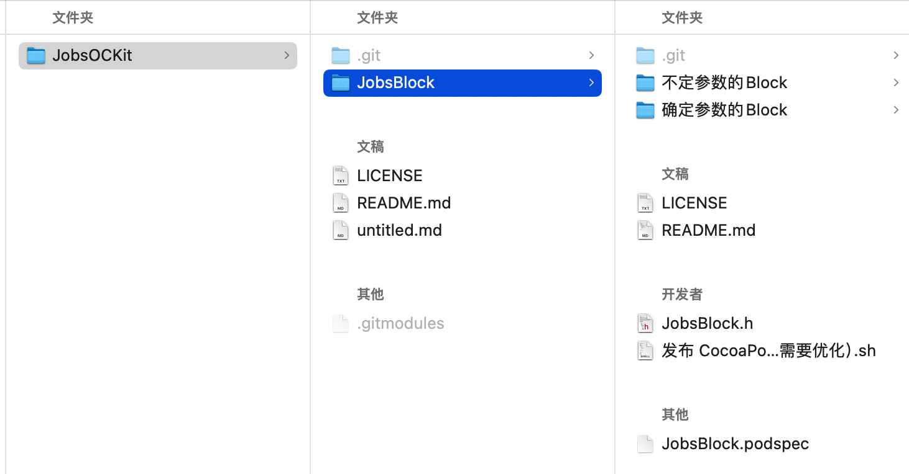
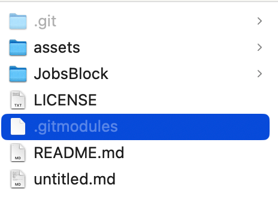

---

## 🔥 <font id=前言>前言</font>

> 子模块不是“父仓自动跟踪另一个目录的全部内容”，而是父仓记录另一个 Git 仓库的特定提交。理解 gitlink、`.gitmodules`、子模块工作树和 `.git/modules` 四层状态，才能正确处理克隆、更新、改名、删除与恢复。

## 一、状态模型 <a href="#前言" style="font-size:17px; color:green;"><b>🔼</b></a> <a href="#🔚" style="font-size:17px; color:green;"><b>🔽</b></a>

| 状态 | 存放位置 | 作用 |
| --- | --- | --- |
| gitlink | 父仓索引与提交，模式为 `160000` | 记录子模块应指向的提交 ID。 |
| 子模块声明 | 父仓根目录 `.gitmodules` | 记录逻辑名称、相对路径、URL 和可选更新策略。 |
| 本地覆盖配置 | 父仓 Git config | `git submodule init` 后写入本机可覆盖的 URL 等配置。 |
| 子模块工作树 | 父仓目录中的子路径 | 展示被锁定提交对应的文件。 |
| 子模块 gitdir | 通常在父仓 `.git/modules/<path>` | 保存子模块自己的对象、引用和配置。工作树中的 `.git` 常是指针文件。 |

检查：

```shell
git ls-files -s | awk '$1 == 160000 { print $2, $4 }'
git submodule status --recursive
git config --file .gitmodules --get-regexp '^submodule\..*\.(path|url|branch|update)$'
git rev-parse --git-path modules
```

`git submodule status` 首字符常见含义：

- 空格：工作树位于父仓记录的提交。
- `-`：尚未初始化。
- `+`：子模块当前 `HEAD` 与父仓记录的 gitlink 不同。
- `U`：存在合并冲突。

## 二、添加子模块

### 2.1、基本命令

```shell
git submodule add <repository-url> <relative-path>
git status
git diff --cached --submodule
git commit -m 'Add submodule'
```

这会：

1. 在目标路径克隆或接管一个已经存在的有效 Git 仓库。
2. 创建或更新 `.gitmodules`。
3. 在父仓索引中暂存模式为 `160000` 的 gitlink。
4. 父仓只记录子模块提交，不把子模块文件作为普通文件重复提交。





### 2.2、相对 URL

```shell
git submodule add ../SharedLibrary.git Vendor/SharedLibrary
```

- 相对 URL 以父仓默认远端的位置为参照，适合同一托管平台或同一组织整体迁移。
- 语义类似目录路径：同级仓库通常需要 `../`，不能因为看起来都在同一组织就省略。
- HTTPS 与 SSH 的选择要考虑团队权限、CI 凭据和离线镜像，不只考虑个人机器能否克隆。

### 2.3、已有目录

如果目标路径已经是一个有效 Git 仓库，`git submodule add` 可以把它登记为子模块而不重新克隆。执行前必须核对：

```shell
git -C <relative-path> remote -v
git -C <relative-path> status --short --branch
git -C <relative-path> rev-parse HEAD
```

未提交内容不会自动进入父仓；先在子模块中单独处理。

## 三、克隆与初始化

### 3.1、一次递归克隆

```shell
git clone --recurse-submodules <superproject-url>
```

已有克隆：

```shell
git submodule update --init --recursive
```

- `init`：把 `.gitmodules` 的声明初始化到本地配置，不检出内容。
- `update`：按父仓 gitlink 检出子模块提交；默认通常是 detached HEAD，这是固定依赖版本的正常状态。
- `--recursive`：继续处理子模块内部的嵌套子模块。

### 3.2、同步 URL 变化

父仓更新了 `.gitmodules` 的 URL 后：

```shell
git submodule sync --recursive
git submodule update --init --recursive
```

`sync` 把 `.gitmodules` 的 URL 同步到本地子模块配置；只 Pull 父仓不会保证本地覆盖配置自动改变。

## 四、日常更新

### 4.1、跟随父仓锁定版本

```shell
git pull --ff-only
git submodule update --init --recursive
```

这会把子模块恢复到父仓记录的提交，不代表拉取子模块某个分支的最新尖端。

### 4.2、主动升级子模块版本

```shell
git -C <submodule-path> fetch --prune origin
git -C <submodule-path> switch <branch>
git -C <submodule-path> pull --ff-only
git add <submodule-path>
git diff --cached --submodule
git commit -m 'Update submodule revision'
```

父仓最后提交的是新的 gitlink。子模块仓库里的新提交必须先推送到协作者和 CI 可访问的远端，否则别人拿到父仓新 gitlink 后无法检出。

### 4.3、`--remote`

```shell
git submodule update --remote --recursive
```

- 它按 `.gitmodules` 的 `submodule.<name>.branch` 或默认远端 HEAD 查找更新，不再只使用父仓当前 gitlink。
- 执行后仍要在父仓审查并提交 gitlink 变化。
- 自动化中使用前要明确更新策略，避免每次构建静默漂移到不同依赖提交。

## 五、在子模块中开发

默认 update 常处于 detached HEAD。需要提交时先切到真实分支：

```shell
git -C <submodule-path> switch <branch>
git -C <submodule-path> status --short --branch
```

完整顺序：

1. 在子模块仓库提交并推送。
2. 回到父仓执行 `git add <submodule-path>`。
3. 在父仓提交新的 gitlink。
4. 推送父仓。

父仓 `git status` 显示“modified content”时，可能是子模块工作区有未提交内容；显示“new commits”时，通常是子模块 `HEAD` 与父仓 gitlink 不同。用以下命令区分：

```shell
git submodule summary --cached
git -C <submodule-path> status --short --branch
git diff --submodule=log
```

`git submodule summary` 没有 `--recursive` 选项；嵌套子模块需要进入对应子模块继续检查，或用 `git submodule foreach --recursive` 执行只读状态命令。

## 六、修改 URL、路径与逻辑名

### 6.1、修改 URL

```shell
git submodule set-url <path> <new-url>
git submodule sync --recursive
git add .gitmodules
git commit -m 'Update submodule URL'
```

修改后验证本地配置与子模块远端：

```shell
git config --file .gitmodules --get-regexp '^submodule\..*\.url$'
git -C <path> remote -v
```

### 6.2、修改路径

优先使用 Git 移动并同步 `.gitmodules`：

```shell
git mv <old-path> <new-path>
git config --file .gitmodules --get-regexp '^submodule\..*\.path$'
git add -- .gitmodules
git diff --cached --submodule
```

- 当前 Git 会在移动子模块时同步 gitfile、`core.worktree`，并尝试更新和暂存 `.gitmodules`；命令后仍要核对逻辑名对应的新路径，不能假设路径层级变化一定无误。
- 直接在 Finder 中移动可能让工作树 `.git` 指针与 `.git/modules` 中的 `core.worktree` 仍指向旧路径。
- 路径包含嵌套目录、空格或 Unicode 时要逐项验证，不要通过批量字符串替换猜测 gitdir。
- 改名后运行：

  ```shell
  git submodule absorbgitdirs <new-path>
  git -C <new-path> rev-parse --show-toplevel
  git -C <new-path> status --short --branch
  ```

### 6.3、逻辑名不等于路径

`.gitmodules` 的 section 名是逻辑名，`path` 才是工作树路径。二者可以不同；脚本或文档不能默认用目录名拼出 `submodule.<name>`。

## 七、删除子模块

### 7.1、正常删除

```shell
git submodule deinit -- <path>
git rm -- <path>
git commit -m 'Remove submodule'
```

- `deinit` 移除本地已注册工作树配置。
- `git rm` 更新父仓索引和 `.gitmodules`；执行前先确认子模块没有需要保留的未提交内容。
- 如果命令因本地修改而拒绝，不要立刻补 `-f`；先进入子模块提交、stash 或备份需要保留的内容。
- `.git/modules/<path>` 的历史元数据可能继续保留，用于恢复或避免误删。确定不需要后再单独备份和清理，不把删除整个 modules 目录当固定步骤。

### 7.2、为什么 `.gitmodules` 要和 gitlink 一起提交

`.gitmodules` 是其他克隆者解析子模块路径与 URL 的来源。只删目录、不提交 `.gitmodules` 和 gitlink，会让父仓处于半删除状态，Sourcetree 可能继续把它显示为异常子模块。

## 八、常见故障

| 现象 | 根因 | 处理 |
| --- | --- | --- |
| 子模块目录为空 | 未初始化或 deinit | `git submodule update --init --recursive -- <path>`。 |
| `no submodule mapping found in .gitmodules` | 索引有 gitlink，但 `.gitmodules` 缺少 path/url | 从正确提交恢复配置，或按删除流程移除 gitlink。 |
| `not our ref <sha>` | 父仓锁定提交不在当前远端可达历史中 | 核对远端、历史重写和其它克隆；不能用随便一个新 HEAD 冒充原提交。 |
| 状态为 `+` | 子模块 HEAD 偏离父仓 gitlink | 决定是 update 回锁定版本，还是在父仓提交新 gitlink。 |
| Sourcetree 显示 `HEAD` | detached HEAD 可能正常；也可能是 `.git` / `core.worktree` 错位 | 先 `rev-parse --show-toplevel` 与查 gitdir，不凭界面文字直接修复。 |
| 子模块有未提交修改 | 修改属于子模块仓库 | 进入子模块单独提交、stash 或恢复；父仓不会保存文件内容。 |
| 改名后路径错位 | 工作树 `.git` 指针或 gitdir `core.worktree` 仍是旧路径 | 备份元数据，核对 URL 与真实路径后再修正；可使用 Jobs Commit 修复动作诊断。 |
| 本地路径协议被拒绝 | Git 对 `file` transport 有安全限制 | 优先使用可审计的 HTTPS/SSH 远端；只在理解信任边界后局部配置。 |

## 九、与 Jobs Commit 修复动作的关系

[**Git 无法 Commit 修复动作**](https://github.com/JobsKits/SourceTree.sh/tree/main/%E3%80%90MacOS%40SourceTree%E3%80%91%F0%9F%93%A5%E4%BF%AE%E5%A4%8DGit%E6%97%A0%E6%B3%95Commit.command) 会处理 Jobs 工作流里出现过的半初始化、路径改名、同源副本借用旧 gitdir 和 `.gitmodules` 未优先暂存等问题。

它不是通用“子模块重置器”：

- 会修改父仓索引，并可能初始化缺失工作树。
- 不提交、不推送、不清理子模块真实修改。
- 只有在 URL、路径和 gitdir 关系能被验证时才自动接管；不明确的错位应停止并人工处理。
- 执行后必须审查 `.gitmodules`、gitlink 和全部暂存变更。

## 十、官方资料

- [**git-submodule**](https://git-scm.com/docs/git-submodule)
- [**gitsubmodules**](https://git-scm.com/docs/gitsubmodules)
- [**gitmodules**](https://git-scm.com/docs/gitmodules)
- [**git-diff 的子模块格式**](https://git-scm.com/docs/git-diff)

<a id="🔚" href="#前言" style="font-size:17px; color:green; font-weight:bold;">我是有底线的➤点我回到首页</a>
