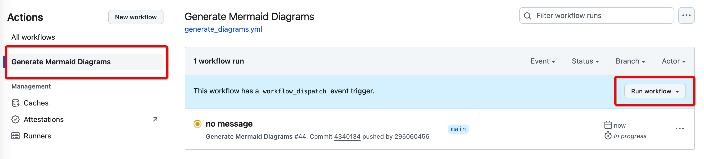
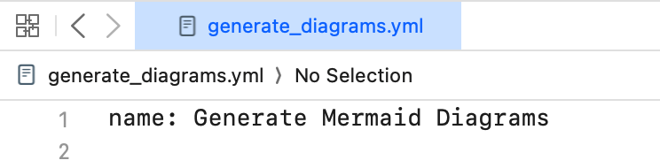
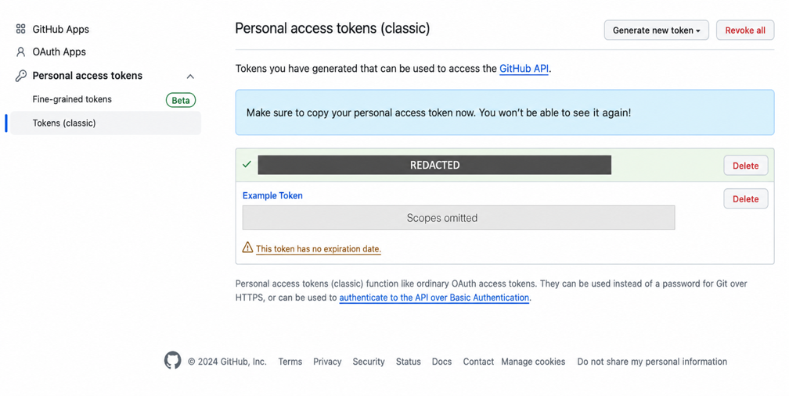
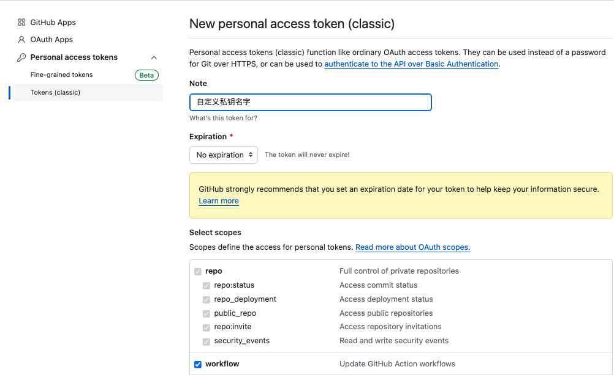
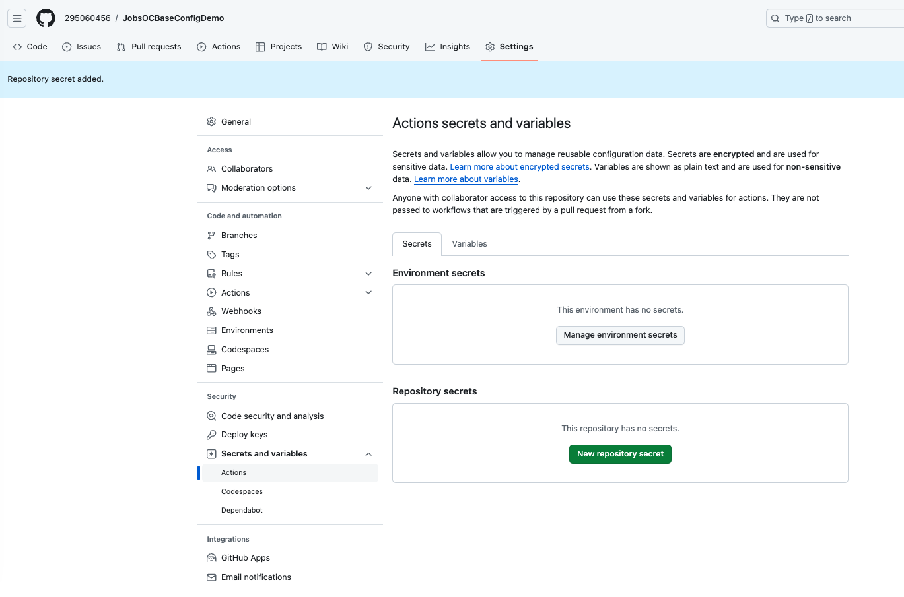
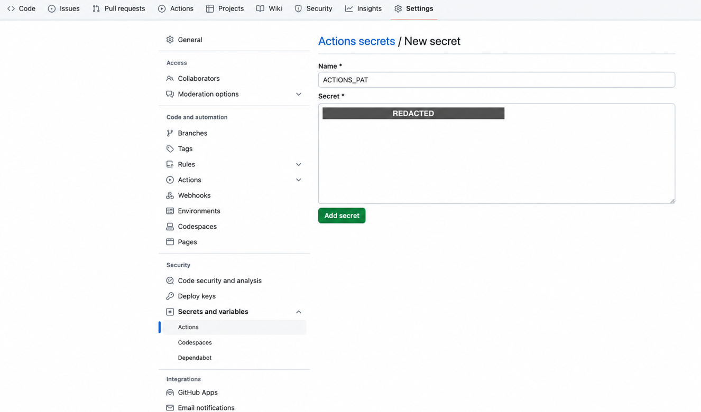
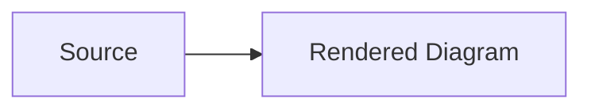

---

## 🔥 <font id=前言>前言</font>

> GitHub Actions 是 GitHub 的事件驱动自动化平台。它不仅能跑 CI/CD，也能做定时任务、发布、依赖更新、文档生成和仓库治理；权限、外部 Action、第三方依赖与不受信任 Pull Request 同时构成供应链边界。

## 一、核心模型 <a href="#前言" style="font-size:17px; color:green;"><b>🔼</b></a> <a href="#🔚" style="font-size:17px; color:green;"><b>🔽</b></a>

| 概念 | 含义 | 关键边界 |
| --- | --- | --- |
| Workflow | 一个 YAML 定义的自动化流程 | 文件必须位于仓库根目录 `.github/workflows/` 才会被 GitHub 识别。 |
| Event | 触发 Workflow 的事件 | Push、Pull Request、定时、Release、手动触发等事件携带不同上下文和权限。 |
| Job | 一组 Steps | 多个 Job 默认可并行；用 `needs` 表达依赖。 |
| Step | 运行脚本或 Action 的最小编排项 | 同一 Job 的 Step 共享工作目录，环境变量不会自动跨 Step 持久化。 |
| Action | 可复用的自动化组件 | `uses:` 引入的代码也是依赖，必须审查来源与版本。 |
| Runner | 执行 Job 的机器 | GitHub-hosted Runner 通常为 Job 提供新环境；self-hosted Runner 会保留本机状态与更高风险。 |
| Artifact | 某次运行上传的产物 | 有保留期，不等同于 Git 提交或 Release 资产。 |
| Cache | 用于加速的可复用缓存 | 不应存储秘密，也不能作为唯一构建产物。 |

工作流路径：

```text
<repository-root>/.github/workflows/<workflow-name>.yml
```

本目录内的 `.github/workflows/generate_diagrams.yml` 是可复制的示例。因为它不在 `JobsDocs` 仓库根目录的 `.github/workflows/`，不会自动成为本仓库的有效 Workflow。

## 二、触发器

```yaml
on:
  push:
    branches:
      - main
  pull_request:
    branches:
      - main
  workflow_dispatch:
```

- `push.branches` 过滤被推送的目标分支。
- `pull_request.branches` 过滤 Pull Request 的目标分支，不是来源分支。
- `workflow_dispatch` 允许在 Actions 页面手动运行；工作流文件通常要存在于默认分支，界面才会提供入口。
- 定时任务用 POSIX cron，时间按 UTC；调度可能延迟，不适合硬实时任务。
- 用 `paths` / `paths-ignore` 时要理解 GitHub 的差异计算和文件数量限制，不能把它当绝对不会漏触发的业务审计器。

历史界面截图：





## 三、权限与凭据

### 3.1、优先使用 `GITHUB_TOKEN`

GitHub 会为每个 Job 自动创建短期 `GITHUB_TOKEN`，权限只在当前仓库和当前 Job 的授权范围内有效。对当前仓库提交生成物通常不需要个人 PAT：

```yaml
permissions:
  contents: write
```

`actions/checkout` 默认可以让后续 Git 命令继续使用该 Token；同仓库 `git push` 不需要把 Token 拼进 URL。

### 3.2、最小权限

- 没有写入需求时显式写：

  ```yaml
  permissions:
    contents: read
  ```

- 需要写入时只给具体 Job，而不是整份 Workflow。
- 来自 fork 的 `pull_request` 不会获得普通仓库 Secret，`GITHUB_TOKEN` 通常为只读；不要设计“PR 验证顺便推回主分支”。
- `pull_request_target` 运行在目标仓库上下文，可能持有更高权限。不能在高权限 Job 中直接 checkout 并执行不受信任 PR 的代码。

### 3.3、什么时候才用额外 Token

可能需要 GitHub App installation token 或细粒度 PAT 的场景：

- 写入另一个仓库。
- 当前仓库 Token 没有目标 API 权限。
- 明确需要让本次自动化产生的新事件继续触发另一个 Workflow。

如果使用 PAT：

- 优先细粒度、限定仓库、最小权限和明确过期时间。
- 存入 Actions Secret，不写入 YAML、远端 URL、日志或截图。
- 个人 PAT 绑定个人账号生命周期；长期自动化优先 GitHub App。
- 一旦 Token 曾出现在截图、提交或日志中，先到平台撤销并轮换；只编辑当前文件不能清除 Git 历史、fork、缓存和旧构建产物中的副本。历史清理需要单独评估备份、协作者、开放分支与强制推送影响。

下面两张旧截图只说明历史界面，不是当前推荐流程。第一张已经脱敏；第二张“classic PAT + 广泛 scope + 无过期”应视为反例：





Repository Secret 历史入口：





## 四、第三方 Action 与依赖安全

- `uses: owner/action@v7` 的 major tag 方便更新，但 tag 可移动；高安全场景固定到经过核验的完整 commit SHA。
- SHA 固定不会自动获得安全修复，需要 Dependabot 或定期审计主动更新。
- 审查 Action 的所有者、仓库、发布、权限和源码，不使用来历不明的 fork。
- `npm install -g <package>` 不可复现。示例至少固定明确版本；正式项目优先提交 `package.json` 与 lockfile，再用 `npm ci`。
- 不在日志中输出整个 `github` context、Secret 或含认证信息的远端 URL。

## 五、Mermaid 自动生成示例

### 5.1、目标

1. Push、Pull Request 和手动运行都验证 Mermaid CLI 能解析输入。
2. 只有 `main` 的 Push 或在 `main` 上手动运行才写回生成图。
3. Pull Request Job 只有读权限，不接触额外 Secret。
4. 同一分支的并发发布互斥，避免自动提交相互抢占。
5. 没有生成变化时正常结束，不让空 commit 导致 Workflow 失败。

### 5.2、工作流

把本目录的示例复制到目标仓库根目录：

```text
.github/workflows/generate_diagrams.yml
```

关键配置：

```yaml
name: Generate Mermaid Diagrams

on:
  push:
    branches:
      - main
  pull_request:
    branches:
      - main
  workflow_dispatch:

concurrency:
  group: mermaid-${{ github.workflow }}-${{ github.ref }}
  cancel-in-progress: false

env:
  MERMAID_INPUT: README.md
  MERMAID_OUTPUT: diagram.png
  MERMAID_CLI_VERSION: 11.16.0
```

截至 2026-08-04，示例使用 `actions/checkout@v7`、`actions/setup-node@v7`、Node.js 24 LTS 和 Mermaid CLI `11.16.0`。版本会演进，维护时必须重新核对上游，不只修改日期。

### 5.3、输入要求

Markdown 输入必须包含合法的 Mermaid fenced code block：

````markdown

````

- 没有 Mermaid 图块时，应该让工作流输出明确提示，不把“必须凭空生成图”写成 CLI 的责任。
- 一个 Markdown 有多张 Mermaid 图时，CLI 可能生成带序号的多个输出；暂存路径要覆盖 `diagram*.png`。
- `mermaid.md` 是复杂输入样例，不代表 GitHub Actions 知识本身。

## 六、写回仓库的安全实现

### 6.1、不要把 PAT 拼进 URL

错误方向：

```text
https://<actor>:<token>@github.com/<repository>.git
```

它可能进入进程参数、错误输出、Git 配置或日志。当前仓库写入应使用 checkout 已配置的 `GITHUB_TOKEN` 凭据，然后直接：

```shell
git push
```

### 6.2、只提交真实变化

```shell
mapfile -d '' generated_files < <(find . -maxdepth 1 -type f -name 'diagram*.png' -print0)
if (( ${#generated_files[@]} == 0 )); then
  echo 'No generated diagram files.'
  exit 1
fi
git add -- "${generated_files[@]}"
if git diff --cached --quiet; then
  echo 'No generated diagram changes.'
  exit 0
fi
git commit -m 'docs: update generated Mermaid diagrams'
git push
```

- `git commit` 在索引无变化时返回非零；自动化要把“无变化”视为正常分支。
- Bash 数组配合 NUL 分隔输入，既兼容空格和特殊字符，也显式处理“没有生成任何文件”的异常情况。
- 工作流自动 Push 使用仓库 `GITHUB_TOKEN` 时，通常不会再次触发普通 Push Workflow，从而避免递归运行；如果改用 PAT 或 GitHub App token，必须重新设计防递归条件。

## 七、本地验证

### 7.1、直接验证命令

```shell
node --version
npm --version
npx --yes @mermaid-js/mermaid-cli@11.16.0 \
  --input README.md \
  --output diagram.png
```

### 7.2、`act`

[**act**](https://github.com/nektos/act) 可以在本地用容器模拟部分 GitHub Actions：

```shell
brew install act
act --list
act workflow_dispatch
```

- `act` 不是 GitHub 官方 Runner，镜像、事件、权限、服务容器、OIDC 和托管环境细节可能不同。
- 本地通过不能证明 GitHub-hosted Runner 一定通过；最终仍要在目标仓库验证。
- 测试 Secret 使用专门的测试值，不能把生产 Secret 写进命令历史或普通文件。

## 八、常见故障

| 现象 | 原因方向 | 处理 |
| --- | --- | --- |
| Workflow 不显示 | 文件不在仓库根 `.github/workflows`、YAML 无效、默认分支未包含文件 | 查路径、Actions 页面和 YAML。 |
| 手动运行按钮不存在 | 缺 `workflow_dispatch`，或 Workflow 未进入默认分支 | 提交到默认分支并刷新。 |
| `Resource not accessible by integration` | `GITHUB_TOKEN` 权限不足或事件被降权 | 查 Job `permissions`、fork PR 和组织策略。 |
| PR 能生成但不能 Push | PR Job 只读，这是预期安全边界 | 把发布拆到受信任的 Push Job。 |
| `git commit` 返回 1 | 没有暂存变化 | 在提交前用 `git diff --cached --quiet` 分支处理。 |
| Push 被保护分支拒绝 | 分支保护、Ruleset、必需审批或签名策略 | 改为创建 PR，不能靠 Token 绕过。 |
| Mermaid CLI 找不到浏览器 | Puppeteer/Runner 依赖、CLI 版本或沙箱问题 | 先使用 CLI 官方安装策略与 GitHub-hosted Runner；不要随意关闭所有沙箱。 |
| 自动提交形成无限循环 | 使用了会触发新 Push 事件的 PAT/App token，且无条件限制 | 改用 `GITHUB_TOKEN` 或增加 actor、路径、消息和并发保护。 |

## 九、官方资料

- [**GitHub Actions 文档**](https://docs.github.com/en/actions)
- [**Workflow 语法**](https://docs.github.com/en/actions/reference/workflows-and-actions/workflow-syntax)
- [**GITHUB_TOKEN**](https://docs.github.com/en/actions/concepts/security/github_token)
- [**安全使用 GitHub Actions**](https://docs.github.com/en/actions/reference/security/secure-use)
- [**actions/checkout**](https://github.com/actions/checkout)
- [**actions/setup-node**](https://github.com/actions/setup-node)
- [**Mermaid CLI**](https://github.com/mermaid-js/mermaid-cli)
- [**Node.js 发布状态**](https://nodejs.org/en/about/previous-releases)

<a id="🔚" href="#前言" style="font-size:17px; color:green; font-weight:bold;">我是有底线的➤点我回到首页</a>
