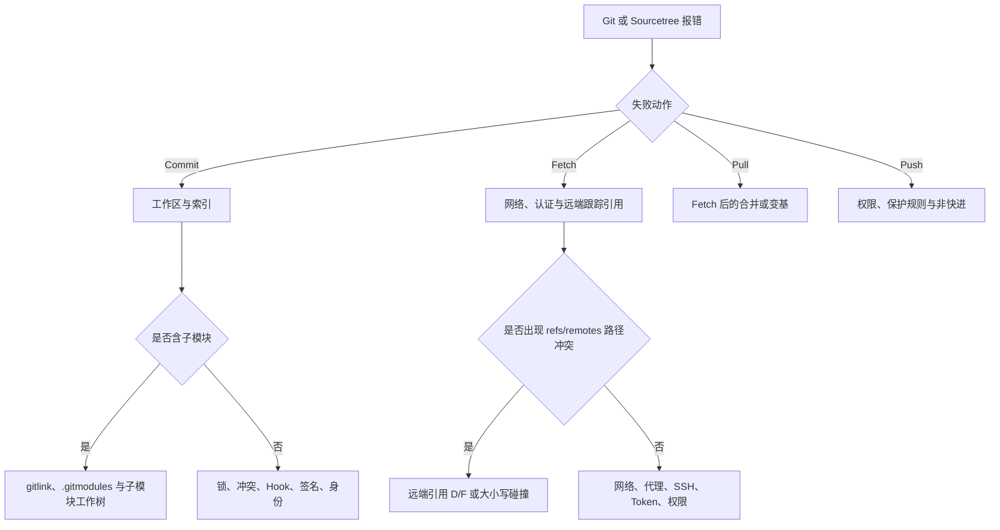

---

## 🔥 <font id=前言>前言</font>

> 本目录不只记录命令，还要回答“Git 正在修改哪一层状态、为什么失败、怎样止损、怎样恢复、什么时候不该执行某条命令”。遇到临时故障时，先从故障手册按错误类型分流，再回到专题文档理解原理。

## 一、知识地图 <a href="#前言" style="font-size:17px; color:green;"><b>🔼</b></a> <a href="#🔚" style="font-size:17px; color:green;"><b>🔽</b></a>

| 主题 | 文档 | 解决的问题 |
| --- | --- | --- |
| 故障急救 | [Git 故障诊断与恢复手册](./Git故障诊断与恢复.md/Git故障诊断与恢复.md) | 无法 Commit、Fetch、Pull、Push，锁、Hook、签名、认证、子模块、引用和对象恢复。 |
| 核心与日常 | [Git 核心原理与日常工作流](./Git核心原理与日常工作流.md/Git核心原理与日常工作流.md) | 对象、快照、索引、分支、合并、撤销、远端、忽略规则、属性、跨平台文件名和标签。 |
| 日常与进阶 | [Git 的一些使用说明](./Git的一些使用说明.md/Git的一些使用说明.md) | 远端、配置层级、rebase、cherry-pick、历史改写、stash 恢复和无共同历史合并。 |
| 治理与高级工具 | [Git 仓库治理与高级工具](./Git仓库治理与高级工具.md/Git仓库治理与高级工具.md) | revisions、worktree、stash、rerere、bisect、Hook、签名、大仓库、LFS、备份、维护与泄漏治理。 |
| 子模块 | [Git 子模块使用](./Git子模块使用.md/Git子模块使用.md) | gitlink、`.gitmodules`、克隆、更新、改 URL、改路径、删除和常见错位。 |
| GitHub SSH | [通过 SSH 连接 GitHub](./通过SSH连接到GitHub/通过SSH连接到GitHub.md) | Ed25519 密钥、macOS Keychain、多账号、Host Key 校验和连接排错。 |
| GitHub Actions | [GitHub Actions 工作流](./Github.workflow.md/Github.workflow.md) | Workflow、Event、Job、Step、Runner、权限、Token、Mermaid 自动生成和安全边界。 |
| Mermaid 样例 | [Mermaid 输入样例](./Github.workflow.md/mermaid.md) | 供工作流验证 Markdown 内 Mermaid 图块的解析与输出。 |

## 二、故障发生时先看哪一层



## 三、先止损，再修复

- 在不知道错误性质时，先保存现场，不要先执行 `reset --hard`、`clean -fd`、删除 `.git`、全局关闭 SSL 校验或批量删除引用。

  ```shell
  git status --short --branch
  git diff
  git diff --cached
  git rev-parse --show-toplevel
  git reflog -20 --date=iso
  ```

- `git fetch` 与 `git pull` 不是同一动作：Fetch 下载对象并更新远端跟踪引用；Pull 在 Fetch 之后还会把远端历史整合进当前分支。
- `git add` 修改索引，`git commit` 从索引创建提交。界面显示“无法 Commit”时，根因经常发生在暂存阶段，而不是提交对象创建阶段。
- `git reset --hard` 会让工作区和索引匹配目标提交；`git clean` 会删除未跟踪内容。没有确认可恢复来源前，不把它们当通用修复命令。
- 强制推送优先使用带明确预期值的 `--force-with-lease=<分支>:<预期提交>`；裸 `--force` 可能覆盖他人已经推送的提交。

## 四、知识来源与可信度

- 命令语义以 [**Git 官方文档**](https://git-scm.com/docs) 为准。
- GitHub 认证与 Actions 行为以 [**GitHub Docs**](https://docs.github.com/) 为准。
- Sourcetree 自定义动作入口以 [**Atlassian Support**](https://support.atlassian.com/sourcetree/) 为准。
- Jobs 自用修复脚本的真实行为以 [**SourceTree.sh**](https://github.com/JobsKits/SourceTree.sh) 仓库中的脚本和同目录 README 为准；博客只做原理、边界和使用入口的同步说明。
- 截图只能证明拍摄当时的界面，不作为长期稳定的命令或权限依据；正文必须同时给出可复制命令和官方链接。

## 五、维护规则

- 修复脚本新增一种错误识别、状态变更或安全边界时，同步更新故障手册。
- Git、GitHub Actions、Node.js、SSH 或 Sourcetree 上游行为变化时，先核对官方文档，再更新示例版本和结论。
- 危险命令必须同时说明影响对象、恢复条件和更安全替代方案。
- 示例中的邮箱、仓库名、Token、SSH 公钥和提交 ID 使用占位符；不得把私人凭据或可复用秘密写进文档。
- 每条“恢复成功”结论都要区分：对象仍在本地、reflog 尚未过期、远端仍有副本、备份存在，以及对象已被垃圾回收五种前提。

## 六、当前审计范围

- 已纳入 Git 目录现有 Markdown、隐藏的 GitHub Actions 工作流、截图和 Mermaid 示例。
- 已纳入两个仓库外的真实工作流来源：`修复Git无法Commit` 与 `修复Git无法Fetch` 的脚本及 README。
- 文档只解释脚本已经实现并可验证的行为；没有被脚本或官方文档证明的推断，不写成既定事实。

<a id="🔚" href="#前言" style="font-size:17px; color:green; font-weight:bold;">我是有底线的➤点我回到首页</a>
