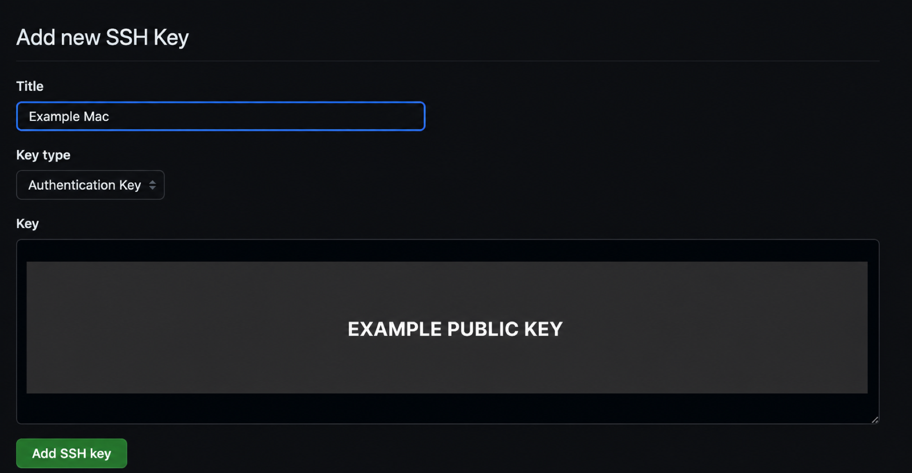
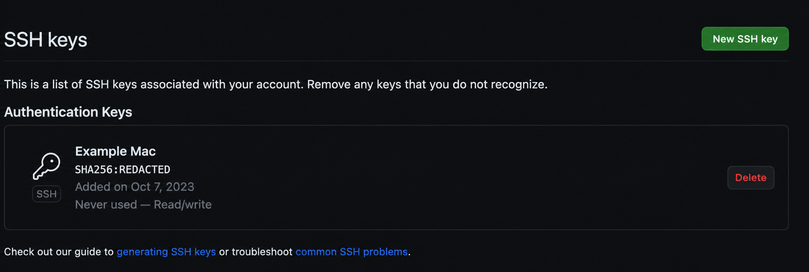
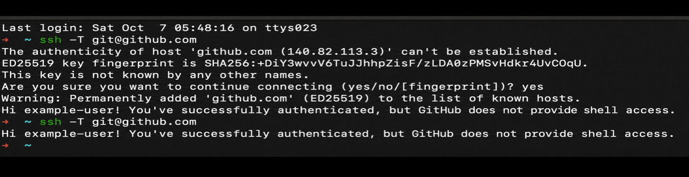

---

## 🔥 <font id=前言>前言</font>

> SSH 用本机私钥证明身份，GitHub 账户只保存公钥。私钥、私钥口令、Token 和 Cookie 不得上传到仓库或发给他人；公钥虽然不是秘密，也应避免在通用示例中固化个人邮箱和机器身份。

## 一、先检查已有密钥 <a href="#前言" style="font-size:17px; color:green;"><b>🔼</b></a> <a href="#🔚" style="font-size:17px; color:green;"><b>🔽</b></a>

```shell
ls -al ~/.ssh
ssh-add -l
```

常见公钥文件：

- `id_ed25519.pub`
- `id_ecdsa.pub`
- `id_rsa.pub`

如果已有受信任且仍安全的密钥，可以复用；不要每次认证失败都覆盖默认密钥。先确认失败来自密钥选择、agent、Host 配置还是仓库权限。

## 二、生成新密钥

GitHub 当前默认推荐 Ed25519：

```shell
ssh-keygen -t ed25519 -C 'your_email@example.com'
```

旧系统不支持 Ed25519 时再使用 RSA 4096：

```shell
ssh-keygen -t rsa -b 4096 -C 'your_email@example.com'
```

交互时：

1. 默认文件名通常是 `~/.ssh/id_ed25519`。
2. 已有同名密钥时不要直接覆盖，改用可辨认的名字，例如 `id_ed25519_github_personal`。
3. 建议设置私钥口令；遗失私钥口令无法从公钥反推，只能换新密钥。

## 三、权限与文件结构

```shell
mkdir -p ~/.ssh
chmod 700 ~/.ssh
chmod 600 ~/.ssh/id_ed25519
chmod 644 ~/.ssh/id_ed25519.pub
touch ~/.ssh/config
chmod 600 ~/.ssh/config
```

- 私钥只允许当前用户读写。
- 公钥可读不等于应到处复制；保留可识别标题，方便以后撤销旧设备。
- `~/.ssh/config` 可能包含内部主机、用户名和路径，分享前脱敏。

## 四、配置 `~/.ssh/config`

### 4.1、单一 GitHub 账号

```sshconfig
Host github.com
  HostName github.com
  User git
  AddKeysToAgent yes
  UseKeychain yes
  IdentityFile ~/.ssh/id_ed25519
  IdentitiesOnly yes
```

- `User git` 是 GitHub SSH 的固定用户，不是 GitHub 登录名。
- `IdentitiesOnly yes` 让 SSH 只尝试显式配置的密钥，避免 agent 中密钥过多导致认证失败。
- `UseKeychain yes` 适用于 macOS 保存私钥口令；未给私钥设置口令时可以省略。
- 非 Apple OpenSSH 若不认识 `UseKeychain`，可在对应 Host 块前加入：

  ```sshconfig
  IgnoreUnknown UseKeychain
  ```

### 4.2、多个 GitHub 账号

```sshconfig
Host github-personal
  HostName github.com
  User git
  AddKeysToAgent yes
  UseKeychain yes
  IdentityFile ~/.ssh/id_ed25519_github_personal
  IdentitiesOnly yes

Host github-work
  HostName github.com
  User git
  AddKeysToAgent yes
  UseKeychain yes
  IdentityFile ~/.ssh/id_ed25519_github_work
  IdentitiesOnly yes
```

远端 URL 使用 Host 别名：

```shell
git remote set-url origin git@github-personal:OWNER/REPOSITORY.git
```

本地 commit 身份与 SSH 登录身份是两套配置，还要按仓库设置：

```shell
git config user.name 'Your Name'
git config user.email 'your_email@example.com'
```

## 五、加入 `ssh-agent` 与 macOS Keychain

有口令的 macOS 私钥：

```shell
ssh-add --apple-use-keychain ~/.ssh/id_ed25519
ssh-add -l
```

没有口令时：

```shell
ssh-add ~/.ssh/id_ed25519
ssh-add -l
```

如果当前会话没有 agent，再启动：

```shell
eval "$(ssh-agent -s)"
```

- `ssh-agent` 缓存的是解锁后的密钥使用能力，不会把私钥上传给 GitHub。
- Sourcetree 与终端可能使用不同 Git/SSH 实现。排错时先确认 Sourcetree 使用系统 Git 还是内置 Git，以及是否走系统 OpenSSH。

## 六、把公钥添加到 GitHub

复制公钥：

```shell
pbcopy < ~/.ssh/id_ed25519.pub
```

打开 GitHub 设置：

```shell
open 'https://github.com/settings/ssh/new'
```

然后：

1. `Title` 写明设备和用途，例如 `MacBook-Pro-2026`。
2. `Key type` 选择 Authentication Key；用于签名时要按 GitHub 要求单独登记 Signing Key。
3. `Key` 只粘贴 `.pub` 文件内容，绝不能粘贴无 `.pub` 后缀的私钥。
4. 旧设备、丢失设备或不再使用的密钥及时撤销。

历史界面截图只用于识别入口，GitHub 页面布局可能变化：






也可以使用已登录的 [**GitHub CLI**](https://cli.github.com/)：

```shell
gh ssh-key add ~/.ssh/id_ed25519.pub --type authentication --title 'MacBook-Pro-2026'
```

## 七、校验主机身份并测试

首次连接会询问是否信任 GitHub 主机密钥。不要只因为域名看起来正确就直接输入 `yes`；把终端显示的指纹与 [GitHub 官方 SSH Key 指纹](https://docs.github.com/en/authentication/keeping-your-account-and-data-secure/githubs-ssh-key-fingerprints) 对比。

测试：

```shell
ssh -T git@github.com
```

首次成功通常会显示 GitHub 已认证你的账号，但不提供 shell access。该命令可能以退出码 `1` 结束，这是 GitHub 不提供交互 shell 的预期行为，不能只看退出码判断认证失败。



详细诊断：

```shell
ssh -vT git@github.com
```

重点看：

- 实际匹配了哪个 Host 块。
- 尝试了哪个 `IdentityFile`。
- agent 是否提供对应密钥。
- 服务器最终接受了哪把公钥。

## 八、切换仓库远端到 SSH

```shell
git remote -v
git remote set-url origin git@github.com:OWNER/REPOSITORY.git
git remote get-url --all origin
git ls-remote origin
```

`ssh -T` 成功只证明账号级 SSH 认证成功；`git ls-remote` 才同时验证仓库 URL 和当前账号对目标仓库的读取权限。Push 权限还要另行验证。

## 九、端口 `22` 被阻断

GitHub 提供经 `ssh.github.com:443` 的 SSH 入口。先测试：

```shell
ssh -T -p 443 git@ssh.github.com
```

需要长期使用时：

```sshconfig
Host github.com
  HostName ssh.github.com
  Port 443
  User git
  AddKeysToAgent yes
  UseKeychain yes
  IdentityFile ~/.ssh/id_ed25519
  IdentitiesOnly yes
```

企业代理可能仍阻断或检查 443；不要通过关闭 Host Key 校验绕过安全策略。

## 十、常见故障

| 现象 | 可能原因 | 处理 |
| --- | --- | --- |
| `Permission denied (publickey)` | 公钥未加入账号、选错私钥、agent 未加载、账号无仓库权限 | 用 `ssh -vT` 看实际密钥，再查 GitHub Key 列表和仓库权限。 |
| `Too many authentication failures` | agent 提供了过多密钥 | 为 Host 设置 `IdentityFile` 与 `IdentitiesOnly yes`。 |
| 终端成功、Sourcetree 失败 | Sourcetree 使用不同 Git/SSH 或不同环境 | 统一到系统 Git/OpenSSH，核对自定义客户端设置。 |
| 每次都要求输入口令 | Keychain 未保存、Host 块未匹配或 key 未加入 agent | 查 `ssh -G github.com` 和 `ssh-add -l`。 |
| Host Key changed | GitHub 轮换、DNS/代理变化或潜在中间人 | 停止连接，先核对官方公告和指纹；不要直接删除 known_hosts 后盲信。 |
| `Repository not found` | 远端 URL 错、仓库被移动/删除，或认证账号无权访问 | `git remote -v`、`ssh -T`、`git ls-remote origin` 分层核对。 |
| `Bad owner or permissions on ~/.ssh/config` | 目录或配置权限过宽 | 修正 `~/.ssh` 为 `700`、config 与私钥为 `600`。 |

查看 SSH 最终解析结果：

```shell
ssh -G github.com | grep -E '^(hostname|user|port|identityfile|identitiesonly) '
```

## 十一、官方资料

- [**检查已有 SSH Key**](https://docs.github.com/en/authentication/connecting-to-github-with-ssh/checking-for-existing-ssh-keys)
- [**生成 SSH Key 并加入 agent**](https://docs.github.com/en/authentication/connecting-to-github-with-ssh/generating-a-new-ssh-key-and-adding-it-to-the-ssh-agent?platform=mac)
- [**把 SSH Key 加入 GitHub**](https://docs.github.com/en/authentication/connecting-to-github-with-ssh/adding-a-new-ssh-key-to-your-github-account)
- [**测试 SSH 连接**](https://docs.github.com/en/authentication/connecting-to-github-with-ssh/testing-your-ssh-connection)
- [**经 HTTPS 端口使用 SSH**](https://docs.github.com/en/authentication/troubleshooting-ssh/using-ssh-over-the-https-port)

<a id="🔚" href="#前言" style="font-size:17px; color:green; font-weight:bold;">我是有底线的➤点我回到首页</a>
