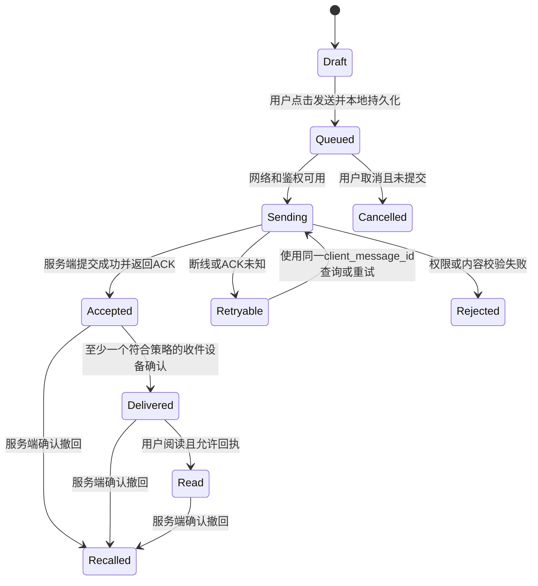

章节导航（兼容不支持 [toc] 的阅读器）

| 章节 | 内容 |
| --- | --- |
| [一、结论与边界](#chapter-1) | 全量定义、范围、95项前端和30项后端编目 |
| [二、纠错](#chapter-2) | 32项实质修订与互斥要求 |
| [三、前端](#chapter-3) | 可验收的功能矩阵 |
| [四、共同合同](#chapter-4) | 演示回退、状态机、同步、权限 |
| [五、市场](#chapter-5) | 竞品能力与技术趋势 |
| [六、Web3](#chapter-6) | [**Status**](https://status.app/)等候选与9项扩展验收 |
| [七、后端](#chapter-7) | 功能职责、万人容量、SLO、灾备与成本 |
| [八、平台安全](#chapter-8) | 平台规则与12项安全验收 |
| [九、实施验收](#chapter-9) | 参数、18项链路场景、阶段建议 |
| [十、原表](#chapter-10) | 87行逐项转写与正文映射 |
| [十一、来源和评审](#chapter-11) | 验证范围与待定决策 |

---

## 🔥 前言

本文件由 `IM需求明细表.xlsx` 改写，面向 [**iOS**](https://developer.apple.com/ios/)、其他移动端、Web、桌面端与后端研发。审计基准日为 **2026年10月6日**，文档版本为 **全量需求基线 v1.0（待产品评审）**。

原表较完整地覆盖了账号鉴权、媒体类型、隐私设置和钱包设想，但对 **真正决定 IM 能否稳定运行的会话、群管理、消息可靠性、多端一致性、密钥生命周期、服务治理** 描述不足。部分安全、平台和金融要求需要改正。正文已经给出替代要求；文末逐行保留原表，方便核对，不将原有错误继续当作开发合同。

“全量”指 **在明确产品边界内，将功能域、状态、异常、权限、数据生命周期和对应后端能力列完整**，不代表首版同时上线所有市场产品的功能，也不代表此后不会出现新需求。此文件提供可以封板的功能全集；新增需求必须归入既有功能域，或通过范围变更新增独立域。

本文件中的“要求”为建议采用的研发合同，“建议值”为评审与压测起点，“可选”为独立扩展。竞品事实附官方来源；从竞品推导的产品选择属于本次审计建议。尚未确定目标地区、商业模式、预算、团队规模与首发平台，因此没有将建议误写成已确认的商业或架构决策。

## 一、审计结论与全量边界 <a href="#前言" style="font-size:17px; color:green;"><b>🔼</b></a> <a href="#🔚" style="font-size:17px; color:green;"><b>🔽</b></a>

### 1.1、原始文件与覆盖证据 <a href="#前言" style="font-size:17px; color:green;"><b>🔼</b></a> <a href="#🔚" style="font-size:17px; color:green;"><b>🔽</b></a>

| 项目 | 核对结果 |
| --- | --- |
| 原始输入 | 桌面 `IM需求明细表.xlsx`；读取后未改动 |
| 工作表 | `Sheet1`，可见；范围 `A1:E88` |
| 实际内容 | 85 个非空行、169 个非空单元格、38 个合并区域；无公式、批注和嵌入图片 |
| 空白行 | 第 78、79、87 行没有独立单元格内容，属于上方合并内容的延续 |
| 改写方式 | 正文规范化需求 + 纠错清单 + 前后端映射 + 原表逐行转写 |
| 追溯编号 | `O-002` 表示 `Sheet1` 第 2 行；`FE-xxx` 为前端需求；`BE-xxx` 为后端需求；`A-xx` 为审计问题 |
| 原文件校验 | SHA-256：`1f4320cf4b1064ec16b3b7688d8b64260a539127fab516e55d2958ac9a29dad2` |

### 1.2、产品功能边界 <a href="#前言" style="font-size:17px; color:green;"><b>🔼</b></a> <a href="#🔚" style="font-size:17px; color:green;"><b>🔽</b></a>

| 范围 | 包含内容 | 全量基线中的位置 |
| --- | --- | --- |
| 核心 IM | 身份、联系人、会话、单聊群聊、消息、媒体、离线、多端、推送、搜索、隐私、举报、数据管理 | 所有实现阶段都必须维护完整的正确性合同 |
| 成熟通信体验 | 回复、编辑、撤回、反应、置顶、草稿、消息请求、音视频、跨端交接、无障碍、主题语言 | 全量纳入，按产品阶段逐项启用 |
| 社区与协作 | 频道、社区、话题线程、投票、活动、机器人、屏幕共享、会议 | 场景扩展；不要求每个普通单聊产品默认开启 |
| 商业扩展 | 会员、数字权益、企业工作区、广告、支付红包、积分、客服 | 独立开关、定价、合同与验收，不能污染核心消息链路 |
| 前沿扩展 | AI 辅助、钱包身份、去中心化消息、链上凭证、跨服务互通 | 纳入选型空间；通过技术、隐私、市场和地区评审后立项 |
| 超出本基线 | 通用短视频平台、完整电商/交易所、银行清算、无限插件运行、万人同时视频上麦 | 另建业务需求，不以“IM 全量”为由自动扩张 |

**建议产品定位：以成熟通用 IM 为主干，预留社区、企业与 Web3 适配接口。** 不默认同时采用中心化云聊天、全端到端加密、联盟互通和代币经济；这些选项会改变服务器可见数据、账号恢复、内容治理与运营成本。

### 1.3、需求级别和封板规则 <a href="#前言" style="font-size:17px; color:green;"><b>🔼</b></a> <a href="#🔚" style="font-size:17px; color:green;"><b>🔽</b></a>

| 标记 | 含义 | 验收规则 |
| --- | --- | --- |
| C 核心 | IM 正确性、账号安全、基本聊天与发布所必需的能力 | 不能以 UI 完成代替链路验收 |
| S 成熟 | 通用产品中有价值的完整体验 | 进入某期发布范围后，成功、失败、权限和多端状态一起交付 |
| X 扩展 | 面向特定商业或技术场景 | 默认关闭；启用前给出独立需求、依赖和验收 |

本文共编目 **95 项前端需求和 30 项后端能力**。一个编号可以包含同一语义的多个状态或子动作，不能将该数量理解为工程任务数、估时或“所有可能的 IM 功能”的数学上限。

每项需求进入开发前补齐：负责人、发布范围、交互稿、接口/事件合同、权限矩阵、参数默认值、异常文案、测试数据、指标与验收记录。关闭扩展开关时应隐藏入口或说明不可用原因；不能保留看似可执行的空壳。

## 二、原表纠错与语义修订 <a href="#前言" style="font-size:17px; color:green;"><b>🔼</b></a> <a href="#🔚" style="font-size:17px; color:green;"><b>🔽</b></a>

### 2.1、必须纠正的问题 <a href="#前言" style="font-size:17px; color:green;"><b>🔼</b></a> <a href="#🔚" style="font-size:17px; color:green;"><b>🔽</b></a>

| 编号 | 原表位置与问题 | 修订后的要求 | 影响 |
| --- | --- | --- | --- |
| A-01 | O-017～020 把登录方式放入“注册鉴权”；O-022、069 写“邮箱短信” | 区分注册、登录、绑定、恢复；邮箱使用邮件验证码或验证链接，短信用于手机号；账号不存在时按明确流程创建 | FE-001～005 |
| A-02 | O-035 “有注册登录就必须接入 [**Apple**](https://www.apple.com/) ID” | 按当前审核指南的第三方/社交主账号登录条件和例外评估等价登录服务；Apple 登录是常用方案，不能写成所有账号应用的绝对条件 | FE-003、078 |
| A-03 | O-023、071 安全问答；O-024 默认让客服收身份证后重置初始密码 | 安全问答不作为可靠恢复因子；采用恢复码、可信设备、强验证和受控人工复核；客服发一次性恢复流程，不查看密码，不直接发通用初始密码；非必要不收身份证 | FE-005、062 |
| A-04 | O-010、070 手势锁必须先绑定手机/邮箱；O-011、012、072、073 扫脸声纹不区分用途 | 本地应用锁和远端身份认证分开；优先系统生物识别，不自行采集声纹/人脸；换设备的恢复依赖账号恢复，不依赖本地手势 | FE-007、062 |
| A-05 | O-076 用 MD5 加盐存密码，使用“SSL”笼统描述安全 | 密码采用适合密码的慢散列；传输使用现代 TLS；存储加密、E2EE、备份加密、密钥管理分别设计 | FE-060～064、BE-001、018 |
| A-06 | O-063 后台随时新增加密算法，旧数据无限沿用旧算法 | 使用经评审的协议和版本化密钥体系；客户端支持能力协商；弃用不安全版本要迁移或明确不可恢复；运营配置不能下发任意密码代码 | FE-060、BE-018 |
| A-07 | O-084 对称密钥直接放相关库表 | 设备密钥放安全存储；服务密钥经密钥管理系统托管；密文与可直接解密它的明文密钥不可共库裸存；E2EE 内容密钥不得交给服务器解密 | FE-060、063 |
| A-08 | O-084 不考虑多设备合并，与 O-075 多端实时同步矛盾 | 强制定义设备注册、事件增量、游标、幂等去重、编辑/撤回/删除冲突、已读与未读同步及新设备历史授权 | FE-008、037 |
| A-09 | O-084 “只要手机内存够强劲”就无限存储 | 区分内存与磁盘；实现分页、媒体配额、LRU/按时间清理、低磁盘保护、数据库迁移与修复；保留消息正文和清除媒体分别可操作 | FE-058、072 |
| A-10 | O-084 永远不能删除云端数据，只能增量同步 | 区分本地清理、本人视图删除、双方撤回、账户删除和依法保留；服务端删除事件、索引/CDN/备份到期策略必须可传播和审计 | FE-031、059、064 |
| A-11 | O-086 阅后即焚要求本地和服务器都绝不记录 | 采用最少必要的临时密文与到期清理，定义阅读/发送/送达计时起点；无服务器临时存储时会失去部分离线能力；不承诺接收者无法截屏或外部拍摄 | FE-061、BE-009、019 |
| A-12 | O-080 后台监控所有私聊和群聊 | 不设计无边界私聊监控；普通云会话受用途、授权、最小权限与审计约束；E2EE 会话不能由后台读取明文，举报由用户主动提供证据 | FE-064、082、BE-021 |
| A-13 | O-088 前端自动生成验证码防刷 | 前端仅展示挑战；服务端生成/验签、一次性消费、过期、限速并结合风险判断；绕过前端仍必须被服务端阻止 | FE-002、BE-001、021 |
| A-14 | O-055、056 目标点击账单即扣款 | 点击只打开详情；支付须展示收款方、金额、币种与费用，用户明确确认并完成必要验证；以支付渠道的可信回调/查单确认结果 | FE-089、BE-028 |
| A-15 | O-053 “小于 200 人民币”、O-054 “任意金额” | 200 元与 24 小时可保留为产品建议参数，不是行业或监管通则；单笔、日累计、实名、余额、退款和地区限额共同校验；不得任意转账 | FE-089、BE-028 |
| A-16 | O-059 将微信/支付宝/银行卡当币种；O-061 将 USDT 内部账叫内部链 | 区分法币、支付渠道、不可兑付积分、托管余额和链上资产；内部余额账本不自动构成区块链，USDT 链别/合约/小数精度必须明确 | FE-090、093 |
| A-17 | O-062 将“加密存储”作为会员权益 | 传输安全、密码保护、必要存储保护、举报和账户删除属于基础能力；会员可以扩展配额/主题等，不能让免费用户被迫暴露隐私 | FE-087 |
| A-18 | O-064 VPN 模块实际描述域名轮询 | 改为接入点发现、健康检查、故障切换与安全配置；只有真要建立系统隧道才立项 VPN，并单独处理平台授权、用途和市场要求 | FE-076 |
| A-19 | O-036 通讯录匹配后自动把全部联系人加入白名单 | 通讯录发现、好友关系、消息许可分开；授权导入可撤回，不自动加好友，不自动授予全部权限；手机号哈希本身也不等于匿名化 | FE-015、066 |
| A-20 | O-065、066 暴露黑名单 IP/设备；O-080 显示双方当前 IP；O-086 定位权限后上报 IP | 不向聊天对象公开原始 IP、设备标识或风险名单；IP 可由接入服务观察，GPS 权限不决定能否取到 IP；设备安全页的地区信息按近似值展示 | FE-009、057、065 |
| A-21 | O-086 用单勾/双勾直接表达未读/已读 | 先定义本地待发、服务端接受、设备送达、用户已读、失败；图标是表现层；隐藏已读或大群不具备全量回执时不能伪装为精确状态 | FE-027、036 |
| A-22 | O-086 万人同时在线混合会议要求 | 将群成员数、同群在线设备数、发消息速率、扇出量、音视频上麦数和观看数分别建容量合同；禁止推导为万人双向视频会议 | FE-041、054 |
| A-23 | O-048 仅按后缀禁 exe/sh；O-086 头像允许一切格式 | 采用允许类型、真实类型识别、大小/像素/时长限制和安全处理；防压缩炸弹、主动内容与恶意链接；头像静态为基础，动图/短视频为有约束扩展 | FE-011、029、030 |
| A-24 | O-088 任意强制弹广告、下载更新包 | 广告不阻断紧急通信、不误导点击；iOS 通过商店批准渠道更新，不自行下载安装可执行更新；强更需兼容策略并提供获取新版入口 | FE-077、084 |
| A-25 | O-020、086 罗列全部第三方登录/分享，无接入边界 | 每个提供方独立核验实际 API、SDK、授权范围、地区与审核资格；不能因为产品存在就假设提供可用登录接口；[**Twitter**](https://x.com/) 现名使用 X，保留原称谓便于追溯 | FE-003、074 |
| A-26 | O-031～033 默认全体用户实名及存身份证照片 | 根据场景和地区单独决定是否需要实名；优先供应商验证结果及必要凭证，不默认存原始身份证；访问、留存、删除和泄漏响应专门设计 | FE-006、064 |
| A-27 | O-032 “mino”；O-048 “普通文件文件”；O-085 “时间区域” | 分别改为对象存储（原文疑似指 [**MinIO**](https://min.io/)）、普通文件、时间范围；不据此锁定供应商或具体数据库 | FE-029、058、BE-010 |
| A-28 | O-029、030 邀请码上下级关系无约束 | 改为邀请来源归因；绑定规则、解绑、反作弊和隐私限制清楚；不自动引入多级返佣、资金关系或公开完整关系链 | FE-080 |
| A-29 | O-077 删除用户与封禁混为处罚级别 | 禁言、限制功能、封禁、用户主动注销分开；删除按数据生命周期执行，留存合法处罚记录；通知理由、时效、复核和申诉 | FE-082、BE-021 |
| A-30 | O-041 将“用户来源”用于好友添加来源；O-042 展示共同群无授权 | 区分注册来源与关系来源；共同群仅展示双方可见的交集，退出或隐藏群后不可继续泄漏成员关系 | FE-017、080 |
| A-31 | O-082 拍摄成功就保存；O-086 500 米附近的人精确定位 | 媒体先保存到应用临时区，由用户决定是否写相册；附近的人默认关闭，用粗粒度距离、频控和撤回机制，防跟踪与位置推断 | FE-057、069 |
| A-32 | O-051 外链无法构成动画格式要求；O-047、052 播放续点未定义 | 消息动画定义协议、版本、资源预算与低性能回退；播放定义暂停/续播、倍速、音频中断、进度存储与失效场景 | FE-028、030、053 |

### 2.2、冲突必须在架构评审中闭合 <a href="#前言" style="font-size:17px; color:green;"><b>🔼</b></a> <a href="#🔚" style="font-size:17px; color:green;"><b>🔽</b></a>

| 选项 | 可同时具备 | 不能无条件同时承诺 |
| --- | --- | --- |
| E2EE 私密会话 | 服务端转发密文、用户端搜索、受控加密备份、用户选择性举报、授权设备同步 | 服务端任意明文搜索/AI 总结/私聊监控、客服无密钥恢复全部历史 |
| 阅后即焚 | 临时密文、过期清理、到期提示、撤回同步 | 永远零存储、任何情况下离线送达、绝对禁止接收者留存 |
| 云历史长期同步 | 版本化事件、可恢复游标、分层保留、删除墓碑 | 永远不删、同时满足所有账户删除需求、备份无限增长 |
| 万人群 | 受控发言、扇出批量化、聚合回执、限流和治理 | 逐消息展示万人全部已读明细且无成本、万人同时双向高清上麦 |
| 去中心化网络 | 节点冗余、开放协议、自托管身份或钱包 | 运营方保证所有节点立即物理删除、完全无元数据暴露、零运营费用 |

这些是需求兼容性限制，不能通过“后台可配置”消除。

## 三、前端全量需求与后端对应 <a href="#前言" style="font-size:17px; color:green;"><b>🔼</b></a> <a href="#🔚" style="font-size:17px; color:green;"><b>🔽</b></a>

### 3.1、账号、登录和设备（FE-001～010） <a href="#前言" style="font-size:17px; color:green;"><b>🔼</b></a> <a href="#🔚" style="font-size:17px; color:green;"><b>🔽</b></a>

| 编号/级别 | 功能与前端合同 | 对应后端 | 关键验收 |
| --- | --- | --- | --- |
| FE-001 C | 注册、登录、退出、账号存在性处理；手机号含国际代码，邮箱验证；本人修改密码，手机/邮箱绑定、换绑、解绑；错误提示避免批量枚举账号 | BE-001、BE-002 | 换号保持原user_id；新凭证验真、旧可信通道通知，解绑不能移除最后有效登录/恢复途径；注册中断、旧号遗失/回收、绑定冲突均可验证 |
| FE-002 C | 密码/短信/邮件登录；验证码倒计时、重发、风险挑战、限流提示 | BE-001、BE-021 | 客户端绕过、重放、并发验证码与过期均被拒绝 |
| FE-003 S | Apple 及审核通过的第三方登录；绑定/解绑、授权撤销、重复身份合并提示 | BE-001、BE-002 | 不能按邮箱相同直接合并账号；保留至少一种有效登录途径 |
| FE-004 S | 通行密钥、强验证及新设备验证；系统验证失败可使用受控恢复途径 | BE-001、BE-002 | 验证挑战一次性，凭证可删除，跨设备登录语义清楚 |
| FE-005 C | 找回密码、恢复码、可信设备恢复、人工申诉入口；凭证变更重新认证，风险冷静期与撤销旧会话 | BE-001、BE-002、BE-021 | 重置后旧会话按策略失效，客服无法查看原密码；新号码持有人不能自动获得旧账号或E2EE历史 |
| FE-006 X | 场景所需实名、年龄/企业身份认证；资料脱敏、进度、失败原因、复核 | BE-003、BE-021、BE-030 | 非必需通信功能不强收身份证；验证材料保留期限可查 |
| FE-007 S | 本地应用锁、系统生物识别、锁屏预览控制；本地手势为可选弱保护 | BE-002、BE-018 | 锁定态不能从通知/深链进入敏感会话；不上传系统生物模板 |
| FE-008 C | 单/多设备策略；设备链接、可信设备确认、扫码登录、历史授权与会话撤销 | BE-002、BE-007、BE-018 | QR 短期且一次性；显示待登录设备并手机确认；撤销后不能继续收发 |
| FE-009 C | 设备列表：型号、近似地区、最后活跃、安全事件；新设备提醒、退出指定/全部设备 | BE-002、BE-014 | 不伪造精确地理位置；撤销令牌、连接、推送和密钥权限同步 |
| FE-010 C | 登录过期、账号冻结、设备风险、服务维护、Token 刷新与并发请求恢复 | BE-001、BE-002、BE-021、BE-024 | 刷新失败收口为一个登录入口，不重复弹窗，不无限重试 |

### 3.2、资料、好友和消息请求（FE-011～018） <a href="#前言" style="font-size:17px; color:green;"><b>🔼</b></a> <a href="#🔚" style="font-size:17px; color:green;"><b>🔽</b></a>

| 编号/级别 | 功能与前端合同 | 对应后端 | 关键验收 |
| --- | --- | --- | --- |
| FE-011 C | ID/用户名/昵称、头像、简介；昵称和签名审核；动图/短视频头像为受限扩展 | BE-003、BE-010、BE-021 | 唯一标识与显示名分开；签名上限可配置（原表 50 字建议保留）；格式失败有静态兜底 |
| FE-012 C | 好友列表、分组/标签、备注、添加来源、删除好友与关系状态 | BE-004 | 删除好友不等于双方删除聊天；两端状态按关系策略一致 |
| FE-013 C | ID/用户名/手机号/二维码/群名片搜索与添加申请；搜索隐私设置 | BE-003、BE-004、BE-021 | 关闭手机号搜索后不能被该方式发现；不默认按真实姓名公开搜索 |
| FE-014 C | 陌生人消息请求、接受/拒绝/举报、屏蔽附件预加载与危险链接 | BE-004、BE-021 | 未接受请求不能自动来电、读回执或获取在线状态 |
| FE-015 S | 通讯录选择性发现、有限授权、取消同步、批量导入结果与撤回 | BE-003、BE-004 | 不自动添加全部好友/白名单；拒绝权限仍可手工加好友 |
| FE-016 C | 拉黑、解除、允许名单、谁可发消息/来电/加群；可按文本、图片、语音、文件、来电分别设许可；好友与系统封禁分开展示 | BE-003、BE-004、BE-021 | 服务端强制执行，不能只靠前端隐藏按钮；拉黑默认阻断私聊/来电，特殊例外可见且可撤销；群内交互规则明确 |
| FE-017 S | 好友/群名片、共同群、资料可见范围；生日等额外资料按需收集 | BE-003、BE-004、BE-011 | 共同群仅展示可见交集；转发名片不授予查看私有资料权限 |
| FE-018 S | 在线/最后活跃、正在输入、忙碌/勿扰状态及可见性控制 | BE-003、BE-008 | 状态有有效期；允许关闭；断网与后台不误判为仍持续在线 |

### 3.3、会话与导航（FE-019～025） <a href="#前言" style="font-size:17px; color:green;"><b>🔼</b></a> <a href="#🔚" style="font-size:17px; color:green;"><b>🔽</b></a>

| 编号/级别 | 功能与前端合同 | 对应后端 | 关键验收 |
| --- | --- | --- | --- |
| FE-019 C | 会话列表、最新摘要、未读/提及、时间排序、未知消息降级 | BE-005、BE-007、BE-008 | 编辑/撤回/删除后摘要正确；隐私模式不泄漏锁屏文字 |
| FE-020 C | 会话免打扰、置顶、归档、标记未读、隐藏/移除、通知粒度 | BE-005、BE-008、BE-014 | 标记未读是提醒，不回滚真实阅读游标；不能取消已发出的回执 |
| FE-021 C | 草稿、输入恢复、回复目标、附件队列、发送键习惯和输入法适配 | BE-005、BE-006、BE-010 | 崩溃恢复不把草稿自动发出；跨端草稿冲突有明确策略 |
| FE-022 C | 历史分页、定位消息、跳到最新、未读分界与返回原位置 | BE-005、BE-007、BE-020 | 删除/过期目标显示原因，不跳到错误消息；加载不改变阅读位置 |
| FE-023 C | 全局/会话搜索，中文、英文、拼音索引；按人/日期/媒体/文件过滤 | BE-020 | 拼音误差可解释；E2EE 内容只在授权端索引；结果仍做权限校验 |
| FE-024 S | 自己的收藏/笔记会话、收藏夹、文件聚合和跨端查看 | BE-005、BE-010、BE-019 | 收藏是独立副本或引用需声明；原消息删除后的行为一致 |
| FE-025 S | 手机单栏、平板/桌面分栏、多窗口、多账号切换、键盘导航 | BE-002、BE-005、BE-007 | 多账号数据库/缓存/通知隔离；切账号不泄漏上一账号内容 |

### 3.4、消息、媒体与一致性（FE-026～040） <a href="#前言" style="font-size:17px; color:green;"><b>🔼</b></a> <a href="#🔚" style="font-size:17px; color:green;"><b>🔽</b></a>

| 编号/级别 | 功能与前端合同 | 对应后端 | 关键验收 |
| --- | --- | --- | --- |
| FE-026 C | 文本、emoji、提及、链接、安全预览、卡片与未知类型降级 | BE-006、BE-010、BE-013 | Unicode 组合字符计数清楚，超长分段/拒绝统一；富文本不执行脚本 |
| FE-027 C | 发送中/已接受/已送达/已读/失败；失败重发、取消队列、离线发送 | BE-006、BE-007 | ACK 丢失后重发同一消息不重复；本地写成功不当作服务端成功 |
| FE-028 C | 语音条录制、取消、播放、倍速、续播、未听标记；转写为可选 | BE-010、BE-027 | 录音中断可恢复或明确失败；转写失败不影响原音频；外发转写需知情选择 |
| FE-029 C | 图片/动图/视频/文件：选取、编辑、压缩、原图选项、缩略图、上传进度、暂停/重试、断点续传、下载保存；视频预览/播放、暂停、拖动与续播进度 | BE-006、BE-010、BE-019 | 前后端都校验大小/类型；退出会话/切后台再进入可从合法续点播放，明确进度仅本机或跨端同步；过期链接可刷新；元数据去除与原图保留策略清楚 |
| FE-030 S | 贴纸、动画、自定义表情包；资源版本、配额、静音、减少动态效果 | BE-010、BE-013 | 动画格式由跨端能力评审决定；不支持时展示可识别静态图，不远程执行代码 |
| FE-031 C | 本人视图删除、本地清理、双方撤回，区分时间窗/权限与提示 | BE-009、BE-019、BE-020 | 离线设备补同步后不复活已撤回消息；删除不能保证接收者已保存副本消失 |
| FE-032 S | 消息编辑、编辑标记、冲突版本、允许时间和类型 | BE-009 | 两端编辑版本收敛，不能越权编辑他人消息；保留策略按会话类型定义 |
| FE-033 S | 引用回复、线程/话题、跳转原消息、表情反应与取消 | BE-009、BE-012、BE-013 | 被引用消息删除后只保留允许的残余信息；重复反应请求幂等 |
| FE-034 S | 单条/多选转发、合并转发、来源与说明、禁止转发策略 | BE-009、BE-013 | 不把源会话权限带给新收件人；钱款/登录卡片不能当可重复执行消息转发 |
| FE-035 S | 消息置顶、多个置顶列表、定位原文、权限与到期 | BE-011、BE-013 | 顶部显示最新一条或轮播策略明确；个人置顶与全群置顶分开 |
| FE-036 C | 本人阅读游标、未读数与对外已读回执分开；多端一致；群回执按用户聚合 | BE-008 | 阅读不倒退；关闭回执仍同步本人未读但不外发已读；群人数按用户而非设备去重，分母和隐私规则明确；大群可关闭逐人回执 |
| FE-037 C | 多端增量同步、断线重连、补洞、重复乱序处理、新设备历史与加密状态 | BE-002、BE-007、BE-018、BE-019 | 至少测试重连、撤回后上线、设备时钟错误、旧端升级和游标过期 |
| FE-038 S | 定时发送、静默发送、提醒/稍后处理、取消计划与时区；E2EE采用支持该能力的协议/端侧或受控密文调度 | BE-009、BE-014 | 执行时身份/成员/密钥版本有效，否则暂停并请授权设备重加密或明确失败；服务端不得取得正文修复密文；不能把后台未运行误判为计划已发 |
| FE-039 S | 投票、活动/事件提醒、任务/待办卡片；选项与变更权限 | BE-013、BE-014 | 一人一票/多选/匿名规则明确；取消活动传播；机器人卡片不能越权写数据 |
| FE-040 C | 系统事件：入退群、权限改变、来电未接、公告、服务通知 | BE-011、BE-013、BE-015 | 可信事件由服务端签发，普通用户不能伪造管理消息 |

### 3.5、群、频道和社区（FE-041～048） <a href="#前言" style="font-size:17px; color:green;"><b>🔼</b></a> <a href="#🔚" style="font-size:17px; color:green;"><b>🔽</b></a>

| 编号/级别 | 功能与前端合同 | 对应后端 | 关键验收 |
| --- | --- | --- | --- |
| FE-041 C | 创建/解散/退出群、群名头像简介、成员上限、群角色与可见规则 | BE-011、BE-024 | 群主/管理员/成员权限明确；万人成员和在线压测分别报告 |
| FE-042 C | 邀请、入群申请、链接/二维码、过期撤销、反刷、历史可见起点 | BE-011、BE-021 | 被踢成员旧链接不可绕过封禁；退群后媒体链接失效策略生效 |
| FE-043 C | 转让群主、任命管理员、踢人、禁言、全员禁言、慢速模式、权限提示 | BE-011、BE-021、BE-022 | 前后端同权限；失去权限后旧页面操作被拒绝且刷新状态 |
| FE-044 C | 群公告、置顶、群昵称/成员标签、文件/媒体、搜索与提及 | BE-011、BE-013 | 全员提及有角色/频率限制；公告修改和到期一致 |
| FE-045 S | 群话题/子频道、频道订阅/广播、评论权限、分类与发现 | BE-012、BE-020 | 私有频道不可被非成员搜索内容；订阅不等于双向好友关系 |
| FE-046 X | 社区容纳多个群/频道，分层角色、规则入门、审核与内容分区 | BE-011、BE-012、BE-021 | 社区成员与频道权限独立，退出社区撤销相关能力 |
| FE-047 S | 大群通知/回执降级、管理员工具、风险提示、屏蔽与举报 | BE-008、BE-012、BE-014、BE-021、BE-024 | 不能给每个成员推送所有输入状态和逐人已读；限流有可理解反馈 |
| FE-048 X | 企业工作区、组织目录、游客、单点登录、保留/导出政策提示 | BE-003、BE-011、BE-030 | 企业空间与个人空间数据隔离；管理员能力和会话可见模式事前告知 |

### 3.6、音视频、会议与位置（FE-049～057） <a href="#前言" style="font-size:17px; color:green;"><b>🔼</b></a> <a href="#🔚" style="font-size:17px; color:green;"><b>🔽</b></a>

| 编号/级别 | 功能与前端合同 | 对应后端 | 关键验收 |
| --- | --- | --- | --- |
| FE-049 S | 单人语音/视频呼叫、取消、拒绝、未接、通话记录、权限引导；隐私通话模式按策略强制中继 | BE-014、BE-015、BE-016 | 呼叫超时和取消可靠传达；失败不产生持续响铃；陌生人来电接听前不交换可暴露对端地址的候选；中继失败不静默改直连 |
| FE-050 S | 群语音/视频：邀请、房间、举手、主持人、禁麦、移除、加入权限 | BE-011、BE-015、BE-016 | 上麦人数、观看人数、房间数分别限制；踢出后不能继续订阅媒体 |
| FE-051 S | 麦克风/摄像头切换、扬声器/耳机/蓝牙、前后摄像头、弱网降级、视频质量 | BE-016、BE-026 | 自动适配优先；会员只能提高预算/上限，不保证网络条件之外的清晰度 |
| FE-052 S | 单线忙线、多线等待、保持/恢复、电话打断、系统来电集成与跨设备接听 | BE-002、BE-014、BE-015 | 一台设备接听后其他设备停止响铃；来电 UI 与服务端状态一致 |
| FE-053 S | 通话/播放状态恢复、音频焦点、路由中断、网络切换与异常终止 | BE-015、BE-016 | Wi-Fi/蜂窝切换可恢复或明确结束；系统电话后状态不会卡死 |
| FE-054 X | 会议排期、屏幕共享、主持人、成员列表、字幕、录制、会议分钟数 | BE-013、BE-015、BE-016、BE-027 | 录制/云转写先提示参与者；用户拒绝权限可继续使用基础通话 |
| FE-055 X | 滤镜、背景虚化、变声、噪声抑制与低端机降级 | BE-016 | 过热/低电时可降低效果；变声/滤镜不能作为远程实名认证凭据 |
| FE-056 S | 单次位置和限时实时位置分享、地图卡片、停止共享、过期 | BE-017 | 可立即停止，最小精度/时长可配置；关闭权限不继续采集 |
| FE-057 X | 附近的人默认关闭，粗粒度距离、可见时长、屏蔽、反跟踪 | BE-017、BE-021 | 500 米仅是产品参数；不暴露精确坐标或原始 IP；关闭后及时移出发现列表 |

### 3.7、隐私、数据、安全和用户权利（FE-058～067） <a href="#前言" style="font-size:17px; color:green;"><b>🔼</b></a> <a href="#🔚" style="font-size:17px; color:green;"><b>🔽</b></a>

| 编号/级别 | 功能与前端合同 | 对应后端 | 关键验收 |
| --- | --- | --- | --- |
| FE-058 C | 本地/云历史、缓存体积、媒体清理、保留期、备份/恢复、存储不足提示 | BE-010、BE-019、BE-020 | 原表 3个月/半年/1年为可配套餐建议；文本/媒体/备份保留分开；清缓存不误删待发附件 |
| FE-059 C | 账户注销、数据导出/删除请求、处理进度、合法保留例外说明 | BE-002、BE-019、BE-020、BE-030 | 注销与退出/冻结不同；旧令牌不能复活账号；支付/法定记录保留有独立理由与期限 |
| FE-060 C | 传输/本地加密；正文、附件/缩略图、单人通话、群媒体、屏幕共享、备份逐项声明E2EE范围；设备安全码/身份验证、密钥变化提醒 | BE-018 | 不把 TLS 或媒体逐跳加密叫完整E2EE；录制/字幕改变可见性时需参与者明确知情；不兼容功能关闭或提示，不静默降级；所有端支持范围一致 |
| FE-061 S | 阅后即焚、一次查看媒体、敏感预览遮挡、计时与到期通知 | BE-009、BE-018、BE-019 | 明确计时起点与最大暂存；日志/通知/备份遵守清理；不作绝对防截屏承诺 |
| FE-062 C | 应用锁、敏感操作二次验证、密钥恢复码、恢复失败反馈 | BE-001、BE-002、BE-018 | 登录恢复不代表 E2EE 历史恢复；恢复因子遗失的后果提前说明 |
| FE-063 S | E2EE 备份选择、端对端设备迁移、可信设备交接与密钥失效 | BE-002、BE-018、BE-019 | 服务端无法明文还原私密备份；撤销设备不等于抹除该设备已经保存的历史 |
| FE-064 C | 隐私政策/协议版本、用途授权、撤回、未成年人策略、举报证据选择 | BE-003、BE-019、BE-021、BE-030 | 不用“后台新增隐私策略”代替用户知情；敏感信息最少收集、用途受限 |
| FE-065 C | 手机号/真实姓名/头像/在线/已读/来电/群邀请可见与发现控制 | BE-003、BE-004、BE-008 | 可见性和可搜索性分开；原始 IP/风险设备号不展示给他人 |
| FE-066 C | 权限中心、最小授权、相册/通讯录有限访问、权限撤回后的降级 | BE-003、BE-004、BE-010、BE-017 | 拒绝通讯录/定位/相册不影响纯文本通信；不重复诱导授权 |
| FE-067 C | 拉黑、举报、诈骗警示、证据预览、进度、申诉与安全帮助 | BE-004、BE-021、BE-022 | 选择证据后才上传；不把整个私密会话自动上报；举报限流防恶意滥用 |

### 3.8、iOS、Web、桌面与体验工程（FE-068～077） <a href="#前言" style="font-size:17px; color:green;"><b>🔼</b></a> <a href="#🔚" style="font-size:17px; color:green;"><b>🔽</b></a>

| 编号/级别 | 功能与前端合同 | 对应后端 | 关键验收 |
| --- | --- | --- | --- |
| FE-068 C | iOS 推送、锁屏摘要、通知动作、会话分组、角标、免打扰与深链 | BE-008、BE-014 | 推送丢失/重复/延迟不丢消息；以消息同步修正角标；敏感内容默认受保护 |
| FE-069 C | 相机/麦克风/照片/定位/通讯录权限；相机临时文件，保存相册由用户选择 | BE-010、BE-017 | 取消拍摄不保存；有限相册可继续选取；录音与来电前按场景请求权限 |
| FE-070 C | 前台/后台/被系统终止/离线/锁屏/重新安装的生命周期 | BE-002、BE-007、BE-014、BE-015 | 不依赖后台永久长连接；冷启动补同步；用户强退和系统限制下不作即时送达承诺 |
| FE-071 C | Web HTTPS、登录保护、跨标签页协调、拖拽/粘贴上传、浏览器通知与缓存 | BE-001、BE-002、BE-007、BE-010、BE-023 | 防脚本注入和跨站请求；Cookie/Token 策略明确；浏览器不支持的能力可识别降级 |
| FE-072 C | 本地数据库/索引、事务、分页、迁移、账号隔离、崩溃恢复与低磁盘保护 | BE-007、BE-019、BE-020 | 十万条消息量级滚动/搜索按目标机压测；索引不泄漏私密明文；异常不无限重建 |
| FE-073 C | 多语言、时区、深浅/跟随系统主题、字体放大、读屏、键盘、减少动态效果、RTL | BE-003、BE-005、BE-013 | 关键流程在最大字体和读屏下可完成；时间显示本地化，排序用服务端事件序 |
| FE-074 S | 系统分享面板、Share Extension、二维码/链接、受控第三方分享、跨端交接 | BE-002、BE-010、BE-023 | 分享扩展内不能越过账号锁；邀请参数可撤销，不泄漏Token；禁转发策略有边界 |
| FE-075 C | API 请求优先、本地演示回退、完整空态/重载、连接状态和数据来源 | BE-006、BE-007、BE-024 | 无服务可演示、恢复后真数据覆盖；演示与真账号数据隔离，详见第四章 |
| FE-076 C | 环境配置、接入点健康与故障切换、离线反馈、代理/网络限制提示 | BE-024 | 安全验证服务端配置，不信任任意域名；Debug 环境切换不进入 Release 用户入口 |
| FE-077 C | 版本兼容、最低支持版、非强制/必要强制更新、更新说明、维护状态 | BE-024、BE-025 | iOS 进入商店更新；旧版可读取基本状态/帮助；强更不困住资金和数据权利入口 |

### 3.9、运营、审核、开放集成（FE-078～084） <a href="#前言" style="font-size:17px; color:green;"><b>🔼</b></a> <a href="#🔚" style="font-size:17px; color:green;"><b>🔽</b></a>

| 编号/级别 | 功能与前端合同 | 对应后端 | 关键验收 |
| --- | --- | --- | --- |
| FE-078 C | 商店发布、登录/UGC/隐私/删除/购买审核、地区开关、审核演示账号 | BE-001、BE-019、BE-021、BE-024、BE-026、BE-030 | 声明 SDK 采集与隐私要求；实际端到端流程和审核资料一致 |
| FE-079 C | 配置/功能开关、可用权限、灰度、公告、服务状态与帮助客服 | BE-003、BE-022、BE-024 | 配置有版本/回滚/默认值，权限仍以服务端判断为准 |
| FE-080 S | 邀请码、注册来源/关系来源、二维码和链接归因、活动参数 | BE-004、BE-022、BE-023 | 不自动形成多级资金上下线；过期/欺诈邀请可撤销；不把用户关系公开给邀请人 |
| FE-081 X | IM SDK/宿主用户绑定、应用内互通、Deep Link/Universal Link、开放API | BE-001、BE-023 | 外部 ID 经服务端映射与租户鉴权；对外可见 ID 不代替访问授权 |
| FE-082 C | 管理端：举报队列、内容/资料审核、禁言/封禁、申诉、权限审批和审计 | BE-021、BE-022 | 最小权限；处罚说明/期限；禁止无边界私聊监控；敏感操作可追溯 |
| FE-083 X | 机器人/插件授权、指令、事件订阅、账号标识、撤销与权限审阅 | BE-013、BE-023 | 机器人不能默认读取全部历史；调用须租户/会话授权；密钥不进客户端 |
| FE-084 X | 开屏资源/品牌信息/广告：本地兜底、远程缓存、频控、跳过、投诉 | BE-010、BE-022 | 首次显示内置资源；仅使用完整有效缓存；通话/发送/支付不能被强制广告打断 |

### 3.10、AI、付费、钱包与 Web3（FE-085～095） <a href="#前言" style="font-size:17px; color:green;"><b>🔼</b></a> <a href="#🔚" style="font-size:17px; color:green;"><b>🔽</b></a>

| 编号/级别 | 功能与前端合同 | 对应后端 | 关键验收 |
| --- | --- | --- | --- |
| FE-085 X | AI 转写/翻译/摘要/搜索/建议回复；逐功能开关、输入选择、模型处理说明 | BE-020、BE-027 | 默认不自动上传全部私聊；生成内容可编辑并标记；无法处理时保留原消息 |
| FE-086 X | 端侧 AI、可选云 AI 和企业知识助手；用量、成本、保留、撤回 | BE-018、BE-023、BE-027 | 私密模式优先端侧或用户明确授权选段；提示注入防护；AI 不自行执行支付/封禁 |
| FE-087 X | 会员权益、配额、订阅、试用、恢复购买、到期和降级；级别数由产品决定 | BE-026 | VIP1～VIP10 不作固定技术结构；必要安全不收费；跨端权益由服务端对账 |
| FE-088 X | 数字贴纸/主题/额外配额购买；权益说明、退款/撤销、购买历史 | BE-026 | 按平台/地区购买规则实施；客户端显示成功不直接授予权益 |
| FE-089 X | 法币红包/转账/AA 收款/付款请求；明确确认、状态、过期、退回、争议 | BE-028 | 未点确认不扣款；超时与重复操作不多扣；红包过期退回不是前端计时器记账 |
| FE-090 X | 钱包、账单筛选（目标/金额/日期/类型）、积分余额、充值/提现 | BE-020、BE-028、BE-029 | 法币/积分/链上资产分开；金额使用最小单位/精确定点；账单来自账务事实 |
| FE-091 X | 钱包身份登录/绑定、地址展示/校验、签名确认、身份恢复与解绑 | BE-001、BE-002、BE-029 | 地址不是公开全部关系的许可；签名包含域、链、随机挑战、到期；私钥不上传 |
| FE-092 X | 去中心化消息传输、节点发现、密文暂存、离线同步、节点故障与延迟说明 | BE-007、BE-018、BE-023、BE-024、BE-029 | 清楚说明网络/运营边界，不把消息正文上链；能测连接、离线送达与删除限制 |
| FE-093 X | 可选链上转账卡片、网络/合约/币种/费用、授权和交易状态 | BE-029 | 广播/待确认/已确认/失败/重组分开；不承诺交易可撤回；公链交易可见性提示 |
| FE-094 X | Token-gated 社区、可验证成员资格、链上凭证与可撤销证明 | BE-011、BE-012、BE-018、BE-029 | 检查资格不是读取钱包全部资产；资格失效后撤权；可保留不依赖代币的替代认证 |
| FE-095 X | 跨协议/联邦互通、外部桥接身份、会话能力协商与安全提示 | BE-018、BE-023、BE-030 | 身份、权限、加密和删除语义不能完整保持时提示并限制，不静默跨信任边界 |

## 四、跨端数据合同与关键状态机 <a href="#前言" style="font-size:17px; color:green;"><b>🔼</b></a> <a href="#🔚" style="font-size:17px; color:green;"><b>🔽</b></a>

### 4.1、服务端优先与本地演示回退 <a href="#前言" style="font-size:17px; color:green;"><b>🔼</b></a> <a href="#🔚" style="font-size:17px; color:green;"><b>🔽</b></a>

所有进入/刷新页面、列表加载与用户写操作都正常请求 API。首屏可以先显示打包的本地演示数据，成功后用服务端响应替换；失败、短超时或解析失败时继续可操作的本地演示。**演示模式必须可识别并使用隔离的演示账号、数据库和命名空间**，不能把模拟消息伪装为已经送达真实收件人。

已登录正式账号优先展示该账号上次已验证的本地缓存和待发队列；接口不可用时，可自动进入明确标记且隔离的演示视图，不能用假历史、余额或未读数覆盖正式账号数据库。切换账号/环境/会话后，旧请求、上传和订阅结果按归属与请求代次丢弃；服务恢复后重新对账，不丢正式 Outbox、真实分页位置或尚未确认的操作，也不把演示编辑合并进真历史。

- 建议交互 API 超时起点为 3～5 秒并可配置；媒体上传与 RTC 分别定义超时，不能共用短超时。
- 正式账号的断网待发消息进入独立 Outbox。网络恢复后只重试这些用户明确提交的消息，并按幂等 ID 对账；演示账号操作不自动回放成真实消息。
- 真请求成功后自动切回服务端状态；删除/撤回、支付、会员、设备撤销等敏感结果须经服务端确认，演示仅显示模拟结果。
- 对所有动态列表提供加载中、有数据、空数据、失败/离线、权限受限和重载状态。iOS 优先复用项目已有 `JobsEmptyAuto` 等完整空态控件。
- 附件/头像等先展示已打包的本地品牌资源或合法的既有资源；远程失败保留兜底。产品素材优先来源为 [**iconfont**](https://www.iconfont.cn/)，无合适素材时使用可追溯官方/开放许可来源，下载到项目资源目录并记出处。
- 部署说明须包含 API 回退、空态、图片兜底、离线预览、演示隔离与服务恢复方法。

### 4.2、消息状态机 <a href="#前言" style="font-size:17px; color:green;"><b>🔼</b></a> <a href="#🔚" style="font-size:17px; color:green;"><b>🔽</b></a>

服务端接受代表已达到合同约定的持久提交点，不代表对方已经收到。发送超时代表结果未知，必须查询/幂等重试，不能直接生成一条新消息。撤回受时间窗和权限约束；“用户视图删除”与该状态机中的“撤回”是不同事件。媒体先上传或采用明确的附件待就绪状态，不能展示永远无法下载的成功消息。

上图的送达表示单聊中收件用户至少一台合格设备收讫。群聊按用户去重展示送达/阅读人数或明确聚合状态，不能将一个成员收到说成全群收到；全员回执的分母采用发送时有权收取的成员集或经声明的其他规则。本人内部阅读游标始终用于未读同步，对外已读事件只在允许时发布。

仅尚未提交的本地队列可以立即取消。发送中或 ACK 未知时，“停止重试”不保证消息没有提交；必须查询权威结果，已接受消息改走撤回流程。服务端取消能力若存在，应定义取消与提交的竞争结果，前端不能先宣称取消成功。

### 4.3、同步、数据对象和冲突规则 <a href="#前言" style="font-size:17px; color:green;"><b>🔼</b></a> <a href="#🔚" style="font-size:17px; color:green;"><b>🔽</b></a>

| 对象/字段 | 必须定义的合同 |
| --- | --- |
| 账号/设备/会话 | `user_id`、`device_id`、`session_id`、`conversation_id` 分离；外部账号映射按应用/租户隔离；标识符不可猜测不等于授权 |
| 消息 | 客户端幂等 ID、服务端消息 ID、会话序号/游标、发送者、类型/协议版本、服务端时间、编辑版本、附件引用、加密模式 |
| 事件流 | 消息、编辑、撤回、删除、已读、成员/角色变化都进入可同步事件；游标过期返回明确的重建方案 |
| 顺序 | 定义会话内权威顺序；不依赖手机时钟，不要求全系统全局唯一严格顺序；断线补洞与去重分别处理 |
| 阅读 | `last_read_seq` 单调推进；标记未读仅提醒；新加入成员历史起点、不可见事件与过期消息不应产生幽灵未读 |
| 草稿/偏好 | 本地专属还是跨端同步逐字段声明；多端修改按版本/字段合并，不能一律依赖客户端时间覆盖 |
| 删除/撤回 | 删除范围、执行人、版本、时间、到期、墓碑保留；搜索、缓存、CDN、备份及长时间离线设备行为一致 |
| 恢复/迁移 | 新设备是否有历史、谁授权密钥、备份密码遗失后果、旧设备撤销、账号切换与重装分别定义 |
| 协议演进 | 未知字段可忽略，未知类型可展示占位并升级提示；安全必需版本不可静默降级；服务端可撤销最低版本 |

普通消息采用 **至少一次传输 + 服务端/客户端幂等处理** 达到用户可见不重复。不能把 WebSocket 或队列本身写成“恰好一次业务提交”的保证。[**WebSocket RFC 6455**](https://www.rfc-editor.org/info/rfc6455/) 定义双向传输，不替应用实现离线历史、业务确认和去重；这些属于本需求合同。

### 4.4、权限模型与失效策略 <a href="#前言" style="font-size:17px; color:green;"><b>🔼</b></a> <a href="#🔚" style="font-size:17px; color:green;"><b>🔽</b></a>

账号有效、设备有效、会话成员、角色权限、关系/屏蔽、功能权益、区域限制与风控状态应分别计算。所有写操作在服务器重新鉴权；实时通道和媒体下载也要鉴权，不能只保护 HTTP 页面入口。

退出群、禁言、设备撤销、账户冻结、会员到期和 Token 刷新失败，必须明确前端当前页面/待发队列/通话/附件下载的即时行为。预签名下载链接采用短期有效与合理撤销策略，不能承诺已下载数据远程抹除。

## 五、当前市场与技术补充 <a href="#前言" style="font-size:17px; color:green;"><b>🔼</b></a> <a href="#🔚" style="font-size:17px; color:green;"><b>🔽</b></a>

### 5.1、竞品能力与本需求的关系 <a href="#前言" style="font-size:17px; color:green;"><b>🔼</b></a> <a href="#🔚" style="font-size:17px; color:green;"><b>🔽</b></a>

以下“产品事实”来自官方资料；“纳入本需求”是本次审计建议，不表示照搬对方全部产品。功能可能受客户端版本、订阅、地区和灰度发布限制。全量需求宜定义为**有边界的能力目录**：通讯核心闭环 + 安全与可靠性 + 按定位启用的扩展，而不是把所有竞品业务无限叠加。

| 产品 / 技术 | 已验证的产品事实 | 纳入本需求的前端能力 | 对应后端 / 协议责任 | 范围建议 |
|---|---|---|---|---|
| [**Signal**](https://signal.org/)：身份与发现 | 号码“谁可看见”和“谁可通过号码找到我”分离；可用唯一用户名 / 二维码建立消息请求，昵称并非身份认证。[官方说明](https://support.signal.org/hc/en-us/articles/6712070553754-Phone-Number-Privacy-and-Usernames) | 号码可见性、可搜索性独立设置；陌生消息请求收件箱；接受 / 拒绝 / 拉黑；昵称相同提醒、共同群仅显示有权看见的交集 | 防枚举、限速、关系与隐私策略统一检查；不可把通讯录匹配自动等同白名单 | **建议纳入基础版** |
| Signal：备份与换机 | Secure Backups 是可选的 E2EE 备份，用恢复密钥恢复；备份、同平台设备迁移与设备本地备份的可用范围不同。[官方说明](https://support.signal.org/hc/en-us/articles/10074659364122-Backups-and-Device-Transfers-on-Signal) | 备份开关、范围 / 容量、进度、恢复密钥保存确认、恢复预演、换机迁移、恢复失败路径 | 密文存储、版本兼容、完整性验证、保留期、密钥与账号恢复分离；明确丢密钥后的恢复边界 | **建议**，不得把聊天同步当成完整备份 |
| [**WhatsApp**](https://www.whatsapp.com/)：群协作 | 2026-01 公布群成员标签、文字贴纸和事件提前提醒。[官方发布](https://about.fb.com/news/2026/01/whatsapp-group-chats-member-tags-text-stickers-event-reminders/) | 群内昵称 / 成员标签、投票、活动卡片、报名 / 状态、时区与提醒；文字贴纸作为表达扩展 | 群与活动权限、事件生命周期、参与状态同步、提醒去重、时区换算 | 标签 / 投票 / 活动**建议**；贴纸生成**可选** |
| WhatsApp：端侧语言与备份 | 2025-09 公布设备端消息翻译；2025-10 公布逐步推出以 passkey 保护的加密备份。[翻译官方说明](https://about.fb.com/news/2025/09/introducing-message-translations-whatsapp/)、[备份官方说明](https://about.fb.com/news/2025/10/making-it-easier-to-encrypt-whatsapp-chat-backups/) | 原文 / 译文切换、语言包下载、失败回退；备份解锁方式和兼容性提示 | 翻译优先端侧，云翻译另行征求数据处理同意；备份密钥保护方案不能仅因登录支持 passkey 就视为完成 | 翻译**建议**；特定备份实现**待选型** |
| [**Telegram**](https://telegram.org/)：会话模式 | Cloud Chats 与 Secret Chats 的加密和存储模式不同；秘密聊天 E2EE、绑定设备、不属于云聊天。[官方 FAQ](https://telegram.org/faq) | 持续显示会话安全模式、设备 / 历史 / 搜索能力；用户在创建会话前看见差异 | E2EE 与云端可读会话分模式设计；不得静默降级；不得同时承诺“服务端读不到”与“后台查看所有私聊” | **必须澄清的架构决策**，不照搬秘密聊天的设备限制 |
| Telegram：任务与频道 | 2025-07 公布协作清单与频道建议投稿，清单支持操作权限；投稿可有时间安排与审核流。[官方发布](https://telegram.org/blog/checklists-suggested-posts) | 清单、任务状态、定时发送、频道 / 公告、投稿审核；消息中的任务保留引用跳转 | 任务状态并发更新、消息权限、调度、投稿审核；付费投稿仅在商业定位明确时启用 | 通知 / 定时**建议**；创作者变现 / 复杂任务**可选** |
| Telegram：2026 社区与富内容 | 2026-07 公布社区聚合、富文本编辑及群内指定用户可见的机器人回复。[官方发布](https://telegram.org/blog/communities-editor-invisible-messages) | 社区聚合导航、受限富文本 / 代码块 / 行内媒体、仅自己可见的工具结果；保留旧客户端纯文本回退 | 内容 schema / 版本协商、解析资源上限、安全渲染；私有回复按真正授权收件人路由，不向全群下发后靠 UI 隐藏 | 社区 / 结构化富内容**可选**；权限与兼容**启用后必需** |
| Telegram：2026 受限机器人 | 2026-05 公布 guest bots、流式输出和账号自动化；guest bot 仅可读被提及消息与其回复，不可读全聊天。[官方发布](https://telegram.org/blog/ai-bot-revolution-11-new-features) | 机器人身份 / 权限标识、授权上下文预览、流式输出、取消 / 撤销授权；可接客服或工具 | [**OAuth**](https://www.rfc-editor.org/rfc/rfc9700.html) / 工具授权、逐会话 ACL、上下文最小化、回调验签、限额、循环 / 重复执行隔离；机器人不继承管理员或支付权限 | **可选开放平台**，不把“接入 AI”直接扩大成无限自治代理 |
| [**Discord**](https://discord.com/)：社区治理 | Forum Channels 按帖子 / 标签组织讨论，支持角色权限、AutoMod 与慢速模式；社区引导可按问答分配频道和角色。[论坛说明](https://support.discord.com/hc/en-us/articles/6208479917079-Forum-Channels-FAQ)、[引导说明](https://support.discord.com/hc/en-us/articles/11074987197975-Community-Onboarding-FAQ) | 社区 → 频道 → 话题 / 线程层级；加入审核；角色、帖子标签、慢速模式、管理员操作反馈、新人引导 | 细粒度权限、反刷屏 / 提及轰炸、治理规则与审计；内容可读能力随会话加密模式界定 | 社区型产品**建议**；普通联系人 IM **可选** |
| Discord：音视频安全边界 | 2026-05 官方确认非 Stage 音视频已默认 E2EE；Stage 例外，文本没有相同 E2EE 承诺。[官方发布](https://discord.com/blog/every-voice-and-video-call-on-discord-is-now-end-to-end-encrypted) | 通话加密指示、参与设备验证、变更提醒；直播 / 公开舞台另行标识 | 音视频密钥、媒体转发、录制 / 转写 / 机器人可见性与端到端保护分别设计 | **建议**；“消息加密”与“通话加密”分别验收 |
| [**Slack**](https://slack.com/)：工作协作 | 线程围绕消息组织讨论；huddles 支持音视频、共享屏幕与关联讨论；canvas 可承载工作流。[线程说明](https://slack.com/help/articles/115000769927-Use-threads-to-organize-discussions)、[huddles 说明](https://slack.com/help/articles/4402059015315-Use-huddles-in-Slack)、[canvas 说明](https://slack.com/features/canvas) | 线程订阅、保存稍后处理、共享屏幕、会议信息；企业版可加文档 / 清单 / 工作流 | 线程未读、订阅与通知，会议访问控制；工作流工具权限、可撤销凭据、执行日志 | 线程 / 共享屏幕**建议**；办公套件**可选独立扩展** |
| Slack：AI 与权限 | AI 提供摘要、检索等能力并受套餐 / 管理员开关限制；官方说明生成回答遵守可见内容范围并可引用原消息。[功能说明](https://slack.com/help/articles/28244420881555-Manage-Slack-AI-settings-for-your-organisation)、[AI 安全说明](https://slack.com/intl/en-gb/help/articles/28310650165907-Security-for-AI-features-in-Slack) | 显式启用摘要 / 翻译 / 转写 / 待办提取；带来源跳转、原文、生成状态和纠错；AI 发送 / 操作前确认 | 检索 ACL 与权限变更实时生效；最小上下文、地域与留存选择、成本限额、提示注入隔离；E2EE 不静默上传原文 | AI **可选增强**，不是“IM 全量”必须包含的 AI 代理平台 |
| [**Matrix**](https://matrix.org/) / [**Element**](https://element.io/)：开放通信与密钥恢复 | Matrix 有 Client-Server / Federation API 与桥接模式；Element 用恢复密钥和设备验证恢复加密历史。[Matrix 技术说明](https://matrix.org/docs/technical/)、[Element 恢复说明](https://element.io/en/help) | 企业自托管 / 联邦入口、外部会话标识、验证新设备、恢复密钥状态、无法解密的可操作提示 | 联邦身份 / 信任、跨域封禁 / 留存、桥接账户权限；桥接解密与元数据泄露须明确，恢复密钥与登录密码分离 | 设备验证 / 密钥恢复**建议**；联邦 / 跨平台桥接**可选架构路线** |
| Signal：后量子协议演进 | 2025-10 宣布 SPQR 与 Triple Ratchet 的渐进部署，提高前向安全与失陷后安全的后量子保护。[官方发布](https://signal.org/blog/spqr/) | 安全状态不夸大；旧设备不兼容有提示与迁移路径 | 使用成熟协议 / 库，设计协议版本、能力协商、防降级、密钥迁移、独立审计和兼容测试；评估后量子方案 | **建议预留演进能力**，不是自行研发加密算法或后台随意加算法 |

### 5.2、功能升级归纳 <a href="#前言" style="font-size:17px; color:green;"><b>🔼</b></a> <a href="#🔚" style="font-size:17px; color:green;"><b>🔽</b></a>

原表较完整地覆盖了“账号 / 鉴权 / 用户资料 / 富媒体 / 钱包 / 会员 / 风控开关”，但缺少 IM 最核心的消息与会话生命周期、好友关系、群管理、搜索、离线补偿、推送、跨端状态、密钥恢复及可量化可靠性。市场升级应先补这些能力，再按产品定位选择社区、企业协作、AI 或 Web3。皮肤、滤镜、变声、数字藏品等不能代替稳定送达与安全恢复。

建议将扩展收口为有限分支：**个人 / 小群 IM、社区频道、企业协作、可信 AI、支付、Web3、联邦互通**。同一能力只保留一个主归属，业务插件复用同一消息、权限、通知和审计体系；每个分支明确负责人、容量 / 成本上限、启用条件、停用与迁移方式。新玩法通过新消息内容类型和受限扩展点承载，不再无限新增同级业务模块。

## 六、区块链 IM 与本产品可吸收的特色 <a href="#前言" style="font-size:17px; color:green;"><b>🔼</b></a> <a href="#🔚" style="font-size:17px; color:green;"><b>🔽</b></a>

### 6.1、候选产品识别与特色 <a href="#前言" style="font-size:17px; color:green;"><b>🔼</b></a> <a href="#🔚" style="font-size:17px; color:green;"><b>🔽</b></a>

仅凭“区块链 IM”的描述，候选产品**很可能是 Status**，它把 IM、社区与自托管加密资产钱包结合；仅凭“结合区块链”不能唯一确认，也可能是 [**Session**](https://getsession.org/)，或 Telegram 的 Toncoin / 钱包生态。Status 当前官方说明明确：消息经 [**Waku**](https://waku.org/) P2P 网络传输，**消息不存区块链**，也不经 [**Ethereum**](https://ethereum.org/) 网络传送；社区可按代币 / NFT / ENS 设准入，钱包通过 [**WalletConnect**](https://walletconnect.com/) 接 dApp，2.0 起已废弃旧的内置 Web3 浏览器。[Status 官方说明](https://status.app/help/getting-started/what-is-status)

| 候选 / 技术 | 真实结合点与边界 | 本需求可借鉴内容 |
|---|---|---|
| Status | 钱包 / 链上资产与链下私密消息组合；社区权限可关联资产 | 钱包身份是可选账号方式；持有凭证的社区准入；聊天中展示经过核验的交易卡片；安全连接外部 dApp |
| Session | [**Session Network**](https://docs.getsession.org/session-network) 是节点网络，链 / 代币参与基础设施经济机制；消息密文由 swarm 临时存储，FAQ 明确**消息不上链**。旧的 Oxen 资料不应当作现行架构依据。[Session FAQ](https://getsession.org/faq)、[Session Network 官方说明](https://docs.getsession.org/session-network) | 不强制暴露手机号的身份、离线密文投递、网络与元数据威胁建模；是否使用 Session 协议需另做设备同步 / 延迟 / 安全评估 |
| [**XMTP**](https://xmtp.org/) | 可验证签名的身份与 inbox / installation 模型，MLS 保护单聊及群聊；消息在 XMTP 网络链下传递；用户 consent 为 unknown / allowed / denied。[协议说明](https://docs.xmtp.org/protocol/overview)、[FAQ](https://docs.xmtp.org/chat-apps/intro/faq)、[consent 说明](https://docs.xmtp.org/chat-apps/user-consent/user-consent) | 账号 → 多身份 → 多设备分层；跨应用消息互通适配；陌生请求与联系人允许 / 拒绝状态跨设备同步。XMTP 是协议 / 网络，不是自带完整业务的 IM 成品 |
| Telegram / Toncoin 生态 | 官方功能中存在 Toncoin 支付建议投稿；这不意味着 Telegram 聊天内容上链或普通聊天均为 E2EE。[官方发布](https://telegram.org/blog/checklists-suggested-posts) | 频道交易 / 投稿工作流可作可选场景；普通聊天、钱包支付和数字服务计费分别定义 |

**“去中心化、端到端加密、钱包登录、链上支付”是四个独立维度。** 可以只借鉴隐私身份与凭证准入，而继续用自己的中心化 IM 后端；也可以集成外部消息协议而不发行 Token。Web3 不是所有 IM 的必需项，产品声明必须对应真实的消息、身份与资金架构。

### 6.2、Web3 扩展验收（建议，启用前专项选型） <a href="#前言" style="font-size:17px; color:green;"><b>🔼</b></a> <a href="#🔚" style="font-size:17px; color:green;"><b>🔽</b></a>

| ID | 前端需求 | 后端 / 协议需求 | 验收与边界 |
|---|---|---|---|
| WEB3-01 | 可选钱包连接 / 登录；显示域名、地址、链、目的与有效期，支持拒绝 | 如采用 Ethereum 身份，按 SIWE 校验签名、域名 / URI、链、一次性 nonce 与时效；支持所选钱包类型，不收集私钥。[SIWE 标准](https://eips.ethereum.org/EIPS/eip-4361) | 重放 / 错域签名被拒绝；登录签名不伪装成交易、授权或资产转移 |
| WEB3-02 | 钱包与 IM 账号的绑定、解绑、换绑、撤销设备；说明恢复边界 | 强验证钱包占有权与现有账号，防抢绑；登录、消息、钱包和备份密钥分域 | 改 IM 密码不等于恢复钱包 / 历史消息密钥；丢失某一身份时不自动接管其他身份 |
| WEB3-03 | 持有凭证的群 / 频道入口；可显示待核验、无资格、已过期、资格恢复 | 配置支持链和资产；按确定区块核验；处理转移、撤销、节点故障与链重组；资格撤销后轮换后续消息密钥 | 旧成员已看到的历史无法“撤回记忆”；不得只凭前端余额解锁，链查询失败不能误授予权限 |
| WEB3-04 | 转账 / 收款请求卡片先展示收款地址、链、资产、金额、手续费；用户明确确认 | 订单与链交易分离；校验链、资产合约与精度；广播、确认数、失败 / 替换 / 重组状态跟踪；重复回调幂等 | 点击聊天卡片不直接扣款；避免浮点金额；已发起 / 已上链 / 最终确认分开显示，链上退款不是自动回滚 |
| WEB3-05 | 钱包连接会话列表与撤销；dApp 请求展示对象、方法、范围、资产风险 | 接入 WalletConnect 等经选型的协议；允许链 / 方法约束、会话有效期、审计与风险策略 | 钱包连接不等于无限授权；高风险签名不被“消息确认”按钮暗中触发；不把旧内置浏览器作为必做功能 |
| WEB3-06 | 外部协议联系人 / 会话标识、消息请求、已授权应用 / 设备可见 | 评估 XMTP / Waku / Session 的 SDK 成熟度、身份映射、推送、附件、TTL、离线同步、节点成本和停服迁移 | 明确支持的协议与版本；不同协议不承诺天然互通；外部网络故障不伪装已送达 |
| WEB3-07 | 默认不公开钱包与 IM 关系；连接链服务前披露必要的数据流 | 最小化地址、IP、社交图谱和 RPC 查询关联；聊天正文、通讯录、证件和敏感资料不上公共链 | 不承诺绝对匿名；区块链公开可追踪，不把永久公开账本当可删聊天数据库 |
| WEB3-08 | 自托管钱包安全备份、恢复与丢失提示；高风险操作二次确认 | 自托管 / 托管 / 外部钱包三种路线明确取一或分产品；自托管私钥默认只在端侧，由专项安全设计管理 | 普通客服不能重置自托管私钥；不把助记词上传到 IM、日志、分析、剪贴板或 AI 上下文 |
| WEB3-09 | 不支持地区 / 渠道 / 功能有清楚的关闭态与替代入口 | 支付与数字资产能力独立开关，按实际上线市场、商店规则、许可、风控与资金责任专项评审 | 项目不因加入钱包就默认发行币、交易所、理财或跨境结算；普通 IM 可独立上线 |

建议先确定 IM 核心与隐私架构，再做 Web3 原型验证。消息送达、推送、离线恢复和密钥遗失这些成本不会因“去中心化”自动消失；网络采用哪种路线，后端就要对应保留网关、节点、索引、反滥用、配置、可观测性与迁移责任。

### 6.3、发行地区与资金边界 <a href="#前言" style="font-size:17px; color:green;"><b>🔼</b></a> <a href="#🔚" style="font-size:17px; color:green;"><b>🔽</b></a>

中国大陆不能直接套用海外钱包/代币商业模式。中国人民银行等部门的银发〔2021〕237号通知对法币与虚拟货币兑换、代币发行融资等相关业务作出禁止性规定；因此，本基线将 USDT 充值/兑换/提现和 Token 商业化列为独立条件扩展，不能凭功能开关默认具备上线资格。[主管机构原文](https://www.pbc.gov.cn/tiaofasi/144941/3581332/4348658/index.html)

本产品是否面向中国大陆或其他地区、是否实际经手资金、采用外部钱包还是自托管、由谁承担托管/兑换/支付责任，应在专项评审中形成明确结论。区块链只是可选技术路线，普通 IM、隐私身份和非金融成员凭证可以分别规划。

## 七、后端全量需求与研发边界 <a href="#前言" style="font-size:17px; color:green;"><b>🔼</b></a> <a href="#🔚" style="font-size:17px; color:green;"><b>🔽</b></a>

后端应按业务职责划分模块，初期可以采用模块化单体，也可以采购 IM / RTC 服务。以下条目是能力边界，不要求每项独立部署成微服务，也不指定语言、数据库、消息队列或对象存储厂商。接口、状态机、数据权属和验收标准必须先明确，再决定技术选型。

### 7.1、后端基础能力目录 <a href="#前言" style="font-size:17px; color:green;"><b>🔼</b></a> <a href="#🔚" style="font-size:17px; color:green;"><b>🔽</b></a>

“核心”指建设 IM 时必须理清并有明确责任人的领域；频道、附近的人等产品功能可以关闭，但其权限、隐私和资源限制在启用前必须补齐。

| 后端 ID | 前端对应域 | 后端职责 | 边界与验收要求 |
| --- | --- | --- | --- |
| BE-001 身份与认证 | FE-001～010 账号身份 | 内部不可变 userId；账号、手机、邮箱、第三方身份绑定；注册、登录、OTP、Passkey、MFA；号码与邮箱变更；反枚举、限速、验证码服务端签发校验；第三方凭证服务端验真 | OTP 限次、限时、单次使用并绑定用途；客户端不能自证验证码正确。账号绑定冲突不可自动合并。密码使用适配成本的 Argon2id 等现代密码哈希；本地 [**Face ID**](https://developer.apple.com/documentation/localauthentication) / [**Touch ID**](https://developer.apple.com/documentation/localauthentication) 不等同于把人脸数据上传服务器。第三方登录采用适用的 OAuth / [**OIDC**](https://openid.net/developers/how-connect-works/) 验证流程。 |
| BE-002 设备会话与账号恢复 | FE-001～010、058～067 | 每设备会话、令牌刷新与撤销；设备上线/下线；单端/多端策略；二维码登录挑战、已登录设备确认；恢复码、恢复凭据、人工申诉工单 | 扫码挑战短时、一次性，并绑定浏览器/设备会话；扫码不直接代表授权。移除设备同时撤销后续令牌和推送关联；已下载数据无法远程保证抹除。恢复成功触发风险通知和会话处置；客服发一次性重置链接，禁止配置人人可知的初始密码。 |
| BE-003 资料与隐私配置 | FE-011～018、058～067 | 昵称、唯一用户名、头像衍生图、个性签名、资料版本；可发现性、在线态/已读可见性、通讯录匹配同意；隐私策略版本与用户选择 | 修改资料有鉴权和版本冲突处理。真实姓名、号码、邮箱、IP、实名材料不是公开资料；按可见性返回裁剪字段。隐私设置默认值、变化生效范围和撤回同意流程可测试；后台新增配置项不能自动视为用户同意。 |
| BE-004 联系人与发现 | FE-011～018 | 好友申请/接受/拒绝/撤回、单向或双向关系、备注、标签、删除、拉黑；用户名搜索、二维码、共同群；受控通讯录发现 | 拉黑、好友、系统封禁分别建模；群内看到被拉黑者消息的策略另行定义。通讯录匹配不自动加好友、不自动放进白名单；防批量枚举，联系人哈希也不能视为天然匿名。共同群只返回双方有权见到的群。 |
| BE-005 会话状态 | FE-019～025 | 私聊/群聊/频道/自聊会话；会话成员、置顶、静音、归档、草稿同步、隐藏/清空、最后消息、分页与同步版本 | 会话唯一性和并发创建幂等；用户个人置顶/静音与群级操作隔离；草稿跨端按明示规则处理冲突。隐藏会话、清空本地、删除云记录是不同动作；最后一条消息被撤回后预览正确。 |
| BE-006 消息接入与幂等 | FE-026～040 | 发送权限和群成员状态校验；clientMsgId 去重；serverMsgId；会话内服务端序号；持久化、ACK；发送状态查询；过载和消息配额 | ACK “已接受”只能在满足既定耐久策略后返回，不能代表对方已收到。发送超时可用 clientMsgId 查结果，重试不生成重复可见消息；相同幂等键与不同内容发生冲突时明确拒绝。客户端时间不可决定权威顺序。 |
| BE-007 消息分发与多端同步 | FE-019～040、068～077 | 长连接鉴权、心跳、路由；在线分发与离线队列；会话流/用户同步流、断点游标、补洞、快照；其他设备同步 | 网络允许重复、延迟、乱序，客户端和服务端以去重、序号和补偿达成一致。禁止把单条 WebSocket 送达当作永久可靠性。每设备游标独立；删除/撤回事件同步到离线设备，游标过期可恢复快照；退出群、封禁、删号后的历史可见范围明确。 |
| BE-008 已读未读与在线态 | FE-019～025、026～040、058～067 | 设备收讫回执、用户已读游标、未读数、提及未读；最后在线、正在输入、通话占用、隐私过滤 | “服务端接受”“设备收到”“用户已读”三个状态分开。任何设备读过后用户已读游标单调前进；重复回执不增加计数；自身发送、系统消息、隐藏消息是否计未读写入规则。万人群避免逐消息广播每位成员的回执，支持聚合与查询上限。 |
| BE-009 消息变更与生命周期 | FE-026～040、058～067 | 编辑、撤回、删除、TTL、阅后即焚、定时发送、引用、转发；版本与审计；过期附件访问撤销 | 编辑/撤回时间窗、操作者权限、引用失效样式和离线补偿明确；定时消息执行时重新校验身份和群权限。区分个人删除与向所有参与者撤回。阅后即焚写清计时触发、最长待投递期限、多端生效和备份策略，不能承诺接收者无法截图或另行保存。 |
| BE-010 媒体附件处理 | FE-026～040、068～077 | 分片与断点续传、上传授权、配额、校验、缩略图/转码、CDN、对象生命周期、下载权限、媒体任务队列 | 文件后缀、MIME 和实际内容联合校验；原文件名不可用作可执行路径。下载时校验授权，分享凭据限时；对象存储默认私有。非 E2EE 内容可做查毒/内容检查；E2EE 附件由端侧加密、处理缩略图和必要扫描，服务器不能声称扫描了不可解密正文。孤儿文件可回收。 |
| BE-011 群成员与权限 | FE-041～048 | 群创建、入群/审批/邀请、退出/移除、群主转让、管理员、禁言、公告、群名片、成员分页；权限和成员版本 | 每次写操作按当前角色校验，不能仅在按钮上限制；邀请链接可限次、到期、撤销。新人历史、退群历史、被踢历史分别定义。群主异常离线/注销后的继承策略明确；万人群不返回完整成员和在线名单，必须分页并限制查询速率。 |
| BE-012 频道话题社区 | FE-041～048、078～084 | 广播频道、公告频道、帖子/话题/线程、订阅、公开/私密目录、举报、检索；按消息类型区分写入和分发策略 | 频道浏览和发言权限分开；私密频道内容与成员不能出现在公开搜索。广播万人订阅、万人同时发言与普通群是不同容量合同；跨频道搜索先校验授权。可通过功能开关关闭，不必让初版普通群同时实现社区系统。 |
| BE-013 互动与结构化消息 | FE-026～048、078～084 | 回复/引用、反应、置顶、投票、活动、联系人/群名片、富卡片、可扩展消息 schema；未知消息类型兜底 | 重复点赞/投票请求幂等，匿名投票不可泄露投票者；多选/改单规则明确。卡片 action 执行时二次校验，展示 URL 不代表可信。消息结构版本兼容旧端，无法识别时展示可理解的占位和升级入口，不能使会话崩溃。 |
| BE-014 推送通知 | FE-068～077、049～057 | [**APNs**](https://developer.apple.com/documentation/usernotifications) / Android 厂商通道 / Web Push；设备 token 生命周期；静音、提及、免打扰、badge；推送去重、失效 token 清理 | 推送作为提醒和触发同步的通道，消息以服务器同步流为准。APNs 接受请求不代表设备已收到；用户禁止通知后正常登录仍能补齐消息。锁屏预览遵循隐私设置；E2EE 不在载荷放明文正文。通话推送专用于真实来电，并带短有效期和 callId。 |
| BE-015 RTC 信令与通话状态 | FE-049～057 | 呼叫、响铃、接受、拒绝、取消、忙线、超时、挂断；通话 token；多设备抢答；房间成员、通话记录、来电权限 | 用 callId 和版本化状态机处理双方同时呼叫、取消晚于接听、多个设备接听、重复挂断；首个有效接听获胜，其余设备停止响铃。候接/保持需要系统端能力和产品明确支持；客户端断开不直接等同永久挂断。过期来电不得复活。 |
| BE-016 RTC 媒体与会议 | FE-049～057 | STUN / TURN 或同等穿透服务；媒体转发/混流；音频、视频、屏幕共享、主讲人、举手、字幕、录制；带宽自适应与入会配额 | 1 对 1、多人互动会议与大规模观看分开测试。配置上行发布数、每端订阅数、分辨率、帧率、码率、TURN 比例和区域。录制、转写、AI 参会需明示并取得适用同意；采用媒体 E2EE 时服务器录制/转写需另作可见授权设计。不能从万人群推导出万人互动视频。 |
| BE-017 位置共享与附近的人 | FE-049～057、058～067 | 静态位置、限时实时共享、附近的人；空间查询、同意、到期清理、会话受众、反跟踪与反刷接口 | 定位由系统权限和用户授权控制；IP 是网络层信息，读取 IP 不需定位权限，且不能视为精确经纬度。附近的人双向自愿、可立即关闭，默认返回粗粒度距离而非精确坐标；不承诺 GPS 一定准确。位置 TTL、精度和查询限速单独配置。 |
| BE-018 加密密钥与 E2EE | FE-058～067、026～040、049～057 | TLS、服务端存储加密、密钥托管/轮换/撤销；设备身份与预密钥；E2EE 密文投递、群密钥成员变更、安全码/设备验证、加密备份 | 密钥与业务数据隔离，日志无明文密钥；设备私钥不上传业务库。协议版本经设计、测试和审计，后台只可在已支持版本中选择，不能任意上传新算法让旧端自动安全兼容。E2EE 模式不提供任意服务端明文搜索、监控、转写和模型读取；普通云会话也不可声称拥有 E2EE。 |
| BE-019 数据保留删除与备份 | FE-058～067 | 数据分类、保留期限、删除队列、账号注销、对象与索引清理、缓存/CDN 失效、备份生命周期、恢复后的删除重放 | 私人本地删除、个人云副本删除、双方撤回、自动过期、注销分别有状态机。允许用户发起适用范围的数据删除，不能一律“云端只能增量”。存在合法保留项时显示范围、依据与期限；备份删除时限和业务删除时限分别说明，恢复不得把已删除内容再次公开。 |
| BE-020 搜索导出与迁移 | FE-019～040、058～067 | 云会话全文/类型/时间检索、索引同步、媒体定位；导出任务、账户数据副本、跨端迁移、导入去重 | 搜索返回前按当前成员身份、删除状态和可见范围过滤；撤回/删除同步清理索引。E2EE 正文搜索以本地索引为主，服务器只查获授权的元数据；加密导出由用户控制解密凭据。大文件导出异步、限流、可取消，链接到期且归属明确。 |
| BE-021 举报风控治理 | FE-058～067、078～084 | 用户举报、证据上传、工单、分级处置、反垃圾/反诈骗、限速、申诉、处罚到期；实名验证按业务与市场需要启用 | IP/设备异常是风险信号，不能因共享 IP 自动永久封禁所有人。禁言、用户拉黑、系统限制、账户冻结分别建模；处罚原因、期限和申诉可查询。E2EE 举报由举报者主动提交选定证据，不能后台批量解密；实名材料最小收集、隔离授权并有删除周期。 |
| BE-022 运营管理与审计 | FE-078～084、058～067 | 管理员角色、最小权限、运营配置、公告/广告、活动、客服工单、配置发布、操作审计、紧急操作与审批 | 普通运营无权导出聊天或实名材料；敏感访问需明确授权、理由、审计及适用告知。不能把“超管可监控任何私聊”作为默认。审计记录包含操作者、时间、对象、前后状态和结果，查询需授权；权限变更与大规模删号可回溯，禁止只做数据库直改。 |
| BE-023 开放平台 SDK 与集成 | FE-078～084、068～077 | API / SDK、机器人、Webhook、应用身份、租户隔离、授权 scopes、回调签名与重试；深链与邀请链接；嵌入业务系统身份映射 | 用户 ID 不是访问凭据；每次读取/动作都校验参与者/租户/作用域。机器人显式加入且权限可撤销；Webhook 带事件 ID、时间和验签，重复事件幂等、失败可重放。应用回调 URL 校验、防 SSRF；跨 App 跳转只传短时授权码或必要标识，不能把长期 token 放进链接。 |
| BE-024 部署配置容量与灾备 | FE-全部核心域 | 环境隔离、域名与连接策略、服务发现、限流、资源配额、容量规划、多故障域、备份恢复、证书轮换、版本兼容、灰度回滚 | 域名轮询只属于连接容错，不能因此称为 VPN；候选端点仍需 TLS 和合法配置校验。鉴权策略、密码哈希参数、消息期限等配置版本化并可回滚。故障演练覆盖区域/节点/数据库/队列/对象存储/第三方服务；清楚记录 SLO、RPO、RTO 和预算。 |
| BE-025 可观测性质量与交付 | FE-全部核心域 | traceId、结构化日志、消息生命周期指标、重连/积压/推送/RTC 指标、成本指标；联调环境、接口契约、兼容测试、压测与故障注入、发布门禁、值班手册 | 日志对正文、号码、token、位置、实名信息脱敏。可定位“客户端已发、服务端未接受、未投递、未拉取、无法解密”等阶段。发布验证不只测接口 200；须覆盖重复、乱序、断网、进程崩溃、权限变化、过期和历史版本。告警阈值与处理责任明确。 |

密码哈希、安全问题、找回流程、上传校验分别依据 [OWASP Password Storage](https://cheatsheetseries.owasp.org/cheatsheets/Password_Storage_Cheat_Sheet.html)、[OWASP Authentication](https://cheatsheetseries.owasp.org/cheatsheets/Authentication_Cheat_Sheet.html)、[OWASP Forgot Password](https://cheatsheetseries.owasp.org/cheatsheets/Forgot_Password_Cheat_Sheet.html)、[OWASP File Upload](https://cheatsheetseries.owasp.org/cheatsheets/File_Upload_Cheat_Sheet.html)。OAuth 的 PKCE、刷新令牌重放防护参见 [RFC 9700](https://www.rfc-editor.org/rfc/rfc9700.html)，Passkey 服务端挑战和校验参见 [WebAuthn](https://www.w3.org/TR/webauthn-3/)。本表不把可配置参数当作不用设计和测试的万能开关。

### 7.2、后端扩展能力目录 <a href="#前言" style="font-size:17px; color:green;"><b>🔼</b></a> <a href="#🔚" style="font-size:17px; color:green;"><b>🔽</b></a>

这些功能属于全量能力边界，启用顺序取决于产品定位和预算。钱包、链上资产和企业合规不应成为基础 IM 是否完整的判定条件。

| 后端 ID | 前端对应域 | 后端职责 | 边界与验收要求 |
| --- | --- | --- | --- |
| BE-026 会员权益与订阅 | FE-087～088 | 商品、权益、订阅、试用、订单、凭证核验、恢复购买、续订/到期/退款事件、服务端权益账本 | 原表 VIP1～10 改成按产品定义的权益矩阵；各级不强制完全继承。客户端购买成功页面不能直接赋权；商店凭证和事件服务端核验、重复回调幂等、退款及时回收。基础传输/存储安全不按 VIP 降级，增值容量与增强功能可收费。 |
| BE-027 AI、语音识别、翻译与助手 | FE-028、054、085～086 | ASR / TTS、翻译、摘要、智能搜索、助手、机器人；模型路由、任务队列、取消、配额、成本、输出审核与工具授权 | 用户/会话选择启用，明确第三方数据流、留存和训练用途。E2EE 优先端侧计算；云处理仅上传用户明确选定内容，不能默默获得整段会话密钥。模型输出标识可能错误；会话内容是数据，不能自动转成工具命令；发消息、付款、加群等动作须有独立授权及审计。 |
| BE-028 法币钱包与账务 | FE-089～090 | 支付渠道订单、收款请求、充值、提现、转账、红包、手续费、限额、冻结、退款、对账；独立复式账本与支付风控 | 微信/支付宝/银行卡是渠道，不是币种；金额采用最小货币单位整数/受控十进制并标注币种。余额不得在用户资料表直接改。扣款须明确金额、收款人及确认/授权；“点击账单即扣款”废止。并发领红包无超领，超时退回可幂等重试，账务先成立再更新消息卡片。资金业务须按目标市场确认合作机构、资质和义务后独立立项。 |
| BE-029 Web3 身份与链上交易 | FE-091～094 | 钱包地址签名登录/绑定、链和 token 元数据、交易意图、广播、确认、重组/失败、费用、合约交互、社区持仓凭证；托管模式下还需托管与提现风控 | 钱包私钥/助记词不进 IM 聊天或日志。签名绑定域名、nonce、到期和用途；资产权限按有效持仓重新校验。“内部账本记 USDT”与“链上 USDT 转账”区分，链/token/精度/确认数明确；广播成功不是到账，重组可回退待确认。若无需资产，去中心化消息也可独立实现，不强制发币。 |
| BE-030 企业合规与联邦互通 | FE-048、059、064、095 | 组织/租户、SSO、组织成员同步、来宾、DLP、留存与法律保留、企业审计、数据驻留；可选联邦身份、跨服务器路由与治理 | 企业归档访问范围、个人空间边界、管理员可见性要明示；E2EE 与可解密归档分别设计并标注模式。联邦只对接有互通协议的服务，不承诺任意微信/WhatsApp/Telegram 账号天然互聊；处理远端不可达、跨域身份、垃圾消息、能力不匹配与撤回无法控制远端副本。 |

### 7.3、万人目标与容量模型 <a href="#前言" style="font-size:17px; color:green;"><b>🔼</b></a> <a href="#🔚" style="font-size:17px; color:green;"><b>🔽</b></a>

以下数字全部是**便于评估与压测的建议起点**，不是已经验证的性能，也不是用户已经确定的预算或上线规模。选型后应按真实目标区域、客户端设备、加密模式、硬件、服务商配额和预算修订。

| 容量对象 | 建议假设 | 验收边界 |
| --- | --- | --- |
| 注册与活跃用户 | 100 万注册用户、10 万 DAU、最多 3 台有效设备/用户；系统峰值 3 万在线设备连接 | 用户数不等于连接数；真实测试包含活跃/休眠设备、重连、token 刷新和连接分布。 |
| 万人成员群 | 同一群 10,000 名成员，成员/角色变更与历史分页正常 | 只表示成员上限，不说明所有成员同时在线或同时发送。成员分页、群权限操作和退群后的访问必须正确。 |
| 万人在线群 | 同一群 10,000 名用户各 1 台前台测试设备同时建立连接；另保留系统其他负载 | 连接建立、心跳、进出群和滚动重连持续测试；不能以 10,000 个数据库账号替代在线压测。 |
| 万人群消息吞吐 | 热群持续接入 20 条新消息/秒、每条测试正文 1 KiB、10,000 个在线接收设备；持续 60 分钟 | 理论上约 20 万次设备投递/秒、约 195 MiB/秒正文下行，尚未计协议、重发、TLS 和其他群。至少分别观测接入、分发、接收、解密、渲染；失败与积压必须上报。 |
| 全站发送吞吐 | 稳态 200 条新消息/秒；1,000 条/秒持续 10 分钟；保持热群场景并混合私聊、普通群、附件消息和撤回 | 发送吞吐与 fan-out 投递吞吐分开；记录体积分布、群大小分布、设备数、ACK 延迟、队列积压和限速结果。 |
| 同时发言压力 | 热群 1,000 名不同用户每人每 10 秒发 1 条，即 100 条/秒；作为独立峰值测试 | 该场景约 100 万次设备投递/秒，不能等同于 20 条/秒基线；应验证容量余量或清晰限速。若要求万人每秒发 1 条，将达约 1 亿次投递/秒，应重新立项评估。 |
| 重连风暴 | 5,000 台设备在 60 秒内重连，随机退避并同时补拉最近缺口 | 认证和同步服务不被击穿，旧连接被清理；补拉限流不影响已有在线用户正常收发。 |
| 私聊/互动会议 | 1 对 1 高清通话；互动会议起点 50 人加入、最多 16 路同时发布视频、每设备最多订阅 9 路；分辨率与码率在测试合同中记录 | 发布数、订阅数和观看数分别计量；测试低端机、弱网、TURN 中继、前后台、屏幕共享及音频优先降级。 |
| 万人视频观看 | 1～4 名主讲人发布、10,000 名观众观看，作为独立直播/网络研讨会扩展 | 可评估 RTC + 直播/CDN 混合；测首帧、延迟、卡顿和出流量成本。此场景不能写成万人同屏互动视频会议。 |
| 存储模型 | 示例：10 万 DAU × 每人 100 条/日 = 1,000 万条/日；正文与元数据平均 2 KB，约 20 GB/日；90 日约 1.8 TB | 这是逻辑数据量，未含索引、副本、备份。若 1% 消息带平均 1 MB 附件，则另有约 100 GB/日、90 日约 9 TB 附件；附件占比和平均尺寸需实测。 |

“至少 10,000 人在线聊天”可以保留为全量目标，但验收必须选择上表具体场景并给出终端渲染策略。客户端不能把每条群消息对应的每个成员回执和全量在线名单实时铺到 UI；服务端也应对高频低价值状态做聚合、抽样或短期状态更新。

WebRTC 提供实时连接相关机制和浏览器 API，产品仍须构建信令、房间权限与媒体拓扑；参见 [W3C WebRTC](https://www.w3.org/TR/webrtc/)。需要明确所选媒体服务在混流、录制或转发位置能否访问明文，不能把媒体链路的加密直接宣传成会议 E2EE。

### 7.4、SLO、灾备和成本建议 <a href="#前言" style="font-size:17px; color:green;"><b>🔼</b></a> <a href="#🔚" style="font-size:17px; color:green;"><b>🔽</b></a>

下表为设计目标示例，应作为压测、试运行和容量评估输入。付费 SLA 必须在真实服务测量和预算确认后形成，不能照抄这些数字作对外承诺。

| 指标 | 建议目标 | 测量口径 |
| --- | --- | --- |
| 核心消息接口可用性 | 月度 ≥ 99.95% | 30 日约 21.6 分钟错误预算；统计合法、配额内请求中服务端错误/超时比例；认证错误、业务拒绝与服务故障分别报告，不能把过载拒绝藏进业务错误。 |
| 服务端接受延迟 | 同区域基线负载下 p95 ≤ 300 ms、p99 ≤ 800 ms | 从服务端收到完整请求到按既定耐久策略返回 ACK；附件上传时间另计。压测合同固定消息大小、加密模式和资源配置。 |
| 在线设备消息可用延迟 | 同区域、测试网络 RTT ≤ 100 ms 时 p95 ≤ 1 s、p99 ≤ 3 s | 从发送端提交完整消息至目标前台设备获得可用消息；E2EE 计入解密。UI 渲染另记录；离线用户、系统禁止后台任务及外部推送时延单列。 |
| 确认消息可靠性 | 指定故障注入与恢复测试中，已接受消息丢失 0、重复可见消息 0 | 测试不是对所有真实故障的绝对证明；覆盖 ACK 后进程崩溃、故障域切换、队列重复和响应丢失，保留对账证据。 |
| 数据一致性恢复 | 基线场景网络恢复后 60 秒内，测试缺口补齐或得到明确过期/不可见结果 | 测试缺口上限先固定，例如每设备 1,000 条；更大缺口按分页限流恢复，显示进度且不无限重试。 |
| 推送质量 | 分别记录平台接受率、可观测设备收到率、通知点击率；不承诺 100% 到达 | 推送 token 失效、用户关闭通知、系统限制、服务商故障单列；即使无推送，重新登录也要同步完整。Apple 明确后台更新推送不保证送达。 |
| 同故障域级别恢复 | 单节点或已设计单故障域失效：目标 RPO = 0；RTO ≤ 30 分钟 | RPO = 0 的范围限定为已经按照跨故障域耐久策略确认的消息；用真实切换演练证明，不得在单机落盘架构中宣称同等能力。 |
| 跨区域灾备 | 建议区域灾难 RPO ≤ 5 分钟、RTO ≤ 4 小时 | 异步复制、对象存储、加密钥、配置和账务各自演练；钱包账务另定更严格的一致性及对账要求。高等级目标需增加预算。 |
| 删除与数据副本 | 业务记录/索引/访问凭据建议 24 小时内处理；备份自然淘汰建议不超过 30 日 | 明确哪些项目立即不可见，哪些等待清理；合法保留项单列。恢复时重放删除清单；外部服务商数据也进入可追踪任务。 |
| 成本 | 按 1,000 条接入消息、1,000 次设备投递、GB/月存储、GB 出网、每分钟 RTC、每次 OTP、每次 AI 任务分项 | fan-out、视频观看、TURN 流量、附件/CDN、备份与模型调用可能成为主要费用；设置预算告警、用户配额、无效任务取消和生命周期清理。 |

Apple 后台推送边界依据 [Pushing background updates to your app](https://developer.apple.com/documentation/usernotifications/pushing-background-updates-to-your-app)。真实来电的 [**PushKit**](https://developer.apple.com/documentation/pushkit) / [**CallKit**](https://developer.apple.com/documentation/callkit) 配合、短有效期及 callId 依据 [Responding to VoIP Notifications from PushKit](https://developer.apple.com/documentation/pushkit/responding-to-voip-notifications-from-pushkit)。

### 7.5、后端交付物与验收 <a href="#前言" style="font-size:17px; color:green;"><b>🔼</b></a> <a href="#🔚" style="font-size:17px; color:green;"><b>🔽</b></a>

后端交付至少包含：API / 事件 schema 与示例、业务状态机、错误码与重试合同、数据字典与权限矩阵、密钥及隐私设计、保留与删除策略、测试数据与联调环境、容量成本模型、部署/回滚/恢复手册、告警和应急责任，以及实际测试报告。流程图、模型和技术栈选择必须服务于这些可验证结果。

| 验收主题 | 必测场景 |
| --- | --- |
| 认证与权限 | OTP 重放、超时和用途混用；二维码冒用/过期；绑定冲突；找回后的会话撤销；修改对象 ID 越权；成员刚被踢而客户端仍缓存发言权限。 |
| 可靠收发 | 断网发送与恢复；提交后 ACK 丢失；消息重复/乱序/缺洞；发送者切换设备；收讫/已读重复；进程崩溃后待发送队列恢复；长连接过期与刷新。 |
| 消息生命周期 | 收到编辑事件前尚未收到原消息；撤回和过期遇到离线设备；引用/置顶指向已删消息；重新加入群历史；服务恢复后已删内容不复活。 |
| 媒体与通话 | 分片断点恢复；伪装后缀与超大文件；短期下载链接过期；TURN-only 网络；双呼/多端接听竞态；来电取消晚于接听；后台/锁屏/音频中断；会议节点故障。 |
| 密钥与隐私 | 新设备验证；设备移除后的未来消息；群成员增减和密钥轮换；备份恢复/错误恢复钥；服务器无法解密的会话仍能正确举报选定证据；日志没有正文和密钥。 |
| 治理与运营 | 处罚到期、申诉恢复、误封共享 IP；管理员权限回收；导出有审计；配置服务失效仍保持安全默认；旧客户端遇到未知事件不崩溃。 |
| 钱包与 AI（启用时） | 支付/退款回调重复和乱序；红包并发领取与过期退款竞态；账务对账；链上重组和手续费不足；AI 取消与重复计费；消息内提示不能越权调用工具。 |
| 压测与恢复 | 万人成员/万人在线/吞吐/视频各自按独立合同测试；重连风暴、积压追赶、配置回滚、区域恢复、备份恢复和删除重放；测试报告包含资源配置与费用。 |

### 7.6、架构与技术选型交付 <a href="#前言" style="font-size:17px; color:green;"><b>🔼</b></a> <a href="#🔚" style="font-size:17px; color:green;"><b>🔽</b></a>

业务服务是权威事实源：消息服务确认消息，账务服务确认资金，RTC 服务确认通话。聊天卡片只是这些事实的投影，应采用事务事件或等价可靠机制更新；消息发送成功不能代替付款成功。所有接口返回稳定错误码、是否可重试、`retryAfter` 和 `traceId`，并区分明确失败与结果未知。

按产品规模比较自研、商业 IM/RTC 服务和开放协议；评估许可证/供应商条款、SDK维护、平台支持、数据驻留、迁移导出、E2EE可实现性、测试环境、SLA和费用。不要预先规定每个模块都部署成微服务。核心状态和权限不得因供应商切换而丢失；离开供应商时要能迁移允许范围的数据与身份。

[**WebRTC**](https://webrtc.org/getting-started/peer-connections) 不包含完整的业务信令方案，且很多网络路径需要 [TURN 中继](https://webrtc.org/getting-started/turn-server)。需要把穿透、媒体拓扑、区域节点和中继费用纳入通话评估，不能认为 P2P 等于没有服务器成本。

## 八、安全、平台与发布合同 <a href="#前言" style="font-size:17px; color:green;"><b>🔼</b></a> <a href="#🔚" style="font-size:17px; color:green;"><b>🔽</b></a>

### 8.1、官方平台规则与适用边界 <a href="#前言" style="font-size:17px; color:green;"><b>🔼</b></a> <a href="#🔚" style="font-size:17px; color:green;"><b>🔽</b></a>

Apple 登录、UGC、账户删除、数字权益计费和更新需按实际发行方案核验。4.8 针对第三方/社交主账号登录及列明例外，不能推导为所有应用必须 Apple ID。创建账户的应用需允许应用内发起删除；账号删除不自动取消商店订阅。数字权益在常规 App Store 路径依购买规则处理，地区例外另行核查。[登录规则](https://developer.apple.com/app-store/review/guidelines/#login-services)、[账户删除](https://developer.apple.com/help/app-review/guideline-reference/5-1-1-account-deletion)、[购买规则](https://developer.apple.com/app-store/review/guidelines/#payments)

普通消息使用 APNs；后台更新推送可能节流且不保证送达。真实来电按最低 OS/发行地区选用 CallKit 或 [**LiveCommunicationKit**](https://developer.apple.com/documentation/livecommunicationkit)，经典 PushKit 回调按官方要求上报来电，不能用于普通聊天保活。[后台推送](https://developer.apple.com/documentation/usernotifications/pushing-background-updates-to-your-app)、[PushKit](https://developer.apple.com/documentation/pushkit/responding-to-voip-notifications-from-pushkit)、[LiveCommunicationKit](https://developer.apple.com/documentation/livecommunicationkit)

iOS 系统选图与整库读取权限分开；有限相册/通讯录授权、拒绝和后续撤销都需支持。截屏通知发生在截图之后，录屏/镜像状态可用于降低暴露，不能作为绝对防留存能力。[照片选择](https://developer.apple.com/documentation/photokit/selecting-photos-and-videos-in-ios)、[联系人访问](https://developer.apple.com/documentation/contacts/accessing-the-contact-store)、[截图通知](https://developer.apple.com/documentation/uikit/uiapplication/userdidtakescreenshotnotification)

### 8.2、安全模式与恢复边界 <a href="#前言" style="font-size:17px; color:green;"><b>🔼</b></a> <a href="#🔚" style="font-size:17px; color:green;"><b>🔽</b></a>

以下为工程建议，选定模式后才制定“搜索、AI、举报、备份、归档”实现，不把互相冲突的保证拼在一起。

| 模式 | 服务端可见范围 | 前端体验 | 后端依赖与边界 |
| --- | --- | --- | --- |
| 云端可读受管会话 | 服务端可解密内容，可按约定进行全文检索/审核/归档 | 清楚说明处理方、使用目的、存储周期；敏感权限最小化 | TLS、存储加密、KMS、资源授权、明文访问审计与审批；不能标注“服务端不可读” |
| 端到端加密私聊/群聊 | 正常转发节点不取得消息明文；仍可能看到必要路由元数据 | 设备认证、密钥变化提示、可信设备添加/撤销、端侧搜索；用户主动选取举报证据 | 异步密钥分发、设备身份、会话/群成员变更、密钥更新、密文离线队列；AI 服务若收取所选明文需单独明确同意 |
| 用户控制的加密备份 | 备份服务存密文，恢复权限由单独恢复凭证决定 | 告知恢复码/密码遗失后无法恢复的情形；加入新设备不是自动取得所有旧记录 | 备份密钥与登录密码/会话密钥分离；恢复、版本、撤销、迁移及保留期独立验收 |

私聊可评估成熟 Signal 类协议，群聊可评估 [IETF MLS（RFC 9420）](https://www.rfc-editor.org/rfc/rfc9420.html)，其中前向保密与泄露后恢复依赖实际更新和密钥删除流程；“采用 MLS”不自动解决账号身份、历史备份、多设备、推送、内容治理或法律合规。客户端、备份和成员设备本身被攻破时也不能保证消息保密。相关私聊机制可参考 [Signal Double Ratchet 官方规格](https://signal.org/docs/specifications/doubleratchet/)。

### 8.3、平台安全共同验收 <a href="#前言" style="font-size:17px; color:green;"><b>🔼</b></a> <a href="#🔚" style="font-size:17px; color:green;"><b>🔽</b></a>

| 编号 | 前端必须交付 | 后端/平台必须对应 | 关键验收场景 |
| --- | --- | --- | --- |
| SEC-01 | 注册/登录/绑定/恢复错误说明、频率限制提示、Passkey/恢复入口 | 挑战签发与验证、凭证生命周期、滥用限速、登录风控 | 修改客户端参数不能绕过验证；旧码、跨用途码和重复使用码拒绝 |
| SEC-02 | 扫码显示被授权设备信息并由已登录端主动确认 | 一次性二维码、到期、挑战与设备绑定、服务端会话撤销 | 扫码不立刻授权；截图重放失败；撤销后新请求无权访问 |
| SEC-03 | 应用内账号删除、二次确认、导出/删除进度、订阅管理链接 | 全部设备撤销、第三方 token 撤销、分存储删除作业、失败重试、保留例外 | 注销完成可验证；不得只停用账号；删除账号不虚称自动取消 Apple 订阅。[账户删除指引](https://developer.apple.com/help/app-review/guideline-reference/5-1-1-account-deletion) |
| SEC-04 | 权限有限/拒绝/撤销/设置返回后的空态与回退 | 媒体上传、联系人发现与定位接口能在缺权限时正常降级 | 拒绝相册仍能用系统选择器；拒绝通讯录仍能通过用户名添加好友 |
| SEC-05 | 通知预览隐私、会话静音、角标、推送点击目标验证 | 设备 token 更新/失效清理、合并策略、增量同步、内容最小化 | 乱序、重复、静默通知未送达后恢复正确；点击旧通知不泄露已撤权内容 |
| SEC-06 | 通话权限、系统中断、忙线、等待、耳机路由、后台恢复 | 信令幂等、呼叫有效期、取消竞争、多设备接听仲裁、TURN/SFU | 对方挂断先于推送到达；重复 push；锁屏/后台/系统来电竞争 |
| SEC-07 | Web 富文本/文件预览/外链严格处理，重新登录与多标签同步 | HTML 清洗/CSP、Cookie/CSRF、防越权、上传隔离与安全下载 | 恶意文本不可执行脚本；已登录用户不能猜 ID 下载别人的文件 |
| SEC-08 | E2EE 安全状态、密钥变化/新设备提示、端侧搜索与备份管理 | 协议实现、密钥分发版本、成员退出/撤销后的轮换 | 被撤销设备不能解密后续消息；新增成员历史权限符合声明 |
| SEC-09 | 拉黑、举报消息/用户/群/广告、申诉、可达客服入口 | 举报工单、证据最小化、角色审批、处置通知与审计 | E2EE 举报只提交用户所选证据；拉黑后各消息/通话路径一致。Apple UGC 要求含过滤、举报、屏蔽和公开联系方式。[Apple 1.2](https://developer.apple.com/app-store/review/guidelines/#user-generated-content) |
| SEC-10 | 合法隐私文案、SDK 和权限用途说明、发行地区差异提示 | 数据字典、第三方处理清单、保留周期和配置变更记录 | App Privacy 与实际行为一致；所用 required reason APIs/适用第三方 SDK 正确声明。[Privacy manifest](https://developer.apple.com/documentation/bundleresources/privacy-manifest-files)、[Required reason API](https://developer.apple.com/documentation/bundleresources/describing-use-of-required-reason-api) |
| SEC-11 | [**StoreKit**](https://developer.apple.com/documentation/storekit) 购买/恢复/退款状态及跨端权益刷新 | 服务端核验交易、处理订阅生命周期及重复通知、权益幂等 | 支付完成前不发真实权益；退款/到期后权益一致；删除账号能提示续订关系 |
| SEC-12 | IPv6/弱网/断网/系统版本兼容；安全失败可解释 | 网络路径兼容、服务发现、证书轮换、版本协商 | IPv6-only、DNS 失败、证书过期不关闭证书验证；重连不重发重复业务。iOS 的 IPv6-only 支持属于 [Apple 2.5.5](https://developer.apple.com/app-store/review/guidelines/#software-requirements) 平台要求 |

地区通话说明：官方当前框架文档已同时涵盖 CallKit 与 LiveCommunicationKit；经典 PushKit 回调仍保留严格上报通话要求。中国大陆商店等地区的具体可用接口/审核条件需在选定最低 OS 和发行地区后向官方最新文档/审核渠道复核。本次检索发现的中国 CallKit 限制帖子属于历史开发者论坛转述，不据此断言 2026 年所有发行方式一律禁用某框架，也不采用修改地区信息规避审核的方案。

### 8.4、安全实施基线 <a href="#前言" style="font-size:17px; color:green;"><b>🔼</b></a> <a href="#🔚" style="font-size:17px; color:green;"><b>🔽</b></a>

密码使用成熟慢散列实现（优先评估 Argon2id），随机独立盐和经负载验证的成本参数；访问凭证、刷新会话与恢复凭证分开。HTTPS/WSS 使用现代 TLS，正常校验证书和域名；优先 TLS 1.3，按实际兼容需求支持 TLS 1.2，禁用旧 SSL/TLS 版本。端侧密钥使用安全存储；服务端可读数据采用受控密钥托管和轮换，密钥不进入普通业务库、日志或分析系统。[OWASP 密码存储](https://cheatsheetseries.owasp.org/cheatsheets/Password_Storage_Cheat_Sheet.html)、[OWASP TLS](https://cheatsheetseries.owasp.org/cheatsheets/Transport_Layer_Security_Cheat_Sheet.html)、[Apple Keychain](https://developer.apple.com/documentation/security/storing-keys-in-the-keychain)

通行密钥已形成可采用的标准体系；[**WebAuthn Level 3**](https://www.w3.org/TR/webauthn-3/) 于 2026年8月25日发布为 W3C Recommendation，但仍须按目标浏览器、系统和凭证恢复路径逐端验证支持。登录通行密钥和聊天备份密钥保护是不同需求。Web侧还须实现安全渲染、CSP、CSRF/会话保护、上传隔离和对象级鉴权；协议实现与客户端本地存储接受独立安全评审。

### 8.5、媒体加密与通话网络隐私 <a href="#前言" style="font-size:17px; color:green;"><b>🔼</b></a> <a href="#🔚" style="font-size:17px; color:green;"><b>🔽</b></a>

聊天正文、附件/缩略图、单人通话、群会议、屏幕共享和备份分别列安全范围，不把同一“加密”标识覆盖全部数据路径。若承诺媒体转发节点无法读内容，需独立媒体E2EE与成员密钥管理；录制/字幕采用端侧或明确授权的受信参与端，改变信任模式时向全体参与者说明。[**SFrame RFC 9605**](https://www.rfc-editor.org/rfc/rfc9605.html) 可供选型，它区分媒体逐跳保护与端间保护，不能据此认定某SDK已具备实现。

“不在UI显示IP”与“通话对端在网络层无法获取连接地址”不同。直接P2P协商可能向对端暴露地址；提供强制中继隐私模式，陌生人按策略默认使用，接听前不交换可暴露地址的候选。中继不可用时提示失败，不静默转直连；检验真实网络路径并计入TURN费用。[WebRTC 安全架构 RFC 8827 §6.4](https://www.rfc-editor.org/rfc/rfc8827.html#section-6.4)

## 九、参数、容量、验收与实施顺序 <a href="#前言" style="font-size:17px; color:green;"><b>🔼</b></a> <a href="#🔚" style="font-size:17px; color:green;"><b>🔽</b></a>

### 9.1、配置参数应有边界和版本 <a href="#前言" style="font-size:17px; color:green;"><b>🔼</b></a> <a href="#🔚" style="font-size:17px; color:green;"><b>🔽</b></a>

| 参数域 | 需要明确的项目 |
| --- | --- |
| 身份 | Token/刷新会话期限、验证码有效期/次数、设备数、恢复冷静期、用户名变更间隔 |
| 消息 | 最大字符/字节、文件大小/类型、图片像素/动图帧数/视频时长、编辑/撤回时间窗、发送速率 |
| 群 | 成员/管理员上限、邀请次数、全员提及频率、慢速模式、历史可见起点、回执策略 |
| 存储 | 正文/媒体/备份分别保留多久；本地缓存配额；删除墓碑期限；账户注销处理期限与例外 |
| RTC | 上麦/观看数、分辨率与带宽、房间时长、重连超时、录制保留、TURN 凭证有效期 |
| 钱包 | 币种/精度/链/合约、单笔/日限额、手续费、退款与过期、提现审核；地区和渠道开关 |
| 扩展 | AI 允许范围/配额/保留、会员权益、广告频控、节点/桥接可用性和关闭策略 |

配置不允许任意扩展客户端不认识的权限或算法。所有配置有类型、范围、默认值、版本、审批、灰度、回滚和审计；客户端拒绝无效值，服务端使用安全默认值。3个月/半年/1年、50字、200元、24小时、500米、30秒头像、VIP10 等原表数值均是**产品候选参数**，不是天然行业标准。

### 9.2、关键端到端验收场景 <a href="#前言" style="font-size:17px; color:green;"><b>🔼</b></a> <a href="#🔚" style="font-size:17px; color:green;"><b>🔽</b></a>

| 编号 | 场景 | 可验收结果 |
| --- | --- | --- |
| T-01 | 发送后服务器提交成功，但 ACK 丢失，再次重试 | 收件端只出现一次；发送端恢复同一消息状态 |
| T-02 | 接收乱序/重复事件、离线后跨天上线 | 补齐可见事件且不重复；游标和会话摘要正确 |
| T-03 | 同账号两设备同时编辑、撤回、阅读，关闭公开已读；E2EE排期后变更成员/密钥/设备 | 版本收敛；本人未读仍同步但不外发已读；不会复活撤回消息；无效计划暂停/失败，不由服务端解密修复 |
| T-04 | 设备离线超过删除墓碑保留期后再上线 | 强制按权威快照/可见历史重建，旧本地消息不回灌 |
| T-05 | 上传中断、对象已上传但消息未提交、链接到期 | 可恢复或取消；孤立对象到期回收；下载链接可刷新 |
| T-06 | 群内撤权/踢出后继续调用旧接口/订阅/下载 | 拒绝越权并及时关闭相应能力；客户端解释状态 |
| T-07 | APNs 未送达、重复推送、通知点入、冷启动 | 通过同步拿到正确历史；不重复插入；角标最终正确 |
| T-08 | App 进入后台、系统终止、强退、重装 | 不承诺永久后台在线；重启恢复已提交状态，密钥/备份行为符合告知 |
| T-09 | E2EE 新设备、密钥改变、遗失恢复码、后台查询 | 安全提示出现；未授权设备不能解密；服务端不能任意读私密正文 |
| T-10 | 阅后即焚在离线设备、备份、通知和日志中的副本 | 到期处理符合声明；不泄漏预览；说明不可控制的外部副本 |
| T-11 | 权限拒绝、有限相册/通讯录、后续撤回授权 | 基础聊天可用，相关功能降级并能重新尝试 |
| T-12 | 低磁盘/大历史/弱网/旧机/大字体/读屏/RTL | 不丢未确认消息，不崩溃；核心收发/搜索/恢复可完成 |
| T-13 | 无后端演示、正式账号已有历史时刷新失败、A→B→演示切换后旧响应晚到、网络恢复、模拟支付、真账号 Outbox | 演示不误发真人、不记真实账、不覆盖真缓存；旧异步结果不跨账号/环境写入；真账号重试只处理明确提交的消息 |
| T-14 | 红包最后一份并发抢领、支付重复回调、退款超时 | 账平且不多付；状态可查；补偿由后端执行 |
| T-15 | 注销、搜索残留、媒体CDN、备份到期和合法保留 | 各存储按合同处理；旧账号令牌失效；保留例外有记录 |
| T-16 | 通话跨设备同时接听、忙线、电话打断、弱网切换 | 只有一个有效接听结果；其余端停铃；资源及时释放 |
| T-17 | 链上广播失败/重组、签名重放、节点故障、桥接降级 | 展示真实状态，不重复发资产；不能重放签名；安全模式不静默降低 |
| T-18 | 机器人/AI/管理员伪造权限、恶意链接和举报滥用 | 强制鉴权、限流与审计；无授权不能读取数据或执行资金/处罚动作 |

所有扩展只在启用时验收其专有场景；核心场景必须在 iOS、主要浏览器和启用的其他端分别验证。**本文验证的是需求内容与来源，不是已经实现或测试通过的软件。**

### 9.3、实施顺序建议 <a href="#前言" style="font-size:17px; color:green;"><b>🔼</b></a> <a href="#🔚" style="font-size:17px; color:green;"><b>🔽</b></a>

| 阶段 | 完整交付的功能 | 门禁 |
| --- | --- | --- |
| P0 架构基线 | 产品地区/身份、加密模式、会话协议、状态机、数据权限、参数/容量合同、API/事件测试环境 | 架构冲突闭合；先用小规模链路验证持久提交/补同步 |
| P1 通信闭环 | 注册/设备、好友请求、单聊/基础群、文本/媒体、离线/多端、推送、搜索、删除/举报、基础管理与可观测 | T-01～13、15、18 中适用核心场景完成；不以 UI 页数验收 |
| P2 成熟体验 | 回复/编辑/反应/置顶、备份、音视频、群管理增强、无障碍、端侧性能、上线审核 | 真实设备、弱网、后台与恢复测试；容量验证可复现 |
| P3 场景扩展 | 频道/社区/企业、机器人、AI、会员、会议等，按定位选择 | 每个扩展单独核对权限、成本、安全和发布政策 |
| P4 独立专项 | 法币支付/Web3/联邦互通，按地区和协议单独立项 | 账务/钱包/信任模型与上线资格完成，不依赖模拟演示作为生产证明 |

阶段用于规划，不削减全量需求。首发平台、是否必须 E2EE、是否需要万人大群、是否做真实资金和是否面向中国大陆，应在 P0 评审明确；无需为了本次文档交付先停止审计。

## 十、原表逐行转写与覆盖映射 <a href="#前言" style="font-size:17px; color:green;"><b>🔼</b></a> <a href="#🔚" style="font-size:17px; color:green;"><b>🔽</b></a>

### 10.1、转写说明 <a href="#前言" style="font-size:17px; color:green;"><b>🔼</b></a> <a href="#🔚" style="font-size:17px; color:green;"><b>🔽</b></a>

以下保留原单元格文字，包括原有错别字、旧术语和不合理要求，作为审计证据。规范执行以第二至第九章为准。原表合并延续显示为 `↳ 原锚单元格`，文字在原锚所在行保留一次；空白单元格保留为空，不凭猜测填充。换行转为 ` `，表格字符转义。

原表第1行表头为：`A1 = 类型`；`B1:D1 = 功能详细描述`；`E1 = 备注`。其余 87 行均在下表出现，包括没有独立内容的合并延续行。

| 来源 | A 类型 | B 模块 | C 功能 | D 描述 | E 备注 | 正文对应 / 审计 |
| --- | --- | --- | --- | --- | --- | --- |
| O-002 | 公共部分 | 鉴权中心 | 黑/白名单鉴权 | 是否在系统/用户黑名单 |  | FE-010、FE-016、FE-067 |
| O-003 | ↳ `A2` | ↳ `B2` | 登录模块鉴权 | 是否已经登录 |  | FE-001、FE-010 |
| O-004 | ↳ `A2` | ↳ `B2` | ↳ `C3` | 是否登录失效（Token过期） | Token过期时间可以在后台进行设置 | FE-010 |
| O-005 | ↳ `A2` | ↳ `B2` | ↳ `C3` | 是否已经注册 |  | FE-001 |
| O-006 | ↳ `A2` | ↳ `B2` | ↳ `C3` | 是否已经实名 | 身份证实名验证 | FE-006 |
| O-007 | ↳ `A2` | ↳ `B2` | ↳ `C3` | 是否已经绑定手机号码 |  | FE-001、FE-005 |
| O-008 | ↳ `A2` | ↳ `B2` | ↳ `C3` | 是否已经绑定邮箱 |  | FE-001、FE-005 |
| O-009 | ↳ `A2` | ↳ `B2` | ↳ `C3` | 当前用户等级是否支持配置列表里面相关权限的操作 | 用户VIP | FE-079、FE-087 |
| O-010 | ↳ `A2` | ↳ `B2` | ↳ `C3` | 是否设置手势 | 设置手势的前提是已经绑定邮箱或者手机号 | FE-007；A-04 |
| O-011 | ↳ `A2` | ↳ `B2` | ↳ `C3` | 是否设置声纹 |  | FE-007、FE-062；A-04 |
| O-012 | ↳ `A2` | ↳ `B2` | ↳ `C3` | 是否设置扫脸 |  | FE-007、FE-062；A-04 |
| O-013 | ↳ `A2` | ↳ `B2` | ↳ `C3` | 是否支持多设备登录 |  | FE-008 |
| O-014 | ↳ `A2` | ↳ `B2` | ↳ `C3` | 扫码登录 | 在允许多端登录的情况下，在已经登录的设备上启动摄像头，进行扫码登录 | FE-008 |
| O-015 | ↳ `A2` | ↳ `B2` | ↳ `C3` | ↳ `D14` | 在不允许多端登录的情况下，扫码成功登录，当前设备将会被强制踢下线 | FE-008 |
| O-016 | ↳ `A2` | ↳ `B2` | ↳ `C3` | 是否是被禁的设备/IP登录 |  | FE-010、FE-067 |
| O-017 | ↳ `A2` | ↳ `B2` | 注册模块鉴权 | 手机短信验证码登录 | 需要验证手机验证码 | FE-001、FE-002；A-01 |
| O-018 | ↳ `A2` | ↳ `B2` | ↳ `C17` | 邮箱登录 | 需要验证邮箱验证码 | FE-001、FE-002；A-01 |
| O-019 | ↳ `A2` | ↳ `B2` | ↳ `C17` | 账号密码登录 | 需要注册账密 | FE-001、FE-002；A-01 |
| O-020 | ↳ `A2` | ↳ `B2` | ↳ `C17` | 第三方登录 | 1、中国大陆部分：微信/微博/QQ/抖音 2、海外部分：Twitter、Facebook、Telegram、instagram | FE-003；A-01、A-25 |
| O-021 | ↳ `A2` | ↳ `B2` | 找回密码 | 手机短信验证码找回 |  | FE-005 |
| O-022 | ↳ `A2` | ↳ `B2` | ↳ `C21` | 邮箱短信验证找回 |  | FE-005；A-01 |
| O-023 | ↳ `A2` | ↳ `B2` | ↳ `C21` | 安全问答找回 |  | FE-005；A-03 |
| O-024 | ↳ `A2` | ↳ `B2` | ↳ `C21` | 客服人工找回 | 需要提供实名认证的身份证正反面， 超管后台重置密码为一个初始密码 前端登录需要强行修改此初始密码 | FE-005、FE-006、FE-062；A-03 |
| O-025 | ↳ `A2` | 用户模块 | 用户ID |  |  | FE-011 |
| O-026 | ↳ `A2` | ↳ `B25` | 用户昵称 | 后台需要有审核机制（其他用户举报+超管手动） |  | FE-011、FE-082 |
| O-027 | ↳ `A2` | ↳ `B25` | 用户绑定的手机 | 国家号+区号+有效号码段 |  | FE-001、FE-011 |
| O-028 | ↳ `A2` | ↳ `B25` | 用户绑定的邮箱 |  |  | FE-001、FE-011 |
| O-029 | ↳ `A2` | ↳ `B25` | 用户的邀请码（邀请谁） | 形成上下级关联关系 |  | FE-080；A-28 |
| O-030 | ↳ `A2` | ↳ `B25` | 用户的上级邀请码（被谁邀请） | 形成上下级关联关系 |  | FE-080；A-28 |
| O-031 | ↳ `A2` | ↳ `B25` | 用户真实姓名 |  |  | FE-006、FE-065；A-26 |
| O-032 | ↳ `A2` | ↳ `B25` | 用户身份证人像面（正面） | 图片数据存放在mino |  | FE-006、FE-064；A-26、A-27 |
| O-033 | ↳ `A2` | ↳ `B25` | 用户身份证国徽面（反面） | ↳ `D32` |  | FE-006、FE-064；A-26 |
| O-034 | ↳ `A2` | ↳ `B25` | 用户当前等级 |  |  | FE-087 |
| O-035 | ↳ `A2` | ↳ `B25` | 用户是否通过Apple ID登录 | 是否已经绑定？ | 苹果要求，如果你有注册登录模块，则需要介入Apple ID登录，否则不予上架 | FE-003、FE-078；A-02 |
| O-036 | ↳ `A2` | ↳ `B25` | 用户目前的权限 | 1、是否被禁言/拉黑/删除账号 2、是否允许通过下列条件被对方找寻：     2.1、手机号     2.2、用户昵称     2.3、用户名     2.4、真实姓名 3、是否匹配当前手机的通讯录     3.1、如果允许，则当前手机通讯录好友全部加为此用户的白名单 |  | FE-013、FE-015、FE-016、FE-065、FE-079；A-19 |
| O-037 | ↳ `A2` | ↳ `B25` | 用户头像 | 后台需要有审核机制（其他用户举报+超管手动） |  | FE-011、FE-082 |
| O-038 | ↳ `A2` | ↳ `B25` | 用户个性签名 | 1、后台需要有审核机制（其他用户举报+超管手动） 2、50字以内 |  | FE-011、FE-082 |
| O-039 | ↳ `A2` | ↳ `B25` | 用户注册时间 |  |  | FE-011 |
| O-040 | ↳ `A2` | ↳ `B25` | 用户账户金额 | 对应钱包模块 |  | FE-090 |
| O-041 | ↳ `A2` | ↳ `B25` | 用户来源 | 1、通过群好友添加 2、通过他人分享二维码扫描后添加 3、通过手机号添加 4、通过用户昵称添加 5、通过附近的人添加 6、通过真实姓名添加 |  | FE-012、FE-013、FE-017、FE-057、FE-080；A-30 |
| O-042 | ↳ `A2` | ↳ `B25` | 用户的群聊详细个数及名字 | 前端显示匹配和其他目标用户的共同的群 |  | FE-017；A-30 |
| O-043 | ↳ `A2` | 发送的数据类型支持 | 文本+表情类 | 纯文本 |  | FE-026 |
| O-044 | ↳ `A2` | ↳ `B43` | ↳ `C43` | emoji | emoji本质是字符串 | FE-026 |
| O-045 | ↳ `A2` | ↳ `B43` | 图片类 | 静态图片 |  | FE-029 |
| O-046 | ↳ `A2` | ↳ `B43` | ↳ `C45` | 动态图片 |  | FE-029 |
| O-047 | ↳ `A2` | ↳ `B43` | 文件类 | 视频文件 | 播放的过程中可以暂停，下次接着播放 | FE-029、FE-053；A-32 |
| O-048 | ↳ `A2` | ↳ `B43` | ↳ `C47` | 普通文件文件 | 对文件格式的过滤， 1、默认禁止后缀名为：exe、sh等文件的发送 2、过滤格式可以在后台进行配置 | FE-029；A-23、A-27 |
| O-049 | ↳ `A2` | ↳ `B43` | 流媒体通话类 | 语音通话 |  | FE-049 |
| O-050 | ↳ `A2` | ↳ `B43` | ↳ `C49` | 视频通话 | 视频通话质量可选 普清/标准/高清(会员) | FE-049、FE-051 |
| O-051 | ↳ `A2` | ↳ `B43` | 动画类 | ↳ `C51` | 选择一种体积小，兼容度高，且表现力丰富的动画格式  https://cn.moyens.net/social-media/163308/） | FE-030；A-32 |
| O-052 | ↳ `A2` | ↳ `B43` | 语音条 | ↳ `C52` | 1、语音条可以转换成文字 2、播放的过程中可以暂停，下次接着播放 | FE-028、FE-053；A-32 |
| O-053 | ↳ `A2` | ↳ `B43` | 金额数据 | 红包类型 | 仅支持小于200人民币的面额 1、24小时有效期 2、前端主动点击收取 3、过期未点退回冲账 | FE-089；A-15 |
| O-054 | ↳ `A2` | ↳ `B43` | ↳ `C53` | 转账类型 | 任意金额类型 | FE-089；A-15 |
| O-055 | ↳ `A2` | ↳ `B43` | ↳ `C53` | 对个人的收款账单 | 目标点击即扣款 | FE-089；A-14 |
| O-056 | ↳ `A2` | ↳ `B43` | ↳ `C53` | 对群好友的收款账单 | ↳ `E55` | FE-089；A-14 |
| O-057 | ↳ `A2` | ↳ `B43` | 账务数据 | 我自己的账单 | 可以进行搜索，筛选条件： 1、金额大小； 2、时间跨度； 3、交易类型：     3.1、红包；     3.2、转账； | FE-090 |
| O-058 | ↳ `A2` | ↳ `B43` | ↳ `C57` | 对某个好友的账单 | ↳ `E57` | FE-090 |
| O-059 | ↳ `A2` | 币值 | 国家法币 | 主流的：微信/支付宝/银行卡 | 平台币与外界进行流通 | FE-089、FE-090；A-16 |
| O-060 | ↳ `A2` | ↳ `B59` | 平台币 | 一般的平台内部记分系统 | 平台内部流转 | FE-090 |
| O-061 | ↳ `A2` | ↳ `B59` | ↳ `C60` | USDT内部链 | 平台内部流转，也可以提款到公链上 | FE-090、FE-093；A-16 |
| O-062 | ↳ `A2` | 会员等级系统 | VIP1 ~ VIP10 | 1、高等级的会员继承低等级会员关系的全部所属权益（权限） 2、每一个级别的权益（权限）都可以在后台配置，包括但不限于：     2.1、视频通话质量     2.2、发送文件大小     2.3、每日提款额度     2.4、视频会议分钟数加长     2.5、会员尊贵标识     2.6、聊天记录云存储     2.7、视频滤镜     2.8、变声处理     2.9、消息云存储容量加大     2.10、加密存储     2.11、翻译功能     2.12、阅后即焚     2.13、私密对话 | ↳ `D62` | FE-051、FE-054、FE-055、FE-058、FE-060、FE-061、FE-085、FE-087、FE-090；A-17 |
| O-063 | ↳ `A2` | 公共加密体系 | 1、加密算法和加密协议，在后台可以随时进行新增 2、对于已经存在的数据，关联到的加密算法或者协议，继续沿用以前的  | ↳ `C63` | ↳ `C63` | FE-060、FE-063；A-06 |
| O-064 | ↳ `A2` | VPN模块 | 内置域名轮询功能 | 后台可以对这些域名进行增删操作 | ↳ `D64` | FE-076；A-18 |
| O-065 | ↳ `A2` | 用户隐私与安全 | 黑/白名单 | 用户 | 黑名单用户有限制的接受： 1、文本消息 2、图像消息 3、语音条消息 4、音视频通话 5、发送的文件 隐私策略后台可配置  用户黑名单的判定标准：用户手动操作 系统黑名单的判定标准：     1、IP异常、     2、系统超管手动操作、     3、其他一些异常操作  对黑名单的IP和设备号进行记录，在隐私策略里面进行暴露，以决定是否进一步封禁 | FE-016、FE-067；A-20 |
| O-066 | ↳ `A2` | ↳ `B65` | ↳ `C65` | 系统 | ↳ `E65` | FE-010、FE-016、FE-067；A-20 |
| O-067 | ↳ `A2` | ↳ `B65` | 隐私策略 | IM管理后台可以增删类别，从而新增或者删除一些隐私策略 | ↳ `D67` | FE-064、FE-065 |
| O-068 | ↳ `A2` | ↳ `B65` | 登录验证限制 | 手机号码短信验证绑定 | 需要对接第三方短信平台 | FE-001、FE-002 |
| O-069 | ↳ `A2` | ↳ `B65` | ↳ `C68` | 邮箱短信验证绑定 | 需要配置邮箱服务器 | FE-001、FE-002；A-01 |
| O-070 | ↳ `A2` | ↳ `B65` | ↳ `C68` | 手势设定 | 在绑定了手机或者邮箱为大前提下，才可以进行设置 | FE-007；A-04 |
| O-071 | ↳ `A2` | ↳ `B65` | ↳ `C68` | 安全问题 | 随机的10个问题，我们提问，客户作答 | FE-005、FE-062；A-03 |
| O-072 | ↳ `A2` | ↳ `B65` | ↳ `C68` | 扫脸 |  | FE-007、FE-062；A-04 |
| O-073 | ↳ `A2` | ↳ `B65` | ↳ `C68` | 声纹 |  | FE-007、FE-062；A-04 |
| O-074 | ↳ `A2` | ↳ `B65` | ↳ `C68` | 二次密码验证 | 其他设备上成功进行登录以后 如果设置了2次密码的，会再要求输入一个2次密码，验证成功方可进入。 本页面要求有密码提示，以及找回密码 | FE-005、FE-062 |
| O-075 | ↳ `A2` | ↳ `B65` | 设备列表 | 1、设备型号 2、最后登录时间 3、最后登录的IP以及地理位置 4、可以对设备列表的设备进行删除操作 5、是否支持多设备登录     5.1、单设备登录：其他设备账号将会被踢下线。再次上线的时候同步之前的消息     5.2、多设备登录，消息将会被实时同步 | ↳ `D75` | FE-008、FE-009、FE-037；A-08 |
| O-076 | ↳ `A2` | ↳ `B65` | 数据加密 | 1、用户的密码，以MD5加盐的形式写入库 2、一般数据的传递用SSL的形式进行传送 |  | FE-060、FE-062；A-05 |
| O-077 | ↳ `A2` | 举报和限权模块 | 1、举报操作者：     1.1、其他用户举报     1.2、后台管理系统，超管直接操作 2、被举报的裁决：（按严苛程度分类）     1.1、禁言（有时间限制）         1.1.1、对全体用户ID         1.1.2、对指定的用户ID     1.2、限制登录（有时间限制）     1.3、拉黑名单：对指定的用户ID     1.4、完全禁止登录     1.5、删除整个用户ID 3、限制的权限：     3.1、登录     3.2、限制聊天（对个人私聊和对群聊天）：限制发送一切的文字/图片/音频/文件     3.3、限制添加好友     3.4、限制提款  | 触发条件： 1、IP异常 2、设备异常（曾经在此设备上被锁定） 3、后台直接禁止权限 4、用户直接指定对某用户ID进行的限制  举报的缘由：（可选） 1、违法违禁 2、淫秽色情 3、抽烟饮酒 4、欺诈/售假 5、未成年相关 6、危险行为 7、录像/盗播 8、声音违规 9、不良诱导 10、诱导线下转账 11、侮辱谩骂 12、其他 图（可选多张）文（500字以内）证据 |  | FE-016、FE-067、FE-082；A-29 |
| O-078 | ↳ `A2` | ↳ `B77` | ↳ `C77` | ↳ `D77` | ↳ `E77` | FE-016、FE-067、FE-082 |
| O-079 | ↳ `A2` | ↳ `B77` | ↳ `C77` | ↳ `D77` | ↳ `E77` | FE-016、FE-067、FE-082 |
| O-080 | ↳ `A2` | 其他功能 | 1、开启地图经纬度坐标📌功能 2、聊天双方当前IP显示 3、匹配手机通讯录（可选） 4、设置用户名（可选），允许用@用户名的方式找到他 5、多语言切换 6、IM主题切换（可选） 7、后台监控聊天对话功能：包括群聊和1对1私聊的监控 |  |  | FE-013、FE-015、FE-056、FE-057、FE-064、FE-065、FE-073、FE-082；A-12、A-20 |
| O-081 | 大前端部分：网页端 | 网页端登录 | 输入网址，进行登录 |  |  | FE-001、FE-071 |
| O-082 | 大前端部分：移动端 | 视频/图片的数据来源 | 1、访问本机相册，获得已经存在的数据 2、本机立即拍摄的数据     2.1、拍摄成功的数据进行保存并发送     2.2、拍摄不成功的数据进行删除和舍弃，不存入用户相册 3、可以对视频或者图像文件PS或者添加滤镜 |  |  | FE-029、FE-055、FE-069；A-31 |
| O-083 | ↳ `A82` | 需要获取的权限 | 1、相册访问权限 2、定位获取权限 3、通讯录权限 4、允许消息推送权限 |  |  | FE-066、FE-068、FE-069 |
| O-084 | ↳ `A82` | 聊天数据存储与删除 | 【存储】 1、本地以文件加密的形式进行存储 2、一人一户的对称秘钥，存在相关库表里面 3、不考虑多台设备数据合并的问题 4、本地存储聊天记录不做限制（只要他手机内存够强劲，他用的不卡，就让他存） 5、聊天记录云存储时间：3个月/半年/1年     5.1、VIP会员云存储的时间，可以进行适当的延长，但是这个时间可以在后台进行配置 【删除】 1、允许用户对本地的聊天数据进行删除 2、不允许对云端数据进行删除，云端数据只能进行增量同步 |  |  | FE-025、FE-037、FE-058、FE-059、FE-060、FE-063、FE-072；A-07、A-08、A-09、A-10 |
| O-085 | ↳ `A82` | 聊天数据搜索 | 1、支持拼音/中文/英文的关键词搜索     1.1、可以跳转到该条消息的具体的聊天对话位置 2、支持按照时间区域进行搜索 3、支持账单类型搜索     3.1、类型搜索：支持对目标（群或者个人）的红包/转账账目搜索     3.2、金额搜索：支持对目标（群或者个人）的金额大小搜索     3.3、时间线搜索：给出一个确定的时间线，搜索与目标（群或者个人）在这段时间内所有的交易状况 |  |  | FE-022、FE-023、FE-090；A-27 |
| O-086 | ↳ `A82` | 一些易用功能 | 1、pin消息     1.1、关键消息，支持用户手动pin置顶在聊天对话框最上方     1.2、多条消息的情况下，屏幕最上方只显示最近的一条pin的消息     1.3、多条pin消息点进去可以看到所有pin的消息的一个列表，且这个列表里面每一个pin的消息可以回溯到原始的聊天位置 2、在开启了定位权限的移动端设备上，实时上报IP 3、对超大的图片，进行压缩处理，至少满足一定的屏幕尺寸，使其能显示在聊天对话框里面 4、对自己发送消息，实际上是对自己的收藏夹进行发送消息 5、消息转发功能：     5.1、消息多选，打包成一个整体，对外进行输送     5.2、单句发送 6、阅后即焚：本地和云服务器均不能记录此类型消息 7、App退到后台，可以接受推送的消息 8、已经阅读的消息打双勾，未阅读的消息打单勾 9、群聊同时在线聊天人数要能至少达到10000人，后期测试配合做好压测 10、群会议：视频会议+语音会议。会员享受更高的会议分钟数 11、用户头像允许一切图像类型进行展示：静态图片/gif动图/视频（不超过30秒） 12、分享功能：     12.1、中国大陆部分：微信/微博/QQ/抖音     12.2、海外部分：Twitter、Facebook、Telegram、instagram     12.3、生成二维码图片进行分享（带邀请码）     12.4、生成文字链接进行分享（带邀请码）     12.5、分享某位好友给指定好友或者聊天群     12.6、分享群到指定好友或者聊天群     12.7、消息分享到指定好友或者聊天群 13、附近的人：开启该功能后，地理坐标附近500米范围内，同样开启该功能的用户，将被记录在列表上并被显示出来 14、来电显示：（前端进行设置开启和关闭）     14.1、单线对话模式：正在进行通话过程中，有其他的信号接入，则显示忙线中     14.2、多线对话模式：正在进行通话过程中，有其他的信号接入，则显示等待 |  |  | FE-011、FE-013、FE-024、FE-028、FE-029、FE-034、FE-035、FE-036、FE-041、FE-049、FE-050、FE-052、FE-054、FE-057、FE-061、FE-068、FE-070、FE-074；A-11、A-20、A-21、A-22、A-23、A-25、A-31 |
| O-087 | ↳ `A82` | ↳ `B86` | ↳ `C86` |  |  | 同 O-086（合并延续） |
| O-088 | ↳ `A82` | 其他功能 | 1、对消息发送方和接收方的用户ID对外进行暴露（鉴权成功的前提下） 2、前端对注册流程需要配合验证码（前端自动生成），防止刷机器人服务器 3、开屏动作：     3.1、打开App的时候播放上一次网络请求的视频/图片资料（如果有更新的话）     3.2、第一次进App播放内置的视频/图片资料，并在后台进行联网更新这些资料 4、更新：     4.1、强制更新（大版本，重要功能更新，不更新无法继续使用）     4.2、非强制更新（小版本，非重要功能更新，用户可以手动跳过）     4.3、更新的时候，如果必要，可以显示下载进度条（剩余时间+已经完成的百分比） 5、跳转：     5.1、如果IM融入其他App，那么要在应用内打通数据。比如，在鉴权成功的情况下，互通用户ID、群主ID     5.2、如果IM是作为一个独立的个体存在，需要在系统层面进行一个App之间的一个跳转。 6、广告模块：     6.1、系统后台可以配置（图/文/视频）     6.2、前端表现形式：         6.2.1、当前运行过程中强制跳出进行展现         6.2.2、下次进入跳出进行展现  |  |  | FE-002、FE-075、FE-077、FE-079、FE-080、FE-081、FE-084；A-13、A-24 |

## 十一、来源、验证与后续评审 <a href="#前言" style="font-size:17px; color:green;"><b>🔼</b></a> <a href="#🔚" style="font-size:17px; color:green;"><b>🔽</b></a>

### 11.1、来源使用原则 <a href="#前言" style="font-size:17px; color:green;"><b>🔼</b></a> <a href="#🔚" style="font-size:17px; color:green;"><b>🔽</b></a>

外部事实优先核查产品官方文档、官方博客、标准组织与主管机构页面，核查日为 2026年10月6日。网站页的历史发布日期与核查日不同；不把历史功能公告写成当前所有平台都一致可用，也不把规格标准当成产品已实现证明。原表的第三方动画外链只在原文保留，未作为技术选型依据。

| 来源域 | 主要官方依据 | 用途 |
| --- | --- | --- |
| 原始需求 | 桌面 `IM需求明细表.xlsx` / `Sheet1!A1:E88` | 逐行追溯；不把原文当作已通过审计的合同 |
| 平台 | Apple 审核指南、账号删除、照片/通讯录、通知/通话及隐私声明页面，链接见第八章 | 平台事实与发布边界 |
| 通信与身份标准 | [RFC 6455](https://www.rfc-editor.org/info/rfc6455/)、[RFC 9420](https://www.rfc-editor.org/rfc/rfc9420.html)、[RFC 9700](https://www.rfc-editor.org/rfc/rfc9700.html)、[WebAuthn](https://www.w3.org/TR/webauthn-3/) | 传输、群加密、授权流程与公钥认证 |
| 安全工程 | OWASP 密码/认证/恢复/上传/TLS，链接见第七、八章 | 实施建议及安全边界 |
| 市场 | Signal、WhatsApp、Telegram、Discord、Slack、Matrix/Element 的官方页面，逐事实链接见第五章 | 产品趋势；功能灰度和端差异仍须复核 |
| Web3 | Status、Session、XMTP 官方文档及 [SIWE](https://eips.ethereum.org/EIPS/eip-4361)，见第六章 | 消息链下、身份/设备、资产权限和签名边界 |
| 发行地区 | [中国人民银行等部门银发〔2021〕237号](https://www.pbc.gov.cn/tiaofasi/144941/3581332/4348658/index.html) | 不将数字资产业务默认当作普通通信功能上线 |

### 11.2、本文件已经完成的验证 <a href="#前言" style="font-size:17px; color:green;"><b>🔼</b></a> <a href="#🔚" style="font-size:17px; color:green;"><b>🔽</b></a>

- 对原文件的全部工作表、合并区域、非空单元格、批注/公式和嵌入对象进行只读检查，逐行转写并核对覆盖。
- 核对前端和后端编号、映射引用、审计位置、标题编号、表格列数和来源链接。
- 输出前重新计算原文件校验值，确认未修改 Excel；保留桌面既有文件，不创建提交或推送。
- 未执行软件实现、压力测试、支付接入、平台上架或安全测评；本文中的建议容量与验收场景待研发实施后验证。

### 11.3、需要产品评审定稿的决策 <a href="#前言" style="font-size:17px; color:green;"><b>🔼</b></a> <a href="#🔚" style="font-size:17px; color:green;"><b>🔽</b></a>

| 决策 | 需要形成的结果 |
| --- | --- |
| 市场与地区 | 首发国家/地区、年龄边界、分发渠道、身份/支付/隐私适用要求 |
| 产品形态 | 通用社交、团队协作、社区或嵌入SDK的主场景；首发端及支持系统范围 |
| 加密与恢复 | 云会话/E2EE边界、群与会议策略、备份/恢复、举报证据路径 |
| 规模与预算 | DAU、同时在线连接、群规模、消息/媒体量、RTC、月成本上限 |
| 商业与扩展 | 会员、广告、支付、AI、Web3和互通是否进入某期范围 |
| 交付合同 | 各需求负责人、发布阶段、接口事件、交互、建议参数的实际值和验收证据 |

<a id="🔚" href="#前言" style="font-size:17px; color:green; font-weight:bold;">我是有底线的➤点我回到首页</a>
