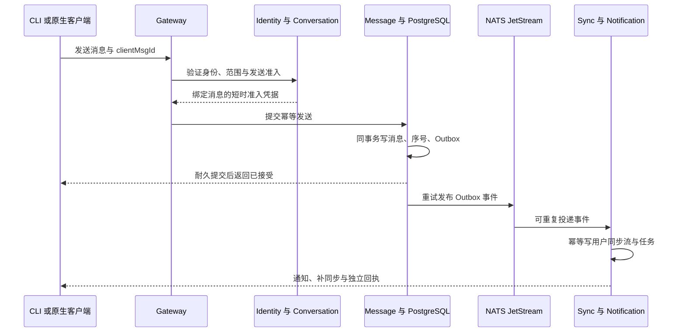
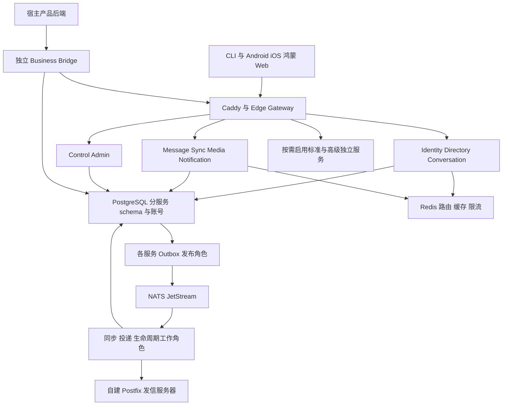
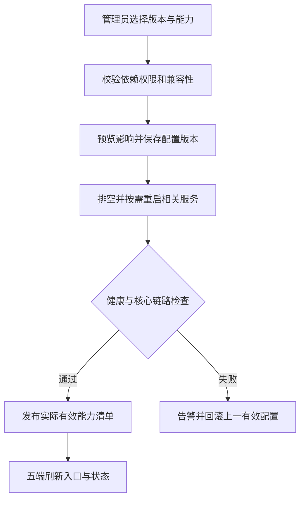
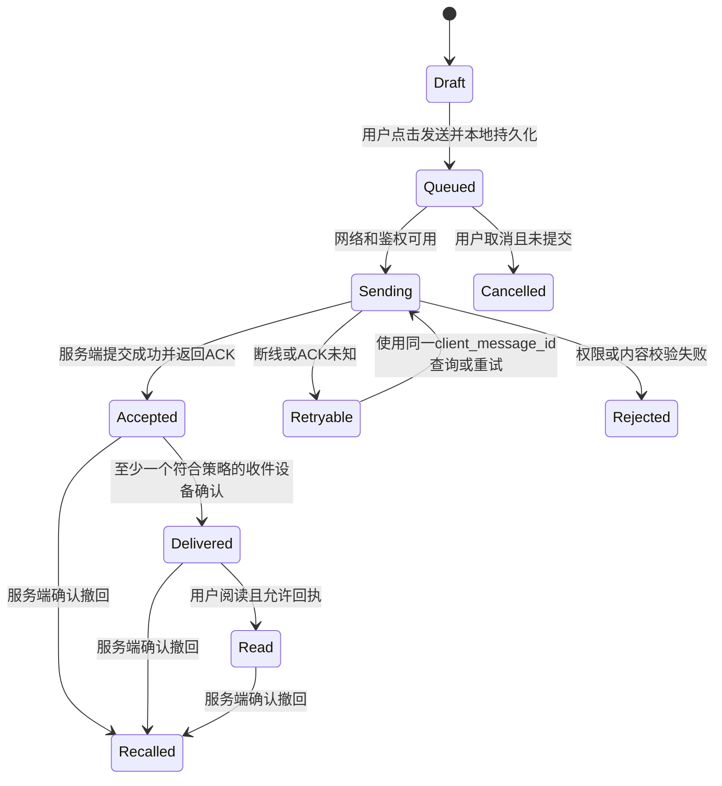

## IM 后端架构表

---

| 导航 | 内容 |
| --- | --- |
| [一、架构基线](#architecture-baseline) | 三阶段继承、源码与服务边界 |
| [二、微服务职责](#service-boundaries) | 基础、标准、高级服务和表所有权 |
| [三、协议与可靠消息](#contracts-reliability) | API、授权、Outbox、同步、机器人和业务桥接 |
| [四、账号与邮件](#identity-security) | 密码、邮件 OTP、封禁与墓碑 |
| [五、Redis](#redis-design) | 缓存、路由、限流和失效策略 |
| [六、数据库与字段](#data-design) | 分服务 schema、具体字段、索引与约束 |
| [七、配置与会员](#configuration-membership) | 能力开关、等级继承、发布回滚 |
| [八、服务器与部署](#hardware-deployment) | 最低/推荐机器、拓扑、容量模型 |
| [九、依赖版本](#dependency-versions) | 经核查版本、源码/许可与锁定合同 |
| [十、运维与封版](#operations-release) | 探针、告警、灾备、迁移与验收 |
| [产品需求](./IM需求明细表.md) | 功能目标与版本边界 |
| [功能验收](./IM功能验收表.md) | 每项结果和证据 |

## 🔥 前言

本文是可评审的后端工程设计基线，核查日为 **2026-10-07**。产品行为由 [IM需求明细表](./IM需求明细表.md) 定义；本文负责服务、协议、数据、部署和依赖，验收结果写入 [IM功能验收表](./IM功能验收表.md)。当前尚未实现、部署或压测，不把设计值当作已通过的事实。

已确定使用 [**Redis**](https://redis.io/) 辅助后端，采用 [**PostgreSQL**](https://www.postgresql.org/) 保存权威业务事实，[**Go**](https://go.dev/) 实现业务微服务。Redis 的具体许可证按 [依赖清单](#dependency-versions) 纳入交付；不以缓存替代聊天历史、账号权限或资金账本。

## 一、架构基线与三阶段目标 <a href="#前言" style="font-size:17px; color:green;"><b>🔼</b></a> <a href="#🔚" style="font-size:17px; color:green;"><b>🔽</b></a>

### 1.1、继承、封版与一套工程 <a href="#前言" style="font-size:17px; color:green;"><b>🔼</b></a> <a href="#🔚" style="font-size:17px; color:green;"><b>🔽</b></a>

| 阶段 | 工程标段与交付目标 | 进入下一阶段的门槛 |
| --- | --- | --- |
| I 基础版 | CLI 先贯通最小协议；Android/iOS/鸿蒙/Web 完成基础账号、私聊图文、设备同步、通知、字体与无障碍；邮件 OTP、管理员账户状态、手工联系人、能力配置、最小宿主身份/资源桥接；Bot API 合同先确定 | 本阶段五类客户端与后端的必验项全部通过；源码/协议/配置/迁移/恢复证据封版，CLI 单独成功不能代表全基础通过 |
| II 标准版 | 在基础版同一工程上增量：群与普通聊天全功能、音视频、搜索收藏、用户确认的通讯录同步、开放机器人/默认机器人/批量计划任务、免费会员等级能力配置 | 基础回归加新增功能通过；旧端兼容、升级迁移、机器人权限和会员继承验收；标准版形成新的封版基线 |
| III 高级版 | 在标准版上按场景增量：企业工作区、客服、E2EE/阅后即焚、券积分资金、Web3、AI 等独立微服务；会员能力树可包含新增能力；收费订阅/数字购买/广告仍按独立合同预留 | 每个启用场景独立交付与验收，基础/标准回归不得回退；未实现或未验收模块不能显示已可用 |

三阶段是开发继承，运行时基础/标准/高级是可配置能力预设。封版冻结的是可重建、可恢复的证据基线，不复制三套源码、不另建三套用户/消息数据；下一阶段保留基础能力并执行增量迁移。封版后安全修复形成补丁基线并重验受影响项。[阶段目标](./IM需求明细表.md#phase-goals)、[版本预设](./IM需求明细表.md#edition-profiles)

### 1.2、不变的工程合同 <a href="#前言" style="font-size:17px; color:green;"><b>🔼</b></a> <a href="#🔚" style="font-size:17px; color:green;"><b>🔽</b></a>

- 当前及长期可预见阶段产品免费、源码完整公开；客户端、CLI、后台、业务服务、桥接中间件、协议、构建/部署、迁移和测试均进入交付。必要平台推送/邮件收件服务是外部边界，不能以此隐藏自有核心代码。
- 按关键业务域建立微服务，可在同一台机器分别运行容器；每个服务有独立入口、依赖、数据库账号、迁移、探针和扩容方式。一个按钮不等于一个微服务，业务接口也不等于允许业务代码混入 IM。
- 不信任任何客户端或宿主传入的用户 ID、价格、权限、群成员、等级、时间与状态。鉴权、范围隔离、字段验证、幂等和审计属于全部版本的基座，不能关闭。
- 基础/标准/高级共享身份、会话、消息与权威事件；扩展有自己的 schema。服务只能写自己拥有的表，同机同库也不允许绕过接口跨服务读写私有表。
- 配置只启用已经实现且依赖齐全的能力。停用先禁止新操作、排空任务，已接受的消息、到期删除和结算责任继续完成；高级服务未启用时不启动其容器、连接池、订阅和媒体/模型引擎。

### 1.3、现代稳定与原生端合同 <a href="#前言" style="font-size:17px; color:green;"><b>🔼</b></a> <a href="#🔚" style="font-size:17px; color:green;"><b>🔽</b></a>

服务端采用 [**Go**](https://go.dev/) 并锁定正式受支持版本；前端原生优先，Android 采用 [**Kotlin**](https://kotlinlang.org/) 与 [**Jetpack Compose**](https://developer.android.com/compose)，iOS 采用 <u>[**Swift**](https://www.swift.org/)</u> 与 [**SwiftUI**](https://developer.apple.com/swiftui/) / [**UIKit**](https://developer.apple.com/documentation/uikit)，鸿蒙采用 [**ArkTS/ArkUI**](https://developer.huawei.com/consumer/cn/doc/harmonyos-guides/arkts-overview)，Web 使用 [**TypeScript**](https://www.typescriptlang.org/) 与 [**React**](https://react.dev/)。这里定义技术路径，客户端工具链/最低系统/依赖另由对应端的锁定清单交付，不把后端版本表充当前端实测结果。[目标能力矩阵](./IM需求明细表.md#client-matrix)

同一源码工程可以有多种平台语言，共享身份/消息协议、能力 ID 与测试样本；原生通知、生命周期、密钥、本地待发、无障碍需分别适配。新技术和 AI 的收益通过构建、资源、故障、兼容和维护结果验证，不以生成成功替代质量证明。

## 二、业务微服务、职责与数据所有权 <a href="#前言" style="font-size:17px; color:green;"><b>🔼</b></a> <a href="#🔚" style="font-size:17px; color:green;"><b>🔽</b></a>

### 2.1、基础服务 <a href="#前言" style="font-size:17px; color:green;"><b>🔼</b></a> <a href="#🔚" style="font-size:17px; color:green;"><b>🔽</b></a>

| 服务 | 责任与接口 | 自有 schema / 状态 | 故障边界 |
| --- | --- | --- | --- |
| `edge-gateway` | HTTPS/WebSocket、连接鉴权、连接限额、心跳、请求路由；协议不含宿主业务实现 | 无权威业务表；Redis 存短时连接路由 | 重连后从同步服务补洞，内存连接不是消息事实 |
| `identity-service` | 用户/身份、密码/OTP/MFA、设备与会话、权限验证、封禁/墓碑/恢复 | `auth` | 关键鉴权不可用时拒绝新受保护操作，不信任缓存授权 |
| `directory-service` | 公开资料、手工联系人、拉黑与隐私；标准阶段增加明确同意的通讯录发现 | `directory` | 资料缓存失效可回源；拉黑等权限规则用当前权威判定 |
| `conversation-service` | 私聊唯一性、成员、发送准入、角色、历史可见范围；标准阶段承载群/频道权限 | `conversation` | 无法确认发言权限时不接受新消息；授权与权限撤销有明确先后边界 |
| `message-service` | 消息幂等、会话内序号、耐久提交、ACK、编辑/撤回/过期事件 | `message` | 数据库未提交不返回已接受；提交后投递故障由 Outbox 重放 |
| `sync-service` | 用户增量流、设备游标、收讫/已读、快照与补洞 | `sync` | 断线不丢事实；Redis 在线路由失效可由持久游标恢复 |
| `notification-service` | 推送适配器、免打扰、推送尝试；邮件任务投递与反馈 | `notify` | 推送/SMTP 受理不等于用户已收到；不影响已经接受的聊天事实 |
| `media-service` | 私有图片/附件、上传/下载授权、对象元数据、校验与回收 | `media`；私有对象目录/对象存储 | 媒体不可用时不虚构上传完成；聊天中的旧媒体有明确失败状态 |
| `control-service` | 能力定义、配置发布、部署应用/作用域、审计、阶段基线；标准阶段增加会员配置 | `control` | 期望配置与有效配置分离；非法配置不发布 |
| `admin-service` | 管理后台 API、管理员操作编排、审计查询；请求转交数据所有者 | `admin` 仅管理操作编排与审计副本 | 无权直接改其他 schema；管理员身份仍由 identity 权威验证 |
| `business-bridge` | 宿主身份映射、业务资源/事件绑定、Webhook，独立中间件 | `bridge` | 宿主失败不污染 IM 核心；可随独立 IM 实例一并交付 |
| `governance-service` | 基础举报/管理员处置、本人数据导出/注销与清理编排；高级阶段扩展企业审核工作流 | `governance` | 状态转换与物理清理分别执行；服务停用不能遗失已经成立的清理任务 |

后台发信组件连接自建 SMTP 服务，基础阶段不需要给终端用户建设邮箱收件箱。Outbox 发布器、投递工作进程、生命周期清理器属于对应服务的独立运行角色，可同镜像不同启动命令，迁移与表所有权不变。

### 2.2、标准与高级扩展服务 <a href="#前言" style="font-size:17px; color:green;"><b>🔼</b></a> <a href="#🔚" style="font-size:17px; color:green;"><b>🔽</b></a>

| 阶段 | 独立服务 | 责任 / schema |
| --- | --- | --- |
| II | `interaction-service` | 反应、投票、置顶、收藏、结构化卡片 / `interaction`；消息正文仍归 message |
| II | `search-service` | 被授权的云会话搜索索引、个人查询 / `search`；权限在返回结果时重验 |
| II | `rtc-service` | 通话状态、首个接听获胜、房间授权 / `rtc`；媒体转发部署为独立 RTC 服务 |
| II | `bot-service` | Bot API、机器人凭据/权限、Webhook/轮询、默认机器人、执行审计 / `bot` |
| II | `scheduler-service` | 定时/周期/批量任务、运行租约、幂等执行、暂停取消 / `schedule` |
| III | `workspace-service` | 企业组织、成员/访客、工作区授权 / `workspace` |
| III | `support-service` | 客服队列、坐席、会话分配、工单关联 / `support` |
| III | `key-service` | 设备公钥/预密钥、会话安全模式与备份元数据 / `keyring`；不接收端侧私钥 |
| III | `benefit-service` | 券库存、领取/核销、积分账本和兑换 / `benefit` |
| III | `ledger-service` | 资金双分录账本、红包、支付状态、对账退款 / `ledger`；不向聊天服务开放任意改余额接口 |
| III | `web3-service` | 钱包签名验证、链适配、交易回执和确认数 / `web3` |
| III | `ai-service` | 用户授权的摘要/翻译/助手、提供商适配、配额 / `ai` |
| III 增量 | `governance-service` | 在基础举报/数据权利服务上增加企业审核、复杂工单与保留策略 / `governance` |

基础数据权利、附件过期和账号注销清理在阶段 I 就具备；阶段 III 的治理服务增加复杂工作流，不允许借“高级模块未启用”停止基础删除责任。阅后即焚的执行仍由 message/media 的耐久生命周期角色负责，不新增一个只负责按钮的微服务。

### 2.3、微服务模块启停与按需资源 <a href="#前言" style="font-size:17px; color:green;"><b>🔼</b></a> <a href="#🔚" style="font-size:17px; color:green;"><b>🔽</b></a>

服务模块状态为 `registered/disabled/initializing/ready/draining/stopped/failed`。声明 moduleId、版本、依赖、接口/事件、数据所有权、配置、初始化/停止合同、探针及资源预算；只有 ready 接受新工作。初始化幂等且有超时，失败释放已获取资源；停用停止新准入、排空或持久交接在途任务，再停止容器和专属连接/队列/定时器。必要收尾角色继续完成既定责任，后台显示实际状态。

采用源码中明确的服务/模块注册与独立部署，不通过下载用户二进制或 Go 动态 plugin 执行未经信任代码。前端高阶页面与媒体引擎同样按需创建。未启用的源码不等于全部常驻内存；配置预设的资源收益通过同硬件/同数据/同负载的启动、常驻内存、CPU、连接、任务和首次访问延迟对照测量。

## 三、协议、可靠消息与开放集成 <a href="#前言" style="font-size:17px; color:green;"><b>🔼</b></a> <a href="#🔚" style="font-size:17px; color:green;"><b>🔽</b></a>

### 3.1、同步 API 与事件合同 <a href="#前言" style="font-size:17px; color:green;"><b>🔼</b></a> <a href="#🔚" style="font-size:17px; color:green;"><b>🔽</b></a>

外部与阶段 I 内部接口统一为 HTTPS + JSON，实时通知使用 WebSocket；以 [**OpenAPI**](https://www.openapis.org/) 保存版本化可生成的合同。CLI 与原生客户端使用同一身份和消息 API，不拥有后门接口。内部服务采用双向 TLS/服务身份，网络白名单不能代替服务鉴权。当前不为基础版强制增加另一套 RPC 框架。

| 合同 | 字段 / 规则 |
| --- | --- |
| 请求上下文 | `requestId`、`traceId`、认证会话、服务端解析的 `scopeId`；幂等写入增加 `idempotencyKey`、`expectedVersion` |
| 同步结果 | 业务对象、权威 `version`、服务端时间；错误统一 `code/message/retryable/requestId`，明确 `UNAUTHORIZED/FORBIDDEN/FEATURE_DISABLED/VERSION_CONFLICT/RATE_LIMITED` |
| 消息发送 | `clientMsgId/conversationId/type/schemaVersion/payload/attachmentIds`；身份、发送时间、成员、权限、序号、成功状态由服务端决定 |
| WebSocket 通知 | 通知类型、对象 ID、权威版本、增量游标；有界载荷，收到通知后按权限拉取，不把通知当作唯一历史 |
| 事件信封 | `eventId/scopeId/eventType/schemaVersion/aggregateId/aggregateVersion/occurredAt/causationId/traceId/payload`；订阅方按事件 ID 幂等 |
| 对外 Webhook | 事件 ID、时间戳、签名、重试号；密钥轮换、重放时间窗、幂等与停用；未知字段兼容，未知事件不崩溃 |

接口路径分 `/v1/auth`、`/v1/conversations`、`/v1/messages`、`/v1/sync`、`/v1/media`、`/v1/capabilities`、`/v1/bots`、`/v1/bridge` 和管理员路径。认证来自令牌与服务身份，不来自路径中的用户 ID。分页用稳定游标，所有批量请求限制条数、字节、执行时间和并发。

### 3.2、消息接受、投递与事务 Outbox <a href="#前言" style="font-size:17px; color:green;"><b>🔼</b></a> <a href="#🔚" style="font-size:17px; color:green;"><b>🔽</b></a>

发送先由身份/会话所有者确认当前账号、会话、拉黑、成员和能力。identity-service 从权威数据库校验 `security_version/state`，control-service 判定当前有效会员/能力策略，conversation-service 在本服务事务中按当前成员版本记录发送准入。准入凭据绑定作用域、发送者、会话、`clientMsgId`、内容摘要、账号 generation、会员/config 版本、成员版本及过期时间，签名限定 message-service 使用，初始有效期不超过 5 秒，不能跨消息复用。任何必要权威服务不可用都不发新准入，Redis 旧值不能放行。

账号、会员和群权限由不同服务拥有，不宣称跨域撤权与消息提交是全球瞬时原子事务。每个权威服务在本域事务中排序授权决定与撤权，短时凭据的有效期取所有权威验证时限中的最早值，不能从最后一步开始重新计算 5 秒。撤权后该权威服务不再签发有效授权，撤权前已签发的凭据只能在这个有界窗口内进入提交，超时须重新验证。事务设置受请求截止约束的超时，已经提交/结果暂时未知的操作按数据库最终事实核对；5 秒是准入有效期，不能仅按计时器认定所有事务排空。后台显示“新授权已禁用/正在排空/完成”，不能在排空期间宣传所有在途操作已取消。消息收到并不自动赋予撤权后阅读历史的权限，拉取/下载仍校验当前权限。客户端时间、缓存版本不能改变先后。

message-service 在同一数据库事务内完成幂等键检查、准入凭据验证、会话序号递增、消息/事件插入和 `outbox` 插入。使用耐久提交，只有事务成功才返回“服务端已接受”；相同 `clientMsgId` 重试返回原结果，内容摘要不同则冲突。会话头行锁将会话内写入排序，热点会话以分片/配额优化，不能用客户端时间排序。

有附件时，先登记持久 `send_attempts`，再向 media-service 取得绑定该发送尝试的临时保留凭据；上传对象已完成大小/类型/摘要验证，但尚未成为永久消息引用。message 的提交事务锁定发送尝试行、确认状态仍可提交并写消息/附件引用事件；Outbox 异步完成媒体绑定确认。两服务不使用跨表强事务，确认失败进入持久重试，已提交消息不会因通知延迟直接删除对象。

孤儿清理器仅在保留到期后向 message 请求“确认已提交或原子取消未提交尝试”。message 使用与提交相同的尝试行锁：已提交返回消息引用，未提交转为不可再提交的 aborted；状态未知/超时则继续保留并报警。media 只有收到明确 aborted 或无需保留的权威结果才回收对象，不能只凭 TTL 或一次“暂未查询到消息”删除附件。重试/清理竞争、服务宕机和延迟确认列入基础验收。

可靠异步传递使用 [**NATS JetStream**](https://docs.nats.io/concepts/jetstream)，启用文件存储、耐久消费者、显式 ACK、失败重投及死信处理。发布器仅在收到消息总线确认后标记 Outbox 已发布；崩溃会重复发布，消费者以 `(consumer,eventId)` 去重，完成自己的数据库事务后才 ACK。JetStream 发布 ACK 与副本数不直接等于关联掉电时立即 fsync 的保证；保留可重放的 PostgreSQL Outbox/业务事件，并记录消费者覆盖游标及重放窗口，不能发出总线 ACK 后立即删除唯一补发事实。业务服务仍以 PostgreSQL 为事实来源，不宣称端到端“绝不会重复”。[JetStream 官方合同](https://docs.nats.io/concepts/jetstream)

在线/离线/多设备都读取持久同步流；每设备游标独立。用户已读游标单调前进，最大值不能越过其可见范围；编辑、撤回、删除和入退群有版本化事件。游标保留期过后进入权限过滤的快照重建，不能直接跳到最新位置而丢失删除事实。推送是提醒；“服务器接受、设备收讫、用户已读”是三个不同状态。

个人隐藏/删除与全局撤回分别持久记录：个人动作只过滤本人的消息视图，不能改掉另一人的消息事实；全局撤回/到期删除保留不含正文的消息墓碑与删除序号。游标过期必须使用带边界游标的完整快照重建本地派生视图，再补边界后的增量；未在快照中获授权保留的旧消息/附件缓存按合同清理，不能把旧本地列表直接合并回服务器。离线终端未连接期间不能保证远程擦除已下载内容。

### 3.3、机器人接口、默认能力与计划任务 <a href="#前言" style="font-size:17px; color:green;"><b>🔼</b></a> <a href="#🔚" style="font-size:17px; color:green;"><b>🔽</b></a>

机器人采用 [**Telegram Bot API**](https://core.telegram.org/bots/api) 的开放接入思路，接口与实现自行设计，不承诺兼容其完整协议。高级用户注册机器人后，在自己的进程/服务器编写代码，通过 Bot API、Webhook 或长轮询处理事件；IM 服务不在用户聊天进程中直接执行任意上传脚本。[产品范围](./IM需求明细表.md#bot-platform)

| 合同 | 具体设计 |
| --- | --- |
| 身份和令牌 | 专用 `botId`、owner、可撤销随机令牌；数据库仅存令牌摘要；人类用户、机器人与服务账号身份分开 |
| 权限 | 创建者授予能力，加入会话仍按群/用户授权；默认只见直接发送给机器人、命令和被明确授权的事件；不默认读取全部私聊/历史 |
| 默认机器人 | 帮助/命令发现、个人提醒、经授权的群欢迎与群规则、定时公告、本人或管理范围内的批量通知；全部可关闭，不默认开启外部 AI 或商业发送 |
| 计划任务 | 一次定时/周期规则、时区、首次/结束时间、漏执行策略、最大次数、受众快照或执行时解析、暂停/取消；执行前重验账号/会话/机器人权限 |
| 批量任务 | 幂等批次 ID、逐收件人结果、总量与速率上限、重试/部分成功；限制到授权且同意的受众，不能自动给所有注册账号群发 |
| 调度可靠性 | PostgreSQL 持久计划/运行记录，工作者按租约领取；Redis 可作短时互斥辅助，数据库唯一执行键与状态是最终保证 |
| Webhook | 固定 HTTPS 目标、原始 body 签名/时间戳/事件 ID 与重放保护；公网用户目标防 SSRF/DNS 重绑定，拒绝内网/元数据地址；受控私有宿主可由运维明确 allowlist 与隔离出口开放必要内网；失败退避、停用、可查询待投递事件 |

默认机器人也通过同一接口和权限运行，不拥有跳过鉴权的系统后门。WebHook 返回成功仅代表事件已接收，不代表计划任务或消息发送已经成功；执行结果独立查询与回报。周期任务的本地时区/夏令时、服务停机后补跑/跳过、修改任务版本后的去重规则纳入标准版验收。

回调接收方应验证签名并先持久入队/去重再返回 2xx；失败进入退避、死信与受控回放。公网与私有桥接采用不同受控出口策略，不能以开放任意 URL 换取方便，也不能一律拒绝合法私有部署。[OWASP Webhook 安全](https://cheatsheetseries.owasp.org/cheatsheets/Webhook_Security_Cheat_Sheet.html)

### 3.4、嵌入别的产品与独立中间件 <a href="#前言" style="font-size:17px; color:green;"><b>🔼</b></a> <a href="#🔚" style="font-size:17px; color:green;"><b>🔽</b></a>

宿主通过原生 SDK/界面组件/CLI/HTTP 接入，可以为某个产品独立部署完整 IM 实例或服务器。桥接中间件持有宿主连接配置，将经宿主服务端签发、经验证的身份映射到 IM 用户；不能由前端提交 `externalUserId` 即获取他人会话。宿主凭据与 IM 用户会话分离，短时换票绑定 app、audience、nonce 和过期时间。[产品合同](./IM需求明细表.md#external-integration)

| 绑定对象 | 中间件持久数据 | 核心边界 |
| --- | --- | --- |
| 外部身份 | `appId + issuer + externalSubject → imUserId` | 相同文本 ID 在不同 app 不能互认；宿主管理员不是 IM 全局管理员 |
| 业务资源 | `appId + resourceType + resourceId → conversationId` | 资源所有权由宿主权威接口确认；IM 不查询宿主订单/财务表 |
| 业务事件 | 外部事件 ID、类型、映射版本、处理状态 | 订单变化可生成获授权的结构化消息；事件幂等、可重放，不在 IM 内实现订单业务 |
| IM 事件 | 消息/成员/状态事件的获授权裁剪与外发记录 | 默认不外发聊天正文、联系人、E2EE 私钥；业务需要的字段另行授权 |

中间件可以替换而不修改消息核心。Webhook/事件暂时失败进入持久重试和待处理状态，宿主与 IM 不共用数据库事务，也不承诺用分布式回调自动实现跨系统原子提交。基础版完成一个最小身份换票与业务资源绑定演示，随后每种宿主连接器单独验收。

## 四、账号安全、邮件 OTP 与管理员状态控制 <a href="#前言" style="font-size:17px; color:green;"><b>🔼</b></a> <a href="#🔚" style="font-size:17px; color:green;"><b>🔽</b></a>

### 4.1、密码的不可逆哈希 <a href="#前言" style="font-size:17px; color:green;"><b>🔼</b></a> <a href="#🔚" style="font-size:17px; color:green;"><b>🔽</b></a>

用户表保存 `password_hash`，使用 **Argon2id + 每个密码独立随机盐**，保存带算法/参数/盐的 PHC 编码；不保存明文，也不使用可解密的密码密文。初始设计参数 `m=64 MiB、t=3、p=1、salt=16 bytes、hash=32 bytes`，上线前按真实机器测耗时和认证并发，以有界工作池避免内存耗尽；不能为更快而降到不满足安全基线。参数升级在成功验证后重新哈希，重置密码同时处理旧会话。[OWASP 密码存储](https://cheatsheetseries.owasp.org/cheatsheets/Password_Storage_Cheat_Sheet.html)

密码可选和 OTP 登录是不同登录方式：无密码账号的字段可为空，但密码接口不得把空值当作有效密码；OTP 验证不自动授予管理员身份。日志、指标和管理员后台不返回密码哈希。短期高熵令牌可以存摘要；低熵验证码不能只存不带密钥的普通哈希。

### 4.2、自建发信服务与 OTP <a href="#前言" style="font-size:17px; color:green;"><b>🔼</b></a> <a href="#🔚" style="font-size:17px; color:green;"><b>🔽</b></a>

使用自建 [**Postfix**](https://www.postfix.org/) 发信，独立发信域名与服务账号；用户绑定自己的现有邮箱，基础版无需运营用户邮箱。IM 邮件任务只经受限 SMTP 提交进入发信队列，禁止开放转发；公网 SMTP 端口、固定 IP、反向 DNS、SPF/DKIM/DMARC、TLS 与退信地址在采购前自检。送达率须在真实收件服务测试，发信软件免费不等于服务器和域名没有成本。[Google 发信要求](https://support.google.com/mail/answer/81126?hl=zh-Hans)

notification-service 的发信角色使用 [**go-msgauth**](https://github.com/emersion/go-msgauth) 为最终邮件签 DKIM 后提交 Postfix，验证投递管线不改写已签名头/正文；不为基础版强制增加另一套收件/网页邮箱系统。域名 DNS、签名密钥/轮换与退信处理属于部署合同。

| OTP 合同 | 初始设计默认值 / 权威处理 |
| --- | --- |
| 用途隔离 | `registration/email_binding/login/password_reset/recovery`；验证码绑定挑战 ID、邮箱、用途、申请会话及配置版本 |
| 生成与有效期 | 安全随机 6 位数字，5 分钟；参数受安全下限与速率共同约束；服务端时间为准 |
| 发送控制 | 同邮箱 60 秒冷却、每小时 5 次；IP/设备/作用域追加独立限额，反枚举响应统一；数值是可调设计起点 |
| 校验控制 | 单挑战最多 5 次失败；成功原子消费，过期/已消费拒绝；重发使先前同用途挑战失效，不出现多个并行有效码 |
| 存储 | 验证值存服务端密钥 HMAC；投递所需短期码在受控邮件任务中加密，仅投递者可取，用后或过期清除；不进入日志 |
| 投递与重试 | 任务幂等、可追踪 SMTP 接受/退信/延迟；过期后不继续重发旧码，用户可重新申请 |
| 换绑/恢复 | 当前账号验证、确认新邮箱、通知原邮箱；冲突不自动合并账号；恢复与敏感换绑可要求 MFA |

Redis 用于发送限流和冷却加速；挑战及原子消费写 PostgreSQL。Redis 故障不能跳过限流，邮件请求进入有界数据库限流回退或暂时拒绝；邮件故障返回可重试状态，不虚构“已经送达”。[需求](./IM需求明细表.md#otp-email)

邮箱验证成功不能自动解封或恢复墓碑。发起密码恢复不锁死账号，也不改密码或撤销会话；只有挑战成功且新密码提交后才执行凭据更新/会话策略并通知原可信通道，随后正常重新登录。系统不允许攻击者通过替他人发恢复邮件来禁用对方账号。

### 4.3、封禁、墓碑与逆向恢复 <a href="#前言" style="font-size:17px; color:green;"><b>🔼</b></a> <a href="#🔚" style="font-size:17px; color:green;"><b>🔽</b></a>

账号权限状态为 `active / banned / tombstoned`，另有独立 `deletion_state=none/requested/processing/completed`。只有具备明确权限的管理员可封禁、解除封禁、建立墓碑或恢复；用户本人申请注销另走数据权利合同，注销处理中/已完成与不可恢复标记优先于普通状态，完成清理后禁止恢复登录。每次状态变化写入前后状态、管理员 ID、理由、工单/请求 ID、生效时间与可恢复范围；更新 `security_version`，撤销会话/机器人凭据并通知网关，后续授权以权威状态拒绝旧令牌。[需求](./IM需求明细表.md#account-lifecycle)

| 操作 | 状态与作用 |
| --- | --- |
| 封禁 / 解封 | `active ↔ banned`；禁止规定的新操作，资料/历史保留按明示策略；解封要求重新登录，旧会话不会自动复活 |
| 墓碑 / 恢复 | `active 或 banned → tombstoned`；保留稳定 userId/占位与审计，记录 `state_before_tombstone`；禁止普通登录/发现/发消息，收尾责任继续执行；`banned → tombstoned → restore` 返回 banned，另行明确解封才可 active；恢复只针对仍保留且允许恢复的身份和权限 |
| 注销 / 物理清理 | 独立的请求、等待/撤销期与各服务清理任务；清理后的原始身份、消息、附件或密钥不承诺可恢复，墓碑状态逆转不能创造已删除数据 |

恢复不能绕过原封禁理由或重新加入所有曾退出的群，也不能把已经到期的阅后即焚消息复活。identity-service 的恢复事务必须检查原处罚、独立注销请求、`deletion_state`、清理完成/不可恢复记录与保留期，不能只把 state 改 active；管理员也不能逆转已完成物理清理。管理员首次创建依靠一次性初始化/受控恢复流程，不交付所有部署共用的默认密码。高风险管理员操作要求再次验证/MFA，禁止给机器人或宿主应用授予该权限。

## 五、Redis 的用途、键空间与失效行为 <a href="#前言" style="font-size:17px; color:green;"><b>🔼</b></a> <a href="#🔚" style="font-size:17px; color:green;"><b>🔽</b></a>

| 用途 / 键模式 | TTL / 规则 | 故障处理 |
| --- | --- | --- |
| `im:{scope}:route:{user}:{device}` | 网关实例/连接代号，初始 90 秒、心跳刷新；连接代号防旧离线事件删新连接 | 路由可重建，客户端补同步；不丢持久消息 |
| `im:{scope}:presence:{user}` | 在线/输入等短时状态；在线 90 秒、输入 10 秒；返回前应用隐私 | 标记未知/离线，不影响账号权限 |
| `im:{scope}:cache:{object}:{id}:{version}` | 资料/配置缓存，初始 60～300 秒，随机抖动；只缓存获授权裁剪或内部对象 | 有界回源、单飞、防穿透，不把历史缓存当当前权限 |
| `im:{scope}:rate:{purpose}:{subject}` | 原子计数/令牌桶、服务端 TTL，主体使用带密钥摘要，日志不含邮箱/IP原值 | 安全限流有界数据库回退或拒绝，不默认放行 |
| `im:{scope}:lease:{worker}:{job}` | 辅助租约与唯一持有者，续期/释放需校验 token | 持久任务状态与唯一键保证最终幂等；Redis 锁失效不能造成重复扣款 |
| `im:{scope}:hint:{channel}` | 可丢的刷新/在线通知 | 普通 Pub/Sub 断线可丢通知；可靠消息从持久流恢复 |

Redis 不保存密码明文/邮件验证码明文、E2EE 私钥、唯一投递事实和资金余额。普通 Pub/Sub 的官方语义是至多一次，不能充当唯一聊天可靠队列。[Redis Pub/Sub](https://redis.io/docs/latest/develop/pubsub/)

基础部署 Redis 单实例、启用访问控制/TLS与内网隔离、明确 `maxmemory`，内存不与数据库/媒体无界争抢；持久化开启与否按缓存恢复成本配置，不能作为数据不丢失保证。基础单实例采用 `noeviction` 与有界 TTL/写入额度，避免限流状态被淘汰。推荐将可淘汰资料缓存与不可随意淘汰的限流/租约状态拆为两个实例：缓存实例可按访问频率淘汰，状态实例用 `noeviction`，满额明确失败。Redis 的逻辑库号不作为租户或权限隔离，RDB/AOF 重写及 fork 的写时复制内存单独预留。

多机时先选主从与故障切换部署合同，验证客户端重连、短期重复/丢失与限流安全回退；Redis 不可用时普通聊天允许退化为持久拉取，短时在线提示降级。核心鉴权不会因“缓存模式”而降级为相信前端。

## 六、数据库设计、表字段与约束 <a href="#前言" style="font-size:17px; color:green;"><b>🔼</b></a> <a href="#🔚" style="font-size:17px; color:green;"><b>🔽</b></a>

### 6.1、作用域、共用字段与表所有权 <a href="#前言" style="font-size:17px; color:green;"><b>🔼</b></a> <a href="#🔚" style="font-size:17px; color:green;"><b>🔽</b></a>

一台 PostgreSQL 可承载多个 schema，但每个服务使用仅有本 schema 权限的独立账号，撤销 `public` 默认建表权限，使用显式限定表名/受控 `search_path`。schema 本身不会自动形成安全边界；隔离依赖实际数据库授权。容量增长可迁出独立数据库，接口/事件合同保持一致。[PostgreSQL schema 与权限](https://www.postgresql.org/docs/current/ddl-schemas.html)

下表是可直接细化为迁移 SQL 的字段合同。字段默认 `NOT NULL`；标 `?` 的字段可空。业务表标 **C** 时包含 `scope_id uuid、id uuid、created_at timestamptz、updated_at timestamptz、row_version bigint DEFAULT 1`，主键 `(scope_id,id)`，约束 `row_version > 0`；无 C 的表已列出主键字段。`scope_id` 是服务端从部署/app授权解析的隔离范围，不能直接采用客户端声称的范围。时间存 UTC，计划任务另存 IANA 时区；内容长度、枚举、金额/次数边界在 API 与数据库双重验证。

`user_id`、`conversation_id` 等跨服务引用是稳定 ID，通过权威 API 和事件校验，不建立跨服务外键或直接 JOIN 私有表；同服务引用用含 `scope_id` 的复合外键。`jsonb` 仅承载带 schemaVersion 的已验证扩展字段，不能代替成员权限、金额、状态和索引字段。下面每表的唯一键/索引也包含作用域，除特别注明的全局随机凭据查找摘要。可空字段参与业务唯一性时，使用 `NULLS NOT DISTINCT` 或与业务范围一致的部分唯一索引，不能让空值绕过去重；活跃唯一约束明确对应的状态条件。

### 6.2、身份、认证与资料表 <a href="#前言" style="font-size:17px; color:green;"><b>🔼</b></a> <a href="#🔚" style="font-size:17px; color:green;"><b>🔽</b></a>

| 表 / 阶段 | 字段（含类型） | 主键 / 索引 / 关键约束 |
| --- | --- | --- |
| `auth.users` / I | C；`password_hash text?、password_version bigint、security_version bigint、state text、state_before_tombstone text?、ban_until timestamptz?、tombstoned_at timestamptz?、restore_until timestamptz?、deletion_state text、deletion_request_id uuid?、redaction_completed_at timestamptz?` | C 主键；state 三值、deletion_state 四值；完成注销不可恢复，墓碑恢复保留原处罚；安全版本单调；password_hash 不回传 |
| `auth.identities` / I | C；`user_id uuid、kind text、provider text、lookup_mac bytea、value_ciphertext bytea、verified_at timestamptz?` | UNIQUE `(scope_id,kind,provider,lookup_mac)`；用户复合 FK；邮箱规范化有版本，不随意合并提供商别名 |
| `auth.devices` / I | C；`user_id uuid、platform text、client_version text、name text、last_seen_at timestamptz、revoked_at timestamptz?` | INDEX `(scope_id,user_id,revoked_at)`；平台白名单；设备名长度上限 |
| `auth.sessions` / I | C；`user_id uuid、device_id uuid、refresh_digest bytea、family_id uuid、security_version bigint、expires_at timestamptz、revoked_at timestamptz?、replaced_by uuid?` | UNIQUE `refresh_digest`；INDEX 用户/设备/过期；轮换与重用检测同事务，旧令牌不可反复刷新 |
| `auth.otp_challenges` / I | C；`target_user_id uuid?、target_security_version bigint?、identity_lookup_mac bytea、purpose text、request_session_id uuid?、code_mac bytea、key_version int、expires_at timestamptz、attempt_count int、max_attempts int、consumed_at timestamptz?、superseded_at timestamptz?` | INDEX 目标账号/邮箱MAC/用途/到期；注册前 user 可空，绑定/恢复必须与权威账号/用途/邮箱一致；次数 `0..max_attempts`，并发原子消费、重发废弃旧码，状态/security_version 变化须重新检查 |
| `auth.rate_windows` / I | `scope_id uuid、purpose text、subject_mac bytea、window_start timestamptz、count int、expires_at timestamptz` | PK `(scope_id,purpose,subject_mac,window_start)`；count 非负；数据库限流回退原子更新并有并发上限 |
| `auth.mfa_factors` / I 管理员→II 用户 | C；`user_id uuid、factor_type text、public_key bytea?、secret_ciphertext bytea?、verified_at timestamptz?、revoked_at timestamptz?` | INDEX `(scope_id,user_id)`；因子类型决定所需字段；私密因子加密、恢复码仅存摘要 |
| `auth.recovery_codes` / I 管理员→II 用户 | C；`user_id uuid、code_digest bytea、consumed_at timestamptz?` | UNIQUE `(scope_id,code_digest)`；一次性原子消费 |
| `auth.admin_grants` / I | C；`user_id uuid、permission_id text、granted_by uuid、expires_at timestamptz?、revoked_at timestamptz?` | UNIQUE 活跃 `(scope_id,user_id,permission_id)`；普通用户/机器人不能自行授权；初始化受控 |
| `auth.account_actions` / I | C；`user_id uuid、actor_admin_id uuid、action text、from_state text、to_state text、reason text、request_id uuid、recoverable_until timestamptz?、result jsonb` | UNIQUE `(scope_id,request_id)`；INDEX 用户/时间；追加审计，不能覆盖前次理由 |
| `directory.profiles` / I | `scope_id uuid、user_id uuid、username text、display_name text、avatar_object_id uuid?、bio text、privacy jsonb、font_preset text、row_version bigint、updated_at timestamptz` | PK `(scope_id,user_id)`；唯一规范化 username；字体 `small/standard/large`；私密字段按权限裁剪 |
| `directory.contacts` / I | `scope_id uuid、owner_user_id uuid、peer_user_id uuid、state text、alias text?、labels jsonb、created_at timestamptz、updated_at timestamptz、row_version bigint` | PK `(scope_id,owner_user_id,peer_user_id)`；禁止 self；state 区分申请/好友/拒绝/移除；反向关系同服务事务处理 |
| `directory.blocks` / I | `scope_id uuid、owner_user_id uuid、peer_user_id uuid、created_at timestamptz` | PK 用户对；与管理员封禁分别建模；只本人或明确治理权限可修改 |
| `directory.addressbook_consents` / II | C；`user_id uuid、device_id uuid、policy_version text、granted_at timestamptz、revoked_at timestamptz?、sync_mode text` | INDEX `(scope_id,user_id,device_id)`；OS 联系人授权与 IM 明确同意分别检查 |
| `directory.addressbook_syncs` / II | C；`user_id uuid、device_id uuid、consent_id uuid、requested_count int、matched_count int、status text、expires_at timestamptz、result_ciphertext bytea?` | INDEX 到期/用户；结果短期保存、数量有上限；撤回同意停止增量并删除可清理数据，不自动加好友 |

通讯录上传前说明目的、字段与范围，用户确认后匹配，候选好友再次由用户选择。默认不持久保存第三方联系人姓名和完整原始通讯录；传输/短期匹配采取保密与防枚举措施。普通手机号/邮箱哈希不被视为天然匿名数据。

### 6.3、会话、消息、同步和共同事件表 <a href="#前言" style="font-size:17px; color:green;"><b>🔼</b></a> <a href="#🔚" style="font-size:17px; color:green;"><b>🔽</b></a>

| 表 / 阶段 | 字段（含类型） | 主键 / 索引 / 关键约束 |
| --- | --- | --- |
| `conversation.conversations` / I→II | C；`kind text、direct_pair_key bytea?、owner_user_id uuid?、title text?、avatar_object_id uuid?、description text?、security_mode text、membership_version bigint、command_seq bigint、state text、policy jsonb` | 私聊对以 `WHERE kind='direct'` 的部分唯一索引约束 `(scope_id,direct_pair_key)`，私聊 key 不可空；kind 私聊/自聊/群/频道；安全模式不得因普通开关静默降为明文 |
| `conversation.members` / I→II | `scope_id uuid、conversation_id uuid、user_id uuid、role text、state text、member_display_name text?、joined_at timestamptz、left_at timestamptz?、history_from_seq bigint、membership_version bigint` | PK `(scope_id,conversation_id,user_id)`；本 schema 复合 FK；INDEX 用户/状态；角色/历史范围受权限控制，群昵称按权限编辑 |
| `conversation.admissions` / I | C；`conversation_id uuid、sender_id uuid、client_msg_id uuid、payload_digest bytea、security_version bigint、config_version bigint、level_generation bigint、membership_version bigint、command_seq bigint、identity_checked_at timestamptz、capability_checked_at timestamptz、expires_at timestamptz、status text` | UNIQUE `(scope_id,sender_id,client_msg_id)`；准入绑定摘要且限时；撤权与准入按各权威处理顺序判定 |
| `conversation.invites` / II | C；`conversation_id uuid、token_digest bytea、created_by uuid、expires_at timestamptz、max_uses int、used_count int、revoked_at timestamptz?、approval_required boolean` | UNIQUE token_digest；次数有界、领取原子；链接不直接授予管理员权限 |
| `message.heads` / I | `scope_id uuid、conversation_id uuid、last_event_seq bigint、updated_at timestamptz` | PK `(scope_id,conversation_id)`；事件序号在消息事务内行锁递增 |
| `message.send_attempts` / I | C；`conversation_id uuid、sender_id uuid、client_msg_id uuid、payload_digest bytea、state text、reservation_ids jsonb、expires_at timestamptz、message_id uuid?、abort_reason text?` | UNIQUE sender/client_msg_id；pending/preparing/committed/aborted；消息提交与取消共用行锁/状态栅栏，aborted 不可再次提交 |
| `message.messages` / I | C；`conversation_id uuid、sender_id uuid、client_msg_id uuid、admission_id uuid、created_seq bigint、type text、schema_version int、payload_ciphertext bytea?、encryption_key_ref text?、content_digest bytea、state text、edited_version bigint、expires_at timestamptz?` | UNIQUE `(scope_id,sender_id,client_msg_id)`；UNIQUE 会话/created_seq；INDEX 会话/序号、到期；有效消息必须有正文载荷，已撤回/物理清理可仅保留墓碑 |
| `message.events` / I | C；`conversation_id uuid、message_id uuid?、event_seq bigint、event_type text、actor_id uuid、object_version bigint、payload jsonb、occurred_at timestamptz` | UNIQUE 会话/event_seq；事件追加；敏感正文不进入普通事件载荷；消息变更与 Outbox 同事务 |
| `message.user_message_actions` / I | `scope_id uuid、user_id uuid、conversation_id uuid、message_id uuid、action text、action_version bigint、acted_at timestamptz` | PK scope/user/message；action 区分 hidden/deleted_for_me，事件仅发本人；查询按本人事实过滤，不修改全局消息状态 |
| `message.user_history_limits` / I | `scope_id uuid、user_id uuid、conversation_id uuid、cleared_through_seq bigint、visibility_version bigint、updated_at timestamptz` | PK scope/user/conversation；清空本人历史截断点单调，后续新消息仍可见；不能给其他用户清空 |
| `message.tombstones` / I | `scope_id uuid、message_id uuid、conversation_id uuid、created_seq bigint、deletion_seq bigint、object_version bigint、reason text、deleted_at timestamptz、retain_until timestamptz?` | PK scope/message；INDEX 会话/deletion_seq；无正文/密钥；删除事实覆盖增量/快照与旧端迁移窗口，内容清理与事实保留分别执行 |
| `message.lifecycle_jobs` / I→III | C；`message_id uuid、kind text、due_at timestamptz、status text、attempt_count int、lease_until timestamptz?、last_error_code text?` | UNIQUE 活跃消息/任务类型；INDEX `(status,due_at)`；到期事件耐久，即使降档仍执行 |
| `sync.user_heads` / I | `scope_id uuid、user_id uuid、last_cursor bigint、updated_at timestamptz` | PK 作用域/用户；用户增量游标事务内递增 |
| `sync.inbox_events` / I | `scope_id uuid、user_id uuid、cursor bigint、origin_event_id uuid、conversation_id uuid?、event_type text、object_id uuid?、object_version bigint、payload jsonb、created_at timestamptz` | PK `(scope_id,user_id,cursor)`；UNIQUE 用户/origin_event_id；按保留期分区，快照补偿明确 |
| `sync.device_cursors` / I | `scope_id uuid、user_id uuid、device_id uuid、received_cursor bigint、updated_at timestamptz` | PK 用户/设备；游标只能单调且不得超过该用户已发范围 |
| `sync.read_cursors` / I | `scope_id uuid、user_id uuid、conversation_id uuid、read_seq bigint、updated_at timestamptz` | PK 用户/会话；`read_seq >= 0`；服务端校验可见范围，跨设备取单调最大值 |
| `sync.conversation_views` / I | `scope_id uuid、user_id uuid、conversation_id uuid、pinned_rank int?、muted_until timestamptz?、archived boolean、hidden boolean、manual_unread_from_seq bigint?、draft_ciphertext bytea?、draft_version bigint、row_version bigint、updated_at timestamptz` | PK 用户/会话；个人状态不改变群级权限；标记未读仅为本人提醒，不回退真实已读游标；草稿显式冲突/版本策略 |
| `sync.snapshots` / I | C；`user_id uuid、boundary_cursor bigint、schema_version int、permission_generation bigint、state text、expires_at timestamptz` | INDEX user/到期；按权威 API 构建后固定页面，边界后事件再补同步；权限变化重验或使快照失效 |
| `sync.snapshot_pages` / I | `scope_id uuid、snapshot_id uuid、page_no int、payload_ciphertext bytea、next_page_no int?、created_at timestamptz` | PK scope/snapshot/page；同服务 FK；页面有界，包含当前可见对象及删除/排除规则，不返回失效私密历史 |
| `各服务.outbox` / I | C；`event_type text、aggregate_id uuid、aggregate_version bigint、payload jsonb、status text、available_at timestamptz、published_at timestamptz?、attempt_count int、last_error_code text?` | INDEX 部分 `(available_at) WHERE status='pending'`；事件 ID 固定；仅随本服务业务同事务写入 |
| `各服务.inbox_dedup` / I | `scope_id uuid、consumer_id text、event_id uuid、processed_at timestamptz` | PK `(scope_id,consumer_id,event_id)`；与消费产生的业务修改同事务；保留覆盖重放窗口 |
| `各服务.schema_migrations` / I | `version text、checksum text、applied_at timestamptz、release_id text` | PK version；历史迁移 checksum 不得原地修改；迁移者与运行者权限分开 |

聊天正文主存储和多端同步不依赖 Redis 存活。万人群不能从表结构推导吞吐：会话热点、扇出批次、设备数、每秒消息与出站带宽按 [容量模型](#capacity-model) 逐项测量。

### 6.4、媒体、推送和发信表 <a href="#前言" style="font-size:17px; color:green;"><b>🔼</b></a> <a href="#🔚" style="font-size:17px; color:green;"><b>🔽</b></a>

| 表 / 阶段 | 字段（含类型） | 主键 / 索引 / 关键约束 |
| --- | --- | --- |
| `media.objects` / I | C；`owner_user_id uuid、storage_key text、content_type text、size_bytes bigint、sha256 bytea、state text、encryption_mode text、expires_at timestamptz?、linked_count int` | UNIQUE storage_key；size 非负且受额度限制；INDEX owner/expiry；对象默认私有，不能以文件名拼接任意路径 |
| `media.uploads` / I | C；`object_id uuid、owner_user_id uuid、expected_size bigint、chunk_size int、uploaded_parts jsonb、expires_at timestamptz、state text` | INDEX 过期/owner；完成前验证大小/类型/摘要；临时文件与孤儿对象可回收 |
| `media.access_links` / I | C；`object_id uuid、conversation_id uuid、message_id uuid、state text、created_by uuid` | UNIQUE 对象/消息；对象访问经消息权限确认，客户端知道 objectId 不等于可下载 |
| `media.reservations` / I | C；`object_id uuid、send_attempt_id uuid、sender_user_id uuid、conversation_id uuid、client_msg_id uuid、expires_at timestamptz、state text、confirmed_message_id uuid?、last_checked_at timestamptz?` | UNIQUE object/send_attempt；prepared/confirmed/cancelled/released；到期仅触发权威核对，不直接删除可能已提交消息的对象 |
| `media.processing_jobs` / II | C；`object_id uuid、kind text、profile_version text、state text、attempt_count int、lease_until timestamptz?、output_object_id uuid?` | UNIQUE 对象/类型/配置版本；E2EE 密文不能被服务器假称已转码/查正文 |
| `notify.push_endpoints` / I | C；`user_id uuid、device_id uuid、provider text、token_ciphertext bytea、token_digest bytea、state text、last_validated_at timestamptz?` | UNIQUE provider/token_digest；INDEX user/device；撤销设备同时停用关联端点 |
| `notify.delivery_jobs` / I | C；`user_id uuid、device_id uuid?、event_id uuid、channel text、payload_ciphertext bytea、expires_at timestamptz、status text、next_attempt_at timestamptz、attempt_count int、provider_receipt text?` | UNIQUE 事件/设备/渠道；INDEX status/next_attempt；受理/失败/到期分开 |
| `notify.email_jobs` / I | C；`challenge_id uuid?、recipient_ciphertext bytea、template_id text、template_version text、payload_ciphertext bytea、expires_at timestamptz、status text、next_attempt_at timestamptz、attempt_count int、smtp_message_id text?、last_error_code text?` | UNIQUE 非空 challenge_id/template；INDEX status/next_attempt；短期验证码载荷投递后/到期清理 |
| `notify.email_feedback` / I | C；`email_job_id uuid、feedback_type text、received_at timestamptz、provider_code text、detail_redacted jsonb` | INDEX job/时间；退信/延迟与提交成功独立；不把原始含验证码邮件写入审计 |

基础版可由 media-service 的私有本地对象目录提供图片存取，原子写入与对象元数据回收对账；元数据不能代替实际对象备份。多节点/标准版启用共享或开放源码对象存储前必须锁定具体版本、访问授权和恢复合同，不默认共享宿主公开目录。

### 6.5、能力、会员、业务桥接与机器人表 <a href="#前言" style="font-size:17px; color:green;"><b>🔼</b></a> <a href="#🔚" style="font-size:17px; color:green;"><b>🔽</b></a>

| 表 / 阶段 | 字段（含类型） | 主键 / 索引 / 关键约束 |
| --- | --- | --- |
| `control.scopes` / I | `id uuid、name text、state text、created_at timestamptz、updated_at timestamptz` | PK id；部署/app 隔离范围由管理员配置 |
| `control.features` / I | `feature_id text、module_id text、minimum_profile text、schema_version int、dependencies jsonb、conflicts jsonb、parameter_schema jsonb、apply_mode text、minimum_clients jsonb` | PK feature_id；定义属于源码与锁定合同，后台不能填任意执行代码 |
| `control.config_releases` / I | C；`config_version bigint、profile text、desired jsonb、effective jsonb、state text、effective_at timestamptz?、created_by uuid、reason text、rollback_from uuid?、validation_report jsonb` | UNIQUE scope/config_version；状态 draft/validated/applying/effective/failed/rolled_back；effective 只在健康/合同检查后更新 |
| `control.module_states` / I | `scope_id uuid、module_id text、instance_id text、release_id uuid、desired_state text、actual_state text、heartbeat_at timestamptz、error_code text?` | PK 作用域/模块/实例；未就绪不得宣告已开放 |
| `control.membership_policies` / II | `scope_id uuid、policy_version bigint、max_level int、state text、created_by uuid、created_at timestamptz` | PK scope/policy_version；max_level 有管理上限；发布前检查现有分配级别与迁移 |
| `control.membership_levels` / II | `scope_id uuid、policy_version bigint、level int、name text、description text` | PK scope/policy/level；完整 `0..N`，等级递增；不按等级动态建立物理表 |
| `control.level_feature_grants` / II | `scope_id uuid、policy_version bigint、level int、feature_id text、enabled boolean、parameters jsonb` | PK scope/policy/level/feature；复合 FK；继承能力不可取消；参数按能力定义的比较器校验不降级 |
| `control.user_levels` / II | `scope_id uuid、user_id uuid、policy_version bigint、level int、assigned_by uuid、assigned_at timestamptz、expires_at timestamptz?、row_version bigint` | PK scope/user；FK level；等级授权来自后台/获授权策略，不接受前端自报等级 |
| `control.quota_buckets` / II | `scope_id uuid、subject_id uuid、feature_id text、window_start timestamptz、window_end timestamptz、limit_value bigint、reserved_value bigint、consumed_value bigint、policy_version bigint、row_version bigint` | PK scope/subject/feature/window_start；值非负；reserve 行锁/CAS 保证剩余额度，调低上限后剩余可为零而不改历史用量 |
| `control.quota_reservations` / II | C；`subject_id uuid、feature_id text、window_start timestamptz、idempotency_key text、amount bigint、state text、owner_service text、owner_operation_id uuid、policy_version bigint、expires_at timestamptz、consumed_at timestamptz?` | UNIQUE scope/idempotency_key；reserve/consume/release 幂等且与桶同事务；expire 先核对业务是否提交，未确认不释放可能已消费额度 |
| `admin.operation_requests` / I | C；`actor_admin_id uuid、permission_id text、target_service text、target_id uuid、request_id uuid、reason text、state text、result_redacted jsonb` | UNIQUE scope/request_id；管理员操作 API 与数据所有者审计关联 |
| `bridge.apps` / I | C；`name text、issuer text、audience text、verification_config jsonb、credential_ref text、state text` | UNIQUE scope/issuer/audience；密钥只存外部秘密引用，限制换票作用域 |
| `bridge.identities` / I | C；`app_id uuid、issuer text、external_subject text、im_user_id uuid、state text、mapping_version bigint` | UNIQUE scope/app/issuer/external_subject；不可跨 app 自动合并 |
| `bridge.resource_bindings` / I | C；`app_id uuid、resource_type text、external_resource_id text、conversation_id uuid、policy_version bigint、state text` | UNIQUE scope/app/type/resourceId；宿主授权成功后绑定；不复制完整业务对象表 |
| `bridge.event_deliveries` / I | C；`app_id uuid、direction text、external_event_id text、event_type text、mapping_version int、payload_ciphertext bytea、state text、attempt_count int、next_attempt_at timestamptz、last_error_code text?` | UNIQUE scope/app/direction/external_event_id；重放有界、外发字段经授权 |
| `bot.bots` / II | C；`owner_user_id uuid、name text、username text、kind text、state text、description text、privacy_mode text` | UNIQUE scope/username；kind 默认/用户；owner 被封禁/墓碑时停止新任务 |
| `bot.credentials` / II | C；`bot_id uuid、token_digest bytea、permission_version bigint、expires_at timestamptz?、revoked_at timestamptz?` | UNIQUE token_digest；随机高熵令牌仅首次显示；撤销即时影响 API |
| `bot.grants` / II | C；`bot_id uuid、conversation_id uuid?、permission_id text、granted_by uuid、parameters jsonb、revoked_at timestamptz?` | INDEX bot/会话；活跃授权唯一；没有全库历史默认授权 |
| `bot.subscriptions` / II | C；`bot_id uuid、mode text、event_types jsonb、webhook_url text?、signing_secret_ref text?、last_cursor bigint、state text` | UNIQUE 活跃 bot；轮询/Webhook 消费合同明确；URL 审核与出口隔离 |
| `bot.updates` / II | `scope_id uuid、bot_id uuid、update_id bigint、origin_event_id uuid、payload jsonb、created_at timestamptz、acknowledged_at timestamptz?、expires_at timestamptz` | PK scope/bot/update；UNIQUE bot/origin；仅获授权字段入流 |
| `schedule.plans` / II | C；`owner_user_id uuid、bot_id uuid?、action_type text、action_schema_version int、action_payload_ciphertext bytea、timezone text、schedule_rule text、next_run_at timestamptz、end_at timestamptz?、max_runs int?、missed_run_policy text、state text` | INDEX state/next_run；规则先验证后解析；取消/版本变化对待执行记录有明确策略 |
| `schedule.runs` / II | C；`plan_id uuid、plan_version bigint、scheduled_at timestamptz、status text、lease_owner text?、lease_until timestamptz?、attempt_count int、result jsonb` | UNIQUE plan/plan_version/scheduled_at；租约不代替幂等；失败可重试/终止 |
| `schedule.batch_items` / II | C；`run_id uuid、recipient_user_id uuid、idempotency_key text、state text、result_object_id uuid?、error_code text?` | UNIQUE run/recipient；UNIQUE scope/idempotency_key；逐项反馈，重试不重复可见消息 |

### 6.6、标准聊天扩展表 <a href="#前言" style="font-size:17px; color:green;"><b>🔼</b></a> <a href="#🔚" style="font-size:17px; color:green;"><b>🔽</b></a>

| 表 / 阶段 | 字段（含类型） | 主键 / 索引 / 关键约束 |
| --- | --- | --- |
| `interaction.reactions` / II | `scope_id uuid、message_id uuid、user_id uuid、reaction_key text、created_at timestamptz` | PK scope/message/user/reaction；消息访问/互动权限当前重验 |
| `interaction.pins` / II | C；`conversation_id uuid、message_id uuid、pinned_by uuid、expires_at timestamptz?、state text` | UNIQUE 活跃会话/消息；群级与个人置顶分开 |
| `interaction.favorites` / II | C；`user_id uuid、source_message_id uuid、snapshot_ciphertext bytea?、source_security_mode text、state text` | UNIQUE 用户/源消息；E2EE 收藏不能偷改成服务端明文副本 |
| `interaction.polls` / II | C；`conversation_id uuid、creator_id uuid、question text、options jsonb、multiple boolean、anonymous boolean、closes_at timestamptz?、state text` | INDEX 会话；选项 ID 稳定、有界；匿名规则不在公开 API 暴露用户投票 |
| `interaction.votes` / II | `scope_id uuid、poll_id uuid、user_id uuid、option_id text、created_at timestamptz` | PK scope/poll/user/option；同服务 FK；是否可改单按投票规则原子验证 |
| `search.documents` / II | `scope_id uuid、message_id uuid、conversation_id uuid、message_version bigint、body_tsv tsvector、state text、indexed_at timestamptz` | PK scope/message；GIN(body_tsv)、INDEX 会话；仅可索引云明文安全模式，结果按当前权限过滤 |
| `rtc.calls` / II | C；`conversation_id uuid、initiator_user_id uuid、type text、state text、accepted_device_id uuid?、started_at timestamptz?、ended_at timestamptz?、expires_at timestamptz、room_id text?` | INDEX 会话/时间；row_version CAS 首个有效接听获胜，迟到取消/接听不能复活通话 |
| `rtc.participants` / II | `scope_id uuid、call_id uuid、user_id uuid、device_id uuid、state text、joined_at timestamptz?、left_at timestamptz?` | PK scope/call/user/device；同服务 FK；媒体 token 绑定 call/成员/时限/发布订阅权限 |
| `rtc.recordings` / III | C；`call_id uuid、consent_snapshot jsonb、storage_object_id uuid?、state text、started_at timestamptz、ended_at timestamptz?、expires_at timestamptz?` | 不随标准通话自动启用；录制/转写与 E2EE 组合必须有独立授权合同 |

标准版搜索先使用 PostgreSQL 全文索引，语言分词与准确性单独验收；中文分词扩展未锁定时不能宣称中文搜索完成。需要新增搜索引擎/分词依赖时加入 [版本清单](#dependency-versions)，服务接口与业务权属保持一致。

### 6.7、高级场景扩展表 <a href="#前言" style="font-size:17px; color:green;"><b>🔼</b></a> <a href="#🔚" style="font-size:17px; color:green;"><b>🔽</b></a>

| 表 / 阶段 | 字段（含类型） | 主键 / 索引 / 关键约束 |
| --- | --- | --- |
| `workspace.workspaces` / III | C；`name text、owner_user_id uuid、state text、policy jsonb` | INDEX owner；工作区不是管理员全局 scope 越权入口 |
| `workspace.members` / III | `scope_id uuid、workspace_id uuid、user_id uuid、role text、state text、guest_expires_at timestamptz?、row_version bigint` | PK scope/workspace/user；guest 到期撤权；角色修改审计 |
| `support.queues` / III | C；`workspace_id uuid、name text、routing_policy jsonb、state text` | workspace_id 为跨服务稳定 ID，由 workspace 权威 API 校验；不建跨 schema FK；队列角色与管理员角色分开 |
| `support.tickets` / III | C；`queue_id uuid、conversation_id uuid、requester_user_id uuid、assignee_user_id uuid?、external_ticket_ref text?、state text、assigned_at timestamptz?、closed_at timestamptz?` | INDEX queue/state；CAS 分配避免两人同时抢单；宿主工单经 bridge 关联 |
| `keyring.device_keys` / III | C；`user_id uuid、device_id uuid、identity_public_key bytea、algorithm_version text、fingerprint text、revoked_at timestamptz?` | UNIQUE 用户/设备/有效版本；不存设备私钥；设备撤销推动密钥状态更新 |
| `keyring.prekeys` / III | C；`device_key_id uuid、key_type text、key_number bigint、public_key bytea、signature bytea?、claimed_at timestamptz?` | UNIQUE 设备/key_number；一次性预密钥原子领取；签名版本验证 |
| `keyring.backups` / III | C；`user_id uuid、backup_object_id uuid、format_version int、recovery_public_metadata jsonb、expires_at timestamptz?` | 备份正文端侧加密；服务器没有可自行恢复端侧私钥的明文材料 |
| `benefit.coupon_templates` / III | C；`issuer_id uuid、name text、terms jsonb、stock_total bigint、stock_available bigint、starts_at timestamptz、expires_at timestamptz、state text` | 可用库存 `0..stock_total`；发行/核销主体与规则授权；库存原子扣减 |
| `benefit.coupons` / III | C；`template_id uuid、holder_user_id uuid、claim_key text、state text、claimed_at timestamptz、redeemed_at timestamptz?、redemption_ref text?` | UNIQUE scope/claim_key；INDEX holder/state；状态未核销/核销/过期/作废明确 |
| `benefit.point_accounts` / III | `scope_id uuid、user_id uuid、point_type text、balance bigint、reserved bigint、state text、row_version bigint、updated_at timestamptz` | PK scope/user/type；余额/预留非负；积分变动先锁余额行，与分录/兑换同事务，不可只读后分别写 |
| `benefit.point_entries` / III | C；`user_id uuid、point_type text、delta bigint、balance_after bigint、business_ref text、idempotency_key text、reversal_of uuid?` | UNIQUE 幂等键；对应 point_accounts；分录追加、冲正新分录，不直接改历史；不可兑换货币的积分与资金分账 |
| `benefit.exchanges` / III | C；`user_id uuid、item_ref text、points_cost bigint、quantity int、state text、idempotency_key text、reversal_entry_id uuid?` | UNIQUE 幂等键；成本/数量非负且有上限；失败补偿可追踪，不能先显示到账 |
| `ledger.assets` / III | `scope_id uuid、asset_code text、asset_type text、decimal_scale smallint、maximum_minor numeric(38,0)、state text、created_at timestamptz` | PK scope/asset；精度 `0..18` 且启用后不原地变更，最大值正数；注册资产/渠道与适用性经审核 |
| `ledger.accounts` / III | C；`owner_user_id uuid?、asset_code text、account_type text、state text` | UNIQUE owner/asset/type；同服务 FK assets；聊天用户不能任意开结算账号 |
| `ledger.transactions` / III | C；`business_type text、business_ref text、idempotency_key text、state text、external_ref text?、posted_at timestamptz?、reversal_of uuid?` | UNIQUE 幂等键与受约束外部回调号；已入账交易不直接改成另一笔 |
| `ledger.entries` / III | `scope_id uuid、transaction_id uuid、line_no int、account_id uuid、asset_code text、amount_minor numeric(38,0)、created_at timestamptz` | PK scope/transaction/line；同服务 FK；每交易每资产金额代数和为 0，入账事务强制校验；整数最小单位，不用浮点金额 |
| `ledger.red_packets` / III | C；`issuer_user_id uuid、conversation_id uuid、asset_code text、total_minor numeric(38,0)、remaining_minor numeric(38,0)、piece_count int、remaining_count int、expires_at timestamptz、state text、funding_transaction_id uuid` | 金额/份数有界；冻结/领取/到期退回通过账本接口；Redis 抢锁不是财务事实 |
| `ledger.red_packet_claims` / III | C；`red_packet_id uuid、claimant_user_id uuid、amount_minor numeric(38,0)、transaction_id uuid、idempotency_key text、claimed_at timestamptz` | UNIQUE 红包/领取者、幂等键；并发不超发；余额与分录同本服务事务 |
| `ledger.reconciliations` / III | C；`channel text、period_start timestamptz、period_end timestamptz、state text、difference_count int、report_object_id uuid?` | 唯一渠道/周期；差异工单、退款与支付回调状态有专项合同 |
| `web3.wallet_bindings` / III | C；`user_id uuid、chain_id text、address text、verification_challenge_id uuid、verified_at timestamptz、revoked_at timestamptz?` | UNIQUE 用户/链/地址；挑战绑定域/nonce/用途/时限，签名不自动授予资金权限 |
| `web3.chain_operations` / III | C；`wallet_binding_id uuid、operation_type text、chain_id text、transaction_hash text?、required_confirmations int、observed_confirmations int、state text、idempotency_key text` | UNIQUE 幂等键；链/交易 hash 受约束；重组、失败、待确认与完成分开 |
| `ai.jobs` / III | C；`requester_user_id uuid、conversation_id uuid?、purpose text、consent_ref uuid、provider_id text、model_version text、input_ref text、state text、result_object_id uuid?、expires_at timestamptz` | 范围/同意/额度验证；E2EE 明文不自动外发，故障不阻断普通聊天 |
| `governance.reports` / I→III | C；`reporter_user_id uuid、target_type text、target_id uuid、reason_code text、evidence_object_id uuid?、state text、reviewer_id uuid?` | INDEX state/时间；基础举报/管理员处置先具备，复杂工作区流程增量扩展 |
| `governance.data_requests` / I→III | C；`user_id uuid、request_type text、state text、requested_at timestamptz、cancel_until timestamptz?、manifest jsonb、completed_at timestamptz?` | 请求独立于封禁/墓碑；各服务结果可核验，物理清理不假称可恢复 |
| `governance.cleanup_steps` / I→III | C；`request_id uuid、owner_service text、target_id uuid、action text、due_at timestamptz、state text、attempt_count int、result_redacted jsonb` | UNIQUE request/service/target/action；持久重试、备份保留/删除责任明确 |

高级表按模块迁移和启用，不因“有字段合同”宣称能力已实现。E2EE 协议/密码库、支付渠道、区块链和 AI 提供商必须完成专项合同与版本锁定后才能上线。会员收费订单、数字购买、广告当前不建空壳交易表；只保留能力 ID/事件接入边界，实际启用时新增受审查的独立 schema 与迁移。

账本入账使用受限服务账号/受控写接口与数据库约束，posted 交易的业务字段及 entries 禁止 UPDATE/DELETE；撤销、退款、更正追加关联原交易的平衡冲正交易，不原地改余额或删除历史。重放同幂等键/相同摘要返回原结果，不同摘要拒绝。余额读取可使用从分录构建的可核对投影，投影可重建，不成为独立随意可写的事实源。

### 6.8、共享核心与升级降档保护 <a href="#前言" style="font-size:17px; color:green;"><b>🔼</b></a> <a href="#🔚" style="font-size:17px; color:green;"><b>🔽</b></a>

三个阶段共用基础 schema 与稳定 ID，扩展数据按所属服务迁移，无需每次升级重新建立用户/消息表。升档先验证依赖/字段/容量与客户端兼容；降档停止新高级业务，保留只读历史、必要密钥、到期删除、结算/退款和审计。未知高级消息显示受控类型占位并保留获授权原始协议，不能错误转换为普通文本；E2EE 不能静默改明文，已成立的 TTL 不能取消。物理删除前按照数据权利与保留合同执行，不承诺删掉的数据能靠恢复账号找回。

## 七、能力配置、递增会员与发布回滚 <a href="#前言" style="font-size:17px; color:green;"><b>🔼</b></a> <a href="#🔚" style="font-size:17px; color:green;"><b>🔽</b></a>

### 7.1、每等级一张后台表与继承公式 <a href="#前言" style="font-size:17px; color:green;"><b>🔼</b></a> <a href="#🔚" style="font-size:17px; color:green;"><b>🔽</b></a>

管理员定义最高等级 `N`，后台显示 `0..N` 每个等级一张能力配置表。上一等级已拥有的能力在下一等级显示为“继承勾选”，不能取消；本等级可新增能力并调整符合单调规则的限额。数据库使用等级表与等级能力关联表，不动态创建 `VIP1/VIP2/...` 物理表。[产品合同](./IM需求明细表.md#membership-policy)

`Effective(level k) = 基础公共能力 ∪ Grant(0) ∪ ... ∪ Grant(k)`。能力越级只增不减；配额类参数按该能力定义的比较器校验，例如文件额度/人数上限上升，等待时间下降才代表增强。隐私、安全模式和资金授权不能简单当作“等级越高越强”的数值，仍按用户同意与专项权限校验。等级不能覆盖服务器停用、角色限制或平台不支持。

阶段 II 的会员等级是**免费能力分配机制**，默认公开功能不因未付费被阻挡。管理员可按用户/场景分配级别，后台明确当前无收费；未来收费订阅不自动成为等级来源。减少 N、修改能力或降低用户等级必须预览已有授权与在途任务影响，发布新策略版本后按合同处理，不直接删除旧记录。

等级变更增加 `user_levels.row_version`，签发的能力结果绑定该 generation 与当前策略版本。界面可通过事件/短期缓存刷新，设计刷新上限 60 秒；界面延迟不代表权限延迟，写操作/机器人每次执行/每个受众发送仍由 control-service 权威检查，失联不沿用旧缓存授权。会员降级与已准入操作遵守 [短时并发边界](#durable-message-flow)，普通计划的创建许可不永久授权未来执行。

并发配额使用权威桶与额度预留：reserve 在同一事务锁定桶、检查当前策略/余量、增加 reserved；业务提交后幂等 consume 转为 consumed；明确失败才 release。到期先与业务所有者核对提交状态，已提交必须消费、状态未知继续保留/报警，不能只靠 Redis TTL 自动退回额度。降低等级/配额不抹除已用量，已经准入的预留按截止/收尾合同处理；后台能看到预留、消费、补偿和积压。

### 7.2、配置发布与服务实际状态 <a href="#前言" style="font-size:17px; color:green;"><b>🔼</b></a> <a href="#🔚" style="font-size:17px; color:green;"><b>🔽</b></a>

管理后台按“编辑 → 校验依赖/互斥/继承 → 预览资源/停机/数据影响 → 保存不可变版本 → 排空与重启受影响服务 → 探针/核心链路确认 → 发布 effective 能力 → 各端刷新”的合同执行。单机给出维护窗口，多实例滚动重启，失败回滚到上一可运行版本。安全撤权先阻止新操作，不能等待下一次客户端刷新。

最终可用能力取 `客户端构建支持 ∩ 服务端有效配置 ∩ 会员有效能力 ∩ 用户/会话权限 ∩ 地区/安全约束`；客户端只是显示此结果，服务端每个写操作重验。缺失/过期配置拒绝未经确认的敏感新业务，保留允许的账号恢复、查询待发和数据权利入口。默认“未实现”“未验收”“依赖未就绪”均不是启用状态。

## 八、部署拓扑、硬件最低与推荐支持 <a href="#前言" style="font-size:17px; color:green;"><b>🔼</b></a> <a href="#🔚" style="font-size:17px; color:green;"><b>🔽</b></a>

### 8.1、同机独立容器与多机拓扑 <a href="#前言" style="font-size:17px; color:green;"><b>🔼</b></a> <a href="#🔚" style="font-size:17px; color:green;"><b>🔽</b></a>

基础环境采用 [**Docker Engine**](https://docs.docker.com/engine/) + [**Docker Compose**](https://docs.docker.com/compose/) 管理独立服务，反向代理使用 [**Caddy**](https://caddyserver.com/)。只公开 HTTPS/WebSocket 和必要媒体端口；PostgreSQL、Redis、NATS、管理探针与 SMTP 提交口位于内网，管理员入口单独权限和网络策略。媒体文件、数据库、邮件队列与备份使用独立卷；容器可重建不等于数据可丢。

一个 `scope` 可以服务一个外部产品；强隔离场景为该产品部署独立 IM 实例/服务器/数据库/密钥，不让多个宿主仅靠前端参数分开。共用部署时做全链路作用域测试、限额和防越权；scope 与宿主 app 的关系由管理员建立。

### 8.2、采购起点与硬件预算 <a href="#前言" style="font-size:17px; color:green;"><b>🔼</b></a> <a href="#🔚" style="font-size:17px; color:green;"><b>🔽</b></a>

下列最低值是**设计支持的启动/低负载验收目标**，尚未实测；推荐值是采购起点，不是任意人数/万人群/视频容量承诺。单机最低不能等同于高可用生产配置。操作系统采用 [**Ubuntu Server**](https://ubuntu.com/server) `26.04.1 LTS`，x86-64 优先完成基线验收，ARM64 需验证全部依赖镜像/构建及性能；确切 OS 镜像与 digest 随版本锁定。

| 场景 / 机器 | 设计最低支持 | 推荐采购起点 | 明确边界 |
| --- | --- | --- | --- |
| I 基础服务同机 | 4 vCPU、8 GiB RAM、100 GiB SSD、10 Mbps 公网出站 | 8 vCPU、16 GiB RAM、200 GiB SSD、50 Mbps；单独备份存储 | 核心微服务 + PG/Redis/NATS，私聊图文低负载；不包含 RTC/大型媒体转码或高可用 |
| 自建邮件独立机器 | 1 vCPU、2 GiB RAM、20 GiB SSD、固定公网 IP | 2 vCPU、4 GiB RAM、40 GiB SSD；可控 DNS/PTR、端口和出站信誉 | 域名/服务器有成本；送达率不可由 CPU 保证；不运营用户邮箱 |
| II 标准低负载核心机 | 8 vCPU、16 GiB RAM、200 GiB SSD、50 Mbps | 应用 2 × 4 vCPU/8 GiB；PG 8 vCPU/32 GiB/500 GiB SSD；Redis 2 vCPU/8 GiB；按负载拆分 | 比基础多群/Bot/调度/检索服务；开启视频需独立媒体预算 |
| II RTC/媒体机器 | 4 vCPU、8 GiB RAM、100 GiB SSD、100 Mbps，仅低负载联调 | 8 vCPU、16 GiB RAM、200 GiB SSD、独立计算型节点；生产优先 10 Gbps 内网，公网按订阅码率采购 | 不保证通话路数；SFU 转发与转码/录制分别测；无需默认 GPU；[LiveKit 部署依据](https://docs.livekit.io/transport/self-hosting/deployment/) |
| II 推荐可靠事件集群 | 单节点 NATS 仅适用于非 HA | 3 节点，每节点 2 vCPU、4 GiB RAM、100 GiB SSD，JetStream 复制因子 3 | 独立故障域；多数派可用与磁盘延迟验收，不能把同机三容器当抗整机故障 |
| II 推荐数据库 HA | 单机仅有备份恢复 | 主库 + 同步备用各 8 vCPU/32 GiB/500 GiB SSD，另准备受控故障切换与见证/编排 | 这是资源预算，自动切换组件需锁定/演练；未经演练不宣称 HA |
| III 高级模块 | 在已验收标准部署上，启用的扩展服务起点 4 vCPU/8 GiB；涉及账本另配 4 vCPU/16 GiB DB | 按工作区、券积分、资金、链、AI 各自隔离/实测；业务数据盘按保留模型采购 | 没有“所有高级模块通用最低机”；AI 本地推理、链节点、录制/GPU 单独预算 |

资源预算给出卷容量阈值、CPU/内存上限、数据库连接池总额与备份空间。基础 8 GiB 试算上限：PG 2 GiB、Redis 0.5 GiB、NATS 0.5 GiB、业务进程 2 GiB、OS/观测/余量 3 GiB；实际启动/压力测试不满足就提升最低支持值，不通过压缩安全参数硬塞。Redis `maxmemory` 之外仍有额外进程/持久化内存，必须计入测量。

### 8.3、容量、网络与存储模型 <a href="#前言" style="font-size:17px; color:green;"><b>🔼</b></a> <a href="#🔚" style="font-size:17px; color:green;"><b>🔽</b></a>

采购前固定试验模型：注册/日活/峰值在线、每用户设备数、峰值消息每秒、群大小/活跃比例、平均正文/附件大小、保留期、重复/离线补同步比例、Bot 批次与通话发布/订阅数。人数不是唯一负载；一万订阅者和一万同时发消息的群分别验收。

| 阶段验收负载草案 | 并发与业务范围 | 用途与边界 |
| --- | --- | --- |
| I 基础 | 100 活跃账号/200 连接、10 条消息/秒，私聊正文平均 1 KiB；图片持续上传另测；五类客户端交叉与重连峰值 | 为最低机器建立可重复试验；是待验设计目标，未承诺该机器已达到 |
| II 标准 | 1000 连接、100 条消息/秒作为常规试验；万人群广播、群内活跃聊天、Bot 批次和 RTC 各建专项负载，不混算 | 验证标准增量与单会话热点；实际连接/发送/接收设备数完整记录，不以注册人数报容量 |
| III 高级 | 继承基础/标准回归，逐启用模块增加密钥/TTL、券核销/红包并发、工作区/客服与外部回调/链重组负载 | 每种特殊场景独立确定业务额度和硬件；不能由总人数推导金融/链/AI能力 |

上述数值是工程试验起点，压测后记录支持的容量与余量；扩大目标时同步调整采购，不把草案数值写进产品为既成容量。

| 预算项 | 计算起点 / 实测修正 |
| --- | --- |
| 连接内存 | `峰值连接数 × 每连接实测内存`，加心跳、缓冲、设备路由和重连峰值 |
| 文本出站 | `消息/秒 × 平均接收设备数 × 平均载荷字节 × 8`，另加协议/重试/历史拉取 |
| 历史磁盘 | `消息/秒 × 86400 × 平均持久字节 × 保留天数`，另计索引、WAL、事件/游标、副本和备份 |
| 附件磁盘 | 每日上传总字节 × 保留期 × 副本系数，加衍生图/转码、临时分片和恢复余量 |
| RTC 带宽 | 房间发布流/订阅流码率、TURN 比例、区域、屏幕共享；不能用文本机器配置推导视频容量 |
| 密码验证 | Argon2id 单次 CPU/内存 × 认证并发，受工作池与限流约束，不与消息进程无限争抢 |

报告同时给 p50/p95/p99、吞吐、错误/重复可见消息、ACK 耐久、队列积压年龄、连接重建、CPU/RAM/IOPS/带宽、成本与测试持续时长。扩容依据实测拐点与安全余量，服务资源不足时有界排队/限流，不把无限缓存当扩容。

## 九、外源框架、确切版本与源码交付 <a href="#前言" style="font-size:17px; color:green;"><b>🔼</b></a> <a href="#🔚" style="font-size:17px; color:green;"><b>🔽</b></a>

### 9.1、经核查的后端版本基线 <a href="#前言" style="font-size:17px; color:green;"><b>🔼</b></a> <a href="#🔚" style="font-size:17px; color:green;"><b>🔽</b></a>

下表采用 2026-10-07 官方页面可核查的正式版本，作为后续实施的初始锁定基线；不是永远不升级的承诺。构建必须补齐仓库标签/提交、下载校验值、镜像 digest、平台、实际许可证和完整传递依赖，禁止用 `latest` 代替。阶段 II/III 尚未启用的依赖可先确定研究基线，启用前复核支持/漏洞/兼容并重新锁定。

| 组件 / 阶段 | 版本 | 主体许可 | 作用 / 官方版本依据 |
| --- | --- | --- | --- |
| Ubuntu Server / I | `26.04.1 LTS` | 按系统各包分别记录 | 系统基线 / [官方发行公告](https://lists.ubuntu.com/archives/ubuntu-announce/2026-August/000326.html)，[Docker 支持平台](https://docs.docker.com/engine/install/ubuntu/) |
| Go / I | `1.27.1` | BSD-3-Clause | 业务服务与 CLI；HTTP/slog 使用标准库 / [官方下载](https://go.dev/dl/) |
| PostgreSQL / I | `18.6` | PostgreSQL License | 权威关系数据库与自带备份工具 / [受支持版本](https://www.postgresql.org/support/versioning/) |
| Redis / I | `8.10.2` | 选择 AGPLv3；另有 RSALv2/SSPLv1 选项 | 缓存、路由、限流 / [官方下载目录](https://download.redis.io/releases/)、[该版本许可](https://github.com/redis/redis/blob/8.10.2/LICENSE.txt) |
| [**pgx**](https://github.com/jackc/pgx) / I | `v5.11.0` | MIT | PostgreSQL 驱动/连接池 / [官方标签](https://github.com/jackc/pgx/releases/tag/v5.11.0) |
| [**go-redis**](https://github.com/redis/go-redis) / I | `v9.23.0` | BSD-2-Clause | Redis 客户端，实验性 auto-pipelining/CSC 默认关闭 / [官方标签](https://github.com/redis/go-redis/releases/tag/v9.23.0) |
| [**golang.org/x/crypto**](https://pkg.go.dev/golang.org/x/crypto) / I | `v0.57.0` | BSD-3-Clause | Argon2id / [官方包与版本](https://pkg.go.dev/golang.org/x/crypto/argon2) |
| [**coder/websocket**](https://github.com/coder/websocket) / I | `v1.8.15` | ISC | 长连接实现 / [官方标签](https://github.com/coder/websocket/releases/tag/v1.8.15) |
| NATS Server / I | `2.15.0` | Apache-2.0 | JetStream 事件传递 / [官方标签](https://github.com/nats-io/nats-server/releases/tag/v2.15.0) |
| [**nats.go**](https://github.com/nats-io/nats.go) / I | `v1.54.0` | Apache-2.0 | 事件客户端 / [官方标签](https://github.com/nats-io/nats.go/releases/tag/v1.54.0) |
| Caddy / I | `2.11.7` | Apache-2.0 | HTTPS/WSS 入口 / [官方标签](https://github.com/caddyserver/caddy/releases/tag/v2.11.7) |
| Docker Engine / I | `29.8.2` | Apache-2.0 | Linux 容器运行 / [官方版本记录](https://docs.docker.com/engine/release-notes/29/#2982) |
| Docker Compose / I | `5.6.0` | Apache-2.0 | 基础同机部署 / [官方标签](https://github.com/docker/compose/releases/tag/v5.6.0) |
| Postfix / I | `3.11.7` | EPL-2.0 或 IPL-1.0 | 发信 MTA / [官方公告](https://www.postfix.org/announcements/postfix-3.11.7.html)、[双许可说明](https://www.postfix.org/announcements/postfix-3.3.0.html) |
| go-msgauth / I | `v0.7.0` | MIT | 邮件 DKIM 签名 / [官方标签](https://github.com/emersion/go-msgauth/releases/tag/v0.7.0) |
| [**Prometheus**](https://prometheus.io/) / I | `3.15.0` | Apache-2.0 | 指标、告警规则 / [官方标签](https://github.com/prometheus/prometheus/releases/tag/v3.15.0) |
| [**OpenTelemetry Collector**](https://opentelemetry.io/docs/collector/) / I | `0.162.0` | Apache-2.0 | 遥测汇聚，各启用组件稳定性单独核查 / [官方发行](https://github.com/open-telemetry/opentelemetry-collector-releases/releases/tag/v0.162.0) |
| [**OpenTelemetry Go SDK**](https://github.com/open-telemetry/opentelemetry-go) / I | `1.47.0` | Apache-2.0 | Trace/Metrics；日志先用标准 slog / [官方标签](https://github.com/open-telemetry/opentelemetry-go/releases/tag/v1.47.0) |
| [**LiveKit Server**](https://github.com/livekit/livekit) / II | `1.13.8` | Apache-2.0 | 自托管 SFU，基础 TURN 使用其内置能力 / [官方标签](https://github.com/livekit/livekit/releases/tag/v1.13.8) |
| [**coturn**](https://github.com/coturn/coturn) / II 可选 | `4.18.0` | BSD-3-Clause | 需要独立 TURN 故障域时采用，不强制重复部署 / [源码标签](https://github.com/coturn/coturn/releases/tag/4.18.0) |
| [**FFmpeg**](https://ffmpeg.org/) / II 媒体处理可选 | `9.0.2` | 默认 LGPL-2.1-or-later，构建选项可改变 | 按需转码，不是 SFU 转发的必需依赖 / [官方下载](https://ffmpeg.org/download.html)、[构建许可](https://ffmpeg.org/legal.html) |

本期无需 gRPC/Protobuf 强依赖；自建 Bot API `v1` 和调度器随自有源码版本锁定，不搬用 Telegram 的 API 版本号。未列明并核查的新增运行依赖是**启用/封版阻塞项**，不是可以随意装最新版的空白许可。以上 tag/版本已核查，实际全栈兼容与两个 CPU 架构尚未实测。

### 9.2、源码、许可证与构建锁定 <a href="#前言" style="font-size:17px; color:green;"><b>🔼</b></a> <a href="#🔚" style="font-size:17px; color:green;"><b>🔽</b></a>

每次封版交付自有源码、依赖清单/SBOM、第三方许可证/NOTICE、构建锁文件、源码来源与构建步骤；新机器可按公开源与锁定记录重建，不依赖厂商私有 IM/RTC 二进制或隐藏授权服务器。发行许可证尚未由用户确定，不把本设计的依赖选择写成已经完成法律审核。

Redis 8 的 AGPLv3/RSALv2/SSPLv1 可选许可必须按实际采用版本选择并遵守；本基线选择 AGPLv3 的独立 Redis 服务并保留对应源码/声明，未来闭源/托管商业模式需重新核对依赖与贡献权属。仅通过标准协议连接也不能直接断言整个 IM 都必须采用 AGPL；具体修改、融合、分发和网络服务义务按事实核查。将组件打包成二进制或拆成微服务不自动免除许可证义务。[Redis 许可说明](https://redis.io/legal/licenses/)

高级扩展的 E2EE 协议库、中文分词、共享对象存储、TURN、转码/录制、支付渠道/链 SDK、AI 模型与部署编排，只能在具体场景启用前列出版本、许可、配置、硬件和替换路径；不得在缺失此清单时宣称“高级版已封版”。协议可自行实现，但不自创加密算法或把未知依赖称为自有源码。

## 十、探针、运维、灾备与阶段封版 <a href="#前言" style="font-size:17px; color:green;"><b>🔼</b></a> <a href="#🔚" style="font-size:17px; color:green;"><b>🔽</b></a>

### 10.1、健康探针与关键节点 <a href="#前言" style="font-size:17px; color:green;"><b>🔼</b></a> <a href="#🔚" style="font-size:17px; color:green;"><b>🔽</b></a>

每服务提供进程存活 `/livez`、依赖就绪 `/readyz` 与仅内网开放的指标端点。数据库/邮件外部故障不让所有实例反复自杀；readiness 按业务是否可受理区分，恢复有退避、次数上限、熔断和人工入口。正常权限拒绝属于业务结果，不能触发重启。

| 节点 | 指标 / 日志合同 | 初始告警设计，须实测调优 |
| --- | --- | --- |
| 身份/OTP | 验证成功/拒绝/异常、耗时、发送/退信/消费、速率窗口 | 内部错误率 5 分钟超 1%；异常拒绝另做安全分析，不逐次告警 |
| 消息事务 | 持久提交/ACK、幂等命中、冲突、序号分配、耐久错误 | 已接受消息不可查询或重复可见立即高优先级；延迟阈值由 SLO 测试确定 |
| Outbox/同步 | 最老待发布年龄、积压、死信、去重、游标补洞 | 待发布超过 60 秒持续 5 分钟预警；恢复通知与失效依赖关联 |
| 媒体/RTC | 上传/授权/处理失败、信令状态、建连与丢包/抖动 | 按地区/客户端版本聚合；推送受理与设备收讫分别统计 |
| 账号/配置 | 状态转换、权限撤销、期望/实际版本、模块启停 | 未授权管理员转换、非法配置生效立即告警；失败保留诊断证据 |
| 账本/券积分 | 幂等、核销、分录平衡、外部回调、对账差异 | 不平衡/超发立即阻断并告警，重启不能代替资金核查 |
| 主机/依赖 | CPU/内存、磁盘/WAL、连接池、Redis/NATS、备份年龄 | 磁盘 80% 预警/90% 严重作为起点；备份/复制滞后按恢复目标报警 |

告警包含级别、时间窗、去重键、影响范围、责任角色、恢复通知和运行手册；关联 requestId/traceId/eventId/版本，禁止采集聊天明文、密码、验证码、Token、密钥和完整原始通讯录。关键合成测试使用隔离账号/会话，不给真实用户发送测试消息。

Prometheus 标签仅使用有界的服务/版本/状态/错误分类，不使用 userId/messageId/email 等高基数或敏感值；细粒度定位放入获授权的采样日志/链路。指标保留与压缩预留磁盘余量，基础默认保留 7 天并按实测调整，Prometheus/Collector 单独限制资源。[Prometheus 存储](https://prometheus.io/docs/prometheus/latest/storage/)

### 10.2、备份、恢复与升级降档 <a href="#前言" style="font-size:17px; color:green;"><b>🔼</b></a> <a href="#🔚" style="font-size:17px; color:green;"><b>🔽</b></a>

阶段 I 采购方案设计为每日全量/增量备份加连续 WAL 异机归档，目标 RPO ≤ 5 分钟、RTO ≤ 2 小时；这些是待验证的恢复目标。单机故障仍有停机/恢复窗口，异机备份要包含数据库、对象、配置、密钥恢复资料、邮件队列和版本清单；不能只备份 PostgreSQL 却声称聊天图片可恢复。备份加密、密钥另存、保留期与数据删除义务统一记录。[PostgreSQL 连续归档](https://www.postgresql.org/docs/current/continuous-archiving.html)

阶段 II 的 HA 需独立故障域、受控主备切换、防双主与恢复演练；核心 ACK 的耐久策略记录是否等待同步备用，不能用异步复制宣传故障时零损失。恢复到隔离环境后验证消息/权限/过期事实，未核对截止时间的旧备份不能直接上线复活已删除内容。

迁移采用新增兼容字段/表 → 新旧程序兼容 → 回填验证 → 切换 → 后续版本清理的方式。服务分批发布并记录数据库/事件/客户端兼容矩阵；不能随手改历史迁移。基础升标准、标准升高级先迁移对应 schema，随后初始化并通过探针才开放能力；降档保留必要历史/密钥/审计与收尾工作，不删表、不重新搬一套消息库。无法安全回滚的数据变更提供恢复点和前向修复步骤。

### 10.3、封版交付清单与验收门禁 <a href="#前言" style="font-size:17px; color:green;"><b>🔼</b></a> <a href="#🔚" style="font-size:17px; color:green;"><b>🔽</b></a>

| 交付物 | 每阶段必须记录 |
| --- | --- |
| 源码基线 | 所有自有工程/服务/中间件与锁定依赖；具体源码版本、可重建说明、完整权利/许可证来源；本文件不自动创建提交或标签 |
| 协议基线 | OpenAPI/WebSocket/Bot/桥接事件、消息 schema、错误、权限、幂等、兼容/过期合同和测试样本 |
| 配置基线 | 基础/标准/高级预设、能力 ID/依赖/互斥、会员策略版本、资源/安全参数、期望/实际状态 |
| 数据基线 | 每服务 schema/字段/索引/约束、迁移 checksum、数据回填/恢复/升级降档证据 |
| 运行基线 | 最低机器实跑、推荐容量试验、端口/卷/秘密、健康探针、告警手册、备份恢复、滚动/维护窗口与回滚 |
| 产品证据 | CLI + Android/iOS/鸿蒙/Web 的阶段范围、逐项测试和异常/跨端/迁移/权限回归；通过/存疑/不通过/未验收/不适用及证据 |

任何基础鉴权、可靠接受/同步、scope 隔离、密码/OTP、管理员权限或恢复合同失败，都不能通过关闭功能或标“不适用”绕过封版。阶段 II 保留 I 的合格能力，阶段 III 保留 I/II；扩展未启用只代表本期范围不包含，不能代表代码通过。需求、架构、数据库迁移与验收表以同一发布基线对账，AI 生成和 AI 评审均保留可重复证据。

<a id="🔚" href="#前言" style="font-size:17px; color:green; font-weight:bold;">我是有底线的➤点我回到首页</a>

## IM需求明细表

---

## 🔥 前言

打造免费、完整源码公开、可独立部署且可嵌入其他产品的通用 IM。基础版解决简单可靠收发，标准版完成正常社交聊天，高级版解决特殊场景；三个版本按阶段增量继承，共用同一源码体系和通信合同。终端包含 CLI、[**Android**](https://developer.android.com/)、[**iOS**](https://developer.apple.com/ios/)、[**鸿蒙**](https://developer.huawei.com/consumer/cn/) 和 [**Web**](https://developer.mozilla.org/zh-CN/docs/Web)。文档基线：**2026年10月7日**。

本文只定义最终产品行为、阶段边界和验收合同。微服务拆分、技术及版本、硬件配置、数据库表和字段见 [IM后端架构表](./IM后端架构表.md)；逐项实测结果见 [IM功能验收表](./IM功能验收表.md)。当前完成的是文档设计，软件尚未实现，三个阶段尚未验收或封版。

| 阅读入口 | 内容 |
| --- | --- |
| [产品与三阶段](#chapter-1) | 版本继承、阶段目标、工程标段、源码交付 |
| [关键规则](#chapter-2) | 后端开关、账户墓碑、邮件 OTP、通讯录、机器人、业务中间件、会员等级 |
| [前端需求](#chapter-3) | FE-001～102，全端可见行为与异常 |
| [状态与权限合同](#chapter-4) | 演示隔离、消息状态、同步、撤权 |
| [后端能力需求](#chapter-5) | BE-001～036，应提供的服务能力 |
| [安全与平台](#chapter-6) | SEC-01～12及加密、发布边界 |
| [参数与兼容组合](#chapter-7) | 可配置项目、依赖和互斥 |
| [验收场景](#chapter-8) | T-01～26，端到端异常与恢复 |
| [交付与验收](#chapter-9) | 206 项验收台账、源码与证据要求 |

## 一、产品定位、继承版本与阶段目标 <a href="#前言" style="font-size:17px; color:green;"><b>🔼</b></a> <a href="#🔚" style="font-size:17px; color:green;"><b>🔽</b></a>

### 1.1、免费公开与完整源码 <a href="#前言" style="font-size:17px; color:green;"><b>🔼</b></a> <a href="#🔚" style="font-size:17px; color:green;"><b>🔽</b></a>

当前及长期可预见阶段，全部版本免费使用、完整源码公开，不以闭源核心、私有构建包或项目方授权服务器作为运行门槛。部署产生的服务器、域名、邮件、平台推送、存储和带宽费用属于运行成本，应在架构与部署说明中列明。

| 交付对象 | 必须交付 |
| --- | --- |
| 产品代码 | CLI、Android、iOS、鸿蒙、Web、管理后台、后端微服务、自建 SDK、机器人平台与业务中间件源码 |
| 协议与数据 | API、事件、能力 ID、消息格式、错误码、状态机、权限合同、数据库字段、迁移与配置样例 |
| 构建与运维 | 精确依赖及许可证、锁定文件、镜像信息、构建/部署脚本、备份恢复、升级回滚、测试用例、告警与排障说明 |
| 依赖边界 | 核心消息/音视频/SDK 能取得源码并可重建；平台服务采用有文档的适配接口；列清自研、开源与外部服务范围 |

采用原创设计与独立实现，可依法使用开放协议和开源组件；不复制竞品私有代码、素材和商标。AI 生成代码仍需检查来源、许可证、正确性和维护质量。操作系统、硬件固件及厂商推送服务的源码不属于自研产品能交付的范围。

未来收费或发布闭源版本由用户另行决定，本期收费、订阅和广告投放均不启用。自研产品正式许可证在首次公开发行前确定；第三方许可、外部贡献者权利和已经授予的许可需要保留。依赖许可审计见 [架构依赖基线](./IM后端架构表.md#dependency-versions)。

### 1.2、基础 → 标准 → 高级的继承边界 <a href="#前言" style="font-size:17px; color:green;"><b>🔼</b></a> <a href="#🔚" style="font-size:17px; color:green;"><b>🔽</b></a>

统一称为 **基础版（轻量）→ 标准版（中度）→ 高级版（重度/定制）**。标准版包含基础版，高级版包含标准版；代码增量演进，身份、历史和消息合同保持可兼容。运行时选基础预设可以关闭扩展，但不代表建立另一套产品或另一套用户库。

| 版本 | 默认功能边界 | 扩展与关闭规则 |
| --- | --- | --- |
| 基础 | 邮箱注册/绑定与密码、邮件 OTP、账号恢复、设备与会话撤销、资料与手工联系人；一对一文字/emoji/图片、会话/历史、草稿、待发重试、删除/撤回、未读、离线补同步；基础通知、拉黑举报、隐私/数据权利；CLI 与四图形端；后台能力配置、封禁/墓碑及恢复；最小 SDK 与业务中间件 | 默认不开群、语音条、普通文件/视频、音视频通话、机器人执行与商业模块；安全、可靠性、管理审计与探针完整交付 |
| 标准 | 基础全部，加正常社交聊天：经确认的通讯录发现/同步、名片、状态；语音/视频/文件/表情；编辑、回复/线程/反应、转发、消息置顶/收藏、搜索、定时消息；群/角色/邀请/公告/@/话题/频道；单聊与群语音视频、位置分享、历史/备份恢复；开放机器人及默认机器人、批量/定时任务；非付费会员等级与能力表 | 普通聊天无需钱包、区块链、AI 或购买权限即可构成完整产品；每项仍能由后台配置 |
| 高级 | 标准全部，加按场景启用的 E2EE、阅后即焚、特殊保留、企业工作区、复杂社区、客服、专项会议/录制、AI、优惠券/积分、支付红包/资金账务、钱包身份、去中心化/联邦适配等 | 新增模块逐项显式配置；特殊能力各有安全及适用条件。选择高级预设不自动启动全部扩展，也不自动开启收费 |

基础的安全传输、密码保护、权限校验和存储保护始终启用。高级 E2EE 是会话安全模式，与基础加密分开。一个 FE 编号含多种能力时，实施拆成稳定子能力，例如 `message.image`、`message.video`、`rtc.group_call`、`meeting.recording`；阶段验收按子能力和平台记录。

### 1.3、三阶段工作目标与封版门禁 <a href="#前言" style="font-size:17px; color:green;"><b>🔼</b></a> <a href="#🔚" style="font-size:17px; color:green;"><b>🔽</b></a>

| 阶段 | 明确目标 | 本阶段交付与通过条件 |
| --- | --- | --- |
| 第一阶段：基础建设与封版 | 交付可真实使用的简单可靠 IM，同时形成后续可继承的基座 | 身份/邮件 OTP、可靠图文、五端基础互通、管理生命周期、Redis、独立微服务、最小业务中间件、完整源码/部署/数据迁移及探针；基础范围逐项通过、故障恢复和安全必测通过后封版 |
| 第二阶段：标准增量与封版 | 在已封版基础上完成正常社交聊天全功能 | 群与标准媒体/RTC、通讯录授权同步、机器人平台与计划任务、会员等级配置、普通聊天完整交互；第一阶段回归保持通过，新增标准范围通过后封版 |
| 第三阶段：高级定制增量 | 在已封版标准版上解决已选定的特殊业务 | 按定制模块明确范围、依赖、数据和安全模式，分别验收；基础和标准回归仍通过，新增模块通过后形成高级发布基线 |

第一阶段可以先以 CLI 打通端到端链路，再接四个图形端；**仅 CLI 通过不能代表完整基础版封版**。Android/iOS/鸿蒙/Web 的目标系统与设备清单在实施计划中锁定，图形界面不要求 CLI 模拟；五端均遵守相同身份、鉴权、消息与同步合同。

封版必须锁定源码修订、协议/消息格式、数据库迁移、依赖、构建/部署材料、配置预设、能力矩阵和验收证据。没有通过证据不能写成“已封版”。封版后的修复形成新补丁基线，不覆盖原记录；标准/高级从上一基线增量演进，迁移、回滚和禁用扩展仍须保护已有消息、密钥和删除事实。具体门禁见 [验收表阶段规则](./IM功能验收表.md#phase-gates)。

### 1.4、工程标段与交付边界 <a href="#前言" style="font-size:17px; color:green;"><b>🔼</b></a> <a href="#🔚" style="font-size:17px; color:green;"><b>🔽</b></a>

标段按功能域分工，通过协议、事件和可验收结果交接；后端按域使用独立微服务。标段是交付责任单元，可以包含多个相关服务；不把每个按钮拆成独立进程。各域数据私有化、部署拓扑与硬件在 [后端架构](./IM后端架构表.md#service-boundaries) 中独立定义。

| 标段 | 工作范围 | 依赖与交付物 | 验收重点 |
| --- | --- | --- | --- |
| I-01 身份与安全 | 邮箱/密码/OTP、设备、恢复、管理员封禁/墓碑/恢复 | 邮件域名与通道、身份 API/权限合同、管理界面 | OTP 单次有效、全会话撤销、管理员独占与审计 |
| I-02 消息与同步 | 会话、可靠文本/图片、幂等、离线/多端、删除/未读 | I-01；消息/事件合同、恢复用例 | ACK 未知重试、乱序补洞、删除不复活 |
| I-03 五端基础 | CLI、Android、iOS、鸿蒙、Web 的基础功能和无障碍 | I-01/02；五端能力矩阵、构建包与 CLI 文档 | 真服务互通、平台差异、三档字体与离线恢复 |
| I-04 嵌入与中间件 | 最小 SDK、宿主身份映射、业务资源绑定、回调 | I-01/02；独立中间件源码/API/接入示例 | 租户隔离、绑定幂等、宿主故障不阻塞聊天 |
| I-05 平台与基础封版 | 配置、Redis、微服务部署、数据迁移、探针/告警/备份 | I-01～04；运维手册、依赖/硬件表、封版清单 | 恢复演练、源码可重建、基础全部适用项通过 |
| II-01 标准聊天 | 联系人同步、群/频道/话题、名片、完整消息交互 | 基础封版；增量协议与五端页面 | 权限变化、群历史边界、搜索与同步 |
| II-02 媒体与通话 | 语音/视频/文件、单聊/群 RTC、正常通话控制 | II-01 与媒体服务；格式矩阵和网络预算 | 取消/接听竞争、弱网、权限/系统中断 |
| II-03 机器人自动化 | Bot API、命令/事件、默认机器人、批量/定时/计划 | 基础接口合同；外部机器人示例与调度管理 | 授权、幂等、取消/撤权、宕机恢复 |
| II-04 会员能力 | 最大等级 N、每级能力表、继承和配额 | 基础能力目录；配置界面与策略 API | 能力单调增加、继承锁定、变更原子生效 |
| II-05 标准封版 | 标准集成、迁移/停用、全端与基础回归 | II-01～04；标准封版清单 | 新增范围与基础回归全部适用项通过 |
| III-01 特殊隐私 | E2EE、阅后即焚、加密备份与专门保留 | 标准封版；协议与密钥威胁模型 | 不降级明文、设备撤销、到期清理 |
| III-02 组织与协作 | 企业/客服/复杂社区、专项会议及定制机器人工作流 | 标准封版；租户/组织与人员授权 | 个人/企业边界、来宾及管理员权限 |
| III-03 营销与财务 | 优惠券/积分，按立项启用资金与红包 | 标准封版；独立业务服务与账务接口 | 并发、幂等、核销/冲正/对账 |
| III-04 外部协议 | 钱包身份、去中心化、联邦/桥接 | 标准封版；明确网络、协议和版本 | 重放/重组、断网、信任与删除边界 |
| III-05 AI与高级封版 | 可选 AI/定制扩展、专项审计和继承回归 | 已选高级标段；数据授权及发布基线 | 授权外发、成本/隐私、基础/标准回归 |

## 二、关键产品规则与开放能力 <a href="#前言" style="font-size:17px; color:green;"><b>🔼</b></a> <a href="#🔚" style="font-size:17px; color:green;"><b>🔽</b></a>

### 2.1、后台开关决定能力与前端入口 <a href="#前言" style="font-size:17px; color:green;"><b>🔼</b></a> <a href="#🔚" style="font-size:17px; color:green;"><b>🔽</b></a>

后台提供基础/标准/高级预设、细粒度能力树、参数、依赖、互斥和期望/实际状态。每项说明是否即时生效、需要重连还是需要重启相关服务；保存前预览影响，初始化和核心链路检查通过后发布有效能力清单，失败报警并回滚。

**实际可用能力 = 客户端已支持能力 ∩ 服务端有效配置 ∩ 会员能力策略 ∩ 当前身份/资源权限 ∩ 适用地区与安全规则。** 基础阶段的会员策略为默认开放基线；标准阶段才启用自定义等级。客户端只展示当前交集，不能因服务端勾选而获得尚未交付的代码。服务端验证所有输入与权限，包括备注、昵称、偏好等普通数据。

配置须包含稳定能力 ID、模块/阶段、版本、默认值、类型/范围、依赖/互斥、作用范围、最低客户端版本、变更人与理由、生效方式、失败/回滚记录。用户隐私与授权不能被管理员用业务开关越权替代；关闭功能时拒绝新业务，但保留必要历史阅读、取消、恢复和清理入口。

扩展未启用时不启动其服务进程或专属任务；前端不初始化其页面与引擎。已成立的删除、投递、结算等责任由受控收尾组件继续执行。按相同负载测量启动、常驻内存、CPU 和首次使用延迟后判断节省，不能仅凭“未 init”宣称运行效率必然提高。详见 [模块生命周期](./IM后端架构表.md#module-lifecycle)。

### 2.2、管理员封禁、账户墓碑与恢复 <a href="#前言" style="font-size:17px; color:green;"><b>🔼</b></a> <a href="#🔚" style="font-size:17px; color:green;"><b>🔽</b></a>

| 状态/操作 | 产品行为 | 操作权限与恢复边界 |
| --- | --- | --- |
| 正常 | 按有效配置、关系与角色正常使用 | 普通用户不能改变运营状态 |
| 封禁 | 立即阻止新的登录/通信准入，显示原因、期限及申诉；保留数据按既定策略处理 | 仅具备封禁权限的管理员操作；解封同样鉴权、二次验证和审计，恢复后重新登录 |
| 墓碑 | 保留稳定身份占位与历史引用，隐藏正常资料/发现入口，禁止新通信和身份重新占用 | 仅具备墓碑权限的管理员执行；进入墓碑前预览数据/成员/机器人影响。恢复需明确可恢复范围与期限 |
| 恢复墓碑 | 在数据仍存在且允许恢复时回到有效状态，重新核验身份和会话 | 仅管理员操作；不恢复旧令牌、被删除内容、过期即焚消息或已撤销密钥 |
| 注销/物理删除 | 用户可按数据权利发起；按照确认的处理范围、期限及必要保留执行 | 与管理员墓碑分开。不可恢复的删除不得由“恢复墓碑”按钮反向还原 |

封禁/墓碑必须联动撤销设备会话、实时连接和推送权限，并暂停或取消相关机器人、定时任务与外部授权；各服务按最新账户状态重新鉴权。新准入的阻止与已准入工作的排空分别显示，撤权竞争窗口及完成条件由架构合同限定，不宣称跨微服务全球瞬时原子。恢复墓碑保留原有独立处罚，不自动解封；需要解封时另行执行相应管理员操作。操作记录操作者、理由、目标、前后状态、关联工单、时间和结果。并发请求、服务重启和恢复不允许旧凭证复活；共享 IP 不作为永久封禁所有账户的依据。

### 2.3、自建邮件 OTP 与密码保护 <a href="#前言" style="font-size:17px; color:green;"><b>🔼</b></a> <a href="#🔚" style="font-size:17px; color:green;"><b>🔽</b></a>

第一阶段自建用于验证通知的邮件发送服务，用户绑定其已有邮箱，不索取第三方邮箱密码，也不要求为每个用户建设新的邮箱收件系统。邮件一次性验证码（OTP）用于注册、邮箱绑定/换绑、登录验证、恢复及适用的敏感操作再验证；每次挑战绑定租户、账户/目标邮箱、用途、有效期和尝试次数，成功后只能消费一次。重发废弃旧码，发送与验证分别限速；并发验证、退信与延迟投递不得使旧码再次有效。

邮件服务与身份认证分工：邮件负责投递，身份服务负责生成与验证。SMTP 接受不代表用户收到，邮箱验证完成之前不能授予已验证身份。邮箱换绑重新认证并验证新邮箱，通知旧可信渠道；不能删除最后一种有效登录/恢复方式。邮件 OTP 是一种较弱验证手段，不能将单独邮件码宣传为强 MFA；管理员处罚、资金、密钥变更等操作按独立强验证策略执行。登录/恢复回复避免账号枚举，他人发起恢复不能自动锁定受害者账户；OTP 或密码恢复不能解封或恢复墓碑。[账户恢复依据](https://cheatsheetseries.owasp.org/cheatsheets/Forgot_Password_Cheat_Sheet.html)

用户密码采用 [**Argon2id**](https://cheatsheetseries.owasp.org/cheatsheets/Password_Storage_Cheat_Sheet.html) **加盐单向哈希**，数据库只保存哈希、算法/参数版本，不保存明文或可逆“加密密码”；客服和管理员不能查看原密码。密码重置生成新凭证并撤销旧会话，成本参数和邮件服务器部署见 [认证及邮件架构](./IM后端架构表.md#email-delivery)。本项目代码和开源邮件软件可免费自托管，域名、机器、维护与送达成本仍存在。[邮箱验证依据](https://cheatsheetseries.owasp.org/cheatsheets/Email_Validation_and_Verification_Cheat_Sheet.html)

### 2.4、确认后同步通讯录好友 <a href="#前言" style="font-size:17px; color:green;"><b>🔼</b></a> <a href="#🔚" style="font-size:17px; color:green;"><b>🔽</b></a>

通讯录发现/同步在第二阶段交付。先申请系统权限，再由用户在 IM 内确认上传用途、字段、范围和保留期限；预览并选择联系人后才发起匹配。系统曾授予通讯录权限不等于允许永久后台上传。匹配展示结果，用户再确认发送好友申请或按已选择的关系策略处理，不默认把全部匹配对象添加为好友或允许名单。

支持有限联系人授权、增量同步、取消/撤回、删除已上传发现数据、重新授权和同步结果明细；记录同意版本与时间。拒绝通讯录仍可按用户名/二维码手工加好友。通讯录散列也不能当作绝对匿名数据，发现接口须防批量枚举并尊重对方可发现性。CLI 的联系人导入同样先预览、明确确认并可取消，不能利用非图形端绕过授权。

### 2.5、开放机器人与默认功能 <a href="#前言" style="font-size:17px; color:green;"><b>🔼</b></a> <a href="#🔚" style="font-size:17px; color:green;"><b>🔽</b></a>

第一阶段定义机器人身份、命令、事件、授权和回调协议；第二阶段交付完整 Bot API 与默认机器人。借鉴 [**Telegram**](https://core.telegram.org/bots/api) 的开放机器人模式，允许高级用户创建/编辑机器人资料、命令与权限，用自己的程序接收事件并执行允许的 IM 动作。机器人是独立、明确标识的身份，不能伪装用户或管理员。

| 开放能力 | 产品要求 |
| --- | --- |
| 创建与编辑 | 所有者、名称/说明、命令、事件订阅、权限、回调地址、密钥轮换/撤销；公开/私有范围可配 |
| 开发接入 | 公开 API/SDK/事件格式与示例；签名 Webhook 或拉取事件模式；版本、错误码、限额和重试文档 |
| 权限 | 所有者/租户、显式加入的会话、事件和动作 scopes；私聊/群读权限分别授予，默认无权读取全部历史 |
| 外部程序 | 用户程序独立运行，通过开放接口调用；不在 IM 核心服务中直接执行用户提交的脚本。图形工作流或隔离沙箱作为高级扩展另行验收 |
| 撤销与管理 | 用户可停止订阅、移出会话或撤销授权；管理员可停用违规机器人；其待执行任务随权限状态重新判定 |

默认机器人采用以下设计起点，全部源码公开，可禁用和替换；不依赖付费模型才能运作：

| 默认机器人 | 基础功能 | 默认授权范围 |
| --- | --- | --- |
| 帮助机器人 | 命令发现、使用说明、服务状态链接 | 用户主动发给机器人的指令；无私聊历史读取 |
| 个人提醒机器人 | 创建/查看/取消个人提醒、时区和重复规则 | 用户本人提醒和主动选择的消息引用 |
| 计划发送机器人 | 预览并确认定时/批量发送、查看结果、取消未执行任务 | 仅授权目标会话；受用户权限、限速与屏蔽规则约束 |
| 群助手机器人 | 欢迎语、群规则、公告提醒、投票；管理动作默认关闭 | 群管理员显式配置；禁言/移除等动作需单独授予相应权限 |

机器人不等于 AI：规则、消息转发和定时任务可以通过普通代码完成。E2EE 会话不允许机器人默认获得明文或成员密钥；需要可信机器人参与时，应作为明确授权的会话参与者显示并遵守所选协议。机器人拥有者的权限不能超过当前账户、会话角色和部署能力。

### 2.6、批量、定时与计划任务 <a href="#前言" style="font-size:17px; color:green;"><b>🔼</b></a> <a href="#🔚" style="font-size:17px; color:green;"><b>🔽</b></a>

支持一次性、周期性、批次任务；配置目标、时区、触发时间/规则、开始/结束、执行上限、重试和失败处置。发送前预览收件范围与内容并明确授权，批次记录目标快照，并在实际执行时重新过滤有效授权；不能向未同意的陌生人无限群发。批量联系人管理、消息发送与群操作使用各自权限，不通过机器人绕过拉黑、群限制或封禁。开放接口与通用调度是两项分别交付的能力。[机器人命令与权限参考](https://core.telegram.org/bots/features#commands)

任务可查看、暂停、取消、重新排期和审计；重复投递不得重复执行业务。执行时重新验证账户、机器人、成员、权益、资源和会话安全模式；权限撤销后取消或失败，不继续使用创建时的旧授权。服务宕机、重启、时区/DST 变化、错过时间、部分批次失败须有确定策略；已完成动作不虚称可撤销。E2EE 排期不得由服务端解密修复密文，失效时暂停并请求受权端重新加密。

### 2.7、嵌入其他产品与独立业务中间件 <a href="#前言" style="font-size:17px; color:green;"><b>🔼</b></a> <a href="#🔚" style="font-size:17px; color:green;"><b>🔽</b></a>

提供可嵌入 SDK、公开 API、事件和示例，使宿主产品把 IM 功能交给本项目承担。可给一个宿主单独部署 IM 微服务/服务器，也可共享集群并严格隔离租户；使用同一公开产品源码与合同。

宿主与 IM **代码、数据库及发布周期分别维护**，通过独立中间件绑定用户、订单/客户/工单等业务资源与会话。中间件只持有必要的身份映射和绑定信息，调用公开接口；不嵌入宿主业务源码，不直写 IM 私有表，也不把业务字段不断塞入消息核心表。业务卡片通过带版本的结构化消息表达，点击动作仍回到对应业务权威服务验证。

| 绑定合同 | 必须定义 |
| --- | --- |
| 身份 | 应用/租户/宿主账号到 IM 身份的服务端映射；短期凭据兑换、签发方/受众/用途/到期与撤销；不信任前端传来的 user_id |
| 资源 | 业务类型/ID与会话的映射、参与者及可见性；创建、更新、解除和删除的幂等规则；跨租户冲突拒绝 |
| 数据进出 | 聊天事件/API按授权推送或查询；范围、字段、留存和用途明确，E2EE不因此变成可读明文 |
| 事件 | 签名、事件ID/版本、超时、重试、去重、失败查询/补偿；回调不阻塞聊天核心事务 |
| 故障隔离 | 宿主/中间件宕机不导致已接受消息丢失；恢复可重放许可事件，不重复建会话或重复执行业务 |
| 生命周期 | 宿主用户注销、解绑、封禁与租户停用对 IM 映射/权限/历史的处置；保留合法数据权利入口 |

第一阶段交付最小身份兑换、单聊绑定及签名事件回调；第二阶段扩展群/机器人等已交付能力；第三阶段按定制业务增加协议适配，保持隔离边界。

### 2.8、会员最高等级与继承勾选 <a href="#前言" style="font-size:17px; color:green;"><b>🔼</b></a> <a href="#🔚" style="font-size:17px; color:green;"><b>🔽</b></a>

会员等级是后台可配置的能力策略，与基础/标准/高级运行版本分开；当前免费，不由支付自动赋予等级。后台可定义最高等级 **N**、等级名称和分配规则，等级 0 为基础权益；每个等级呈现一张能力配置表。

| 配置规则 | 必须实现 |
| --- | --- |
| 逐级继承 | 第 k 级继承第 k−1 级所有允许能力；继承项自动勾选并标明来源，在高等级不能取消，新增能力可自主勾选 |
| 配额单调 | 存储/文件/人数/频率等同一口径配额不小于低等级；“不限”按最大权限语义处理，不用负数比较误减权限 |
| 能力边界 | 只分配服务端已实现且当前部署/预设允许的能力；账号封禁、对象角色、隐私授权、区域和安全条件继续生效 |
| 变更发布 | 修改低等级后计算高等级继承结果，预览受影响用户/配额，统一发布配置版本；前后端最终使用同一生效版本 |
| 降级与降低 N | 显示受影响用户和迁移规则，明确确认后执行；已有消息/附件/在途任务按保留和收尾合同处理，不为达配额直接删除 |
| 审计与纠错 | 等级分配、能力与配额变更、继承结果、操作者和回滚记录可查；不允许数据库直改绕过校验 |

“每级一张表”指后台的等级能力配置界面；数据库采用规范化等级/能力关系，字段见 [数据库设计](./IM后端架构表.md#data-design)。标准版完成这套免费能力策略，高级版增加可分配的定制能力。未来收费订阅、数字购买、广告作为独立接口预留，当前不自动启用。

### 2.9、五端范围、原生优先与字体 <a href="#前言" style="font-size:17px; color:green;"><b>🔼</b></a> <a href="#🔚" style="font-size:17px; color:green;"><b>🔽</b></a>

各端共享协议和验收标准，原生能力单独实现。优先采用当前主流、稳定且可维护的原生路径；实际框架版本在实施时锁定。CLI 以文本/结构化输入输出支持基础收发、图片文件路径、历史、同步、身份和管理脚本接入，不要求显示图形气泡、摄像头预览或移动系统通知。

| 能力族 | Android | iOS | 鸿蒙 | Web | CLI |
| --- | --- | --- | --- | --- | --- |
| 基础身份/联系人/图文/历史/同步 | 完整基础 | 完整基础 | 完整基础 | 完整基础 | 完整基础，图片以路径上传/下载 |
| 通知与后台 | 按系统验证 | 按系统验证 | 按系统验证 | 按浏览器验证 | 在线事件/轮询及可选终端提示，不承诺后台常驻 |
| 标准群/媒体/机器人/能力策略 | 原生交互 | 原生交互 | 原生交互 | 浏览器交互 | 数据/控制 API与脚本交互，媒体保存文件 |
| RTC/地图/专门会议 | 按设备验证 | 按设备验证 | 按设备验证 | 按浏览器验证 | 明确不提供图形/音视频采集；已交付控制接口可使用 |
| 私密模式与备份 | 按端安全实现 | 按端安全实现 | 按端安全实现 | 按浏览器边界实现 | 选定 CLI 支持的安全协议才可读写，不转明文兼容 |

平台与最低系统范围必须记录，能力不支持时说明原因；后台勾选不能超越操作系统/浏览器能力。所有端同样保护凭据、本地数据与待发队列，并接受弱网/重启/撤权测试。现代原生技术与后端版本见 [架构技术基线](./IM后端架构表.md#quality-native)。

### 2.10、三档字体与无障碍 <a href="#前言" style="font-size:17px; color:green;"><b>🔼</b></a> <a href="#🔚" style="font-size:17px; color:green;"><b>🔽</b></a>

图形端提供 **小字体、标准字体、大字体**，默认标准，不提供任意滑杆；即时生效并持久化。正文、标题、按钮和提示按语义重排，核心内容不能裁剪，不能缩小正文抵消用户的大字体选择。系统更大的辅助字号采用换行、滚动或专门布局，支持读屏、足够点击区域、键盘焦点、减少动态效果和必要的 RTL。

无障碍意味着老人、视力较弱者以及使用读屏/键盘的人仍能完成核心流程。发送、搜索、加好友、入群、接听、恢复账号及管理确认覆盖三档与系统辅助字号。CLI 尊重终端字号和屏幕阅读器，提供纯文本/无色与结构化输出，不依赖仅以颜色表达状态。字体属于用户偏好，会员等级和后台预设不能关闭必要的无障碍能力。

## 三、前端全量需求与后端对应 <a href="#前言" style="font-size:17px; color:green;"><b>🔼</b></a> <a href="#🔚" style="font-size:17px; color:green;"><b>🔽</b></a>

### 3.1、账号、登录和设备（FE-001～010） <a href="#前言" style="font-size:17px; color:green;"><b>🔼</b></a> <a href="#🔚" style="font-size:17px; color:green;"><b>🔽</b></a>

| 需求编号 | 功能与前端合同 | 对应后端 | 关键验收 |
| --- | --- | --- | --- |
| FE-001 | 注册、登录、退出、账号存在性处理；手机号含国际代码，邮箱验证；本人修改密码，手机/邮箱绑定、换绑、解绑；错误提示避免批量枚举账号 | BE-001、BE-002 | 换号保持原user_id；新凭证验真、旧可信通道通知，解绑不能移除最后有效登录/恢复途径；注册中断、旧号遗失/回收、绑定冲突均可验证 |
| FE-002 | 基础采用密码/邮件 OTP 登录验证；短信为可替换渠道扩展；验证码倒计时、重发、风险挑战、限流提示 | BE-001、BE-021、BE-035 | 服务端签发与单次验证；客户端绕过、跨用途/邮箱重放、并发与过期均被拒绝，邮件失败不误标验证成功 |
| FE-003 | [**Apple**](https://developer.apple.com/sign-in-with-apple/) 及审核通过的第三方登录；绑定/解绑、授权撤销、重复身份合并提示 | BE-001、BE-002 | 不能按邮箱相同直接合并账号；保留至少一种有效登录途径 |
| FE-004 | 通行密钥、强验证及新设备验证；系统验证失败可使用受控恢复途径 | BE-001、BE-002 | 验证挑战一次性，凭证可删除，跨设备登录语义清楚 |
| FE-005 | 找回密码、恢复码、可信设备恢复、人工申诉入口；凭证变更重新认证，风险冷静期与撤销旧会话 | BE-001、BE-002、BE-021 | 重置后旧会话按策略失效，客服无法查看原密码；新号码持有人不能自动获得旧账号或E2EE历史 |
| FE-006 | 场景所需实名、年龄/企业身份认证；资料脱敏、进度、失败原因、复核 | BE-003、BE-021、BE-030 | 非必需通信功能不强收身份证；验证材料保留期限可查 |
| FE-007 | 本地应用锁、系统生物识别、锁屏预览控制；本地手势为可选弱保护 | BE-002、BE-018 | 锁定态不能从通知/深链进入敏感会话；不上传系统生物模板 |
| FE-008 | 单/多设备策略；设备链接、可信设备确认、扫码登录、历史授权与会话撤销 | BE-002、BE-007、BE-018 | QR 短期且一次性；显示待登录设备并手机确认；撤销后不能继续收发 |
| FE-009 | 设备列表：型号、近似地区、最后活跃、安全事件；新设备提醒、退出指定/全部设备 | BE-002、BE-014 | 不伪造精确地理位置；撤销令牌、连接、推送和密钥权限同步 |
| FE-010 | 登录过期、账号冻结、设备风险、服务维护、Token 刷新与并发请求恢复 | BE-001、BE-002、BE-021、BE-024 | 刷新失败收口为一个登录入口，不重复弹窗，不无限重试 |

### 3.2、资料、好友和消息请求（FE-011～018） <a href="#前言" style="font-size:17px; color:green;"><b>🔼</b></a> <a href="#🔚" style="font-size:17px; color:green;"><b>🔽</b></a>

| 需求编号 | 功能与前端合同 | 对应后端 | 关键验收 |
| --- | --- | --- | --- |
| FE-011 | ID/用户名/昵称、头像、简介；昵称和签名审核；动图/短视频头像为受限扩展 | BE-003、BE-010、BE-021 | 唯一标识与显示名分开；签名长度和计数方式可配置；格式失败有静态兜底 |
| FE-012 | 好友列表、分组/标签、备注、添加来源、删除好友与关系状态 | BE-004 | 删除好友不等于双方删除聊天；两端状态按关系策略一致 |
| FE-013 | ID/用户名/手机号/二维码/群名片搜索与添加申请；搜索隐私设置 | BE-003、BE-004、BE-021 | 关闭手机号搜索后不能被该方式发现；不默认按真实姓名公开搜索 |
| FE-014 | 陌生人消息请求、接受/拒绝/举报、屏蔽附件预加载与危险链接 | BE-004、BE-021 | 未接受请求不能自动来电、读回执或获取在线状态 |
| FE-015 | 系统通讯录权限与 IM 内同步确认；预览并选择联系人，发现匹配结果、确认添加/申请，增量同步、取消与撤回 | BE-003、BE-004 | 不自动上传或添加全部好友/允许名单；撤回停止同步并处理已上传发现数据；拒绝权限仍可手工加好友 |
| FE-016 | 拉黑、解除、允许名单、谁可发消息/来电/加群；可按文本、图片、语音、文件、来电分别设许可；好友与系统封禁分开展示 | BE-003、BE-004、BE-021 | 服务端强制执行，不能只靠前端隐藏按钮；拉黑默认阻断私聊/来电，特殊例外可见且可撤销；群内交互规则明确 |
| FE-017 | 好友/群名片、共同群、资料可见范围；生日等额外资料按需收集 | BE-003、BE-004、BE-011 | 共同群仅展示可见交集；转发名片不授予查看私有资料权限 |
| FE-018 | 在线/最后活跃、正在输入、忙碌/勿扰状态及可见性控制 | BE-003、BE-008 | 状态有有效期；允许关闭；断网与后台不误判为仍持续在线 |

### 3.3、会话与导航（FE-019～025） <a href="#前言" style="font-size:17px; color:green;"><b>🔼</b></a> <a href="#🔚" style="font-size:17px; color:green;"><b>🔽</b></a>

| 需求编号 | 功能与前端合同 | 对应后端 | 关键验收 |
| --- | --- | --- | --- |
| FE-019 | 会话列表、最新摘要、未读/提及、时间排序、未知消息降级 | BE-005、BE-007、BE-008 | 编辑/撤回/删除后摘要正确；隐私模式不泄漏锁屏文字 |
| FE-020 | 会话免打扰、置顶、归档、标记未读、隐藏/移除、通知粒度 | BE-005、BE-008、BE-014 | 标记未读是提醒，不回滚真实阅读游标；不能取消已发出的回执 |
| FE-021 | 草稿、输入恢复、回复目标、附件队列、发送键习惯和输入法适配 | BE-005、BE-006、BE-010 | 崩溃恢复不把草稿自动发出；跨端草稿冲突有明确策略 |
| FE-022 | 历史分页、定位消息、跳到最新、未读分界与返回原位置 | BE-005、BE-007、BE-020 | 删除/过期目标显示原因，不跳到错误消息；加载不改变阅读位置 |
| FE-023 | 全局/会话搜索，中文、英文、拼音索引；按人/日期/媒体/文件过滤 | BE-020 | 拼音误差可解释；E2EE 内容只在授权端索引；结果仍做权限校验 |
| FE-024 | 自己的收藏/笔记会话、收藏夹、文件聚合和跨端查看 | BE-005、BE-010、BE-019 | 收藏是独立副本或引用需声明；原消息删除后的行为一致 |
| FE-025 | 手机单栏、平板/桌面分栏、多窗口、多账号切换、键盘导航 | BE-002、BE-005、BE-007 | 多账号数据库/缓存/通知隔离；切账号不泄漏上一账号内容 |

### 3.4、消息、媒体与一致性（FE-026～040） <a href="#前言" style="font-size:17px; color:green;"><b>🔼</b></a> <a href="#🔚" style="font-size:17px; color:green;"><b>🔽</b></a>

| 需求编号 | 功能与前端合同 | 对应后端 | 关键验收 |
| --- | --- | --- | --- |
| FE-026 | 文本、emoji、提及、链接、安全预览、卡片与未知类型降级 | BE-006、BE-010、BE-013 | Unicode 组合字符计数清楚，超长分段/拒绝统一；富文本不执行脚本 |
| FE-027 | 发送中/已接受/已送达/已读/失败；失败重发、取消队列、离线发送 | BE-006、BE-007 | ACK 丢失后重发同一消息不重复；本地写成功不当作服务端成功 |
| FE-028 | 语音条录制、取消、播放、倍速、续播、未听标记；转写为可选 | BE-010、BE-027 | 录音中断可恢复或明确失败；转写失败不影响原音频；外发转写需知情选择 |
| FE-029 | 图片/动图/视频/文件：选取、编辑、压缩、原图选项、缩略图、上传进度、暂停/重试、断点续传、下载保存；视频预览/播放、暂停、拖动与续播进度 | BE-006、BE-010、BE-019 | 前后端都校验大小/类型；退出会话/切后台再进入可从合法续点播放，明确进度仅本机或跨端同步；过期链接可刷新；元数据去除与原图保留策略清楚 |
| FE-030 | 贴纸、动画、自定义表情包；资源版本、配额、静音、减少动态效果 | BE-010、BE-013 | 动画格式由跨端能力评审决定；不支持时展示可识别静态图，不远程执行代码 |
| FE-031 | 本人视图删除、本地清理、双方撤回，区分时间窗/权限与提示 | BE-009、BE-019、BE-020 | 离线设备补同步后不复活已撤回消息；删除不能保证接收者已保存副本消失 |
| FE-032 | 消息编辑、编辑标记、冲突版本、允许时间和类型 | BE-009 | 两端编辑版本收敛，不能越权编辑他人消息；保留策略按会话类型定义 |
| FE-033 | 引用回复、线程/话题、跳转原消息、表情反应与取消 | BE-009、BE-012、BE-013 | 被引用消息删除后只保留允许的残余信息；重复反应请求幂等 |
| FE-034 | 单条/多选转发、合并转发、来源与说明、禁止转发策略 | BE-009、BE-013 | 不把源会话权限带给新收件人；钱款/登录卡片不能当可重复执行消息转发 |
| FE-035 | 消息置顶、多个置顶列表、定位原文、权限与到期 | BE-011、BE-013 | 顶部显示最新一条或轮播策略明确；个人置顶与全群置顶分开 |
| FE-036 | 本人阅读游标、未读数与对外已读回执分开；多端一致；群回执按用户聚合 | BE-008 | 阅读不倒退；关闭回执仍同步本人未读但不外发已读；群人数按用户而非设备去重，分母和隐私规则明确；大群可关闭逐人回执 |
| FE-037 | 多端增量同步、断线重连、补洞、重复乱序处理、新设备历史与加密状态 | BE-002、BE-007、BE-018、BE-019 | 至少测试重连、撤回后上线、设备时钟错误、旧端升级和游标过期 |
| FE-038 | 定时发送、静默发送、提醒/稍后处理、取消计划与时区；E2EE采用支持该能力的协议/端侧或受控密文调度 | BE-009、BE-014 | 执行时身份/成员/密钥版本有效，否则暂停并请授权设备重加密或明确失败；服务端不得取得正文修复密文；不能把后台未运行误判为计划已发 |
| FE-039 | 投票、活动/事件提醒、任务/待办卡片；选项与变更权限 | BE-013、BE-014 | 一人一票/多选/匿名规则明确；取消活动传播；机器人卡片不能越权写数据 |
| FE-040 | 系统事件：入退群、权限改变、来电未接、公告、服务通知 | BE-011、BE-013、BE-015 | 可信事件由服务端签发，普通用户不能伪造管理消息 |

### 3.5、群、频道和社区（FE-041～048） <a href="#前言" style="font-size:17px; color:green;"><b>🔼</b></a> <a href="#🔚" style="font-size:17px; color:green;"><b>🔽</b></a>

| 需求编号 | 功能与前端合同 | 对应后端 | 关键验收 |
| --- | --- | --- | --- |
| FE-041 | 创建/解散/退出群、群名头像简介、成员上限、群角色与可见规则 | BE-011、BE-024 | 群主/管理员/成员权限明确；万人成员和在线压测分别报告 |
| FE-042 | 邀请、入群申请、链接/二维码、过期撤销、反刷、历史可见起点 | BE-011、BE-021 | 被踢成员旧链接不可绕过封禁；退群后媒体链接失效策略生效 |
| FE-043 | 转让群主、任命管理员、踢人、禁言、全员禁言、慢速模式、权限提示 | BE-011、BE-021、BE-022 | 前后端同权限；失去权限后旧页面操作被拒绝且刷新状态 |
| FE-044 | 群公告、置顶、群昵称/成员标签、文件/媒体、搜索与提及 | BE-011、BE-013 | 全员提及有角色/频率限制；公告修改和到期一致 |
| FE-045 | 群话题/子频道、频道订阅/广播、评论权限、分类与发现 | BE-012、BE-020 | 私有频道不可被非成员搜索内容；订阅不等于双向好友关系 |
| FE-046 | 社区容纳多个群/频道，分层角色、规则入门、审核与内容分区 | BE-011、BE-012、BE-021 | 社区成员与频道权限独立，退出社区撤销相关能力 |
| FE-047 | 大群通知/回执降级、管理员工具、风险提示、屏蔽与举报 | BE-008、BE-012、BE-014、BE-021、BE-024 | 不能给每个成员推送所有输入状态和逐人已读；限流有可理解反馈 |
| FE-048 | 企业工作区、组织目录、游客、单点登录、保留/导出政策提示 | BE-003、BE-011、BE-030 | 企业空间与个人空间数据隔离；管理员能力和会话可见模式事前告知 |

### 3.6、音视频、会议与位置（FE-049～057） <a href="#前言" style="font-size:17px; color:green;"><b>🔼</b></a> <a href="#🔚" style="font-size:17px; color:green;"><b>🔽</b></a>

| 需求编号 | 功能与前端合同 | 对应后端 | 关键验收 |
| --- | --- | --- | --- |
| FE-049 | 单人语音/视频呼叫、取消、拒绝、未接、通话记录、权限引导；隐私通话模式按策略强制中继 | BE-014、BE-015、BE-016 | 呼叫超时和取消可靠传达；失败不产生持续响铃；陌生人来电接听前不交换可暴露对端地址的候选；中继失败不静默改直连 |
| FE-050 | 群语音/视频：邀请、房间、举手、主持人、禁麦、移除、加入权限 | BE-011、BE-015、BE-016 | 上麦人数、观看人数、房间数分别限制；踢出后不能继续订阅媒体 |
| FE-051 | 麦克风/摄像头切换、扬声器/耳机/蓝牙、前后摄像头、弱网降级、视频质量 | BE-016、BE-024 | 自动适配优先；当前免费，部署/能力配置限定预算和质量上限，不能保证网络或设备条件之外的清晰度 |
| FE-052 | 单线忙线、多线等待、保持/恢复、电话打断、系统来电集成与跨设备接听 | BE-002、BE-014、BE-015 | 一台设备接听后其他设备停止响铃；来电 UI 与服务端状态一致 |
| FE-053 | 通话/播放状态恢复、音频焦点、路由中断、网络切换与异常终止 | BE-015、BE-016 | Wi-Fi/蜂窝切换可恢复或明确结束；系统电话后状态不会卡死 |
| FE-054 | 会议排期、屏幕共享、主持人、成员列表、字幕、录制、会议分钟数 | BE-013、BE-015、BE-016、BE-027 | 录制/云转写先提示参与者；用户拒绝权限可继续使用基础通话 |
| FE-055 | 滤镜、背景虚化、变声、噪声抑制与低端机降级 | BE-016 | 过热/低电时可降低效果；变声/滤镜不能作为远程实名认证凭据 |
| FE-056 | 单次位置和限时实时位置分享、地图卡片、停止共享、过期 | BE-017 | 可立即停止，最小精度/时长可配置；关闭权限不继续采集 |
| FE-057 | 附近的人默认关闭，粗粒度距离、可见时长、屏蔽、反跟踪 | BE-017、BE-021 | 500 米仅是产品参数；不暴露精确坐标或原始 IP；关闭后及时移出发现列表 |

### 3.7、隐私、数据、安全和用户权利（FE-058～067） <a href="#前言" style="font-size:17px; color:green;"><b>🔼</b></a> <a href="#🔚" style="font-size:17px; color:green;"><b>🔽</b></a>

| 需求编号 | 功能与前端合同 | 对应后端 | 关键验收 |
| --- | --- | --- | --- |
| FE-058 | 本地/云历史、缓存体积、媒体清理、保留期、备份/恢复、存储不足提示 | BE-010、BE-019、BE-020 | 保留期限由后台按正文/媒体/备份分别配置，当前不按付费套餐区分；文本/媒体/备份保留分开；清缓存不误删待发附件 |
| FE-059 | 账户注销、数据导出/删除请求、处理进度、合法保留例外说明 | BE-002、BE-019、BE-020、BE-030 | 注销与退出/冻结不同；旧令牌不能复活账号；支付/法定记录保留有独立理由与期限 |
| FE-060 | 传输/本地加密；正文、附件/缩略图、单人通话、群媒体、屏幕共享、备份逐项声明E2EE范围；设备安全码/身份验证、密钥变化提醒 | BE-018 | 不把 TLS 或媒体逐跳加密叫完整E2EE；录制/字幕改变可见性时需参与者明确知情；不兼容功能关闭或提示，不静默降级；所有端支持范围一致 |
| FE-061 | 阅后即焚、一次查看媒体、敏感预览遮挡、计时与到期通知 | BE-009、BE-018、BE-019 | 明确计时起点与最大暂存；日志/通知/备份遵守清理；不作绝对防截屏承诺 |
| FE-062 | 应用锁、敏感操作二次验证、密钥恢复码、恢复失败反馈 | BE-001、BE-002、BE-018 | 登录恢复不代表 E2EE 历史恢复；恢复因子遗失的后果提前说明 |
| FE-063 | E2EE 备份选择、端对端设备迁移、可信设备交接与密钥失效 | BE-002、BE-018、BE-019 | 服务端无法明文还原私密备份；撤销设备不等于抹除该设备已经保存的历史 |
| FE-064 | 隐私政策/协议版本、用途授权、撤回、未成年人策略、举报证据选择 | BE-003、BE-019、BE-021、BE-030 | 不用“后台新增隐私策略”代替用户知情；敏感信息最少收集、用途受限 |
| FE-065 | 手机号/真实姓名/头像/在线/已读/来电/群邀请可见与发现控制 | BE-003、BE-004、BE-008 | 可见性和可搜索性分开；原始 IP/风险设备号不展示给他人 |
| FE-066 | 权限中心、最小授权、相册/通讯录有限访问、权限撤回后的降级 | BE-003、BE-004、BE-010、BE-017 | 拒绝通讯录/定位/相册不影响纯文本通信；不重复诱导授权 |
| FE-067 | 拉黑、举报、诈骗警示、证据预览、进度、申诉与安全帮助 | BE-004、BE-021、BE-022 | 选择证据后才上传；不把整个私密会话自动上报；举报限流防恶意滥用 |

### 3.8、iOS、Web、桌面与体验工程（FE-068～077） <a href="#前言" style="font-size:17px; color:green;"><b>🔼</b></a> <a href="#🔚" style="font-size:17px; color:green;"><b>🔽</b></a>

| 需求编号 | 功能与前端合同 | 对应后端 | 关键验收 |
| --- | --- | --- | --- |
| FE-068 | Android/iOS/鸿蒙/Web 的推送与通知适配、锁屏摘要、通知动作、会话分组、角标、免打扰与深链 | BE-008、BE-014 | 按各端实际支持范围验证；推送丢失/重复/延迟不丢消息；以消息同步修正角标；敏感内容默认受保护，详见[五端能力范围](#client-matrix) |
| FE-069 | 相机/麦克风/照片/定位/通讯录权限；相机临时文件，保存相册由用户选择 | BE-010、BE-017 | 取消拍摄不保存；有限相册可继续选取；录音与来电前按场景请求权限 |
| FE-070 | 前台/后台/被系统终止/离线/锁屏/重新安装的生命周期 | BE-002、BE-007、BE-014、BE-015 | 不依赖后台永久长连接；冷启动补同步；用户强退和系统限制下不作即时送达承诺 |
| FE-071 | Web HTTPS、登录保护、跨标签页协调、拖拽/粘贴上传、浏览器通知与缓存 | BE-001、BE-002、BE-007、BE-010、BE-023 | 防脚本注入和跨站请求；Cookie/Token 策略明确；浏览器不支持的能力可识别降级 |
| FE-072 | 本地数据库/索引、事务、分页、迁移、账号隔离、崩溃恢复与低磁盘保护 | BE-007、BE-019、BE-020 | 十万条消息量级滚动/搜索按目标机压测；索引不泄漏私密明文；异常不无限重建 |
| FE-073 | 多语言、时区、深浅/跟随系统主题、小/标准/大三档字体、系统无障碍缩放、读屏、键盘、减少动态效果、RTL | BE-003、BE-005、BE-013 | 应用不提供无限字体滑杆；三档切换实时生效且持久化，正文与控件按语义缩放，长文不截断关键内容；系统更大辅助字号可通过重排/滚动完成核心流程，详见[关键产品规则](#chapter-2)；排序用服务端事件序 |
| FE-074 | 系统分享面板、Share Extension、二维码/链接、受控第三方分享、跨端交接 | BE-002、BE-010、BE-023 | 分享扩展内不能越过账号锁；邀请参数可撤销，不泄漏Token；禁转发策略有边界 |
| FE-075 | API 请求优先、本地演示回退、完整空态/重载、连接状态和数据来源 | BE-006、BE-007、BE-024 | 无服务可演示、恢复后真数据覆盖；演示与真账号数据隔离，详见第四章 |
| FE-076 | 环境配置、接入点健康与故障切换、离线反馈、代理/网络限制提示 | BE-024 | 安全验证服务端配置，不信任任意域名；Debug 环境切换不进入 Release 用户入口 |
| FE-077 | 版本兼容、最低支持版、非强制/必要强制更新、更新说明、维护状态 | BE-024、BE-025 | iOS 进入商店更新；旧版可读取基本状态/帮助；强更不困住资金和数据权利入口 |

### 3.9、运营、审核、开放集成（FE-078～084） <a href="#前言" style="font-size:17px; color:green;"><b>🔼</b></a> <a href="#🔚" style="font-size:17px; color:green;"><b>🔽</b></a>

| 需求编号 | 功能与前端合同 | 对应后端 | 关键验收 |
| --- | --- | --- | --- |
| FE-078 | 商店发布、登录/UGC/隐私/删除/购买审核、地区开关、审核演示账号 | BE-001、BE-019、BE-021、BE-024、BE-026、BE-030 | 声明 SDK 采集与隐私要求；实际端到端流程和审核资料一致 |
| FE-079 | 后端管理基础/标准/高级预设与细粒度功能开关，能力清单驱动入口；灰度、公告、服务状态与帮助客服 | BE-003、BE-022、BE-024 | 前端按本构建支持能力与后端有效授权的交集展示，不能下发任意执行代码；依赖/互斥/生效方式/重启/回滚可查；修改客户端仍不能绕过服务端校验，详见[关键产品规则](#chapter-2) |
| FE-080 | 邀请码、注册来源/关系来源、二维码和链接归因、活动参数 | BE-004、BE-022、BE-023 | 不自动形成多级资金上下线；过期/欺诈邀请可撤销；不把用户关系公开给邀请人 |
| FE-081 | 嵌入 SDK、宿主身份兑换、独立业务中间件、业务资源绑定与签名事件回调；支持独立 IM 部署 | BE-001、BE-023、BE-032 | 宿主/IM 代码与数据不合并；映射与授权在服务端，租户隔离、绑定幂等，宿主宕机不丢聊天消息 |
| FE-082 | 管理端：举报队列、内容/资料审核、禁言/封禁、申诉、权限审批和审计 | BE-021、BE-022 | 最小权限；处罚说明/期限；禁止无边界私聊监控；敏感操作可追溯 |
| FE-083 | 开放机器人创建/编辑、命令与事件订阅、身份标识、授权审阅、密钥轮换/撤销；默认机器人和外部代码接入 | BE-013、BE-023、BE-031 | 标准阶段可通过公开 API 编程；机器人默认无全历史权限，不执行未受控用户代码；被撤权后任务停止或失败 |
| FE-084 | 开屏资源/品牌信息/广告：本地兜底、远程缓存、频控、跳过、投诉 | BE-010、BE-022 | 首次显示内置资源；仅使用完整有效缓存；通话/发送/支付不能被强制广告打断 |

### 3.10、AI、付费、钱包与 Web3（FE-085～095） <a href="#前言" style="font-size:17px; color:green;"><b>🔼</b></a> <a href="#🔚" style="font-size:17px; color:green;"><b>🔽</b></a>

| 需求编号 | 功能与前端合同 | 对应后端 | 关键验收 |
| --- | --- | --- | --- |
| FE-085 | AI 转写/翻译/摘要/搜索/建议回复；逐功能开关、输入选择、模型处理说明 | BE-020、BE-027 | 默认不自动上传全部私聊；生成内容可编辑并标记；无法处理时保留原消息 |
| FE-086 | 端侧 AI、可选云 AI 和企业知识助手；用量、成本、保留、撤回 | BE-018、BE-023、BE-027 | 私密模式优先端侧或用户明确授权选段；提示注入防护；AI 不自行执行支付/封禁 |
| FE-087 | 免费会员等级/能力策略、等级可见信息和额度提示；最高等级 N 与逐级继承后台配置；收费订阅接口独立预留 | BE-026、BE-034 | 会员等级不等于版本预设；能力不能绕过封禁/角色/隐私；当前不以订阅收费授予能力，后端配置和前端实际状态一致 |
| FE-088 | 未来数字贴纸/主题/额外配额购买的预留模块；权益说明、退款/撤销、购买历史 | BE-026 | 当前关闭，不作为三档聊天能力门禁；未来启用按平台/地区购买规则实施，客户端显示成功不直接授予权益 |
| FE-089 | 法币红包/转账/AA 收款/付款请求；明确确认、状态、过期、退回、争议 | BE-028 | 未点确认不扣款；超时与重复操作不多扣；红包过期退回不是前端计时器记账 |
| FE-090 | 钱包、优惠券领取/核销/过期、积分余额/兑换、账单筛选（目标/金额/日期/类型）、充值/提现 | BE-020、BE-028、BE-029 | 优惠券/不可兑付积分/法币/链上资产分开；券核销和兑换服务端校验且幂等；金额使用最小单位/精确定点；账单来自账务事实 |
| FE-091 | 钱包身份登录/绑定、地址展示/校验、签名确认、身份恢复与解绑 | BE-001、BE-002、BE-029 | 地址不是公开全部关系的许可；签名包含域、链、随机挑战、到期；私钥不上传 |
| FE-092 | 去中心化消息传输、节点发现、密文暂存、离线同步、节点故障与延迟说明 | BE-007、BE-018、BE-023、BE-024、BE-029 | 清楚说明网络/运营边界，不把消息正文上链；能测连接、离线送达与删除限制 |
| FE-093 | 可选链上转账卡片、网络/合约/币种/费用、授权和交易状态 | BE-029 | 广播/待确认/已确认/失败/重组分开；不承诺交易可撤回；公链交易可见性提示 |
| FE-094 | Token-gated 社区、可验证成员资格、链上凭证与可撤销证明 | BE-011、BE-012、BE-018、BE-029 | 检查资格不是读取钱包全部资产；资格失效后撤权；可保留不依赖代币的替代认证 |
| FE-095 | 跨协议/联邦互通、外部桥接身份、会话能力协商与安全提示 | BE-018、BE-023、BE-030 | 身份、权限、加密和删除语义不能完整保持时提示并限制，不静默跨信任边界 |

### 3.11、CLI、开放自动化与阶段管理（FE-096～102） <a href="#前言" style="font-size:17px; color:green;"><b>🔼</b></a> <a href="#🔚" style="font-size:17px; color:green;"><b>🔽</b></a>

| 需求编号 | 功能与前端合同 | 对应后端 | 关键验收 |
| --- | --- | --- | --- |
| FE-096 | CLI 无 GUI 注册/登录/邮箱验证、联系人、文本/图片路径收发、历史/监听/补同步、重试/删除/撤回/未读、退出与凭据撤销；交互及 JSON/退出码机器接口 | BE-001、BE-002、BE-004～009、BE-023 | 同一服务和权限合同，终端重启不丢已提交状态，凭据不放命令参数或日志，脚本超时/重试幂等；支持明确隔离的本地演示 |
| FE-097 | 开放机器人编辑、管理、授权和默认帮助/提醒/计划发送/群助手；高级用户自编程序调用 | BE-023、BE-031 | 默认功能可关闭/替换；令牌与回调验证、会话范围和撤权有效，不因机器人获得所有聊天数据 |
| FE-098 | 批量/定时/周期计划任务，预览目标、时区、结果、失败、暂停/取消/重排；控制台和 CLI/API 操作 | BE-009、BE-031 | 宕机恢复、错过触发/部分失败策略确定；重复事件不重复执行，执行时重新鉴权 |
| FE-099 | 宿主接入管理、身份/资源绑定、解除、数据出入范围和失败重放；独立中间件示例 | BE-023、BE-032 | 宿主 ID 不自证权限，跨租户绑定拒绝，解绑和删号可追踪；IM 与宿主可分别升级 |
| FE-100 | 管理员封禁/解封、墓碑/恢复、原因/期限、申诉和审计；预览可恢复范围 | BE-002、BE-021、BE-022、BE-033 | 普通用户/普通运营无权处罚或恢复；旧令牌/连接/任务被撤销，恢复不还原已物理删除数据 |
| FE-101 | 阶段范围、冻结基线与验收证据管理；标准继承基础、高级继承标准 | BE-024、BE-025 | 基础未通过不能封版；新增功能与历史/协议/迁移兼容，继承回归失效须重新验收 |
| FE-102 | 最大会员等级 N、每级能力勾选表、自动继承与配额、用户分配、变更预览/回滚 | BE-022、BE-034 | 高等级不能取消低等级能力或减少同口径配额；降低 N 显示迁移影响，实际权限仍经服务端校验 |

逐项合同按 [阶段边界](#edition-profiles) 分解适用子能力；默认未开启的扩展仍保留完整需求，不等于已实现。管理端只向受权管理员展示管理能力。

## 四、跨端数据合同与关键状态机 <a href="#前言" style="font-size:17px; color:green;"><b>🔼</b></a> <a href="#🔚" style="font-size:17px; color:green;"><b>🔽</b></a>

### 4.1、服务端优先与本地演示回退 <a href="#前言" style="font-size:17px; color:green;"><b>🔼</b></a> <a href="#🔚" style="font-size:17px; color:green;"><b>🔽</b></a>

所有进入/刷新页面、列表加载与用户写操作都正常请求 API。首屏可以先显示打包的本地演示数据，成功后用服务端响应替换；失败、短超时或解析失败时继续可操作的本地演示。**演示模式必须可识别并使用隔离的演示账号、数据库和命名空间**，不能把模拟消息伪装为已经送达真实收件人。

已登录正式账号优先展示该账号上次已验证的本地缓存和待发队列；接口不可用时，可自动进入明确标记且隔离的演示视图，不能用假历史、余额或未读数覆盖正式账号数据库。切换账号/环境/会话后，旧请求、上传和订阅结果按归属与请求代次丢弃；服务恢复后重新对账，不丢正式 Outbox、真实分页位置或尚未确认的操作，也不把演示编辑合并进真历史。

- 建议交互 API 超时起点为 3～5 秒并可配置；媒体上传与 RTC 分别定义超时，不能共用短超时。
- 正式账号的断网待发消息进入独立 Outbox。网络恢复后只重试这些用户明确提交的消息，并按幂等 ID 对账；演示账号操作不自动回放成真实消息。
- 真请求成功后自动切回服务端状态；删除/撤回、支付、会员、设备撤销等敏感结果须经服务端确认，演示仅显示模拟结果。
- 对所有动态列表提供加载中、有数据、空数据、失败/离线、权限受限和重载状态。iOS 优先复用项目已有 `JobsEmptyAuto` 等完整空态控件。
- 附件/头像等先展示已打包的本地品牌资源或合法的既有资源；远程失败保留兜底。产品素材优先来源为 [**iconfont**](https://www.iconfont.cn/)，无合适素材时使用可追溯官方/开放许可来源，下载到项目资源目录并记出处。
- 部署说明须包含 API 回退、空态、图片兜底、离线预览、演示隔离与服务恢复方法。

### 4.2、消息状态机 <a href="#前言" style="font-size:17px; color:green;"><b>🔼</b></a> <a href="#🔚" style="font-size:17px; color:green;"><b>🔽</b></a>

服务端接受代表已达到合同约定的持久提交点，不代表对方已经收到。发送超时代表结果未知，必须查询/幂等重试，不能直接生成一条新消息。撤回受时间窗和权限约束；“用户视图删除”与该状态机中的“撤回”是不同事件。媒体先上传或采用明确的附件待就绪状态，不能展示永远无法下载的成功消息。

上图的送达表示单聊中收件用户至少一台合格设备收讫。群聊按用户去重展示送达/阅读人数或明确聚合状态，不能将一个成员收到说成全群收到；全员回执的分母采用发送时有权收取的成员集或经声明的其他规则。本人内部阅读游标始终用于未读同步，对外已读事件只在允许时发布。

仅尚未提交的本地队列可以立即取消。发送中或 ACK 未知时，“停止重试”不保证消息没有提交；必须查询权威结果，已接受消息改走撤回流程。服务端取消能力若存在，应定义取消与提交的竞争结果，前端不能先宣称取消成功。

### 4.3、同步、数据对象和冲突规则 <a href="#前言" style="font-size:17px; color:green;"><b>🔼</b></a> <a href="#🔚" style="font-size:17px; color:green;"><b>🔽</b></a>

| 对象/字段 | 必须定义的合同 |
| --- | --- |
| 账号/设备/会话 | `user_id`、`device_id`、`session_id`、`conversation_id` 分离；外部账号映射按应用/租户隔离；标识符不可猜测不等于授权 |
| 消息 | 客户端幂等 ID、服务端消息 ID、会话序号/游标、发送者、类型/协议版本、服务端时间、编辑版本、附件引用、加密模式 |
| 事件流 | 消息、编辑、撤回、删除、已读、成员/角色变化都进入可同步事件；游标过期返回明确的重建方案 |
| 顺序 | 定义会话内权威顺序；不依赖手机时钟，不要求全系统全局唯一严格顺序；断线补洞与去重分别处理 |
| 阅读 | `last_read_seq` 单调推进；标记未读仅提醒；新加入成员历史起点、不可见事件与过期消息不应产生幽灵未读 |
| 草稿/偏好 | 本地专属还是跨端同步逐字段声明；多端修改按版本/字段合并，不能一律依赖客户端时间覆盖 |
| 删除/撤回 | 删除范围、执行人、版本、时间、到期、墓碑保留；搜索、缓存、CDN、备份及长时间离线设备行为一致 |
| 恢复/迁移 | 新设备是否有历史、谁授权密钥、备份密码遗失后果、旧设备撤销、账号切换与重装分别定义 |
| 协议演进 | 未知字段可忽略，未知类型可展示占位并升级提示；安全必需版本不可静默降级；服务端可撤销最低版本 |

普通消息采用 **至少一次传输 + 服务端/客户端幂等处理** 达到用户可见不重复。不能把 WebSocket 或队列本身写成“恰好一次业务提交”的保证。[**WebSocket RFC 6455**](https://www.rfc-editor.org/info/rfc6455/) 定义双向传输，不替应用实现离线历史、业务确认和去重；这些属于本需求合同。

### 4.4、权限模型与失效策略 <a href="#前言" style="font-size:17px; color:green;"><b>🔼</b></a> <a href="#🔚" style="font-size:17px; color:green;"><b>🔽</b></a>

账号有效、设备有效、会话成员、角色权限、关系/屏蔽、功能权益、区域限制与风控状态应分别计算。所有写操作在服务器重新鉴权；实时通道和媒体下载也要鉴权，不能只保护 HTTP 页面入口。

退出群、禁言、设备撤销、账户冻结、会员到期和 Token 刷新失败，必须明确前端当前页面/待发队列/通话/附件下载的即时行为。预签名下载链接采用短期有效与合理撤销策略，不能承诺已下载数据远程抹除。

撤权、封禁、墓碑和会员配置变更必须具有服务端生效点。调用使用最新可接受的权限版本；缓存无法确认时不放行新的敏感操作。旧页面、令牌、机器人和延迟任务不能沿用已撤销权限。消息已被权威提交时如实返回结果，后续处理走撤回/取消或既定收尾，不伪称从未发生。实现方式见 [账户与权限架构](./IM后端架构表.md#data-design)。

## 五、后端全量能力需求 <a href="#前言" style="font-size:17px; color:green;"><b>🔼</b></a> <a href="#🔚" style="font-size:17px; color:green;"><b>🔽</b></a>

后端按功能域使用独立微服务、版本化协议与事件，隔离数据和故障；同一源码体系支撑全部版本预设。基础服务始终运行，扩展服务按能力启用并独立启动/排空/重启，关键节点具备探针和告警。[**Redis**](https://redis.io/) 明确列为后端依赖，用于适合的缓存/在线态/限速与协调；可靠历史、授权和任务事实必须有持久权威来源。具体职责、框架版本、硬件及表字段全部在 [架构表](./IM后端架构表.md) 定义。

### 5.1、后端基础能力目录 <a href="#前言" style="font-size:17px; color:green;"><b>🔼</b></a> <a href="#🔚" style="font-size:17px; color:green;"><b>🔽</b></a>

“核心”指建设 IM 时必须理清并有明确责任人的领域；频道、附近的人等产品功能可以关闭，但其权限、隐私和资源限制在启用前必须补齐。

| 后端 ID | 前端对应域 | 后端职责 | 边界与验收要求 |
| --- | --- | --- | --- |
| BE-001 身份与认证 | FE-001～010 账号身份 | 内部不可变 userId；账号、手机、邮箱、第三方身份绑定；注册、登录、OTP、Passkey、MFA；号码与邮箱变更；反枚举、限速、验证码服务端签发校验；第三方凭证服务端验真 | OTP 限次、限时、单次使用并绑定用途；客户端不能自证验证码正确。账号绑定冲突不可自动合并。密码明确采用独立盐和有版本成本参数的 Argon2id 单向哈希；本地 [**Face ID**](https://developer.apple.com/documentation/localauthentication) / [**Touch ID**](https://developer.apple.com/documentation/localauthentication) 不等同于把人脸数据上传服务器。第三方登录采用适用的 OAuth / [**OIDC**](https://openid.net/developers/how-connect-works/) 验证流程。 |
| BE-002 设备会话与账号恢复 | FE-001～010、058～067 | 每设备会话、令牌刷新与撤销；设备上线/下线；单端/多端策略；二维码登录挑战、已登录设备确认；恢复码、恢复凭据、人工申诉工单 | 扫码挑战短时、一次性，并绑定浏览器/设备会话；扫码不直接代表授权。移除设备同时撤销后续令牌和推送关联；已下载数据无法远程保证抹除。恢复成功触发风险通知和会话处置；客服发一次性重置链接，禁止配置人人可知的初始密码。 |
| BE-003 资料与隐私配置 | FE-011～018、058～067 | 昵称、唯一用户名、头像衍生图、个性签名、资料版本；可发现性、在线态/已读可见性、通讯录匹配同意；隐私策略版本与用户选择 | 修改资料有鉴权和版本冲突处理。真实姓名、号码、邮箱、IP、实名材料不是公开资料；按可见性返回裁剪字段。隐私设置默认值、变化生效范围和撤回同意流程可测试；后台新增配置项不能自动视为用户同意。 |
| BE-004 联系人与发现 | FE-011～018 | 好友申请/接受/拒绝/撤回、单向或双向关系、备注、标签、删除、拉黑；用户名搜索、二维码、共同群；受控通讯录发现 | 拉黑、好友、系统封禁分别建模；群内看到被拉黑者消息的策略另行定义。通讯录匹配不自动加好友、不自动放进白名单；防批量枚举，联系人哈希也不能视为天然匿名。共同群只返回双方有权见到的群。 |
| BE-005 会话状态 | FE-019～025 | 私聊/群聊/频道/自聊会话；会话成员、置顶、静音、归档、草稿同步、隐藏/清空、最后消息、分页与同步版本 | 会话唯一性和并发创建幂等；用户个人置顶/静音与群级操作隔离；草稿跨端按明示规则处理冲突。隐藏会话、清空本地、删除云记录是不同动作；最后一条消息被撤回后预览正确。 |
| BE-006 消息接入与幂等 | FE-026～040 | 发送权限和群成员状态校验；clientMsgId 去重；serverMsgId；会话内服务端序号；持久化、ACK；发送状态查询；过载和消息配额 | ACK “已接受”只能在满足既定耐久策略后返回，不能代表对方已收到。发送超时可用 clientMsgId 查结果，重试不生成重复可见消息；相同幂等键与不同内容发生冲突时明确拒绝。客户端时间不可决定权威顺序。 |
| BE-007 消息分发与多端同步 | FE-019～040、068～077 | 长连接鉴权、心跳、路由；在线分发与离线队列；会话流/用户同步流、断点游标、补洞、快照；其他设备同步 | 网络允许重复、延迟、乱序，客户端和服务端以去重、序号和补偿达成一致。禁止把单条 WebSocket 送达当作永久可靠性。每设备游标独立；删除/撤回事件同步到离线设备，游标过期可恢复快照；退出群、封禁、删号后的历史可见范围明确。 |
| BE-008 已读未读与在线态 | FE-019～025、026～040、058～067 | 设备收讫回执、用户已读游标、未读数、提及未读；最后在线、正在输入、通话占用、隐私过滤 | “服务端接受”“设备收到”“用户已读”三个状态分开。任何设备读过后用户已读游标单调前进；重复回执不增加计数；自身发送、系统消息、隐藏消息是否计未读写入规则。万人群避免逐消息广播每位成员的回执，支持聚合与查询上限。 |
| BE-009 消息变更与生命周期 | FE-026～040、058～067 | 编辑、撤回、删除、TTL、阅后即焚、定时发送、引用、转发；版本与审计；过期附件访问撤销 | 编辑/撤回时间窗、操作者权限、引用失效样式和离线补偿明确；定时消息执行时重新校验身份和群权限。区分个人删除与向所有参与者撤回。阅后即焚写清计时触发、最长待投递期限、多端生效和备份策略，不能承诺接收者无法截图或另行保存。 |
| BE-010 媒体附件处理 | FE-026～040、068～077 | 分片与断点续传、上传授权、配额、校验、缩略图/转码、CDN、对象生命周期、下载权限、媒体任务队列 | 文件后缀、MIME 和实际内容联合校验；原文件名不可用作可执行路径。下载时校验授权，分享凭据限时；对象存储默认私有。非 E2EE 内容可做查毒/内容检查；E2EE 附件由端侧加密、处理缩略图和必要扫描，服务器不能声称扫描了不可解密正文。孤儿文件可回收。 |
| BE-011 群成员与权限 | FE-041～048 | 群创建、入群/审批/邀请、退出/移除、群主转让、管理员、禁言、公告、群名片、成员分页；权限和成员版本 | 每次写操作按当前角色校验，不能仅在按钮上限制；邀请链接可限次、到期、撤销。新人历史、退群历史、被踢历史分别定义。群主异常离线/注销后的继承策略明确；万人群不返回完整成员和在线名单，必须分页并限制查询速率。 |
| BE-012 频道话题社区 | FE-041～048、078～084 | 广播频道、公告频道、帖子/话题/线程、订阅、公开/私密目录、举报、检索；按消息类型区分写入和分发策略 | 频道浏览和发言权限分开；私密频道内容与成员不能出现在公开搜索。广播万人订阅、万人同时发言与普通群是不同容量合同；跨频道搜索先校验授权。可通过功能开关关闭，不必让初版普通群同时实现社区系统。 |
| BE-013 互动与结构化消息 | FE-026～048、078～084 | 回复/引用、反应、置顶、投票、活动、联系人/群名片、富卡片、可扩展消息 schema；未知消息类型兜底 | 重复点赞/投票请求幂等，匿名投票不可泄露投票者；多选/改单规则明确。卡片 action 执行时二次校验，展示 URL 不代表可信。消息结构版本兼容旧端，无法识别时展示可理解的占位和升级入口，不能使会话崩溃。 |
| BE-014 推送通知 | FE-068～077、049～057 | [**APNs**](https://developer.apple.com/documentation/usernotifications) / Android 厂商通道 / Web Push；设备 token 生命周期；静音、提及、免打扰、badge；推送去重、失效 token 清理 | 推送作为提醒和触发同步的通道，消息以服务器同步流为准。APNs 接受请求不代表设备已收到；用户禁止通知后正常登录仍能补齐消息。锁屏预览遵循隐私设置；E2EE 不在载荷放明文正文。通话推送专用于真实来电，并带短有效期和 callId。 |
| BE-015 RTC 信令与通话状态 | FE-049～057 | 呼叫、响铃、接受、拒绝、取消、忙线、超时、挂断；通话 token；多设备抢答；房间成员、通话记录、来电权限 | 用 callId 和版本化状态机处理双方同时呼叫、取消晚于接听、多个设备接听、重复挂断；首个有效接听获胜，其余设备停止响铃。候接/保持需要系统端能力和产品明确支持；客户端断开不直接等同永久挂断。过期来电不得复活。 |
| BE-016 RTC 媒体与会议 | FE-049～057 | STUN / TURN 或同等穿透服务；媒体转发/混流；音频、视频、屏幕共享、主讲人、举手、字幕、录制；带宽自适应与入会配额 | 1 对 1、多人互动会议与大规模观看分开测试。配置上行发布数、每端订阅数、分辨率、帧率、码率、TURN 比例和区域。录制、转写、AI 参会需明示并取得适用同意；采用媒体 E2EE 时服务器录制/转写需另作可见授权设计。不能从万人群推导出万人互动视频。 |
| BE-017 位置共享与附近的人 | FE-049～057、058～067 | 静态位置、限时实时共享、附近的人；空间查询、同意、到期清理、会话受众、反跟踪与反刷接口 | 定位由系统权限和用户授权控制；IP 是网络层信息，读取 IP 不需定位权限，且不能视为精确经纬度。附近的人双向自愿、可立即关闭，默认返回粗粒度距离而非精确坐标；不承诺 GPS 一定准确。位置 TTL、精度和查询限速单独配置。 |
| BE-018 加密密钥与 E2EE | FE-058～067、026～040、049～057 | TLS、服务端存储加密、密钥托管/轮换/撤销；设备身份与预密钥；E2EE 密文投递、群密钥成员变更、安全码/设备验证、加密备份 | 密钥与业务数据隔离，日志无明文密钥；设备私钥不上传业务库。协议版本经设计、测试和审计，后台只可在已支持版本中选择，不能任意上传新算法让旧端自动安全兼容。E2EE 模式不提供任意服务端明文搜索、监控、转写和模型读取；普通云会话也不可声称拥有 E2EE。 |
| BE-019 数据保留删除与备份 | FE-058～067 | 数据分类、保留期限、删除队列、账号注销、对象与索引清理、缓存/CDN 失效、备份生命周期、恢复后的删除重放 | 私人本地删除、个人云副本删除、双方撤回、自动过期、注销分别有状态机。允许用户发起适用范围的数据删除，不能一律“云端只能增量”。存在合法保留项时显示范围、依据与期限；备份删除时限和业务删除时限分别说明，恢复不得把已删除内容再次公开。 |
| BE-020 搜索导出与迁移 | FE-019～040、058～067 | 云会话全文/类型/时间检索、索引同步、媒体定位；导出任务、账户数据副本、跨端迁移、导入去重 | 搜索返回前按当前成员身份、删除状态和可见范围过滤；撤回/删除同步清理索引。E2EE 正文搜索以本地索引为主，服务器只查获授权的元数据；加密导出由用户控制解密凭据。大文件导出异步、限流、可取消，链接到期且归属明确。 |
| BE-021 举报风控治理 | FE-058～067、078～084 | 用户举报、证据上传、工单、分级处置、反垃圾/反诈骗、限速、申诉、处罚到期；实名验证按业务与市场需要启用 | IP/设备异常是风险信号，不能因共享 IP 自动永久封禁所有人。禁言、用户拉黑、系统限制、账户冻结分别建模；处罚原因、期限和申诉可查询。E2EE 举报由举报者主动提交选定证据，不能后台批量解密；实名材料最小收集、隔离授权并有删除周期。 |
| BE-022 运营管理与审计 | FE-078～084、058～067 | 管理员角色、最小权限、运营配置、公告/广告、活动、客服工单、配置发布、操作审计、紧急操作与审批 | 普通运营无权导出聊天或实名材料；敏感访问需明确授权、理由、审计及适用告知。不能把“超管可监控任何私聊”作为默认。审计记录包含操作者、时间、对象、前后状态和结果，查询需授权；权限变更与大规模删号可回溯，禁止只做数据库直改。 |
| BE-023 开放平台 SDK 与集成 | FE-078～084、068～077 | API / SDK、机器人、Webhook、应用身份、租户隔离、授权 scopes、回调签名与重试；深链与邀请链接；嵌入业务系统身份映射 | 用户 ID 不是访问凭据；每次读取/动作都校验参与者/租户/作用域。机器人显式加入且权限可撤销；Webhook 带事件 ID、时间和验签，重复事件幂等、失败可重放。应用回调 URL 校验、防 SSRF；跨 App 跳转只传短时授权码或必要标识，不能把长期 token 放进链接。 |
| BE-024 部署配置容量与灾备 | FE-全部核心域 | 环境隔离、域名与连接策略、服务发现、限流、资源配额、容量规划、多故障域、备份恢复、证书轮换、版本兼容、灰度回滚 | 域名轮询只属于连接容错，不能因此称为 VPN；候选端点仍需 TLS 和合法配置校验。鉴权策略、密码哈希参数、消息期限等配置版本化并可回滚。故障演练覆盖区域/节点/数据库/队列/对象存储/第三方服务；清楚记录 SLO、RPO、RTO 和预算。 |
| BE-025 可观测性质量与交付 | FE-全部核心域 | traceId、结构化日志、消息生命周期指标、重连/积压/推送/RTC 指标、成本指标；联调环境、接口契约、兼容测试、压测与故障注入、发布门禁、值班手册 | 日志对正文、号码、token、位置、实名信息脱敏。可定位“客户端已发、服务端未接受、未投递、未拉取、无法解密”等阶段。发布验证不只测接口 200；须覆盖重复、乱序、断网、进程崩溃、权限变化、过期和历史版本。告警阈值与处理责任明确。 |

密码哈希、安全问题、找回流程、上传校验分别依据 [OWASP Password Storage](https://cheatsheetseries.owasp.org/cheatsheets/Password_Storage_Cheat_Sheet.html)、[OWASP Authentication](https://cheatsheetseries.owasp.org/cheatsheets/Authentication_Cheat_Sheet.html)、[OWASP Forgot Password](https://cheatsheetseries.owasp.org/cheatsheets/Forgot_Password_Cheat_Sheet.html)、[OWASP File Upload](https://cheatsheetseries.owasp.org/cheatsheets/File_Upload_Cheat_Sheet.html)。OAuth 的 PKCE、刷新令牌重放防护参见 [RFC 9700](https://www.rfc-editor.org/rfc/rfc9700.html)，Passkey 服务端挑战和校验参见 [WebAuthn](https://www.w3.org/TR/webauthn-3/)。本表不把可配置参数当作不用设计和测试的万能开关。

### 5.2、后端扩展能力目录 <a href="#前言" style="font-size:17px; color:green;"><b>🔼</b></a> <a href="#🔚" style="font-size:17px; color:green;"><b>🔽</b></a>

这些功能属于全量能力边界，启用顺序取决于产品定位和预算。钱包、链上资产和企业合规不应成为基础 IM 是否完整的判定条件。

| 后端 ID | 前端对应域 | 后端职责 | 边界与验收要求 |
| --- | --- | --- | --- |
| BE-026 | FE-087～088、102 | 非付费等级策略与未来商业购买接口分离；会员能力由 BE-034 管理；订阅/订单/购买凭证/退款等独立预留 | 当前收费关闭。启用未来购买需独立范围、许可和验收；平台购买核验不由客户端成功页替代，会员等级不等于收费套餐。 |
| BE-027 AI、语音识别、翻译与助手 | FE-028、054、085～086 | ASR / TTS、翻译、摘要、智能搜索、助手、机器人；模型路由、任务队列、取消、配额、成本、输出审核与工具授权 | 用户/会话选择启用，明确第三方数据流、留存和训练用途。E2EE 优先端侧计算；云处理仅上传用户明确选定内容，不能默默获得整段会话密钥。模型输出标识可能错误；会话内容是数据，不能自动转成工具命令；发消息、付款、加群等动作须有独立授权及审计。 |
| BE-028 优惠券积分与资金账务 | FE-089～090 | 独立营销/账务模块：券模板、领取、库存、核销、过期；积分发放/扣减/兑换/冲正；可选支付订单、充值/提现/红包/退款/对账 | 券/积分和真实资金分账，分别定义库存、有效期、兑换规则、幂等和审计；不能直接改用户资料中的余额。资金采用独立复式账本和支付风控，渠道不等于币种；并发无超领/超兑，账务事实先成立再更新卡片。产品免费不代表红包/转账是虚假资金；真实资金仍须完成专项条件。 |
| BE-029 Web3 身份与链上交易 | FE-091～094 | 钱包地址签名登录/绑定、链和 token 元数据、交易意图、广播、确认、重组/失败、费用、合约交互、社区持仓凭证；托管模式下还需托管与提现风控 | 钱包私钥/助记词不进 IM 聊天或日志。签名绑定域名、nonce、到期和用途；资产权限按有效持仓重新校验。“内部账本记 USDT”与“链上 USDT 转账”区分，链/token/精度/确认数明确；广播成功不是到账，重组可回退待确认。若无需资产，去中心化消息也可独立实现，不强制发币。 |
| BE-030 企业合规与联邦互通 | FE-048、059、064、095 | 组织/租户、SSO、组织成员同步、来宾、DLP、留存与法律保留、企业审计、数据驻留；可选联邦身份、跨服务器路由与治理 | 企业归档访问范围、个人空间边界、管理员可见性要明示；E2EE 与可解密归档分别设计并标注模式。联邦只对接有互通协议的服务，不承诺任意微信/WhatsApp/Telegram 账号天然互聊；处理远端不可达、跨域身份、垃圾消息、能力不匹配与撤回无法控制远端副本。 |

### 5.3、新增平台与管理能力（BE-031～036） <a href="#前言" style="font-size:17px; color:green;"><b>🔼</b></a> <a href="#🔚" style="font-size:17px; color:green;"><b>🔽</b></a>

| 后端 ID | 前端对应域 | 必须提供的能力 | 验收边界 |
| --- | --- | --- | --- |
| BE-031 机器人与调度 | FE-038、039、083、097～098 | 机器人身份/所有权、令牌/scopes、公开命令与事件、Webhook/拉取、默认机器人；批次/定时/周期、暂停/取消、重试与结果 | 默认无全历史权限；用户程序独立运行；执行时重验授权，宕机/重投不重复业务；E2EE 不由服务端取得明文 |
| BE-032 独立业务中间件 | FE-081、099 | 宿主凭据兑换、应用/租户用户映射、业务资源会话绑定、签名事件、查询与重放、解除映射 | 不融合宿主代码、不直写 IM 表；租户/会话双重授权，绑定与回调幂等；宿主故障不阻塞可靠收发 |
| BE-033 账户生命周期 | FE-010、059、082、100 | 管理员封禁/解封、墓碑/恢复；状态、期限、申诉、审计、会话/连接/授权与任务撤销；独立处理账号注销 | 仅获权管理员执行，恢复不复活旧会话或已删除数据，状态并发与恢复可测试 |
| BE-034 递增会员能力 | FE-087、102 | 最大 N、等级名称、每级能力/配额、继承计算、用户分配、预览/发布/回滚、配置版本 | 能力集合与配额单调，继承项高等级锁定；降低 N 有明确用户迁移，安全/资源权限不被会员绕过 |
| BE-035 自建邮件投递 | FE-001、002、005 | 注册/绑定/恢复邮件、模板、独立发送队列、签名/退信、速率与通道健康；身份服务掌握 OTP 判定 | 单码单用途/邮箱、限时限次；投递失败可重试但不误授予身份；不保存用户外部邮箱密码，OTP 和内容不进入普通日志 |
| BE-036 Redis 缓存与协调 | FE-018、027、036、079及平台 | 缓存、短期在线态、限速、路由与受控协调；命名空间、TTL、失效/重建、故障策略 | 不将 Redis 临时数据当作唯一消息/任务/权限事实；缓存或协调失效不导致安全放行、历史丢失或重复账务 |

## 六、安全、平台与发布合同 <a href="#前言" style="font-size:17px; color:green;"><b>🔼</b></a> <a href="#🔚" style="font-size:17px; color:green;"><b>🔽</b></a>

### 6.1、官方平台规则与适用边界 <a href="#前言" style="font-size:17px; color:green;"><b>🔼</b></a> <a href="#🔚" style="font-size:17px; color:green;"><b>🔽</b></a>

Apple 登录、UGC、账户删除、数字权益计费和更新需按实际发行方案核验。4.8 针对第三方/社交主账号登录及列明例外，不能推导为所有应用必须 Apple ID。创建账户的应用需允许应用内发起删除；账号删除不自动取消商店订阅。数字权益在常规 App Store 路径依购买规则处理，地区例外另行核查。[登录规则](https://developer.apple.com/app-store/review/guidelines/#login-services)、[账户删除](https://developer.apple.com/help/app-review/guideline-reference/5-1-1-account-deletion)、[购买规则](https://developer.apple.com/app-store/review/guidelines/#payments)

普通消息使用 APNs；后台更新推送可能节流且不保证送达。真实来电按最低 OS/发行地区选用 CallKit 或 [**LiveCommunicationKit**](https://developer.apple.com/documentation/livecommunicationkit)，经典 PushKit 回调按官方要求上报来电，不能用于普通聊天保活。[后台推送](https://developer.apple.com/documentation/usernotifications/pushing-background-updates-to-your-app)、[PushKit](https://developer.apple.com/documentation/pushkit/responding-to-voip-notifications-from-pushkit)、[LiveCommunicationKit](https://developer.apple.com/documentation/livecommunicationkit)

iOS 系统选图与整库读取权限分开；有限相册/通讯录授权、拒绝和后续撤销都需支持。截屏通知发生在截图之后，录屏/镜像状态可用于降低暴露，不能作为绝对防留存能力。[照片选择](https://developer.apple.com/documentation/photokit/selecting-photos-and-videos-in-ios)、[联系人访问](https://developer.apple.com/documentation/contacts/accessing-the-contact-store)、[截图通知](https://developer.apple.com/documentation/uikit/uiapplication/userdidtakescreenshotnotification)

### 6.2、安全模式与恢复边界 <a href="#前言" style="font-size:17px; color:green;"><b>🔼</b></a> <a href="#🔚" style="font-size:17px; color:green;"><b>🔽</b></a>

会话安全模式必须明确，按实际选定模式制定“搜索、AI、举报、备份、归档”实现，不把互相冲突的保证拼在一起。

| 模式 | 服务端可见范围 | 前端体验 | 后端依赖与边界 |
| --- | --- | --- | --- |
| 云端可读受管会话 | 服务端可解密内容，可按约定进行全文检索/审核/归档 | 清楚说明处理方、使用目的、存储周期；敏感权限最小化 | TLS、存储加密、KMS、资源授权、明文访问审计与审批；不能标注“服务端不可读” |
| 端到端加密私聊/群聊 | 正常转发节点不取得消息明文；仍可能看到必要路由元数据 | 设备认证、密钥变化提示、可信设备添加/撤销、端侧搜索；用户主动选取举报证据 | 异步密钥分发、设备身份、会话/群成员变更、密钥更新、密文离线队列；AI 服务若收取所选明文需单独明确同意 |
| 用户控制的加密备份 | 备份服务存密文，恢复权限由单独恢复凭证决定 | 告知恢复码/密码遗失后无法恢复的情形；加入新设备不是自动取得所有旧记录 | 备份密钥与登录密码/会话密钥分离；恢复、版本、撤销、迁移及保留期独立验收 |

私聊可评估成熟 Signal 类协议，群聊可评估 [IETF MLS（RFC 9420）](https://www.rfc-editor.org/rfc/rfc9420.html)，其中前向保密与泄露后恢复依赖实际更新和密钥删除流程；“采用 MLS”不自动解决账号身份、历史备份、多设备、推送、内容治理或法律合规。客户端、备份和成员设备本身被攻破时也不能保证消息保密。相关私聊机制可参考 [Signal Double Ratchet 官方规格](https://signal.org/docs/specifications/doubleratchet/)。

### 6.3、平台安全共同验收 <a href="#前言" style="font-size:17px; color:green;"><b>🔼</b></a> <a href="#🔚" style="font-size:17px; color:green;"><b>🔽</b></a>

| 编号 | 前端必须交付 | 后端/平台必须对应 | 关键验收场景 |
| --- | --- | --- | --- |
| SEC-01 | 注册/登录/绑定/恢复错误说明、频率限制提示、Passkey/恢复入口 | 挑战签发与验证、凭证生命周期、滥用限速、登录风控 | 修改客户端参数不能绕过验证；旧码、跨用途码和重复使用码拒绝 |
| SEC-02 | 扫码显示被授权设备信息并由已登录端主动确认 | 一次性二维码、到期、挑战与设备绑定、服务端会话撤销 | 扫码不立刻授权；截图重放失败；撤销后新请求无权访问 |
| SEC-03 | 应用内账号删除、二次确认、导出/删除进度、订阅管理链接 | 全部设备撤销、第三方 token 撤销、分存储删除作业、失败重试、保留例外 | 注销完成可验证；不得只停用账号；删除账号不虚称自动取消 Apple 订阅。[账户删除指引](https://developer.apple.com/help/app-review/guideline-reference/5-1-1-account-deletion) |
| SEC-04 | 权限有限/拒绝/撤销/设置返回后的空态与回退 | 媒体上传、联系人发现与定位接口能在缺权限时正常降级 | 拒绝相册仍能用系统选择器；拒绝通讯录仍能通过用户名添加好友 |
| SEC-05 | 通知预览隐私、会话静音、角标、推送点击目标验证 | 设备 token 更新/失效清理、合并策略、增量同步、内容最小化 | 乱序、重复、静默通知未送达后恢复正确；点击旧通知不泄露已撤权内容 |
| SEC-06 | 通话权限、系统中断、忙线、等待、耳机路由、后台恢复 | 信令幂等、呼叫有效期、取消竞争、多设备接听仲裁、TURN/SFU | 对方挂断先于推送到达；重复 push；锁屏/后台/系统来电竞争 |
| SEC-07 | Web 富文本/文件预览/外链严格处理，重新登录与多标签同步 | HTML 清洗/CSP、Cookie/CSRF、防越权、上传隔离与安全下载 | 恶意文本不可执行脚本；已登录用户不能猜 ID 下载别人的文件 |
| SEC-08 | E2EE 安全状态、密钥变化/新设备提示、端侧搜索与备份管理 | 协议实现、密钥分发版本、成员退出/撤销后的轮换 | 被撤销设备不能解密后续消息；新增成员历史权限符合声明 |
| SEC-09 | 拉黑、举报消息/用户/群/广告、申诉、可达客服入口 | 举报工单、证据最小化、角色审批、处置通知与审计 | E2EE 举报只提交用户所选证据；拉黑后各消息/通话路径一致。Apple UGC 要求含过滤、举报、屏蔽和公开联系方式。[Apple 1.2](https://developer.apple.com/app-store/review/guidelines/#user-generated-content) |
| SEC-10 | 合法隐私文案、SDK 和权限用途说明、发行地区差异提示 | 数据字典、第三方处理清单、保留周期和配置变更记录 | App Privacy 与实际行为一致；所用 required reason APIs/适用第三方 SDK 正确声明。[Privacy manifest](https://developer.apple.com/documentation/bundleresources/privacy-manifest-files)、[Required reason API](https://developer.apple.com/documentation/bundleresources/describing-use-of-required-reason-api) |
| SEC-11 | [**StoreKit**](https://developer.apple.com/documentation/storekit) 购买/恢复/退款状态及跨端权益刷新 | 服务端核验交易、处理订阅生命周期及重复通知、权益幂等 | 支付完成前不发真实权益；退款/到期后权益一致；删除账号能提示续订关系 |
| SEC-12 | IPv6/弱网/断网/系统版本兼容；安全失败可解释 | 网络路径兼容、服务发现、证书轮换、版本协商 | IPv6-only、DNS 失败、证书过期不关闭证书验证；重连不重发重复业务。iOS 的 IPv6-only 支持属于 [Apple 2.5.5](https://developer.apple.com/app-store/review/guidelines/#software-requirements) 平台要求 |

地区通话说明：官方当前框架文档已同时涵盖 CallKit 与 LiveCommunicationKit；经典 PushKit 回调仍保留严格上报通话要求。中国大陆商店等地区的具体可用接口/审核条件需在选定最低 OS 和发行地区后向官方最新文档/审核渠道复核。发行前按目标地区、最低系统版本和发行渠道核验可用框架与审核要求，不采用修改地区信息规避审核的方案。

### 6.4、安全实施基线 <a href="#前言" style="font-size:17px; color:green;"><b>🔼</b></a> <a href="#🔚" style="font-size:17px; color:green;"><b>🔽</b></a>

密码使用成熟慢散列实现（明确采用 Argon2id），随机独立盐和经负载验证的成本参数；访问凭证、刷新会话与恢复凭证分开。HTTPS/WSS 使用现代 TLS，正常校验证书和域名；优先 TLS 1.3，按实际兼容需求支持 TLS 1.2，禁用旧 SSL/TLS 版本。端侧密钥使用安全存储；服务端可读数据采用受控密钥托管和轮换，密钥不进入普通业务库、日志或分析系统。[OWASP 密码存储](https://cheatsheetseries.owasp.org/cheatsheets/Password_Storage_Cheat_Sheet.html)、[OWASP TLS](https://cheatsheetseries.owasp.org/cheatsheets/Transport_Layer_Security_Cheat_Sheet.html)、[Apple Keychain](https://developer.apple.com/documentation/security/storing-keys-in-the-keychain)

通行密钥已形成可采用的标准体系；[**WebAuthn Level 3**](https://www.w3.org/TR/webauthn-3/) 于 2026年8月25日发布为 W3C Recommendation，但仍须按目标浏览器、系统和凭证恢复路径逐端验证支持。登录通行密钥和聊天备份密钥保护是不同需求。Web侧还须实现安全渲染、CSP、CSRF/会话保护、上传隔离和对象级鉴权；协议实现与客户端本地存储接受独立安全评审。

### 6.5、媒体加密与通话网络隐私 <a href="#前言" style="font-size:17px; color:green;"><b>🔼</b></a> <a href="#🔚" style="font-size:17px; color:green;"><b>🔽</b></a>

聊天正文、附件/缩略图、单人通话、群会议、屏幕共享和备份分别列安全范围，不把同一“加密”标识覆盖全部数据路径。若承诺媒体转发节点无法读内容，需独立媒体E2EE与成员密钥管理；录制/字幕采用端侧或明确授权的受信参与端，改变信任模式时向全体参与者说明。[**SFrame RFC 9605**](https://www.rfc-editor.org/rfc/rfc9605.html) 可供选型，它区分媒体逐跳保护与端间保护，不能据此认定某SDK已具备实现。

“不在UI显示IP”与“通话对端在网络层无法获取连接地址”不同。直接P2P协商可能向对端暴露地址；提供强制中继隐私模式，陌生人按策略默认使用，接听前不交换可暴露地址的候选。中继不可用时提示失败，不静默转直连；检验真实网络路径并计入TURN费用。[WebRTC 安全架构 RFC 8827 §6.4](https://www.rfc-editor.org/rfc/rfc8827.html#section-6.4)

## 七、配置参数与特殊场景组合 <a href="#前言" style="font-size:17px; color:green;"><b>🔼</b></a> <a href="#🔚" style="font-size:17px; color:green;"><b>🔽</b></a>

### 7.1、参数定义与默认值 <a href="#前言" style="font-size:17px; color:green;"><b>🔼</b></a> <a href="#🔚" style="font-size:17px; color:green;"><b>🔽</b></a>

后台可配置业务选择，但每个参数都须声明类型、范围、默认值、单位、作用范围、版本与生效方式；不采用无边界的任意输入。上线前的初始数值须经过目标场景与容量验证，不能把示例值当行业标准。

| 参数域 | 必须配置并说明 |
| --- | --- |
| 身份与账户 | 会话期限、设备数、OTP有效期/尝试/重发/限速、恢复冷静期、封禁期限、墓碑可恢复范围与保留期限 |
| 消息与媒体 | 字符/字节限制、类型/大小、图像像素/视频时长、编辑/撤回窗、发送速率、陌生请求与已读策略 |
| 群与频道 | 成员/管理员数、历史起点、邀请/全员提及、慢速模式、逐人或聚合回执 |
| 存储与删除 | 正文/媒体/备份保留分别配置，本地缓存、消息删除墓碑、账号清理期限与必要保留 |
| RTC | 上麦/观看/房间数、质量/带宽、超时、强制中继、录制提示/保留与媒体E2EE能力 |
| 机器人与任务 | 机器人/订阅数、收件范围、批次量/速率、时区、错过触发策略、重试/截止时间、并发/配额 |
| 业务中间件 | 租户/应用、身份兑换期限、业务类型/绑定规则、字段与事件范围、回调重试/保留 |
| 会员 | 最大等级N、每级能力/配额、继承口径、分配/到期规则、降低N的迁移处理 |
| 高级业务 | AI数据授权/配额/保留；优惠券/积分规则；资金精度/限额/渠道；钱包/协议/区域条件 |

参数变更不允许静默取消隐私授权、到期删除或已成立的业务责任。硬件、容量、SLO、版本与数据类型见 [架构表](./IM后端架构表.md#hardware-baseline)，实现后用实测结果校正。

### 7.2、安全模式与功能互斥 <a href="#前言" style="font-size:17px; color:green;"><b>🔼</b></a> <a href="#🔚" style="font-size:17px; color:green;"><b>🔽</b></a>

| 选择 | 可兼容能力 | 必须拒绝或说明的组合 |
| --- | --- | --- |
| E2EE 会话 | 服务端转发密文、端侧搜索、用户控制的备份、选择性举报 | 服务端任意明文搜索/私聊监控/自动云AI；未授权机器人读历史 |
| 阅后即焚 | 临时密文、到期清理、明确起点与离线期限 | 永久不存储与无限离线送达同时承诺；绝对禁止对方留存 |
| 长期云历史 | 可恢复游标、分层保留、删除事件与快照 | 保证永不删除且同时支持所有不可恢复数据删除；无限容量且无运行成本 |
| 大群 | 受控发言、扇出与回执聚合、治理 | 万人成员等同万人双向高清通话或逐条全员回执零成本 |
| 外部网络/联邦 | 明确协议/节点/身份、能力协商与可迁移历史 | 任意竞品账户天然互聊、远端副本立即物理删除、绝对无元数据 |

### 7.3、高级 Web3 与资金边界 <a href="#前言" style="font-size:17px; color:green;"><b>🔼</b></a> <a href="#🔚" style="font-size:17px; color:green;"><b>🔽</b></a>

去中心化传输、E2EE、钱包身份、链上交易是独立能力，不把聊天正文、通讯录或证件写入公共链；不以钱包功能为基础/标准版上线前提。资产卡片只表达经权威来源核验的事实，不能通过点击聊天卡片暗中触发签名、扣款或无限授权。

| ID | 前端需求 | 后端 / 协议需求 | 验收与边界 |
|---|---|---|---|
| WEB3-01 | 可选钱包连接 / 登录；显示域名、地址、链、目的与有效期，支持拒绝 | 如采用 Ethereum 身份，按 SIWE 校验签名、域名 / URI、链、一次性 nonce 与时效；支持所选钱包类型，不收集私钥。[SIWE 标准](https://eips.ethereum.org/EIPS/eip-4361) | 重放 / 错域签名被拒绝；登录签名不伪装成交易、授权或资产转移 |
| WEB3-02 | 钱包与 IM 账号的绑定、解绑、换绑、撤销设备；说明恢复边界 | 强验证钱包占有权与现有账号，防抢绑；登录、消息、钱包和备份密钥分域 | 改 IM 密码不等于恢复钱包 / 历史消息密钥；丢失某一身份时不自动接管其他身份 |
| WEB3-03 | 持有凭证的群 / 频道入口；可显示待核验、无资格、已过期、资格恢复 | 配置支持链和资产；按确定区块核验；处理转移、撤销、节点故障与链重组；资格撤销后轮换后续消息密钥 | 旧成员已看到的历史无法“撤回记忆”；不得只凭前端余额解锁，链查询失败不能误授予权限 |
| WEB3-04 | 转账 / 收款请求卡片先展示收款地址、链、资产、金额、手续费；用户明确确认 | 订单与链交易分离；校验链、资产合约与精度；广播、确认数、失败 / 替换 / 重组状态跟踪；重复回调幂等 | 点击聊天卡片不直接扣款；避免浮点金额；已发起 / 已上链 / 最终确认分开显示，链上退款不是自动回滚 |
| WEB3-05 | 钱包连接会话列表与撤销；dApp 请求展示对象、方法、范围、资产风险 | 接入 [**WalletConnect**](https://walletconnect.com/) 等经选型的协议；允许链 / 方法约束、会话有效期、审计与风险策略 | 钱包连接不等于无限授权；高风险签名不被“消息确认”按钮暗中触发；不把旧内置浏览器作为必做功能 |
| WEB3-06 | 外部协议联系人 / 会话标识、消息请求、已授权应用 / 设备可见 | 评估 [**XMTP**](https://xmtp.org/) / [**Waku**](https://waku.org/) / [**Session**](https://getsession.org/) 的 SDK 成熟度、身份映射、推送、附件、TTL、离线同步、节点成本和停服迁移 | 明确支持的协议与版本；不同协议不承诺天然互通；外部网络故障不伪装已送达 |
| WEB3-07 | 默认不公开钱包与 IM 关系；连接链服务前披露必要的数据流 | 最小化地址、IP、社交图谱和 RPC 查询关联；聊天正文、通讯录、证件和敏感资料不上公共链 | 不承诺绝对匿名；区块链公开可追踪，不把永久公开账本当可删聊天数据库 |
| WEB3-08 | 自托管钱包安全备份、恢复与丢失提示；高风险操作二次确认 | 自托管 / 托管 / 外部钱包三种路线明确取一或分产品；自托管私钥默认只在端侧，由专项安全设计管理 | 普通客服不能重置自托管私钥；不把助记词上传到 IM、日志、分析、剪贴板或 AI 上下文 |
| WEB3-09 | 不支持地区 / 渠道 / 功能有清楚的关闭态与替代入口 | 支付与数字资产能力独立开关，按实际上线市场、商店规则、许可、风控与资金责任专项评审 | 项目不因加入钱包就默认发行币、交易所、理财或跨境结算；普通 IM 可独立上线 |

上表是 FE-091～095、BE-029～030 与 T-17 的高级专项子场景，验收证据链接到这些主编号，不能因主编号通过就省略已启用子场景。托管/自托管/外部钱包、法币/非兑付积分/链上资产分开定义；使用哪些渠道、协议和市场在该模块立项时确定，按实际发行地区核验适用要求。

## 八、关键端到端验收场景 <a href="#前言" style="font-size:17px; color:green;"><b>🔼</b></a> <a href="#🔚" style="font-size:17px; color:green;"><b>🔽</b></a>

| 编号 | 场景 | 可验收结果 |
| --- | --- | --- |
| T-01 | 发送后服务器提交成功，但 ACK 丢失，再次重试 | 收件端只出现一次；发送端恢复同一消息状态 |
| T-02 | 接收乱序/重复事件、离线后跨天上线 | 补齐可见事件且不重复；游标和会话摘要正确 |
| T-03 | 同账号两设备同时编辑、撤回、阅读，关闭公开已读；E2EE排期后变更成员/密钥/设备 | 版本收敛；本人未读仍同步但不外发已读；不会复活撤回消息；无效计划暂停/失败，不由服务端解密修复 |
| T-04 | 设备离线超过删除墓碑保留期后再上线 | 强制按权威快照/可见历史重建，旧本地消息不回灌 |
| T-05 | 上传中断、对象已上传但消息未提交、链接到期 | 可恢复或取消；孤立对象到期回收；下载链接可刷新 |
| T-06 | 群内撤权/踢出后继续调用旧接口/订阅/下载 | 拒绝越权并及时关闭相应能力；客户端解释状态 |
| T-07 | APNs 未送达、重复推送、通知点入、冷启动 | 通过同步拿到正确历史；不重复插入；角标最终正确 |
| T-08 | App 进入后台、系统终止、强退、重装 | 不承诺永久后台在线；重启恢复已提交状态，密钥/备份行为符合告知 |
| T-09 | E2EE 新设备、密钥改变、遗失恢复码、后台查询 | 安全提示出现；未授权设备不能解密；服务端不能任意读私密正文 |
| T-10 | 阅后即焚在离线设备、备份、通知和日志中的副本 | 到期处理符合声明；不泄漏预览；说明不可控制的外部副本 |
| T-11 | 权限拒绝、有限相册/通讯录、后续撤回授权 | 基础聊天可用，相关功能降级并能重新尝试 |
| T-12 | 低磁盘/大历史/弱网/旧机/大字体/读屏/RTL | 不丢未确认消息，不崩溃；核心收发/搜索/恢复可完成 |
| T-13 | 无后端演示、正式账号已有历史时刷新失败、A→B→演示切换后旧响应晚到、网络恢复、模拟支付、真账号 Outbox | 演示不误发真人、不记真实账、不覆盖真缓存；旧异步结果不跨账号/环境写入；真账号重试只处理明确提交的消息 |
| T-14 | 红包最后一份并发抢领、支付重复回调、退款超时 | 账平且不多付；状态可查；补偿由后端执行 |
| T-15 | 注销、搜索残留、媒体CDN、备份到期和合法保留 | 各存储按合同处理；旧账号令牌失效；保留例外有记录 |
| T-16 | 通话跨设备同时接听、忙线、电话打断、弱网切换 | 只有一个有效接听结果；其余端停铃；资源及时释放 |
| T-17 | 链上广播失败/重组、签名重放、节点故障、桥接降级 | 展示真实状态，不重复发资产；不能重放签名；安全模式不静默降低 |
| T-18 | 机器人/AI/管理员伪造权限、恶意链接和举报滥用 | 强制鉴权、限流与审计；无授权不能读取数据或执行资金/处罚动作 |

| 编号 | 场景 | 可验收结果 |
| --- | --- | --- |
| T-19 | CLI与Android/iOS/鸿蒙/Web互发基础消息，终端无GUI登录/邮箱验证/图片下载/重启 | 同一身份与权限合同、消息只出现一次、历史/未读收敛；脚本状态和退出码明确，无凭据泄漏 |
| T-20 | 机器人定时/周期/批量任务执行中宕机、重复事件、权限撤销、部分失败、取消与DST变化 | 按已定义规则恢复/跳过/补执行；不重复已成功动作，失权任务不执行，结果可查 |
| T-21 | 宿主/中间件停机、身份伪造、跨租户资源绑定、重复回调与解除绑定 | IM不丢已接受消息，拒绝越权；绑定/回调幂等，业务恢复可追踪重放；无直写IM库 |
| T-22 | 普通用户/管理员并发封禁或墓碑、设备离线、任务在途、恢复后使用旧token | 仅获权管理员能操作；连接与授权撤销、处罚审计完整；恢复后新登录，已物理删除历史不复活 |
| T-23 | 配置N级会员，取消继承项、降低配额、修改低等级、降低N并有高等级用户 | 拒绝不单调组合，继承项锁定；发布版本一致，降低N有预览/迁移，历史和安全规则保留 |
| T-24 | Redis失效、重启、过期/淘汰、主从切换、缓存陈旧与协调重复 | 消息/授权/任务权威事实可恢复；无法确认权限时不放行敏感操作；不丢历史或重复账务 |
| T-25 | 自建邮件OTP重发/乱序/重放/过期/并发验码、换绑、退信与投递延迟 | 一次性/用途/邮箱校验与限次有效，未验证不赋权；旧验证码规则一致，不泄露密码或OTP |
| T-26 | 基础封版后标准增量，再升级高级、关闭扩展、旧端重连、数据库迁移/回滚 | 前阶段基线与证据保留，继承回归通过；历史/删除/密钥不损坏；未通过范围不宣称封版 |

每项按阶段、子能力、平台、系统/设备、构建和配置版本执行。扩展未在某阶段纳入时可以说明阶段不适用，但不能据此将该扩展写成已验收；基础安全与核心收发不能用关闭开关规避失败。

## 九、源码交付、验收证据与持续完善 <a href="#前言" style="font-size:17px; color:green;"><b>🔼</b></a> <a href="#🔚" style="font-size:17px; color:green;"><b>🔽</b></a>

### 9.1、全量验收台账 <a href="#前言" style="font-size:17px; color:green;"><b>🔼</b></a> <a href="#🔚" style="font-size:17px; color:green;"><b>🔽</b></a>

[IM功能验收表](./IM功能验收表.md) 包含 **102 FE + 36 BE + 12 SEC + 26 T + 30 ARCH = 206 项**，当前全部“未验收”。状态为“通过 / 存疑 / 不通过 / 未验收 / 不适用”；状态以明确的当前阶段适用范围为准，部分适用子能力或平台通过不能直接将整项标成通过。例如 FE-029 第一阶段验收图片，第二阶段增加视频/文件；基础图片通过可以满足基础封版，但不能记成全量媒体能力通过。

证据记录源码修订/构建、依赖、协议/迁移与配置版本、平台/系统/设备、环境、用例、预期与实际结果、日志/录屏/报告、日期和执行人。AI 可以执行和整理验收，但不能仅凭代码生成、文档补齐或 Demo 运行声称通过。影响行为的变更后重新评估相关证据，失效项回到未验收。

阶段封版要求本阶段全部适用项通过、存疑/不通过有处理结果、必要跨端/安全/故障恢复测试通过，继承阶段回归保持通过。实际承诺的容量、延迟、可用性和恢复时间须有压测及演练结果。

### 9.2、实现前锁定与独立文档职责 <a href="#前言" style="font-size:17px; color:green;"><b>🔼</b></a> <a href="#🔚" style="font-size:17px; color:green;"><b>🔽</b></a>

| 文档 | 唯一职责 | 实施前补充并锁定 |
| --- | --- | --- |
| 本需求表 | 功能边界、用户/管理员行为、阶段与可验收结果 | 目标端/系统、子能力拆分、首版默认参数、具体高级定制范围 |
| [后端架构表](./IM后端架构表.md) | 服务/接口/数据归属、数据库字段、依赖及版本、硬件/部署/观测/升级 | 构建依赖锁定与镜像digest、目标负载、实测容量/成本、安全审计与可恢复迁移 |
| [功能验收表](./IM功能验收表.md) | 每项状态、阶段适用、证据和封版门禁 | 测试构建、配置、环境、用例与真实结果 |

### 9.3、原创、简洁体验与长期需求 <a href="#前言" style="font-size:17px; color:green;"><b>🔼</b></a> <a href="#🔚" style="font-size:17px; color:green;"><b>🔽</b></a>

公开资料与真实场景用于持续补齐需求，不宣称一份表永久穷尽所有行业场景。新增需求落到稳定编号、功能域、协议与证据，优先复用基座及独立扩展，使同一框架服务不同产品。

标准版围绕聊天主线：入口按后台能力呈现，复杂配置放到管理端，给用户清楚的默认路径和失败/取消/恢复反馈。社交信息流、交易平台或大型会议有明确场景后作为扩展，不挤占简单收发体验。隐私外发、授权、不可恢复删除和扣款保留必要确认。

<a id="🔚" href="#前言" style="font-size:17px; color:green; font-weight:bold;">我是有底线的➤点我回到首页</a>

## IM功能验收表 · 全量交付台账

章节导航（兼容不支持 [toc] 的阅读器）

| 章节 | 内容 |
| --- | --- |
| [一、验收口径](#acceptance-rules) | 状态、证据、失效与分平台记录 |
| [二、前端功能](#frontend-checklist) | FE-001～102，共 102 项 |
| [三、后端能力](#backend-checklist) | BE-001～036，共 36 项 |
| [四、平台与安全](#security-checklist) | SEC-01～12，共 12 项 |
| [五、链路场景](#scenario-checklist) | T-01～26，共 26 项 |
| [六、架构与源码交付](#architecture-checklist) | ARCH-01～30，共 30 项 |
| [七、初始统计与维护](#checklist-maintenance) | 206 项初始未验收、封版与回归 |

---

## 🔥 前言

本台账依据 [需求总纲](./IM需求明细表.md) 与 [后端架构表](./IM后端架构表.md) 建立，初始日期为 **2026年10月7日**。它用于逐项记录实现后的验收结果，不是已实现功能清单。覆盖 **102 项前端功能、36 项后端能力、12 项平台安全要求、26 项链路场景和 30 项架构交付要求，共 206 项**，全部初始化为“未验收”。

“验收对象”是便于扫读的摘要，完整要求、权限、异常、参数和预期结果以总纲对应编号及架构合同为准。ARCH 项是工程交付门禁，不表示已有实现或测试。现有竞品能力、旧项目演示、历史测试和文档自检，均不能直接证明本项目通过。

## 一、验收口径 <a href="#前言" style="font-size:17px; color:green;"><b>🔼</b></a> <a href="#🔚" style="font-size:17px; color:green;"><b>🔽</b></a>

### 1.1、状态与证据 <a href="#前言" style="font-size:17px; color:green;"><b>🔼</b></a> <a href="#🔚" style="font-size:17px; color:green;"><b>🔽</b></a>

| 状态 | 使用条件 |
| --- | --- |
| 通过 | 在明确的交付版本和适用范围内，所有验收条件满足，且证据可定位、可复核 |
| 存疑 | 已执行验证，但结果冲突、证据不完整或仍有未闭合问题；不计为通过 |
| 不通过 | 已执行验证，确认不满足至少一项适用的验收条件；记录失败、影响与复测入口 |
| 未验收 | 尚未验证、证据已失效或验证范围尚未完整；不得以代码存在替代验收 |
| 不适用 | 发布范围明确排除且有范围决策记录；说明原因、适用边界与批准记录 |

“证据/备注”必须记录交付版本、阶段与能力清单版本、环境和服务拓扑、客户端/系统版本、执行人/日期、用例与结果、日志/录屏/报告链接及遗留问题；涉及多个平台或版本时，可在本行链接分平台明细。证据文件使用相对路径，敏感凭据和聊天正文先脱敏。

需求所含的成功、失败、异常、权限和跨端状态均属于验收范围。只有部分平台或部分子项通过时，本编号不能标为全量通过。主状态应反映当前适用范围整体结果，分平台结论写入证据明细。

### 1.2、范围与证据有效期 <a href="#前言" style="font-size:17px; color:green;"><b>🔼</b></a> <a href="#🔚" style="font-size:17px; color:green;"><b>🔽</b></a>

源码、依赖、协议、接口、配置、部署拓扑、系统适配或验收条件发生影响行为的变更时，相关结论必须重新评估。原证据无法覆盖当前版本时，将该项重置为“未验收”，保留旧记录并链接新的回归范围。

需求编号沿用总纲；不要因拆分任务或调整顺序重编号。新增子项可挂在编号下的证据文件中，不能删除主台账行。适用范围按 [三阶段目标](./IM需求明细表.md#phase-goals) 与服务端能力清单确定，同时记录终端、部署配置、角色和业务场景。后续阶段尚未实现的功能保持“未验收”；某期未启用不等于全量产品永久“不适用”，不能靠关闭能力回避该期必需项。

### 1.3、三阶段验收与封版 <a href="#前言" style="font-size:17px; color:green;"><b>🔼</b></a> <a href="#🔚" style="font-size:17px; color:green;"><b>🔽</b></a>

| 阶段 | 验收范围 | 完成门禁 |
| --- | --- | --- |
| 一阶段：基础版 | 简单可靠图文收发、CLI 与四图形端基础互通、邮箱注册/绑定/OTP、核心安全治理、Redis、独立微服务部署、最小 SDK/业务中间件及该期明确能力 | 五端基础适用项全部通过、证据完整、阻塞问题清零，才可形成基础封版记录 |
| 二阶段：标准版 | 基础版的全部责任，加完整正常社交聊天及该期明确能力 | 新增项通过，同时重跑受影响基础项；不得以新增功能覆盖基础回归 |
| 三阶段：高级版 | 标准版的全部责任，加按需启用的特殊场景与定制能力 | 新增项通过，同时完成基础/标准受影响回归、插件隔离和安全边界验收 |

封版须冻结可重建的源码标识、接口/事件合同、数据库与迁移版本、确切依赖和许可证清单、服务配置、能力清单、部署说明及逐项证据。封版后的修复形成新版本，保留原基线并验证影响范围；当前文档建立不表示已经封版。二、三阶段在同一产品工程中增量继承，产品阶段、部署能力组合与会员等级分别记录。CLI 可以先打通链路，但只有 CLI 通过不能代表完整基础版封版。

每期发布报告列出本期适用编号集合与排除理由；不要求一阶段完成三阶段全部能力，也不能把尚未验证的后续项统计为“通过”。

## 二、前端功能验收 <a href="#前言" style="font-size:17px; color:green;"><b>🔼</b></a> <a href="#🔚" style="font-size:17px; color:green;"><b>🔽</b></a>

完整合同见 [总纲前端功能](./IM需求明细表.md#chapter-3)，共 102 项；状态和异常按 [状态合同](./IM需求明细表.md#chapter-4) 验证。

| 编号 | 验收对象 | 验收状态 | 证据/备注 |
| --- | --- | --- | --- |
| FE-001 | 注册、登录、退出与账号凭证绑定 | 未验收 | 待附当前版本证据 |
| FE-002 | 密码/邮件 OTP 登录、注册验证与验证码风控 | 未验收 | 待附当前版本证据 |
| FE-003 | 第三方登录、身份绑定与解绑 | 未验收 | 待附当前版本证据 |
| FE-004 | 通行密钥、强验证与新设备验证 | 未验收 | 待附当前版本证据 |
| FE-005 | 密码找回、可信恢复与人工申诉 | 未验收 | 待附当前版本证据 |
| FE-006 | 实名、年龄与企业身份认证 | 未验收 | 待附当前版本证据 |
| FE-007 | 本地应用锁与系统生物识别 | 未验收 | 待附当前版本证据 |
| FE-008 | 多设备策略、扫码登录与历史授权 | 未验收 | 待附当前版本证据 |
| FE-009 | 设备列表、安全提醒与设备撤销 | 未验收 | 待附当前版本证据 |
| FE-010 | 登录失效、令牌刷新与风险状态 | 未验收 | 待附当前版本证据 |
| FE-011 | 用户资料、头像与签名审核 | 未验收 | 待附当前版本证据 |
| FE-012 | 好友列表、备注标签与关系删除 | 未验收 | 待附当前版本证据 |
| FE-013 | 用户搜索、二维码与添加申请 | 未验收 | 待附当前版本证据 |
| FE-014 | 陌生人消息请求与附件保护 | 未验收 | 待附当前版本证据 |
| FE-015 | 用户确认后的通讯录同步、好友发现与授权撤回 | 未验收 | 待附确认、拒绝、撤回及非自动加好友证据 |
| FE-016 | 拉黑、允许名单与通信权限 | 未验收 | 待附当前版本证据 |
| FE-017 | 好友/群名片、共同群与资料可见性 | 未验收 | 待附当前版本证据 |
| FE-018 | 在线、输入、忙碌与勿扰状态 | 未验收 | 待附当前版本证据 |
| FE-019 | 会话列表、摘要与未读提及 | 未验收 | 待附当前版本证据 |
| FE-020 | 会话静音、置顶、归档与标记未读 | 未验收 | 待附当前版本证据 |
| FE-021 | 草稿、输入恢复与附件队列 | 未验收 | 待附当前版本证据 |
| FE-022 | 历史分页、消息定位与阅读位置 | 未验收 | 待附当前版本证据 |
| FE-023 | 全局/会话搜索与多条件过滤 | 未验收 | 待附当前版本证据 |
| FE-024 | 自聊、收藏与文件聚合 | 未验收 | 待附当前版本证据 |
| FE-025 | 多窗口、多账号与键盘导航 | 未验收 | 待附当前版本证据 |
| FE-026 | 文本、表情、提及与安全卡片 | 未验收 | 待附当前版本证据 |
| FE-027 | 消息发送状态、重发与离线队列 | 未验收 | 待附当前版本证据 |
| FE-028 | 语音录制、播放续点与可选转写 | 未验收 | 待附当前版本证据 |
| FE-029 | 图片/视频/文件上传下载与播放 | 未验收 | 待附当前版本证据 |
| FE-030 | 贴纸、动画与资源版本回退 | 未验收 | 待附当前版本证据 |
| FE-031 | 本人删除、本地清理与双方撤回 | 未验收 | 待附当前版本证据 |
| FE-032 | 消息编辑、标记与版本冲突 | 未验收 | 待附当前版本证据 |
| FE-033 | 引用回复、线程与表情反应 | 未验收 | 待附当前版本证据 |
| FE-034 | 单条/多选/合并转发与权限 | 未验收 | 待附当前版本证据 |
| FE-035 | 消息置顶、列表与原文定位 | 未验收 | 待附当前版本证据 |
| FE-036 | 阅读游标、未读同步与已读隐私 | 未验收 | 待附当前版本证据 |
| FE-037 | 多端增量同步、补洞与乱序去重 | 未验收 | 待附当前版本证据 |
| FE-038 | 定时/静默发送与计划取消 | 未验收 | 待附当前版本证据 |
| FE-039 | 投票、活动提醒与任务卡片 | 未验收 | 待附当前版本证据 |
| FE-040 | 入退群、权限、来电与服务事件 | 未验收 | 待附当前版本证据 |
| FE-041 | 建群、解散、退出与群角色 | 未验收 | 待附当前版本证据 |
| FE-042 | 入群申请、邀请链接与历史起点 | 未验收 | 待附当前版本证据 |
| FE-043 | 群主管理、踢人、禁言与慢速模式 | 未验收 | 待附当前版本证据 |
| FE-044 | 群公告、群昵称、文件与提及 | 未验收 | 待附当前版本证据 |
| FE-045 | 群话题、子频道、订阅与评论 | 未验收 | 待附当前版本证据 |
| FE-046 | 社区组织、分层角色与内容分区 | 未验收 | 待附当前版本证据 |
| FE-047 | 大群通知/回执降级与治理工具 | 未验收 | 待附当前版本证据 |
| FE-048 | 企业工作区、组织目录与单点登录 | 未验收 | 待附当前版本证据 |
| FE-049 | 单人音视频呼叫与隐私中继 | 未验收 | 待附当前版本证据 |
| FE-050 | 群音视频、房间权限与主持管理 | 未验收 | 待附当前版本证据 |
| FE-051 | 音视频设备切换与弱网质量 | 未验收 | 待附当前版本证据 |
| FE-052 | 忙线/等待、系统来电与跨端接听 | 未验收 | 待附当前版本证据 |
| FE-053 | 通话/播放恢复与网络音频中断 | 未验收 | 待附当前版本证据 |
| FE-054 | 会议排期、共享、字幕与录制 | 未验收 | 待附当前版本证据 |
| FE-055 | 滤镜、变声、降噪与设备降级 | 未验收 | 待附当前版本证据 |
| FE-056 | 单次/实时位置分享与停止 | 未验收 | 待附当前版本证据 |
| FE-057 | 附近的人、粗粒度距离与反跟踪 | 未验收 | 待附当前版本证据 |
| FE-058 | 本地/云历史、缓存与备份恢复 | 未验收 | 待附当前版本证据 |
| FE-059 | 账户注销、数据导出与删除进度 | 未验收 | 待附当前版本证据 |
| FE-060 | 加密范围、安全码与密钥变化 | 未验收 | 待附当前版本证据 |
| FE-061 | 阅后即焚、一次查看与到期清理 | 未验收 | 待附当前版本证据 |
| FE-062 | 敏感操作二次验证与密钥恢复 | 未验收 | 待附当前版本证据 |
| FE-063 | 加密备份、设备迁移与可信交接 | 未验收 | 待附当前版本证据 |
| FE-064 | 隐私协议、用途授权与举报证据 | 未验收 | 待附当前版本证据 |
| FE-065 | 资料、在线、已读与发现控制 | 未验收 | 待附当前版本证据 |
| FE-066 | 权限中心、有限授权与撤回降级 | 未验收 | 待附当前版本证据 |
| FE-067 | 拉黑、举报、申诉与诈骗警示 | 未验收 | 待附当前版本证据 |
| FE-068 | 推送、锁屏隐私、角标与深链 | 未验收 | 待附当前版本证据 |
| FE-069 | 拍摄/录音权限与相册保存选择 | 未验收 | 待附当前版本证据 |
| FE-070 | 后台、强退、重装与冷启动恢复 | 未验收 | 待附当前版本证据 |
| FE-071 | 浏览器登录、多标签与上传缓存 | 未验收 | 待附当前版本证据 |
| FE-072 | 本地数据库、迁移与低磁盘保护 | 未验收 | 待附当前版本证据 |
| FE-073 | 多语言、主题、字体与无障碍 | 未验收 | 待附当前版本证据 |
| FE-074 | 系统分享、邀请链接与跨端交接 | 未验收 | 待附当前版本证据 |
| FE-075 | API 优先、演示回退与完整空态 | 未验收 | 待附当前版本证据 |
| FE-076 | 接入点健康、故障切换与网络反馈 | 未验收 | 待附当前版本证据 |
| FE-077 | 版本兼容、强制/可选更新与维护 | 未验收 | 待附当前版本证据 |
| FE-078 | 商店审核、地区开关与发布资料 | 未验收 | 待附当前版本证据 |
| FE-079 | 功能配置、灰度、公告与客服 | 未验收 | 待附当前版本证据 |
| FE-080 | 邀请码、来源归因与活动参数 | 未验收 | 待附当前版本证据 |
| FE-081 | IM 嵌入、宿主身份绑定与开放接口 | 未验收 | 待附当前版本证据 |
| FE-082 | 管理端审核、封禁、墓碑、恢复、申诉与审计 | 未验收 | 待附管理员权限与普通账号越权拒绝证据 |
| FE-083 | 机器人/插件授权、开放编辑与事件订阅 | 未验收 | 待附当前版本证据 |
| FE-084 | 开屏资源、广告频控与跳过投诉 | 未验收 | 待附当前版本证据 |
| FE-085 | AI 转写/翻译/摘要与可选输入 | 未验收 | 待附当前版本证据 |
| FE-086 | 端侧/云 AI 与企业知识助手 | 未验收 | 待附当前版本证据 |
| FE-087 | 会员能力展示、逐级继承与可选订阅恢复 | 未验收 | 待附免费运行、等级能力及权益变更证据 |
| FE-088 | 数字贴纸/主题/配额购买与退款 | 未验收 | 待附当前版本证据 |
| FE-089 | 红包、转账、收付款请求与争议 | 未验收 | 待附当前版本证据 |
| FE-090 | 优惠券、积分兑换、钱包账单与充值提现 | 未验收 | 待附当前版本证据 |
| FE-091 | 钱包身份、签名、恢复与解绑 | 未验收 | 待附当前版本证据 |
| FE-092 | 去中心化传输、节点与离线同步 | 未验收 | 待附当前版本证据 |
| FE-093 | 链上转账、授权与交易状态 | 未验收 | 待附当前版本证据 |
| FE-094 | 社区资产资格、凭证与撤权 | 未验收 | 待附当前版本证据 |
| FE-095 | 跨协议/联邦互通与能力协商 | 未验收 | 待附当前版本证据 |
| FE-096 | CLI 无图形界面收发与机器调用 | 未验收 | 待附登录、发送、接收、历史、退出码与跨端证据 |
| FE-097 | 高级用户编辑机器人与默认机器人命令 | 未验收 | 待附创建、编辑、发布、默认命令与授权证据 |
| FE-098 | 机器人批量、定时、周期计划与取消 | 未验收 | 待附时间/时区、批次进度、重试与取消证据 |
| FE-099 | 宿主业务通过中间件嵌入与数据绑定 | 未验收 | 待附两个独立宿主接入及身份/业务对象绑定证据 |
| FE-100 | 管理员封禁、墓碑与逆操作入口 | 未验收 | 待附权限、确认、原因、状态提示与恢复证据 |
| FE-101 | 阶段能力标识、基础封版与继承交付 | 未验收 | 待附阶段清单、封版记录和增量发布证据 |
| FE-102 | 最高会员等级 N、各等级勾选与继承展示 | 未验收 | 待附等级配置、继承项标记及有效能力预览证据 |

## 三、后端能力验收 <a href="#前言" style="font-size:17px; color:green;"><b>🔼</b></a> <a href="#🔚" style="font-size:17px; color:green;"><b>🔽</b></a>

完整合同见 [总纲后端能力](./IM需求明细表.md#chapter-5)，实现与数据归属见 [后端架构表](./IM后端架构表.md)，共 36 项。

| 编号 | 验收对象 | 验收状态 | 证据/备注 |
| --- | --- | --- | --- |
| BE-001 | 身份认证、邮件 OTP 与密码单向哈希 | 未验收 | 待附凭证校验、盐/参数、重哈希与泄漏防护证据 |
| BE-002 | 设备会话与账号恢复 | 未验收 | 待附当前版本证据 |
| BE-003 | 资料与隐私配置 | 未验收 | 待附当前版本证据 |
| BE-004 | 经用户确认的通讯录同步与联系人发现 | 未验收 | 待附同意记录、匹配范围、限流及撤回删除证据 |
| BE-005 | 会话状态 | 未验收 | 待附当前版本证据 |
| BE-006 | 消息接入与幂等 | 未验收 | 待附当前版本证据 |
| BE-007 | 消息分发与多端同步 | 未验收 | 待附当前版本证据 |
| BE-008 | 已读未读与在线态 | 未验收 | 待附当前版本证据 |
| BE-009 | 消息变更与生命周期 | 未验收 | 待附当前版本证据 |
| BE-010 | 媒体附件处理 | 未验收 | 待附当前版本证据 |
| BE-011 | 群成员与权限 | 未验收 | 待附当前版本证据 |
| BE-012 | 频道、话题与社区 | 未验收 | 待附当前版本证据 |
| BE-013 | 互动与结构化消息 | 未验收 | 待附当前版本证据 |
| BE-014 | 推送通知 | 未验收 | 待附当前版本证据 |
| BE-015 | RTC 信令与通话状态 | 未验收 | 待附当前版本证据 |
| BE-016 | RTC 媒体与会议 | 未验收 | 待附当前版本证据 |
| BE-017 | 位置共享与附近的人 | 未验收 | 待附当前版本证据 |
| BE-018 | 加密密钥与端到端加密 | 未验收 | 待附当前版本证据 |
| BE-019 | 数据保留、删除与备份 | 未验收 | 待附当前版本证据 |
| BE-020 | 搜索、导出与迁移 | 未验收 | 待附当前版本证据 |
| BE-021 | 举报、风控、管理员封禁与治理 | 未验收 | 待附当前版本证据 |
| BE-022 | 运营管理、管理员墓碑逆操作与审计 | 未验收 | 待附当前版本证据 |
| BE-023 | 开放平台、SDK、机器人与宿主集成合同 | 未验收 | 待附当前版本证据 |
| BE-024 | 微服务部署、配置、资源容量与灾备 | 未验收 | 待附最低/推荐硬件、拓扑、压测及恢复证据 |
| BE-025 | 可观测性、质量、依赖锁定与阶段交付 | 未验收 | 待附关键探针、构建清单、封版与回归证据 |
| BE-026 | 可配置会员等级权益与可选订阅 | 未验收 | 待附等级生效、撤回、免费运行及可选购买证据 |
| BE-027 | AI、语音识别、翻译与助手 | 未验收 | 待附当前版本证据 |
| BE-028 | 优惠券、积分兑换与资金账务 | 未验收 | 待附当前版本证据 |
| BE-029 | Web3 身份与链上交易 | 未验收 | 待附当前版本证据 |
| BE-030 | 企业合规与联邦互通 | 未验收 | 待附当前版本证据 |
| BE-031 | 机器人开放平台、默认机器人与计划调度 | 未验收 | 待附接口/事件合同、权限、批次幂等与故障恢复证据 |
| BE-032 | 外部业务中间件、身份/对象绑定与事件投递 | 未验收 | 待附宿主隔离、签名、映射、重试与幂等证据 |
| BE-033 | 管理员账户封禁、墓碑、恢复与审计 | 未验收 | 待附状态机、权限、撤销令牌及恢复边界证据 |
| BE-034 | 会员最高等级 N、继承计算与能力配额 | 未验收 | 待附单调继承、配置发布、降级和 N 下调证据 |
| BE-035 | 自建邮件服务、验证码投递与退信处理 | 未验收 | 待附发信配置、送达、重试、退信和防滥用证据 |
| BE-036 | [**Redis**](https://redis.io/) 缓存、在线态、限流与协调 | 未验收 | 待附持久数据边界、失效、故障、安全策略与恢复证据 |

## 四、平台与安全验收 <a href="#前言" style="font-size:17px; color:green;"><b>🔼</b></a> <a href="#🔚" style="font-size:17px; color:green;"><b>🔽</b></a>

完整合同见 [总纲平台与安全](./IM需求明细表.md#chapter-6)，共 12 项。

| 编号 | 验收对象 | 验收状态 | 证据/备注 |
| --- | --- | --- | --- |
| SEC-01 | 注册/登录/绑定/恢复防绕过与限速 | 未验收 | 待附当前版本证据 |
| SEC-02 | 扫码主动确认、重放防护与会话撤销 | 未验收 | 待附当前版本证据 |
| SEC-03 | 账号注销、跨存储删除与订阅提示 | 未验收 | 待附当前版本证据 |
| SEC-04 | 权限拒绝/有限/撤回后的功能降级 | 未验收 | 待附当前版本证据 |
| SEC-05 | 推送隐私、去重、角标与旧通知鉴权 | 未验收 | 待附当前版本证据 |
| SEC-06 | 通话有效期、系统中断与接听竞争 | 未验收 | 待附当前版本证据 |
| SEC-07 | 浏览器脚本防护、文件下载与防越权 | 未验收 | 待附当前版本证据 |
| SEC-08 | 加密密钥变更、设备撤销与成员轮换 | 未验收 | 待附当前版本证据 |
| SEC-09 | 拉黑举报、证据最小化与治理审计 | 未验收 | 待附当前版本证据 |
| SEC-10 | 隐私声明、第三方数据流与地区要求 | 未验收 | 待附当前版本证据 |
| SEC-11 | 商店购买核验、恢复、退款与权益 | 未验收 | 待附当前版本证据 |
| SEC-12 | IPv6、弱网、证书与版本兼容 | 未验收 | 待附当前版本证据 |

## 五、端到端链路场景验收 <a href="#前言" style="font-size:17px; color:green;"><b>🔼</b></a> <a href="#🔚" style="font-size:17px; color:green;"><b>🔽</b></a>

完整触发条件和预期结果见 [总纲验收场景](./IM需求明细表.md#chapter-8)，共 26 项。

| 编号 | 验收对象 | 验收状态 | 证据/备注 |
| --- | --- | --- | --- |
| T-01 | 消息已提交但 ACK 丢失后的重试去重 | 未验收 | 待附当前版本证据 |
| T-02 | 乱序/重复事件与跨天离线补同步 | 未验收 | 待附当前版本证据 |
| T-03 | 多端编辑/撤回/已读与加密排期冲突 | 未验收 | 待附当前版本证据 |
| T-04 | 删除墓碑过期后的权威快照重建 | 未验收 | 待附当前版本证据 |
| T-05 | 上传中断、孤立对象与下载链接到期 | 未验收 | 待附当前版本证据 |
| T-06 | 群成员撤权后旧接口/订阅/下载拒绝 | 未验收 | 待附当前版本证据 |
| T-07 | 推送丢失/重复、通知点入与冷启动 | 未验收 | 待附当前版本证据 |
| T-08 | 后台、系统终止、强退与重装恢复 | 未验收 | 待附当前版本证据 |
| T-09 | 加密新设备、密钥变化与恢复码遗失 | 未验收 | 待附当前版本证据 |
| T-10 | 阅后即焚在离线、备份、通知与日志 | 未验收 | 待附当前版本证据 |
| T-11 | 权限拒绝、有限访问与授权撤回 | 未验收 | 待附当前版本证据 |
| T-12 | 低磁盘、大历史、弱网与无障碍 | 未验收 | 待附当前版本证据 |
| T-13 | 演示/正式/账号切换与迟到异步响应 | 未验收 | 待附当前版本证据 |
| T-14 | 红包并发、支付重复回调与退款超时 | 未验收 | 待附当前版本证据 |
| T-15 | 注销后的搜索、媒体、备份与保留 | 未验收 | 待附当前版本证据 |
| T-16 | 通话多端接听、忙线、中断与弱网 | 未验收 | 待附当前版本证据 |
| T-17 | 链上失败/重组、签名重放与桥接降级 | 未验收 | 待附当前版本证据 |
| T-18 | 机器人/AI/管理员越权与举报滥用 | 未验收 | 待附当前版本证据 |
| T-19 | CLI 与五端 API 一致、无图形界面收发 | 未验收 | 待附同账号权限/状态一致、退出码与直接 API 证据 |
| T-20 | 机器人计划批次、撤权、取消与故障恢复 | 未验收 | 待附时区、暂停、重试去重、权限撤销与恢复证据 |
| T-21 | 宿主中间件隔离、幂等身份/业务对象绑定 | 未验收 | 待附双宿主隔离、重复事件及跨租户越权拒绝证据 |
| T-22 | 管理员封禁、墓碑、恢复且旧登录会话不复活 | 未验收 | 待附普通账号拒绝、全端撤销、重新登录和审计证据 |
| T-23 | 会员 N 级继承、配额变更与 N 下调 | 未验收 | 待附继承单调性、边界等级、已分配高等级处理证据 |
| T-24 | Redis 故障恢复、安全不放行、已提交消息不丢 | 未验收 | 待附断连、重启、缓存重建与权威记录一致证据 |
| T-25 | 邮箱 OTP 重发、重放、过期、换绑与退信 | 未验收 | 待附一次性校验、发送限制、旧码失效与退信证据 |
| T-26 | 三阶段增量升级、基础封版与继承回归 | 未验收 | 待附可重建基线、迁移、接口兼容与回归报告 |

## 六、架构与源码交付验收 <a href="#前言" style="font-size:17px; color:green;"><b>🔼</b></a> <a href="#🔚" style="font-size:17px; color:green;"><b>🔽</b></a>

以下 30 项对照 [需求总纲](./IM需求明细表.md) 与独立的 [后端架构表](./IM后端架构表.md) 执行。三阶段按基础 → 标准 → 高级增量继承；服务按功能域拆分，服务私有数据的所有权、兼容、迁移、开关与收尾行为须形成可执行合同。技术基线以架构表的确切版本和锁定清单为准，不表示已有实现或实测容量。

| 编号 | 验收对象 | 验收状态 | 证据/备注 |
| --- | --- | --- | --- |
| ARCH-01 | 全部交付源码完整，干净环境可重建、启动与部署 | 未验收 | 待附源码清单、版本、构建脚本与重建记录 |
| ARCH-02 | 全部源码许可证、依赖、锁定版本与商业限制可追溯 | 未验收 | 待附许可证/依赖清单及使用边界核对 |
| ARCH-03 | 基础、标准、高级逐阶段继承，升级兼容与边界明确 | 未验收 | 待附阶段矩阵、封版基线、迁移与兼容验证 |
| ARCH-04 | 模块依赖、互斥与配置错误在发布前明确拒绝 | 未验收 | 待附有效/无效配置与拒绝原因记录 |
| ARCH-05 | 服务端强制校验身份、对象权限、输入/状态与配额 | 未验收 | 待附绕过客户端、越权/畸形输入与重放的直接接口验证 |
| ARCH-06 | UI 由服务端能力驱动，并取客户端支持能力交集 | 未验收 | 待附能力协商、旧端与入口一致性验证 |
| ARCH-07 | 配置/模块变更有发布、必要重启、回滚和版本记录 | 未验收 | 待附重启边界、失败回滚与审计记录 |
| ARCH-08 | 从未启用模块无专属常驻资源，停用仅保留必要收尾 | 未验收 | 待附未启用/排空/停止状态的连接、任务、调用与资源记录 |
| ARCH-09 | 服务私有表字段、约束、索引和迁移符合跨阶段合同 | 未验收 | 待附服务数据归属、跨服务禁止直写与迁移验证 |
| ARCH-10 | 阶段升级和能力停用保持数据完整，任务与历史可恢复 | 未验收 | 待附升级、停用收尾、备份恢复与一致性验证 |
| ARCH-11 | 端到端加密失败或能力不匹配时不静默降低安全等级 | 未验收 | 待附加密边界、协商失败与降级拒绝记录 |
| ARCH-12 | 微服务通过版本化契约调用，替换与停用不破坏核心 | 未验收 | 待附接口/事件合同、超时、幂等及故障隔离验证 |
| ARCH-13 | 探针覆盖认证、收发、邮件、Redis、调度与扩展链路 | 未验收 | 待附关键探针、故障注入与告警对应证据 |
| ARCH-14 | 告警可去重、抑制与升级，责任人和处置闭环明确 | 未验收 | 待附规则、通知路由与值班演练记录 |
| ARCH-15 | 存活/就绪检查区分故障，重启退避并限制重启风暴 | 未验收 | 待附依赖故障、限次重启与恢复演练 |
| ARCH-16 | 三档字体布局、系统缩放与读屏下关键操作可完成 | 未验收 | 待附尺寸基线、截图与无障碍操作记录 |
| ARCH-17 | [**Android**](https://developer.android.com/)、[**iOS**](https://developer.apple.com/ios/)、[**HarmonyOS**](https://developer.huawei.com/consumer/cn/harmonyos/)、Web 与 CLI 按支持矩阵兼容 | 未验收 | 待附平台/系统/浏览器/终端版本与端差异验证 |
| ARCH-18 | 正式与演示身份、存储、请求、队列和资金完全隔离 | 未验收 | 待附切换、迟到响应与模拟写操作验证 |
| ARCH-19 | 竞品能力经需求提炼后自主实现，来源与授权边界清楚 | 未验收 | 待附参考来源、自研范围与复用许可证证据 |
| ARCH-20 | 全量需求映射到源码、接口、配置、用例和交付证据 | 未验收 | 待附 206 项证据映射及缺口闭合记录 |
| ARCH-21 | 功能域微服务可独立部署，服务数据私有且故障隔离 | 未验收 | 待附服务目录、权限、独立升级与跨服务故障验证 |
| ARCH-22 | 最低/推荐硬件与对应负载包络经实测确认 | 未验收 | 待附机器规格、场景/规模、延迟、资源与持续压测报告 |
| ARCH-23 | 全部外部框架/依赖确切版本、许可证和构建可追溯 | 未验收 | 待附锁定文件、镜像摘要、完整清单与干净重建记录 |
| ARCH-24 | CLI 属于基础版完整交付，复用服务端通信合同 | 未验收 | 待附安装、凭证保护、无界面收发与平台包验证 |
| ARCH-25 | 默认机器人、开放编辑与计划能力遵守最小权限 | 未验收 | 待附默认命令、权限范围、隔离执行及限流证据 |
| ARCH-26 | 中间件完成业务绑定，宿主与 IM 源码/数据独立 | 未验收 | 待附双宿主适配、身份/对象映射与不共享直写证据 |
| ARCH-27 | 自建邮件 OTP 与密码单向哈希满足认证安全基线 | 未验收 | 待附投递、挑战生命周期、算法参数与重哈希证据 |
| ARCH-28 | 封禁/墓碑及逆操作仅管理员可执行且可审计 | 未验收 | 待附状态转换、全端撤销、非管理员拒绝与恢复证据 |
| ARCH-29 | 会员 N 等级能力/配额单调继承，配置可自定义 | 未验收 | 待附逐级勾选、继承锁定、权限交集与配置校验证据 |
| ARCH-30 | 基础验收封版，标准/高级增量继承且回归可复核 | 未验收 | 待附阶段准入、源码基线、迁移和继承回归证据 |

## 七、初始统计与维护 <a href="#前言" style="font-size:17px; color:green;"><b>🔼</b></a> <a href="#🔚" style="font-size:17px; color:green;"><b>🔽</b></a>

### 7.1、初始状态 <a href="#前言" style="font-size:17px; color:green;"><b>🔼</b></a> <a href="#🔚" style="font-size:17px; color:green;"><b>🔽</b></a>

| 类别 | 编号范围 | 项数 | 初始通过 | 初始未验收 |
| --- | --- | --- | --- | --- |
| 前端功能 | FE-001～102 | 102 | 0 | 102 |
| 后端能力 | BE-001～036 | 36 | 0 | 36 |
| 平台与安全 | SEC-01～12 | 12 | 0 | 12 |
| 链路场景 | T-01～26 | 26 | 0 | 26 |
| 架构与源码交付 | ARCH-01～30 | 30 | 0 | 30 |
| 合计 | 102 + 36 + 12 + 26 + 30 | **206** | **0** | **206** |

本表记录的是建表时的初始状态。后续修改逐项结论时，应在发布验收报告中生成对应版本的实时汇总，不得把初始统计当作当前发布结论。

### 7.2、维护与发布门禁 <a href="#前言" style="font-size:17px; color:green;"><b>🔼</b></a> <a href="#🔚" style="font-size:17px; color:green;"><b>🔽</b></a>

总纲增加或修改需求时，同步核对编号、验收对象、适用范围与证据有效性。执行验证后先补证据，再改状态；文档静态检查通过只说明台账结构正确，不能更新任何产品验收结论。

每期发布需列出适用项、明确排除项、阻塞问题及责任人。发布范围内的必需功能、核心正确性、安全和源码交付门禁存在“存疑”“不通过”或“未验收”时，不得封版或声称该范围已完成全量验收。阶段完成、某种配置完成与全量产品完成分别统计，会员等级不改变上述门禁。

<a id="🔚" href="#前言" style="font-size:17px; color:green; font-weight:bold;">我是有底线的➤点我回到首页</a>

