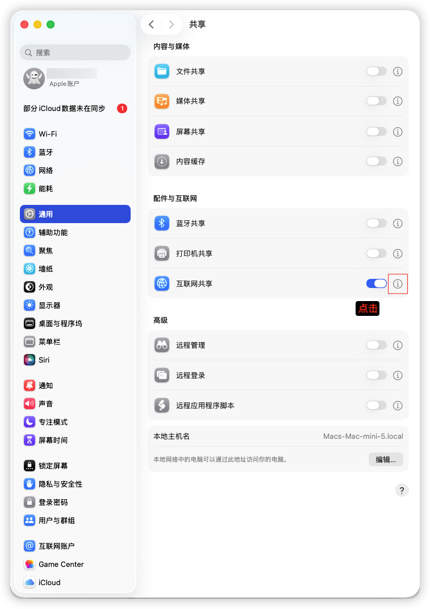
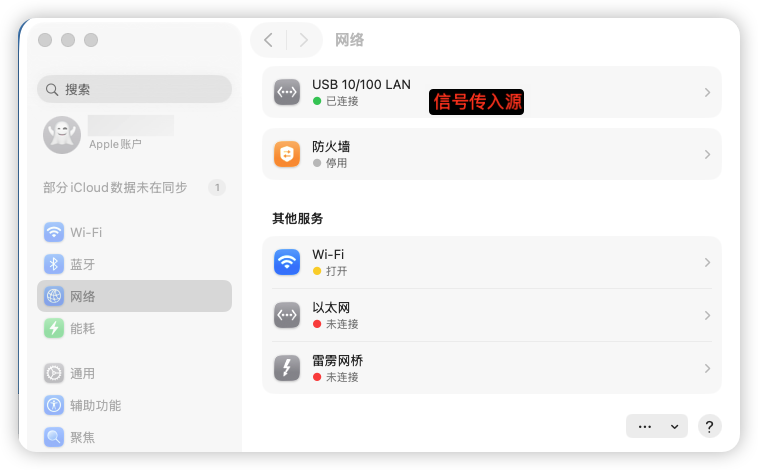
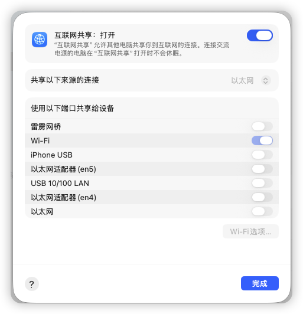
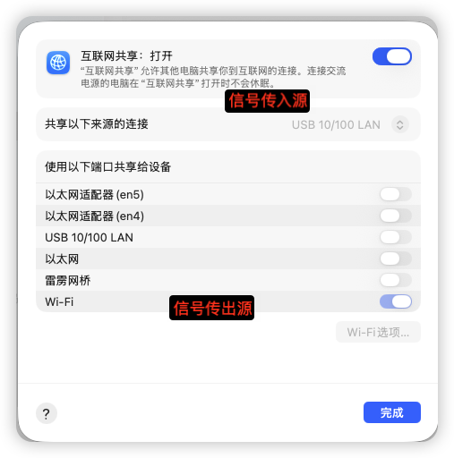

<iframe
  src="https://dragonir.github.io/3d/#/earth"
  title="Jobs出品，必属精品"
  width="100%"
  height="400"
  style="border:0; display:block;"
  allowfullscreen>
</iframe>

## 前言

* 如果MacOS当前信号输入源是**Wi-Fi**，则无法配置个人热点

* 必须打开**Wi-Fi**

* 成功标志

  

## 一、系统设置👉通用👉共享👉配件与互联网👉互联网共享 <a href="#前言" style="font-size:17px; color:green;"><b>🔼</b></a> <a href="#🔚" style="font-size:17px; color:green;"><b>🔽</b></a>

## 二、查看信号源 <a href="#前言" style="font-size:17px; color:green;"><b>🔼</b></a> <a href="#🔚" style="font-size:17px; color:green;"><b>🔽</b></a>

### 三、按照图示进行配置 <a href="#前言" style="font-size:17px; color:green;"><b>🔼</b></a> <a href="#🔚" style="font-size:17px; color:green;"><b>🔽</b></a>
> 共享以下来源的连接（信息入口）
> 使用以下端口共享给设备（信息出口）

* 如果是网线直接插入Mac电脑（一般会显示以太网）
	

* 如果网线是通过**USBHubber**进行桥接
	

<a id="🔚" href="#前言" style="font-size:17px; color:green; font-weight:bold;">我是有底线的➤点我回到首页</a>
