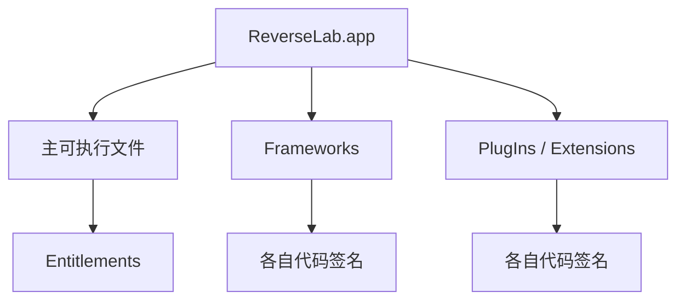

---

## 🔥 <font id=前言>前言</font>

> 本专题把容易混在一起的签名、脱壳、类声明恢复和终端观察工具放回各自层次。命令均用于自己的 `.app`、Mach-O、dSYM 或明确授权样本；`ssh`、`ps`、`ls` 只演示本机或自管实验设备的运维观察，不包含第三方设备访问、凭据获取或防护绕过。

## 一、代码签名到底证明什么 <a href="#前言" style="font-size:17px; color:green;"><b>🔼</b></a> <a href="#🔚" style="font-size:17px; color:green;"><b>🔽</b></a>

### 1.1、四个核心作用

1、身份：哪个 Team / 证书对代码签名。

2、完整性：签名后受保护内容是否改变。

3、权限：Entitlements 声明并由 Profile / 平台允许哪些能力。

4、平台约束：系统是否允许该代码在当前设备和上下文运行。

签名不负责隐藏源码，也不等于加密。重新签名不能凭空获得原发行者的 Team、Keychain Group、Push、Associated Domains 或受限权限。

### 1.2、签名对象是一棵树

App Bundle 可能包含主可执行文件、Framework、Extension 和资源。嵌套代码要先满足各自签名，再由外层 Bundle 形成完整封装。只盯主二进制会漏掉常见失败点。



## 二、只读签名检查

### 2.1、验证 Bundle

```shell
APP_PATH="/path/to/ReverseLab.app"
codesign --verify --deep --strict --verbose=2 "$APP_PATH"
codesign -dv --verbose=4 "$APP_PATH"
```

`--deep` 适合辅助检查，不应被当成签名设计方案；真正排错仍要逐层检查嵌套代码。

### 2.2、读取 Entitlements

```shell
codesign -d --entitlements :- "$APP_PATH"
```

输出的是签名中携带的权限声明，不代表每项能力一定在当前账号、设备或服务器端可用。

### 2.3、读取 Provisioning Profile

```shell
security cms -D -i "$APP_PATH/embedded.mobileprovision"
```

只对自己的开发 / Ad Hoc 构建执行。App Store 分发产物的结构与本地开发构建不同，不要用“没有这个文件”直接判定签名损坏。

## 三、脱壳与签名的关系

### 3.1、二者解决不同问题

- 脱壳讨论分发加密内容如何在授权运行环境中映射。
- 签名讨论代码身份、完整性、权限和运行许可。

文件内容被改变后原签名通常失效；重新签名只建立新的签名关系，不会恢复原发行者权利，也不会让第三方内容的提取和传播自动合法。砸壳工具的边界和历史参见同目录专题《砸壳工具》。

## 四、class-dump 能恢复什么

### 4.1、Objective-C 元数据为何可读

Objective-C Runtime 依赖类、方法、Selector、协议和属性等元数据完成动态派发。[**class-dump**](http://stevenygard.com/projects/class-dump/) 历史上通过解析这些结构生成类似 Header 的声明。

### 4.2、生成的不是原始 Header

它通常不能恢复：

- 方法实现、注释、宏和业务意图。
- 原始文件边界和私有变量名。
- 被裁剪或完全静态派发的内容。
- 完整现代 [**Swift**](https://www.swift.org/) 类型、泛型和协议实现。
- 服务端 API 的实现。

所以 class-dump 输出是“由运行时元数据重建的接口线索”，不是泄漏出的源码。

### 4.3、现代替代观察

对自己的 App，优先使用源码、生成接口、`nm`、`swift-demangle`、LLDB Runtime 命令和反编译器的 Objective-C / Swift 元数据视图。只有在研究旧 Objective-C 样本格式时，才把 class-dump 作为对照工具。

## 五、Mach-O 常用命令地图

### 5.1、身份和架构

```shell
file "/path/to/ReverseLab"
lipo -info "/path/to/ReverseLab"
xcrun vtool -show-build "/path/to/ReverseLab"
xcrun dwarfdump --uuid "/path/to/ReverseLab"
```

### 5.2、Load Command 与依赖

```shell
xcrun otool -hV "/path/to/ReverseLab"
xcrun otool -l "/path/to/ReverseLab"
xcrun otool -L "/path/to/ReverseLab"
xcrun llvm-objdump --macho --private-headers "/path/to/ReverseLab"
```

### 5.3、符号、字符串和 Swift 名字

```shell
xcrun nm -nm "/path/to/ReverseLab"
strings -a "/path/to/ReverseLab"
xcrun swift-demangle '$s...'
```

命令输出必须与目标 UUID、架构和构建版本绑定保存；从另一个版本复制的偏移和符号结论没有证据价值。

### 5.4、Bundle 与 plist

```shell
plutil -p "/path/to/ReverseLab.app/Info.plist"
find "/path/to/ReverseLab.app" -maxdepth 2 -type f -print
shasum -a 256 "/path/to/ReverseLab"
```

`find` 只对明确的 App 目录执行，不要对根目录、Home 或不明挂载点进行无边界扫描。

## 六、`ssh`、`ps`、`ls` 在实验环境里做什么

### 6.1、`ssh` 是通道，不是授权

`ssh` 用于登录自己管理、已明确开放 SSH 的测试主机或设备。拥有一个 IP、端口或默认用户名不等于获得授权。本专题不提供扫描、爆破、默认密码或第三方设备登录方法。

在自管 macOS / Linux Lab 中先验证身份：

```shell
ssh -G lab-host | head
```

真正连接前应核对 Host Key 指纹、专用账号、最小权限和日志策略。

### 6.2、`ps` 观察进程

```shell
ps -axo pid,ppid,user,etime,command
ps -p 1234 -o pid,ppid,user,etime,command
```

进程名相似不能证明属于目标 App。iOS / Simulator 排错应同时核对 PID、Bundle ID、可执行路径和启动来源。

### 6.3、`ls` 观察文件元数据

```shell
ls -la "/path/to/ReverseLab.app"
ls -lO@ "/path/to/ReverseLab.app/ReverseLab"
```

`-O` / `-@` 可帮助查看 Flags 与扩展属性；权限位、ACL、扩展属性和代码签名又是不同层次，不要只凭 `chmod` 解决签名问题。

## 七、标准排错顺序

### 7.1、App 无法启动

1、`file` / `vtool`：平台和架构是否正确。

2、`codesign --verify`：Bundle 完整性是否成立。

3、`codesign -d --entitlements`：权限是否符合预期。

4、`otool -L`：动态库和 RPath 是否能解析。

5、设备 Console：系统真正拒绝原因是什么。

6、`dwarfdump --uuid`：符号与二进制是否匹配。

不要一看到启动失败就反复“重签”或 `chmod -R`；那可能掩盖真正的架构、路径或权限错误。

## 八、完成标准与资料

### 8.1、学完应该会什么

你应能解释签名、加密和权限的区别，安全读取签名与 Entitlements，理解 class-dump 的 Objective-C 能力边界，并使用 `file`、`vtool`、`otool`、`nm`、`dwarfdump`、`plutil`、`ps`、`ls` 建立一条可重复的只读排错链。

### 8.2、官方资料

- [**Apple：Code Signing Guide**](https://developer.apple.com/library/archive/documentation/Security/Conceptual/CodeSigningGuide/Introduction/Introduction.html)
- [**Apple：Entitlements**](https://developer.apple.com/documentation/bundleresources/entitlements)
- [**Apple：Mach-O Programming Topics**](https://developer.apple.com/library/archive/documentation/DeveloperTools/Conceptual/MachOTopics/0-Introduction/introduction.html)
- [**LLDB Tutorial**](https://lldb.llvm.org/use/tutorial.html)
- [**class-dump**](http://stevenygard.com/projects/class-dump/)

<a id="🔚" href="#前言" style="font-size:17px; color:green; font-weight:bold;">我是有底线的➤点我回到首页</a>
