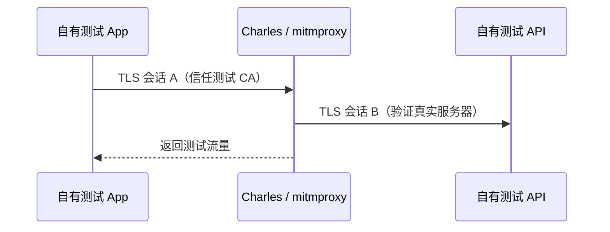

---

## 🔥 <font id=前言>前言</font>

> 网络分析的第一步不是“抓包”，而是先判断要看应用层 HTTP(S)、TLS 会话元数据，还是 TCP / UDP / QUIC 等传输层数据。Charles、mitmproxy 与 Wireshark 位于不同观察层，不能互相简单替代。本专题仅调试自有 App、自有服务和明确授权流量。

## 一、三种工具分别看什么 <a href="#前言" style="font-size:17px; color:green;"><b>🔼</b></a> <a href="#🔚" style="font-size:17px; color:green;"><b>🔽</b></a>

### 1.1、工具地图

| 工具 | 主要层次 | 能直接看到 | 典型用途 |
| --- | --- | --- | --- |
| [**Charles**](https://www.charlesproxy.com/) | HTTP(S) 代理 | 解密后的请求、响应、Header、Body | 手工调试移动端 API、弱网与 Map Local |
| [**mitmproxy**](https://mitmproxy.org/) | HTTP(S) / WebSocket / 可脚本代理 | Flow、内容、重放与 Python 扩展 | 自动化回归、批量过滤、可复现实验 |
| [**Wireshark**](https://www.wireshark.org/) | 数据包与协议解析 | IP、TCP、UDP、TLS、DNS、QUIC 等 Packet | Socket 故障、握手、重传、时序与协议层定位 |

Wireshark 能捕获 TLS 数据包，但没有会话密钥时通常看不到 HTTPS Body；HTTP 代理若被 App 接受并信任测试 CA，则更适合观察应用层内容。

### 1.2、按问题选工具

| 问题 | 首选 |
| --- | --- |
| 某个 JSON 字段是否发错 | Charles / mitmproxy |
| 自动替换测试环境响应 | mitmproxy 脚本或 Charles Map Local |
| DNS 是否解析、TCP 是否重传 | Wireshark |
| TLS 在哪一步失败 | Wireshark + App 日志 |
| WebSocket 消息内容 | Charles / mitmproxy，视协议支持 |
| 自定义二进制 Socket | Wireshark + 自定义 dissector / 日志 |

## 二、HTTPS 代理为什么需要测试 CA

### 2.1、正常 HTTPS

客户端与服务器建立 TLS 会话，代理只能转发加密字节，不能自然读取内容。

### 2.2、调试代理的工作方式

在明确授权的测试设备上，客户端信任代理生成的测试 CA；代理分别与客户端、真实服务器建立 TLS 会话，从而在中间显示应用层数据。[**mitmproxy 官方机制说明**](https://docs.mitmproxy.org/stable/concepts/how-mitmproxy-works/) 对这个过程有完整解释。



这会扩大代理主机对测试流量的可见范围，因此：

- 只在专用测试设备和测试账号上安装 CA。
- 实验结束后删除代理、描述文件和信任设置。
- 不在同一次会话中访问网银、生产后台或私人账号。
- 不导出、分享包含 Token、Cookie、手机号或真实业务数据的会话文件。

## 三、Charles：图形化 HTTP(S) 调试

### 3.1、适合新手的观察顺序

1、让 Mac 和测试设备处于可互通网络。

2、只给自有测试 App / 测试域名配置代理。

3、先验证 HTTP，再按官方指引安装测试 CA 并验证 HTTPS。

4、按 Host、Path、状态码和时间筛选。

5、对比 App 日志中的 Request ID 与代理 Flow。

6、导出前进行脱敏。

### 3.2、常见能力

- Breakpoint：暂停并在授权测试中修改请求或响应。
- Map Local / Map Remote：把自有接口映射到本地或另一测试地址。
- Throttling：模拟带宽和延迟，但不能完全替代真实弱网。
- Repeat / Compose：重放测试请求，注意幂等性和生产风险。

## 四、mitmproxy：让网络实验可脚本化

### 4.1、三个前端

- `mitmproxy`：终端交互界面。
- `mitmweb`：Web 界面。
- `mitmdump`：适合非交互和自动化输出。

[**mitmproxy 官方文档**](https://docs.mitmproxy.org/stable/) 说明其支持 HTTP/1、HTTP/2、WebSocket 以及多种捕获模式；具体协议限制会随版本变化，执行前应阅读当前文档。

### 4.2、安全 Lab

在本机启动一个只返回固定假数据的测试 API，让 Debug App 请求它。代理只记录：URL、状态码、耗时、非敏感 Request ID。先人工验证，再把过滤与断言写成 Python Addon。

不要把生产凭据写入脚本，也不要通过关闭服务端证书验证来“解决”测试证书问题。

## 五、Wireshark：分析 Socket 与传输层

### 5.1、它看到的是 Packet，不是业务对象

常见过滤器：

```text
dns
tcp
udp
tls
quic
ip.addr == 192.0.2.10
tcp.stream eq 3
```

示例 IP `192.0.2.10` 属于文档保留地址。实验时替换为自有测试主机，避免误捕获无关用户流量。

### 5.2、TCP 问题的观察顺序

1、DNS 是否得到预期地址。

2、三次握手是否完成。

3、TLS ClientHello / ServerHello 是否出现。

4、是否有重传、RST、Zero Window 或明显延迟。

5、连接是正常关闭还是异常中断。

6、最后再与 App 层超时、重试和错误码对齐。

### 5.3、自定义 Socket

如果协议有固定帧头、长度、序列号和校验字段，先写协议说明，再按字节边界解释 Packet。TCP 是字节流，一次 `send` 不保证对应一次 `receive`；抓到多个 Segment 或粘包不能直接判定服务端发错。

## 六、证书固定与边界

### 6.1、抓不到 HTTPS 不等于工具坏了

可能原因：

- App 未走系统代理。
- 测试 CA 没有被正确安装或信任。
- App 对自有服务启用了证书或公钥固定。
- 流量实际使用 QUIC、VPN、Network Extension 或自定义协议。
- 请求来自另一个进程或 Extension。

对自有 App，正确做法是使用专门 Debug 配置、测试证书和可审计开关；不要在第三方 App 上绕过固定，也不要把“关闭证书校验”带进 Release。

## 七、网络证据报告

### 7.1、最小记录

| 字段 | 内容 |
| --- | --- |
| 授权范围 | App、账号、域名、设备 |
| 工具与版本 | Charles / mitmproxy / Wireshark |
| 捕获层次 | HTTP、TLS 元数据、TCP、UDP、QUIC |
| 触发时间 | 带时区的时间戳 |
| 关联 ID | Request ID、Trace ID、TCP Stream |
| 敏感信息 | 已脱敏字段与处理方式 |
| 结论 | 事实、推断、待服务端验证 |

### 7.2、学完应该会什么

你应能按协议层选择工具，解释 HTTPS 代理为何需要测试 CA，使用 Wireshark 分析 Socket 连接，并在不绕过第三方安全措施的前提下完成自有 App 的可复现网络实验。

## 八、官方资料

- [**Charles Documentation**](https://www.charlesproxy.com/documentation/)
- [**mitmproxy Documentation**](https://docs.mitmproxy.org/stable/)
- [**Wireshark User's Guide**](https://www.wireshark.org/docs/wsug_html_chunked/)
- [**Apple：Preventing Insecure Network Connections**](https://developer.apple.com/documentation/security/preventing-insecure-network-connections)

<a id="🔚" href="#前言" style="font-size:17px; color:green; font-weight:bold;">我是有底线的➤点我回到首页</a>
