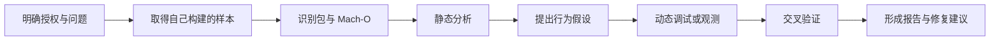
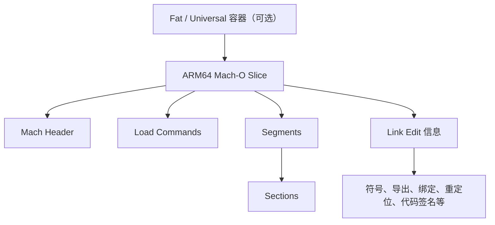
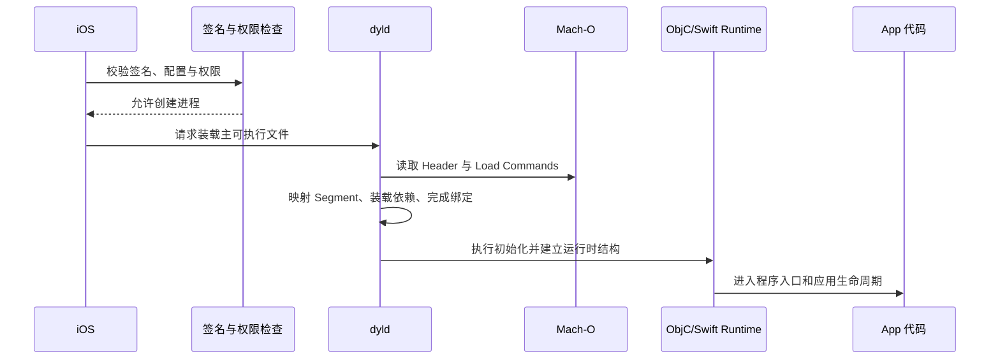

---

## 🔥 <font id=前言>前言</font>

> iOS 逆向工程不是天然违法，也不等于“破解”。它是一组在缺少完整源码、调试信息或设计文档时，通过二进制、运行状态、日志和系统行为理解软件的技术。是否合法，取决于目标归属、授权范围、所在地法律、软件协议、知识产权、隐私数据以及是否绕过访问控制。本篇不是法律意见，所有实验只针对自己编写的 App、公开教学样本、模拟器或书面授权目标。

本文面向已经会用 [**Xcode**](https://developer.apple.com/xcode)、[**Swift**](https://www.swift.org/) 或 [**Objective-C**](https://developer.apple.com/library/archive/documentation/Cocoa/Conceptual/ProgrammingWithObjectiveC/Introduction/Introduction.html) 的 iOS 开发者。重点回答四件事：

1. iOS 逆向究竟在研究什么。
2. 逆向工作的合理目标和动机是什么。
3. `Mach-O`、`dyld`、符号、反汇编等名词是什么意思。
4. 初学者应该按什么顺序使用哪些工具。

---

## 一、先建立正确边界 <a href="#前言" style="font-size:17px; color:green;"><b>🔼</b></a> <a href="#🔚" style="font-size:17px; color:green;"><b>🔽</b></a>

### 1.1、允许且有价值的研究场景

- 分析自己开发但已经丢失部分源码或文档的 App。
- 对自己或已书面授权的 App 做安全审计、隐私检查和渗透测试。
- 定位 Release 包、线上包与 Debug 包行为不一致的问题。
- 分析崩溃、卡死、启动耗时、动态库加载和 ABI 兼容问题。
- 验证自家 App 是否泄漏密钥、接口地址、调试开关或敏感日志。
- 分析恶意样本的可观察行为，为检测、告警和应急响应提供证据。
- 在允许的范围内研究文件格式、协议兼容、无障碍、数据迁移或系统互操作。
- 学习编译器、链接器、运行时、操作系统和 ARM64 指令如何协作。

### 1.2、不应进入的场景

- 破解付费、订阅、会员、许可证、广告计费或数字版权保护。
- 绕过登录、设备绑定、服务端授权、反作弊或访问控制。
- 窃取账号、Token、Cookie、密钥、通讯录、定位、照片或其它隐私数据。
- 对第三方 App 注入、篡改、重签名、二次分发或隐藏行为。
- 为真实目标编写免杀、持久化、提权、窃密或数据外传方案。
- 未经授权截获第三方通信，或绕过证书校验、证书绑定等安全机制。

### 1.3、每次开始前的五个问题

1. 目标 App 是我自己的吗？如果不是，是否有明确的书面授权？
2. 授权是否写清设备、Bundle ID、版本、账号、接口、时间窗口和允许动作？
3. 实验会不会接触真实用户数据或第三方服务？
4. 是否涉及绕过付费、登录、DRM、代码签名或其它访问控制？
5. 失败时是否有回滚方式，并且能保留完整日志和操作记录？

只要第 1 项不明确，或者第 4 项答案为“是”，就先停止技术操作，重新确认法律和授权边界。

---

## 二、iOS 逆向的工作目标，也就是“为什么做”

### 2.1、从开发者角度理解动机

| 动机 | 想回答的问题 | 最终产物 |
| --- | --- | --- |
| 程序理解 | 这个二进制有哪些模块、类、函数和依赖？ | 模块图、调用链、关键符号表 |
| 故障定位 | 为什么只在 Release、真机或特定系统版本出错？ | 根因、复现条件、栈与指令证据 |
| 安全审计 | 密钥、权限、日志、网络和本地数据是否安全？ | 风险清单、证据、修复建议 |
| 恶意样本分析 | 样本加载了什么、访问了什么、留下什么痕迹？ | 行为时间线、IOC、检测建议 |
| 兼容与迁移 | 老程序使用了什么格式、协议或 ABI？ | 兼容说明、迁移映射、边界条件 |
| 性能与体积 | 启动慢在哪里，二进制为什么变大？ | 加载链、符号/段体积、优化建议 |
| 技术学习 | Swift/OC 最终如何变成 ARM64 并运行？ | 可复现实验记录、知识图谱 |

### 2.2、逆向不是一个单独动作

完整工作通常是下面这条证据链：



逆向工作的价值不在于“看到了很多汇编”，而在于用多种证据回答一个明确问题。

---

## 三、学习提纲

### 3.1、基础层：先知道程序如何变成 App

- 编译：把 Swift / Objective-C / C / C++ 转换成目标代码。
- 链接：把目标文件和依赖组合成可加载的 Mach-O。
- 装载：`dyld` 按 Mach-O 的说明把代码和数据映射进进程。
- 运行时：Objective-C Runtime、Swift Runtime 和系统框架共同支撑对象、方法、泛型、协议等语义。
- 系统保护：代码签名、Entitlements、沙盒、ASLR 和权限模型限制程序能做什么。

### 3.2、静态分析层：不运行程序也能看什么

- App Bundle、`Info.plist`、资源、Framework、Extension 和主可执行文件。
- Mach-O Header、Load Commands、Segments、Sections、依赖库、符号和字符串。
- 反汇编、反编译、控制流图、交叉引用和调用关系。
- Objective-C 类/协议/Selector 元数据，以及能保留下来的 Swift 类型信息。

### 3.3、动态分析层：程序运行后再验证

- 断点、单步、调用栈、寄存器、内存和已加载镜像。
- Objective-C 消息派发和 Swift 函数执行路径。
- 文件、Keychain、网络、数据库、日志和系统 API 行为。
- 用 Instruments 观察耗时、内存、线程、分配和卡顿。
- 在自有可调试 App 中用 Frida 做动态观测；不用于绕过第三方保护。

### 3.4、报告层：把“猜测”变成“结论”

- 每个结论记录样本哈希、版本、架构、设备和系统版本。
- 区分静态证据、动态证据、推断和未验证项。
- 记录函数地址时，同时记录镜像基址和 ASLR Slide。
- 给出对开发团队可执行的修复方案，而不是只贴工具截图。

---

## 四、开发者必须听懂的核心名词

### 4.1、IPA、App Bundle 与可执行文件

- `IPA`：本质上是特定目录结构的 ZIP 分发包，通常包含 `Payload/某应用.app`。它是“运输箱”，不是程序本身。
- `.app`：App Bundle，是一个目录，里面有可执行文件、`Info.plist`、资源、Framework、PlugIns 和签名信息。
- 主可执行文件：`.app` 中真正被系统加载的 Mach-O。文件名通常由 `Info.plist` 的 `CFBundleExecutable` 指定。
- Framework / dylib：可复用代码模块，内部通常也包含 Mach-O。
- dSYM：保存调试符号的独立产物，UUID 必须与二进制匹配才能正确符号化。

### 4.2、静态分析与动态分析

- 静态分析：不运行目标，只查看文件结构、元数据、字符串、符号、汇编和伪代码。优点是安全、可重复；缺点是看不到真实运行值和动态分支。
- 动态分析：让程序运行，再观察调用、参数、返回值、内存和系统行为。优点是能验证真实路径；缺点是容易受环境、权限和时序影响。
- 正确姿势：静态分析提出假设，动态分析验证假设，两者不是二选一。

### 4.3、反汇编与反编译

- 反汇编（Disassembly）：把机器码翻译成 ARM64 汇编指令，较接近 CPU 真正执行的内容。
- 反编译（Decompilation）：根据机器码推测出 C 风格伪代码，方便阅读，但不是原始源码。
- 伪代码中的变量名、类型、循环和 `if` 结构都可能是工具推断；不能把它当作源码事实。

### 4.4、符号、地址与偏移

- 符号（Symbol）：给函数或全局变量使用的名字，例如 `main`、某个 C 函数或经过编码的 Swift 名字。
- 符号化（Symbolication）：把地址还原为函数名、文件名和行号。
- 偏移（Offset）：相对某个基准位置的距离。逆向报告里必须说清是文件偏移、虚拟地址还是相对镜像基址的偏移。
- ASLR Slide：系统每次加载镜像时随机增加的地址偏移，用于提高攻击难度。因此运行时地址不一定等于工具里看到的静态地址。

### 4.5、ARM64、寄存器和调用约定

- ARM64 / AArch64：现代 iPhone、iPad 和 Apple Silicon 使用的 64 位 ARM 指令集架构。
- 寄存器：CPU 内部的高速小存储单元。常见的 `x0`～`x7` 经常承载前几个参数，`x0` 通常也承载返回值。
- `sp`：栈指针；`fp`（通常是 `x29`）：帧指针；`lr`（`x30`）：链接寄存器，常保存返回地址；`pc`：当前指令位置。
- 调用约定：规定参数、返回值、栈和寄存器如何配合。理解它，才能在没有源码时判断函数输入和输出。
- PAC：Pointer Authentication Code，指针认证。新设备可用它保护返回地址和部分指针；看到带认证语义的指令时，不要把它误判成普通业务逻辑。

### 4.6、Objective-C Runtime

- Class：类对象，保存类的结构和方法等信息。
- Selector（`SEL`）：方法名的运行时标识，例如 `viewDidLoad` 或 `tableView:didSelectRowAtIndexPath:`。
- IMP：方法真正对应的函数实现地址。
- 消息派发：`[obj doSomething]` 在底层不是简单的静态函数调用，而是根据对象和 Selector 查找 IMP 并执行，核心概念常与 `objc_msgSend` 联系在一起。
- 逆向友好性：Objective-C 为动态派发保留了较多类名、方法名和协议元数据，因此通常比纯 C/C++ 更容易恢复结构。

### 4.7、Swift Runtime 与名称修饰

- 名称修饰（Name Mangling）：编译器把模块、类型、泛型、参数和返回值编码进符号名，所以 Swift 符号看起来很长。
- Demangle：把修饰后的符号名还原成更适合人读的形式，可使用 `swift-demangle`。
- Swift Metadata：运行时为类型、协议一致性、泛型等语义保留的数据。
- 优化影响：Release 优化可能内联、特化、删除或合并函数，使源码结构与最终机器码差异很大。
- `@objc` / `dynamic`：会影响方法是否进入 Objective-C Runtime 派发路径，也会影响能否通过 Selector 观察。

### 4.8、dyld、动态库与加载

- `dyld`：Apple 平台的动态链接器。它读取 Mach-O 的加载信息，把主程序和依赖库映射到内存，并完成符号绑定、重定位和初始化。
- 动态库：程序运行时依赖的共享代码，例如系统 Framework 或 App 内嵌 Framework。
- RPath：动态库搜索路径规则，常见于 `@rpath`、`@loader_path` 和 `@executable_path`。
- Bind / Rebase / Chained Fixups：让二进制内部的引用在实际加载地址下指向正确函数或数据的机制。

### 4.9、代码签名、Entitlements 与沙盒

- 代码签名：证明代码来源并检测签名后是否被修改。iOS 会拒绝运行缺失或无效签名的 App。
- Entitlements：写入代码签名的键值权限声明，例如 Keychain Group、Push、App Group 等。它不是普通配置备注，而是系统授权的一部分。
- Provisioning Profile：把开发者、App、设备、有效期和允许申请的能力关联起来。
- 沙盒：限制 App 默认只能访问自己的容器和明确获准的系统资源。
- 三者关系：Provisioning Profile 决定“最多允许申请什么”，App 签名里的 Entitlements 表示“实际申请什么”，沙盒和系统服务在运行时执行限制。

### 4.10、Hook、注入与越狱

- Hook：在运行时观察、替换或包裹某个函数/方法。它是双用途能力；本篇只讨论对自有 App 的只读观测。
- 注入：让额外代码进入目标进程。iOS 的签名、沙盒和调试权限会严格限制它。
- 越狱：修改设备安全边界以获得正常系统不提供的权限。它会扩大攻击面、破坏实验可信度，并带来设备和数据风险。
- 初学路线不需要越狱。模拟器、自己签名的 Debug App、LLDB 和 Instruments 已经足够学习大多数基本概念。

---

## 五、重点解释：Mach-O 到底是什么

### 5.1、一句话理解

`Mach-O` 是 Apple 平台用于组织机器码、数据、依赖、符号和加载说明的二进制文件格式。

可以把它类比成一栋楼的“建筑总图纸 + 房间布局 + 设备清单”：

- ARM64 指令是房间里真正工作的机器。
- Segment / Section 是楼层和房间。
- Load Commands 是告诉系统如何建楼、把哪些设备接进来的施工说明。
- 符号和导出信息是房间名与索引。
- 代码签名是封条。
- `dyld` 是按图纸把整栋楼装载起来的施工队。

所以，Mach-O 不是汇编语言；它是装载和组织汇编指令及其它数据的容器格式。

### 5.2、Mach-O 的主要层次



### 5.3、Mach Header：身份证

Header 位于 Slice 开头，常见信息包括：

- Magic：识别 Mach-O 类型、位数和字节序。
- CPU Type / Subtype：例如 ARM64。
- File Type：可执行文件、动态库、Bundle、目标文件等。
- `ncmds`：Load Commands 数量。
- `sizeofcmds`：全部 Load Commands 的总大小。
- Flags：与链接、装载和命名空间有关的标志。

### 5.4、Load Commands：装载说明书

Load Command 告诉系统“这个文件应该怎样进入进程”。常见概念包括：

- `LC_SEGMENT_64`：描述 64 位 Segment 及其 Section。
- `LC_LOAD_DYLIB`：声明需要加载的动态库。
- `LC_RPATH`：声明 `@rpath` 搜索路径。
- `LC_MAIN`：给出主入口相关信息。
- `LC_UUID`：二进制 UUID，用于和 dSYM、崩溃日志匹配。
- `LC_BUILD_VERSION`：目标平台、最低系统和 SDK 等构建信息。
- `LC_CODE_SIGNATURE`：指出代码签名数据的位置。

### 5.5、Segment 与 Section：楼层和房间

- Segment：面向虚拟内存映射的大区域，描述权限和地址范围。
- Section：Segment 内更具体的数据分类。
- 一个 Segment 可以包含多个 Section；二者不是同义词。

常见区域：

| 区域 | 大致内容 | 初学者关注点 |
| --- | --- | --- |
| `__TEXT` | 只读代码和常量 | 机器指令、C 字符串、只读数据 |
| `__text` | 通常位于 `__TEXT` | 真正的函数机器码 |
| `__cstring` | C 字符串 | 日志、提示词、URL 等线索，但不能单独证明行为 |
| `__DATA` | 可读写数据 | 全局变量、运行时结构引用 |
| `__DATA_CONST` | 初始化后偏只读的数据 | 函数指针、常量化运行时数据等 |
| `__objc_*` | Objective-C 元数据 | 类、方法、Selector、协议线索 |
| `__swift5_*` | Swift 相关元数据 | 类型、协议、反射等线索，具体布局会随工具链演进 |
| `__LINKEDIT` | 链接编辑数据 | 符号、导出、绑定、重定位、签名等 |

### 5.6、从双击图标到代码执行



### 5.7、为什么 iOS 开发者应该学 Mach-O

- 看懂启动时动态库为什么找不到。
- 理解 dSYM UUID 为什么必须与崩溃二进制一致。
- 判断某个 Framework 是否包含正确架构和平台 Slice。
- 理解 App 体积主要落在哪些代码或数据区域。
- 理解为什么 Release 优化后断点、函数和源码行对应不上。
- 理解代码签名、Entitlements、dyld、ASLR 和 Runtime 各自处在哪一层。

---

## 六、会用到哪些工具

### 6.1、最小入门工具栈

初学者先使用下面五件套，不需要一上来安装大量工具：

1、Xcode：构建自己的 Debug / Release 样本，管理 dSYM，在可视化界面中使用 LLDB。

2、Terminal + Xcode Command Line Tools：查看包、Mach-O、符号、签名和 Entitlements。

3、LLDB：动态断点、调用栈、寄存器、镜像和反汇编。

4、Hopper 或 Ghidra 二选一：建立静态分析的函数、伪代码和交叉引用视角。

5、Instruments：验证耗时、内存、线程和系统调用表现。

### 6.2、系统自带与 Apple 工具

| 工具 | 主要用途 | 初学阶段 |
| --- | --- | --- |
| `file` | 判断文件类型和架构 | 必学 |
| `plutil` | 读取和转换 `plist` | 必学 |
| `xcrun vtool` | 查看 Mach-O 构建平台与版本信息 | 必学 |
| `xcrun otool` | 查看 Header、Load Commands、依赖库等 | 必学 |
| `xcrun nm` | 查看符号 | 必学 |
| `strings` | 提取可打印字符串线索 | 必学 |
| `codesign` | 检查签名和 Entitlements | 必学，只读使用 |
| `xcrun dwarfdump` | 查看 Mach-O / dSYM UUID 和 DWARF 信息 | 必学 |
| `xcrun swift-demangle` | 还原 Swift 修饰符号名 | 必学 Swift |
| `xcrun llvm-objdump` | 查看 Mach-O、反汇编、依赖、导出和 dyld 信息 | 进阶 |
| `size` | 粗看代码和数据体积 | 进阶 |
| `dyld_info` | 查看 dyld 相关绑定、导出等信息 | 进阶 |
| [**LLDB**](https://lldb.llvm.org/) | 动态调试器 | 必学 |
| Instruments | 性能、内存、线程和运行行为分析 | 必学 |
| Console / `log` | 查看统一日志 | 必学 |

提示：Apple 工具链中的部分经典工具正在向 LLVM 实现演进，同一个名字在不同 Xcode 版本下可能对应不同实现。遇到参数差异时先执行 `xcrun <工具> --help` 或查看 `man`，不要机械照搬旧博客。

### 6.3、静态分析工具

| 工具 | 特点 | 适合谁 |
| --- | --- | --- |
| [**Hopper**](https://www.hopperapp.com/) | 原生 macOS 界面，面向 macOS/iOS，提供反汇编、伪代码和控制流图 | 想快速进入 iOS 二进制阅读的开发者 |
| [**Ghidra**](https://github.com/NationalSecurityAgency/ghidra) | 免费开源、跨平台、功能完整，可扩展和脚本化 | 想系统学习且接受较陡界面的开发者 |
| [**IDA**](https://hex-rays.com/ida-pro) | 商业级交互式反汇编/反编译生态，支持 ARM/ARM64 | 专业安全研究、预算充足的团队 |
| `llvm-objdump` | 命令行、适合验证和自动化，可直接查看反汇编及 Mach-O 信息 | 喜欢终端和可复现记录的开发者 |

选择建议：

- 只想先学会看：Hopper。
- 想免费且深入：Ghidra。
- 已在专业团队、插件和协作流程明确：IDA。
- 无论选择哪个 GUI 工具，都要用系统命令交叉验证，不要完全相信伪代码。

### 6.4、动态调试与插桩工具

| 工具 | 能做什么 | 安全边界 |
| --- | --- | --- |
| LLDB | 断点、单步、调用栈、寄存器、内存、表达式、反汇编 | 优先用于自己通过 Xcode 启动的 App |
| Instruments | Time Profiler、Allocations、Leaks、Network 等观测 | 优先非侵入验证 |
| [**Frida**](https://frida.re/) | 运行时枚举、追踪和脚本化动态插桩 | 只对自有/授权且可调试目标使用，不做绕过和篡改 |
| `os_log` / Console | 观察统一日志和子系统事件 | 避免记录真实敏感数据 |

Frida 不是入门第一步。先学会 LLDB、调用约定和 Runtime，再用 Frida 对自己的 Lab App 做只读函数追踪，否则容易“会跑脚本但不懂证据”。

### 6.5、网络与数据观测工具

| 工具 | 用途 | 边界 |
| --- | --- | --- |
| [**Proxyman**](https://proxyman.com/) | macOS/iOS 网络调试代理，界面对开发者友好 | 只调试自己的 App 与服务 |
| [**Charles**](https://www.charlesproxy.com/) | HTTP(S) 代理与请求分析 | 只拦截明确授权的流量 |
| [**mitmproxy**](https://mitmproxy.org/) | 可脚本化的开源代理 | 适合自建测试环境与自动化 |
| Instruments Network | 从性能视角观察网络活动 | 优先作为低风险起点 |

对自己的 App，应在 Debug 环境配置专用测试证书和测试服务。本文不介绍绕过第三方证书固定、系统信任或身份认证的方法。

### 6.6、历史工具与容易混淆的名字

- `class-dump`：历史上常用于恢复 Objective-C 声明；对现代 Swift、优化二进制和新元数据并不万能，可把它当辅助线索，而不是唯一答案。
- `Cycript`：历史上常见的运行时交互工具。现代学习路线优先 LLDB 和 Frida，不建议从过时教程起步。
- `Theos`、Tweak、重签名工具：与越狱插件、注入和修改链条联系紧密，不属于本文的合规入门路线。
- “脱壳”：常指处理加密保护后的可执行内容。不要把获取或处理第三方 App 二进制当作学习起点；直接使用自己构建的 Lab App。

### 6.7、专题文档索引

截图里的工具不是一条可以按顺序批量安装的“武器清单”，而是分布在不同观察层的能力。下面按专题统一管理，每个文件都从原理、工具地图、自有 Lab、风险边界和完成标准展开：

| 专题 | 覆盖工具与能力 | 文档 |
| --- | --- | --- |
| 静态分析 | IDA Pro、Hopper Disassembler、Mach-O、交叉引用、伪代码 | [《静态分析》](../静态分析.md/静态分析.md) |
| 动态分析 | LLDB、Cycript、Frida、ASLR、调用栈、只读追踪 | [《动态分析》](../动态分析.md/动态分析.md) |
| 网络分析 | Charles、mitmproxy、Wireshark、HTTPS、TLS、Socket | [《网络分析》](../网络分析.md/网络分析.md) |
| 注入工具 | cyinject、yololib、insert_dylib、optool、install_name_tool | [《注入工具》](../注入工具.md/注入工具.md) |
| 砸壳工具 | CrackXI、dumpdecrypted、FairPlay、现代替代实验 | [《砸壳工具》](../砸壳工具.md/砸壳工具.md) |
| Hook 工具 | MobileSubstrate、fishhook、HookZz、Dobby、Substitute | [《Hook 工具》](../Hook工具.md/Hook工具.md) |
| 签名与命令行 | 签名、脱壳、class-dump、`ssh`、`ps`、`ls` 与 Mach-O 命令 | [《签名、脱壳、class-dump 与常用命令行工具》](../签名、脱壳、class-dump与常用命令行工具.md/签名、脱壳、class-dump与常用命令行工具.md) |

推荐顺序：静态分析 → LLDB 动态验证 → 网络分层 → 签名与命令行；注入、砸壳和 Hook 放在掌握 Mach-O、dyld、Runtime 与授权边界之后。

---

## 七、合规入门实验：只分析自己写的 App

### 7.1、实验目标

创建一个名为 `ReverseLab` 的自有 Demo，包含：

- 一个 Swift 页面和一个 `@objc` 可见的 Objective-C 风格方法。
- 一个按钮触发本地计算并更新 Label。
- 一个请求自建测试服务的 `URLSession` 方法。
- 一个 Debug 日志点和一个可控错误分支。
- Debug 与 Release 两种构建，用来比较优化和符号差异。

实验最终要回答：

1. 主二进制在哪里，是什么架构？
2. 它依赖哪些动态库？
3. 能看到哪些 Objective-C / Swift 符号和字符串？
4. 签名和 Entitlements 声明了什么？
5. 静态工具看到的函数，能否用 LLDB 在运行时命中？
6. Debug 与 Release 的函数、符号、伪代码和调用栈有什么差异？

### 7.2、第 0 步：记录实验边界

在笔记开头写清：

```text
目标：ReverseLab（本人源码与签名）
Bundle ID：com.example.ReverseLab
环境：iOS Simulator / 自有测试设备
数据：仅使用虚构测试数据
网络：仅访问本地或自建测试服务
禁止动作：不分析第三方 App，不绕过签名/登录/证书固定，不接触真实用户数据
```

### 7.3、第 1 步：找到 App 与主可执行文件

从 Xcode 的构建产物定位 `ReverseLab.app`，然后设置路径：

```shell
APP_PATH="/请替换为实际路径/ReverseLab.app"
INFO_PLIST="$APP_PATH/Info.plist"
EXECUTABLE_NAME="$(/usr/libexec/PlistBuddy -c 'Print :CFBundleExecutable' "$INFO_PLIST")"
BINARY_PATH="$APP_PATH/$EXECUTABLE_NAME"

plutil -p "$INFO_PLIST"
file "$BINARY_PATH"
```

你应该先确认 `BINARY_PATH` 确实属于自己的构建产物，再执行后续命令。

### 7.4、第 2 步：读取 Mach-O 身份与构建信息

```shell
xcrun vtool -show-build "$BINARY_PATH"
xcrun otool -hv "$BINARY_PATH"
xcrun otool -l "$BINARY_PATH" | less
```

观察重点：

- CPU 类型是不是预期的 `arm64` 或模拟器架构。
- File Type 是不是可执行文件。
- 是否存在 `LC_UUID`、`LC_BUILD_VERSION`、`LC_MAIN` 和 `LC_CODE_SIGNATURE`。
- Segment 的虚拟内存权限是否符合代码只读、数据可写等预期。

### 7.5、第 3 步：查看动态库依赖与 RPath

```shell
xcrun otool -L "$BINARY_PATH"
xcrun llvm-objdump --macho --dylibs-used --rpaths "$BINARY_PATH"
```

把每个非系统依赖追溯到 Xcode Target、SPM、CocoaPods 或手工嵌入来源。重点检查：

- App 内嵌 Framework 是否出现在 Bundle 中。
- `@rpath` 是否能在实际加载路径下解析。
- Debug 专用库是否错误进入 Release 包。

### 7.6、第 4 步：查看符号、字符串与 Swift 名字

```shell
xcrun nm -nm "$BINARY_PATH" | less
strings -a "$BINARY_PATH" | less
```

如果遇到 Swift 修饰符号，把实际符号复制给：

```shell
xcrun swift-demangle '请替换为实际的Swift修饰符号'
```

注意：

- 找到某个 URL 或字符串，只能说明它存在于样本中，不能直接证明它一定被执行或请求。
- 找不到函数名，也不代表功能不存在；它可能被裁剪、内联、特化、剥离符号或动态构造。
- 字符串搜索是线索入口，不是结论终点。

### 7.7、第 5 步：查看签名与 Entitlements

```shell
codesign --display --verbose=4 "$APP_PATH"
codesign --display --entitlements - --xml "$APP_PATH" \
  | plutil -convert xml1 -o - -
```

只做读取和核对：

- Identifier、TeamIdentifier 和签名类型是否与构建配置一致。
- `get-task-allow` 在 Debug 与 Release 中是否符合预期。
- Keychain Group、App Group、Push 等能力是否确实需要。
- 不要把“重新签名第三方 App”当作签名学习实验。

### 7.8、第 6 步：核对 dSYM

```shell
DSYM_PATH="/请替换为实际路径/ReverseLab.app.dSYM"

xcrun dwarfdump --uuid "$BINARY_PATH"
xcrun dwarfdump --uuid "$DSYM_PATH"
```

两边 UUID 必须对应。UUID 不匹配时，即使文件名看起来一样，也不能正确还原崩溃地址。

### 7.9、第 7 步：用 Hopper 或 Ghidra 做静态阅读

1. 导入自己的 `BINARY_PATH`。
2. 确认工具识别为 Mach-O 和正确架构。
3. 从自己提前写好的唯一字符串开始搜索。
4. 查看该字符串的交叉引用（Xref）。
5. 从引用点进入函数，观察控制流图和伪代码。
6. 给已确认函数重命名，例如 `handleLabButton`，并在备注中标注证据。
7. 找到上游调用者和下游系统 API，画出最短调用链。

不要急着从 `main` 一路读完整个程序。更高效的方法是“业务锚点 → 交叉引用 → 局部调用链 → 动态验证”。

### 7.10、第 8 步：用 LLDB 验证静态结论

从 Xcode 启动自己的 App，在 LLDB 中练习：

```text
help
breakpoint set --name objc_exception_throw
breakpoint set --selector viewDidLoad
breakpoint list
image list -o -f
thread backtrace
frame variable
register read
disassemble --frame
```

每条命令的含义：

- `breakpoint set`：建立逻辑断点。
- `image list -o -f`：查看已加载 Mach-O 镜像及其加载偏移，可帮助理解 ASLR。
- `thread backtrace`：查看当前线程调用栈。
- `frame variable`：查看当前栈帧能恢复出的变量。
- `register read`：查看寄存器。
- `disassemble --frame`：反汇编当前栈帧附近代码。

对某个已知自有函数，可以继续使用：

```text
image lookup --name 你的函数名
disassemble --name 你的函数名
```

先用源码断点与符号断点理解对应关系，再尝试读纯地址。不要一开始就沉迷修改寄存器、返回值或内存。

### 7.11、第 9 步：用 Instruments 验证运行表现

- Time Profiler：确认你认为的关键函数是否真的消耗时间。
- Allocations / Leaks：观察对象和内存生命周期。
- Points of Interest：在自有代码中插入 Signpost，建立业务动作与性能样本的对应关系。
- Network：确认测试请求的时间线与体积。

这一步的目标是把二进制结论重新连接到真实用户动作，而不是只分析静态结构。

### 7.12、第 10 步：可选的 Frida 只读观测

满足以下条件再进入：

- 目标是自己的 Debug App。
- 设备/模拟器和测试账号均归自己控制。
- 已理解要观察的函数和数据类型。
- 脚本只记录调用，不改变参数、返回值、认证或控制流。

最小烟雾测试可以只确认设备和自有进程可见：

```shell
frida-ps -Uai
```

后续仅对 `ReverseLab` 中专门编写的无敏感测试函数做追踪。Frida 官方 iOS 文档同时讨论越狱与非越狱模式，但这不意味着越狱是本实验的要求；优先选择可调试的自有 App。

### 7.13、第 11 步：比较 Debug 与 Release

对两份产物重复第 1～9 步，建立对照表：

| 观察项 | Debug | Release | 原因假设 | 动态验证 |
| --- | --- | --- | --- | --- |
| 符号数量 |  |  | 剥离、优化 |  |
| 函数边界 |  |  | 内联、特化 |  |
| 字符串 |  |  | 常量合并、裁剪 |  |
| 调用栈 |  |  | 优化改变栈帧 |  |
| `get-task-allow` |  |  | 签名配置 |  |
| 性能 |  |  | 编译优化 |  |

### 7.14、第 12 步：形成可审计报告

建议报告结构：

```text
1. 问题与授权范围
2. 样本信息：版本、Bundle ID、哈希、架构、UUID
3. 环境：macOS、Xcode、iOS、设备/模拟器、工具版本
4. 静态证据：文件、Load Command、符号、字符串、Xref
5. 动态证据：断点、栈、寄存器、日志、Instruments
6. 已确认结论
7. 推断与未验证项
8. 风险等级和影响
9. 修复建议
10. 复测方法
```

---

## 八、从 iOS 源码思维切换到二进制思维

### 8.1、你熟悉的源码，在逆向里会变成什么

| 源码世界 | 二进制世界 |
| --- | --- |
| Swift 函数 | 修饰符号、函数边界、ARM64 指令，或者被内联后不再独立存在 |
| Objective-C 方法 | 类名、Selector、方法列表、IMP 与 `objc_msgSend` 路径 |
| `if / guard / switch` | 条件比较、条件跳转、跳转表或编译器优化后的控制流 |
| 协议 / 泛型 | Runtime Metadata、Witness Table、特化函数等 |
| Framework 依赖 | `LC_LOAD_DYLIB`、RPath、导入符号和 dyld 绑定信息 |
| Build Settings | Mach-O 构建版本、签名、Entitlements、链接选项和段布局 |
| 崩溃栈 | 镜像 UUID、加载地址、ASLR Slide、指令地址和 dSYM |

### 8.2、常见 ARM64 指令的人话版本

| 指令家族 | 人话理解 |
| --- | --- |
| `mov` | 在寄存器之间搬值，或构造常量的一部分 |
| `ldr / str` | 从内存读取 / 写回内存 |
| `add / sub` | 加减，也经常用于算地址和调整栈 |
| `cmp` | 比较两个值，本质上影响条件标志 |
| `b` | 无条件跳转 |
| `b.eq / b.ne` 等 | 根据比较结果跳转，常对应 `if` |
| `bl` | 调用函数，并保存返回位置 |
| `ret` | 从函数返回 |
| `adrp + add/ldr` | 常见的全局地址或常量地址构造组合 |

不要逐条翻译汇编。先找函数调用、条件分支、数据来源和返回值，恢复“数据如何流动”。

### 8.3、读一个陌生函数的七步法

1. 它从哪里被调用？
2. 输入参数可能是什么类型？
3. 它调用了哪些已知系统 API 或 Runtime 函数？
4. 有哪些字符串、类名、Selector 或常量作为锚点？
5. 哪些条件决定不同分支？
6. 返回值或副作用是什么？
7. 能否在自有 App 中用断点和日志验证？

---

## 九、推荐学习路线

### 9.1、第一阶段：一周内建立全景

- 搞清 `IPA → .app → Mach-O → dyld → Runtime → App 生命周期`。
- 掌握 `file`、`plutil`、`vtool`、`otool`、`nm`、`strings`、`codesign`。
- 用自己的 Debug App 完成一次完整检查并写报告。

### 9.2、第二阶段：两到四周建立静态能力

- 学会 Hopper 或 Ghidra 的函数列表、Xref、控制流图、重命名和注释。
- 熟悉 ARM64 的参数、返回值、栈、常见跳转和函数调用。
- 比较 Swift、Objective-C、Debug、Release 四组样本。

### 9.3、第三阶段：建立动态验证能力

- 熟练使用 LLDB 的断点、镜像、调用栈、寄存器和反汇编。
- 使用 Instruments 连接业务动作与性能、内存、线程证据。
- 只在自有可调试 App 中练习 Frida 的只读追踪。

### 9.4、第四阶段：按工作目标选方向

- App 安全：学习 [**OWASP MASTG**](https://mas.owasp.org/MASTG/)、安全存储、认证、网络和隐私测试。
- 崩溃与性能：深入 dSYM、DWARF、符号化、MetricKit、Instruments 和 dyld 加载。
- 恶意样本防御：在隔离、无真实数据、受控网络环境中研究行为、IOC 和检测规则。
- 编译器与运行时：深入 LLVM、SIL、ABI、Objective-C Runtime、Swift Metadata 和 ARM64。

---

## 十、常见误区

### 10.1、“看到伪代码就等于拿到源码”

错误。反编译器恢复的是一种便于阅读的推测表达，原变量名、注释、泛型语义和源码结构通常已经丢失或改变。

### 10.2、“搜到字符串就证明执行了某功能”

错误。字符串可能来自未执行分支、第三方库、测试代码、资源或编译器生成内容。必须通过 Xref、调用链和动态行为交叉验证。

### 10.3、“逆向就是越狱 + Hook”

错误。Mach-O、符号化、LLDB、Instruments、崩溃分析和静态审计都可以在正常开发环境中完成。越狱只是某些特殊研究环境的系统改动，不是逆向的定义。

### 10.4、“所有地址都固定”

错误。ASLR 会改变加载地址；报告地址时需要同时记录镜像、静态偏移、加载基址或 Slide。

### 10.5、“工具输出一定正确”

错误。不同工具会对函数边界、类型和伪代码做不同推断。重要结论至少用两类证据验证。

### 10.6、“会改返回值就是会逆向”

错误。修改只是动作，理解才是能力。真正专业的逆向报告能解释数据来源、控制流、系统边界、证据强度和修复路径。

---

## 十一、最终应具备的工作能力

学完这条路线后，合理目标不是“能破解 App”，而是能够：

- 快速判断一个 Apple 平台二进制是什么、为哪个架构和平台构建。
- 从 App Bundle 找到主程序、Framework、Extension、资源和签名关系。
- 读懂常见 Mach-O Header、Load Commands、Segments 和 Sections。
- 通过符号、字符串、元数据和 Xref 建立局部调用链。
- 使用 LLDB 与 Instruments 验证运行时行为。
- 解释 Objective-C 动态派发、Swift 名称修饰、dyld 装载和 ASLR。
- 区分已确认事实、工具推断和待验证假设。
- 为开发团队交付可复现的证据、风险说明和修复建议。
- 始终在自有、授权、隔离、可审计的环境中工作。

---

## 十二、官方资料与继续阅读

- [**Apple：Mach-O Overview**](https://developer.apple.com/library/archive/documentation/Performance/Conceptual/CodeFootprint/Articles/MachOOverview.html)：Mach-O 文件结构和代码/数据组织概览。
- [**Apple：Mach-O Runtime Interfaces**](https://developer.apple.com/documentation/kernel/mach-o)：Mach-O 与 dyld 相关结构入口。
- [**Apple：Entitlements**](https://developer.apple.com/documentation/bundleresources/entitlements)：Entitlements 的定义与签名关系。
- [**Apple：TN3125 - Provisioning Profiles**](https://developer.apple.com/documentation/technotes/tn3125-inside-code-signing-provisioning-profiles)：Provisioning Profile 与 Entitlements 的关系。
- [**LLVM：llvm-objdump**](https://llvm.org/docs/CommandGuide/llvm-objdump.html)：对象文件、Mach-O 和反汇编命令说明。
- [**LLDB 官方教程**](https://lldb.llvm.org/use/tutorial.html)：断点、进程、线程、栈帧和调试命令。
- [**Frida iOS 官方文档**](https://frida.re/docs/ios/)：iOS 动态插桩模式和要求；仅在自有/授权目标中使用。
- [**Ghidra 官方仓库**](https://github.com/NationalSecurityAgency/ghidra)：开源软件逆向工程框架及文档入口。
- [**Hopper 官方网站**](https://www.hopperapp.com/)：macOS/iOS 方向的静态分析工具。
- [**Hex-Rays：IDA 官方文档**](https://docs.hex-rays.com/user-guide/disassembler/supported-processors)：IDA 及 ARM/ARM64 支持说明。
- [**OWASP MASTG**](https://mas.owasp.org/MASTG/)：移动应用安全测试与逆向分析参考框架。

---

## 十三、最后的边界声明

本文中的命令只读取自己构建的 App 信息，不执行重签名、注入修改、认证绕过、证书固定绕过或第三方 App 解密。若工作对象变成第三方 App、真实用户数据或生产服务，应先取得清晰的书面授权，并由合规或法律人员确认范围。

技术越深，边界越要清楚。真正专业的逆向工程，不是“什么都敢做”，而是知道为什么做、允许做到哪里、如何留下证据，以及何时必须停手。

<a id="🔚" href="#前言" style="font-size:17px; color:green; font-weight:bold;">我是有底线的➤点我回到首页</a>
