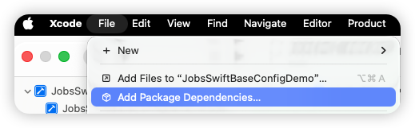
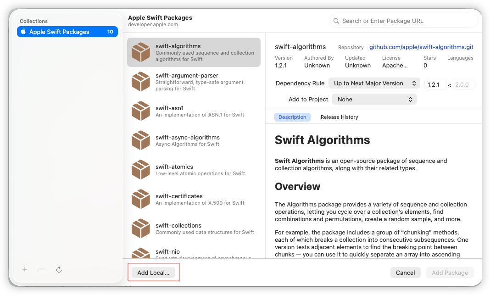
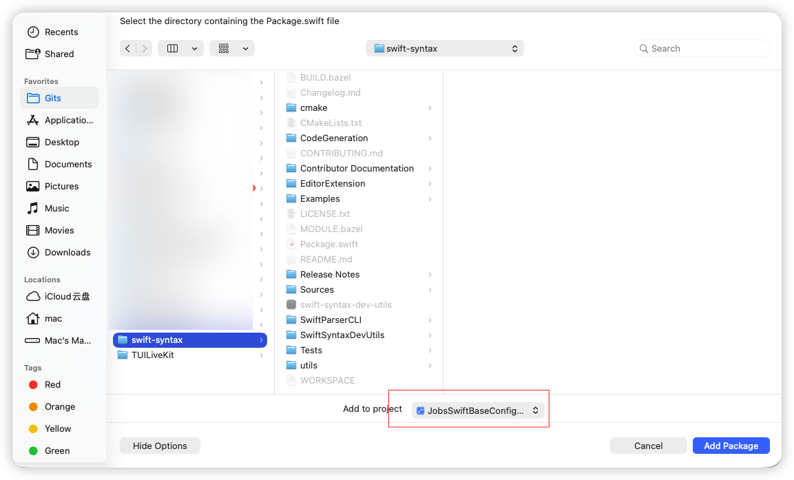
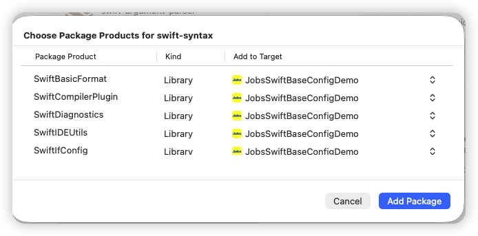
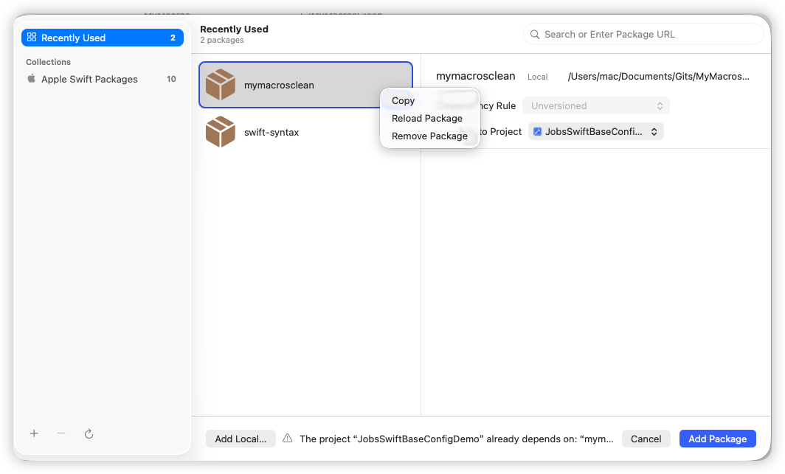
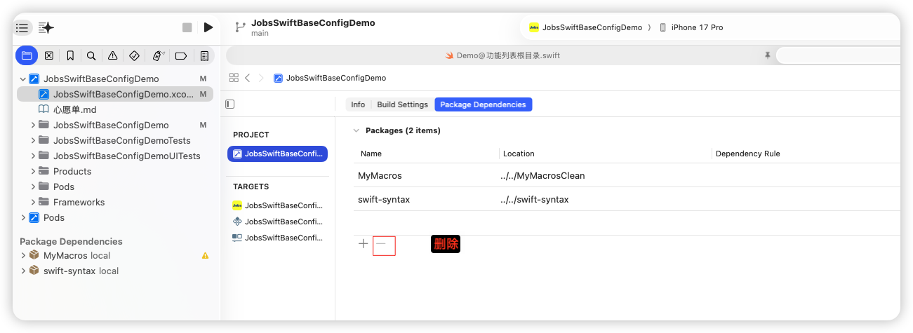
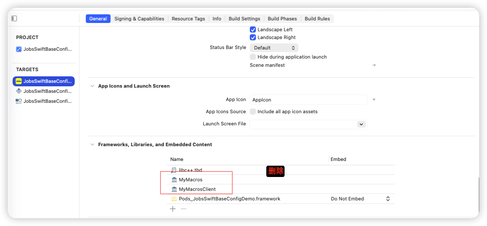

<iframe
  src="https://dragonir.github.io/3d/#/earth"
  title="Jobs出品，必属精品"
  width="100%"
  height="400"
  style="border:0; display:block;"
  allowfullscreen>
</iframe>

## 一、集成 <a href="#前言" style="font-size:17px; color:green;"><b>🔼</b></a> <a href="#🔚" style="font-size:17px; color:green;"><b>🔽</b></a>

* `Xcode` 👉 `File` 👉 `Add Package Dependencies`

  <table style="width:100%; table-layout:fixed;">
    <tr>
      <td></td>
      <td></td>
    </tr>
    <tr>
      <td></td>
      <td></td>
    </tr>
  </table>

## 二、删除（涉及到3处） <a href="#前言" style="font-size:17px; color:green;"><b>🔼</b></a> <a href="#🔚" style="font-size:17px; color:green;"><b>🔽</b></a>

* `Xcode` 👉 `File` 👉 `Add Package Dependencies`

  

* 工程`x.xcodeproj `👉 `PROJECT` 👉 `Package Dependencies`

  

* 工程`x.xcodeproj `👉 `TARGETS` 👉 `General `👉 `Frameworks,Libraries,and Embedded Content`

  

## 三、清理缓存 <a href="#前言" style="font-size:17px; color:green;"><b>🔼</b></a> <a href="#🔚" style="font-size:17px; color:green;"><b>🔽</b></a>

* 每一次修改由<font color=red>**S**</font>wift<font color=red>**P**</font>ackage<font color=red>**D**</font>ependence管理的第三方，都需要：Xcode ➤ File ➤ Packages ➤ Reset Package Caches ➤ Resolve Package Visions

## 四、编译 <a href="#前言" style="font-size:17px; color:green;"><b>🔼</b></a> <a href="#🔚" style="font-size:17px; color:green;"><b>🔽</b></a>

```shell
swift package reset
swift package resolve
swift build
```


<a id="🔚" href="#前言" style="font-size:17px; color:green; font-weight:bold;">我是有底线的➤点我回到首页</a>
