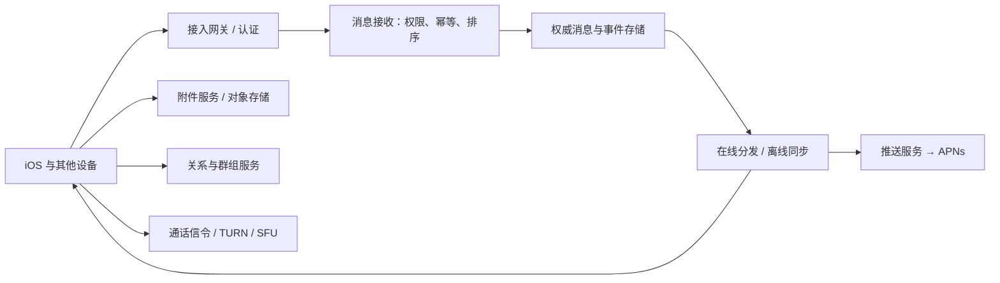
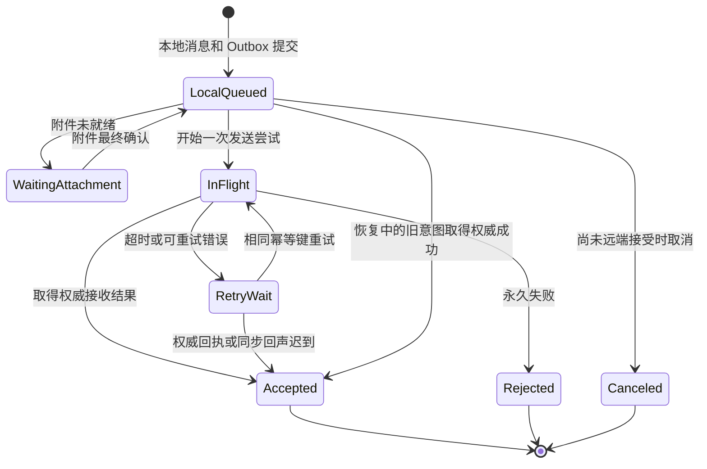

---

## 🔥 <font id=前言>前言</font>

> 面向有 iOS 开发基础、准备系统研究即时通讯的工程师。覆盖从产品语义、协议和客户端架构，到数据一致性、交互、多媒体、平台限制、安全、音视频通话及上线后的诊断。

<font color=red>**IM 是持续运行、会断线、会重试、会跨设备同步的消息系统。数据库只是其中一层。**</font> 研究目标是理解每项能力由谁负责、状态如何变化、失败后如何恢复，以及用什么实验验证。

**资料基线：2026-09-25。** 本文给出可实施的参考设计，不声称复刻任何商业产品内部架构。明确区分官方平台行为、本文设计方案、可运行 SQL 练习与尚未执行的系统实验。生产参数须在目标系统、设备、网络和具体 SDK 版本上确认。

**文档导航**

| 阅读入口 | 核心内容 |
| --- | --- |
| 本总册 | 完整技术地图、消息收发与多端同步、服务端契约、数据设计、工程流程、研究实验 |
| [连接管理与推送后台](./专题/iOS连接管理与推送后台.md) | 长连接、认证、心跳重连、前后台、APNs、通知扩展与冷启动 |
| [聊天界面与多媒体工程](./专题/聊天界面与多媒体工程.md) | 长列表、滚动锚点、键盘、富文本、图片语音视频、附件状态与缓存 |
| [安全加密与音视频通话](./专题/安全加密与音视频通话.md) | 威胁模型、密钥、多端加密、WebRTC、CallKit、群通话与弱网 |
| [消息入库架构与 SQL 专题](<../iOS IM消息入库架构与SQL面试手册.md/iOS IM消息入库架构与SQL面试手册.md>) | 批量入库、防丢、SQLite / WCDB、SQL 增删查改、已验证实验及原始面试题 |

**快速定位：** [架构](#architecture) · [协议](#protocol) · [发送](#lifecycle) · [同步](#sync) · [群聊](#domain) · [数据库](#storage) · [全文检索](#search) · [选型](#selection) · [压测诊断](#observability) · [研究路线](#research) · [综合 FAQ](#faq)。

## 一、<span id="scope">研究范围与能力地图</span>

### 1.1、完整 IM 客户端的交付面

| 领域 | 需要实现的能力 | 关键难点 |
| --- | --- | --- |
| 身份与设备 | 登录、续期、退出、设备管理、账号切换 | 旧账号异步任务污染新账号、凭证失效与设备撤销 |
| 关系与会话 | 联系人、好友、群组、频道、置顶、免打扰、草稿 | 服务端权限、局部状态与多端状态的归属 |
| 实时通信 | 建连、认证、心跳、重连、网络切换 | 半开连接、重连风暴、生命周期与电量 |
| 消息协议 | 文本、自定义、媒体、引用、回执、撤回、编辑 | 版本兼容、身份映射、未知类型与乱序事件 |
| 收发可靠性 | 待发队列、重试、去重、历史补拉、游标 | 成功定义、提交边界、重复与缺口 |
| 本地存储 | 消息、索引、事务、迁移、清理、备份 | 吞吐、耐久、锁竞争、跨进程与磁盘不足 |
| 多端同步 | 新设备初始化、增量同步、已读、离线追赶 | 状态收敛、游标过期、冲突解决 |
| 聊天交互 | 会话列表、长聊天列表、键盘、输入、引用定位 | 滚动稳定、Cell 复用、布局与异步资源 |
| 媒体与文件 | 拍摄、选择、录音、压缩、上传下载、缓存 | 跨文件和数据库事务、断点、权限、资源配额 |
| 系统集成 | APNs、通知点击、分享扩展、来电系统界面 | 后台不常驻、扩展资源约束、冷启动路由 |
| 安全隐私 | TLS、鉴权、密钥、加密、日志、内容权限 | E2EE 与多端、搜索、备份、通知的矛盾 |
| 音视频通话 | 邀请、接听、拒绝、媒体传输、多人房间 | 信令竞态、ICE、音频路由、弱网与功耗 |
| 工程治理 | SDK 边界、测试、埋点、灰度、回滚 | 故障可复现、旧版本互通、数据不可逆迁移 |

### 1.2、产品模型先于技术方案

先明确单聊、熟人群、客服会话、大群频道还是临时聊天室。不同模型决定消息保留、已读统计、成员权限和推送策略。例如十人群可以显示逐人已读，万人频道逐条携带成员回执列表通常代价过高。

定义目标设备、最低系统版本、账号同时在线设备数、消息峰值、历史量、最大附件、弱网目标和加密模式。不要先写“支持无限群成员”和“消息绝不丢失”，再让客户端填补没有定义的服务能力。

| 需求项 | 必须写清的条件 |
| --- | --- |
| 实时性 | 前台在线还是后台通知；端到端延迟从哪个事件计时 |
| 成功率 | 排除用户主动取消与权限拒绝后，仍要保留它们的独立计数 |
| 历史 | 保留多久、新成员能否看加入前内容、退出后是否保留 |
| 消息大小 | 文本字节上限、自定义包深度、附件上限与单批总量 |
| 已读 | 单设备、本账号任一设备、特定会话还是线程维度 |
| 撤回 | 谁能撤回、什么时限、哪些客户端副本可以被要求删除 |
| 多端 | 手机与桌面是否同时收、通知抑制、设备撤销后的效果 |

### 1.3、研究交付物

每个专题至少形成一份状态模型、一组接口契约、一个可复现实验和一张结果表。只完成聊天页面截图，不能证明断线恢复、幂等或多端一致性；只跑通 Socket，也不能证明客户端具备 IM 能力。

## 二、<span id="semantics">术语与可靠性语义</span>

### 2.1、核心概念

| 术语 | 简明定义 | 工程用途 |
| --- | --- | --- |
| Transport | 字节或帧的传输通道 | WebSocket、HTTP 或其他连接承载 |
| Envelope | 消息外层信封 | 类型、版本、路由、标识、加密元信息 |
| Event | 系统发生的事实 | 新消息、编辑、撤回、入群、已读 |
| Projection | 从事件整理出来的当前状态 | 聊天气泡、会话摘要、成员列表 |
| Outbox | 持久保存的待发操作 | 断网 / 崩溃后继续发送 |
| Inbox | 持久保存的待处理输入 | 接收和业务加工解耦 |
| Idempotency | 重复处理不重复产生业务效果 | 重试、重投、回执合并 |
| Cursor | 协议认可的同步位置 | 从断点继续同步 |
| Snapshot | 一个确定边界上的完整状态 | 新设备初始化、游标失效重建 |
| Tombstone | 保留删除事实的占位状态 | 避免旧数据重放后复活 |
| Backpressure | 下游忙时限制上游输入 | 队列、下载、解码和写库的内存上限 |
| Fan-out | 一份消息投递给多个目标 | 群聊、多设备和推送分发 |
| Convergence | 处理完相同有效事件后得到一致结果 | 多端和离线重放验证 |

### 2.2、发送成功必须拆成多个阶段

```text
本地操作已保存
  → 传输调用完成
  → 服务端已接受并满足其持久化契约
  → 接收方某设备已接收 / 已落库
  → 接收方账号已读
```

每个箭头都可能延迟、失败或丢回执。发送 API 返回不意味着对方已收到；系统通知呈现也不代表用户已读。

协议应为各阶段提供不同事件和状态。没有“对端持久化回执”能力时，UI 就不能显示这个含义的状态。群聊中的已送达 / 已读还需要明确成员集合及成员变动后的分母。[对应追问](#faq-status)

### 2.3、重复传输与唯一业务效果

网络超时后的真实结果可能未知。常见可实施设计是允许重试，通过稳定幂等键使服务端只接受一次业务操作，再让客户端重复应用也无害。去重窗口至少覆盖协议允许的重试与保留范围；窗口过短时，旧任务重试仍可能再生成一条消息。

“恰好一次”必须限定范围：数据库一次提交、服务端一次建消息、客户端一次通知，是不同保证。唯一索引不能单独保证从网络到所有用户设备的所有副作用恰好一次。

### 2.4、排序、时间与因果关系

客户端时间用于本地交互，服务端时间用于统一展示参考，顺序位置用于协议定义的会话排序。不要用时间戳同时充当唯一 ID、幂等键和同步游标。

同一 TCP 连接中的字节有序，不代表重连前后、多发送设备和历史补拉之间存在全局顺序。系统时钟可被用户调整；心跳与超时使用单调时间衡量经过时长，跨重启的重试时间需要持久时间和边界校验。

## 三、<span id="architecture">客户端总体架构</span>

### 3.1、按责任拆模块

```mermaid
flowchart TD
    UI["聊天 UI / 会话列表 / 系统入口"] --> API["IM 对外 API"]
    API --> CMD["命令处理：发送、已读、撤回、群操作"]
    CMD --> OUT["持久 Outbox"]
    OUT --> NET["连接与传输适配器"]
    NET --> IN["协议解码与事件校验"]
    PUSH["推送 / 冷启动 / 前台恢复"] --> SYNC["同步协调器"]
    SYNC --> NET
    IN --> REDUCE["事件合并与权限 / 版本规则"]
    REDUCE --> DB["存储事务：消息、状态、同步进度"]
    DB --> OBS["快照查询与变更订阅"]
    OBS --> UI
    CMD --> MEDIA["附件任务管理"]
    MEDIA --> OUT
    ACCOUNT["账号、设备、密钥作用域"] -.-> CMD
    ACCOUNT -.-> NET
    ACCOUNT -.-> DB
```



“协议解码”只把输入变成类型明确的事件；“事件合并”决定事件能否改变当前业务状态；“存储事务”保证相关修改共同提交。这三件事分开后，网络测试、状态测试和 SQL 测试才可以独立进行。

### 3.2、依赖与边界

| 模块 | 输入 → 输出 | 必须避免的耦合 |
| --- | --- | --- |
| AccountSession | 登录身份 → 有限生命周期的运行环境 | 全局单例连接永远绑定“当前用户”变量 |
| Transport | 请求包 → 回包 / 连接事件 | 直接修改聊天 Cell 或未读数 |
| SyncEngine | 服务器增量 → 事务批次 | 从每个页面各启动一条独立同步循环 |
| MessageReducer | 旧状态 + 事件 → 新状态 / 拒绝原因 | 内部任意发网络请求，导致重放不可预测 |
| MessageStore | 查询 / 修改命令 → 快照 / 提交结果 | UI 持有可跨线程修改的数据库游标 |
| OutboxWorker | 持久任务 → 尝试与权威结果 | 为一次重试生成新的业务消息 ID |
| AttachmentManager | 文件任务 → 可引用附件或失败状态 | 事务中做转码和大文件上传 |
| PresentationStore | 提交后快照 → 稳定 UI 模型 | 把临时数组当成消息唯一真相 |

### 3.3、单一写入口不等于所有工作串行

网络请求、解码、附件转码和图片处理可以按各自资源上限并发。需要顺序的是有业务依赖的状态转换和同库写事务。一个串行队列吞掉全部 CPU、网络和存储任务，同样会造成队头阻塞。

为 CPU、网络、存储设置独立的有界任务调度；为会话和同步流维护必要顺序。耗时 UI 预处理不占用写事务，数据库失败也不让主线程同步等待。

### 3.4、对外 API 要表达阶段与取消

```text
send(draft) → 稳定 local_id，表示本地操作已被接受
observeMessage(local_id) → 状态流：等待、发送中、服务端接受、失败
observeTimeline(conversation, window) → 不可变消息窗口与变更版本
loadEarlier(conversation, cursor) → 页结果及是否仍有历史
markRead(conversation, position) → 可重试的读状态操作
retry(local_id) / cancel(local_id) → 明确的状态转换结果
```

这些是接口语义示例，不是任何 SDK 的真实签名。取消订阅只停止观察；取消发送可能只是停止本地等待，远端已接受的消息需要独立撤回操作。错误要保留可重试性、错误域和用户可见原因。

## 四、<span id="protocol">消息模型与协议设计</span>

### 4.1、区分标识的作用域

| 标识 | 生命周期与用途 |
| --- | --- |
| `account_id` | 当前登录账号的存储与权限边界 |
| `device_id` | 服务端登记的设备身份；不要拿推送 Token 代替 |
| `session_generation` | 本地登录代次，防旧回调污染新会话 |
| `local_id` | 一条本地气泡的稳定身份，收到回执后仍可保持 |
| `client_message_id` | 一次发送意图的幂等标识，重试复用 |
| `server_message_id` | 服务端接受后的消息身份 |
| `request_id` | 一次网络尝试的关联标识，重试通常变化 |
| `event_id` | 编辑、撤回、回执等具体事件的去重身份 |
| `conversation_id` | 会话路由与权限范围 |
| `server_position` | 协议定义的排序位置，不一定是连续整数 |
| `sync_cursor` | 同步流断点，可为不透明字符串 |

服务端应明确幂等键包含账号、设备还是会话；客户端存储唯一约束必须与之匹配。不同用户碰巧生成相同请求 ID，不应跨账号误去重。

### 4.2、一个可讨论的消息信封

```json
{
  "protocol_version": 1,
  "event_type": "message.created",
  "event_id": "evt_01",
  "conversation_id": "conv_01",
  "server_message_id": "msg_01",
  "client_message_id": "draft_01",
  "sender_user_id": "user_01",
  "sender_device_id": "device_01",
  "server_position": "position_105",
  "server_time_ms": 1780000000000,
  "content_version": 1,
  "content": {"type": "text", "text": "你好"}
}
```

这是未加密教学消息，字段名没有跨协议通用性。账号身份由认证上下文确定，服务端不能信任客户端自填的发送者身份；客户端也不能把未经验证的回包直接视为已授权事实。

附件放引用和元信息，不能把每个大文件都塞进实时消息信封。E2EE 模式下，正文和部分元信息的加密范围重新定义，见 [安全专题](./专题/安全加密与音视频通话.md)。

### 4.3、编码与兼容

| 选择 | 优点 | 需要验证 |
| --- | --- | --- |
| JSON | 调试可读、跨语言接入直接 | 大整数精度、字段缺省、包体膨胀、嵌套深度 |
| Protocol Buffers | 明确字段编号和类型、二进制编码 | schema 演进、未知字段、枚举扩展、生成代码版本 |
| 自定义二进制 | 可针对固定目标优化 | 帧边界、长度溢出、演进和调试成本均由团队承担 |

[**Protocol Buffers**](https://protobuf.dev/programming-guides/proto3/) 删除字段后应保留相应编号 / 名称，不能复用编号表达另一个意思；JSON 与二进制编码的兼容行为也不能混为一谈。协议升级需要新旧端互发的黄金样本，而不只测试同版互通。

对未知类型保存最小可恢复信息，展示可理解的占位并允许升级后重新解析。未知消息是否计未读、是否阻断游标，要有协议规则；不能无限卡死整个同步流，也不能静默跳过必须执行的权限或密钥事件。

### 4.4、消息语义扩展

编辑是对同一消息的更新事件；撤回是保留删除事实；本地删除是本设备视图策略；转发通常创建新的消息身份。引用保存目标身份及必要快照，但不自动授予查看目标消息的权限。

表情回应按“消息 + 用户 + 表情 / 协议操作 ID”建模，不能每次重投都把数量加一。线程回复除父消息引用外，还需独立定义分页、未读及订阅范围。位置分享、卡片、投票、支付等自定义类型各自有生命周期，不能把有金融或权限后果的操作当成一段可随意重复执行的 JSON。

## 五、<span id="server">iOS 必须参与定义的服务端契约</span>

### 5.1、端到端系统地图



这是职责图，不要求每个方框部署成一个微服务。早期可以共用进程和数据库，仍需保留清晰契约。

### 5.2、接口评审清单

| 接口 | 服务端返回或承诺 | iOS 需要落实 |
| --- | --- | --- |
| 发送消息 | 幂等范围、保存承诺、服务端 ID、排序位置 | 持久保留发送意图，回执合并同一个气泡 |
| 增量同步 | 游标有效期、页边界、缺口、权限变化 | 数据与完成位置一致提交 |
| 拉历史 | 排序方向、快照 / 页游标、历史可见性 | 向前分页不覆盖实时流进度 |
| 已读 / 回执 | 单调合并规则、用户 / 设备 / 线程维度 | 降低上报频率，不重复累加 |
| 编辑 / 撤回 | 版本、权限、目标不存在时的行为 | 保存事件，支持目标迟到 |
| 群管理 | 成员状态版本、权限判定、历史策略 | 乐观 UI 回滚，迟到结果不恢复已撤销权限 |
| 设备管理 | 登记、撤销、单设备退出 / 全退出 | 清理对应连接、推送绑定及本地作用域 |
| 附件 | 上传会话、最终确认、访问授权、过期刷新 | 上传成功与消息成功分开处理 |
| 限流 | 错误类型、可重试条件、退避提示 | 有界退避，显示准确失败原因 |

### 5.3、群分发影响客户端协议

写扩散在接收时为目标维护投递记录，读扩散在读取时按权限取消息；混合策略可按群规模选择。客户端重点不是背名词，而是确认离线游标按用户、设备还是会话维护，成员变化如何影响历史可见性，以及回执和推送的聚合粒度。

服务端改变分发架构时，若游标语义变化，应有协议迁移。客户端不能靠遍历所有会话的最后一条消息来重建完整账号事件流，因为成员、已读、编辑和删除也会变化。

### 5.4、客户端不能独立补出的保证

单靠本地数据库不能证明远端已持久化、让已撤销设备彻底忘掉历史明文、保证 APNs 到达，或决定群成员最终权限。需要相应服务端或操作系统契约，并给 UI 明确的“未知、重试中、已失效”状态。

## 六、<span id="lifecycle">消息发送与接收的完整生命周期</span>

### 6.1、发送状态模型



这是“本地发送操作”的状态机。超时退避中，以及重启后恢复出的结果未知任务，都应接受可信的权威成功结果。图中的取消终态只适用于确认从未发往服务器的任务；已经尝试发送时，停止本地等待不能证明远端取消，仍要允许结果查询、成功合并或独立撤回。

对端已送达、已读、编辑、撤回属于其他状态维度，不建议用一个不断增长的枚举混装所有事实。[对应追问](#faq-status)

### 6.2、先保存意图，再异步执行

```text
用户点击发送
  → 校验文本 / 附件 / 会话权限的本地快照
  → 生成 local_id 和 client_message_id
  → 一个本地事务：写消息占位 + Outbox 操作
  → UI 显示稳定 local_id 的待发气泡
  → Worker 读取持久任务、执行发送
  → 权威回执 / 同步回声到达
  → 一个本地事务：合并 server_message_id、排序、状态，完成 Outbox
  → 合并刷新同一个气泡
```

本地权限校验用于及时反馈，服务端仍须最终鉴权。创建气泡与创建发送任务应保持原子关系，避免“有气泡永远不发送”或“发送成功却没有本地记录”。

### 6.3、回执与同步回声谁先到都成立

服务端回执可能先于广播，同步回声也可能先于发送请求的响应。用 `client_message_id` / 服务器提供的关联关系把两条路径汇到同一记录；用数据库唯一约束做最后防线，保留稳定 `local_id`。

超时只说明没有在时限内拿到结果，不证明服务器拒绝。可查询发送结果，或使用同一幂等键重试。迟到的失败回调不能把已经由回声确认的成功状态改成失败。

### 6.4、Outbox 不是一个无限循环数组

每个任务保存尝试次数、最近错误、下一次可尝试时间、依赖附件和当前运行代次。重启后恢复任务；账号退出或权限永久撤销时停止对应任务，并给出明确状态。

如果多个进程或 Worker 都可能消费，使用受数据库事务保护的领取机制，例如带到期时间的执行租约，并在更新结果时校验持有者 / 代次。进程死亡后租约可恢复，但两次网络尝试仍可能重叠，最终依赖服务端幂等。[对应追问](#faq-outbox)

### 6.5、接收与事件合并

```text
校验包体大小、协议版本和账号作用域
解析成新消息 / 编辑 / 撤回 / 已读 / 成员等事件
验证信封、身份凭据和可在事务外完成的静态真实性
取得写事务，校验同步前驱
在事务内重检实体版本、成员代次、因果前驱与合法状态转换
按 event_id 去重，按实体版本和业务状态合并
维护消息投影、摘要及可确定的未读状态
确认同步范围完成后更新游标
提交；成功后再发业务持久化确认与变更通知
```

依赖持久状态的校验不能只在事务外做一次，否则其他连接或事件可能在提交前改变状态。历史事件的授权依据其权威时点和证据判断，不能拿今天的群角色直接否定此前合法事件。

收到相同事件 ID、内容却不相同，应记录协议一致性异常；不能把数据矛盾全部解释为普通重投。坏包处理还要区分可忽略的未知展示类型与会影响权限、密钥或进度的关键事件。

### 6.6、事件合并规则要可重放

| 输入 | 合并规则示例 |
| --- | --- |
| 同一创建事件重复 | 不新增消息，不重复发本地通知 |
| 较旧的编辑事件 | 不覆盖较新内容 |
| 撤回先于创建 | 保存 tombstone，创建迟到时维持撤回 |
| 旧已读回执 | 不让已读位置倒退 |
| 历史消息晚到 | 插入历史位置，摘要不退回旧消息 |
| 不同事件给出相同版本却内容冲突 | 以协议冲突处理，必要时重取权威状态 |

版本大小只是必要条件之一。撤回后是否允许恢复、重新入群能否恢复历史、谁能编辑，都需要状态机与权限规则；不能统一写成“版本大就覆盖”。

## 七、<span id="sync">离线同步、多端与状态收敛</span>

### 7.1、首次登录的快照与增量衔接

新设备初始化需要取得某个明确边界上的会话、成员、已读及必要历史快照，再从该边界追增量。若快照期间继续有新消息，协议要提供快照游标或等效的一致性桥梁，避免快照与增量之间形成空窗。

先展示已取得的本地窗口和同步状态，逐步补历史。历史未完整、读状态未初始化时，不把 `0` 当成权威未读位置，也不把本地消息条数当成服务端总数。

### 7.2、增量同步与历史分页是两条进度

实时同步游标回答“系统变化处理到了哪里”；向前翻页游标回答“这个会话更早的历史取到了哪里”。上滑聊天记录不能把账号增量同步进度往回改。

协议可能让增量流包含已读、成员、编辑和撤回；会话中最大的消息顺序号不能替代这些状态的进度。可参考 [Matrix 同步与事务标识设计](https://spec.matrix.org/v1.16/client-server-api/#syncing) 理解不透明游标与增量，但自建协议必须明确自己的保证，不能直接套字段名。

### 7.3、分页提交与幂等重放

如果一页太大，可以先分批保存事件，只在整页对应范围可靠处理后推进页游标。中途退出后从旧页重新拉，已处理事件由幂等机制吸收。必要时持久化页内进度，但它与服务器页 token 的有效期和稳定性须匹配。

取得写事务后校验当前进度等于该批预期前驱，再原子提交状态和新游标。主进程与扩展并发时，事务外检查会产生检查与使用之间的竞态。[数据库练习](#storage)

### 7.4、缺口和游标失效

缺口不是简单的“最大顺序号减一”。协议若保证连续序列，可持久记录缺失区间并补洞；若序列允许过滤、权限隐藏或非消息事件，就需要服务端返回范围完成标记。

游标过期时进入可恢复的重建流程：暂停依赖旧进度的提交，保存本地待发及其他不可再生数据，取得新快照，再续接增量。不能直接删库重建而把尚未发出的文本和附件一起删除。

### 7.5、多设备状态归属

| 状态 | 常见归属选择 | 合并重点 |
| --- | --- | --- |
| 消息正文、成员权限 | 服务端权威事件 | 按权限和版本合并 |
| 已读位置 | 账号级或设备级，须产品确认 | 单调推进，线程维度明确 |
| 手动标未读 | 单独的用户意图 | 不强行把真实已读位置向后移动 |
| 草稿 | 本地或多端 | 多端同时编辑要有冲突策略 |
| 置顶、免打扰、会话归档 | 账号同步或设备偏好 | 明确可覆盖字段及修订版本 |
| 滚动位置、输入焦点 | 设备 / 页面 | 通常不作为跨设备实时状态 |
| 推送设置与设备 Token | 设备 + 环境 | 退出和切换账号解绑 |

草稿可以使用服务端修订号加条件更新；冲突时保留两个版本让用户选择，或明确最后提交者获胜。不要仅靠不可信客户端时间决定谁覆盖谁。真正需要多人同时编辑文本时，再研究 OT / CRDT，而不是为所有 IM 状态引入复杂合并算法。

### 7.6、在线状态与正在输入属于短暂状态

在线状态是带有效期的服务端推断，不是某台手机一条连接的永恒事实。多设备汇总还需定义“任一设备在线”和“正在当前会话活动”的区别。

正在输入事件采用节流、过期时间及停止信号，丢失一次通常允许由超时消失。它不应像业务消息一样永久重放并积压离线队列，否则重连后可能显示“昨天正在输入”。

### 7.7、收敛实验

为同一组合法事件生成不同到达顺序、重复次数和分批方式，在协议允许乱序的范围内运行。最后比较规范化的消息投影、成员、已读和 tombstone；临时请求 ID、观测时间和本地 UI 缓存不参与比较。

存在明确因果前驱的事件先缓冲或补依赖，不能为了让排列实验通过而忽略权限。测试应证明“同一组可应用事件最终一致”，不声称非法事件排列也必须成功。

## 八、<span id="domain">联系人、会话、群组与业务能力</span>

### 8.1、联系人和关系

区分用户资料、好友关系、黑名单和设备通讯录。昵称变更不应重写每一条历史消息；消息中需要的发送者展示快照与当前用户资料分开保存。通讯录匹配涉及权限与最小化上传，功能应能在拒绝授权时继续运行。

好友申请、同意、删除和拉黑用明确操作 ID 与关系版本。拉黑后是否隐藏历史、禁止发消息、抑制推送，由服务端策略决定；客户端只隐藏按钮不构成权限控制。

### 8.2、会话列表的派生状态

会话摘要由最近可展示事件、草稿、发送状态及提示规则共同决定；“最近一条消息”不一定就是列表显示内容。置顶排序、草稿提示、免打扰标识与最后活动时间要有确定的比较规则和稳定的第二排序键。

删除会话入口需要区分归档、隐藏、清本地历史、清多端历史、退出群聊。新消息到达是否重新出现也应是产品规则，而不是数据库删表后的偶然行为。

### 8.3、群成员、角色与权限

成员实体包含加入状态、角色和版本；群资料包含群名、公告、禁言及历史可见性。成员列表使用分页和增量，不为大群每次打开都全量拉取。

踢人和发消息并发时，以服务端的授权时点与事件顺序判定。被踢的客户端收到迟到成功响应，不能自动恢复成员资格；重新加入应采用新的有效成员状态，必要时区分成员关系代次。

### 8.4、群回执与未读

为小群提供逐人回执时，定义统计对应发送时成员、当前成员还是实际可接收成员；退群、拉黑和无历史权限会改变含义。大群可用摘要计数、用户已读水位和按需详情，避免每条消息附带完整成员状态。

@提及、全部提及、普通未读和线程未读可以是不同计数。未同步完整时保留未知 / 估计状态；恢复后与服务器权威结果对账，不能让计数只增不减。

### 8.5、消息菜单与扩展业务

| 能力 | 必须补齐的业务规则 |
| --- | --- |
| 回复 / 引用 | 原消息被删或没有权限时的占位与定位 |
| 转发 / 合并转发 | 新身份、原始来源可见性、附件权限 |
| 收藏 | 本地还是账号级，原消息失效后是否保留 |
| 编辑 / 撤回 | 操作者、时限、版本、离线端回放 |
| 表情回应 | 添加和撤销的幂等键、人数与成员可见性 |
| 投票 | 单选 / 多选、截止、撤票、服务端唯一性 |
| 定时消息 | 服务端计划还是本地尽力执行；iOS 不能保证任意时间唤醒 |
| 阅后即焚 | 计时起点、服务端时限、多端同步、不能保证对方没有复制 |
| 举报 / 屏蔽 | 用户反馈入口、证据最小化、权限与服务器处理结果 |

## 九、<span id="storage">数据库、持久任务与迁移</span>

### 9.1、从业务不变量推导表结构

| 数据集合 | 主要键和索引 | 需要共同维护的状态 |
| --- | --- | --- |
| 消息 | 稳定本地 ID；按协议作用域约束客户端 / 服务端 ID；会话顺序索引 | 正文版本、发送结果、撤回标记 |
| 事件去重 | 同步流 / 账号 + event_id | 已应用状态及保留边界 |
| 会话 | 账号 + conversation_id；置顶及活动排序 | 摘要、已读位置、未读初始化状态 |
| Outbox | 账号 + operation_id；待执行状态和时间 | 依赖、重试、执行租约、权威完成结果 |
| 附件任务 | 账号 + attachment_id / upload_id | 文件路径、大小、校验值、服务端确认与引用 |
| 同步检查点 | 账号 + 同步流 | 游标、快照代次、页内状态 |
| 成员和关系 | 账号 + 群 / 对方用户 | 角色、成员代次、版本和权限 |
| Tombstone | 实体身份或事件身份 | 撤回 / 删除版本、保留时限 |
| 搜索索引 | 消息 ID 映射 | 与正文、删除和权限状态保持一致 |

表数不固定；同一表也可以承载多类记录。关键是为每次状态转换确定事务边界，避免“消息成功但发送任务永远未完成”这样的半状态。

在模型层区分协议信封、数据库记录和 UI 模型。网络字段可缺省、数据库字段有约束，UI 还包含本地布局与状态，直接共用一个巨大可变对象会把生命周期绑在一起。

### 9.2、数据库选型的判断顺序

先确定查询、事务、迁移、线程和加密需求，再比较 [**SQLite**](https://sqlite.org/)、[**WCDB**](https://github.com/Tencent/wcdb) 或 [**GRDB**](https://github.com/groue/GRDB.swift) 的具体版本能力。使用对象映射不免除理解 SQL、索引、WAL 和错误传播的责任，直接使用 C API 也不自动更快。

关系数据可以用复合索引和事务维护；正文保留结构化 payload 时，常查字段仍可单独建列，避免每次列表查询都解析整段 JSON。巨大的附件与可重建缓存需要独立配额，不必和所有消息记录捆在一起。

完整建表、插入、更新、查询、清理和查询计划实验见 [SQL 专题](<../iOS IM消息入库架构与SQL面试手册.md/iOS IM消息入库架构与SQL面试手册.md#sql>)。其中服务端 ID 与 seq 的约束是假设，不应未经修改直接用来存待发送消息。

### 9.3、游标条件更新的小实验

CAS（Compare-And-Set，比较后设置）只在当前值等于预期值时更新。以下三个代码块依次运行在同一练习数据库；它们只演示进度竞争，不是完整的业务提交实现。

```sql
CREATE TABLE sync_checkpoint (
    account_id TEXT NOT NULL,
    stream_id TEXT NOT NULL,
    cursor TEXT NOT NULL,
    PRIMARY KEY (account_id, stream_id)
);
INSERT INTO sync_checkpoint VALUES ('a1', 'events', 'C0');
```

第一次完成从 `C0` 到 `C1` 的转换，应返回 `advanced=1`：

```sql
BEGIN IMMEDIATE;
UPDATE sync_checkpoint
SET cursor = 'C1'
WHERE account_id = 'a1' AND stream_id = 'events' AND cursor = 'C0';
SELECT changes() AS advanced;
COMMIT;
```

另一个持有旧前驱 `C0` 的任务不能覆盖新进度，应返回 `advanced=0`，游标仍为 `C1`：

```sql
BEGIN IMMEDIATE;
UPDATE sync_checkpoint
SET cursor = 'STALE_PAGE'
WHERE account_id = 'a1' AND stream_id = 'events' AND cursor = 'C0';
SELECT changes() AS advanced;
ROLLBACK;
SELECT cursor FROM sync_checkpoint
WHERE account_id = 'a1' AND stream_id = 'events';
```

实际同步中，取得写事务后先验证前驱，再处理事件和推进游标；或将条件更新与事件修改置于同一事务，并在影响行数不符时显式回滚。示例里的固定 SQL 不会替应用自动判断成功分支。`changes()` 必须紧跟目标修改、使用同一个连接。[SQLite 事务](https://sqlite.org/lang_transaction.html)、[SQLite changes](https://sqlite.org/c3ref/changes.html)

### 9.4、历史保留、清理与备份

把数据分为三类：不可再生的本地输入、服务端可重新获取的数据、可重新生成的索引 / 缩略图。清缓存和游标重建首先处理后两类，保留待发文本、未上传附件及尚未完成的本地操作。

清理消息前核对是否仍被引用、是否可能重投、tombstone 是否需要保留，以及搜索索引与附件引用是否需要同步调整。文件垃圾回收可以使用“记录引用 → 宽限期 → 再次确认 → 删除”的过程，降低文件和数据库无法同事务提交带来的风险。

打开状态下备份 SQLite 使用受支持的备份能力，不单独复制 `.db` 并遗漏 WAL。恢复后校验账号、schema、密钥及同步代次，再恢复 Worker；过期网络任务可能需要重新验证服务端状态。[SQLite Backup API](https://sqlite.org/backup.html)

### 9.5、schema 迁移与故障恢复

迁移记录独立版本，按已测试路径升级。新增字段可先让旧代码仍能读取，后续后台分批回填，再切换读路径；添加约束和索引前先查存量冲突和空间预算。

大表重建要估算临时空间、取消 / 中断后的恢复方式和数据库锁时间。App 与扩展使用相同数据库时必须协调迁移所有者，不能两个进程各自判断“需要升级”后同时执行。

`PRAGMA user_version` 可以承载应用的 schema 版本，但 SQLite 不会替应用实现迁移流程；`ALTER TABLE` 支持范围也要按实际运行版本核对。破坏性 schema 变更后，旧二进制未必能直接回滚使用新库。[SQLite PRAGMA](https://sqlite.org/pragma.html#pragma_user_version)、[ALTER TABLE](https://sqlite.org/lang_altertable.html)

数据库无法打开或校验异常时，先区分密钥错误、版本不兼容、权限、空间不足和真实损坏。不要自动删库“修复”并丢掉未发送内容。

## 十、<span id="search">历史查询与全文检索</span>

### 10.1、三种查询服务不同场景

聊天窗口按稳定排序键分页；消息定位按消息身份直接查找或向服务端请求周围窗口；全文搜索按词项索引匹配，再回到消息权限和正文状态做校验。三种查询不能全部靠一条 `LIKE '%keyword%'` 承担。

点击搜索结果时，目标消息可能已被删除或失去访问权限。先解析目标身份，再加载包含它的窗口；没有本地记录不意味着可以直接构造一个没有权限来源的气泡。

### 10.2、FTS5 最小例子

[**FTS5**](https://sqlite.org/fts5.html) 是 SQLite 的全文检索扩展，需要确认实际库包含该能力。下面用英文单词隔离验证索引与账号过滤；不把它当作中文分词质量测试。

```sql
CREATE VIRTUAL TABLE message_search USING fts5(
    account_id UNINDEXED,
    conversation_id UNINDEXED,
    message_id UNINDEXED,
    body
);
INSERT INTO message_search VALUES ('a1', 'c1', 'm1', 'database transaction');
INSERT INTO message_search VALUES ('a2', 'c2', 'm2', 'database privacy');
SELECT message_id
FROM message_search
WHERE message_search MATCH 'database' AND account_id = 'a1'
ORDER BY rank;
```

预期仅返回 `m1`。`UNINDEXED` 表示该列不进入全文索引，不代表删除该列或获得权限隔离；账号与访问权限条件仍须强制加入。实际调用绑定查询参数，普通搜索输入还应按 FTS 查询语法转义或构造，不能把绑定参数误认为已经禁用了搜索运算符。

### 10.3、中文、混合文本与索引一致性

分词质量要用中文短句、英文词、表情、手机号、链接及中英混排样本验收。Unicode token 切分不等于中文语义分词；子串索引与分词索引的空间、召回和短词表现不同，按目标检索方式测试。

正文编辑、撤回、账号退出和权限变化都影响索引。可以在同事务维护索引，也可以持久记录索引任务并暴露索引进度；后者需要处理搜索短暂落后的情况。外部内容 FTS 表不会自动保持与正文一致，历史回填和触发器规则需单独实现。[FTS5 外部内容表](https://sqlite.org/fts5.html#external_content_tables)

### 10.4、本地、远端与加密搜索

本地搜索只能覆盖已保存、可解密、已建立索引的内容；服务端搜索则取决于历史权限和服务端能看到的数据。两种结果合并按消息 ID 去重并标记来源，不宣称本地结果就是完整历史。

E2EE 下，服务端通常无法直接对明文正文索引；本地解密后建索引会产生另一份敏感数据，需要相同账号与存储保护、退出清理及备份策略。不要为搜索便利悄悄破坏既定加密边界。

## 十一、<span id="concurrency">并发、生命周期与账号隔离</span>

### 11.1、把可取消任务归到明确作用域

| 作用域 | 存活范围 | 常见任务 |
| --- | --- | --- |
| App 运行 | 当前进程 | 系统回调分发、公共诊断 |
| 登录会话 | 某账号的一次登录 | 连接、同步、Outbox、密钥会话 |
| 会话页面 | 当前聊天页 | 可见窗口订阅、输入状态、预取 |
| Cell 配置 | 同一稳定 ID 的一次配置 | 缩略图、布局、媒体加载 |
| 持久业务任务 | 允许跨启动恢复 | 未发消息、上传与待处理事件 |

页面销毁要取消页面观察，不应取消已经被用户提交的持久消息发送；退出账号应停止旧账号 Worker。每个异步结果在落库和发布前验证账号代次，页面结果另外验证窗口 / 配置版本。

### 11.2、Swift 并发不会替代业务原子性

[**Swift**](https://www.swift.org/) 的 <font color=red>**actor**</font> 隔离可变状态，但在 <font color=red>**await**</font> 处可能允许其他任务进入。把“检查当前账号 → 等网络 → 写当前账号数据库”放在同一个 actor 方法内，仍需要在恢复后重新验证账号代次。

<font color=red>**async**</font> 不是“必在后台线程”，<font color=red>**Task**</font> 也不自动提供线程安全或数据库事务。主线程隔离的 UI 更新、同步数据库工作及 CPU 密集转换应按执行环境分开设计。[Swift 并发语言指南](https://docs.swift.org/swift-book/documentation/the-swift-programming-language/concurrency/)

### 11.3、事件流、订阅与合并

观察 API 应提供初始快照或明确的订阅起点，避免“先查快照、再订阅”期间漏掉变化。更新按账号、会话、实体 ID 聚合，UI 可在短窗口内合并多个提交通知，再读取对应快照。

取消订阅后释放闭包、观察 token 和媒体任务；避免数据库连接、业务单例和控制器互相强持有。对过慢消费者设置缓冲上限：UI 可以只保留最新快照，关键业务事件则不能无声丢弃。

## 十二、<span id="connection">连接、推送与系统入口</span>

### 12.1、前台实时与后台恢复共同设计

前台连接用于低延迟事件，增量同步用于收敛状态，APNs 用于系统允许条件下的提醒或唤醒。它们进入同一身份和去重体系，不能三个入口各插一次消息。

系统挂起后不承诺普通聊天 Socket 永久运行。重新进入前台时检查会话、认证和同步进度；连接恢复成功也要补齐离线期间的变化，而不是仅把图标改成绿色。

### 12.2、实现与验收入口

[连接管理与推送后台专题](./专题/iOS连接管理与推送后台.md) 详细说明协议选择、收包循环、状态机、认证刷新、心跳重连、APNs、通知扩展和冷启动路由。

本领域验收应至少覆盖：服务端可达性误判、Wi-Fi 与蜂窝切换、旧连接回调、Token 过期、账号切换、通知先于同步、点击通知时尚未登录，以及静默推送未执行后的正常恢复。[对应追问](#faq-background)

## 十三、<span id="interaction">聊天 UI、输入与媒体</span>

### 13.1、界面是状态投影

气泡展示身份、发送状态、编辑 / 撤回状态与附件进度；会话列表展示摘要、草稿、排序和未读。它们读取同一个业务状态，但不必共享同一份可变 ViewModel。

聊天页需要保存稳定消息 ID 和窗口，不应一次加载全部历史。输入草稿、键盘状态和滚动位置属于交互状态，消息发送和上传属于业务状态；切换页面时按各自生命周期处理。

### 13.2、关键工程路径

[聊天界面与多媒体工程专题](./专题/聊天界面与多媒体工程.md) 展开长列表、稳定滚动、键盘、富文本、无障碍、异步复用、图片、录音、视频、上传下载及缓存。

验收时将“持续新消息 + 顶部分页 + 键盘拖动 + 大图尺寸变化 + 字体放大”组合起来测试。单独滚动一页静态文本通过，不代表真实聊天页稳定。[对应追问](#faq-scroll)

## 十四、<span id="security">安全与隐私作为系统约束</span>

### 14.1、先写清各方能看到什么

| 保护目标 | 对应设计 |
| --- | --- |
| 传输链路不被普通旁路读取 / 篡改 | TLS、服务端身份校验 |
| 服务端不掌握消息明文 | E2EE 协议与端设备密钥管理 |
| 本机文件不轻易泄露 | 平台文件保护、密钥存储、必要的数据库加密 |
| 退出后不串账号 | 文件、缓存、连接、任务与通知绑定隔离 |
| 诊断不泄露会话 | 脱敏日志、受控采样与保留策略 |

这些目标互不等价。是否要求 E2EE，会直接影响群成员变更、设备新增、备份、搜索、举报与通知预览，而不是加一个“加密开关”即可完成。

### 14.2、安全研究入口

[安全加密与音视频通话专题](./专题/安全加密与音视频通话.md) 给出威胁模型、协议边界和验证路线。采用成熟、持续维护的协议实现，关键变更需要专门审查；不要自行拼接算法声称形成安全 IM 协议。

## 十五、<span id="calls">音视频通话与 IM 的衔接</span>

### 15.1、通话是独立状态机

消息系统传递邀请、接听、拒绝、挂断和会议状态；媒体系统负责音视频采集、编码、网络传输、拥塞与播放。已经发出邀请不等于媒体已建立，媒体暂时断流也不必立即当作远端挂断。

每次呼叫有稳定 call_id、参与设备身份、有效期和当前状态版本。多端同时响铃时，由协议确定哪一个接听获胜，其余设备结束对应呼叫；迟到接听和重复挂断必须幂等。

### 15.2、专题与验收

[安全加密与音视频通话专题](./专题/安全加密与音视频通话.md) 展开 WebRTC、ICE / STUN / TURN、SFU、CallKit、PushKit、音频路由和弱网。

将“锁屏来电、多个设备同时接听、耳机拔出、系统通话中断、切网、重新协商、相机权限拒绝、结束后资源释放”纳入同一呼叫链路测试，而不是只验证两台前台设备互相出画面。

## 十六、<span id="selection">自建、开源协议与商业 SDK 选型</span>

### 16.1、先选择承担的责任范围

| 路线 | 可以获得 | 仍由团队承担 |
| --- | --- | --- |
| 自建协议与服务 | 对身份、数据、功能和运维的控制 | 客户端 SDK、服务端、推送、可靠性、安全与运维全链路 |
| 采用开源协议与实现 | 可研究的协议与代码、一定互操作基础 | 部署、升级、协议取舍、界面整合及安全运营 |
| 商业 IM SDK / 服务 | 已封装的核心能力与服务支持 | 产品语义、数据策略、UI、接入边界、成本与供应商依赖 |
| 混合方案 | 按需使用消息、RTC 或存储模块 | 多套身份、故障域、状态和计费之间的整合 |

评价不只看“发一条消息需要几行代码”。做一张验证矩阵，把历史可导出性、幂等、游标、群规模、加密、多端、扩展、可观测性和版本迁移逐项映射到实际 API 或实验结果。

### 16.2、候选方案的可核验问题

1、SDK 是否自己管理数据库，业务能否安全观察，是否允许直接写它的内部表。

2、账号切换、单设备退出和 Token 刷新如何完成，是否有旧回调隔离。

3、发送取消、超时、重试、上传完成的状态语义是否有文档。

4、原始消息能否导出、迁移，导出的编辑、撤回、附件与加密历史是否完整。

5、服务端故障、配额、账号封禁和推送失败能否区分，是否能取得端到端诊断信息。

6、依赖是否覆盖目标系统、架构、语言和扩展；升级是否需要迁移库或改变协议。

7、价格按用户、峰值连接、消息、存储还是流量计算；对比采用实际合同和当前官方说明，不记录长期不变的价格假设。

### 16.3、封装边界

应用业务层可以依赖自己的有限 IM 接口，用适配器对接 SDK。不要为了“以后可随时替换”抹平供应商独有的游标、密钥和状态语义；可替换性需要保存足够的业务身份与数据迁移能力。

数据库、会话恢复、业务命令和 UI 模型各有归属；如果第三方 SDK 已持有核心状态，不另外创建一套会与它竞争的消息真相库。需要缓存时明确它是可重建投影、更新来自哪里以及失效规则。

### 16.4、iOS SDK 的工程交付

按公共接口、领域模型、存储、网络、媒体、平台适配和 UI 组件分模块。核心模块避免依赖页面控制器；公开 API 的线程、取消、错误和账号作用域要写清楚。

在 [**Swift**](https://www.swift.org/) 与 [**Objective-C**](https://developer.apple.com/library/archive/documentation/Cocoa/Conceptual/ProgrammingWithObjectiveC/Introduction/Introduction.html) 混用工程中，先确定公共模型和并发 API 的桥接面，再选择源码包或二进制分发。核对资源包、符号、最低部署目标、依赖版本、许可与隐私说明，按实际 SDK 版本验证；封装形式不替代消息正确性测试。

## 十七、<span id="observability">性能、容量与可观测性</span>

### 17.1、分段观测一次消息操作

```text
点击发送
  t0 本地意图接受
  t1 Outbox 提交
  t2 发送尝试开始
  t3 服务端接受结果到达
  t4 接收端事件到达
  t5 接收端数据库提交
  t6 接收端可见窗口呈现
```

同设备阶段可以用单调时钟求差；跨设备不能直接拿未校准墙钟相减。端到端链路需要关联 ID 和时钟策略，或者分别报告各设备阶段延迟与服务端处理时间。

为每次用户意图保留稳定 operation ID，为每次尝试生成 attempt ID；HTTP 链路可按 [W3C Trace Context](https://www.w3.org/TR/trace-context/) 传播追踪上下文。追踪 ID 不承载正文、Token 或可直接识别用户的资料。

### 17.2、指标定义要避免误导

| 指标 | 定义及边界 |
| --- | --- |
| 本地接受耗时 | 点击到本地事务提交，体现用户操作能否立即可靠保存 |
| 服务端接受延迟 | 发送意图到协议定义的接受结果；明确是否包含离线等待 |
| 前台消息可见延迟 | 符合在线条件的消息从接收到可见提交的分位数 |
| 发送成功率 | 在规定时间窗内取得权威成功的有效发送意图数 / 有效发送意图数 |
| 待发积压 | 数量、总字节、最老任务年龄，区分离线与异常卡住 |
| 同步落后 | 可比较的服务端水位差，或最后成功同步年龄；不对不透明游标做减法 |
| 去重 / 冲突 | 正常重复、内容矛盾和权限拒绝分别统计 |
| 资源 | 主线程卡顿、峰值内存、CPU、写入量、缓存和 WAL、能耗 |
| RTC 质量 | 入会耗时、RTT、丢包、抖动、码率、冻结和音频中断 |

超时与仍未完成的消息不能从延迟报告中悄悄删除，否则只统计成功样本会显得异常快。重试按用户意图统计成功率，按尝试统计网络成本，两者不混用。

### 17.3、容量与背压的计算

若输入持续速率为 `λ`，处理持续速率为 `μ`，且 `λ > μ`，积压约以 `λ - μ` 增长；单纯增大队列只能延后耗尽。持续过载不能假设有有限稳态。稳定条件下可用 Little 定律 `L = λ × W` 估算平均在途任务量，其中 `L`、到达率 `λ` 和平均停留时间 `W` 必须采用同一系统边界；只算等待队列时，停留时间也只算等待。突发、长尾和字节差异仍需单独测量。[Little 原始论文](https://fisherp.scripts.mit.edu/wordpress/wp-content/uploads/2015/11/ContentServer.pdf)

例如输入 400 条/秒、落库 300 条/秒，10 秒可能净增约 1,000 条；若每条解码对象远大于网络包，内存压力还会被放大。这只是算术示例，不是 iOS 性能基准。

设定消息、字节、并发任务和最老年龄上限，触发降速、暂停补拉或服务端流控。高优先级消息不能无限绕过低优先级队列，否则历史永远不能完成；调度需兼顾公平性。

### 17.4、定位链路而不是猜瓶颈

用 [**Xcode**](https://developer.apple.com/xcode/) 的 Instruments 和应用区间埋点观察 CPU、内存、锁等待、磁盘及渲染。线上可使用 [**MetricKit**](https://developer.apple.com/documentation/metrickit) 的设备性能与诊断报告补充崩溃、卡顿等信息；系统聚合报告不能替代逐消息业务链路。

| 现象 | 排查顺序 |
| --- | --- |
| 重连后消息显示慢 | 认证 → 补拉 → 解码 → 排队 → 提交 → UI |
| 消息成功但列表未出现 | ID 合并 → 快照订阅 → 账号 / 窗口过滤 → diff |
| 字幕 / 文本很多时卡 | 富文本解析 → 布局测量 → 主线程转换 → 缓存命中 |
| 图片多时内存飙升 | 原图解码尺寸 → 并发 → Cell 持有 → 缓存配额 |
| 电量异常 | 过密心跳 → 重连重试 → 常驻解码 → 重复媒体下载 |
| 未读数漂移 | 读状态初始化 → 重复事件 → 撤回 → 多端合并 → 权限过滤 |

### 17.5、日志的最小必要信息

记录操作阶段、错误域、尝试次数、批量大小、匿名关联 ID、版本与耗时。对正文、联系方式、附件签名 URL、Token 和密钥采用不记录策略，不能仅依赖事后字符串替换。

Apple 的统一日志提供隐私标记，但整数等数据并不天然都被隐藏；自建文件日志、崩溃附加信息和网络代理导出也要单独审计。匿名化或哈希不自动等于不可关联。[Apple 日志与隐私](https://developer.apple.com/documentation/os/generating-log-messages-from-your-code)

## 十八、<span id="testing">测试体系与故障注入</span>

### 18.1、分层搭建测试工具

| 层级 | 测试工具与输入 | 主要证明 |
| --- | --- | --- |
| 协议 | 固定合法 / 非法消息包、旧版本样本 | 解析、限制、未知字段兼容 |
| 状态 | 可控事件序列、虚拟时钟、重复与乱序生成 | 幂等、单调状态、权限和因果规则 |
| 存储 | 临时数据库、事务失败、真实索引 | 原子性、查询、迁移与约束 |
| 传输 | 可控假服务端或传输适配器 | 延迟、断开、丢响应、认证续期 |
| UI | 稳定消息样本、字体 / 语言 / 尺寸组合 | 滚动、复用、可访问性、交互 |
| 集成 | 两台以上真机、测试服务器、多个账号 | 多端、通知、切网、后台、RTC |
| 长稳 | 持续收发和周期性故障 | 泄漏、缓存膨胀、重试风暴、恢复完成 |

假服务端必须能控制“已经接受消息，但响应丢失”，不能把网络失败一律模拟成服务器没有收到。这一个故障点能暴露大量重复发送和状态倒退问题。

### 18.2、必须覆盖的故障矩阵

| 注入位置 | 操作 | 预期不变量 |
| --- | --- | --- |
| 保存发送意图之前 | 本地写入失败 | 不声称已可靠接受，不触发孤立发送 |
| 本地提交后、网络前 | 终止进程 | 重启存在同一个待发意图 |
| 服务端接受后、回执前 | 丢响应并超时 | 同幂等键重试不生成第二条消息 |
| 回声后、失败回调前 | 延迟旧失败回调 | 成功不退回失败 |
| 接收事务中 | 约束失败或进程终止 | 无半批投影和超前游标 |
| 编辑 / 撤回链 | 乱序与重复 | 旧内容不覆盖新状态，不复活 |
| 快照与增量之间 | 持续发送新消息 | 没有同步空窗 |
| 账号退出后 | 放行旧连接 / 上传回调 | 不写入或刷新新账号 |
| 扩展与主 App | 同时请求写入 / 迁移 | 有协调与可恢复的锁等待 |
| 附件成功、消息失败 | 重试及清理 | 文件可复用，未引用对象最终可回收 |
| 新设备读状态未到 | 先拉历史 | 未读标未知，不错误宣称全部未读 |
| 群权限变化 | 发消息与被踢并发 | 以权威授权结果收敛 |
| 游标过期 | 强制重建 | 保留不可再生待发内容 |
| 通话建立期间 | 取消与接听并发 | 只保留合法呼叫结果，停止多余采集 |

### 18.3、测试数据与结果管理

固定随机种子、输入事件、故障时点、设备和库版本，使失败可重放。结果记录“预期不变量、实际状态、证据、修复后复现结果”；测试日志不包含真实用户会话。

协议测试、状态测试可以高频运行；系统后台、APNs、音频路由和功耗必须用真实平台条件补足。模拟器通过不能替代权限、硬件、后台及跨设备验证。

### 18.4、本手册的验证范围

验证日期 **2026-09-25**。原 SQL 专题保留其 **10 个 SQL 代码块、19 项本地检查通过**的结果；总册新增 **4 个 SQL 代码块**已在独立临时数据库依次执行，运行库返回版本 **3.54.0**。

| 总册练习 | 实际结果 |
| --- | --- |
| 创建同步检查点 | 初始游标 `C0` |
| 首个任务推进 | `changes() = 1` |
| 旧任务持有 `C0` 再推进 | `changes() = 0`，回滚后仍为 `C1` |
| FTS5 账号过滤 | 只返回账号 `a1` 的 `m1` |
| 数据库完整性 | `integrity_check = ok` |
| 消息信封示例 | JSON 解析通过 |

这些 SQL 没有实现整个同步引擎，也没有测中文分词质量。其余图、接口和状态机为参考设计，尚未实现完整 App，也未完成真实推送、群聊、RTC 或加密协议互操作测试。

## 十九、<span id="delivery">版本演进、发布与运行维护</span>

### 19.1、协议、数据库与二进制分别版本化

协议版本决定能够交换什么事件；schema 版本决定怎样存；SDK / App 版本决定代码行为。三者不能共用一个数字并假设同步升级。

新增类型先让旧端能安全保留 / 忽略展示并继续必要同步，再灰度开启发送；关键权限或加密事件不允许旧端误处理。协议能力协商、服务器功能开关和客户端降级共同定义行为。

### 19.2、灰度与回滚

每次改动列出旧客户端互通、数据库兼容及服务器回滚的影响。高风险功能先按有限群体开启，观察发送、同步和恢复指标，保留停止新任务、暂停新类型发送或回退读路径的开关。

回滚代码不等于能回滚数据。不可逆迁移前准备可用备份或兼容读取方案；不能在运行中让旧 App 直接读它不理解的 schema，或复活已撤回内容。

### 19.3、发布前端到端对账

核对开发 / 生产服务地址、推送环境与 topic、凭证、应用和扩展标识、共享容器、资源包、权限说明、关联域与深链路。测试构建中能用的服务器白名单和日志开关不能未经确认进入生产。

冻结依赖版本，审查传递依赖和许可，保留符号文件用于崩溃定位。上线后至少能回答某个用户意图卡在本地、网络、服务端还是显示阶段，并有支持人员可执行的恢复路径。

### 19.4、用户可理解的故障状态

区分离线等待、发送中、可重试失败、权限拒绝、历史不可用、密钥未就绪和本地存储失败。错误文案对应可以执行的动作，避免一律显示“网络异常”。

恢复应保留用户输入并显示进度；清缓存、重新同步、退出账号和删除所有本地数据具有不同影响，不能让一个“修复”按钮隐含不可恢复删除。

## 二十、<span id="research">研究路线与可复现实验</span>

### 20.1、按依赖推进实现

| 阶段 | 可交付成果 | 进入下一阶段前的条件 |
| --- | --- | --- |
| A：协议与本地模型 | 消息信封、状态定义、模拟事件输入 | 能区分 ID、成功阶段、权限与版本 |
| B：可靠单聊 | 文本收发、Outbox、数据库、断线补拉 | 重复、超时、重启不产生错误效果 |
| C：聊天交互 | 长列表、键盘、历史分页、输入与发送状态 | 高频更新下滚动和复用稳定 |
| D：附件与系统 | 图文语音视频、上传下载、通知入口 | 文件失败、后台与冷启动可恢复 |
| E：多端与群 | 快照增量、已读、成员权限、群事件 | 多设备和乱序后状态收敛 |
| F：安全模式 | 密钥流程、E2EE 取舍、日志与备份保护 | 威胁模型和互操作验证有证据 |
| G：音视频 | 呼叫信令、媒体链路、系统来电与弱网 | 多端竞态、音频中断、资源释放通过 |
| H：长期运行 | 压测、迁移、灰度与诊断 | 性能和故障恢复达到预先约定目标 |

阶段体现依赖，不是固定工期。先构造可控失败，再增加产品功能，能更早发现需要改变的协议和数据模型。

### 20.2、实验设计模板

```text
研究问题：具体到一个可观察行为
假设：预期机制与可被反驳的结论
输入：消息数、大小、类型、时序、设备和版本
自变量：一次只改变的策略或参数
控制条件：索引、加密、同步级别、缓存、网络、构建配置
观测：正确性不变量、P50/P95/P99、CPU/内存/写入量
故障：注入位置、持续时间、恢复触发方式
复现：随机种子、数据集、步骤与原始结果
结论：支持 / 不支持假设，以及适用边界
```

### 20.3、八组核心实验

| 实验 | 操作与对照 | 验收结果 |
| --- | --- | --- |
| 事务组批 | 相同数据分别逐条、小批、大批提交 | 比较提交次数、尾延迟、写入量；正确性一致 |
| 丢响应重试 | 服务端保存后丢弃首个响应 | 多次尝试只产生一个服务端消息身份 |
| 事件收敛 | 有效事件重复、乱序、分批重放 | 最终规范化投影一致，非法前驱有明确处理 |
| 快照竞态 | 初始同步期间不停产生新事件 | 无空窗、不重复，游标可恢复 |
| 列表锚点 | 顶部插历史同时底部来消息并改变图片尺寸 | 原可见消息及相对位置保持在预算内 |
| 资源压力 | 大图、录音、转码和历史补拉并行 | 内存有界，可取消，不阻塞关键操作 |
| 多设备与权限 | 两设备已读、撤回、踢人及重新加入交错 | 权威状态收敛，不越权恢复 |
| 后台与通话 | 挂起、通知、切网、音频中断、多端接听 | 按平台条件恢复，不承诺不存在的后台能力 |

每组实验至少保留正常、边界和失败样本。性能结论报告多次运行与分布，不用单次最优值证明某框架“全面领先”。

### 20.4、继续深入的研究问题

| 方向 | 可研究的问题 |
| --- | --- |
| 自适应批处理 | 在端到端延迟预算内，如何随积压和设备负载调节批次 |
| 公平调度 | 持续实时消息下，怎样让离线历史也能有限时间内完成 |
| 事件存储与投影 | 何时保留原始事件，何时快照压缩，如何验证重放等价 |
| 数据保留 | 如何减少去重 / tombstone 空间，同时覆盖最大离线与重试窗口 |
| 群同步 | 大群的成员、回执、历史权限如何避免全量膨胀 |
| 加密可用性 | 新设备、密钥丢失和成员退出对搜索、恢复和历史可见性的影响 |
| 能耗 | 心跳、重连、推送与批同步怎样共同影响真实电量 |
| 可验证状态机 | 用模型测试发现取消、超时、回声和权限变化的竞态 |

这些方向可以发展为正式研究报告；每个结论都应绑定实验条件，而不是从项目名称推断实现优劣。

## 二十一、<span id="reading">开源项目与协议阅读路线</span>

### 21.1、按问题选择资料

| 一手入口 | 适合研究 | 不宜直接推导 |
| --- | --- | --- |
| [Telegram iOS](https://github.com/TelegramMessenger/Telegram-iOS) | 大型 iOS 客户端的模块、消息 UI 与存储组织 | 其客户端源码等于完整服务端实现 |
| [Matrix 规范](https://spec.matrix.org/v1.16/client-server-api/) | 事件、同步、回执、关系和设备语义的公开设计 | 所有 IM 都有相同游标和排序模型 |
| [Matrix Rust SDK](https://github.com/matrix-org/matrix-rust-sdk) | 跨平台核心与 Swift 等绑定的职责划分 | 直接替换现有服务端协议即可使用 |
| [XMPP Core](https://www.rfc-editor.org/rfc/rfc6120) | 开放消息协议的流、身份和连接模型 | 仅核心协议已经覆盖所有现代客户端能力 |
| [WCDB](https://github.com/Tencent/wcdb) / [GRDB](https://github.com/groue/GRDB.swift) | 事务、连接、数据库观察及工程封装 | 框架品牌能替代真实查询与数据模型 |
| [SQLite Architecture](https://sqlite.org/arch.html) | SQL 到执行、索引、分页和 I/O 的路径 | 客户端只懂 SQL 就足够做完整 IM |

Matrix Rust SDK 的官方仓库提供跨语言绑定入口，具体支持和集成方法按锁定版本确认。本文采用 Matrix v1.16 页面作可复查的协议参考，不把它称为所有时点的最新版本。

### 21.2、一次只追一条真实调用链

1、固定仓库 commit、构建说明和测试设备，先运行最小官方示例。

2、从“发送文本”入口追到本地保存、网络发送、回执合并、观察通知与 UI 更新。

3、记录状态所有者、线程 / 执行环境、失败分支和身份映射，不只记类名。

4、在自己控制的测试环境注入一次断线或丢响应，核对阅读时推断的行为。

5、再追历史补拉、编辑撤回、附件和账号退出；每次形成一张调用图及证据。

版本升级后重新核对关键路径。旧学习笔记可作为问题线索，不能替代当前源码、官方协议和实验结果。

## 二十二、<span id="faq">综合问题与答案</span>

### 22.1、IM 与普通列表接口开发的主要区别是什么？

**答：** IM 有持续输入、离线状态、多端并发和大量重复 / 乱序事件，需要定义身份、成功阶段、恢复与状态收敛。页面请求成功只是其中一个局部结果。[回看能力地图](#scope)

### 22.2、WebSocket 连上后为什么还要同步接口？

**答：** 新连接不会自动包含断线期间的事件。同步接口以可靠进度补历史变化，连接承担实时性，两者进入同一事件合并和去重链路。[回看同步](#sync)

### 22.3、<span id="faq-status">发送成功、已送达、已读能合成一个状态吗？</span>

**答：** 不宜。服务端接受、接收设备持久化、账号已读具有不同证据；编辑、撤回、附件进度也不是发送状态的后续数字。分维度建模，再映射为 UI。[回看语义](#semantics)

### 22.4、发送超时后生成一个新 ID 重发有什么问题？

**答：** 服务器可能已保存首个请求，新幂等 ID 可能被认作另一条消息。重试复用发送意图 ID，每次网络尝试用独立 attempt ID 诊断。[回看发送](#lifecycle)

### 22.5、回声先到、失败回调后到如何处理？

**答：** 回声若提供可信身份和接受事实，就合并到原气泡；迟到的尝试失败不能覆盖已知权威成功。按操作身份、尝试代次和合法状态转换处理。[回看生命周期](#lifecycle)

### 22.6、<span id="faq-outbox">Outbox 为什么要持久化？</span>

**答：** 用户提交后任务可能经历断网和进程终止。持久化保存意图、身份、依赖及重试状态，重启后继续；内存数组无法承担这个保证，多消费者还需要安全领取与服务端幂等。[回看 Outbox](#lifecycle)

### 22.7、每条消息都有时间戳，为什么还要顺序位置？

**答：** 时间可重复、漂移和被修改，不足以定义重连、多设备和历史补拉的稳定顺序。排序位置来自协议，时间用于展示或诊断，游标负责同步进度。[回看标识](#protocol)

### 22.8、为什么不能简单用最大 seq 更新同步进度？

**答：** 最大已见位置不证明中间范围完成，也不能代表成员、编辑和已读等事件进度。依照同步协议保存游标，并在事务内校验前驱。[回看同步](#sync)

### 22.9、新设备第一次登录怎样避免历史和实时消息之间漏一段？

**答：** 用协议提供的快照边界续接增量；下载快照期间的新事件可缓冲或随后补拉。两条路径去重，边界与处理进度有明确恢复规则。[回看首次同步](#sync)

### 22.10、手动标未读是否等于把 read_seq 改小？

**答：** 不应直接等同。账号已读事实可保持单调，手动标未读作为单独提醒意图；否则多端旧回执和新回执会反复把状态覆盖。[回看多设备状态](#sync)

### 22.11、数据库框架应该直接暴露给页面吗？

**答：** 页面更适合依赖稳定消息窗口、命令与观察接口，存储层管理连接、事务、迁移和错误。直接暴露可变连接会增加线程和生命周期耦合。[回看架构](#architecture)

### 22.12、群聊能直接照搬单聊吗？

**答：** 基础收发可以复用，成员权限、历史可见性、回执分母、@提及和分发规模需要额外模型。被踢、退群、重新加入等必须和消息事件共同处理。[回看群聊](#domain)

### 22.13、<span id="faq-scroll">上拉历史和新消息同时到达，怎样不跳屏？</span>

**答：** 使用稳定消息身份，更新前记录可见锚点和相对偏移；完成数据和布局变化后恢复锚点。是否自动滚到底部由用户当前位置和交互意图决定，不能每次新消息都强滚。[回看交互](#interaction)

### 22.14、图片上传成功但消息发送失败算成功吗？

**答：** 附件任务成功、消息操作未成功，两者分开记录。重试复用有效附件引用，过期重新授权；未被消息引用的对象通过安全清理策略回收。[回看媒体](#interaction)

### 22.15、<span id="faq-background">怎样保证 iOS 聊天后台一直在线？</span>

**答：** 普通 IM 不能承诺后台永久连接。依靠系统允许的通知与后台机会，加上前台恢复和可靠同步；不能把静默推送或 VoIP 推送当作普通聊天保活机制。[回看平台专题](./专题/iOS连接管理与推送后台.md)

### 22.16、APNs 返回成功说明对方收到了吗？

**答：** 只说明推送请求被接纳到相应处理阶段，不等于设备已经展示或用户已读。IM 送达状态必须采用定义清楚的业务回执。[回看推送专题](./专题/iOS连接管理与推送后台.md)

### 22.17、TLS、数据库加密和 E2EE 有什么不同？

**答：** 分别保护传输链路、本地存储和端设备之间的消息内容。TLS 不阻止业务服务器看到明文，数据库加密也不自动完成多设备密钥分发。[回看安全](#security)

### 22.18、撤回是否能保证消息从所有地方消失？

**答：** 撤回能要求受控客户端按协议更新状态，不能消除对方已复制、截图或另存的内容。离线设备通过 tombstone 和版本避免旧消息重新显示，产品表述须符合该边界。[回看协议](#protocol)

### 22.19、全文搜索直接用 LIKE 可以吗？

**答：** 小规模简单需求可先测量，复杂搜索需考虑分词、索引、分页、权限和加密。FTS 也需要维护编辑 / 删除一致性，不能只建索引就结束。[回看全文检索](#search)

### 22.20、为什么不能把网络调用放在数据库事务内？

**答：** 网络时延不可控，会延长锁持有和阻塞其他写入；本地事务也不能回滚已经发生的远端动作。使用持久任务、幂等和补偿来协调跨资源操作。[回看持久任务](#storage)

### 22.21、音视频通话是不是通过 IM Socket 传视频？

**答：** IM 常承载呼叫信令，媒体使用适合实时传输的独立链路。通话成功还取决于 NAT 穿透、中继、编解码、拥塞和系统音频会话。[回看通话](#calls)

### 22.22、接入商业 SDK 之后还有哪些核心工作？

**答：** 明确状态语义、账号生命周期、UI、附件与系统入口，验证多端、故障恢复、隐私、性能、迁移和服务依赖。SDK 减少实现范围，但不会替产品决定全部规则。[回看选型](#selection)

### 22.23、如何证明性能优化没有牺牲可靠性？

**答：** 在相同数据、设备、索引、加密和耐久条件下比较，先验证幂等、恢复和权限等不变量，再报告吞吐、尾延迟和资源成本。降低同步级别后的跑分应明确耐久差异。[回看压测](#observability)

### 22.24、怎样把研究成果变成可复用能力？

**答：** 留下固定版本的协议样本、状态机、错误矩阵、数据迁移路径、复现实验和指标定义，再抽取职责清楚的接口与模块。能解释和复现故障，比只收藏一批仓库更有价值。[回看研究路线](#research)

## 二十三、<span id="sources">资料索引与阅读边界</span>

| 一手资料 | 本册对应内容 |
| --- | --- |
| [RFC 6455 WebSocket](https://www.rfc-editor.org/rfc/rfc6455) | 传输协议与消息语义的边界 |
| [RFC 6120 XMPP](https://www.rfc-editor.org/rfc/rfc6120) | 开放消息协议研究 |
| [Matrix Client-Server API v1.16](https://spec.matrix.org/v1.16/client-server-api/) | 同步、事件与设备协议参考 |
| [Protocol Buffers proto3](https://protobuf.dev/programming-guides/proto3/) | 编码与兼容性 |
| [SQLite Transactions](https://sqlite.org/lang_transaction.html) | 事务、并发与错误处理 |
| [SQLite FTS5](https://sqlite.org/fts5.html) | 全文索引和维护 |
| [SQLite Backup](https://sqlite.org/backup.html) | 在线备份能力 |
| [SQLite ALTER TABLE](https://sqlite.org/lang_altertable.html) | schema 演进 |
| [Swift 并发指南](https://docs.swift.org/swift-book/documentation/the-swift-programming-language/concurrency/) | 隔离、挂起与任务 |
| [Apple MetricKit](https://developer.apple.com/documentation/metrickit) | 设备性能和诊断 |
| [Apple Unified Logging](https://developer.apple.com/documentation/os/generating-log-messages-from-your-code) | 日志和隐私 |
| [W3C Trace Context](https://www.w3.org/TR/trace-context/) | 跨服务链路关联 |

连接与推送、UI 与媒体、安全与通话的 Apple / IETF / WebRTC 等来源分别位于对应专题。采用官方资料验证事实，采用实验验证方案；平台新旧 API 按项目的 SDK 和部署目标核验。

<a id="🔚" href="#前言" style="font-size:17px; color:green; font-weight:bold;">我是有底线的➤点我回到首页</a>
