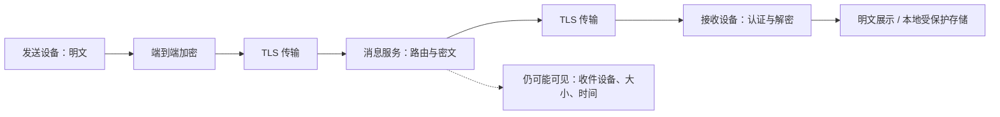
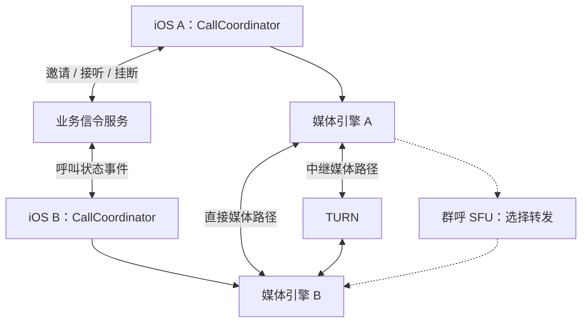
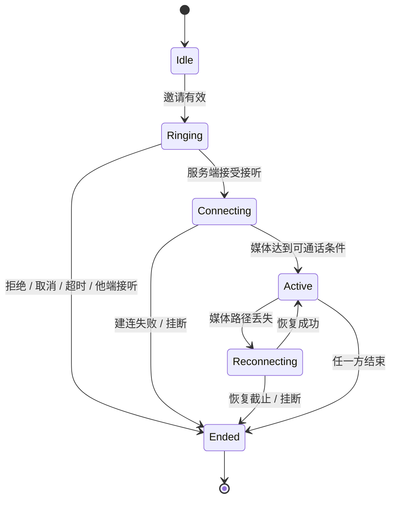
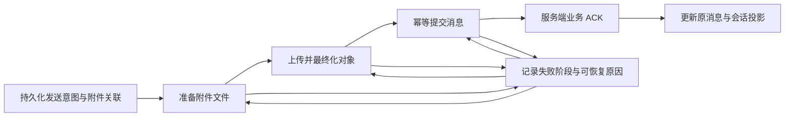
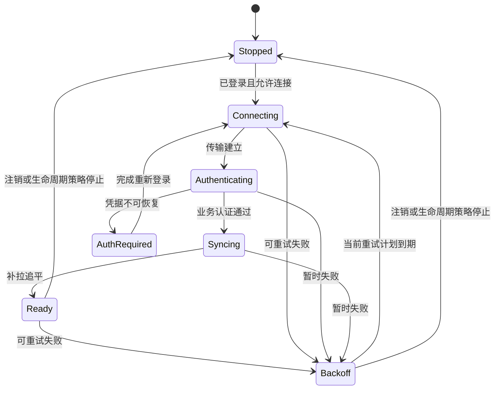

## iOS IM 安全加密与音视频通话


---

## 🔥 <span id="前言">前言</span>

返回 [**《iOS IM 开发研究手册》**](../iOS%20IM开发研究手册.md)。本专题研究即时通讯的安全边界、端到端加密、呼叫控制和实时媒体工程；数据库入库与消息同步在主手册及对应专题展开。

<span style="color:red;font-weight:bold;">安全来自清楚的信任边界，通话可靠性来自明确的状态机。</span> 加密算法、媒体 SDK 和系统来电界面都只是组成部分，不能单独代表完整能力。

资料核对日期为 **2026-09-25**。本文中的架构、实验与阈值选择方法是研究设计，不代表任何商业产品内部实现；所有伪代码均未编译，所有实验均为待执行方案，不冒充真机结论。

阅读路径：[威胁模型](#threat) → [密钥生命周期](#keys) → [本机保护](#local) → [附件与内容](#content) → [媒体建连](#rtc) → [呼叫状态机](#call-state) → [系统集成](#system) → [弱网质量](#quality) → [录制与媒体安全](#media-security) → [实验](#experiments) → [FAQ](#faq)。

## 一、<span id="threat">先定义资产、攻击者和信任边界</span>

### 1.1、<span id="assets">资产清单决定保护措施</span>

IM 的资产包括消息正文、附件、身份密钥、登录凭据、通讯录、群成员关系、在线状态、推送地址、设备列表、媒体内容和本地搜索索引。只加密消息正文，会遗漏可还原大量行为的元数据。

| 资产与攻击入口 | 风险 | 工程控制 | 仍然存在的边界 |
| --- | --- | --- | --- |
| 公共网络、代理、DNS 劫持 | 窃听、篡改、冒充服务端 | TLS、系统证书验证、鉴权 | 服务端通常仍能看到解密后的应用数据 |
| 消息服务器、存储、运维权限 | 正文泄漏、伪造设备列表 | E2EE、身份验证、设备变更可见 | 时间、流量、投递关系未必隐藏 |
| 被盗的锁定设备 | 本地记录与密钥泄漏 | Keychain、Data Protection、账号隔离 | 解锁状态、备份和端点失陷需另行评估 |
| 恶意群成员 | 转存消息、传播恶意附件 | 权限控制、内容解析边界、举报 | 合法收件人可拍照或另存明文 |
| 调试、日志与通知链路 | Token、正文、音视频元数据外泄 | 数据最小化、脱敏、访问期限 | 脱敏 ID 仍可能被跨日志关联 |

威胁建模的交付物应包含数据流图、每条跨边界数据、攻击者能力假设、保护目标和不承诺事项。把“设备已被完全控制”与“网络上有人抓包”混为一谈，会导致无法验证的安全口号。

### 1.2、<span id="tls-e2ee">TLS、存储加密与 E2EE 是三个边界</span>

[**TLS**](https://www.rfc-editor.org/rfc/rfc8446.html) 保护传输连接；数据库加密保护指定存储介质；E2EE（端到端加密）让预期通信端点持有内容解密能力。三者可以同时存在，不能互相替代。



图中的 E2EE 是目标设计：若服务端还持有解密密钥，或推送正文、备份明文绕过该链路，就不能沿用同样的安全承诺。真实端点还包括获得密钥的桌面设备、备份恢复端和获准的录制机器人。

### 1.3、<span id="auth-replay">认证、完整性与防重放分别设计</span>

登录 Token 说明请求具有某种账户权限，不自动证明消息由特定设备密钥生成。消息认证说明密文与绑定上下文未被伪造，不自动说明同一条合法消息没有被重放。

成熟协议通过认证加密、消息编号、会话状态与重放处理组合提供保护。工程层仍需把 `accountID / deviceID / conversationID / sessionID / messageID` 的作用区分清楚，按协议绑定必要上下文，不能只依赖可修改的时间戳。

收到相同密文时，传输层可以重复确认投递，但消息表、未读数、提醒、下载任务与通话事件不能重复执行。乱序容忍窗口和保留的跳过消息密钥必须有上限，防止恶意输入导致内存或计算量无限增长。[**Double Ratchet 安全与实现考虑**](https://signal.org/docs/specifications/doubleratchet/)

对应追问见 [FAQ：加密后是否还要幂等](#faq-idempotency)。

## 二、<span id="keys">密钥分发、身份验证与群组加密</span>

### 2.1、<span id="key-lifecycle">把密钥当成有生命周期的业务实体</span>

研究时至少区分设备身份密钥、预密钥、会话状态、消息密钥、附件密钥和备份恢复密钥。每类都要说明创建者、存储位置、使用期限、轮换条件、删除条件、恢复能力和失陷后的处理方式。

| 事件 | 客户端需要处理 | 服务端需要协作 |
| --- | --- | --- |
| 新设备加入 | 证明设备归属、显示设备列表变化、建立会话 | 设备注册鉴权、目录版本、消息路由 |
| 对方身份密钥变化 | 显示变化，按信任策略暂停或重新验证 | 返回可信的变更信息，防止静默替换 |
| 设备撤销 | 停止向该设备的新会话发密文 | 禁止新投递、撤销凭据、传播目录变化 |
| 会话轮换 | 提交新会话状态，处理迟到旧消息 | 有界缓存与可诊断的投递状态 |
| 密钥永久丢失 | 清晰呈现历史无法解密，走批准的恢复流程 | 不伪装成普通网络重试 |

“每周换一个群密钥”不是完整轮换设计。成员变更、离线设备、并发更新、历史访问和重试期间使用哪个密钥，必须由协议规则决定。

### 2.2、<span id="signal">成熟协议的研究层次</span>

[**Signal 官方规范目录**](https://signal.org/docs/) 提供协议原理材料。研究时分别理解初始密钥协商、消息密钥演化和多设备会话管理，不把一个算法名字等同于整套产品。

- [**PQXDH**](https://signal.org/docs/specifications/pqxdh/) 研究离线接收方场景下的初始密钥协商及其威胁假设；使用后仍需处理身份公钥真实性。
- [**Double Ratchet**](https://signal.org/docs/specifications/doubleratchet/) 研究消息密钥持续变化、旧密钥删除与会话恢复边界；前向安全不意味着已在本地保存的明文也被保护。
- [**Sesame**](https://signal.org/docs/specifications/sesame/) 研究设备目录、活动与非活动会话、离线消息以及设备变化；多设备不是简单共享一个数据库文件。
- 密码协议会演进。上线前需核对选定实现和规范版本的对应关系、安全维护、许可、测试向量和平台集成；不能把旧文章中的算法组合作为永久最新结论。

本文不提供自行拼接密码算法的实现教程。生产实现使用经过审查、具有维护和互操作验证的协议库，业务层负责持久化、设备信任、错误恢复与产品可解释性。

### 2.3、<span id="identity">身份验证比“拿到了公钥”多一步</span>

如果公钥目录由服务端返回，恶意或失陷的服务端可能替换公钥。安全码、二维码或独立渠道核验用于把密钥与人关联；设备列表展示与密钥变化提醒帮助用户发现变化，但静默“重新信任”会削弱该保证。

账号找回通常恢复的是账户访问权，不必然恢复旧设备的密码身份或历史密钥。需要明确：手机号重新分配、重装、换机、撤销设备分别是否触发新身份，通讯方将看到什么提示。[**Sesame 身份密钥变化**](https://signal.org/docs/specifications/sesame/#61-authenticating-identity-keys)

### 2.4、<span id="mls">群组加密需要成员状态与密钥状态一起推进</span>

[**MLS，RFC 9420**](https://www.rfc-editor.org/rfc/rfc9420.html) 是群组消息安全协议。其 `epoch` 表示群的一个密码状态阶段；成员与密钥变化通过协议操作推进，客户端不能仅按界面上“踢出成功”判断密码权限已收敛。

研究重点是成员加入与移除、并发提议与提交、离线设备跨多个 epoch 恢复、旧消息保留，以及应用权限如何映射到协议身份。MLS 不是现成的群管理、投递、存储或账号服务。

移除成员后，正确更新可阻止其读取之后由新状态保护的内容；已经交付给该成员的明文和旧密钥无法远程收回。新成员默认是否获得历史，需要另行设计授权历史转移，不能把旧密钥无差别发给新设备。

## 三、<span id="local">iOS 本机密钥、数据保护与账号隔离</span>

### 3.1、<span id="keychain">Keychain 解决小型秘密的保存</span>

[**Keychain**](https://support.apple.com/en-au/guide/security/secb0694df1a/web) 适合 Token、密钥等小型敏感数据。消息和媒体放在适当保护的数据库与文件中，不能把整段聊天历史塞入 Keychain。

| 访问需求 | 可研究的保护类 | 主要取舍 |
| --- | --- | --- |
| 仅设备解锁时使用 | `WhenUnlocked` 系列 | 锁屏后相关工作可能无法取得秘密 |
| 首次解锁后需要后台访问 | `AfterFirstUnlock` 系列 | 首次解锁前不可用，锁屏期间暴露面更大 |
| 不迁移到其他设备 | 对应 `ThisDeviceOnly` 类型 | 换机恢复不能假设仍有原密钥 |
| 强绑定已设置密码的设备 | `WhenPasscodeSetThisDeviceOnly` | 设备密码被移除或重置后条目可能失效 |

准确迁移、同步和备份行为取决于具体保护类；访问组决定哪些签名应用或扩展可以读取，不能把 App Group 文件共享与 Keychain 访问组视为同一机制。来源：[**Apple Keychain 数据保护说明**](https://support.apple.com/en-au/guide/security/secb0694df1a/web)。

### 3.2、<span id="protection">文件保护与后台可用性必须联合验证</span>

数据库、WAL、共享容器、附件、缩略图和导出文件都在保护范围内。主数据库设置了保护属性，不等于所有临时副本都具有同样的保护；创建、移动、解压与分享路径都需要检查。

“锁屏仍能解密推送”与“密钥只在解锁时可读”可能冲突。合理的产品方案包括锁屏显示通用通知、解锁后补解密，或经过威胁评估后选择支持后台访问的保护类；不能遇到读取失败就降低所有数据的保护等级。

开机首次解锁前、普通锁屏后、应用重启后、扩展进程访问时是不同测试场景。把密钥暂时不可读归类为可恢复状态，不能当成“记录不存在”而重新生成密钥覆盖原身份。

### 3.3、<span id="account-isolation">切号是一条完整资源清理链</span>

账号作用域至少覆盖数据库连接、密钥命名空间、附件缓存、搜索索引、网络连接、通知内容、下载任务和通话状态。操作上下文携带账号与登录代际，异步完成后再次校验归属。

```text
开始切号
  → 禁止旧账号新增写入和发送
  → 停止旧连接、媒体、下载及通知处理
  → 关闭旧数据库和密钥会话
  → 撤销或隔离旧凭据、清理策略指定的数据
  → 创建新账号作用域与新登录代际
  → 迟到回调校验代际；不匹配即丢弃业务副作用
```

退出登录、移除本机数据、撤销设备、注销账号是不同操作。退出后是否保留加密历史、是否保留恢复材料应写成产品策略；不能通过删除一个全局 Token 假装清理完成。

### 3.4、<span id="crypto-transaction">会话状态与消息持久化必须可恢复</span>

Ratchet 状态可能在一次加密或解密后改变。若只保存新状态而没有保存对应密文，崩溃后可能无法重发；若只保存密文而回滚会话状态，可能产生状态复用或重复处理问题。

优先选用协议库支持的事务接口，使会话状态变化、收发件箱和消息映射具备一致提交边界。不能简单要求所有秘密都独立写 Keychain 后再写数据库，因为二者没有天然的跨存储原子事务。

可以研究受 Keychain 中包装密钥保护的事务存储，但具体方案需由选定库的安全模型和存储接口确定。验收覆盖加密前、状态更新后、密文持久化后、提交完成前后的崩溃点，并验证恢复不会复用禁止复用的材料。

## 四、<span id="content">附件、富文本、日志与备份</span>

### 4.1、<span id="attachment">附件加密覆盖上传链路与解密副本</span>

E2EE 附件设计通常让端点加密文件后上传密文，再经受保护消息发送解密所需材料与完整性信息。对象存储地址、签名 URL 和访问 Token 不等于内容加密密钥；二者应分开管理。

大文件要按成熟文件加密格式处理分块认证、顺序、长度和截断，不能把同一个 nonce 重复用于不同明文。整文件校验完成前的流式播放必须具有分块认证保证，否则“边下载边播”可能显示未经认证的内容。

下载失败、重试、转发和多设备同步必须明确密文是否复用、授权是否变化、缩略图是否另行加密。临时解密文件、相册保存和系统分享都会产生新的明文副本，删除聊天记录不代表这些副本一起消失。

### 4.2、<span id="richtext">富文本与媒体解析属于不可信输入处理</span>

先校验包体大小、嵌套深度、字段类型、媒体尺寸和声明长度，再进入布局与解码。图片文件很小但像素极大、压缩包展开量远大于下载量、畸形富文本反复触发布局，都可能耗尽移动端资源。

Markdown 或 HTML 消息采用允许列表渲染；链接协议、网页跳转、文件名和下载地址分别验证。禁止让消息内容直接执行脚本、拼接本地文件路径或任意调用应用路由。链接预览还可能向外站暴露访问 IP、时间和认证上下文。

服务端做内容治理不能替代客户端解析安全。端到端加密模式下，服务端通常无法直接扫描明文，应明确客户端防护、用户主动举报材料与产品限制；不能暗中上传全部解密内容破坏既定承诺。

### 4.3、<span id="privacy-surfaces">通知、日志、搜索和备份是新的明文出口</span>

| 出口 | 推荐研究策略 | 容易遗漏的细节 |
| --- | --- | --- |
| 远程通知 | 只放投递提示或满足隐私策略的最小摘要 | 推送服务、系统通知中心、可穿戴设备 |
| 通知扩展 | 有界处理、保护类不可用时通用文案 | 扩展进程不共享主进程内存和无限执行时间 |
| 日志与埋点 | 记录阶段、错误码、脱敏关联 ID | Token、完整 SDP、IP、联系人名字、消息正文 |
| 全文检索 | 本机解密后建立受保护索引 | 索引、摘要和词典本身会泄露内容 |
| 云备份 | 独立的加密、恢复与撤销策略 | 恢复密钥托管者改变整体信任边界 |
| 截屏与分享 | 显示隐私状态，管理导出和后台快照 | 无法承诺阻止收件人用另一台设备拍摄 |

备份恢复需说明旧设备会话状态是否可恢复、是否会回滚序号，以及是否应建立新设备身份后单独恢复历史。检索能力不应通过把明文词条上传给服务端而被偷偷“补齐”。

## 五、<span id="rtc">音视频：信令与实时媒体分工</span>

### 5.1、<span id="rtc-layers">IM 传递呼叫事件，媒体链路传声音和画面</span>

[**WebRTC**](https://webrtc.org/) 提供实时通信机制，但不替业务定义邀请、忙线、接听、权限和多端抢接。IM 长连接可承载业务信令，媒体应进入实时传输链路，不能把编码帧当普通聊天消息逐条入库转发。



信令断线不必立即终止已经连通的媒体；媒体无声也不必然表示 IM 连接断了。分别维护业务呼叫状态、PeerConnection 状态和音频设备状态，最后由协调层决定 UI 表达。

### 5.2、<span id="sdp">SDP Offer / Answer 是能力协商</span>

SDP 描述音视频轨道、方向、编解码能力和连接相关参数。发起端生成 Offer，对端设置远端描述并生成 Answer；双方通过业务信令交换，WebRTC 不规定该信令运输方式。[**WebRTC Peer connections**](https://webrtc.org/getting-started/peer-connections)

视频升级、屏幕共享、轨道替换可能触发重新协商。两个端同时发 Offer 会产生协商碰撞，需按选定引擎推荐策略确定协商角色与回退处理，不能任意覆盖已有远端描述。

SDP 与 ICE candidate 都绑定 `callID` 和协商代际。迟到候选不能投递给下一次通话；远端描述未就绪时的候选需要有界缓存，并按引擎要求按序应用。

### 5.3、<span id="ice">ICE、STUN、TURN 各自解决一段问题</span>

| 机制 | 负责 | 不负责 |
| --- | --- | --- |
| [**ICE，RFC 8445**](https://www.rfc-editor.org/rfc/rfc8445.html) | 收集候选、连通性检查、选择候选对 | 业务接听、用户身份、无限重连 |
| [**STUN，RFC 8489**](https://www.rfc-editor.org/rfc/rfc8489.html) | 地址发现及相关连通性检查机制 | 保证任何 NAT 下都能直连 |
| [**TURN，RFC 8656**](https://www.rfc-editor.org/rfc/rfc8656.html) | 通过中继转发数据 | 自动解决延迟、带宽成本和跨区域质量 |

移动网络切换会使候选路径失效，ICE restart 用于重新协商连接相关信息。应区分短暂断连与确认失败，允许合理恢复窗口，同时保留超时终止和用户主动挂断能力。

TURN 凭据应短期有效并与授权范围匹配；记录中继选择比例和区域质量以规划成本。强制中继可减少向对端暴露直接网络地址的场景，但会增加中继依赖，不能简单等同于匿名通信。

## 六、<span id="call-state">呼叫状态机、多端竞态和恢复</span>

### 6.1、<span id="call-id">呼叫 ID 与消息 ID 分离</span>

`callID` 标识一次呼叫，`eventID` 用于事件去重，`revision` 表示服务端认可的状态版本，`attemptID` 区分一次媒体建连尝试。终态和已处理事件需要保留一段协议定义的期限，防止迟到邀请重新拉起来电。



图中的“服务端接受接听”和“媒体达到可通话条件”不同。用户点击按钮只是意图；不能此时就显示已经接通或累计真实通话时长。

### 6.2、<span id="call-races">服务端裁决共享状态，客户端幂等执行</span>

| 竞态 | 推荐裁决 | 客户端结果 |
| --- | --- | --- |
| 手机与平板同时接听 | 对同一呼叫的接听资格原子裁决 | 一端成功，其余端收到他端接听终态 |
| 主叫取消与被叫接听交错 | 以服务端状态版本和终态规则判定 | 被拒绝接听端立即结束连接准备 |
| 超时后迟到 Answer | 检查终态、截止时间、协商代际 | 不重新激活旧呼叫 |
| 双方同时呼叫对方 | 产品定义合并、忙线或固定胜者 | 不同时出现两套媒体会话 |
| 重复 VoIP 推送与长连接邀请 | 统一映射到同一个呼叫对象 | 按系统接口契约处理，UI 与铃声不重复 |
| 已结束后收到 ICE candidate | 核验 callID 和 attemptID | 丢弃，不重建 PeerConnection |

这是业务状态设计，不是某个传输协议自动提供的保证。客户端计时器用于及时反馈，服务端截止条件用于裁决；恢复时拉取当前快照，不能只回放本机倒计时次数。

### 6.3、<span id="call-reducer">用单一状态归约器执行事件</span>

```text
处理事件(event):
  若账号或登录代际不匹配：结束
  若eventID已处理：返回既有处理结果
  若callID已终止且事件不能合法更新终态：忽略旧事件
  校验revision、权限、截止时间与协商代际
  根据当前状态和事件计算新状态与副作用
  保存必要的终态、事件去重信息与状态版本
  将CallKit、媒体启动、铃声、UI刷新交给各自适配器
  适配器回调携带callID与attemptID重新进入归约器
```

不把 UI 控制器作为通话生命周期所有者；页面关闭、Scene 切换和前后台变化不应意外释放有效通话。反过来，挂断后协调器必须释放媒体资源、计时器、音频路由和重连任务。

## 七、<span id="system">CallKit、PushKit 与音频系统集成</span>

### 7.1、<span id="callkit">系统来电界面与媒体引擎之间增加适配层</span>

[**CallKit**](https://developer.apple.com/documentation/callkit) 承接系统通话界面与相关动作；业务层接收开始、接听、结束、静音等动作，再更新状态机。`fulfill` 或 `fail` 反映动作处理结果，不是随意消除系统回调的标记。

把系统 UUID 与业务 `callID` 稳定映射。接到系统结束动作时，即使信令网络不可用，也应立即停止本地采集、播放和重连，随后按协议补发结束状态。

### 7.2、<span id="pushkit">VoIP 推送承载真实来电</span>

Apple 对传统 `pushRegistry(_:didReceiveIncomingPushWith:for:completion:)` 明确规定：链接 iOS 13 SDK 或以后版本时，VoIP 推送须按要求上报 CallKit；未上报可导致系统终止应用，反复失败可能影响后续投递。[**官方回调契约**](https://developer.apple.com/documentation/pushkit/pkpushregistrydelegate/pushregistry(_:didreceiveincomingpushwith:for:completion:))

因此推送唤醒路径应足够短，不能先等待完整历史同步、远端头像下载、全部媒体初始化完成再处理系统来电；按要求调用 completion，连接业务服务器可并行推进。[**Apple VoIP 推送说明**](https://developer.apple.com/documentation/pushkit/responding-to-voip-notifications-from-pushkit)

该说明限定于引用的 API 契约。使用较新系统新增的通话框架或回调时，重新核对 SDK availability、系统告知的处理要求与分发地区约束；不要把历史规则泛化成所有新 API 的行为。

VoIP 推送不是普通 IM 消息保活工具。服务器要限制邀请有效期并发送正确的推送类型；迟到来电和已取消来电按当前系统契约报告与结束，不能用虚构通话保持后台运行。

### 7.3、<span id="audio-session">AVAudioSession 的所有权必须统一</span>

[**AVAudioSession**](https://developer.apple.com/documentation/avfaudio/avaudiosession) 管理应用对音频系统的使用意图。通话、语音消息播放、录音、视频播放若各自修改 category、mode 和 active 状态，会互相抢占。

建立音频会话协调器，按通话优先级授予能力；媒体引擎与系统通话适配层约定谁配置、谁激活、谁解除。CallKit 的 `didActivate` / `didDeactivate` 是系统激活状态信号，应与引擎实际采集播放同步。[**Apple didActivate**](https://developer.apple.com/documentation/callkit/cxproviderdelegate/provider(_:didactivate:))

音频权限被拒绝时清楚表达“不能发送语音”并允许结束；摄像头被拒绝时可按产品策略降级音频，不能把权限失败报成“网络异常”。启动前检查当前授权，不把授权弹窗耗时算成网络建连耗时。

### 7.4、<span id="audio-route">蓝牙、耳机和中断是持续变化的状态</span>

监听路由变化并读取实际 `currentRoute`，不要只根据用户点击的图标猜测当前输出。耳机移除可能改变私密性，通话场景需明确听筒与扬声器策略，并同步 UI。[**Apple 路由变化**](https://developer.apple.com/documentation/avfaudio/responding-to-audio-route-changes)

蓝牙通话输入输出能力、采样率、声道数与 I/O 缓冲可能随路由变化。媒体格式应在变化后重新核对；不要假设所有蓝牙路由都支持与扬声器相同的采集播放组合。

系统电话、Siri、其他音频服务、媒体服务重置都应进入音频协调层。中断开始时记录是否原本正在通话；结束后依据系统恢复建议、当前呼叫终态和用户意图决定恢复，不能无条件重新开麦。[**Apple 中断处理**](https://developer.apple.com/documentation/avfaudio/handling-audio-interruptions)

音频恢复 API 有新旧 SDK 差异；历史 `shouldResume` 只用于对应 API 范围，落地时核对目标 SDK 的弃用提示与替代通知。本文保留恢复语义，不提供跨版本硬编码示例。

## 八、<span id="quality">媒体拓扑、弱网与质量度量</span>

### 8.1、<span id="topology">一对一与群呼的成本结构不同</span>

一对一可以尝试直接连接，并由 TURN 中继兜底。群呼若每个参与者分别向其余所有人上传，单设备上行随人数增长；总逻辑连接数也快速增长，不适合简单照搬一对一实现。

SFU（选择性转发单元）接收参与者媒体后，按订阅、布局与质量需求转发。客户端可以上传多层编码或多个码率版本，由服务端选择适合接收者的层；能力取决于引擎、编码器、终端与服务端的共同支持。

MCU（混流）可让终端只解码少量合成流，但服务端计算、布局灵活性和媒体明文可见性不同。拓扑选型需同时衡量人数、移动端功耗、总出口带宽、弱网表现和加密承诺，不能只比较 SDK API 数量。

### 8.2、<span id="stats">从可观测链路定位黑屏、无声和卡顿</span>

| 阶段 | 关键观察 | 常见归因方向 |
| --- | --- | --- |
| 发出邀请 → 对方响铃 | 推送与信令阶段耗时、设备状态 | 推送、鉴权、迟到邀请、系统界面处理 |
| 接听 → ICE 连通 | candidate 类型、选中路径、往返时延 | NAT、防火墙、TURN 区域、网络切换 |
| 连通 → 第一段音频 | 收包、解码、音频会话与实际路由 | 音频未激活、静音、设备路由、权限 |
| 连通 → 首帧视频 | 收包、关键帧、解码、渲染 | 发送端未采集、解码阻塞、渲染未挂载 |
| 持续通话 | 丢包、抖动、码率、冻结、温度与功耗 | 拥塞、CPU 限制、热降频、编码负载 |

WebRTC 统计中很多字段是累计计数，速率和比例要用相邻采样差值。切换轨道、重连或统计对象重建时计数可能重置，不能把负差值当成网络改善。[**W3C WebRTC Statistics**](https://www.w3.org/TR/webrtc-stats/)

音频可以关注 `concealedSamples` 的增量比例；它反映丢失或过晚到达样本导致的本地补偿，不能直接当成网络丢包率。视频可以结合冻结时间、解码帧率与实际渲染观察，不以平均码率代表体验。

### 8.3、<span id="degradation">降级需要顺序、滞回和可解释反馈</span>

弱网下优先保护可理解的语音，逐步降低视频码率、帧率、分辨率或暂停非必要订阅。群呼减少不可见参与者视频；热压力高时也要降级，因为 CPU 限制和带宽限制需要不同策略。

采用持续窗口、恢复阈值与冷却时间，避免网络数值在阈值附近抖动时反复开关视频。UI 区分“对方暂停视频”“网络较差降级”“摄像头权限不可用”，不要统一显示黑框。

FEC、重传、抖动缓冲和关键帧请求各有延迟与带宽代价，应使用引擎的拥塞控制并经实验调节。不要同时在业务层反复强制高码率、在引擎层自动降码率，形成互相抵消的控制回路。

## 九、<span id="media-security">媒体加密与通话录制</span>

### 9.1、<span id="rtc-e2ee">媒体传输加密不自动等于跨 SFU 的 E2EE</span>

WebRTC 常见安全媒体传输使用 DTLS-SRTP 等机制。必须画出密钥终止位置：一对一直连、中继转发、SFU 解密再转发，对服务端的信任要求不同。[**WebRTC 安全架构，RFC 8827**](https://www.rfc-editor.org/rfc/rfc8827.html)

TURN 转发并不意味着必须解密媒体；SFU 是否能解密取决于实际密钥和媒体处理架构。若要在服务端转发条件下仍保护内容，研究经过审查的额外帧级加密、群密钥分发与成员变化，并验证选定 iOS 引擎支持。

不能因为文字聊天采用 E2EE 就自动宣传语音、视频、屏幕共享与云录制同样满足；每条媒体路径、转码器和录制参与者都要单独进入威胁模型。

### 9.2、<span id="recording">录制是一项明确的产品能力</span>

采集权限允许使用麦克风或摄像头，不等于用户同意保存整段通话。录制开始、持续状态、暂停与结束应有清楚的视觉或声音指示；Apple 审核指南明确要求记录用户活动时取得明确同意并提供可见或可听提示。[**App Review Guidelines 2.5.14**](https://developer.apple.com/app-store/review/guidelines/#software-requirements)

产品需说明谁发起、谁能下载、保存多久、撤销后的处理、失败的半成品如何清理，以及参与者中途加入时如何获知正在录制。服务端录制机器人若取得内容解密能力，就成为需要声明的通信端点。

不同地区对录制可能有额外要求；将地区合规审查列为发布前独立工作，不在技术文档里编造统一的法定人数、同意形式或上架结论。

## 十、<span id="experiments">实验矩阵与验收证据</span>

### 10.1、<span id="security-matrix">安全与恢复实验</span>

| 实验 | 注入条件 | 需要观察的结果 |
| --- | --- | --- |
| 重复与乱序密文 | 同消息重复、旧消息迟到 | 无重复副作用，合法乱序按协议恢复 |
| 认证失败 | 改动测试密文与绑定上下文 | 拒绝展示、不推进错误会话状态 |
| 会话崩溃恢复 | 在状态与消息提交边界终止测试进程 | 不复用禁止复用材料，无假成功 |
| 设备密钥变化 | 测试账号重装或增加设备 | 设备变化可见，身份策略真实生效 |
| 账号切换 | 旧账号下载或解密回调迟到 | 不写入或展示到新账号 |
| 保护类不可访问 | 重启首次解锁前、普通锁屏后 | 进入可恢复状态，不覆盖旧密钥 |
| 群移除与离线成员 | 移除成员后发送、离线设备恢复 | 新状态权限生效，历史范围符合策略 |
| 敏感信息扫描 | 检查日志、通知、缓存、导出与备份 | 无未声明明文与永久凭据泄漏 |

所有输入使用独立测试账号、测试密钥和合成内容；恢复实验必须保存测试环境配置，避免对真实聊天历史做破坏性验证。

### 10.2、<span id="rtc-matrix">真机通话实验</span>

| 实验 | 组合 | 验收关注 |
| --- | --- | --- |
| 系统来电路径 | 前台、后台、锁屏、进程未运行 | 系统报告、接听动作、首音频、结束清理 |
| 多端抢接 | 手机与平板同时接听 | 单一胜者、另一端正确收敛 |
| 邀请竞态 | 取消与接听同时发生、推送迟到 | 无幽灵来电，无终态复活 |
| NAT 与防火墙 | 直连、仅中继可用、IPv6 环境 | 路径选择、失败原因、TURN 成本 |
| 网络切换 | Wi-Fi 与蜂窝切换、短断网 | ICE 恢复窗口、超时、重新接通反馈 |
| 弱网 | 限带宽、时延、抖动、随机与突发丢包 | 语音连续性、视频降级、恢复滞回 |
| 音频路由 | 听筒、扬声器、蓝牙、耳机插拔 | 真实路由、采集状态、隐私、格式变化 |
| 系统中断 | 电话、Siri、媒体服务重置 | 不盲目开麦，恢复与终态一致 |
| 长通话 | 多参与者、持续视频、后台切换 | 内存、温度、耗电、资源释放 |
| 录制 | 中途加入、停止、上传失败 | 同意与提示、文件权限、半成品清理 |

### 10.3、<span id="evidence">以可复现记录替代“感觉流畅”</span>

每次实验记录设备、系统、应用与媒体引擎版本、网络模型、人数、摄像头与编码配置、持续时间和失败日志。按平台与网络分层统计 p50 / p95；样本量小的时候直接展示原始分布与异常样本。

不要只报告呼叫接通率：同时记录发起失败、被叫未响铃、接听后无声、首帧超时、异常结束、恢复时间和用户主动取消。不同分母对应不同问题，不能把用户拒接算成媒体失败，也不能把无声通话算成成功。

当前文档只完成原理整理和资料核对；没有实现密码协议、搭建信令服务、执行录音或运行上述真机实验。

## 十一、<span id="faq">FAQ：研究与面试追问</span>

### 11.1、<span id="faq-tls">用了 HTTPS，消息就属于端到端加密吗？</span>

**答：不一定。** HTTPS 保护客户端与服务器之间的连接，服务器通常能解密应用数据；E2EE 要继续确认正文密钥只由预期端点持有，并检查推送、备份和其他设备有没有形成明文旁路。[返回 TLS 边界](#tls-e2ee)

### 11.2、<span id="faq-idempotency">消息已经加密，为什么还要做幂等？</span>

**答：认证不能替代业务去重。** 同一条合法消息可能因为网络重试再次到达。协议负责密码状态与重放边界，业务负责消息记录、未读数、提醒和下载不重复执行，两层都不可省。[返回认证与防重放](#auth-replay)

### 11.3、<span id="faq-keychange">对方换机后公钥变化，自动接受就可以了吗？</span>

**答：只能按明确的信任策略处理。** 变化可能来自合法换机，也可能来自身份替换；需要设备变更记录、用户可见提示和必要的独立核验。自动接受会改变原有身份保证，不能同时宣称验证强度完全不变。[返回身份验证](#identity)

### 11.4、<span id="faq-keychain">Keychain 的安全级别越高越适合 IM 吗？</span>

**答：要与访问时机共同选择。** 仅解锁可用的密钥可能无法在锁屏后台解密，允许首次解锁后访问又有不同暴露面。把能力限制反映到通知与恢复流程，不为方便直接降低全部保护等级。[返回本机保护](#keychain)

### 11.5、<span id="faq-revoke">把人踢出群以后，旧消息也能保证看不到吗？</span>

**答：不能。** 群密钥状态更新可以保护后续内容，但对方已经取得的明文、密钥、截图和导出副本无法远程收回。历史转移、撤回和未来权限必须分别定义。[返回 MLS 与群权限](#mls)

### 11.6、<span id="faq-callkit">接入 CallKit 后，音视频通话就完成了吗？</span>

**答：没有。** CallKit 负责系统通话集成；业务还需要呼叫服务与状态机，媒体还需要协商、连通性检查、采集、编码、传输、解码和播放。各层失败信号要能在同一个 callID 下关联。[返回系统集成](#callkit)

### 11.7、<span id="faq-turn">STUN 能打洞，为什么还要 TURN？</span>

**答：地址发现和连通性检查不能保证所有网络直连。** 防火墙、NAT 与网络策略可能阻止直接媒体路径，TURN 通过中继提供另一条路径；它带来带宽、地域与可用性成本，需要持续统计。[返回 ICE / STUN / TURN](#ice)

### 11.8、<span id="faq-answer">手机和平板一起点接听，用客户端布尔值防重够吗？</span>

**答：不够。** 单机锁只能约束本进程，跨设备接听资格需要服务端原子裁决。客户端根据状态版本处理胜者、他端接听与迟到响应，并清理失败端已启动的资源。[返回多端竞态](#call-races)

### 11.9、<span id="faq-connected">WebRTC 显示 connected，为什么仍然无声？</span>

**答：连接建立只是一个阶段。** 继续观察远端是否发包、本地是否收包与解码、音频会话是否激活、麦克风授权、静音状态及实际输出路由。把“接通”“首音频”和“持续可听”拆成不同指标。[返回质量定位](#stats)

### 11.10、<span id="faq-sfu">经过 SFU 转发的媒体还可能端到端加密吗？</span>

**答：可能，但不能由“使用 SFU”直接判断。** 需要确认密钥终止点，以及是否存在服务端不可解密的额外内容保护；同时评估转码、录制和群成员变化是否仍支持该承诺。[返回媒体安全](#rtc-e2ee)

### 11.11、<span id="faq-background">能不能用 VoIP 推送让普通聊天消息一直保活？</span>

**答：不能把它当普通 IM 保活机制。** VoIP 通道用于真实来电，并受系统报告契约约束。普通聊天采用相应消息推送与前台恢复同步，不能创建虚假呼叫绕过平台限制。[返回 PushKit 边界](#pushkit)

### 11.12、<span id="faq-research">没有做过生产 IM，怎样形成可信的科研成果？</span>

**答：先做可复现的小系统与实验。** 明确威胁模型和呼叫状态机，选择维护中的成熟协议与媒体实现，用失败注入验证崩溃恢复、多端竞态和弱网；保存版本、输入、指标与未解决边界。把“设计过、实现过、测过、上线过”分别写清楚。[返回实验矩阵](#experiments)

<a id="🔚" href="#前言" style="font-size:17px; color:green; font-weight:bold;">我是有底线的➤点我回到首页</a>


## iOS IM 聊天界面与多媒体工程


---

## 🔥 <span id="前言">前言</span>

本文是 [iOS IM 开发研究手册](../iOS%20IM开发研究手册.md) 的界面与附件专题，覆盖消息进入界面、用户输入、媒体准备、发送、失败恢复与资源回收。数据库是可靠状态来源，聊天界面是状态的投影，附件流水线负责另一组独立且必须持久化的工作。

以 [**UIKit**](https://developer.apple.com/documentation/uikit) 为主要讨论对象，不绑定特定 UI 框架。平台事实按 **2026-09-25** 查阅的 Apple 官方资料核验；业务状态机、缓存键和实验方案属于本文建议，应按协议与目标设备调整。所有流程代码均为语言无关伪代码，不能作为已编译的 SDK 示例。

**阅读导航：** [职责与身份](#identity) → [列表与布局](#list) → [滚动锚点](#anchor) → [输入系统](#input) → [消息内容](#content) → [图片](#image) → [音频](#audio) → [视频与上传](#transfer) → [发送恢复](#recovery) → [隐私与无障碍](#accessibility) → [验证](#experiments) → [FAQ](#faq)。

## 一、<span id="identity">职责分层与稳定身份</span> <a href="#前言">🔼</a> <a href="#🔚">🔽</a>

### 1.1、先定义关键对象

| 对象 | 定义 | 生命周期与边界 |
| --- | --- | --- |
| 消息实体 | 内容、发送者、会话和状态组成的业务记录 | 不持有 Cell、图片解码对象或播放器 |
| 展示模型 | 给定消息与环境下，界面需要的不可变数据 | 包含内容版本、状态文案、布局输入 |
| 稳定 UI ID | 同一逻辑消息在列表内不变化的身份 | 不能用当前位置或发送状态生成 |
| 服务端消息 ID | 服务端分配的业务身份 | 发送前可能不存在，不能直接代替本地身份 |
| 渲染版本 | 会改变内容或外观的版本标记 | 和身份分离，改变版本不等于新增消息 |
| 附件记录 | 一份文件的身份、准备和传输状态 | 可被多个消息引用，不归某个 Cell 所有 |

建议分成 `ConversationRepository → MessageWindow → PresentationBuilder → ListRenderer`，附件使用独立 `AttachmentStore → MediaProcessor → TransferCoordinator`。输入面板只提交命令；仓储提交后的变更驱动页面。播放协调器按业务决定跨页继续或停止，不让复用 Cell 自己充当播放器状态仓库。

<span style="color:red"><b>Cell 出现不代表消息已发送；上传进度 100% 不代表服务端已接受消息。</b></span> 区分本地保存、排队、准备附件、上传、提交消息、服务端接受、目标设备送达和已读。UI 展示多少级状态由产品决定，内部状态不能因此合并。[对应 FAQ](#faq-state)

### 1.2、pending 消息与 ACK 的合并

本地发送先生成 `clientMessageID`，同时建立持久 `localMessageKey` 作为 UI ID。ACK 是服务端对业务请求的确认，不是 TCP 确认；收到 ACK 后给原消息填入 `serverMessageID`、服务端时间和顺序号，保留 `localMessageKey`。远端补拉的同一条消息通过协议约定的 `clientMessageID` 或映射表与本地消息合并。

| 事件顺序 | 正确处理 | 常见错误 |
| --- | --- | --- |
| 本地插入 → ACK → 同步回显 | 更新同一个实体与 UI ID | 把回显作为第三条消息 |
| 本地插入 → 同步回显 → ACK | 先合并回显，ACK 再幂等补充 | ACK 到达后删除旧行再插入新行 |
| 请求超时 → 重试 → 原 ACK 到达 | 同一幂等发送操作收敛 | 每次重试生成新消息，重复发送 |
| 服务端排序位置改变 | 保留身份，按确认的排序规则移动 | 用创建时间覆盖可靠顺序号 |

服务端未回传客户端关联标识时，单凭文本、时间和发送者匹配并不可靠，应修改协议或明确无法消除的歧义。消息删除、撤回、编辑也要保留足够版本信息，避免迟到回调重新显示已删除内容。

Apple 的 Diffable Data Source 设计使用稳定标识；模型其他属性变化时，标识不应改变。业务层的 pending 合并策略是本文在此基础上的设计。[Apple：Make blazing fast lists and collection views](https://developer.apple.com/videos/play/wwdc2021/10252/)

### 1.3、会话列表是独立读模型

会话行包含置顶顺序、最后有效消息摘要、最后活动排序键、未读数、免打扰、草稿、提及提示和发送失败提示。把这些字段从每条消息独立拼接，容易出现摘要已更新、未读仍旧值的短暂矛盾；优先发布同一持久化版本对应的会话快照。

草稿是否影响排序、撤回后显示提示还是前一条有效消息、历史补拉是否影响最近会话顺序，都属于显式业务规则。低序号历史消息不应无条件覆盖最新摘要。在线状态、正在输入等短期信号使用失效时间和独立刷新节流，不能每个心跳重新排序全列表。

## 二、<span id="list">长列表、差量更新与布局缓存</span> <a href="#前言">🔼</a> <a href="#🔚">🔽</a>

### 2.1、容器选型与窗口化

`UITableView` 适合相对规则的单列气泡；`UICollectionView` 对多形态布局、组合展示和自定义布局更灵活。选择依据是目标交互、团队维护能力与实测，不是“某个组件天生不卡”。先把数据正确性、测量成本和异步资源管理拆开，再决定容器。

**窗口化**是只保留当前阅读位置附近的消息展示数据。复用 Cell 只限制可见视图数量，不会自动限制消息数组、富文本、图片帧和布局字典的大小。大历史会话应从本地库分页读取，保留前后缓冲窗；窗口淘汰时保护阅读锚点、播放消息和编辑中的目标。

初始打开最新消息、定位未读、搜索跳转历史位置，应分别定义加载入口。定位历史消息时先建目标附近窗口，再补两侧历史；不要从最新页一直向前加载到目标。恢复窗口需要保存消息 ID 与相对位置，不能保存只对旧数组有效的 `IndexPath`。

### 2.2、把一次数据变更压缩成一次合理更新

**Diff**是比较两份列表状态得到插入、删除、移动和内容变更。渲染管线接受一个有序事件流，合并同一短时间内的非关键变化，生成最新快照；已读回执和上传进度不应每一包都触发全量布局。

| 变化 | 首选动作 | 需要检查 |
| --- | --- | --- |
| 发送状态图标变化 | 更新受影响的已存在项目 | 图标占位是否固定，是否改变高度 |
| 文本编辑、翻译展开 | 内容更新并失效该消息布局 | 当前阅读锚点是否需要补偿 |
| 新消息进入当前会话 | 插入稳定 ID | 是否贴底，是否显示新消息计数 |
| 会话顺序变化 | 移动会话 ID | 手势操作期间是否延迟动画 |
| 一次离线补拉大量消息 | 合并提交快照，按窗口展示 | 不为屏幕外全部消息逐条动画 |

快照应用使用单一协调入口，避免两次异步更新交叉操作同一列表。可保存“最后已应用版本”和“待应用最新版本”；更新结束再处理后续版本。具体 API 是否允许在哪个队列计算或应用，应按采用的 SDK 文档处理；视图变更统一归主线程，禁止把“后台准备模型”理解成随意在后台操作 UIKit 对象。

预取可以提前启动数据和图片准备，但预取请求可能取消，也可能没预取就直接显示。因此 Cell 配置必须能独立处理冷缓存。Apple 官方列表样例强调预取和图片准备；业务仍要自行实施有界队列与任务去重。[Apple：Building high-performance lists and collection views](https://developer.apple.com/documentation/uikit/building-high-performance-lists-and-collection-views)

### 2.3、布局缓存必须能正确失效

**测量缓存**保存给定内容与布局条件下的高度、文字排版和附件区域。缓存键至少考虑 `UI ID + 内容版本 + 容器有效宽度 + 字号类别 + 版式版本`；按实现补充显示比例、语言方向、折叠状态、头像分组、引用内容版本。宽度使用实际布局宽度，不能用全屏宽度代替分屏窗口宽度。

| 触发变化 | 失效范围 | 容易漏掉的关联 |
| --- | --- | --- |
| 正文编辑、翻译展开 | 当前消息 | 会话摘要、搜索高亮缓存 |
| 图片尺寸元数据到达 | 当前附件消息 | 消息高度与滚动锚点 |
| 插入或删除相邻消息 | 当前与相邻分组消息 | 昵称、头像、时间分隔和气泡尾巴 |
| 字号、窗口宽度或方向变化 | 当前窗口内相关布局 | 缓存内同 ID 的旧环境结果 |
| 引用消息被撤回 | 所有引用其快照的可见项 | 已缓存引用标题与高度 |

纯文本预处理和线程安全的独立测量可以在受控执行器中进行；不要把正在显示的 `UITextView`、约束树或共享可变排版对象拿到后台复用。测量结果携带输入版本，回主线程应用前再比对，丢弃旧结果。缓存设容量上限并统计命中率，不能用命中率掩盖错误高度。[对应 FAQ](#faq-layout)

### 2.4、异步 Cell 复用协议

每次绑定生成 `bindingGeneration`，保存消息 ID、资源键和请求句柄。解绑或复用时取消本 Cell 的订阅、重置进度、播放指示、占位和无障碍描述；共享资源请求只在没有订阅者且没有其他业务需求时才考虑取消。

```text
bind(cell, item):
  cell.generation += 1
  expected = (item.uiID, item.contentVersion, cell.generation, item.resourceKey)
  renderSynchronousState(item)
  subscribeResource(item.resourceKey, completion):
    dispatchToUI:
      if cell.currentBinding != expected: discard
      else: applyPreparedResource(completion)
```

取消是节省工作，身份与版本校验才是拒绝迟到结果的最后防线。禁止在图片完成回调中使用旧 `IndexPath` 找当前 Cell；若通过数据源更新，也先按稳定 ID 查当前实体。[对应 FAQ](#faq-reuse)

## 三、<span id="anchor">分页、阅读锚点与自动滚动</span> <a href="#前言">🔼</a> <a href="#🔚">🔽</a>

### 3.1、顶部分页保持同一行的视觉位置

**滚动锚点**是一条稳定消息及其相对可见区域的位置。正常正向列表的建议步骤如下；倒置列表也必须保持同一不变量，不能直接照搬坐标符号。

1、更新前记录第一条合适的可见消息 `anchorID`，以及其顶部相对列表可视区域的 `oldVisualY`。同时记录是否贴底、是否拖动和当前布局环境。

2、使用服务端或数据库分页游标加载更早消息，去重后合并到同一消息窗口，生成快照。请求带窗口世代标识；切换会话或跳转搜索结果后拒绝旧分页返回。

3、应用快照并等待本轮实际布局，重新按 `anchorID` 查到 `newVisualY`。对正向列表使用 `contentOffsetY += newVisualY - oldVisualY`，把同一消息移回原来的视觉位置。

4、随后若自适应高度发生二次变化，在更新协调器中继续维护锚点；避免与用户拖动争抢。锚点被撤回或过滤时选最近仍存在的可见邻居；视口变化时按产品确定保顶部阅读位置还是底部阅读位置。

单纯用 `newContentSize.height - oldContentSize.height` 补偿，只适用于变化都发生在锚点之前且高度准确的受限场景。图片高度补全、页脚变化和键盘 inset 同时发生时，应优先用消息几何位置校正。记录坐标所在视图，不能把屏幕坐标、内容坐标和安全区偏移混在一起。[对应 FAQ](#faq-anchor)

### 3.2、新消息是否滚到底部

**贴底**表示距离最新内容末尾处于产品定义的容差内，判断要计入有效底部 inset 与输入面板遮挡。收到新消息前捕获该状态；已贴底时保持末尾可见，正在看历史时保持阅读位置并累加“新消息”提示。

用户主动发送消息通常进入跟随最新消息模式，但引用历史消息、搜索上下文和回复线程可以另设规则。键盘弹出、输入框增高和横竖屏切换沿用同一阅读模式；不能让三个独立回调各调用一次滚到底部，造成争抢和闪动。

## 四、<span id="input">键盘、输入框与页面几何</span> <a href="#前言">🔼</a> <a href="#🔚">🔽</a>

### 4.1、统一输入面板状态

输入面板建议建模为 `idle / keyboard / emoji / attachment / recording`，另存草稿、选择区间、引用对象和焦点。状态切换由一个协调器更新输入区高度、列表底部可见区域和滚动策略，避免“键盘通知管理一次、表情面板再管理一次”的重复 inset。

多行输入设置最小高度与最大可视高度，到上限后只滚动输入框内部。草稿节流持久化，在切会话等关键边界补写；中文拼音组合输入期间保留 marked text，不能每次输入都整段替换文本或强行重新解析 mention，破坏正在组合的输入。

交互收起键盘时，消息列表和输入区同步跟随几何变化；输入框保留焦点和选择区语义。发送动作采用防重复提交标识，按钮防连点只是附加保护。外接键盘的回车、换行、快捷发送也要经过同一个发送命令入口。

### 4.2、键盘布局与安全区

`UIKeyboardLayoutGuide` 表示键盘在当前视图布局中占据的区域；该能力从 iOS 15 引入。非停靠键盘是否跟随是独立配置，默认不等于一直追踪悬浮键盘。系统键盘未显示时，指南默认涉及底部安全区，因此不能再盲目加一次底部安全区。[Apple：Your guide to keyboard layout](https://developer.apple.com/videos/play/wwdc2021/10259/)、[键盘布局样例](https://developer.apple.com/documentation/uikit/adjusting-your-layout-with-keyboard-layout-guide)

采用通知兼容旧系统时，应把键盘 frame 转到当前窗口和页面坐标，求真实遮挡交集并跟随系统动画参数。不能使用“键盘高度固定 216”“全局第一个 Window”或只监听 show/hide。iPad 分屏、悬浮键盘、旋转和外接键盘候选栏都可能改变几何条件。

输入附件视图与页面内输入条是两种实现选择，先选一种几何所有者。当前 Scene 管理自己的窗口、安全区和键盘关系。旋转或窗口调整前后保留阅读锚点、草稿、光标和选择态，重算宽度相关布局；列表短于一屏时另行定义贴底布局，不能依赖负高度填充凑位置。

## 五、<span id="content">富文本、引用与自定义消息</span> <a href="#前言">🔼</a> <a href="#🔚">🔽</a>

### 5.1、文本协议比富文本显示对象更稳定

传输层保存正文与语义实体，例如 `mention(userID, range)`、链接、强调、引用 ID；展示层生成富文本。不要把本地平台专用富文本归档作为跨端协议。实体 range 必须约定按 UTF-8 字节、UTF-16 单元还是 Unicode 字符计算；表情组合、肤色和多语言输入应有跨端样例验证。

mention 以用户 ID 表达身份，昵称只是展示快照；重命名不应改变被提及对象。对正文编辑、粘贴、撤销和选择区删除同步修正实体范围，无法保留完整实体时按约定降级为普通文本。服务端同样校验范围与长度，客户端展示不能假设外部消息合法。

链接识别和预览解耦。点击前校验 scheme、目标和打开策略；预览请求设置大小、重定向和超时限制，不在列表滚动中同步抓网页。外链预览会产生网络可观察行为，可采用服务端代理或显式预览策略；端到端加密产品要评估代理是否额外暴露消息中的链接。

### 5.2、回复、线程与自定义卡片

| 能力 | 需要保存的语义 | 失败与兼容策略 |
| --- | --- | --- |
| 引用回复 | 原消息 ID、可选摘要快照、发送者 | 原文不存在、无权限或撤回时显示对应占位 |
| 回复线程 | 线程根 ID、回复位置、线程读状态 | 主会话与线程的未读规则分别定义 |
| 消息编辑 | 内容版本、编辑时间或事件版本 | 迟到旧版本不能覆盖新版本 |
| 自定义消息 | 类型、schema 版本、结构化 payload | 未知版本显示安全摘要与升级提示 |
| 交互卡片 | 业务资源 ID、动作类型、权限信息 | 展示状态和服务端操作结果分别更新 |

卡片点击提交业务命令后，需要幂等键、当前账号权限和服务端返回；不能因为旧消息显示“可领取”就推断资源仍可领取。反序列化未知 payload 时设置长度、嵌套层数和字段上限；不允许消息携带任意脚本、类名或本地方法名后直接执行。

回复跳转先解析权限与可恢复范围，再加载目标附近消息窗口。引用快照用于“这条回复当时指向什么”，原消息当前状态用于“现在是否允许展示”；撤回、过期和隐私策略应明确决定是否清除快照，避免形成撤回后的旁路保留。

## 六、<span id="image">图片消息、缩略图与动图</span> <a href="#前言">🔼</a> <a href="#🔚">🔽</a>

### 6.1、区分文件大小与解码内存

**Downsample（降采样）**是在解码阶段按目标显示像素生成较小图像。文件只有几 MB，不代表显示时也只占几 MB；例如 4,000 × 3,000、每像素 4 字节的位图，像素缓冲约 45.8 MiB，尚未算中间缓冲、对齐和其他副本。该计算仅说明量级，不代表所有图像固定采用此格式。

列表使用缩略图，预览按显示需求请求更大版本，原图下载由用户动作或策略控制。目标像素由显示点尺寸与显示比例决定，宽高以方向修正后的图像为准。优先使用 [**Image I/O**](https://developer.apple.com/documentation/imageio) 进行尺寸适配，避免先完整解码原图再缩成小图；Apple 把适当缩放和色深控制列为降低图像内存的办法。[Apple：Making changes to reduce memory use](https://developer.apple.com/documentation/xcode/making-changes-to-reduce-memory-use)

把下载字节缓存、解码图像缓存和布局尺寸缓存分开；缓存键包含账号隔离域、附件 ID、版本、目标像素规格和处理方式。签名 URL 只是短期访问凭证，不适合作为唯一内容身份。服务器提供的宽高不可信时做范围校验，未知尺寸使用有意义的加载外观，并在元数据到达后受控修正布局。

### 6.2、动图与超大图

**GIF 或其他动图**需要帧调度与解码预算。不要一次展开所有帧放入数组；限制预解码帧数、总像素和并发数量。只播放当前可见且符合策略的少量动图，离屏、后台或资源压力时停播；复用时通过附件 ID 恢复所需展示状态，而非把上一条动画留在 Cell。

超长图和全景图按目标预览等级加载；特别大的原图可以研究分块显示或服务端分片，但要验证方向、缩放边界和缓存成本。格式类型、压缩率、帧数、像素尺寸都设预算，拒绝损坏或异常资源，避免仅依据文件后缀选择解码器。

发送侧保留选图顺序和原始选择意图，分别产出上传版本与缩略图。默认是否保留 EXIF 定位、原图和动态信息是明确的隐私与质量策略；不要在“压缩一下”的工具函数里隐式决定。内存压力下先清理可重建解码缓存，不能删除待发送且唯一的源文件。[对应 FAQ](#faq-media)

## 七、<span id="audio">语音消息与音频会话</span> <a href="#前言">🔼</a> <a href="#🔚">🔽</a>

### 7.1、录制状态不能由按钮外观推断

**音频会话**是应用向系统声明音频使用意图的机制；**语音消息**是录制后上传的文件，与实时通话链路不同。建议由应用级音频协调器仲裁语音播放、录制、视频播放和通话占用，页面只申请能力和订阅状态。

```text
idle → requestingPermission → preparing → recording → finalizing → ready
                              ↘ failed       ↘ interrupted       ↘ failed
recording → cancelling → idle
ready → attachmentPipeline
```

按下录音先检查权限；用户允许后，还要确认按压会话仍然有效再启动录制，避免弹窗结束时手指早已抬起却开始录音。权限用途需要配置 `NSMicrophoneUsageDescription`；当前文档把旧 `AVAudioSession` 请求录音权限入口标为 deprecated，并指向 `AVAudioApplication`，具体版本分支按项目最低系统校验。[Apple：Recording permission](https://developer.apple.com/documentation/avfaudio/avaudiosession/requestrecordpermission(_:))

停止录制后先完成容器写入，再验证文件存在、可解析和时长，最后移交附件管线。过短录音、磁盘不足、编码失败、页面退出、锁屏与系统打断有不同的用户反馈；未完成的文件不能假装可发送。计时显示用单调时间或实际媒体时间，波形采样用于展示，不作为文件已保存的证明。

### 7.2、中断、路由和贴耳播放

音频中断开始时更新业务状态、停止相关 UI 动画并记录播放位置或录制结果；中断结束后结合系统恢复选项、原先是否播放、用户是否仍希望播放、当前页面和通话状态决定恢复。不能把恢复提示解释为无条件重新开麦。[Apple：Handling audio interruptions](https://developer.apple.com/documentation/avfaudio/handling-audio-interruptions)

耳机插拔、蓝牙切换与会话 category 变化属于路由变化。以实际当前路由为依据，处理“旧输出不可用”等原因；语音从耳机脱落后通常暂停或要求显式继续，避免私密内容突然外放。路由回调进入统一状态执行器，再向主线程发布 UI；不能假定所有系统回调都发生在主线程。[Apple：Route change notification](https://developer.apple.com/documentation/avfaudio/avaudiosession/routechangenotification)

贴耳播放同时涉及距离感应、音频路由和屏幕交互，不能仅改一个扬声器开关。距离感应只在相关播放期间启用，结束后释放；并非所有设备都有距离传感器，启用失败要保留手动听筒/扬声器选择或其他可用体验。[Apple：Proximity monitoring](https://developer.apple.com/documentation/uikit/uidevice/isproximitymonitoringenabled)

另外处理媒体服务重置、耳机与蓝牙能力差异、录音格式协商、波形缓存、连续播放队列和倍速播放策略。收到撤回/过期事件时停止受影响资源的播放；离开 Cell 只解除展示绑定，是否停止声音由播放协调器的规则决定。[对应 FAQ](#faq-audio)

## 八、<span id="transfer">视频、文件与上传流水线</span> <a href="#前言">🔼</a> <a href="#🔚">🔽</a>

### 8.1、先导入稳定文件，再处理和传输

**导入**是把系统选择器交付的资源变成应用可管理的输入。选择完成不等于文件已在本地：资源可能还需从 iCloud 读取，文件 URL 也可能有临时有效期或访问范围。导入失败、取消、资源不可下载和文件供应商失联必须独立反馈；长期任务使用受控副本或正确管理的授权访问。

例如 `NSItemProvider` 的文件表示加载接口可以交付临时副本，相关文档明确说明该副本在完成处理器返回后删除；需要长期使用时应在有效期内复制到受控路径，不能只保存 URL 再让后台任务稍后读取。[Apple：Loading a file representation](https://developer.apple.com/documentation/foundation/nsitemprovider/loadfilerepresentation(fortypeidentifier:completionhandler:))

视频处理先读元数据并判断能否直传；需要转码时确定分辨率、帧率、码率、音频、方向、HDR/SDR 和服务端兼容要求。`AVAssetExportSession` 通过预设和文件类型等条件导出，兼容性需要检查，不能把“扩展名改成 mp4”当转码；导出结果也未必更小。[Apple：AVAssetExportSession](https://developer.apple.com/documentation/avfoundation/avassetexportsession)

转码设置并发上限与取消路径，按当前热状态和用户优先级调度；保留源文件直到产物校验完成。产物先写临时路径，成功后切换到正式附件路径，失败清理半成品。数据库事务无法包住文件系统和云存储所有操作，后续由 [恢复状态机](#recovery) 对账。

### 8.2、上传凭证、断点与后台边界

| 阶段 | 需要持久化的状态 | 恢复动作 |
| --- | --- | --- |
| 准备上传 | 附件 ID、版本、文件校验信息、大小 | 检查源文件与任务仍有效 |
| 创建上传会话 | 服务端 upload ID、分片策略 | 过期或不存在时重建会话 |
| 分片上传 | 已确认分片及服务端返回标识 | 向服务端对账，补传缺失分片 |
| 完成对象 | 目标对象 ID、最终化结果 | 幂等查询或重做最终化 |
| 提交消息 | 附件引用、消息幂等 ID | 按同一消息操作重试并去重 |

签名 URL 到期应重新向业务服务鉴权并取凭证；先确认对象或分片是否已被接受，再重试，避免丢弃可用进度。凭证刷新必须绑定原账号、原附件与原版本，日志不能完整记录签名参数。鉴权失败、文件已删除和临时网络错误采用不同恢复路径。[对应 FAQ](#faq-upload)

“断点续传”需要客户端、传输 API 和服务端协议共同支持。对象存储分片、HTTP 下载续传和 URLSession 上传恢复不是同一种能力；不要假定某个 resume data 可跨任意 URL、请求方法或存储供应商使用。检查服务端确认的字节或分片范围，不能仅依赖客户端显示过的进度。

后台 `URLSession` 可把 HTTP/HTTPS 文件传输交给系统进程，但不承诺立刻执行。系统终止后可按同一会话标识重新关联任务；用户从多任务界面强制退出会取消后台传输，应用不会因此自动重启。用户再次启动后再对账恢复。[Apple：Background session configuration](https://developer.apple.com/documentation/foundation/urlsessionconfiguration/background(withidentifier:))

后台上传应遵守文件型任务的限制，不能把内存流式上传的一套假设直接搬过去；保存任务与业务附件的映射，并让源文件在任务需要期间可读。后台传输成功仍需回到业务消息提交阶段，不能直接把气泡标为送达。[Apple：Downloading files in the background](https://developer.apple.com/documentation/foundation/downloading-files-in-the-background)

### 8.3、附件缓存的保留与淘汰

**缓存配额**按账号和资源类别分配磁盘、解码内存及并发预算，至少区分待发送唯一文件、已上传可重下文件、缩略图、临时转码产物和用户明确离线保留资源。LRU 表示优先淘汰较久未使用的条目，但必须先过滤不能删除的资源。

删除文件采用“引用/租约检查 → 标记待清理 → 执行删除 → 更新索引”，播放、分享、导出和后台上传期间持有资源租约。进程异常后通过超时和任务对账释放旧租约；重建成本高但可恢复的文件可降低淘汰优先级。聊天记录删除和附件删除不能简单一对一，转发与多消息引用可能共享对象。

## 九、<span id="recovery">消息与附件跨资源恢复</span> <a href="#前言">🔼</a> <a href="#🔚">🔽</a>

### 9.1、用依赖关系驱动发送

**Outbox（发件箱）**是持久保存待执行发送意图的记录。每条发送意图关联零个或多个附件，只有所有必需附件满足约定状态才能提交引用这些附件的消息；纯文本不必等待无关上传。



失败恢复根据已持久阶段选择入口，图中的回路不表示盲目重做全部步骤。发送按钮点击后可以先显示“正在准备”的本地消息，但只有发送意图与附件关系已经可靠保存后，才承诺能够跨崩溃恢复。保存失败时保留草稿并明确失败，不清空唯一输入。[对应 FAQ](#faq-state)

### 9.2、逐个枚举崩溃窗口

| 崩溃窗口 | 重启可观察状态 | 恢复原则 |
| --- | --- | --- |
| 已复制文件，尚未记录附件 | 孤立暂存文件 | 暂存清单或超期扫描回收 |
| 已记录附件，文件未完成 | 记录存在但文件不完整 | 验证后重做准备或提示重新选择 |
| 上传已成功，客户端没存结果 | 任务状态落后于云对象 | 用 upload ID 查询服务端结果 |
| 云对象成功，消息被拒绝 | 孤立云对象与失败消息 | 按权限/内容错误提示，服务端延迟回收 |
| 消息已接受，ACK 未收到 | 本地仍等待发送 | 用原幂等 ID 重试或查询结果 |
| 用户取消时迟到成功回调 | 任务可能已完成 | 校验取消世代；按协议撤销/回收，不复活 UI |

云端对象回收由服务端依据引用关系和保留期进行，不能让一个客户端超时就立即删除可能已被其他消息引用的对象。支持端到端加密时，附件密文、密钥封装和缩略图需作为明确资源处理，任何恢复步骤都不能把明文当作无害临时缓存。

## 十、<span id="accessibility">分享、隐私与无障碍</span> <a href="#前言">🔼</a> <a href="#🔚">🔽</a>

### 10.1、系统入口与资源安全

优先通过 `PHPickerViewController` 获取用户选择的照片/视频，不为普通选图先索要全相册权限；选中的项目仍需异步加载。直接管理相册、拍摄和保存到相册是不同权限需求；仅保存内容时采用对应的添加权限级别。[Apple：Selecting Photos and Videos in iOS](https://developer.apple.com/documentation/photokit/selecting-photos-and-videos-in-ios)

文件选择器、系统分享和拖放输入统一进入导入管线：校验类型、大小、文件名和内容，防止路径越界；不信任扩展名，不自动执行附件。用户导出的文件副本有自己的保留与清理规则；系统分享完成回调也不等于某个外部收件人已收到。

转发生成新的消息操作和新的发送身份，按策略引用现有附件或复制资源，不复用原消息 ID。跨会话转发需检查目标权限、内容有效期及端到端加密会话的密钥边界，不能直接搬运仅原会话可解密的引用。

剪贴板读取必须有可理解的用户动作，避免进入聊天页就读取敏感内容。系统 `UIPasteControl` 表达用户的粘贴意图；iOS 16 起程序化读取粘贴内容可能触发授权提示，应适配其实际交互。[Apple：UIPasteControl](https://developer.apple.com/documentation/uikit/uipastecontrol)

账号退出先停止展示订阅和任务回调，再隔离/清理该账号的明文缓存及授权状态；共享设备的缓存键必须包含账号域。日志记录附件 ID、阶段与错误分类，避免消息正文、文件绝对路径、身份凭证或敏感缩略图进入诊断上传。

文件保护等级会影响锁屏后的可访问性：`complete` 在锁屏时不能读写，`completeUntilFirstUserAuthentication` 在开机首次解锁后仍允许后续锁屏期间访问。按资源敏感度和后台传输需求明确选择并测试，不能为了上传方便把所有聊天文件统一降级；设备文件保护也不等于端到端加密。[Apple：FileProtectionType](https://developer.apple.com/documentation/foundation/fileprotectiontype)、[首次解锁保护语义](https://developer.apple.com/documentation/foundation/fileprotectiontype/completeuntilfirstuserauthentication)

### 10.2、可访问性必须进入布局设计

**Dynamic Type**是系统按用户选择调整文字大小的能力。使用系统文本样式或可缩放自定义字体，同时允许控件和气泡高度随之变化；只把字体放大而保持固定高度会裁切。字号变化应进入 [布局缓存键](#list)。[Apple：Scaling fonts automatically](https://developer.apple.com/documentation/uikit/scaling-fonts-automatically)

**VoiceOver**是系统屏幕朗读能力。消息读法建议组织为“发送者、正文或媒体类型、时间、发送状态”，避免把头像、昵称和气泡重复朗读。播放、复制、回复、重试等提供有名称的可访问动作，不能只能靠长按或滑动触发。[Apple：UIAccessibilityCustomAction](https://developer.apple.com/documentation/uikit/uiaccessibilitycustomaction)

**RTL**是从右向左的界面方向。区分语言方向、文本自身方向和消息收发归属；使用方向语义布局，播放进度等控件不应机械镜像。`semanticContentAttribute` 用于表达此类视图语义。[Apple：Semantic content attribute](https://developer.apple.com/documentation/uikit/uiview/semanticcontentattribute)

新消息突发时不逐条打断 VoiceOver 朗读；根据当前焦点和用户阅读模式合并提示并保持焦点。发送失败不能只变红，需有文字或可访问状态；减少动态效果、提高对比度、深浅色和大字号都纳入实验矩阵。[对应 FAQ](#faq-accessibility)

## 十一、<span id="experiments">研究实验与验收矩阵</span> <a href="#前言">🔼</a> <a href="#🔚">🔽</a>

### 11.1、先定预算，再测量收益

性能指标至少包括首个可读消息时间、打开会话耗时、快照应用耗时、布局耗时、主线程停顿、滚动卡顿、解码峰值内存、磁盘缓存量、上传耗时与失败阶段分布。区分冷缓存和热缓存、实时流和离线补拉、短会话和长历史，按设备类别记录分位数而非仅平均值。

60 Hz 与 120 Hz 的显示周期分别约 16.7 ms、8.3 ms，但不能把整段周期都当应用主线程可独占的预算；帧是否完成还受系统调度和渲染工作影响。以 [**Xcode**](https://developer.apple.com/xcode/) 和 Instruments 的实际表现定位瓶颈，不凭视觉感觉认定“异步就没问题”。

| 实验 | 注入方式 | 正确性验收 |
| --- | --- | --- |
| 稳定身份 | ACK、回显、重试随机排序 | 同一消息只出现一次，状态收敛 |
| 历史分页 | 连续向上翻页并插入实时消息 | 当前阅读消息不跳走，顺序不重复 |
| 动态高度 | 缩略图迟到、编辑、字体放大同时发生 | 无裁切，锚点误差在项目阈值内 |
| 高速复用 | 快速滑动并注入乱序图片响应 | 零串图、零旧状态、无残留播放指示 |
| 键盘几何 | 旋转、分屏、悬浮、外接键盘与表情切换 | 输入可见，inset 不重复，草稿保留 |
| 极端媒体 | 超长图、大动图、损坏文件、HDR 视频 | 有界内存，明确拒绝/降级，不假成功 |
| 录音中断 | 来电、拒权、路由变化、磁盘不足 | 不静默丢录音，不自动重新开麦 |
| 上传恢复 | 丢 ACK、签名过期、分片部分完成后终止 | 不重复消息，不重传已确认有效分片 |
| 后台边界 | 正常挂起、系统终止、用户强退分别测试 | 各自符合恢复规则，不混称后台可靠 |
| 跨账号 | 上传中退出并登录另一账号 | 回调、缓存、气泡和凭证不串账号 |
| 无障碍 | 最大字号、VoiceOver、RTL、减少动态效果 | 可阅读、可操作，焦点与语义一致 |

### 11.2、形成可复现的证据

每组保存设备、系统、构建配置、消息分布、资源尺寸、网络条件、缓存状态和操作脚本。比较方案时只改变一个主要变量，例如测量缓存、图片降采样或快照合并；同时记录尾延迟和资源峰值，避免一个指标改善而另一个恶化。

后台行为在真机脱离调试器验证，并区分主动强退和系统终止。当前文档只核验资料与结构，未宣称完成这些真机实验，也未把演示伪代码当成生产库。实验中的阈值由产品规模与最低支持设备确定，不提供“所有 IM 通用”的硬编码标准。

## 十二、<span id="faq">FAQ：带答案的工程追问</span> <a href="#前言">🔼</a> <a href="#🔚">🔽</a>

### 12.1、<span id="faq-state">消息已经出现在列表里，能否显示发送成功？</span>

不能。出现只说明本地展示状态已创建；本地持久化、附件上传、服务端接受、设备送达和已读是不同事实。发送成功标签至少绑定协议定义的业务确认，附件成功不能代替消息确认。崩溃恢复依赖持久发件箱和幂等操作，不依赖 Cell 是否显示过。[返回发送状态](#identity)、[返回恢复设计](#recovery)

### 12.2、<span id="faq-layout">高度缓存只用 messageID 做 key 是否足够？</span>

不够。同一消息在宽度、字号、编辑版本、翻译展开和引用变化后可能高度不同；相邻分组变化也可能影响头像和时间分隔。将影响布局的输入纳入 key 或失效规则，结果应用时验证版本。命中一个错误缓存比重新测量更糟。[返回布局缓存](#list)

### 12.3、<span id="faq-anchor">顶部分页只加 contentSize 的高度差为什么会跳？</span>

因为高度差可能包含锚点之后的变化，也可能仍是估算高度；键盘、图片尺寸与安全区还会共同影响坐标。保存稳定消息 ID 和视觉位置，在实际布局后校正该消息位置，再处理后续高度变化。锚点删除时准备相邻候选。[返回锚点算法](#anchor)

### 12.4、<span id="faq-reuse">图片请求已经 cancel，为什么仍然会串图？</span>

取消和完成回调存在竞态，已排队回调仍可能到达；共享请求也可能继续服务其他页面。绑定时记录 UI ID、内容版本、资源键和世代，回调应用前再次比较。取消负责减少浪费，校验负责保证正确性。[返回复用协议](#list)

### 12.5、<span id="faq-media">图片都已经压缩到 1 MB，为什么还内存暴涨？</span>

压缩文件大小与解码位图大小不是同一维度；多个高像素图片、动图帧和中间副本可以同时占用大量内存。按显示规格降采样，限制解码与动图帧缓存，并分别管理文件缓存和解码缓存。排查时看像素、并发与生命周期。[返回图片工程](#image)

### 12.6、<span id="faq-audio">录音中断结束后自动恢复，体验是否更好？</span>

不一定。恢复播放要结合系统选项与用户意图；恢复录音可能在用户未察觉时重新开麦。保存可用录音或明确提示中断，由用户继续操作，并在状态机中区分播放恢复与录音重新开始。路由改变也要防止私密内容意外外放。[返回音频状态](#audio)

### 12.7、<span id="faq-accessibility">无障碍能否等上线前只补 label？</span>

不能。大字号影响布局和缓存，VoiceOver 影响焦点与操作入口，RTL 影响方向语义，失败提示不能只依赖颜色。只补 label 无法修复固定高度裁切或只能滑动触发的动作；从展示模型、布局和交互设计阶段纳入。[返回无障碍](#accessibility)

### 12.8、<span id="faq-upload">上传成功后消息提交失败，是否必须重新上传？</span>

不必。先按附件版本与上传会话查询有效对象，能复用时只重试消息提交。对象未最终化则补最终化，凭证过期则重新鉴权；只有文件或会话确实不可继续时才重建上传。云对象的延迟回收由引用关系与服务端规则决定。[返回上传管线](#transfer)、[返回崩溃窗口](#recovery)

<a id="🔚" href="#前言" style="font-size:17px; color:green; font-weight:bold;">我是有底线的➤点我回到首页</a>


## iOS IM 连接管理与推送后台


---

## 🔥 <span id="前言">前言</span>

> [返回《iOS IM 开发研究手册》](../iOS%20IM开发研究手册.md)。本专题解决三个问题：前台如何持续收发、断线如何恢复、后台无法常驻时如何提醒并补齐消息。

**连接负责传输，业务协议负责确认与同步，推送负责通知；三者必须配合，不能互相替代。** 本文讨论普通即时通讯 App；真实音视频通话另有通话框架与后台能力要求。

资料核对日期：**2026-09-25**。以下架构、参数选择与实验是工程设计建议；平台行为以链接中的官方说明、实际 SDK 和真机结果为准。伪代码没有编译运行，不代表任何商业 IM 的内部实现。

阅读路线：<a href="#scope" style="color:red; font-weight:bold;">职责边界</a> → <a href="#transport" style="color:red; font-weight:bold;">传输选型</a> → <a href="#state-machine" style="color:red; font-weight:bold;">状态机</a> → <a href="#lifecycle" style="color:red; font-weight:bold;">后台边界</a> → <a href="#apns" style="color:red; font-weight:bold;">APNs</a> → <a href="#extensions" style="color:red; font-weight:bold;">通知扩展</a> → <a href="#experiments" style="color:red; font-weight:bold;">实验</a> → <a href="#faq" style="color:red; font-weight:bold;">FAQ</a>。

## 一、<span id="scope">先划清职责与成功语义</span>

### 1.1、<span id="layers">一条消息经过哪些层</span>

```text
消息发送意图 → 本地 Outbox → 应用协议 → 连接管理 → TLS / 传输
                                                   ↓
接收 UI ← 本地持久化与同步协调 ← 服务端消息系统 ← 接入网关
                                  ↓
                            APNs 通知链路
```

Outbox 是客户端持久化的待发送任务；消息系统负责服务端接收、分配标识、存储与投递；接入网关负责连接认证、路由和流量控制。即使前台长连接和 HTTP 补拉使用不同接口，最后也要进入同一套幂等落库流程。

### 1.2、<span id="success-levels">不要把多种成功合成一个布尔值</span>

| 观察到的事件 | 可以推断什么 | 不能据此推断什么 |
| --- | --- | --- |
| 本地 `send` 回调没有错误 | 当前发送操作在 API 定义层面成功 | 服务端已持久化消息 |
| TCP 确认或 WebSocket Pong | 对应传输层或协议端点有响应 | 消息已落业务库、接收人已读 |
| 服务端业务 ACK | 服务端完成协议约定的阶段 | 必然已经到达对方设备 |
| 接收设备持久化回执 | 该设备完成约定的本地提交 | 该用户看到了消息 |
| APNs 返回成功状态 | 推送请求被 APNs 成功接收处理 | 设备已经收到或用户已经看到 |
| 通知被点击 | 用户触发了这个通知的动作 | 历史已补齐、消息内容已展示 |

产品中的“发送中、已发送、已送达、已读”应有独立事件与时间戳，且明确“任一设备”还是“所有设备”。服务端业务 ACK 必须写入协议文档，不能由 iOS 客户端根据网络回调自行猜测。

### 1.3、<span id="invariants">连接层必须守住的四条不变量</span>

1、同一账号会话在单个客户端实例内，只有一个连接协调者拥有建连、关闭、重试和令牌刷新决策权。

2、重连可以重复发送同一业务请求，但请求必须复用稳定的幂等标识；重连次数不能变成消息副本数。

3、旧连接和旧账号的异步回调不能修改当前账号的连接状态、数据库或 UI。

4、收到连接成功事件以后，仍须按已持久化游标补齐缺口；“在线”与“同步完成”是两个状态。

## 二、<span id="transport">传输方式如何选择</span>

### 2.1、<span id="transport-matrix">围绕约束选择 API 与协议</span>

| 方案 | 适合的场景 | iOS 侧必须承担的工作 |
| --- | --- | --- |
| [**URLSessionWebSocketTask**](https://developer.apple.com/documentation/foundation/urlsessionwebsockettask) | 服务端提供标准 WebSocket，双向消息频繁 | 生命周期、认证、串行接收入口、超时、补拉与背压 |
| [**Network.framework**](https://developer.apple.com/documentation/network) | 有明确自定义传输需求，或需要较细的连接与协议控制 | 协议分帧、状态管理、读写调度，以及所选传输的兼容验证 |
| HTTP 短轮询 / 长轮询 | 原型、低频消息、受限网络中的降级通道 | 轮询游标、取消、超时、限流、重复响应和空轮询成本 |
| [**SSE**](https://html.spec.whatwg.org/multipage/server-sent-events.html) | 服务端持续向客户端下发事件，上行可以另走 HTTP | 流式解析、事件 ID、重连恢复和上行链路协调 |
| [**MQTT**](https://docs.oasis-open.org/mqtt/mqtt/v5.0/os/mqtt-v5.0-os.html) | 已有 MQTT 基础设施、发布订阅模型适合业务 | SDK 评估、会话与订阅恢复、主题授权、业务幂等与后台策略 |

表格是工程选型建议，不能只按“哪个更底层”作决定。先列业务 SLA、消息规模、协议控制权、代理环境、维护能力，再用同一组弱网与生命周期实验比较。

### 2.2、<span id="websocket-network">WebSocket 与 Network.framework 的边界</span>

标准 WebSocket 已经定义消息、分片、控制帧和关闭过程；采用系统 API 时，不要再手写一套 WebSocket 帧解析。原始 TCP 则只有字节流，需要设计长度前缀、版本、类型和上限，处理任意切分及合并。协议依据见 [RFC 6455](https://www.rfc-editor.org/rfc/rfc6455)。

`Network.framework` 是网络 API 集合，不等于“自定义 TCP 协议”；也不能简单声称它必然比 `URLSession` 快。只有证据显示上层 API 无法满足协议或控制需求时，额外的实现与测试成本才有依据。

### 2.3、<span id="polling-sse">HTTP 轮询与 SSE 的恢复设计</span>

短轮询的时间间隔越短，延迟通常越低，但空请求和无线电唤醒成本越高。长轮询让服务端等待事件再返回，客户端处理后发起下一轮；需要避免两个轮询任务同时推进同一游标。代理提前断开属于常见恢复路径，不能当成无消息。

SSE 使用 `text/event-stream`，事件可以携带 `id`，标准定义了重连时 `Last-Event-ID` 的语义；原生客户端需要实现或选用正确的解析器，不能把每个网络数据块当成一条完整事件。这个 ID 是否能直接作为 IM 同步游标，仍取决于服务端保存、过滤和补拉协议。标准细节见 [WHATWG SSE](https://html.spec.whatwg.org/multipage/server-sent-events.html)。

上述方案都不赋予普通 App 后台永久运行资格。准备降级通道时，必须让长连接消息、轮询结果与 SSE 事件复用同一消息模型和去重规则，避免切换协议时重复入库、重复提示。

### 2.4、<span id="mqtt-qos">MQTT QoS 不等于 IM 业务“恰好一次”</span>

MQTT 的 QoS、会话过期、保留消息、遗嘱、订阅和消息过期各有明确协议语义；它们解决客户端与 Broker 等协议参与者之间的问题。即使采用 QoS 2，也不能自动覆盖“业务服务落库 → 多端扇出 → 接收端数据库 → 未读计数”的整条链路。

评估 MQTT SDK 时，要验证持久会话恢复、客户端标识冲突、离线队列上限和重订阅行为。主题授权应由服务端执行，不能靠客户端约定“用户只订阅自己的 topic”。依据见 [OASIS MQTT 5.0](https://docs.oasis-open.org/mqtt/mqtt/v5.0/os/mqtt-v5.0-os.html)。

## 三、<span id="framing">帧、业务包与接收背压</span>

### 3.1、<span id="frame-envelope">三个长度边界分别处理</span>

TCP 数据片段、WebSocket frame、应用 envelope 是三种不同边界。一个 WebSocket message 可以由多个 frame 构成；一个业务 envelope 也可以承载一批消息。业务批量包必须带条数、协议版本及必要标识，不能仅凭一次回调认定它是“一条聊天消息”。

`URLSessionWebSocketTask.receive` 返回的是拼接完成的 WebSocket message。`maximumMessageSize` 限制其缓冲大小，包含 continuation frames 的累计字节数；还需另设解压后字节数、嵌套深度、单批消息条数等业务上限，防止“小压缩包解成大对象”。见 [maximumMessageSize](https://developer.apple.com/documentation/foundation/urlsessionwebsockettask/maximummessagesize)。

### 3.2、<span id="receive-loop">一个连接只保留一个接收循环所有者</span>

设计上让每个连接拥有一个 receive loop：一次接收成功，验证连接代次后把消息移交有界队列，再等待下一次接收；失败转交连接状态机。这里是为了简化顺序与生命周期的工程约束，不是声称框架通过它提供业务“恰好一次”。

```text
receiveLoop(connection, generation):
    while generation == currentGeneration and not cancelled:
        message = await connection.receive()
        rejectIfOversizedOrUnsupported(message)
        await boundedIngress.enqueue(message, accountEpoch, generation)
    // error → only coordinator decides whether to reconnect
```

不要在 `receive`、心跳失败、网络变化和登录回调中分别启动新的循环。连接已经替换后，旧 loop 即使刚好收到一条有效消息，也必须按原账号与代次校验，不能直接写入当前库。

### 3.3、<span id="bounded-pipeline">背压需要协议配合</span>

接收后同步解析全部历史、建模并通知主线程，会让短时消息洪峰拖垮连接回调。推荐把轻量校验、解码、存储和展示分开，但各层都要有容量上限；并发解码结束顺序不能替代会话序列号。

有界队列满时暂停继续请求消息，只能限制客户端下一段处理量，不能保证网络栈和服务端没有缓冲。可靠方案还应定义服务端窗口、分批拉取、限速，或关闭后通过持久化游标恢复。不能静默丢弃一批消息以后仍推进同步游标。

## 四、<span id="state-machine">连接状态机与异步竞态</span>

### 4.1、<span id="states">状态要能解释下一步动作</span>



这个图展示主要路径；实际实现应让任何活动状态都能响应注销、取消、协议不兼容和凭据失效。`Ready` 表示已经完成本轮必要同步，不只是 WebSocket 握手完成。历史很长时可细分“实时通道可用”和“历史追平进度”，避免 UI 长期只显示连接中。

### 4.2、<span id="generation">代次隔离比到处判断 isConnected 更可靠</span>

`accountEpoch` 表示登录上下文代次，`connectionGeneration` 表示某次连接实例，`attemptID` 表示一次具体异步操作。新登录、注销或替换连接时递增相应代次；每个回调携带创建时的上下文，变更状态前先比较。

这样可以拒绝“旧连接失败回调关闭了新连接”“A 账号刷新令牌成功后覆盖 B 账号令牌”“退后台前的重试定时器在回前台后再创建第二条连接”等竞态。取消任务仍需代次校验，因为取消与回调完成可以同时发生。

### 4.3、<span id="connection-owner">串行协调者只编排，不承包重活</span>

```text
onEvent(event):
    if event.accountEpoch != currentAccountEpoch: ignore
    if event.hasGeneration and event.generation != currentGeneration: ignore
    nextState, effects = reduce(state, event)
    state = nextState
    runEffectsOutsideStateMutation(effects)

replaceConnection():
    increment currentGeneration
    cancel old receiveLoop, heartbeat, reconnectPlan
    close old transport
    start one new transport with currentGeneration
```

协调者可以由串行队列或 actor 实现，但网络请求、解密、数据库事务不应长时间占住其状态变更路径。使用 actor 也要考虑 `await` 之后状态已改变：恢复执行后重新核对账号代次和操作标识。

## 五、<span id="authentication">连接认证与令牌刷新</span>

### 5.1、<span id="auth-protocol">传输建立以后还需要业务会话</span>

TLS 确认的是所连接端点的安全属性，业务认证确认当前账号及权限。认证可放在握手头或应用消息中，具体方式由服务端协议决定；需要协商账号、设备会话、协议版本、能力和恢复参数。不要把持久登录令牌放入容易进入访问日志的 URL 参数。

只有拿到业务认证结果后才发送待发消息或补拉私有历史；认证失败时应停止相关调度。客户端本地时间不可靠，令牌提前刷新可以作为优化，但最终必须处理服务端返回的过期和撤销结果。

### 5.2、<span id="single-flight">single flight：一次刷新，多方等待</span>

同一账号可能同时有长连接、补拉请求、上传请求发现令牌过期。single flight 指这些请求共享一个正在进行的刷新任务，而不是各自刷新；否则刷新令牌轮换时容易互相覆盖并制造失效循环。

```text
validAccessToken(accountEpoch):
    if cachedTokenStillUsable: return cachedToken
    task = existingRefreshTaskForSameEpoch or createAndRegisterOne(accountEpoch)
    try:
        result = await task
        if accountEpoch != currentAccountEpoch: reject stale result
        install result atomically, without overwriting a newer token version
        return result.accessToken
    finally:
        clear refreshTask only if it is still this task and this task has completed
```

失败也需要统一广播与分类。临时网络失败进入有限退避；刷新凭据被服务端撤销则进入需要登录状态。重放原请求时保留消息幂等标识，并设置认证重试预算，禁止每次 401 都无限刷新。

### 5.3、<span id="credential-lifecycle">刷新完成不代表已有连接自动换身份</span>

明确协议是否支持连接内重新认证；不支持时，用新令牌建立连接并同步恢复。不要假设修改内存中的 token 会更新已完成的握手。注销时使账号代次失效、取消刷新任务、停止发送，并按服务端协议解除设备推送绑定。

## 六、<span id="heartbeat">心跳、超时与重连退避</span>

### 6.1、<span id="heartbeat-semantics">先决定要探测哪一层</span>

WebSocket Ping/Pong 用来探测 WebSocket 对端；若网关能够独立响应 Pong，它不能证明下游消息服务和数据库健康。业务心跳可以返回服务器时间、会话有效性或同步提示，但每个字段的含义都要有协议约定。控制帧语义见 [RFC 6455 第 5.5 节](https://www.rfc-editor.org/rfc/rfc6455#section-5.5)。

至少区分建连超时、认证超时、心跳超时、单条消息 ACK 超时和补拉超时。消息 ACK 超时通常代表“结果未知”，需要查询状态或幂等重投；不能直接生成新消息 ID 再发一条。

### 6.2、<span id="heartbeat-tuning">心跳不能拍脑袋固定成通用数字</span>

心跳间隔应结合 NAT / 网关空闲超时、前台消息活跃度、网络 RTT、失败分布与能耗测量。无待确认心跳时才发下一个，记录对应探测 ID；使用单调时钟计算超时，避免系统时钟改变造成误判断。

正常业务流量是否可以替代某种心跳，取决于它能否证明同一个探测目标仍活跃。App 从挂起恢复以后，先重评连接与时间基准，不要一次补发挂起期间所有 Timer 事件。

### 6.3、<span id="retry-jitter">退避、抖动与重试预算</span>

```text
capForAttempt = min(maxDelay, baseDelay * 2^boundedAttempt)
delay = randomUniform(0, capForAttempt)   // full jitter，示例策略
schedule exactly one retry for current generation
```

这是示例策略，参数必须通过压测调整。加抖动是为了避免大量客户端在故障恢复时同时重连；指数增长需要截断，避免数值溢出。稳定在线一段时间或完成有效业务交互后再重置尝试计数，避免“刚连上就断”的故障被不断重置成零延迟。

永久凭据失败、协议版本不支持、明确禁止接入不能无限重试。对暂时失败设置窗口内次数与总耗时预算；服务端下发限流或重试建议时按对应协议处理。用户主动重试也要通过协调者合并请求，不能绕过并发限制。

## 七、<span id="network-change">弱网、切网、TLS 与代理</span>

### 7.1、<span id="path-monitor">NWPathMonitor 不是业务可达性检测器</span>

[**NWPathMonitor**](https://developer.apple.com/documentation/network/nwpathmonitor) 观察网络路径变化；`satisfied` 表示路径可用于建立连接和发送数据，不证明 DNS、TLS、网关认证及业务 API 全部成功。状态定义见 [NWPath.Status](https://developer.apple.com/documentation/network/nwpath/status-swift.enum)。

可以用路径事件触发一次合并后的连接重评、调整大文件传输策略和提示离线，但实际连接结果才是端点可达性的证据。不要先等待监控器判定网络“完美”，才允许首次请求；`requiresConnection` 也不等于永久无网。

### 7.2、<span id="handover">Wi-Fi 与蜂窝切换后怎么处理</span>

切网可能保留连接、导致连接失败，或出现暂时看似在线的半开状态；取决于传输、系统与实际网络。先收集连接状态与读写结果，必要时进行探测或替换连接，随后从持久游标补齐。不要只凭接口名称变化就重建所有连接。

弱网下区分高 RTT、丢包、上行受阻、下行受阻、DNS 失败和服务端过载。它们都可能表现为“转圈”，但修复不同：盲目增加心跳、并发重试和缩短超时，可能把可恢复网络拖成重试风暴。

### 7.3、<span id="tls-proxy">TLS 与代理问题如何定位</span>

排查顺序建议是域名解析 → 目标端口 → TLS 握手与主机名 → HTTP / WebSocket 握手 → 业务认证 → 同步请求。生产环境保留系统证书校验；使用自定义传输时也必须正确配置 TLS，不能把“换成 TCP”理解成可以省略安全验证。

证书错误应检查域名、证书链、有效期、设备时间及企业代理环境。不要用关闭验证来修复生产连接失败。不同 API、代理类型与系统版本的行为需要实测；不能假定所有自定义 socket 都具备 `URLSession` 的代理集成能力。安全入口见 [Apple 安全网络连接](https://developer.apple.com/documentation/security/preventing-insecure-network-connections)。

## 八、<span id="lifecycle">iOS 前后台与执行资格</span>

### 8.1、<span id="background-matrix">把业务任务映射到正确系统机制</span>

| 任务 | 可用机制 | 工程边界 |
| --- | --- | --- |
| 前台实时收发 | 长连接或流式 HTTP | 仍需断线恢复与幂等 |
| 刚退后台时完成已开始的发送 / 保存 | `beginBackgroundTask` | 有限时间，必须处理到期并及时结束 |
| 非实时维护、索引或清理 | 合适的 Background Tasks API | 系统调度，不能承诺某秒运行 |
| 大文件上传 / 下载 | 后台 `URLSession` 文件传输 | 按任务与 session 标识恢复，不是通用 socket 保活 |
| 普通消息提醒 | 用户可见 APNs 通知 | 系统决定呈现，不能替代完整消息同步 |
| 静默刷新 | Background push | 尽力而为，可能延迟、合并和不交付 |
| 真实 VoIP 来电 | PushKit 与 CallKit 的对应流程 | 仅按真实通话用途使用，不能伪装为普通 IM 保活 |

机制选择依据见 [Apple 后台策略](https://developer.apple.com/documentation/backgroundtasks/choosing-background-strategies-for-your-app) 与 [后台文件下载](https://developer.apple.com/documentation/foundation/downloading-files-in-the-background)。新后台 API 的出现也不代表普通聊天连接获得任意时长执行权。

### 8.2、<span id="background-expiration">退后台时保住恢复点</span>

推荐顺序：停止非必要预取 → 保存待发送任务和必要进度 → 尽快结束当前短事务 → 在允许时间内完成必要网络操作 → 结束后台任务。到期处理要可取消、可重入，不在回调里启动全量同步或长事务。

`beginBackgroundTask` 请求的是有限执行时间，并不是“每调一次增加固定分钟数”。每个成功取得的任务标识必须匹配结束调用；请求失败、提前到期和业务完成都要覆盖。具体约束见 [延长后台执行时间](https://developer.apple.com/documentation/uikit/extending-your-app-s-background-execution-time)。

### 8.3、<span id="suspension-recovery">被挂起、被终止、被用户强退要分开测</span>

普通 App 挂起后，自己的 Timer 和接收循环不能作为持续执行保证；进程被终止时也不能依赖某个退出回调保存最后状态。关键任务必须先持久化，启动与回前台均从持久状态恢复。

用户强退与系统回收不是同一实验条件。后台通知可能被系统延后或丢弃，用户强退还会影响后台启动行为；可见通知、静默通知、真实 VoIP 来电应分别测试。不要从“某次真机收到了推送”推导所有状态都能唤醒主 App。背景通知限制见 [Apple Background updates](https://developer.apple.com/documentation/usernotifications/pushing-background-updates-to-your-app)。

## 九、<span id="apns">APNs 与多设备通知一致性</span>

### 9.1、<span id="apns-role">APNs 是提醒与同步线索</span>

[**APNs**](https://developer.apple.com/documentation/usernotifications) 的交付不是消息数据库的可靠复制协议。通知 payload 携带最少必要的消息 / 会话定位与版本线索；真正内容和状态通过可靠同步取得。服务端保存消息是根本，App 没收到某条推送时，下次打开也必须能补齐历史。

不能用“收到 5 条通知”直接给未读数加 5。折叠、延迟、跨端已读和撤回会让这个算法失真；通知中的 badge 也可能过时。回前台以后按可信同步结果校准会话未读和总 badge。

### 9.2、<span id="apns-request">请求成功、设备送达与用户查看分别观察</span>

服务端日志记录业务消息 ID、设备绑定版本、环境、topic、`apns-id`、响应状态与耗时；客户端按可观测入口记录通知回调、扩展处理和点击。APNs `200` 不能直接记为接收设备业务送达；错误应按 `reason` 分类。`BadDeviceToken` 要检查环境，`410` 要处理失效 token，而不是无休止重试。见 [APNs 响应](https://developer.apple.com/documentation/usernotifications/handling-notification-responses-from-apns)。

`apns-expiration` 表示通知仍有价值的时效策略，`apns-collapse-id` 表示可合并通知的身份，`apns-push-type` 与优先级应匹配 payload。会话摘要可以考虑折叠，但撤回、来电与每条独立事件需分别设计；这些头都不是消息去重或排序协议。见 [发送 APNs 请求](https://developer.apple.com/documentation/usernotifications/sending-notification-requests-to-apns)。

### 9.3、<span id="device-token">Token、环境、账号不能混成一列</span>

APNs device token 表示 App 与设备组合的推送地址，不是用户 ID，也不是登录凭据。App 每次启动向系统注册，取得当前 token 后安全上传；不要依赖本地缓存 token 作为长期真值。注册失败要有后续恢复，服务端应支持同一账号的多个设备。依据见 [注册 APNs](https://developer.apple.com/documentation/usernotifications/registering-your-app-with-apns)。

建议绑定键包含 `installationID + environment + topic + pushType`，绑定值包含账号、当前 token、绑定版本与更新时间；这是业务建模建议。开发、生产、多个 Bundle ID 和普通 / VoIP token 分开管理。设备重新安装时本地安装标识也可能变化，不能把它当永久硬件身份。

切换账号时，用鉴权接口完成旧绑定解除和新绑定建立，携带单调绑定版本或服务端会话约束，拒绝晚到的旧请求。离线注销的解除请求可能暂时送不出去，因此通知文案要有隐私兜底，后续补偿解绑，点击与扩展处理都再次核对账号上下文。

### 9.4、<span id="notification-dedup">通知去重、消息去重和多端已读各自建模</span>

消息去重使用稳定业务消息 ID；通知展示去重可使用“账号 + 通知事件 ID + 修订号”；多端已读使用服务端定义的会话已读游标或事件。前台长连接和 APNs 同时到达时，可在 `willPresent` 里结合当前会话与展示策略决定是否提示，入库仍走统一幂等路径。

服务器根据设备活跃租约和已读进度减少无效推送，但状态可能过期，不能完全避免所有重复提醒。另一设备已读后，本机同步更新并清理适用的已投递通知；不能保证远程已经显示的通知在没有本机执行机会时立即消失。前台呈现与通知动作入口见 [处理通知与动作](https://developer.apple.com/documentation/usernotifications/handling-notifications-and-notification-related-actions)。

## 十、<span id="extensions">通知扩展、冷启动与跨进程存储</span>

### 10.1、<span id="nse">NSE 只负责有限的通知加工</span>

[**UNNotificationServiceExtension**](https://developer.apple.com/documentation/usernotifications/unnotificationserviceextension) 可用于通知内容解密、补充展示信息或下载小附件；满足系统条件的可见远程通知及 `mutable-content: 1` 才会触发它。它不是静默通知通用处理器，也不是完整 IM 主进程的替身。

先构造可安全展示的 `bestAttemptContent`，再异步加工。正常完成与 `serviceExtensionTimeWillExpire` 共享一次性完成门，确保只提交一次；到期时取消工作并尽快返回兜底内容。官方说明执行时间有限，不能把文档中的约数当成保证预算。条件与超时行为见 [修改新通知内容](https://developer.apple.com/documentation/usernotifications/modifying-content-in-newly-delivered-notifications)。

原始 payload 的可见文字也要安全，因为扩展不执行、解密失败或超时时，系统可能显示原内容。不要把“把 body 改为空”当作可靠静默取消方案；敏感预览策略应在服务端构造通知时就确定。

### 10.2、<span id="app-groups">App Groups 共享的是文件空间</span>

[**App Groups**](https://developer.apple.com/documentation/xcode/configuring-app-groups) 允许 App 与扩展访问共享容器，但它们仍是不同进程；主 App 的单例、actor、串行队列和内存缓存不会自动对扩展生效。两边都需要正确的 entitlement、容器路径和数据版本约定。

优先让扩展只读取必要快照或写入一个小型、可重放收件箱，主 App 恢复时统一合并；若必须共享数据库，就明确多进程并发、锁超时、迁移所有者与提交边界。不能在 NSE 中抢做复杂数据库迁移，也不能把进程内串行队列当成跨进程锁。

共享偏好适合小配置，不能替代事务日志。共享数据库或文件还需考虑设备锁定时的数据保护可用性；解密密钥是否允许被扩展读取，应由安全方案和 Keychain 访问组决定，不能为了预览把全部密钥复制到普通共享偏好。

### 10.3、<span id="cold-start-routing">点击通知时先恢复上下文，再导航</span>

```text
通知响应 → 解析受控路由意图 → 校验账号与 action → 保存待处理意图
         → 恢复登录 / 打开账号库 → 等待目标 Scene 可用
         → 查询本地消息，必要时补拉 → 导航会话并定位
```

路由结构建议包含 `accountID、conversationID、messageID、action、eventID`。只允许白名单动作，不执行任意 payload URL；目标不存在、被撤回、当前账号不同或权限已取消时，给出可解释的结果。通知点击不应绕过业务鉴权。

尽早设置 `UNUserNotificationCenter.delegate`，把冷启动、热启动和通知动作汇入同一幂等路由队列。Scene 应由用户操作上下文及 App 的场景策略选定，不能直接使用 `connectedScenes.first`。原回调及时完成，导航等待与补拉可以交由拥有生命周期的协调者继续管理。

只有消息达到产品定义的可读条件后才发送已读回执；进入通知回调不等于用户已读。快捷回复要像普通发送一样先建立持久 Outbox 和稳定请求 ID，失败后保留可恢复状态，不能为了回调完成就宣称发送成功。

### 10.4、<span id="pushkit">PushKit 的来电职责不能借作保活</span>

真实 VoIP 来电按照 [Apple PushKit 响应流程](https://developer.apple.com/documentation/pushkit/responding-to-voip-notifications-from-pushkit) 与适用的 CallKit 要求处理，及时报告来电并管理通话状态；服务端带稳定 call ID，防止延迟、重复和已取消来电制造重复界面。

普通文字消息、拉历史、打心跳或后台保活不能伪装成 VoIP push。不能先把 PushKit 当作唤醒工具，再联网判断“其实没有来电”。真实通话的邀请、取消、超时和其他端接听，也要与通话信令状态机对齐。

## 十一、<span id="experiments">可复现的研究与排障实验</span>

### 11.1、<span id="test-harness">先建立可观测实验环境</span>

准备测试账号、可控制的消息服务器、真机和可注入故障的测试网关；服务端支持延迟 ACK、重投、暂停下行、拒绝认证和指定错误。只对自有测试环境实施故障注入，日志去除 token、消息正文与个人信息。

统一记录 `traceID、accountEpoch、generation、attemptID、messageID、connectionState、duration、queueDepth`；token 用不可逆摘要作关联。使用同一消息 ID 串起发送、本地提交、服务端 ACK、通知请求、设备补拉和展示，才能判断丢失发生在哪一层。

### 11.2、<span id="failure-matrix">实验输入、预期和判据</span>

| 实验 | 操作 | 通过判据 |
| --- | --- | --- |
| 半开连接 | 保持网络路径可用但丢弃测试连接下行 | 心跳 / 请求超时可检测，只有一个重连计划 |
| ACK 丢失 | 服务端落库后丢弃 ACK | 原消息 ID 重试，双方各只有一条消息 |
| 切网竞态 | 连续切换 Wi-Fi / 蜂窝并快速回前台 | 旧代次回调不关闭新连接，不出现双接收循环 |
| 令牌失效洪峰 | 多个 API 与连接同时返回过期 | 同账号只有一个刷新任务，失败不会无限循环 |
| 账号切换 | A 正在连接 / 刷新 / 接收时登录 B | B 库、连接和 UI 无 A 的数据或回调污染 |
| 背压 | 下发大批消息并人为降低数据库吞吐 | 队列和内存有上限，恢复后无消息缺口 |
| 后台到期 | 发送中退后台并触发可观察的到期路径 | 任务结束、恢复点保留，下次可继续 |
| 推送重复与乱序 | 相同事件重复发送，旧通知晚到 | 消息不重复，未读不重复加，点击定位正确 |
| NSE 失败 | 解密失败、附件超时、锁屏密钥不可用 | 安全兜底可展示，不泄露原始敏感内容 |
| 冷启动路由 | 终止 App 后点通知，并制造登录过期 | 恢复账号后准确路由，未就绪时不乱跳 |

每项保存设备型号、iOS 版本、构建配置、通知权限、网络条件、应用状态和服务端故障开关。模拟器适合部分逻辑回归，不能替代后台调度、真实 APNs、能耗和切网的真机证据。

### 11.3、<span id="metrics">研究指标与结论怎么写</span>

连接成功率应说明分母是用户会话、连接尝试还是活跃设备；同时报告恢复耗时分位数、重连次数、认证失败类型、同步追平时间、队列峰值和能耗。只看平均连接耗时，会掩盖少数用户持续重试的问题。

推送至少分开统计“请求成功率”“可观察的设备处理率”“用户点击率”；无法观测的设备交付不能假装失败，也不能当作成功。实验结论写成“在这些设备、状态和注入条件下通过”，不要写成“保证任何情况下实时送达”。本文只完成资料与设计整理，上表实验尚未执行。

## 十二、<span id="faq">常见问题与面试追问</span>

### 12.1、<span id="faq-always-online">iOS IM 如何做到后台永远在线？</span>

普通 App 不应以后台永久长连接为架构前提。前台实时收发，后台使用合适的通知与有限执行机制，消息可靠性依靠服务端保存、持久游标、幂等重投和恢复补拉。真实通话按专用机制处理。

### 12.2、<span id="faq-send">WebSocket send 成功能把气泡改成已发送吗？</span>

可以更新为“已交给传输层”，但产品“已发送”若表示服务端持久化，就必须等待对应业务 ACK。ACK 丢失时状态是未知，用同一幂等键重试或查状态，不能换 ID 再造一条。

### 12.3、<span id="faq-receive">为什么建议只保留一个 receive loop？</span>

它让连接代次、取消、接收顺序与背压拥有单一所有者，降低重复订阅和旧回调污染风险。它不是业务去重机制；真正去重仍靠消息身份、唯一约束和同步协议。

### 12.4、<span id="faq-network">NWPathMonitor 显示有网，为什么仍然连不上？</span>

路径可用不证明目标服务正常。DNS、TLS、代理、认证和服务器过载都可能失败。以实际请求错误和分阶段耗时定位，网络监控只作为调度线索。

### 12.5、<span id="faq-heartbeat">心跳间隔是不是固定 30 秒就够了？</span>

没有通用最优值。根据网关 / NAT 超时、RTT、失败模式和能耗实验确定，并区分 WebSocket 端点存活与业务服务健康。低频过慢可能延迟发现，过密则增加网络与耗电成本。

### 12.6、<span id="faq-refresh">十个请求同时令牌过期，应该刷新十次吗？</span>

不应该。同一账号代次共享一次刷新任务；成功后重试各自原请求，失败统一分类。A 账号的刷新结果不能写入切换后的 B 账号，原请求也必须有重试预算和幂等标识。

### 12.7、<span id="faq-apns-success">APNs 返回 200 为什么用户没有看到通知？</span>

它说明请求成功，并不证明用户可见。还可能受设备连通性、时效、系统交付、通知授权、专注模式及呈现设置影响。分别查看 provider 日志、可用的 APNs 诊断和设备入口，不能用一个状态覆盖整条链路。

### 12.8、<span id="faq-silent">每条消息都发静默推送，就能补齐后台消息吗？</span>

不能作为保证。静默推送可能被限流、延迟或不交付，它提供一次刷新机会。正确做法是在任何实际获得执行机会时从持久进度补齐，并在下次打开 App 时继续恢复。

### 12.9、<span id="faq-token">Device token 能当作账号或固定设备 ID 吗？</span>

不能。它是特定 App 与设备组合的推送地址，可能变化且受环境与 topic 约束。账号关系由鉴权的服务端绑定管理，每次系统注册所得 token 都应进入绑定更新流程。

### 12.10、<span id="faq-nse-database">NSE 与 App 可以用同一个数据库单例吗？</span>

不能共享内存单例，它们在不同进程。可以通过 App Groups 共享受控数据，但必须另外处理跨进程并发、锁、迁移和数据保护；复杂同步尽量交给主 App，扩展保持短小。

### 12.11、<span id="faq-notification-read">点击通知后能立即上报已读吗？</span>

要看产品定义。点击时账号、数据库和目标 Scene 可能尚未就绪，消息也可能已经撤回。先完成合法路由与必要加载，满足“已展示 / 已进入阅读范围”等明确条件以后再更新已读。

### 12.12、<span id="faq-pushkit">既然 PushKit 能唤醒，为何不用它接收普通聊天？</span>

VoIP push 有真实来电用途和对应的系统通话处理要求，不是通用后台执行通道。普通聊天使用 User Notifications；需要通知解密可采用符合触发条件的 NSE，消息完整性仍由同步协议保证。

<a id="🔚" href="#前言" style="font-size:17px; color:green; font-weight:bold;">我是有底线的➤点我回到首页</a>

