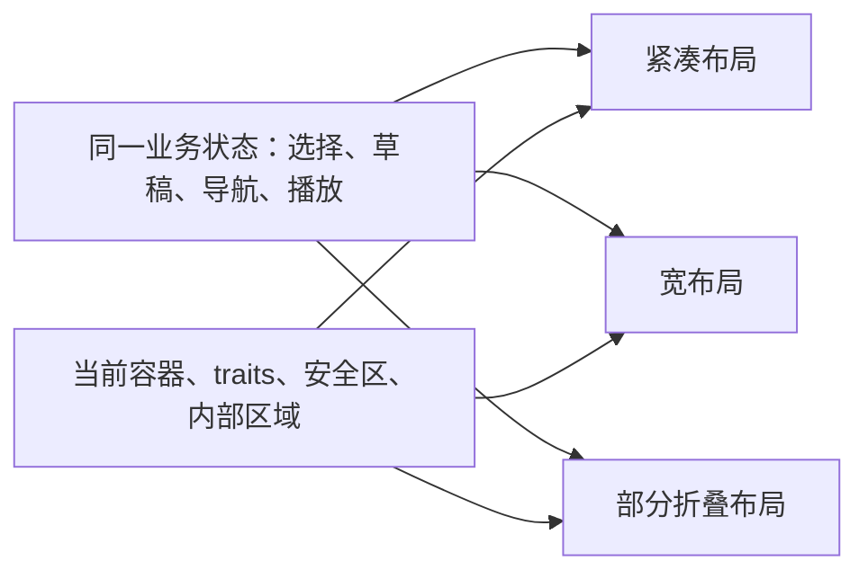

---

## 🔥 <font id=前言>前言</font>

**资料核对日期：2026-10-05。** 面向有 iOS 开发经验、需要理解历史并制定当前适配方案的开发者。覆盖 [**UIKit**](https://developer.apple.com/documentation/uikit)、[**SwiftUI**](https://developer.apple.com/documentation/swiftui) 与 [**Objective-C**](https://developer.apple.com/library/archive/documentation/Cocoa/Conceptual/ProgrammingWithObjectiveC/Introduction/Introduction.html) / <u>[**Swift**](https://www.swift.org/)</u> 工程的共同布局思想。

<font color=red>**屏幕适配的核心，是让同一项任务在不断变化的可用空间里继续完成。折叠屏让“空间变化”发生得更频繁，也让状态连续性成为验收重点。**</font>

本文按“当前事实 → 历史沿革 → 核心概念 → 折叠屏方案 → 工程落地 → 验收”展开。带官方链接的事实用于核验；标为“工程建议”的设计、流程和测试标准是本文提出的实施方案，不代表已经在 Jobs 项目中完成或在折叠真机上验证。

快速入口：[当前发布状态](#current) · [从 2007 年开始](#history) · [折叠屏的变化](#duo-layout) · [UIKit 落地](#uikit) · [SwiftUI 落地](#swiftui) · [验收矩阵](#testing) · [FAQ](#faq)

## 一、<span id="current">当前事实：折叠 iPhone 已发布，适配工具仍有 beta 边界</span> <a href="#前言" style="font-size:17px; color:green;"><b>🔼</b></a> <a href="#🔚" style="font-size:17px; color:green;"><b>🔽</b></a>

### 1.1、发布、预订与发售是三个时间点 <a href="#前言" style="font-size:17px; color:green;"><b>🔼</b></a> <a href="#🔚" style="font-size:17px; color:green;"><b>🔽</b></a>

[**Apple**](https://www.apple.com/) 于 **2026-09-09** 发布首款折叠 iPhone，正式名称为 [**iPhone Duo**](https://www.apple.com/iphone-duo/)。首批市场 **10 月 16 日预订、10 月 23 日发售**，随设备提供 iOS 27.1。因此截至本文日期，应描述为“已正式发布、尚未正式开售”。它支持内屏双 App 分屏，并可运行同一 App 的多个窗口。[Apple 发布公告](https://www.apple.com/newsroom/2026/09/apple-unveils-iphone-duo/)

| 显示器 | 官方硬件规格 | 对开发的直接意义 |
| --- | --- | --- |
| 外屏 | 5.4 英寸，1398 × 2034 px | 较紧凑的入口，必须保留核心任务 |
| 内屏 | 7.6 英寸，1878 × 2670 px | 可增加并列信息与操作空间 |

硬件数值来自 [Apple 技术规格](https://www.apple.com/iphone-duo/specs/)。**英寸和面板像素都不能直接作为 App 的布局尺寸。**布局必须读取实际容器；表中没有推算或承诺内外屏的固定逻辑 pt、缩放因子或安全区常量。

### 1.2、SDK 版本会改变 App 获得的显示行为 <a href="#前言" style="font-size:17px; color:green;"><b>🔼</b></a> <a href="#🔚" style="font-size:17px; color:green;"><b>🔽</b></a>

| 构建基线 | Apple 描述的显示行为 | 工程判断 |
| --- | --- | --- |
| iOS 27 之前的 SDK | 旧 App 可运行，使用兼容显示区域 | “能打开”不能证明已充分适配 |
| iOS 27 SDK | 内屏内容可使用更多区域 | 先处理可调整尺寸的基础问题 |
| iOS 27.1 SDK | 可延伸至屏幕边缘，标准容器支持导航栏、工具栏与 Tab 栏的竖向排列 | 全面检查安全区、工具栏与保留区域 |

依据：[Prepare your app for iPhone Duo](https://developer.apple.com/videos/play/tech-talks/111461/)。**构建 SDK、设备运行系统、最低部署版本是不同维度**；使用新 SDK 不等于必须把所有旧设备排除。新增 API 仍需按系统版本判断可用性。

当前 [Apple 开发者专区](https://developer.apple.com/iphone-duo/) 列出的工具为 [**Xcode**](https://developer.apple.com/xcode/) 27.1 beta；Device Hub 提供 Duo 模拟与姿态操作。本文的 iOS 27.1 专属 API 按当前 beta 文档记录，正式 SDK 发布后需要重新核对签名和行为。

### 1.3、先确认工程能采用新基线 <a href="#前言" style="font-size:17px; color:green;"><b>🔼</b></a> <a href="#🔚" style="font-size:17px; color:green;"><b>🔽</b></a>

Apple 明确规定：**从 iOS / iPadOS 27 起，使用最新 SDK 构建的 UIKit App 必须采用 scene 生命周期，否则无法启动。**采用 scene 生命周期不等于必须开放多窗口；`UIApplicationSupportsMultipleScenes` 可以保持 `false`。[迁移 scene 生命周期](https://developer.apple.com/documentation/uikit/transitioning-to-the-uikit-scene-based-life-cycle)

另一个独立门槛是启动界面：自 iOS / iPadOS 27 起，[**App Store**](https://developer.apple.com/app-store/) 提交要求 `Info.plist` 包含 launch screen 配置；已有合规启动界面通常不需要重做。[TN3208](https://developer.apple.com/documentation/technotes/tn3208-preparing-your-apps-launch-screen-to-meet-app-store-requirements)

工程建议：先审计 scene、launch screen 和旧兼容开关，再升级 SDK、回归布局。避免将启动失败误判为折叠布局错误。[对应 FAQ](#faq-sdk)

## 二、<span id="history">从最开始说起：屏幕适配的历史主线</span> <a href="#前言" style="font-size:17px; color:green;"><b>🔼</b></a> <a href="#🔚" style="font-size:17px; color:green;"><b>🔽</b></a>

### 2.1、2007—2010：固定画布、iPad 与 Retina <a href="#前言" style="font-size:17px; color:green;"><b>🔼</b></a> <a href="#🔚" style="font-size:17px; color:green;"><b>🔽</b></a>

**2007 年，第一代 iPhone 发布。**早期设备处在 320 × 480 的时代，机型少，开发者很容易以固定 frame、坐标和尺寸组织界面。2008 年 3 月公开 beta SDK，7 月 App Store 正式开放；不能把后来 UIKit App 的工程实践全部说成 2007 年已经开放。[初代发布公告](https://www.apple.com/newsroom/2007/01/09Apple-Reinvents-the-Phone-with-iPhone/)、[SDK 公告](https://www.apple.com/newsroom/2008/03/06Apple-Announces-iPhone-2-0-Software-Beta/)、[2008 年 7 月公告](https://www.apple.com/newsroom/2008/07/10iPhone-3G-on-Sale-Tomorrow/)

固定 frame 本身不是错误；问题在于把某次布局结果当成永久尺寸。早期已有横竖屏、导航栏、状态栏和不同文字长度，autoresizing mask 可以表达一部分跟随父容器变化的规则，复杂关系仍容易变成手工计算。

**2010 年**，[**iPad**](https://www.apple.com/ipad/) 与 [**Retina**](https://www.apple.com/newsroom/2010/06/07Apple-Presents-iPhone-4/) 提出了两类不同问题。iPad 需要重新组织导航与信息密度；iPhone 4 则在相同逻辑布局上提高显示清晰度。[iPad 发布公告](https://www.apple.com/newsroom/2010/01/27Apple-Launches-iPad/)

这里必须分清：**更多物理像素，不一定意味着更多逻辑布局空间。**UIKit 的布局、字体和绘图采用 pt，系统再映射为像素。iPhone 4 的典型逻辑尺寸仍是 320 × 480 pt，2× 渲染成为 640 × 960 px。[Apple 绘图指南：Points Versus Pixels](https://developer.apple.com/library/archive/documentation/2DDrawing/Conceptual/DrawingPrintingiOS/GraphicsDrawingOverview/GraphicsDrawingOverview.html)

### 2.2、2012—2014：屏幕变高、变宽，布局关系逐渐取代机型坐标 <a href="#前言" style="font-size:17px; color:green;"><b>🔼</b></a> <a href="#🔚" style="font-size:17px; color:green;"><b>🔽</b></a>

**2012 年，iPhone 5 把高度扩展到 568 pt，宽度仍为 320 pt。**适配要决定多出来的空间如何服务内容，不能只把整页拉长。同年 iOS 6 引入 [**Auto Layout**](https://developer.apple.com/library/archive/documentation/UserExperience/Conceptual/AutolayoutPG/)，让元素之间的对齐、间距和尺寸关系交给约束系统求解。[iPhone 5 公告](https://www.apple.com/newsroom/2012/09/12Apple-Introduces-iPhone-5/)、[Xcode 4 发行说明](https://developer.apple.com/library/archive/documentation/Xcode/Conceptual/RN-Xcode-Archive/Chapters/xc4_release_notes.html)

**2013 年，iOS 7 引入 [**Dynamic Type**](https://developer.apple.com/documentation/uikit/scaling-fonts-automatically)。**用户字体设置开始明确参与布局。容器要能变高、文字要能换行，放不下时改变排列。[iOS 7 迁移指南](https://developer.apple.com/library/archive/documentation/UserExperience/Conceptual/TransitionGuide/AppearanceCustomization.html)

**2014 年，iPhone 6 / 6 Plus 带来更明显的宽度差异，iOS 8 引入 size classes。**compact / regular 用于描述空间环境，通用视图可以共享基础布局，再表达必要差异。这是从“识别哪台机器”向“识别当前环境”的转变。[Xcode 6 发行说明](https://developer.apple.com/library/archive/documentation/Xcode/Conceptual/RN-Xcode-Archive/Chapters/xc6_release_notes.html)

工程启示：约束只是机制。把全部宽高常量写死，再包上 Auto Layout，仍然是固定画布思路。

### 2.3、2015—2017：屏幕不等于窗口，矩形边缘不等于安全区域 <a href="#前言" style="font-size:17px; color:green;"><b>🔼</b></a> <a href="#🔚" style="font-size:17px; color:green;"><b>🔽</b></a>

**2015 年，iOS 9 的 Slide Over / Split View 把多任务带到 iPad。**App 可以只占屏幕的一部分，空间变化不一定伴随设备旋转。Apple 当时已经要求以 traits、size classes 和实际空间判断布局，不能只靠设备类型与方向。[iOS 9 公告](https://www.apple.com/newsroom/2015/09/09iOS-9-Available-as-a-Free-Update-for-iPhone-iPad-iPod-touch-Users-September-16/)、[多任务适配指南](https://developer.apple.com/library/archive/documentation/WindowsViews/Conceptual/AdoptingMultitaskingOniPad/index.html)

**2017 年，iPhone X 与 iOS 11 的 Safe Area 成为重要转折。**背景可以铺到边缘，交互内容需要避开遮挡。`safeAreaLayoutGuide` 将这类信息放到当前视图里，顶部和底部不再适合用统一常量描述。[历史显示器参考](https://developer.apple.com/library/archive/documentation/DeviceInformation/Reference/iOSDeviceCompatibility/Displays/Displays.html)、[safeAreaLayoutGuide](https://developer.apple.com/documentation/uikit/uiview/safearealayoutguide)

工程启示：`屏幕高 − 64 − 49`、固定 `34 pt` 底部留白、靠屏幕高度判断刘海等写法，都是特定设备条件下的经验值，不能继续作为通用布局合同。

### 2.4、2019—2025：声明式布局、多场景与可调整窗口 <a href="#前言" style="font-size:17px; color:green;"><b>🔼</b></a> <a href="#🔚" style="font-size:17px; color:green;"><b>🔽</b></a>

**2019 年，SwiftUI 与 UIScene 扩大了适配的组织方式。**SwiftUI 以声明式视图描述界面，scene 让一个 App 拥有独立的 UI 实例。布局和恢复状态需要与当前场景关联。[SwiftUI 官方公告](https://www.apple.com/ca/newsroom/2019/06/apple-unveils-groundbreaking-new-technologies-for-app-development/)、[多窗口架构](https://developer.apple.com/videos/play/wwdc2019/258/)

**2022 年**，iPadOS 16 的 [**Stage Manager**](https://www.apple.com/newsroom/2022/10/ipados-16-is-available-today/) 加强可调整窗口体验。同年的 SwiftUI `Layout`、`ViewThatFits`、`AnyLayout` 支持按内容和空间选择布局，例如按钮横排放不下时改成竖排。[SwiftUI 自定义布局](https://developer.apple.com/videos/play/wwdc2022/10056/)

同年 iPhone 14 Pro / Pro Max 引入 [**Dynamic Island**](https://www.apple.com/ie/newsroom/2022/09/apple-debuts-iphone-14-pro-and-iphone-14-pro-max/)，将摄像头区域与活动展示结合。工程上继续依赖系统容器与避让信息，不能把“刘海高度”当成全设备固定值。

**2025 年，iPadOS 26 的窗口系统继续强化动态调整尺寸。**`UIRequiresFullScreen` 及相关 iPad 兼容模式开始弃用。弃用不等于立即彻底忽略该 key，更不等于所有旧 App 自动获得完善的窗口布局。[UIRequiresFullScreen 文档](https://developer.apple.com/documentation/bundleresources/information-property-list/uirequiresfullscreen)

### 2.5、2026：从可变窗口继续走向双屏与可变姿态 <a href="#前言" style="font-size:17px; color:green;"><b>🔼</b></a> <a href="#🔚" style="font-size:17px; color:green;"><b>🔽</b></a>

iPhone Duo 把这些已有能力汇合到同一台手机：紧凑外屏、宽内屏、分屏、部分折叠、侧边系统控件、动态保留区域。适配的目标继续是保持熟悉的任务流程，并在新增空间里增加价值。[Duo 设计指南](https://developer.apple.com/design/human-interface-guidelines/designing-for-iphone-duo)

用一条主线理解历史：

```text
固定画布 → pt / px 分离 → 尺寸关系 → 空间类别
         → App 窗口可变 → 安全区域 → 多场景 → 双屏与姿态变化
```

### 2.6、代表性历史尺寸：只用于理解演进 <a href="#前言" style="font-size:17px; color:green;"><b>🔼</b></a> <a href="#🔚" style="font-size:17px; color:green;"><b>🔽</b></a>

| 年份 / 代表设备 | 标准竖屏逻辑尺寸 | scale | 渲染尺寸 | 面板像素 |
| --- | --- | --- | --- | --- |
| 2007—2009 早期 iPhone | 320 × 480 pt | 1× | 320 × 480 px | 320 × 480 px |
| 2010 iPhone 4 | 320 × 480 pt | 2× | 640 × 960 px | 640 × 960 px |
| 2012 iPhone 5 | 320 × 568 pt | 2× | 640 × 1136 px | 640 × 1136 px |
| 2014 iPhone 6 | 375 × 667 pt | 2× | 750 × 1334 px | 750 × 1334 px |
| 2014 iPhone 6 Plus | 414 × 736 pt | 3× | 1242 × 2208 px | 1080 × 1920 px |
| 2017 iPhone X | 375 × 812 pt | 3× | 1125 × 2436 px | 1125 × 2436 px |

**这是标准显示模式下的历史完整屏幕参考，不能当成当前 App 窗口的常量。**Display Zoom、方向、分屏和容器层级都可能改变实际布局空间。

首行以 [3GS 官方规格](https://support.apple.com/en-kw/112307) 与前述绘图指南交叉核对；4 / 5 分别参见 [iPhone 4 公告](https://www.apple.com.cn/newsroom/2010/06/07Apple-Presents-iPhone-4/) 与 [App 预览规格](https://developer.apple.com/cn/help/app-store-connect/reference/app-information/app-preview-specifications/)；6 / X 参见历史 Displays 参考。**6 Plus 以 [QA1909](https://developer.apple.com/library/archive/qa/qa1909/_index.html) 为准**：3× 渲染后还会降采样到面板，不能把 `pt × scale` 一律当成面板像素。[对应 FAQ](#faq-pixels)

## 三、<span id="concepts">先分清七个概念，再讨论适配方案</span> <a href="#前言" style="font-size:17px; color:green;"><b>🔼</b></a> <a href="#🔚" style="font-size:17px; color:green;"><b>🔽</b></a>

| 概念 | 负责什么 | 常见误用 |
| --- | --- | --- |
| 像素 / px | 描述渲染图像或物理面板的像素数量，需注明阶段 | 把渲染像素与面板像素混为一谈 |
| 逻辑坐标 / pt | 布局、字体、交互尺寸 | 将 pt 当成固定毫米或固定物理像素 |
| Scene / Window | 某个 UI 实例获得的空间与生命周期 | 使用唯一全局窗口处理所有页面 |
| View bounds | 当前组件自己的布局空间 | 子视图读取整块屏幕宽度 |
| Size class / traits | 当前环境的粗粒度特征 | 把 regular 等同于 iPad，或当成逐像素变化通知 |
| Safe Area / margins | 边缘避让与内容排布边距 | 把 safe area 与设计 padding 重复相加 |
| Reserved Region | 当前视图中更细的遮挡或分隔区域，含内部区域 | 把折叠区域统一画成固定中间留白 |

前三类基础布局原则见 [Apple Layout 指南](https://developer.apple.com/design/human-interface-guidelines/layout)；保留区域类型见 [ReservedRegion](https://developer.apple.com/documentation/swiftui/reservedregion)。

**布局从当前组件向外读取必要环境。**Cell 看 Cell 的内容容器，弹窗看弹窗容器，控制器看自己的 view，窗口级操作看所属 scene。只有确实处理物理显示能力、输出分辨率等需求时，才读取关联 display 信息。[Preparing your app for iPhone Duo](https://developer.apple.com/documentation/technologyoverviews/preparing-your-app-for-iphone-duo)

### 3.1、尺寸变化与 size class 变化是两条信号 <a href="#前言" style="font-size:17px; color:green;"><b>🔼</b></a> <a href="#🔚" style="font-size:17px; color:green;"><b>🔽</b></a>

同为 regular 的两个窗口，实际宽度也可能不同。只监听 size class，会漏掉类别没变但空间已经变化的情况。

工程建议：**size class 决定大方向，实际容器尺寸完成排布，文字与控件测量决定是否需要局部降级。**例如宽环境显示列表与详情；列表内部的按钮组再根据可用空间和字体决定横排或竖排。

### 3.2、安全区、边距、键盘和内部区域分别处理 <a href="#前言" style="font-size:17px; color:green;"><b>🔼</b></a> <a href="#🔚" style="font-size:17px; color:green;"><b>🔽</b></a>

安全区由视图层级传递，子视图已经处在父视图安全区内时，自身 insets 可能为零；未进入可见视图层级时读取，也可能得到零。[safeAreaInsets](https://developer.apple.com/documentation/uikit/uiview/safeareainsets)

因此不应把下面的简化式当成实际算法：

```text
可用高度 = 屏幕高度 − 顶部常量 − 底部常量 − 键盘高度
```

工程建议：先获得当前容器与边缘安全区域，再分别处理内容边距、键盘交叠和内部保留区域。内部区域可能把空间分成两块，不能只从总宽度减去一个数值。

## 四、<span id="duo-layout">折叠屏具体增加了哪些适配工作</span> <a href="#前言" style="font-size:17px; color:green;"><b>🔼</b></a> <a href="#🔚" style="font-size:17px; color:green;"><b>🔽</b></a>

### 4.1、同一台 iPhone 会跨越不同空间环境 <a href="#前言" style="font-size:17px; color:green;"><b>🔼</b></a> <a href="#🔚" style="font-size:17px; color:green;"><b>🔽</b></a>

Apple 的 Duo 适配说明把外屏竖向描述为 compact width / regular height，外屏横向为 compact / compact，完整内屏为 regular / regular。展开后仍然是 iPhone idiom；不能用 `userInterfaceIdiom == .pad` 作为宽布局的唯一入口。[Prepare your app](https://developer.apple.com/videos/play/tech-talks/111461/)

这些是完整显示环境的基线，**进入 Split View 后仍要读取当前 App 的实际 traits 和 geometry**，不能沿用“内屏永远足够宽”的假设。

内屏一般不遵循 App 声明的 supported interface orientations；布局继续依据实际 traits 与容器 geometry。旧全屏配置的兼容行为另见[第十一章](#compatibility)。

布局也不能只靠 `width > height` 判断横竖屏。它描述的是容器比例，无法独立表达折叠姿态、分屏位置和系统占用区域。

### 4.2、内部保留区域让安全区适配继续向前走 <a href="#前言" style="font-size:17px; color:green;"><b>🔼</b></a> <a href="#🔚" style="font-size:17px; color:green;"><b>🔽</b></a>

| 区域类型 | 含义 | 建议处理 |
| --- | --- | --- |
| `.occlusion` | 摄像头、Dynamic Island 等造成的遮挡 | 关键文字与控件避开 |
| `.division` | 部分折叠造成的内容分隔 | 将合适内容放到可用区域，避免关键操作跨折叠中心 |

区域描述包含局部坐标里的 `frame`、`margins`、`isActive` 等。UIKit 类型在 Swift 中为 `UIView.ReservedRegion`，在 OC 中为 `UIViewReservedRegion`。[UIKit ReservedRegion](https://developer.apple.com/documentation/uikit/uiview/reservedregion)

**Safe Area 提供边缘避让；Reserved Region 提供更细的遮挡和分隔区域信息，也可描述内部区域。**不能认为只接入 safe area，就已经解决内屏中央的折叠分隔。

部分折叠时，折叠分隔区域会激活；完全展开时不应永久留出“中间黑条”。文章、信息流和其他连续滚动内容也无需一折就整块搬家，关键是保持阅读连续、让重要操作可见。[Strike a pose](https://developer.apple.com/videos/play/tech-talks/111463/)

### 4.3、优先使用系统容器，定制内容再接入局部区域 API <a href="#前言" style="font-size:17px; color:green;"><b>🔼</b></a> <a href="#🔚" style="font-size:17px; color:green;"><b>🔽</b></a>

`NavigationSplitView` / `UISplitViewController`、系统 sheet、popover 和 alert 已有相应适配能力。优先使用这些容器，再处理自定义播放器、悬浮按钮、画布等特殊部分。[Duo 设计指南](https://developer.apple.com/design/human-interface-guidelines/designing-for-iphone-duo)

对自定义区域，当前查询入口为：

- SwiftUI：`GeometryProxy.reservedRegions(kind:options:layoutDirectionBehavior:)`。
- UIKit：`UIView.reservedRegions(kind:options:)`。

工程建议：读取当前视图坐标中的区域，明确是否包含 inactive 区域并检查 `isActive`；不要跨坐标系直接比较矩形。当前 beta 的概览与部分查询说明对默认 active 过滤存在措辞差异，实施时以对应 SDK 的查询选项和实际结果核对。[SwiftUI ReservedRegion](https://developer.apple.com/documentation/swiftui/reservedregion)、[UIKit ReservedRegion](https://developer.apple.com/documentation/uikit/uiview/reservedregion)

### 4.4、铰链角度已经公开，但布局有更合适的依据 <a href="#前言" style="font-size:17px; color:green;"><b>🔼</b></a> <a href="#🔚" style="font-size:17px; color:green;"><b>🔽</b></a>

SwiftUI 的 `onHingeChange(isEnabled:_:)` 和 UIKit 的 `UIHingeInteraction` 可以取得铰链状态与连续角度。SwiftUI 用 `Angle` 表达角度，UIKit 的 `UIHinge.angle` 使用弧度；需要处理无可用铰链及 UIKit 的未知状态。[onHingeChange](https://developer.apple.com/documentation/swiftui/view/onhingechange%28isenabled%3A_%3A%29)、[UIHinge](https://developer.apple.com/documentation/uikit/uihinge)

**Apple 的职责划分很明确：角度适合驱动交互或视觉效果；布局使用 arrangement / region API。**不要仅凭一个自设角度阈值推断可点击区域。[多显示器与场景](https://developer.apple.com/videos/play/tech-talks/111464/)

## 五、<span id="policy">布局策略：保留任务结构，让空间增加信息价值</span> <a href="#前言" style="font-size:17px; color:green;"><b>🔼</b></a> <a href="#🔚" style="font-size:17px; color:green;"><b>🔽</b></a>

本章为工程设计建议。**不要把整张手机设计稿乘一个比例，也不要为每种折叠姿态重新发明一套页面。**默认用紧凑 / 宽环境表达主要结构，再由内容适配实际空间。

### 5.1、按页面任务选择扩展方式 <a href="#前言" style="font-size:17px; color:green;"><b>🔼</b></a> <a href="#🔚" style="font-size:17px; color:green;"><b>🔽</b></a>

| 页面 | 紧凑环境 | 宽环境 | 连续性要求 |
| --- | --- | --- | --- |
| 消息 / 邮件 / 订单 | 列表进入详情 | 列表与详情并列 | 当前对象与返回路径保持一致 |
| 登录 / 注册 / 设置 | 单列，可滚动 | 主表单限定阅读宽度，辅助信息可并列 | 草稿、验证状态与焦点保持 |
| 图库 / 商品 / Demo 列表 | 较少列，自适应 Cell | 增加列数或详情侧栏 | 选中项、加载状态不丢失 |
| 文章 / 文档 | 单列阅读 | 限制正文宽度，增加目录或注释 | 用内容 ID 保存阅读锚点 |
| 视频 / 音频 | 内容与核心控制 | 内容与辅助面板配合 | 播放位置及会话保持 |
| 编辑器 / 绘图 | 画布与精简工具 | 更多工具、预览或属性面板 | 编辑模型与撤销栈保持 |

阅读型内容不要无限拉宽；复杂表单不要把输入框铺满整个内屏；按钮也不应按屏幕比例变成超大控件。更大空间通常用于增加并列信息、可见内容和上下文。

### 5.2、双内容布局与导航布局选择不同容器 <a href="#前言" style="font-size:17px; color:green;"><b>🔼</b></a> <a href="#🔚" style="font-size:17px; color:green;"><b>🔽</b></a>

- 列表、详情等导航层级：优先 `NavigationSplitView` 或 `UISplitViewController`。
- 播放器与播放列表、画布与辅助内容等双内容组合：评估 `ArrangementView` 或 `UIArrangementViewController`。

`ArrangementView` 按尺寸、环境与保留区域组织 primary / secondary 内容，可采用 split 或 overlay 风格。**它提供布局，不提供导航基础设施**；避免把导航容器塞进它，也要避免放进滚动容器后导致 secondary 内容无法到达。[ArrangementView 文档](https://developer.apple.com/documentation/swiftui/arrangementview)

### 5.3、边界值来自内容，不能成为新的机型清单 <a href="#前言" style="font-size:17px; color:green;"><b>🔼</b></a> <a href="#🔚" style="font-size:17px; color:green;"><b>🔽</b></a>

工程建议：一般导航结构跟随 size classes；网格列数、表单最大宽度、按钮是否换行，则根据组件内容与可用空间决定。若项目确需自定义阈值，记录其内容依据，并测试阈值两侧、字体放大后的表现。

可以保留有业务意义的固定尺寸，例如图标视觉尺寸、最小点击区域、品牌 Logo 比例。需要淘汰的是依赖某个全屏宽高的整体比例缩放。[对应 FAQ](#faq-scale)

## 六、<span id="uikit">UIKit / OC / Swift 工程落地</span> <a href="#前言" style="font-size:17px; color:green;"><b>🔼</b></a> <a href="#🔚" style="font-size:17px; color:green;"><b>🔽</b></a>

### 6.1、建立当前容器的布局输入 <a href="#前言" style="font-size:17px; color:green;"><b>🔼</b></a> <a href="#🔚" style="font-size:17px; color:green;"><b>🔽</b></a>

建议把布局输入分成：

| 输入 | 读取位置 | 用途 |
| --- | --- | --- |
| 当前尺寸 | 当前 `UIView.bounds` | 排布与测量 |
| 环境 | 当前视图 / 控制器 `traitCollection` | size class、字体、布局方向、display scale |
| 边缘 | 当前 `safeAreaLayoutGuide` / margins | 避开系统栏、组织内容 |
| 保留区域 | 当前 view 的 reserved regions | 处理更细的遮挡、中央分隔等 |
| 场景几何 | 所属 `UIWindowScene.effectiveGeometry` | 窗口级变化与跨显示器行为 |

`effectiveGeometry` 从 iOS 16 提供；`windowScene(_:didUpdateEffectiveGeometry:)` 从 iOS 26 提供。窗口级变化可据此观察，但不能代替子组件自己的布局。[effectiveGeometry](https://developer.apple.com/documentation/uikit/uiwindowscene/effectivegeometry)、[几何变化回调](https://developer.apple.com/documentation/uikit/uiwindowscenedelegate/windowscene%28_%3Adidupdateeffectivegeometry%3A%29)

工程审计可从以下旧写法入手：

| 旧依赖 | 建议改为 |
| --- | --- |
| 用 `UIScreen.main.bounds` 布局 | 当前 view 的 bounds 或所属 scene 的 geometry |
| 全局保存启动时的屏宽 / 屏高 | 在正常布局流程中读取当前容器 |
| 任意取 `connectedScenes.first` 或全局 keyWindow | 从操作发起的 view / window 定位所属 scene |
| `screenWidth / 375` 缩放整页 | 约束关系、内容测量与自适应容器 |
| `safeAreaInsets.left * 2` | 逐边读取实际 insets，不假定对称 |
| 用唯一 `UIScreen.main.scale` 生成位图 | 当前环境的 `displayScale`；确需显示器信息时动态读取所属 scene |

双屏设备上的“main screen”存在语义歧义，布局应避免此全局假设。[Preparing your app](https://developer.apple.com/documentation/technologyoverviews/preparing-your-app-for-iphone-duo)

### 6.2、让尺寸、traits 与安全区变化共同驱动更新 <a href="#前言" style="font-size:17px; color:green;"><b>🔼</b></a> <a href="#🔚" style="font-size:17px; color:green;"><b>🔽</b></a>

iOS 17 起，`traitCollectionDidChange` 已弃用，可用 `registerForTraitChanges` 只订阅真正依赖的 traits。初始配置不能依赖“变化回调必然调用一次”；在进入层级、环境有效的阶段完成首次布局，后续再处理变化。`viewIsAppearing` 可用于相应的初始环境读取。[Unleash the UIKit trait system](https://developer.apple.com/videos/play/wwdc2023/10057/)

工程建议：

1、创建 UI、绑定事件和保存引用只做一次。

2、尺寸变化由正常 layout 流程处理；traits、安全区或保留区域变化使相关布局失效。

3、先计算需要的布局结构，再只更新发生变化的约束或容器配置。

4、在布局结构改变后恢复必要的选择、焦点和滚动锚点。

5、避免每次 `layoutSubviews` 都重新添加子视图、重复绑定事件、重新发请求或重建播放器。

同一类组件共享布局策略，避免每个 VC 自己维护一套“屏宽宏 + 是否刘海 + 是否折叠”的判断。[对应 FAQ](#faq-traits)

### 6.3、Jobs 工程的承接方式 <a href="#前言" style="font-size:17px; color:green;"><b>🔼</b></a> <a href="#🔚" style="font-size:17px; color:green;"><b>🔽</b></a>

以下是依据既有 Jobs 约定提出的落地建议，**本文没有修改任何业务仓库**：

- Swift 自维护 UIKit 代码继续通过 [**SnapKit**](https://github.com/SnapKit/SnapKit) 表达约束；OC 自维护代码继续通过 [**Masonry**](https://github.com/SnapKit/Masonry) 表达约束。布局机制仍是 Auto Layout，不因为折叠屏更换一套布局体系。
- 可更新的 UI、约束和模型保留属性引用。OC 新项目在自建 Pod 中承接公共能力；OC 老项目承接到主工程既有模块，保持行为一致。
- 新系统 API 的版本差异收在真实归属的适配层中。链式 DSL 的布局配置方法返回可继续使用的对象，真正查询保持查询语义。
- 给悬浮调试入口、弹窗、抽屉、开屏页、登录页和播放器做专项检查。这些自定义区域最容易依赖旧的全屏尺寸或栏高度。
- 动态列表的空态与重载入口一起适配容器；数据成功、空结果、加载中和本地演示回退都要能正常排布，不能只验证有数据的首屏。

## 七、<span id="swiftui">SwiftUI 落地：布局跟随空间，状态跟随任务</span> <a href="#前言" style="font-size:17px; color:green;"><b>🔼</b></a> <a href="#🔚" style="font-size:17px; color:green;"><b>🔽</b></a>

### 7.1、先用布局容器表达关系 <a href="#前言" style="font-size:17px; color:green;"><b>🔼</b></a> <a href="#🔚" style="font-size:17px; color:green;"><b>🔽</b></a>

SwiftUI 的父布局提出空间建议，子视图报告自身尺寸，容器完成排布。stacks、grids、lists、forms 和 scroll views 适合承接日常布局；`ViewThatFits` 可在候选布局中选择第一个放得下的方案。[布局基础](https://developer.apple.com/documentation/swiftui/layout-fundamentals)

| 需求 | 优先考虑 |
| --- | --- |
| 列表与详情导航 | `NavigationSplitView` |
| 普通单列页面 | `VStack`、`Form`、`List`、滚动容器 |
| 按钮横排放不下 | `ViewThatFits`，提供横排 / 竖排候选 |
| 复用的特殊排布 | `Layout` |
| 切换布局形态 | 评估 `AnyLayout`，核对视图身份 |
| 双内容与折叠区域协同 | iOS 27.1 的 `ArrangementView` |

`Layout` 和 `AnyLayout` 的能力与边界参见 [自定义布局官方示例](https://developer.apple.com/documentation/swiftui/composing-custom-layouts-with-swiftui)。必要时读取局部 geometry，不需要先把整个界面变成手工坐标计算。

### 7.2、GeometryReader 负责测量自己的容器 <a href="#前言" style="font-size:17px; color:green;"><b>🔼</b></a> <a href="#🔚" style="font-size:17px; color:green;"><b>🔽</b></a>

`GeometryReader` 描述的是自己的尺寸与坐标空间，并具有灵活的首选尺寸。[GeometryReader](https://developer.apple.com/documentation/swiftui/geometryreader)

工程建议：仅在需要测量的局部引入。避免“测量 → 修改 frame → 再次测量”的反馈循环；复杂测量与放置优先放到 `Layout` 内完成。不要读取 geometry 后，再套一个固定全屏宽度抵消父容器限制。[SwiftUI 布局讲解](https://developer.apple.com/videos/play/wwdc2022/10056/)

### 7.3、不要让布局分支掌管业务模型的生命周期 <a href="#前言" style="font-size:17px; color:green;"><b>🔼</b></a> <a href="#🔚" style="font-size:17px; color:green;"><b>🔽</b></a>

工程建议：把页面模型、选中 ID、输入草稿、搜索词和导航语义放在能跨布局变化存活的状态层。紧凑与宽布局只消费这些状态；不能分别创建两个互不关联的详情模型。

尤其检查：

- 条件分支改变视图身份后，局部状态是否被重新初始化。
- 展开时列表选择是否仍指向同一详情，折回时当前详情是否仍可返回。
- `.task`、出现回调或包装 UIKit 组件是否引发重复请求 / 重复播放器创建。
- 需要替换布局树时，焦点、滚动位置和呈现状态是否有明确恢复策略。

SwiftUI 自动重新计算界面，不会自动替业务设计状态所有权。[对应 FAQ](#faq-state)

## 八、<span id="bars">侧边工具栏：不能继续假定导航栏在顶、Tab 在底</span> <a href="#前言" style="font-size:17px; color:green;"><b>🔼</b></a> <a href="#🔚" style="font-size:17px; color:green;"><b>🔽</b></a>

Duo 外屏与内屏横向采用新的侧边控件组织；内屏竖向可回到横向栏。系统会依照容器与当前环境安排控件，不能把所有姿态都固定成右侧一列。[Duo 设计讲解](https://developer.apple.com/videos/play/tech-talks/111466/)

### 8.1、系统导航容器与手工放置的栏有不同待遇 <a href="#前言" style="font-size:17px; color:green;"><b>🔼</b></a> <a href="#🔚" style="font-size:17px; color:green;"><b>🔽</b></a>

SwiftUI 应由 `NavigationStack` / `NavigationSplitView` 配合 toolbar 承接；UIKit 优先 `UINavigationController` / `UITabBarController`。自行放置 `UINavigationBar`、`UIToolbar`、`UITabBar`，不会自动获得相同的系统管理行为。

提供工具项的图标与标题，让系统选择表示并在 overflow 中使用完整信息。自定义项需要核对竖向表示；相关入口包括 `.axisBehavior(...)`、SwiftUI `toolbarVerticalEdge` 与 UIKit `traitCollection.verticalBarEdge`。核心操作的显示优先级也应明确。[Raise the bar](https://developer.apple.com/videos/play/tech-talks/111462/)

### 8.2、自定义栏的工程验收重点 <a href="#前言" style="font-size:17px; color:green;"><b>🔼</b></a> <a href="#🔚" style="font-size:17px; color:green;"><b>🔽</b></a>

工程建议：逐项检查返回、关闭、提交、删除、搜索和 Tab 入口。金额、进度等有独立语义的文本不能为了竖栏强行隐藏；图标形式仍应提供可访问性名称。

检查工具项溢出后能否操作、键盘弹出后核心动作能否找到、左右分屏时是否压到折叠中心、RTL 下位置与文字顺序是否合理。自定义栏确实需要关闭系统竖向行为时，使用公开配置并记录设计依据，避免直接移除系统安全区。

## 九、<span id="content">文字、键盘、资源与无障碍适配</span> <a href="#前言" style="font-size:17px; color:green;"><b>🔼</b></a> <a href="#🔚" style="font-size:17px; color:green;"><b>🔽</b></a>

### 9.1、字体变大与窗口变窄必须同时成立 <a href="#前言" style="font-size:17px; color:green;"><b>🔼</b></a> <a href="#🔚" style="font-size:17px; color:green;"><b>🔽</b></a>

UIKit 使用文本样式与 `adjustsFontForContentSizeCategory`；自定义字体通过 `UIFontMetrics` 缩放。字体变大后，还要允许文本和容器重新排布。[字体自动缩放](https://developer.apple.com/documentation/uikit/scaling-fonts-automatically)、[UIFontMetrics](https://developer.apple.com/documentation/uikit/uifontmetrics)

工程建议：长中文、长英文单词、德文复合词、阿拉伯语、错误说明和无数据文案一起测试。表单、按钮组和 Cell 能换行、变高或改成竖排；核心信息不依赖不断缩小字体才能显示。

### 9.2、键盘是独立变化来源 <a href="#前言" style="font-size:17px; color:green;"><b>🔼</b></a> <a href="#🔚" style="font-size:17px; color:green;"><b>🔽</b></a>

UIKit 从 iOS 15 提供 `keyboardLayoutGuide`。默认只跟随停靠键盘；`followsUndockedKeyboard = true` 可以跟随浮动 / 非停靠键盘，相关追踪布局还需按 guide 的规则配置。[键盘布局指南](https://developer.apple.com/documentation/uikit/adjusting-your-layout-with-keyboard-layout-guide)、[followsUndockedKeyboard](https://developer.apple.com/documentation/uikit/uikeyboardlayoutguide/followsundockedkeyboard)

工程建议：旧系统兼容路径必须把键盘 frame 转换到当前窗口 / 视图坐标，计算实际交叠，不能无条件减去完整键盘高度。SwiftUI 先采用系统键盘安全区域与滚动容器，再处理特殊固定控件。

折叠时正在输入的表单，需要保留文本、选区与编辑意图，保证输入位置和提交动作可见。输入附属工具仍与输入区域保持联系，不能仅因系统工具栏变为竖向就一起搬到侧边。

### 9.3、资源清晰度与布局密度分别控制 <a href="#前言" style="font-size:17px; color:green;"><b>🔼</b></a> <a href="#🔚" style="font-size:17px; color:green;"><b>🔽</b></a>

工程建议：位图资源提供合适分辨率，图标优先使用项目既有可缩放资源或 [**SF Symbols**](https://developer.apple.com/sf-symbols/)。内容图保持正确比例，按用途选择完整显示或裁切；人物主体和重要文字不能因窗口比例改变被无意裁掉。

位图渲染读取当前环境的 display scale，不能缓存唯一主屏的倍率。图库缩略图按显示需求采样，避免每次折叠都重新解码原图；视频和画布也要分别管理显示尺寸与内容坐标。

### 9.4、布局变化也会改变访问顺序 <a href="#前言" style="font-size:17px; color:green;"><b>🔼</b></a> <a href="#🔚" style="font-size:17px; color:green;"><b>🔽</b></a>

工程建议：验收 [**VoiceOver**](https://developer.apple.com/accessibility/)、较大字体、减少动态效果、提高对比度、降低透明度和 RTL。单列变双列后，阅读顺序仍应与任务一致；隐藏面板中的控件不能继续抢占焦点；关键状态不能只通过位置、动画或颜色表达。

宽屏内容更多，必须继续维持清晰的分组与可操作范围。每次折叠都大幅搬动按钮，会同时损害视觉定位和辅助技术使用。

## 十、<span id="continuity">状态连续性、多窗口与双屏能力边界</span> <a href="#前言" style="font-size:17px; color:green;"><b>🔼</b></a> <a href="#🔚" style="font-size:17px; color:green;"><b>🔽</b></a>

### 10.1、同一项任务跨布局继续进行 <a href="#前言" style="font-size:17px; color:green;"><b>🔼</b></a> <a href="#🔚" style="font-size:17px; color:green;"><b>🔽</b></a>

本节为工程状态设计建议：

| 状态 | 推荐保存方式 | 需要避免 |
| --- | --- | --- |
| 当前详情 | 稳定业务 ID | 折回后默认跳到第一项 |
| 导航 | 业务路径与选择 | 保存仅适用于双列的瞬时结构 |
| 草稿与验证 | 页面 / 任务模型 | 布局分支各自创建一份草稿 |
| 滚动 | 内容 ID 与必要相对偏移 | 把旧 `contentOffset` 原样当成新布局位置 |
| 播放 | 独立播放会话与时间点 | 每次换屏重建播放源 |
| 请求 / 上传 | 有明确作用域的任务 | 折叠一次重新提交一次 |
| 弹窗 | 呈现意图与所属 scene | 对任意全局 keyWindow 弹出 |

紧凑详情变成双列详情，改变的是呈现结构，业务对象应保持一致。使用 [**Mermaid**](https://mermaid.js.org) 表示这一关系：



### 10.2、多窗口需要分别管理呈现状态 <a href="#前言" style="font-size:17px; color:green;"><b>🔼</b></a> <a href="#🔚" style="font-size:17px; color:green;"><b>🔽</b></a>

Duo 内屏支持同 App 多实例，外屏不能创建新窗口；创建能力会动态变化，需要处理请求失败。`UIWindowSceneActivationAction` 可在不可用时自动隐藏相应动作。[多显示器与场景](https://developer.apple.com/videos/play/tech-talks/111464/)

工程建议：账号、数据库和资源缓存可按产品需要共享；每个 scene 的导航、搜索、滚动、编辑会话与弹窗各自拥有。一个窗口关闭，不应无条件取消另一个窗口的业务任务。

### 10.3、内外屏同时显示不是无限制的普通双窗口 <a href="#前言" style="font-size:17px; color:green;"><b>🔼</b></a> <a href="#🔚" style="font-size:17px; color:green;"><b>🔽</b></a>

scene accessories 可表达与主 UI 配对的补充内容。Duo 的 `CameraCaptureAccessory` 可在**内屏全屏、相机采集会话激活**时向外屏提供补充 UI，其可用性由系统动态管理。[多显示器与场景](https://developer.apple.com/videos/play/tech-talks/111464/)

因此产品方案应依照具体 accessory 的能力与可用性设计，不能承诺任何 App 都能任意让内外屏同时运行两个普通主界面。[对应 FAQ](#faq-two-screens)

## 十一、<span id="compatibility">当前 API 与旧系统兼容策略</span> <a href="#前言" style="font-size:17px; color:green;"><b>🔼</b></a> <a href="#🔚" style="font-size:17px; color:green;"><b>🔽</b></a>

### 11.1、API 速查：按职责选入口 <a href="#前言" style="font-size:17px; color:green;"><b>🔼</b></a> <a href="#🔚" style="font-size:17px; color:green;"><b>🔽</b></a>

| 职责 | SwiftUI | UIKit / OC 对应入口 | 版本基线 |
| --- | --- | --- | --- |
| 双内容排布 | `ArrangementView` | `UIArrangementViewController` | iOS 27.1 beta |
| 内部区域查询 | `GeometryProxy.reservedRegions(...)` | `UIView.reservedRegions(...)` | iOS 27.1 beta |
| 内部区域数据 | `ReservedRegion` | `UIView.ReservedRegion` / `UIViewReservedRegion` | iOS 27.1 beta |
| 铰链变化 | `onHingeChange(isEnabled:_:)` | `UIHingeInteraction` | iOS 27.1 beta |
| 铰链数据 | `DeviceHingeContext` / `DeviceHinge` | `UIHingeInteraction.Update` / `UIHinge` | iOS 27.1 beta |
| 键盘空间 | 系统容器与安全区域 | `keyboardLayoutGuide` | UIKit iOS 15+ |
| 场景几何 | 按当前容器获取空间 | `effectiveGeometry` | UIKit iOS 16+ |
| 场景几何变化 | 结合框架环境更新 | `didUpdateEffectiveGeometry` 回调 | UIKit iOS 26+ |

来源：[ArrangementView](https://developer.apple.com/documentation/swiftui/arrangementview)、[UIArrangementViewController](https://developer.apple.com/documentation/uikit/uiarrangementviewcontroller)、[ReservedRegion](https://developer.apple.com/documentation/swiftui/reservedregion)、[UIHingeInteraction](https://developer.apple.com/documentation/uikit/uihingeinteraction)、[DeviceHinge](https://developer.apple.com/documentation/swiftui/devicehinge)、[keyboardLayoutGuide](https://developer.apple.com/documentation/uikit/uiview/keyboardlayoutguide)、[effectiveGeometry](https://developer.apple.com/documentation/uikit/uiwindowscene/effectivegeometry)、[场景回调](https://developer.apple.com/documentation/uikit/uiwindowscenedelegate/windowscene%28_%3Adidupdateeffectivegeometry%3A%29)。

### 11.2、UIRequiresFullScreen 不能作为拒绝尺寸变化的办法 <a href="#前言" style="font-size:17px; color:green;"><b>🔼</b></a> <a href="#🔚" style="font-size:17px; color:green;"><b>🔽</b></a>

Apple 最新 TN3192 区分了版本：iOS 27 之前，该 key 只配置 iPadOS，iPhone 忽略；**iOS / iPadOS 27 起，以 iOS 27 SDK 或更新 SDK 构建且满足对应配置时，它采用离散调整 scene 尺寸的兼容行为，不能再让 App 完全退出 resizing。**具体还受 `UIRequiresFullScreenIgnoredStartingWithVersion` 控制。[TN3192](https://developer.apple.com/documentation/technotes/tn3192-migrating-your-app-from-the-deprecated-uirequiresfullscreen-key)

Duo 官方讲解同样指出：系统继续处理该 key，但设备开合仍然会改变 App 尺寸。方向声明与兼容缩放也有特定行为，不能把“锁竖屏”理解为“永远只会得到旧手机画布”。[Prepare your app](https://developer.apple.com/videos/play/tech-talks/111461/)

工程建议：完成布局与多任务回归后迁移旧兼容 key；需要保留旧版本行为时使用官方版本配置。不能为了隐藏布局问题盲目添加全屏 key，也不能尚未修复就直接删掉所有兼容配置。

### 11.3、兼容层的建议流程 <a href="#前言" style="font-size:17px; color:green;"><b>🔼</b></a> <a href="#🔚" style="font-size:17px; color:green;"><b>🔽</b></a>

以下是逻辑示意，不是可直接编译的 API 示例：

```text
获得当前容器尺寸、traits、边缘安全区域和内容状态
    ↓
按当前空间选择紧凑 / 宽布局
    ↓
新区域 API 可用：读取局部保留区域并做必要调整
旧系统：继续常规布局与已有避让规则
    ↓
更新发生变化的布局配置
    ↓
恢复选择、焦点、阅读锚点和当前操作
```

工程建议：能力不存在时退回常规体验；保留区域没有激活时不要强加中央间距。铰链效果应可关闭，布局与核心任务不依赖效果回调才能正常工作。

## 十二、<span id="testing">测试与验收：测操作中的变化，而不只截首屏</span> <a href="#前言" style="font-size:17px; color:green;"><b>🔼</b></a> <a href="#🔚" style="font-size:17px; color:green;"><b>🔽</b></a>

本章为工程验收建议。Device Hub 可以模拟 Duo 的打开、关闭、旋转和折叠，适合开展首轮回归；正式版系统与真机仍需补充验证。[Apple 开发者专区](https://developer.apple.com/iphone-duo/)、[Prepare your app](https://developer.apple.com/videos/play/tech-talks/111461/)

### 12.1、覆盖环境与任务的交叉变化 <a href="#前言" style="font-size:17px; color:green;"><b>🔼</b></a> <a href="#🔚" style="font-size:17px; color:green;"><b>🔽</b></a>

| 测试维度 | 最小建议覆盖 | 验收结果 |
| --- | --- | --- |
| 传统 iPhone | 最小支持尺寸、较大尺寸、横竖环境 | 无裁切，核心动作可达 |
| Duo 基本姿态 | 外屏、内屏、部分折叠、旋转 | 布局随当前环境更新 |
| 运行中切换 | 外屏 → 内屏 → 部分折叠 → 外屏 | 仍在同一项任务上 |
| Duo 分屏 | App 位于左侧、右侧；与另一 App 配对 | 当前空间正确，无全屏假设 |
| 键盘 | 编辑中开合、硬件键盘；平台支持的浮动情况 | 文本与焦点保持，提交入口可达 |
| 文字与语言 | 最大支持字体、长文案、RTL | 不重叠，不靠极小字体兜底 |
| 特殊组件 | 弹窗、抽屉、悬浮按钮、播放器、相机 | 不跨遮挡区，状态正确 |
| 数据状态 | 加载中、空列表、错误、离线演示、成功响应 | 各状态都可操作与重载 |
| 生命周期 | 各姿态冷启动、后台恢复、scene 重连 | 状态恢复有明确行为 |
| iPad 与多窗口 | 支持范围内的分屏、窗口、多实例 | 布局与状态互不串扰 |
| 无障碍 | VoiceOver、减少动态效果、对比度设置 | 顺序与反馈可理解 |

不需要机械跑满所有维度的笛卡尔积。优先验证组合风险高的场景：大字体 + 分屏、输入中 + 折叠、播放器 + 换屏、弹窗打开 + 尺寸变化。

### 12.2、四条可以实际照着执行的回归路径 <a href="#前言" style="font-size:17px; color:green;"><b>🔼</b></a> <a href="#🔚" style="font-size:17px; color:green;"><b>🔽</b></a>

1、**订单 / 消息详情**：外屏选中一项 → 进入详情 → 展开 → 部分折叠 → 分屏 → 折回。预期始终显示同一业务 ID，返回路径合理，没有重复请求或重复操作。

2、**登录 / 编辑表单**：输入长文字 → 键盘显示时展开 → 旋转 → 折回。预期草稿与验证状态保持，编辑位置可见，提交按钮仍能操作。

3、**播放器**：开始播放 → 拖到中间位置 → 展开与折叠 → 进入分屏。预期播放不中断、不回到零，控制可见，画面裁切符合产品策略。

4、**自定义弹窗 / 悬浮入口**：打开弹窗或拖动入口 → 改变空间 → 切换左右分屏。预期弹窗属于正确 scene，入口回到当前可操作区域，不挡关键内容。

### 12.3、诊断信息要能解释错误 <a href="#前言" style="font-size:17px; color:green;"><b>🔼</b></a> <a href="#🔚" style="font-size:17px; color:green;"><b>🔽</b></a>

建议在 Debug 观察容器 bounds、size classes、逐边 safe area、有效内部区域、scene 标识与实际布局结构。配合约束冲突日志和性能工具判断问题来源，避免只记录机型名。

滚动与 Cell 高度缓存应包含真正影响测量的条件，例如容器宽度、内容版本、字体类别和语言；布局只改变位置时，无需无条件清空所有缓存。调试记录不输出用户输入内容或敏感数据。

验收可分两级：**基础通过**是所有状态下能看、能点、能继续任务；**体验通过**是宽空间确实更高效、折叠调整可追踪、阅读与状态保持自然。

## 十三、<span id="roadmap">落地顺序：先修基础，再增加折叠体验</span> <a href="#前言" style="font-size:17px; color:green;"><b>🔼</b></a> <a href="#🔚" style="font-size:17px; color:green;"><b>🔽</b></a>

本章为工程推进建议。

| 优先级 | 工作 | 完成证据 |
| --- | --- | --- |
| P0：工程与布局基线 | scene / launch screen；清理全屏尺寸依赖；安全区；键盘；核心动作可达 | 新 SDK 能正常启动，紧凑与宽环境主流程通过 |
| P1：任务连续 | 导航、选择、草稿、播放与请求作用域；左右分屏 | 完整动态切换路径通过 |
| P2：Duo 专属排布 | 系统竖栏；region / arrangement；内部区域变化 | 特殊组件不跨关键区域，系统控件行为合理 |
| P3：体验增强 | 铰链效果、相机 accessory、确有价值的多窗口 | 能力可用时增强，不可用时正常降级 |

建议先挑一个“列表 + 详情”与一个“长表单”作为参考页面，再推广到公共组件。每个页面按任务风险验收，不能把统一改名或宏替换当成适配完成。

文档讨论的下一阶段可以是一个独立 Demo：同一份数据与状态，在传统 iPhone、Duo、iPad 窗口中切换布局，用可观察输入解释每一次变化。是否进入具体仓库改造，应根据页面清单与实际源码再制定范围。

## 十四、<span id="faq">FAQ：适配讨论与面试里的关键回答</span> <a href="#前言" style="font-size:17px; color:green;"><b>🔼</b></a> <a href="#🔚" style="font-size:17px; color:green;"><b>🔽</b></a>

### 14.1、<span id="faq-scale">按屏幕宽度等比缩放设计稿，是否足够？</span> <a href="#前言" style="font-size:17px; color:green;"><b>🔼</b></a> <a href="#🔚" style="font-size:17px; color:green;"><b>🔽</b></a>

**不足。**它可能扩大字体、点击区域和空白，却没有提高信息组织效率，也无法表达折叠分隔、键盘与大字体。应按内容与空间重排；等比缩放保留给明确需要保持比例的图片或画布内容。[回到布局策略](#policy)

### 14.2、<span id="faq-pixels">Retina、pt、px 和 scale 如何理解？</span> <a href="#前言" style="font-size:17px; color:green;"><b>🔼</b></a> <a href="#🔚" style="font-size:17px; color:green;"><b>🔽</b></a>

**pt 用于逻辑布局，px 用于像素表示，scale 描述对应的渲染倍率。**2×、3× 是每个坐标轴的倍率，对应面积像素数为 4 倍、9 倍。面板可能还有后续缩放，`scale` 与 `nativeScale` 可能不同，因此 `pt × scale` 不总等于物理面板像素。iPhone 6 Plus 的 3× 渲染与降采样就是历史实例。[回到历史尺寸](#history)

### 14.3、<span id="faq-traits">有 Auto Layout 和 size classes，为什么还会适配失败？</span> <a href="#前言" style="font-size:17px; color:green;"><b>🔼</b></a> <a href="#🔚" style="font-size:17px; color:green;"><b>🔽</b></a>

**机制正确不代表规则正确。**固定宽高、过强约束、错误测量时机、未处理类别不变的尺寸变化、重复添加子视图，都能使布局失败。还要处理文字、内部区域和业务状态。[回到概念](#concepts)、[回到 UIKit](#uikit)

### 14.4、展开后是否应该按 iPad 处理？ <a href="#前言" style="font-size:17px; color:green;"><b>🔼</b></a> <a href="#🔚" style="font-size:17px; color:green;"><b>🔽</b></a>

**仍然是 iPhone。**宽空间可以共享 iPad 上成熟的列表详情、侧栏和网格思路，但判断入口应是当前环境与任务，不能依赖“只有 iPad 才能宽布局”。[回到 Duo 环境](#duo-layout)

### 14.5、只尊重 Safe Area，是否已经完成折叠适配？ <a href="#前言" style="font-size:17px; color:green;"><b>🔼</b></a> <a href="#🔚" style="font-size:17px; color:green;"><b>🔽</b></a>

**还要检查内部保留区域。**中央分隔与动态内部遮挡，需要系统适配容器或 Reserved Region 信息处理。完全展开时不应始终保留中央禁区。[回到区域处理](#duo-layout)

### 14.6、<span id="faq-state">SwiftUI 会不会自动保存折叠前的全部状态？</span> <a href="#前言" style="font-size:17px; color:green;"><b>🔼</b></a> <a href="#🔚" style="font-size:17px; color:green;"><b>🔽</b></a>

**不会替业务决定状态所有权。**视图身份改变可能影响局部状态；模型、草稿和导航语义应跨布局存活，并验证焦点与滚动恢复。[回到 SwiftUI](#swiftui)、[回到连续性](#continuity)

### 14.7、<span id="faq-two-screens">能否让任何 App 在内外屏同时显示两个主界面？</span> <a href="#前言" style="font-size:17px; color:green;"><b>🔼</b></a> <a href="#🔚" style="font-size:17px; color:green;"><b>🔽</b></a>

**必须遵循具体场景能力。**CameraCaptureAccessory 有条件地显示外屏补充 UI；它不能推导出无限制的双主窗口权限。内屏多窗口与同时驱动内外屏也属于不同能力。[回到多场景边界](#continuity)

### 14.8、<span id="faq-sdk">升级 SDK 是否等于适配完成？</span> <a href="#前言" style="font-size:17px; color:green;"><b>🔼</b></a> <a href="#🔚" style="font-size:17px; color:green;"><b>🔽</b></a>

**升级会启用新的显示行为，也可能暴露旧假设。**工程需满足 scene 和启动界面要求，再回归空间、侧边栏、区域、状态与兼容分支。编译通过只证明类型与语法在该工具链下成立，不能证明真机交互通过。[回到当前基线](#current)、[回到验收](#testing)

## 十五、<span id="sources">官方资料与后续复核入口</span> <a href="#前言" style="font-size:17px; color:green;"><b>🔼</b></a> <a href="#🔚" style="font-size:17px; color:green;"><b>🔽</b></a>

| 主题 | 官方入口 | 复核内容 |
| --- | --- | --- |
| 当前产品 | [Duo 公告](https://www.apple.com/newsroom/2026/09/apple-unveils-iphone-duo/)、[技术规格](https://www.apple.com/iphone-duo/specs/) | 发布时间、开售状态、硬件规格 |
| 当前工具 | [Get ready for iPhone Duo](https://developer.apple.com/iphone-duo/) | SDK 状态、Device Hub、实验室与资料 |
| 总体布局 | [Preparing your app](https://developer.apple.com/documentation/technologyoverviews/preparing-your-app-for-iphone-duo)、[HIG](https://developer.apple.com/design/human-interface-guidelines/designing-for-iphone-duo) | 系统适配模式与设计边界 |
| 基础适配 | [Prepare your app 视频](https://developer.apple.com/videos/play/tech-talks/111461/) | SDK 差异、traits、safe area、兼容行为 |
| 侧边工具栏 | [Raise the bar](https://developer.apple.com/videos/play/tech-talks/111462/) | 容器、axis、overflow、自定义栏 |
| 保留区域与排布 | [Strike a pose](https://developer.apple.com/videos/play/tech-talks/111463/) | 区域激活、局部位移、双内容布局 |
| 铰链与多场景 | [Multiple displays and scenes](https://developer.apple.com/videos/play/tech-talks/111464/) | 铰链用途、新窗口与 accessory 边界 |
| 工程生命周期 | [Scene 迁移](https://developer.apple.com/documentation/uikit/transitioning-to-the-uikit-scene-based-life-cycle)、[TN3208](https://developer.apple.com/documentation/technotes/tn3208-preparing-your-apps-launch-screen-to-meet-app-store-requirements) | 最新 SDK 的启动与提交要求 |
| 全屏兼容模式 | [TN3192](https://developer.apple.com/documentation/technotes/tn3192-migrating-your-app-from-the-deprecated-uirequiresfullscreen-key) | iOS / iPadOS 版本差异与离散 resizing |
| 历史像素路径 | [QA1909](https://developer.apple.com/library/archive/qa/qa1909/_index.html)、[绘图指南](https://developer.apple.com/library/archive/documentation/2DDrawing/Conceptual/DrawingPrintingiOS/GraphicsDrawingOverview/GraphicsDrawingOverview.html) | 逻辑坐标、渲染倍率与面板区别 |
| 通用设计 | [Layout](https://developer.apple.com/design/human-interface-guidelines/layout) | 大字体、语言、窗口与空间适配 |

**验证记录：**产品状态、历史关键节点和本文列出的 API / 版本边界已按 Apple 官方资料核对；iOS 27.1 新增 API 当前仍按 beta 资料记录。本文未执行任何业务项目构建，也未完成 Duo 实体设备验证。后续实施需要保存具体 SDK、系统版本、模拟器 / 真机环境与测试结果。

正文可离线阅读；封面图片与官方资料链接需要网络。本文为独立专题，没有新增依赖、提交或修改业务源码。

<a id="🔚" href="#前言" style="font-size:17px; color:green; font-weight:bold;">我是有底线的➤点我回到首页</a>
