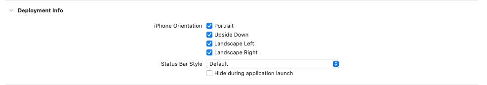

<iframe
  src="https://dragonir.github.io/3d/#/earth"
  title="Jobs出品，必属精品"
  width="100%"
  height="400"
  style="border:0; display:block;"
  allowfullscreen>
</iframe>


## 一、第三方支援

```ruby
pod 'HXRotationTool' # https://github.com/TheLittleBoy/HXRotationTool
```

## 二、xcode 设置



## 三、`Info.plist` 设置

* iPhone 应用

  ```xml
  <key>UISupportedInterfaceOrientations</key>
  <array>
      <string>UIInterfaceOrientationPortrait</string>
      <string>UIInterfaceOrientationPortraitUpsideDown</string>
      <string>UIInterfaceOrientationLandscapeLeft</string>
      <string>UIInterfaceOrientationLandscapeRight</string>
  </array>
  ```

* iPad 应用

  ```xml
  <key>UISupportedInterfaceOrientations~ipad</key>
  <array>
      <string>UIInterfaceOrientationPortrait</string>
      <string>UIInterfaceOrientationPortraitUpsideDown</string>
      <string>UIInterfaceOrientationLandscapeLeft</string>
      <string>UIInterfaceOrientationLandscapeRight</string>
  </array>
  ```

## 四、代码处理

* <font color=green>**相关枚举说明**</font>

  * `UIInterfaceOrientationMask`用于指定应用支持的界面方向的位掩码。它的值可以组合使用，以定义应用程序支持的方向

    ```objective-c
    typedef NS_OPTIONS(NSUInteger, UIInterfaceOrientationMask) {
        UIInterfaceOrientationMaskPortrait = (1 << UIInterfaceOrientationPortrait),/// 表示设备处于竖屏（Portrait）模式。
        UIInterfaceOrientationMaskLandscapeLeft = (1 << UIInterfaceOrientationLandscapeLeft),/// 表示设备处于左横屏（Landscape Left）模式。
        UIInterfaceOrientationMaskLandscapeRight = (1 << UIInterfaceOrientationLandscapeRight),/// 表示设备处于右横屏（Landscape Right）模式。
        UIInterfaceOrientationMaskPortraitUpsideDown = (1 << UIInterfaceOrientationPortraitUpsideDown),/// 表示设备处于倒竖屏（Portrait Upside Down）模式。
        UIInterfaceOrientationMaskLandscape = (UIInterfaceOrientationMaskLandscapeLeft | UIInterfaceOrientationMaskLandscapeRight), /// 表示设备可以处于任意横屏（Landscape）模式，包括左横屏和右横屏。
        UIInterfaceOrientationMaskAll = (UIInterfaceOrientationMaskPortrait | UIInterfaceOrientationMaskLandscapeLeft | UIInterfaceOrientationMaskLandscapeRight | UIInterfaceOrientationMaskPortraitUpsideDown),/// 表示设备可以处于所有方向，包括竖屏、左横屏、右横屏和倒竖屏。
        UIInterfaceOrientationMaskAllButUpsideDown = (UIInterfaceOrientationMaskPortrait | UIInterfaceOrientationMaskLandscapeLeft | UIInterfaceOrientationMaskLandscapeRight),/// 表示设备可以处于所有方向，但不包括倒竖屏。
    } API_UNAVAILABLE(tvos);
    ```

  * `UIInterfaceOrientation` 描述界面当前的方向，用于确定应用界面是如何显示的。其值包括：
    * 通常与 `UIInterfaceOrientationMask` 中定义的支持方向进行比较
    
    ```objective-c
    typedef NS_ENUM(NSInteger, UIInterfaceOrientation) {
        UIInterfaceOrientationUnknown            = UIDeviceOrientationUnknown, /// 界面方向未知或不确定。这通常用于初始化或错误状态
        UIInterfaceOrientationPortrait           = UIDeviceOrientationPortrait, /// 设备处于竖屏（Portrait）模式，即设备的顶部朝上
        UIInterfaceOrientationPortraitUpsideDown = UIDeviceOrientationPortraitUpsideDown,/// 设备处于倒竖屏（Portrait Upside Down）模式，即设备的顶部朝下
        UIInterfaceOrientationLandscapeLeft      = UIDeviceOrientationLandscapeRight, /// 设备处于左横屏（Landscape Left）模式。❤️注意，这个方向对应于设备顶部向右（而不是向左），这与其名称可能引起的直观理解不同❤️
        UIInterfaceOrientationLandscapeRight     = UIDeviceOrientationLandscapeLeft /// 设备处于右横屏（Landscape Right）模式。同样地，这个方向对应于设备顶部向左
    } API_UNAVAILABLE(tvos);
    ```

  * `UIDeviceOrientation` 描述<font color=red>**设备本身的物理方向**</font>，即设备如何被用户持握。其值包括：

    * 虽然它有时与 `UIInterfaceOrientation` 一致，但它们并不总是相同
    * 例如，在设备平放时（`UIDeviceOrientationFaceUp` 或 `UIDeviceOrientationFaceDown`）
    
    ```objective-c
    typedef NS_ENUM(NSInteger, UIDeviceOrientation) {
         UIDeviceOrientationUnknown, /// 设备方向未知或不确定。这通常用于初始化或错误状态
         UIDeviceOrientationPortrait,            /// 设备竖直放置，设备底部的 Home 键在底部（设备顶部朝上）
         UIDeviceOrientationPortraitUpsideDown,  /// 设备竖直放置，设备底部的 Home 键在顶部（设备顶部朝下）
         UIDeviceOrientationLandscapeLeft,       /// 设备水平放置，设备底部的 Home 键在右侧（设备顶部朝左）
         UIDeviceOrientationLandscapeRight,      /// 设备水平放置，设备底部的 Home 键在左侧（设备顶部朝右）
         UIDeviceOrientationFaceUp,              /// 设备平放，屏幕朝上
         UIDeviceOrientationFaceDown             /// 设备平放，屏幕朝下
    } API_UNAVAILABLE(tvos);
    ```
  
* <font color=blue>**代码示例**</font>

  * 在 `UITabBarController` 中适配横屏
  
    ```objective-c
    @interface MyTabBarController : UITabBarController
    @end
    
    @implementation MyTabBarController
    
    - (BOOL)shouldAutorotate {
        return [self.selectedViewController shouldAutorotate];
    }
    
    - (UIInterfaceOrientationMask)supportedInterfaceOrientations {
        return [self.selectedViewController supportedInterfaceOrientations];
    }
    
    @end
    ```
  
  * 在 `UINavigationController` 中适配横屏
  
    ```objective-c
    @interface MyNavigationController : UINavigationController
    @end
    
    @implementation MyNavigationController
    
    - (BOOL)shouldAutorotate {
        return [self.topViewController shouldAutorotate];
    }
    
    - (UIInterfaceOrientationMask)supportedInterfaceOrientations {
        return [self.topViewController supportedInterfaceOrientations];
    }
    
    @end
    ```
  
  * 确保所有子视图控制器正确实现了旋转方法
  
    ```objective-c
    @interface MyViewController : UIViewController
    @end
    
    @implementation MyViewController
    
    - (BOOL)shouldAutorotate {
        return YES;
    }
    
    - (UIInterfaceOrientationMask)supportedInterfaceOrientations {
        return UIInterfaceOrientationMaskAllButUpsideDown;
    }
    
    @end
    ```
  
  * 关键方法说明
  
    * 如果需要一进App就实现横屏转向，需要在`AppDelegate.m`里面实现：
  
      ```objective-c
      - (UIInterfaceOrientationMask)application:(UIApplication *)application 
        supportedInterfaceOrientationsForWindow:(UIWindow *)window {
          return UIInterfaceOrientationMaskLandscape;
      }
      ```
  
    * 在具体的子控制器里面实现，决定这个控制器页面是否横屏
  
      ```objective-c
      /// 决定当前界面是否开启自动转屏，如果返回NO，后面两个方法也不会被调用，只是会支持默认的方向
      - (BOOL)shouldAutorotate {
          return YES;
      }
      /// 当前控制器支持的屏幕旋转方向（在具体的控制器子类进行覆写）
      /// iPad设备上，默认返回值UIInterfaceOrientationMaskAllButUpSideDwon
      /// iPhone设备上，默认返回值是UIInterfaceOrientationMaskAll
      - (UIInterfaceOrientationMask)supportedInterfaceOrientations {
          return UIInterfaceOrientationMaskAll;
      }
      /// 设置进入界面默认支持的方向
      - (UIInterfaceOrientation)preferredInterfaceOrientationForPresentation{
          return [super preferredInterfaceOrientationForPresentation];
      }
      ```
  
  * 通知监听`UIDeviceOrientationDidChangeNotification`
  
    ```objective-c
    /// 设备方向
    JobsAddNotification(self,
                    selectorBlocks(^id _Nullable(id _Nullable weakSelf,
                                              id _Nullable arg){
        NSNotification *notification = (NSNotification *)arg;
        if([notification.object isKindOfClass:NSNumber.class]){
            NSNumber *b = notification.object;
            NSLog(@"SSS = %d",b.boolValue);
        }
        @jobs_strongify(self)
        NSLog(@"通知传递过来的 = %@",notification.object);
    
        switch (UIDevice.currentDevice.orientation) {
                // 处理竖屏方向的逻辑
            case UIDeviceOrientationPortrait:/// 设备竖直向上，Home 按钮在下方
                NSLog(@"系统通知：↓");
                break;
            case UIDeviceOrientationPortraitUpsideDown:/// 设备竖直向下，Home 按钮在上方
                NSLog(@"系统通知：↑");
                break;
                // 处理横屏方向的逻辑
            case UIDeviceOrientationLandscapeLeft:/// 设备水平，Home 按钮在右侧
                NSLog(@"系统通知：→");
                break;
            case UIDeviceOrientationLandscapeRight:/// 设备水平，Home 按钮在左侧
                NSLog(@"系统通知：←");
                break;
            default:
                break;
        }
    
        return nil;
    },nil, self),UIDeviceOrientationDidChangeNotification,nil);
    ```

## 五、屏幕上下倒立<font color=red>不可用</font>

* 技术上是可能的，但实际使用中可能受到限制
* 目前涉及的iPhone全面屏（包括:`刘海屏 `或者 `动态岛`）系列，不支持倒立（上下颠倒）屏幕方向。这是 Apple 的设计决定，主要基于以下几个原因：
  * 用户体验：刘海屏的设计使得倒立使用时，"刘海"或"动态岛"会位于屏幕底部，这可能会影响用户体验和交互
  * 硬件限制：前置摄像头、扬声器和各种传感器都集中在"刘海"区域，倒立使用可能会影响这些硬件的正常功能
  * 设计一致性：保持界面的一致性，避免在不同设备间出现使用差异
* 具体来说，以下 iPhone 型号不支持倒立屏幕：**iPhone X** 及之后的所有型号（包括 **iPhone XS**, **XR**, **11**, **12**, **13**, **14**, **15** 系列等）
* 对于应用开发，如果 App 特别需要支持倒立显示（例如，为了在某些特殊场景下方便查看内容），可能需要考虑实现自定义的界面旋转逻辑，而不是依赖系统的屏幕旋转

## 六、横竖屏检测·相关测评报告

* <font color=red size=10>**结论**</font>

  * 不要在`UITabBarController *` 和 挂载到的其子控制器上去做屏幕方向检测。因为涉及到应用程序初始化的中间过程，取值会是系统调整过程的中间值，不准确

  * [**在`AppDelegate`里面适配**](#在`AppDelegate`里面适配)是强制性的，所以<font color=red>**优先级最高**</font>

  * 如果没有[**在`AppDelegate`里面适配**](#在`AppDelegate`里面适配)，在实操过程中考虑选用`UIDevice.currentDevice.orientation`

  * `UIDevice.currentDevice.orientation`不是总是有效。在应用启动时，设备方向信息有时可能还没有完全初始化，这可能导致得到 `UIDeviceOrientationUnknown`

  * **如果一定要在`UITabBarController *` 和 挂载到的其子控制器上去做屏幕方向检测，那么使用枚举，标的物为人工强制性的对其赋值**

    全局的

    ```objective-c
    /// 一进入App就横屏
    - (UIInterfaceOrientationMask)application:(UIApplication *)application
      supportedInterfaceOrientationsForWindow:(UIWindow *)window {
        JobsAppTool.currentInterfaceOrientation = UIInterfaceOrientationLandscapeLeft | UIInterfaceOrientationLandscapeRight;
        JobsAppTool.currentDeviceOrientation = UIDeviceOrientationLandscapeLeft | UIDeviceOrientationLandscapeRight;
        JobsAppTool.currentInterfaceOrientationMask = UIInterfaceOrientationMaskLandscape;
        return UIInterfaceOrientationMaskLandscape;
    }
    ```

  * **其实系统有<u>3个维度</u>来综合评估当前是否为横屏**

    * 设备真实的方向（定义手机横卧为横屏）
    * [**具体的某个控制器门内是否做了横屏适配**](#横屏适配)
    * [**在`AppDelegate`里面适配**](#在`AppDelegate`里面适配)

  * 系统通知`UIDeviceOrientationDidChangeNotification`也是需要服从界面UI的生命周期，否则取值不成功

*  <font id=横屏适配>**以下测评数据，各个相关的控制器均做了横屏适配**</font>

  ```objective-c
  #pragma mark —— 在 当前控制器 中适配横屏
  /// 适配横屏
  - (BOOL)shouldAutorotate {
      return YES;
  }
  /// 当前控制器支持的屏幕旋转方向（在具体的控制器子类进行覆写）
  /// iPad设备上，默认返回值UIInterfaceOrientationMaskAllButUpSideDwon
  /// iPhone设备上，默认返回值是UIInterfaceOrientationMaskAll
  - (UIInterfaceOrientationMask)supportedInterfaceOrientations {
      return UIInterfaceOrientationMaskAllButUpsideDown;
  }
  /// 设置进入界面默认支持的方向
  - (UIInterfaceOrientation)preferredInterfaceOrientationForPresentation{
      return [super preferredInterfaceOrientationForPresentation];
  }
  ```

* <font id=在`AppDelegate`里面适配>**在`AppDelegate`里面适配**</font>：`- (UIInterfaceOrientationMask)application:(UIApplication *)application supportedInterfaceOrientationsForWindow:(UIWindow *)window  `<font color=red size=2>**优先级最高**</font>

  ```objective-c
  - (UIInterfaceOrientationMask)application:(UIApplication *)application
    supportedInterfaceOrientationsForWindow:(UIWindow *)window {
      return UIInterfaceOrientationMaskLandscape;
  }
  ```

* 测评数据

  ```objective-c
  DeviceOrientation d = self.getDeviceOrientation;
  UIInterfaceOrientation s = self.getInterfaceOrientation;
  UIDeviceOrientation f =  UIDevice.currentDevice.orientation;
  NSLog(@"");
  ```

### 1、<font id=锚定`UIDevice.currentDevice.orientation`>**锚定`UIDevice.currentDevice.orientation`**</font>（需要真机配合）

* <font color=red>**不**</font> [**在`AppDelegate`里面适配**](#在`AppDelegate`里面适配)

  * 当前设备横屏

    |  <font size=2>`UIViewController`的<br/>生命周期方法</font>   | <font size=2>挂载到`UITabBarController`的子vc</font> |    <font size=2>UITabBarController *</font>    |   <font size=2>普通UIViewController *</font>   |
    | :----------------------------------------------------------: | :--------------------------------------------------: | :--------------------------------------------: | :--------------------------------------------: |
    |         <font size=2>- (void)**viewDidLoad**</font>          |    <font size=2>UIDeviceOrientationUnknown</font>    | <font size=2>UIDeviceOrientationUnknown</font> | <font size=2>UIDeviceOrientationUnknown</font> |
    | <font size=2>-(void)**viewWillAppear**:(BOOL)animated</font> |    <font size=2>UIDeviceOrientationUnknown</font>    | <font size=2>UIDeviceOrientationUnknown</font> | <font size=2>UIDeviceOrientationUnknown</font> |
    | <font size=2>-(void)**viewDidAppear**:(BOOL)animated</font>  |    <font size=2>UIDeviceOrientationUnknown</font>    | <font size=2>UIDeviceOrientationUnknown</font> | <font size=2>UIDeviceOrientationUnknown</font> |

  * **当前设备竖屏**
  
    |  <font size=2>`UIViewController`的<br/>生命周期方法</font>   | <font size=2>挂载到`UITabBarController`的子vc</font> |    <font size=2>UITabBarController *</font>    |   <font size=2>普通UIViewController *</font>   |
    | :----------------------------------------------------------: | :--------------------------------------------------: | :--------------------------------------------: | :--------------------------------------------: |
    |         <font size=2>- (void)**viewDidLoad**</font>          |    <font size=2>UIDeviceOrientationUnknown</font>    | <font size=2>UIDeviceOrientationUnknown</font> | <font size=2>UIDeviceOrientationUnknown</font> |
    | <font size=2>-(void)**viewWillAppear**:(BOOL)animated</font> |    <font size=2>UIDeviceOrientationUnknown</font>    | <font size=2>UIDeviceOrientationUnknown</font> | <font size=2>UIDeviceOrientationUnknown</font> |
    | <font size=2>-(void)**viewDidAppear**:(BOOL)animated</font>  |    <font size=2>UIDeviceOrientationUnknown</font>    | <font size=2>UIDeviceOrientationUnknown</font> | <font size=2>UIDeviceOrientationUnknown</font> |

* [**在`AppDelegate`里面适配**](#在`AppDelegate`里面适配)
  
  * **当前设备横屏**
  
    |  <font size=2>`UIViewController`的<br/>生命周期方法</font>   |     <font size=2>挂载到`UITabBarController`的子vc</font>     |           <font size=2>UITabBarController *</font>           |          <font size=2>普通UIViewController *</font>          |
    | :----------------------------------------------------------: | :----------------------------------------------------------: | :----------------------------------------------------------: | :----------------------------------------------------------: |
    |         <font size=2>- (void)**viewDidLoad**</font>          | <font color=red size=2>**UIDeviceOrientationLandscapeRight**</font> |        <font size=2>UIDeviceOrientationUnknown</font>        | <font color=red size=2>**UIDeviceOrientationLandscapeRight**</font> |
    | <font size=2>-(void)**viewWillAppear**:(BOOL)animated</font> | <font color=red size=2>**UIDeviceOrientationLandscapeRight**</font> |        <font size=2>UIDeviceOrientationUnknown</font>        | <font color=red size=2>**UIDeviceOrientationLandscapeRight**</font> |
    | <font size=2>-(void)**viewDidAppear**:(BOOL)animated</font>  | <font color=red size=2>**UIDeviceOrientationLandscapeRight**</font> | <font color=red size=2>**UIDeviceOrientationLandscapeRight**</font> | <font color=red size=2>**UIDeviceOrientationLandscapeRight**</font> |

  * 当前设备竖屏
  
    |  <font size=2>`UIViewController`的<br/>生命周期方法</font>   | <font size=2>挂载到`UITabBarController`的子vc</font> |    <font size=2>UITabBarController *</font>    |   <font size=2>普通UIViewController *</font>   |
    | :----------------------------------------------------------: | :--------------------------------------------------: | :--------------------------------------------: | :--------------------------------------------: |
    |         <font size=2>- (void)**viewDidLoad**</font>          |    <font size=2>UIDeviceOrientationUnknown</font>    | <font size=2>UIDeviceOrientationUnknown</font> | <font size=2>UIDeviceOrientationUnknown</font> |
    | <font size=2>-(void)**viewWillAppear**:(BOOL)animated</font> |    <font size=2>UIDeviceOrientationUnknown</font>    | <font size=2>UIDeviceOrientationUnknown</font> | <font size=2>UIDeviceOrientationUnknown</font> |
    | <font size=2>-(void)**viewDidAppear**:(BOOL)animated</font>  |    <font size=2>UIDeviceOrientationUnknown</font>    | <font size=2>UIDeviceOrientationUnknown</font> | <font size=2>UIDeviceOrientationUnknown</font> |

### 2、<font id=锚定场景方向`UIInterfaceOrientation`>**锚定场景方向`UIInterfaceOrientation`**</font>

  ```objective-c
  -(UIInterfaceOrientation)getInterfaceOrientation{
      UIInterfaceOrientation __block currentOrientation = UIInterfaceOrientationUnknown;
      if (@available(iOS 13.0, *)) {
          [self getViewByBlock:^id _Nullable(ComponentType componentType,
                                             UIView * _Nullable data) {
              /// 获取当前窗口场景的界面方向
              currentOrientation = data.window.windowScene.interfaceOrientation;
              return nil;
          }];
      } else {
          SuppressWdeprecatedDeclarationsWarning(currentOrientation = UIApplication.sharedApplication.statusBarOrientation;);
      }return currentOrientation;
  }
  ```

* <font color=red>**不**</font> [**在`AppDelegate`里面适配**](#在`AppDelegate`里面适配)

  * 当前设备横屏

    |  <font size=2>`UIViewController`的<br/>生命周期方法</font>   | <font size=2>挂载到`UITabBarController`的子vc</font> |      <font size=2>UITabBarController *</font>       |     <font size=2>普通UIViewController *</font>      |
    | :----------------------------------------------------------: | :--------------------------------------------------: | :-------------------------------------------------: | :-------------------------------------------------: |
    |         <font size=2>- (void)**viewDidLoad**</font>          |  <font size=2>UIInterfaceOrientationUnknown</font>   |  <font size=2>UIInterfaceOrientationUnknown</font>  |  <font size=2>UIInterfaceOrientationUnknown</font>  |
    | <font size=2>-(void)**viewWillAppear**:(BOOL)animated</font> |  <font size=2>UIInterfaceOrientationUnknown</font>   |  <font size=2>UIInterfaceOrientationUnknown</font>  |  <font size=2>UIInterfaceOrientationUnknown</font>  |
    | <font size=2>-(void)**viewDidAppear**:(BOOL)animated</font>  | <font size=2>UIInterfaceOrientationPortrait❌</font>  | <font size=2>UIInterfaceOrientationPortrait❌</font> | <font size=2>UIInterfaceOrientationPortrait❌</font> |

  * **当前设备竖屏**

    |     <font size=2>`UIViewController`的生命周期方法</font>     |     <font size=2>挂载到`UITabBarController`的子vc</font>     |           <font size=2>UITabBarController *</font>           |          <font size=2>普通UIViewController *</font>          |
    | :----------------------------------------------------------: | :----------------------------------------------------------: | :----------------------------------------------------------: | :----------------------------------------------------------: |
    |         <font size=2>- (void)**viewDidLoad**</font>          |      <font size=2>UIInterfaceOrientationUnknown</font>       |      <font size=2>UIInterfaceOrientationUnknown</font>       |      <font size=2>UIInterfaceOrientationUnknown</font>       |
    | <font size=2>-(void)**viewWillAppear**:(BOOL)animated</font> |      <font size=2>UIInterfaceOrientationUnknown</font>       |      <font size=2>UIInterfaceOrientationUnknown</font>       |      <font size=2>UIInterfaceOrientationUnknown</font>       |
    | <font size=2>-(void)**viewDidAppear**:(BOOL)animated</font>  | <font color=red size=2>**UIInterfaceOrientationPortrait**</font> | <font color=red size=2>**UIInterfaceOrientationPortrait**</font> | <font color=red size=2>**UIInterfaceOrientationPortrait**</font> |

* [**在`AppDelegate`里面适配**](#在`AppDelegate`里面适配)
  
  * **当前设备横屏**
  
    |  <font size=2>`UIViewController`的<br/>生命周期方法</font>   |     <font size=2>挂载到`UITabBarController`的子vc</font>     |           <font size=2>UITabBarController *</font>           |          <font size=2>普通UIViewController *</font>          |
    | :----------------------------------------------------------: | :----------------------------------------------------------: | :----------------------------------------------------------: | :----------------------------------------------------------: |
    |         <font size=2>- (void)**viewDidLoad**</font>          |      <font size=2>UIInterfaceOrientationUnknown</font>       |      <font size=2>UIInterfaceOrientationUnknown</font>       |      <font size=2>UIInterfaceOrientationUnknown</font>       |
    | <font size=2>-(void)**viewWillAppear**:(BOOL)animated</font> |      <font size=2>UIInterfaceOrientationUnknown</font>       |      <font size=2>UIInterfaceOrientationUnknown</font>       |      <font size=2>UIInterfaceOrientationUnknown</font>       |
    | <font size=2>-(void)**viewDidAppear**:(BOOL)animated</font>  | <font color=red size=2>**UIInterfaceOrientationLandscapeLeft**</font> | <font color=red size=2>**UIInterfaceOrientationLandscapeLeft**</font> | <font color=red size=2>**UIInterfaceOrientationLandscapeLeft**</font> |

  * 当前设备竖屏
  
    |  <font size=2>`UIViewController`的<br/>生命周期方法</font>   | <font size=2>挂载到`UITabBarController`的子vc</font> |      <font size=2>UITabBarController *</font>       |          <font size=2>普通UIViewController *</font>          |
    | :----------------------------------------------------------: | :--------------------------------------------------: | :-------------------------------------------------: | :----------------------------------------------------------: |
    |         <font size=2>- (void)**viewDidLoad**</font>          |  <font size=2>UIInterfaceOrientationUnknown</font>   |  <font size=2>UIInterfaceOrientationUnknown</font>  |      <font size=2>UIInterfaceOrientationUnknown</font>       |
    | <font size=2>-(void)**viewWillAppear**:(BOOL)animated</font> |  <font size=2>UIInterfaceOrientationUnknown</font>   |  <font size=2>UIInterfaceOrientationUnknown</font>  |      <font size=2>UIInterfaceOrientationUnknown</font>       |
    | <font size=2>-(void)**viewDidAppear**:(BOOL)animated</font>  | <font size=2>UIInterfaceOrientationPortrait❌</font>  | <font size=2>UIInterfaceOrientationPortrait❌</font> | <font color=red size=2>**UIInterfaceOrientationLandscapeRight**</font> |

### 3、<font id=锚定`view.traitCollection.verticalSizeClass`>**锚定`view.traitCollection.verticalSizeClass`**</font>

* **`-(DeviceOrientation)getDeviceOrientation`**

  * ```objective-c
    -(DeviceOrientation)getDeviceOrientation{
        UIView *view = self.getView;
        if(view){
            if(view.traitCollection.verticalSizeClass == UIUserInterfaceSizeClassCompact){
                return DeviceOrientationLandscape;
            }else{
                return DeviceOrientationPortrait;
            }
        }else return DeviceOrientationUnknown;
    }
    ```

  * ```objective-c
    -(UIView *_Nullable)getView{
        UIView *view = nil;
        if ([self isKindOfClass:UIView.class]) {
            view = (UIView *)self;
        }else if ([self isKindOfClass:UIViewController.class]){
            UIViewController *vc = (UIViewController *)self;
            view = vc.view;
        }return view;
    }
    ```

  * ```objective-c
    /// 屏幕方向
    #ifndef DeviceOrientation_typedef
    #define DeviceOrientation_typedef
    typedef NS_ENUM(NSInteger, DeviceOrientation) {
        DeviceOrientationUnknown, /// 未知方向
        DeviceOrientationPortrait,/// 竖屏
        DeviceOrientationLandscape /// 横屏
    };
    #endif /* DeviceOrientation_typedef */
    ```

* <font color=red>**不**</font> [**在`AppDelegate`里面适配**](#在`AppDelegate`里面适配)

  * 当前设备横屏

    |  <font size=2>`UIViewController`的<br/>生命周期方法</font>   | <font size=2>挂载到`UITabBarController`的子vc</font> |    <font size=2>UITabBarController *</font>    |   <font size=2>普通UIViewController *</font>   |
    | :----------------------------------------------------------: | :--------------------------------------------------: | :--------------------------------------------: | :--------------------------------------------: |
    |         <font size=2>- (void)**viewDidLoad**</font>          |    <font size=2>DeviceOrientationPortrait❌</font>    | <font size=2>DeviceOrientationPortrait❌</font> | <font size=2>DeviceOrientationPortrait❌</font> |
    | <font size=2>-(void)**viewWillAppear**:(BOOL)animated</font> |    <font size=2>DeviceOrientationPortrait❌</font>    | <font size=2>DeviceOrientationPortrait❌</font> | <font size=2>DeviceOrientationPortrait❌</font> |
    | <font size=2>-(void)**viewDidAppear**:(BOOL)animated</font>  |    <font size=2>DeviceOrientationPortrait❌</font>    | <font size=2>DeviceOrientationPortrait❌</font> | <font size=2>DeviceOrientationPortrait❌</font> |

  * **当前设备竖屏**

    |  <font size=2>`UIViewController`的<br/>生命周期方法</font>   | <font size=2>挂载到`UITabBarController`的子vc</font> |   <font size=2>UITabBarController *</font>    |  <font size=2>普通UIViewController *</font>   |
    | :----------------------------------------------------------: | :--------------------------------------------------: | :-------------------------------------------: | :-------------------------------------------: |
    |         <font size=2>- (void)**viewDidLoad**</font>          |    <font size=2>DeviceOrientationPortrait</font>     | <font size=2>DeviceOrientationPortrait</font> | <font size=2>DeviceOrientationPortrait</font> |
    | <font size=2>-(void)**viewWillAppear**:(BOOL)animated</font> |    <font size=2>DeviceOrientationPortrait</font>     | <font size=2>DeviceOrientationPortrait</font> | <font size=2>DeviceOrientationPortrait</font> |
    | <font size=2>-(void)**viewDidAppear**:(BOOL)animated</font>  |    <font size=2>DeviceOrientationPortrait</font>     | <font size=2>DeviceOrientationPortrait</font> | <font size=2>DeviceOrientationPortrait</font> |

* [**在`AppDelegate`里面适配**](#在`AppDelegate`里面适配)
  
  * **当前设备横屏**
  
    |  <font size=2>`UIViewController`的<br/>生命周期方法</font>   | <font size=2><font size=2>挂载到`UITabBarController`的子vc</font></font> |           <font size=2>UITabBarController *</font>           |          <font size=2>普通UIViewController *</font>          |
    | :----------------------------------------------------------: | :----------------------------------------------------------: | :----------------------------------------------------------: | :----------------------------------------------------------: |
    |         <font size=2>- (void)**viewDidLoad**</font>          |        <font size=2>DeviceOrientationPortrait❌</font>        |        <font size=2>DeviceOrientationPortrait❌</font>        | <font color=red size=2>**DeviceOrientationLandscape**</font> |
    | <font size=2>-(void)**viewWillAppear**:(BOOL)animated</font> |        <font size=2>DeviceOrientationPortrait❌</font>        |        <font size=2>DeviceOrientationPortrait❌</font>        | <font color=red size=2>**DeviceOrientationLandscape**</font> |
    | <font size=2>-(void)**viewDidAppear**:(BOOL)animated</font>  | <font color=red size=2>**DeviceOrientationLandscape**</font> | <font color=red size=2>**DeviceOrientationLandscape**</font> | <font color=red size=2>**DeviceOrientationLandscape**</font> |

  * 当前设备竖屏
  
    |  <font size=2>`UIViewController的`<br/>生命周期方法</font>   | <font size=2><font size=2>挂载到`UITabBarController`的子vc</font></font> |    <font size=2>UITabBarController *</font>    |          <font size=2>普通UIViewController *</font>          |
    | :----------------------------------------------------------: | :----------------------------------------------------------: | :--------------------------------------------: | :----------------------------------------------------------: |
    |         <font size=2>- (void)**viewDidLoad**</font>          |        <font size=2>DeviceOrientationPortrait❌</font>        | <font size=2>DeviceOrientationPortrait❌</font> | <font color=red size=2>**DeviceOrientationLandscape**</font> |
    | <font size=2>-(void)**viewWillAppear**:(BOOL)animated</font> |        <font size=2>DeviceOrientationPortrait❌</font>        | <font size=2>DeviceOrientationPortrait❌</font> | <font color=red size=2>**DeviceOrientationLandscape**</font> |
    | <font size=2>-(void)**viewDidAppear**:(BOOL)animated</font>  |        <font size=2>DeviceOrientationPortrait❌</font>        | <font size=2>DeviceOrientationPortrait❌</font> | <font color=red size=2>**DeviceOrientationLandscape**</font> |

### 七、 测评结论

* 以上测评结论均来自iOS模拟器。其中`UIDevice.currentDevice.orientation`取值需要真机配合
* 以上测评判定标准
  * 如果配置了`- (UIInterfaceOrientationMask)application:(UIApplication *)application supportedInterfaceOrientationsForWindow:(UIWindow *)window`为横屏模式（默认为竖屏模式），但是终值为竖屏，**则为错误读取**
  * 如果不配置`- (UIInterfaceOrientationMask)application:(UIApplication *)application supportedInterfaceOrientationsForWindow:(UIWindow *)window`为横屏模式（默认为竖屏模式），则以当前设备定位为准
* 对于页面，因为需要根据相关配置做自适应调整，那么以靠后的生命周期读取值为准
  * 比如在**viewController**里面`-(void)viewDidAppear:(BOOL)animated`的值为最终系统在综合各种因素后调整后的值
  * <font color=red>**不要去关心中间值，以终值为准，这样方便定位我们从何时调用方法为有效调用**</font>
* **一般的架构是将`UITabBarController`及其子类作为根控制器，那么在呈现页面的时候，内部会去调整UI适配横竖屏。所以，`UITabBarController`及其子类以及挂载在上面的子控制器，均是需要在页面生命周期走完以后（即，`-(void)viewDidAppear:(BOOL)animated`以后）才能获取到正确的值**
* [**如果锚定`UIDevice.currentDevice.orientation`**](#锚定`UIDevice.currentDevice.orientation`)
  * 不可用
* [**如果锚定场景方向`UIInterfaceOrientation`**](#锚定场景方向`UIInterfaceOrientation`)
  * 只在普通`UIViewController *`可用
* [**如果锚定`view.traitCollection.verticalSizeClass`**](#锚定`view.traitCollection.verticalSizeClass`)
  * 只在普通`UIViewController *`可用

