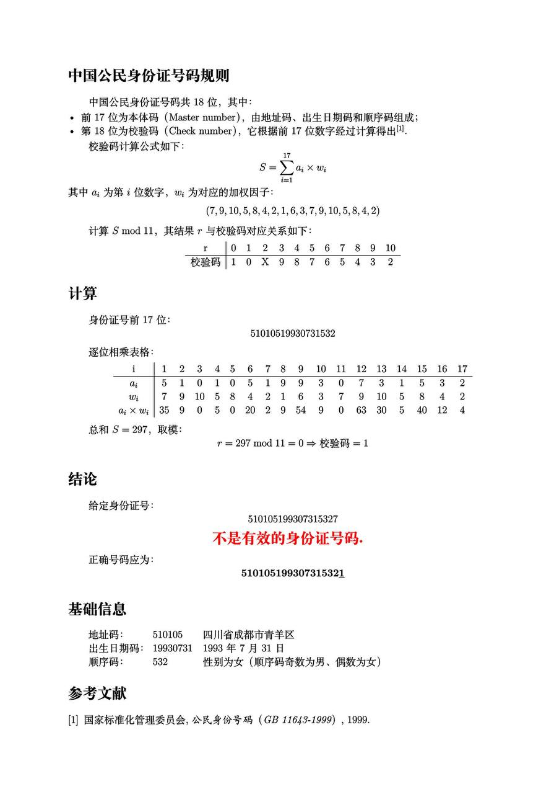

# 中国大陆公民身份证校验规则（Swift/Objc/Dart.flutter）




## 一、Swift的校验方法
> 1️⃣ 统一校验规则：格式 → 出生日期 → 顺序码(≠"000") → 校验位。
>
> 2️⃣ 策略
>
> * 按 GB 11643-1999 的 18 位规则：格式→生日→顺序码→校验位
>
> * 若输入为 15 位 → 先**转换为 18 位**（默认世纪补 **19**），再按 GB 11643-1999 做**权重校验**。
>
>  3️⃣ 默认不做行政区码白名单校验（那份表会变更，容易误杀），但会排除全 0 等明显非法值

* ```swift
  import Foundation
  
  enum CNIDError: Error, CustomStringConvertible {
      case format, birthDate, sequence, checksum
      var description: String {
          switch self {
          case .format:    return "格式错误：18位(前17位数字+最后一位数字或X) 或 15位纯数字"
          case .birthDate: return "出生日期无效或超出合理范围"
          case .sequence:  return "顺序码无效（不能为000）"
          case .checksum:  return "校验位不匹配"
          }
      }
  }
  
  struct CNID {
      private static let re18 = try! NSRegularExpression(pattern: #"^\d{17}[\dX]$"#)
      private static let re15 = try! NSRegularExpression(pattern: #"^\d{15}$"#)
      private static let weights = [7,9,10,5,8,4,2,1,6,3,7,9,10,5,8,4,2]
      private static let map: [Int: Character] = [0:"1",1:"0",2:"X",3:"9",4:"8",5:"7",6:"6",7:"5",8:"4",9:"3",10:"2"]
  
      /// 快速校验：自动兼容 15/18 位
      static func isValid(_ raw: String) -> Bool { (try? validate(raw)) != nil }
  
      /// 严格校验：非法抛错。总是返回“归一化后的18位证号”
      @discardableResult
      static func validate(_ raw: String, centuryHintFor15: Int = 19) throws -> String {
          let s = raw.trimmingCharacters(in: .whitespacesAndNewlines).uppercased()
          if match(re18, s) { try validate18(s); return s }
          if match(re15, s) {
              let v18 = try convert15to18(s, centuryHint: centuryHintFor15)
              try validate18(v18)
              return v18
          }
          throw CNIDError.format
      }
  
      /// 将 15 位转换为 18 位（默认世纪 “19”）
      static func convert15to18(_ id15: String, centuryHint: Int = 19) throws -> String {
          guard match(re15, id15) else { throw CNIDError.format }
          let area = String(id15.prefix(6))
          let yymmdd = String(id15[id15.index(id15.startIndex, offsetBy:6)..<id15.index(id15.startIndex, offsetBy:12)])
          let seq = String(id15.suffix(3))
          // 15位默认表示 1900-1999 年出生（个别极边缘例外可通过 centuryHint 覆写为 20）
          let yearPrefix = String(centuryHint)
          let yyyyMMdd = yearPrefix + yymmdd
          let body17 = area + yyyyMMdd + seq
          let check = checksumFor(body17)
          return body17 + String(check)
      }
  
      // MARK: - 私有
      private static func match(_ re: NSRegularExpression, _ s: String) -> Bool {
          re.firstMatch(in: s, range: NSRange(s.startIndex..., in: s)) != nil
      }
  
      private static func validate18(_ id: String) throws {
          guard match(re18, id) else { throw CNIDError.format }
  
          // 出生日期
          let y = Int(id[Range(NSRange(location: 6, length: 4), in: id)!])!
          let m = Int(id[Range(NSRange(location:10, length:2), in: id)!])!
          let d = Int(id[Range(NSRange(location:12, length:2), in: id)!])!
          var comps = DateComponents(); comps.year = y; comps.month = m; comps.day = d
          let cal = Calendar(identifier: .gregorian)
          guard let birth = cal.date(from: comps) else { throw CNIDError.birthDate }
          let minDate = cal.date(from: DateComponents(year: 1900, month: 1, day: 1))!
          let maxDate = Date()
          guard (minDate ... maxDate).contains(birth) else { throw CNIDError.birthDate }
  
          // 顺序码≠"000"
          let seq = id[Range(NSRange(location:14, length:3), in: id)!]
          guard seq != "000" else { throw CNIDError.sequence }
  
          // 校验位
          let body17 = String(id.prefix(17))
          let expected = checksumFor(body17)
          guard id.last! == expected else { throw CNIDError.checksum }
      }
  
      private static func checksumFor(_ body17: String) -> Character {
          var sum = 0
          for (i, ch) in body17.enumerated() {
              sum += Int(ch.asciiValue! - Character("0").asciiValue!) * weights[i]
          }
          let r = sum % 11
          return map[r]!
      }
  }
  ```

  > ```swift
  > let id18 = "510105199307315321"                 // 18位示例（应有效）
  > let id15 = "130503670401001"                     // 15位经典示例
  > do {
  >     let normalizedFrom18 = try CNID.validate(id18)      // 返回18位本身
  >     let normalizedFrom15 = try CNID.validate(id15)      // 自动转18位
  >     print("18 -> \(normalizedFrom18)")
  >     print("15 -> \(normalizedFrom15)")                  // 预期：13050319670401001X
  > } catch { print("无效：\(error)") }
  > 
  > print("isValid(18):", CNID.isValid(id18))
  > print("isValid(15):", CNID.isValid(id15))
  > ```

## 二、Objc的校验方法
* ```objective-c
  // CNIDCardValidator.h
  #import <Foundation/Foundation.h>
  
  typedef NS_ENUM(NSInteger, CNIDValidationError) {
      CNIDValidationErrorNone = 0,
      CNIDValidationErrorFormat,
      CNIDValidationErrorBirthDate,
      CNIDValidationErrorSequence,
      CNIDValidationErrorChecksum,
  };
  
  @interface CNIDCardValidator : NSObject
  /// 兼容 15/18 位，仅返回是否有效
  + (BOOL)isValid:(NSString *)idNumber;
  /// 兼容 15/18 位，返回“归一化的18位证号”；出错返回 nil，error 填充原因
  + (nullable NSString *)validateAndNormalize:(NSString *)idNumber
                                        error:(CNIDValidationError * _Nullable)errorCode;
  /// 仅做 15 -> 18 转换（默认世纪 19）
  + (nullable NSString *)convert15to18:(NSString *)id15 centuryHint:(NSInteger)century;
  @end
  ```

  ```objective-c
  // CNIDCardValidator.m
  #import "CNIDCardValidator.h"
  
  @implementation CNIDCardValidator
  
  + (BOOL)isValid:(NSString *)idNumber {
      return [self validateAndNormalize:idNumber error:NULL] != nil;
  }
  
  + (NSString *)validateAndNormalize:(NSString *)raw error:(CNIDValidationError *)errorCode {
      CNIDValidationError err = CNIDValidationErrorNone;
      NSString *inStr = [[raw ?: @"" stringByTrimmingCharactersInSet:NSCharacterSet.whitespacesAndNewlineCharacterSet] uppercaseString];
  
      NSRegularExpression *re18 = [NSRegularExpression regularExpressionWithPattern:@"^\\d{17}[\\dX]$" options:0 error:nil];
      NSRegularExpression *re15 = [NSRegularExpression regularExpressionWithPattern:@"^\\d{15}$" options:0 error:nil];
  
      BOOL is18 = [re18 numberOfMatchesInString:inStr options:0 range:NSMakeRange(0, inStr.length)] > 0;
      BOOL is15 = !is18 && [re15 numberOfMatchesInString:inStr options:0 range:NSMakeRange(0, inStr.length)] > 0;
  
      NSString *id18 = nil;
      if (is18) {
          id18 = inStr;
      } else if (is15) {
          id18 = [self convert15to18:inStr centuryHint:19];
          if (!id18) { err = CNIDValidationErrorFormat; goto END; }
      } else { err = CNIDValidationErrorFormat; goto END; }
  
      // 校验18位
      if (![self validate18:id18 error:&err]) { id18 = nil; }
  
  END:
      if (errorCode) *errorCode = err;
      return id18;
  }
  
  + (NSString *)convert15to18:(NSString *)id15 centuryHint:(NSInteger)century {
      NSRegularExpression *re15 = [NSRegularExpression regularExpressionWithPattern:@"^\\d{15}$" options:0 error:nil];
      if ([re15 numberOfMatchesInString:id15 options:0 range:NSMakeRange(0, id15.length)] == 0) return nil;
  
      NSString *area = [id15 substringToIndex:6];
      NSString *yymmdd = [id15 substringWithRange:NSMakeRange(6, 6)];
      NSString *seq = [id15 substringFromIndex:12];
      NSString *yyyyMMdd = [NSString stringWithFormat:@"%ld%@", (long)century, yymmdd]; // 默认 19
      NSString *body17 = [NSString stringWithFormat:@"%@%@%@", area, yyyyMMdd, seq];
      unichar check = [self checksumFor:body17];
      return [body17 stringByAppendingFormat:@"%C", check];
  }
  
  // ===== 私有 =====
  + (BOOL)validate18:(NSString *)id18 error:(CNIDValidationError *)err {
      // 出生日期
      NSInteger y = [[id18 substringWithRange:NSMakeRange(6, 4)] integerValue];
      NSInteger m = [[id18 substringWithRange:NSMakeRange(10, 2)] integerValue];
      NSInteger d = [[id18 substringWithRange:NSMakeRange(12, 2)] integerValue];
  
      NSCalendar *cal = [[NSCalendar alloc] initWithCalendarIdentifier:NSCalendarIdentifierGregorian];
      NSDateComponents *c = [[NSDateComponents alloc] init];
      c.year = y; c.month = m; c.day = d;
      NSDate *birth = [cal dateFromComponents:c];
      if (!birth) { if (err) *err = CNIDValidationErrorBirthDate; return NO; }
  
      NSDateComponents *minC = [[NSDateComponents alloc] init];
      minC.year = 1900; minC.month = 1; minC.day = 1;
      NSDate *minDate = [cal dateFromComponents:minC];
      NSDate *maxDate = [NSDate date];
      if ([birth compare:minDate] == NSOrderedAscending || [birth compare:maxDate] == NSOrderedDescending) {
          if (err) *err = CNIDValidationErrorBirthDate; return NO;
      }
  
      NSString *seq = [id18 substringWithRange:NSMakeRange(14, 3)];
      if ([seq isEqualToString:@"000"]) { if (err) *err = CNIDValidationErrorSequence; return NO; }
  
      NSString *body17 = [id18 substringToIndex:17];
      unichar expected = [self checksumFor:body17];
      if ([id18 characterAtIndex:17] != expected) { if (err) *err = CNIDValidationErrorChecksum; return NO; }
  
      if (err) *err = CNIDValidationErrorNone;
      return YES;
  }
  
  + (unichar)checksumFor:(NSString *)body17 {
      static int w[17] = {7,9,10,5,8,4,2,1,6,3,7,9,10,5,8,4,2};
      static char map[11] = {'1','0','X','9','8','7','6','5','4','3','2'};
      long sum = 0;
      for (int i = 0; i < 17; i++) {
          unichar ch = [body17 characterAtIndex:i];
          sum += (ch - '0') * w[i];
      }
      return map[sum % 11];
  }
  
  @end
  ```

  > ```objective-c
  > NSString *id18 = @"510105199307315321";
  > NSString *id15 = @"130503670401001";
  > 
  > CNIDValidationError err;
  > NSString *norm18 = [CNIDCardValidator validateAndNormalize:id18 error:&err]; // 返回18位
  > NSString *norm15 = [CNIDCardValidator validateAndNormalize:id15 error:&err]; // 15->18
  > 
  > NSLog(@"18输入→%@", norm18); // 510105199307315321
  > NSLog(@"15输入→%@", norm15); // 13050319670401001X（经典示例）
  > NSLog(@"是否有效(18)：%d", [CNIDCardValidator isValid:id18]);
  > NSLog(@"是否有效(15)：%d", [CNIDCardValidator isValid:id15]);
  > ```
  > 
## 三、Flutter.dart的校验方法
* ```dart
  // cn_id_card_validator.dart
  class CnIdValidationException implements Exception {
    final String message;
    CnIdValidationException(this.message);
    @override
    String toString() => message;
  }
  
  class CnID {
    static final RegExp _re18 = RegExp(r'^\d{17}[\dX]$');
    static final RegExp _re15 = RegExp(r'^\d{15}$');
    static const List<int> _w = [7,9,10,5,8,4,2,1,6,3,7,9,10,5,8,4,2];
    static const List<String> _map = ['1','0','X','9','8','7','6','5','4','3','2'];
  
    /// 仅判断是否有效（自动兼容 15/18）
    static bool isValid(String input) {
      try { normalize(input); return true; } catch (_) { return false; }
    }
  
    /// 归一化：返回“18位证号”。输入可为 18 或 15 位；15位自动转18（默认世纪 19）
    static String normalize(String raw, {int centuryHintFor15 = 19}) {
      final s = raw.trim().toUpperCase();
      if (_re18.hasMatch(s)) { _validate18(s); return s; }
      if (_re15.hasMatch(s)) {
        final v18 = convert15to18(s, centuryHint: centuryHintFor15);
        _validate18(v18);
        return v18;
      }
      throw CnIdValidationException('格式错误：请输入18位或15位身份证号码');
    }
  
    /// 仅做 15->18 转换
    static String convert15to18(String id15, {int centuryHint = 19}) {
      if (!_re15.hasMatch(id15)) {
        throw CnIdValidationException('15位格式错误');
      }
      final area = id15.substring(0, 6);
      final yymmdd = id15.substring(6, 12);
      final seq = id15.substring(12, 15);
      final yyyyMMdd = '$centuryHint$yymmdd'; // 默认 19
      final body17 = '$area$yyyyMMdd$seq';
      final check = _checksum(body17);
      return '$body17$check';
    }
  
    // ===== 私有 =====
    static void _validate18(String id) {
      if (!_re18.hasMatch(id)) {
        throw CnIdValidationException('18位格式错误');
      }
      final y = int.parse(id.substring(6, 10));
      final m = int.parse(id.substring(10, 12));
      final d = int.parse(id.substring(12, 14));
      DateTime birth;
      try {
        birth = DateTime(y, m, d);
        if (birth.year != y || birth.month != m || birth.day != d) {
          throw CnIdValidationException('出生日期无效');
        }
      } catch (_) {
        throw CnIdValidationException('出生日期无效');
      }
      final minDate = DateTime(1900, 1, 1);
      final maxDate = DateTime.now();
      if (birth.isBefore(minDate) || birth.isAfter(maxDate)) {
        throw CnIdValidationException('出生日期超出合理范围');
      }
      if (id.substring(14, 17) == '000') {
        throw CnIdValidationException('顺序码无效（000）');
      }
      final expected = _checksum(id.substring(0, 17));
      final actual = id[17];
      if (actual != expected) {
        throw CnIdValidationException('校验位不匹配：期望 $expected，实际 $actual');
      }
    }
  
    static String _checksum(String body17) {
      var sum = 0;
      for (var i = 0; i < 17; i++) {
        sum += (body17.codeUnitAt(i) - '0'.codeUnitAt(0)) * _w[i];
      }
      return _map[sum % 11];
    }
  }
  ```

  > ```dart
  > import 'cn_id_card_validator.dart';
  > 
  > void main() {
  >   final id18 = '510105199307315321';
  >   final id15 = '130503670401001';
  > 
  >   // 统一得到 18 位
  >   try {
  >     final n18 = CnID.normalize(id18);                // 510105199307315321
  >     final nFrom15 = CnID.normalize(id15);            // 13050319670401001X
  >     print('18输入 -> $n18');
  >     print('15输入 -> $nFrom15');
  >   } catch (e) {
  >     print('无效：$e');
  >   }
  > 
  >   print('isValid(18) = ${CnID.isValid(id18)}');      // true
  >   print('isValid(15) = ${CnID.isValid(id15)}');      // true
  > }
  > ```
