# Apple生成 `*.p12`文件

[toc]

## 一、什么是`*.p12`文件？

* `.p12` 文件全称 **PKCS#12 (Personal Information Exchange)**
* 它里面同时打包了：
  - **证书 (.cer)**
  - **私钥 (.key)**
* 并且通常会有一个导出密码保护。

## 二、`*.p12`文件的用处

> ⚠️ 注意事项
>
> - `.p12` 一定要安全保存，泄露出去别人就能用它伪造推送或签名。
> - 导出的时候系统会强制你设置一个密码（保护 p12），服务端也需要这个密码才能解密使用。

*  **iOS 推送通知 (APNs)**
  * 如果你做推送服务（比如极光、环信、Firebase、EngageLab、OpenInstall），后台都要上传 `.p12`。
  * 作用：服务器拿 `.p12` 去跟 Apple APNs 建立加密连接，从而能推送消息到用户 iPhone。
* App 签名 / 分发
  * 在一些第三方平台（比如 CI/CD、MDM 管理平台），上传 `.p12` + **Provisioning Profile**，它们就能自动帮你签名 ipa 包。
  * 因为签名需要证书 + 私钥，而 `.p12` 就是打包好的。
* 跨平台证书移交
  * 如果你换了 Mac，没法直接迁移钥匙串，可以直接导出 `.p12`，在新 Mac 上导入，就能继续使用同一个证书和私钥。

## 三、生成流程

### 1、打开：钥匙串访问 (Keychain Access)🔑

> 后期的MacOS将“钥匙串”归为“密码”

* 之前的老版本MacOS系统自带有独立的 `钥匙串访问 (Keychain Access)`应用程序入口，亦可以用命令行方式打开

  ```shell
  open -a "Keychain Access"
  ```

* 目前最新版的MacOS系统进入`钥匙串访问 (Keychain Access)`的方式

  ```shell
  open /System/Library/CoreServices/Applications/
  ```

  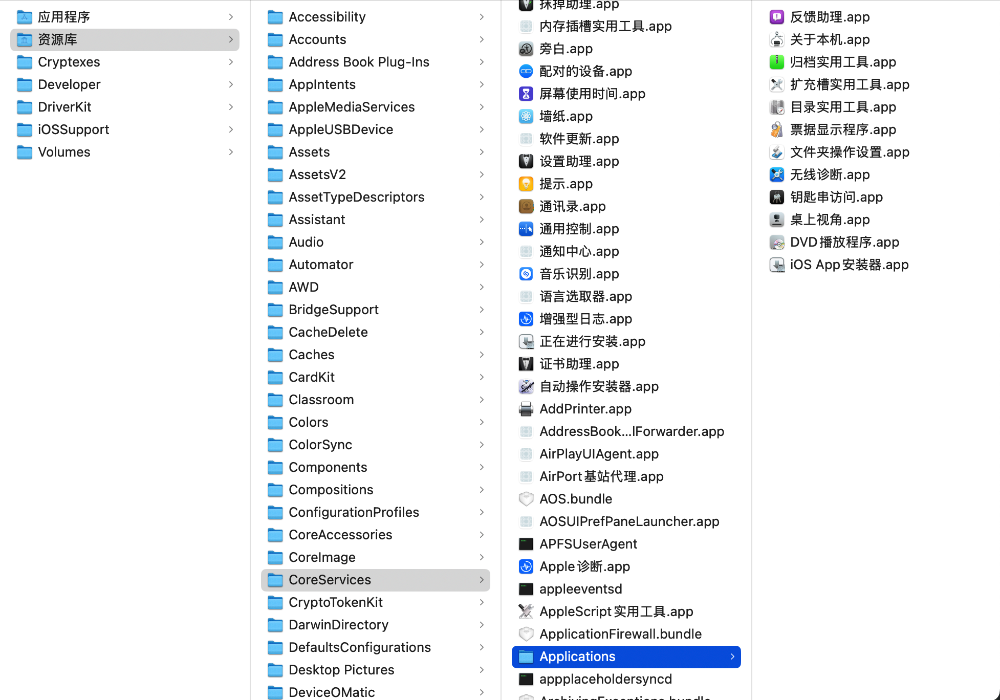

### 2、从证书颁发机构请求证书

> 输入邮箱、常用名称，选择 “存储到磁盘”，得到 `.certSigningRequest` 文件

<p align="center">
  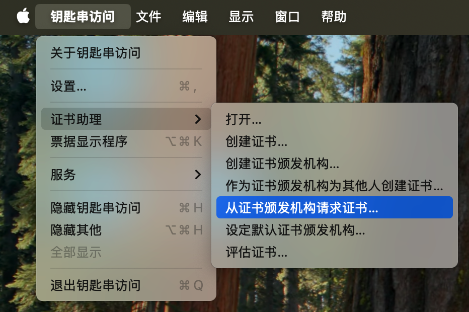
  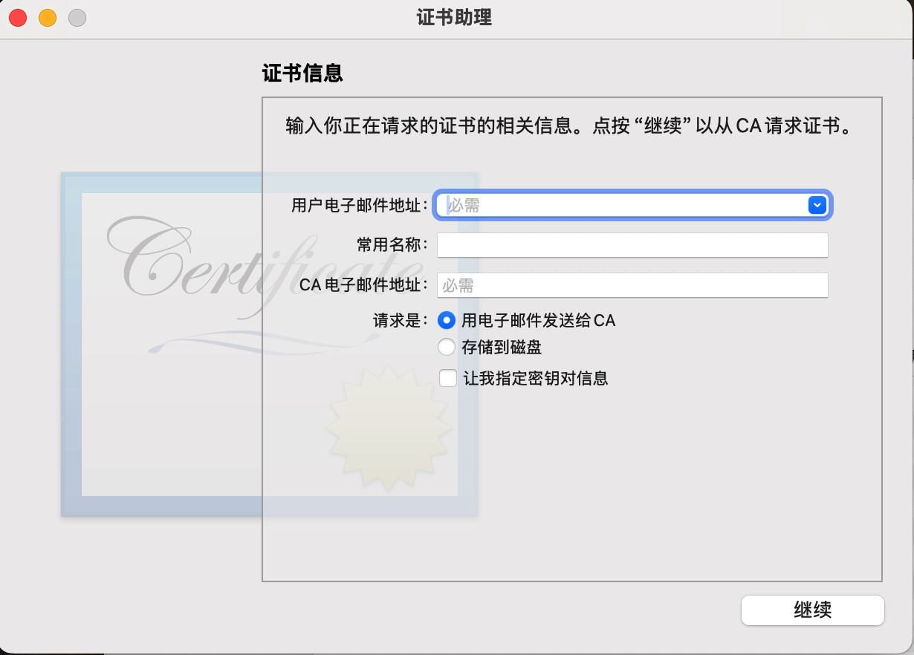
  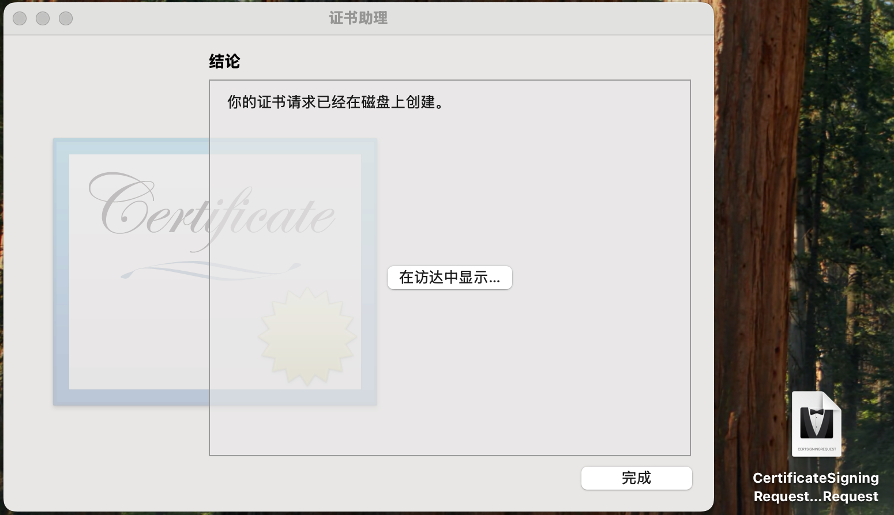
</p>

### 3、在 [**Apple Developer**](https://developer.apple.com/) 生成 `.cer`

> 特殊地区需要打开VPN，苹果官网限制某些地区的IP登录 [**Apple Developer**](https://developer.apple.com/) 

* 进入 **Certificates** → 创建新证书

  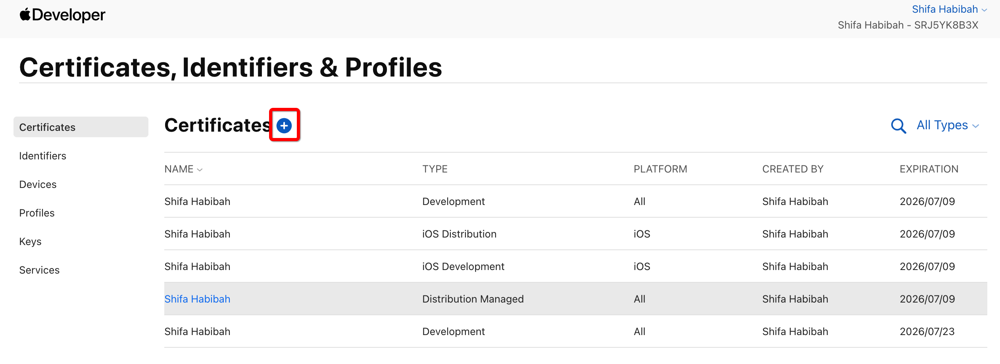

* 根据需求选择

  - **Apple Push Notification service SSL (Sandbox & Production)**（推送）

    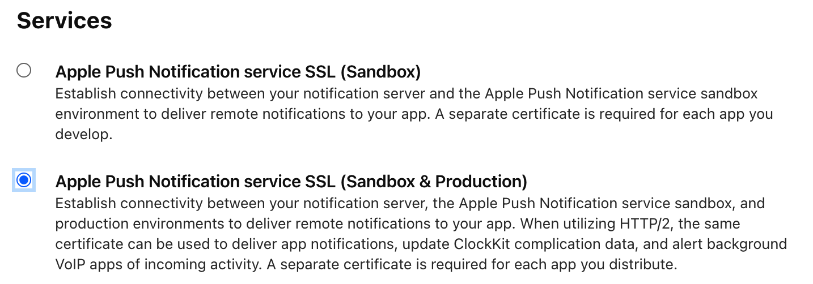

  - **Apple Distribution**（发布 App）

    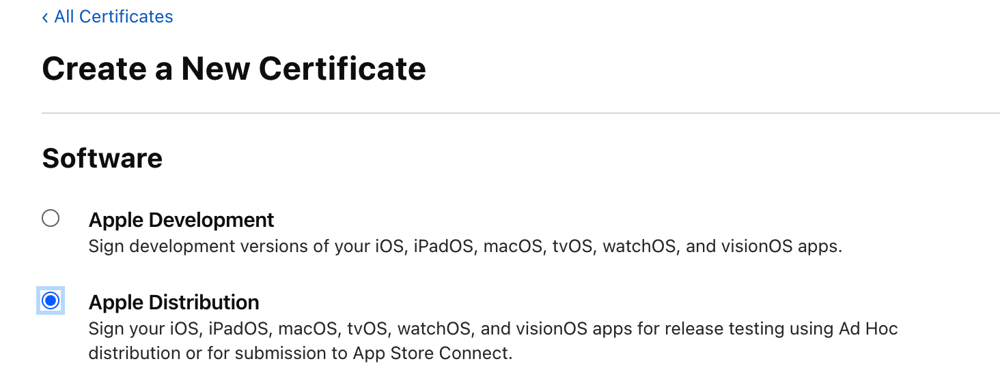

  - 其他用途的证书...

* 上传刚才生成的 `*.certSigningRequest`（系统默认生成：`CertificateSigningRequest.certSigningRequest`）

  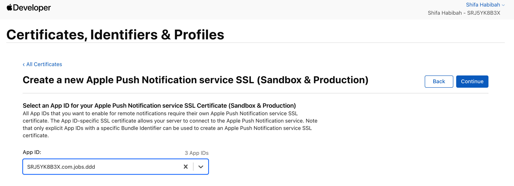
  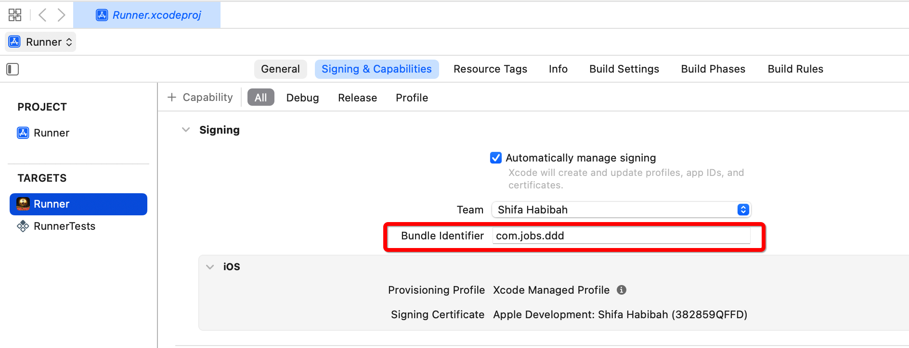
  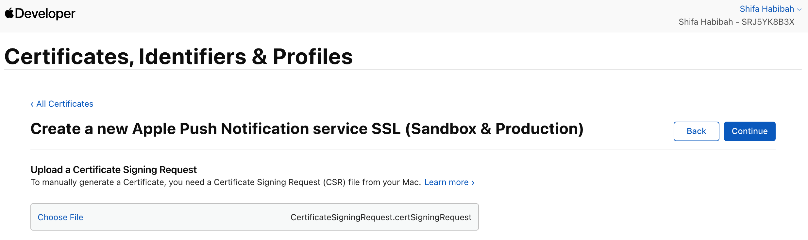


* 下载生成的 `.cer` 文件（`aps.cer`）

  

  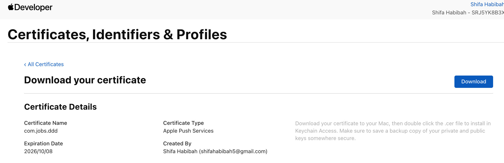

### 4、导入 `.cer` 并导出私钥

* 双击 `.cer` 文件导入到 **钥匙串**

  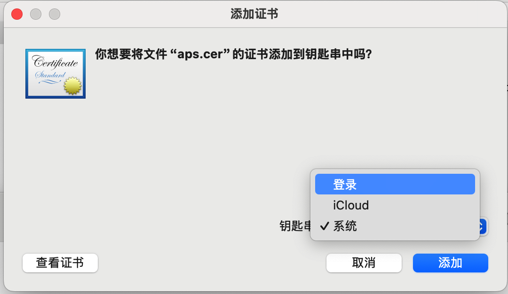

* 以上三个选项的区别

  * **登录 (Login)**： ✅ 最常用，存放和你当前用户绑定的私钥和证书。如果后面要导出 `.p12` 给服务端用（比如推送证书），必须选这个。
  * **iCloud**：会同步到 iCloud 钥匙串，一般不用来存开发/推送证书。
  * **系统 (System)**：面向整个系统的根证书/受信任 CA，不适合存你的开发/推送证书。

* 钥匙串里找到该证书（通常在 *我的证书* 标签下，会和私钥成对出现）

  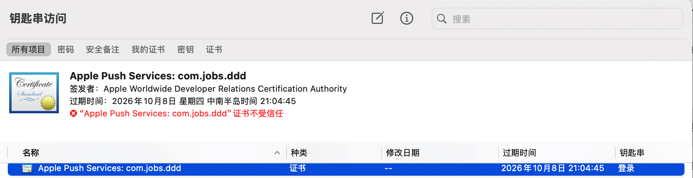

  

* 右键导出`*.p12`（**此步骤需要输入MacOS电脑的开机密码**）

  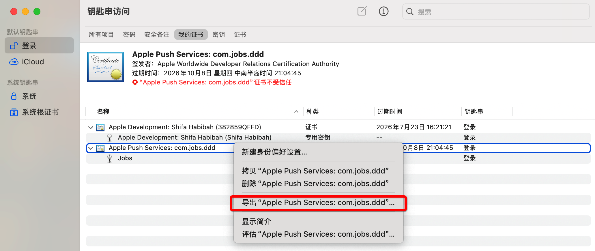

  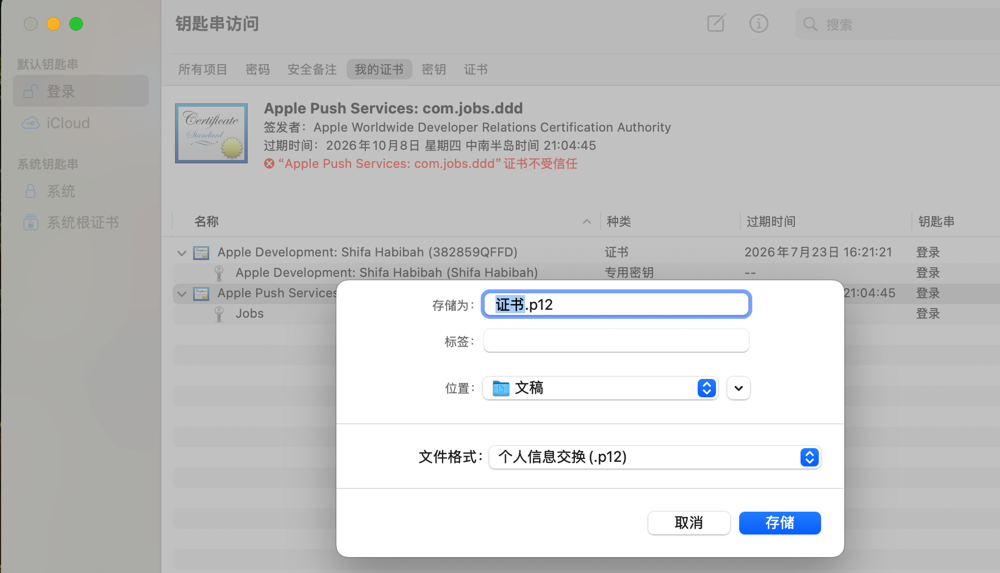

