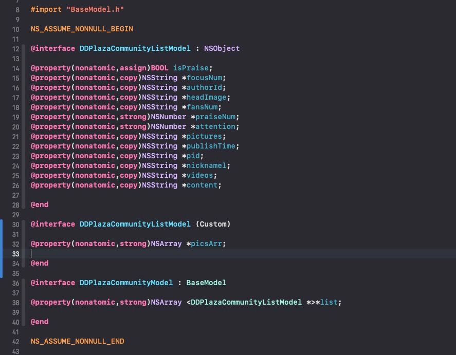
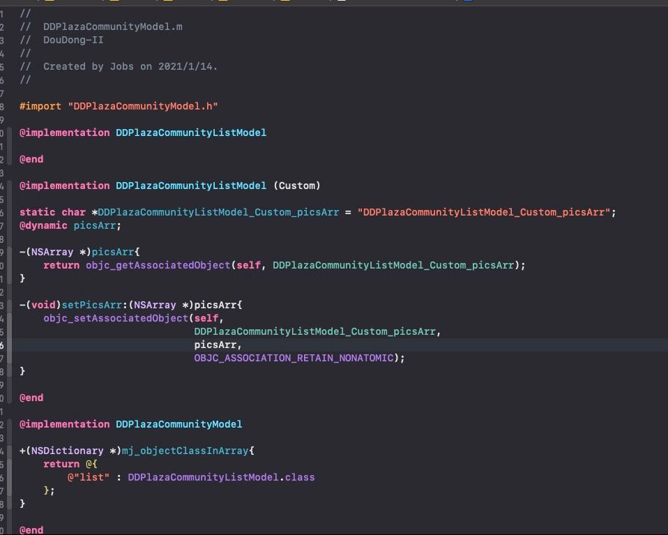
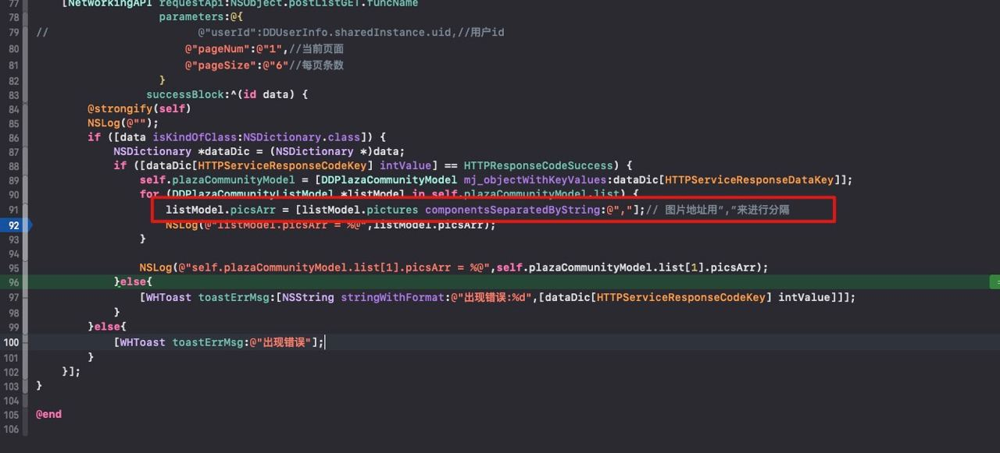

#  OC模型解析（参见`JobsComment`）

[toc]







## 一、关注 `@implementation BaseModel`

```objective-c
/// 装载本地假数据
-(void)loadData{
    NSDictionary *dic = [NSString readLocalFileWithName:@"CommentData"];
    self.mjModel = [MKCommentModel mj_objectWithKeyValues:dic[@"data"]];
    self.yyModel = [MKCommentModel yy_modelWithDictionary:dic[@"data"]];
    NSLog(@"");
    [MKRankListModel mj_objectArrayWithKeyValuesArray:dataDic[@"data"]]//如果是数组 MKRankListModel是具体的最后的一个子核心类 必须和外界的数组里面装的元素的类型保持一致
}
```

```objective-c
@implementation MKFirstCommentModel
#pragma mark —— YYModel
+ (NSDictionary *)modelCustomPropertyMapper{
  return @{
      @"ID" : @"id",
      @"childMutArr":@"child"
  };
}

+ (NSDictionary *)modelContainerPropertyGenericClass {
  return @{
      @"childMutArr" : MKChildCommentModel.class
  };
}
  #pragma mark —— MJExtention
+(NSDictionary *)mj_replacedKeyFromPropertyName{
  /* 返回的字典，key为模型属性名，value为转化的字典的多级key */
  return @{
      @"ID" : @"id",
      @"childMutArr":@"child"
  };
}

+(NSDictionary *)mj_objectClassInArray{
    return @{
        @"childMutArr" : MKChildCommentModel.class
    };
}

@end
```

* **值得注意的一点：如果是直接model网络数据的模型，无法手动在本类添加自定义的属性，则，必须用分类！** *比如：*

  ```objective-c
  #import "BaseModel.h"
  
  NS_ASSUME_NONNULL_BEGIN
  
  @interface DDPlazaCommunityListModel : NSObject
  
  @property(nonatomic,assign)BOOL isPraise;
  @property(nonatomic,copy)NSString *focusNum;
  @property(nonatomic,copy)NSString *authorId;
  @property(nonatomic,copy)NSString *headImage;
  @property(nonatomic,copy)NSString *fansNum;
  @property(nonatomic,strong)NSNumber *praiseNum;
  @property(nonatomic,strong)NSNumber *attention;
  @property(nonatomic,copy)NSString *pictures;
  @property(nonatomic,copy)NSString *publishTime;
  @property(nonatomic,copy)NSString *pid;
  @property(nonatomic,copy)NSString *nicknamel;
  @property(nonatomic,copy)NSString *videos;
  @property(nonatomic,copy)NSString *content;
  
  @end
  
  @interface DDPlazaCommunityListModel (Custom)
  
  @property(nonatomic,strong)NSArray *picsArr;
  
  @end
  
  @interface DDPlazaCommunityModel : BaseModel
  
  @property(nonatomic,strong)NSArray <DDPlazaCommunityListModel *>*list;
  
  @end
  
  NS_ASSUME_NONNULL_END
  ```

  ```objective-c
  #import "DDPlazaCommunityModel.h"
  
  @implementation DDPlazaCommunityListModel
  
  @end
  
  @implementation DDPlazaCommunityListModel (Custom)
  
  static char *DDPlazaCommunityListModel_Custom_picsArr = "DDPlazaCommunityListModel_Custom_picsArr";
  @dynamic picsArr;
  
  -(NSArray *)picsArr{
      return objc_getAssociatedObject(self, DDPlazaCommunityListModel_Custom_picsArr);
  }
  
  -(void)setPicsArr:(NSArray *)picsArr{
      objc_setAssociatedObject(self,
                               DDPlazaCommunityListModel_Custom_picsArr,
                               picsArr,
                               OBJC_ASSOCIATION_RETAIN_NONATOMIC);
  }
  
  @end
  
  @implementation DDPlazaCommunityModel
  
  +(NSDictionary *)mj_objectClassInArray{
      return @{
          @"list" : DDPlazaCommunityListModel.class
      };
  }
  
  @end
  ```

## 二、网络返回值 ➤ `*.json`文件

```
数组：   （ ==> [ 
                ) ==> ]
                
字典 不变 都是{ }

分隔符号：; ==> ,
                =  ==> :
```

