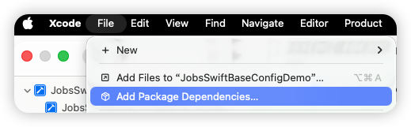
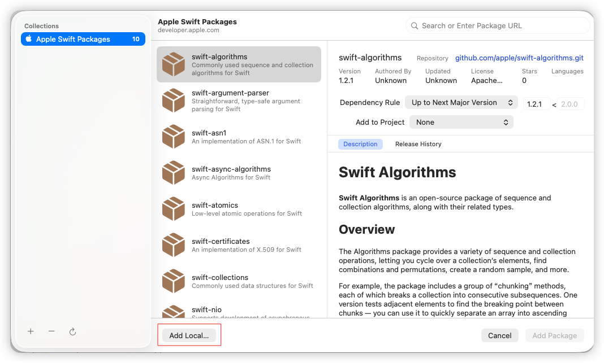
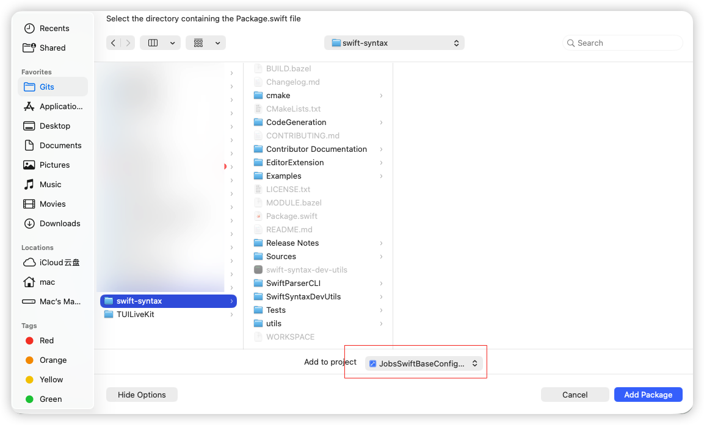
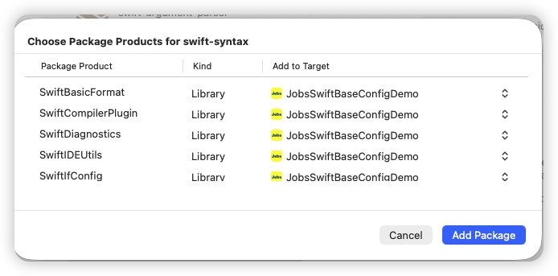
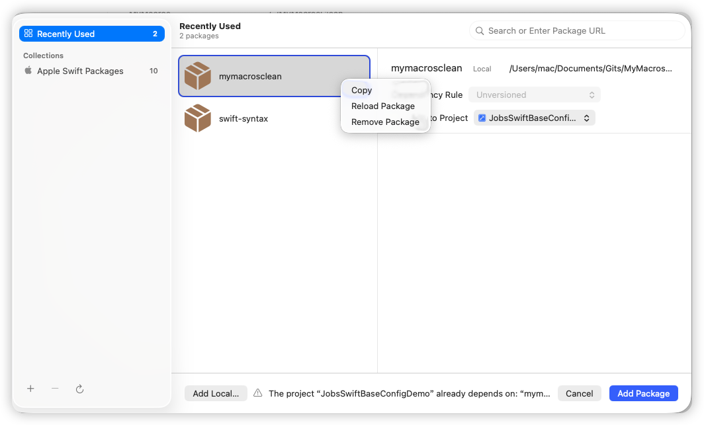
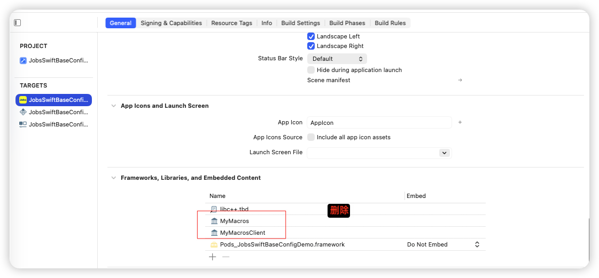

# **S**wift**P**ackage**D**ependence使用指南🧭

## 一、集成

* `Xcode` 👉 `File` 👉 `Add Package Dependencies`

  <table style="width:100%; table-layout:fixed;">
    <tr>
      <td></td>
      <td></td>
    </tr>
    <tr>
      <td></td>
      <td></td>
    </tr>
  </table>

## 二、删除（涉及到3处）

* `Xcode` 👉 `File` 👉 `Add Package Dependencies`

  

* 工程`x.xcodeproj `👉 `PROJECT` 👉 `Package Dependencies`

  

* 工程`x.xcodeproj `👉 `TARGETS` 👉 `General `👉 `Frameworks,Libraries,and Embedded Content`

  

