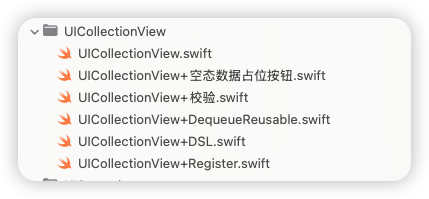
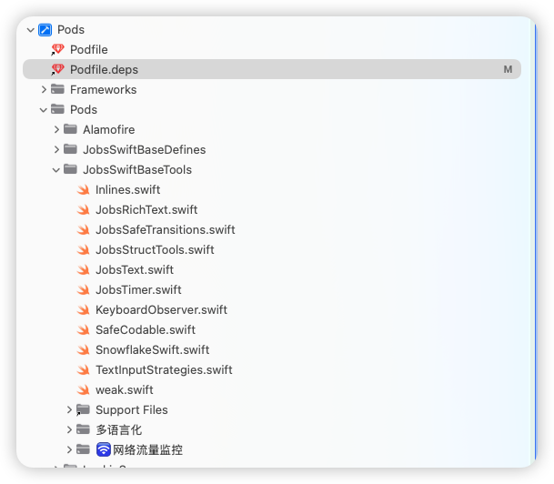

# Swift工程项目框架配置方案@Jobs

[toc]

## 一、<font id=一些基本的原则>一些基本的原则</font>

### 1、不到万不得已，不要用OC库

* 既然是[**Swift**](https://www.swift.org/)工程，那么就尽可能的不要调用OC库，否则我们为什么不用OC写工程项目？**不要既当又立**。特别是在有优秀平替的情况下。相信互联网是在不断向前发展的，新出的轮子可能稳定性来讲可能不如老旧的（特别是那种很多年不更新的库，不到万不得已，慎用！），但是从调用和内存包括向前兼容等方面，一定是优于老旧框架的。否则为什么要开发新版本？即便是Apple公司，也是看到了OC的一些不足，所以才下了很大的决心从OC迁移到[**Swift**](https://www.swift.org/)，相信迁移所造成的各方损耗和带来的优势，也是经过各方多轮评估后才做的取舍！
* OC库需要导入头文件，而且头文件的导入在编译阶段同样存在循环引用的问题（编译的时候，一定是按照加载的顺序，自上而下的编译），那么在某些极端的情况下，引入的位置不对，就会造成编译不通过（亲测）。而[**Swift**](https://www.swift.org/)在工程内部不需要导入文件，除非在不同工程（跨域），比如利用[**CocoaPods**](https://cocoapods.org/)管理的第三方才需要进行导入。所以，既然是系统做了优化的，我们就要顺势而为。
* 导入库，一般情况下，它会向后兼容，导入一些老旧的`*.framework`库，造成打包体积过大的隐患（并不能每次都精确复现，这里只是讲风险与隐患）。这里的一个例子就是[**过期的模拟器配件**](https://github.com/295060456/Xcode_Sys_lib)。老旧的Api只要你调用了就一定会指向老旧的`*.framework`，**会影响打包大小，但是不一定影响运行时的内存情况**
* 对于一些老旧库（超过5年不维护的库）如果实在要用，就需要手动集成自项目，而不是[**CocoaPods**](https://cocoapods.org/)管理

### 2、用开源播放器

* 市面上，有开源的音视频播放器
* 强烈建议不要用腾讯等中国大陆大厂出品的播放器
  * 魔改同样需要学习成本
  * 对核心的部分做了不同程度的封装
  * 内容过滤（可能今天有种声音是说海外版不管，但是如果收紧，是不是我们全不要推翻重来？）
* 播放器用大厂SDK的支持方观点：能最小成本接入
* 坚持自研播放器的观点：
  * 播放器的目的：对特定格式里面蕴含的信息，进行编解码。播放的特效，是一个文件（或许是`*.json`格式，亦或许是特有格式）
  * 能完全从底层开始修改，方便未来对视频流进行**加/解密** （反爬，反编译）
  * 大厂播放器，可能也不方便魔改（可能关键部分早已封装成`*.framework`或者`*.a`）
  * 如果大厂播放器政策有所改变，进行业务收紧，我们也需要较大开销去应对这种变化（iOS/Android2端）如果多个App，每个App内部我们都需要进行替换

## 二、我对iOS开发的认知

* 方向隶属于大前端
* 前端相对于后段的特点
  * 数据轻量级，一般不负责存储，或者是只存储轻量级的数据。除非那种国民级App（但他们都有架构组，框架内部维护使用，极少公开）
  * 后端的语言可以万年Java8（语言IDE、SDK层面）相对于前端更加的稳定（前端3个月一次小更新，5个月一次大更新）
  * 每个人对于需求理解的方式，包括二次封装的Api粒度认识不统一
  * 前端对于一些业务层面的数据计算不需要太关心，主要精力应该集中于UI绘制渲染上
  * 后端原则情况下，是不信任前端发送的任何数据的（看具体项目的安全阀值，容错度）
* 充分利用**UIButton**的便捷性，使其作为一个UI容器，合理的利用此UI控件的内部子控件，有利于去节省代码，方便拓展。内部携带：
  * 背景图层、
  * 一个子**UIImageView**
  * 主标题**Label**
  * 副标题**Label**
* 绘制UI + 数据请求 + 数据处理 == 成品
  * 数据处理：[利用[**quicktype**](https://github.com/glideapps/quicktype)自动建立数据模型]()

## 三、我的构架方案

### 1、选用的（外源）第三方框架

* 基础配置框架
  * [**ReactiveSwift**](https://github.com/ReactiveCocoa/ReactiveSwift) 新版本支持 arm64 模拟器
  * [**RxCocoa**](https://github.com/ReactiveX/RxSwift)
  * [**RxRelay**](https://cocoapods.org/pods/RxRelay)
  * [**NSObject+Rx**](https://github.com/RxSwiftCommunity/NSObject-Rx)

* UI约束
  * [**SnapKit**](https://github.com/SnapKit/SnapKit)：[**Swift**](https://www.swift.org/) 平台上的 [**Masonry**](https://github.com/SnapKit/Masonry) 平替（arm64 模拟器 OK）

* 网络请求框架（多线程异步二次封装）
  * [**YTKNetwork**](https://github.com/kanyun-inc/YTKNetwork)：OC库，并不建议用，但是他对[**AFNetworking(已永久停更)**](https://github.com/AFNetworking/AFNetworking)进行了一个很好的二次封装（封装点在于开辟多线程以应对一个页面上多个请求的特殊局面）。而[**Swift**](https://www.swift.org/)平台上的请求框架[**Alamofire**](https://github.com/Alamofire/Alamofire)还未对此场景进行深入的兼容
* 图片处理（异步）
  * [**Kingfisher**](https://github.com/onevcat/Kingfisher) [**Swift**](https://www.swift.org/) 平台上对于的 [**SDWebImage**](https://github.com/SDWebImage/SDWebImage) 平替

* 动画（播放器）
  * [**lottie-ios**](https://github.com/airbnb/lottie-ios)
* 音视频播放器
  * [**BMPlayer**](https://github.com/BrikerMan/BMPlayer)：播放器（参照 [**ZFPlayer**](https://github.com/renzifeng/ZFPlayer)）

* 聊天工具
  * [**LiveChat**](https://github.com/livechat/chat-window-ios) <font color=red>**需付费**</font>

* 一些工具类
  * 一些优秀的UI库
    * [**JXSegmentedView**](https://github.com/pujiaxin33/JXSegmentedView)： 子控制器切换
    * [**ESPullToRefresh**](https://github.com/eggswift/pull-to-refresh)：[**Swift**](https://www.swift.org/) 平台 [**MJRefresh**](https://github.com/CoderMJLee/MJRefresh) 平替（暂不支持水平特征）
    * [**JXBanner**](https://github.com/Coder-TanJX/JXBanner)：轮播图
    * [**LunarSwift**](https://github.com/6tail/lunar-swift )：无第三方依赖的日历工具
    * [**CoreXLSX**](https://github.com/3973770/SwiftXLSX)：**Excel**
    * [**FSPopoverView**](https://github.com/lifution/FSPopoverView)：下拉三角小菜单
    * [**SwiftEntryKit**](https://github.com/huri000/SwiftEntryKit)：用 [**Swift**](https://www.swift.org/) 编写的简单而功能强大的内容展示器
    * [**AMPopTip**](https://github.com/andreamazz/AMPopTip)：自定义弹出框的弹出方向以及指向其原点的箭头、颜色、边框半径和字体
    * [**SkeletonView**](https://github.com/Juanpe/SkeletonView)：骨架屏/闪动占位
    * [**SwiftMessages**](https://github.com/SwiftKickMobile/SwiftMessages)：非常灵活的 **UIKit** 和 **SwiftUI** 视图和视图控制器展示库
  * [**ScreenProtectorKit**](https://github.com/prongbang/ScreenProtectorKit)：防止屏幕截图并保护后台应用程序快照
  * [**PhoneNumberKit**](https://github.com/marmelroy/PhoneNumberKit)：电话号码工具包：用于解析、格式化和验证国际电话号码。灵感来源：`Google.libphonenumber`
  * [**IQKeyboardManagerSwift**](https://github.com/hackiftekhar/IQKeyboardManager)

### 2、我的封装（重点）

#### 2.1、对`UIViewController`的封装


* 解决某些情况下，多次push或者present的Bug

  * 正向push带参传值
  * 自定义出现的方向
  * 自定义出现的方式是push还是present
  * 退出页面需要回传的参数

  ```swift
  DemoDetailVC()
      .byData("https://www.baidu.com")
      .byDirection(.fromBottom)   // 👈 下
      .byPush(self)
      .byCompletion { print("❤️结束❤️ fromBottom") }
  ```

  ```swift
  DemoDetailVC()
      .byData(3.14)// 基本数据类型
      .onResult { name in
          print("回来了 \(name)")
      }
      .byPresent(self)
      .byCompletion{
          print("结束")
      }
  ```

#### 2.2、对UI层的封装格式


* 懒加载+代码块，在实际用的地方利用这个UI的`alpha `或者`hidden`属性进行唤起

* 利用`byAddTo`将约束全部写进此闭包中，代码不再割裂。因为约束也是对此UI控件的补充说明

  ```swift
  private lazy var tvBlue: UITextView = { [unowned self] in
      	UITextView()
          .byAttributedText(NSMutableAttributedString(
              string: "🔗 默认蓝色链接（系统样式）：",
              attributes: [
                  .font: UIFont.systemFont(ofSize: 15),
                  .foregroundColor: UIColor.secondaryLabel
              ])
              .add(NSAttributedString(
                  string: " Apple 官网",
                  attributes: [
                      .link: URL(string: "https://www.apple.com")!,
                      .font: UIFont.boldSystemFont(ofSize: 16)
                  ]))
              .add(NSAttributedString(
                  string: "\n客服电话：400-123-4567",
                  attributes: [.font: UIFont.systemFont(ofSize: 15)]
              )))
          .byEditable(false)
          .bySelectable(true)
          .byDataDetectorTypes([.link, .phoneNumber])   // 系统自动识别
          .byTextContainerInset(UIEdgeInsets(top: 8, left: 10, bottom: 8, right: 10))
          .byRoundedBorder(color: .systemGray4, width: 1, radius: 8)
          .byAddTo(self.view) { [unowned self] make in
              make.top.equalTo(self.tv.snp.bottom).offset(12)   // 紧跟在 tv 下面
              make.centerX.equalToSuperview()
              make.height.equalTo(36)
          }
  }()
  ```

* 旋转视图

  ```swift
  btn.onTap { [weak self] btn in
  			 guard let _ = self else { return }
         btn.playTapBounce(haptic: .light)  // 👈 临时放大→回弹（不注册任何手势/事件）
         if btn.jobs_isSpinning {
             // 暂停旋转
             btn.bySpinPause()
             // 暂停计时（保留已累计秒，不重置）
             btn.timer?.pause()        // ✅ 推荐：你的统一内核挂在 button.timer 上
             // 如果你有封装方法，则用：btn.pauseTimer()
             JobsToast.show(
                 text: "已暂停旋转 & 计时",
                 config: .init().byBgColor(.systemGreen.withAlphaComponent(0.9)).byCornerRadius(12)
             )
         } else {
             // 恢复旋转
             btn.bySpinStart()
             // 恢复计时（从暂停处继续累加）
             btn.timer?.resume()       // ✅ 推荐
             // 如果你有封装方法，则用：btn.resumeTimer()
             JobsToast.show(
                 text: "继续旋转 & 计时",
                 config: .init().byBgColor(.systemGreen.withAlphaComponent(0.9)).byCornerRadius(12)
             )
         }
  }
  ```

* 悬浮视图

  ```swift
  UIView().bySuspend { cfg in
      cfg
          .byContainer(view)
          .byFallbackSize(CGSize(width: 88, height: 44))
          .byDocking(.nearestEdge)
          .byInsets(UIEdgeInsets(top: 20, left: 16, bottom: 34, right: 16))
          .byHapticOnDock(true)
  }
  ```

  ```swift
  UIView().suspend(
      .default
          .byContainer(view)
          .byFallbackSize(CGSize(width: 88, height: 44))
          .byDocking(.nearestEdge)
          .byInsets(UIEdgeInsets(top: 20, left: 16, bottom: 34, right: 16))
          .byHapticOnDock(true)
  )
  ```

* 角标提示@右上角提示文案

  * 展示

    * 右上角自定义文字

      ```swift
      UIView().byCornerBadgeText("NEW") { cfg in
                  cfg.byOffset(.init(horizontal: -6, vertical: 6))
                      .byInset(.init(top: 2, left: 6, bottom: 2, right: 6))
                      .byBgColor(.systemRed)
                      .byFont(.systemFont(ofSize: 11, weight: .bold))
                      .byShadow(color: UIColor.black.withAlphaComponent(0.25),
                                radius: 2,
                                opacity: 0.6,
                                offset: .init(width: 0, height: 1))
              }
      ```

    * 右上角小红点

      ```swift
      UIView().byCornerDot(diameter: 10, offset: .init(horizontal: -4, vertical: 4))// 红点
      ```

  * 关闭

    ```swift
    UIButton(type: .system)
        /// 事件触发@点按
        .onTap { [weak self] sender in
            guard let self else { return }
            sender.isSelected.toggle()
            if sender.isSelected {
                sender.byCornerDot(diameter: 10, offset: .init(horizontal: -4, vertical: 4))
            } else {
                sender.removeCornerBadge()
            }
            JobsToast.show(
                text: "优惠@点按事件",
                config: JobsToast.Config()
                    .byBgColor(.systemGreen.withAlphaComponent(0.9))
                    .byCornerRadius(12)
            )
        }
    ```


#### 2.3、对`UIButton`按钮的封装


* 除了向下兼容旧的Api的按钮管线，此Api大胆启用Apple最新的Api：`UIButtonConfiguration`
* 按钮的点击事件（在一般的点按事件基础上，增加了长按事件的向外暴露），绕过<font color=red>**@selector**</font>和**Target**。<font color=blue>**并实现了追加功能**</font>
* 可以富文本/普通文本，设置主标题/副标题
* 按钮图 + 按钮图文关系（位置、距离）、背景图
* 点击播放声音（额外的一个Api实现，不占用具体的业务层）
* 按钮的右上角文本配置（参考OC库[**PPBadgeView**](https://github.com/jkpang/PPBadgeView)）
* <font color=red>风险提示：一旦用了最新的`UIButtonConfiguration`可能影响到老旧的Api的使用（直观感受，老旧Api配置的按钮将会不起效）</font>

```swift
/// 使用的时候，仅需要复制，依据具体需求进行删除不必要的项，和修改配置的值（特别是约束）
private lazy var exampleButton: UIButton = {
    UIButton.sys()
        /// 背景色
        .byBackgroundColor(.systemGreen, for: .normal)
        /// 普通字符串@设置主标题
        .byTitle("显示", for: .normal)
        .byTitle("隐藏", for: .selected)
        .byTitleColor(.systemBlue, for: .normal)
        .byTitleColor(.systemRed, for: .selected)
        .byTitleFont(.systemFont(ofSize: 16, weight: .medium))
        /// 普通字符串@设置副标题
        .bySubTitle("显示", for: .normal)
        .bySubTitle("隐藏", for: .selected)
        .bySubTitleColor(.systemBlue, for: .normal)
        .bySubTitleColor(.systemRed, for: .selected)
        .bySubTitleFont(.systemFont(ofSize: 16, weight: .medium))
        /// 富文本字@设置主标题
        .byRichTitle(JobsRichText.make([
            JobsRichRun(.text("¥99")).font(.systemFont(ofSize: 18, weight: .semibold)).color(.systemRed),
            JobsRichRun(.text(" /月")).font(.systemFont(ofSize: 16)).color(.white)
        ]))
         /// 富文本字@设置副标题
        .byRichSubTitle(JobsRichText.make([
            JobsRichRun(.text("原价 ")).font(.systemFont(ofSize: 12)).color(.white.withAlphaComponent(0.8)),
            JobsRichRun(.text("¥199")).font(.systemFont(ofSize: 12, weight: .medium)).color(.systemYellow)
        ]))
        /// 按钮图片@图文关系
        .byImage("eye.slash".sysImg, for: .normal)                // 未选中图标
        .byImage("eye".sysImg, for: .selected)                    // 选中图标
        .byContentEdgeInsets(UIEdgeInsets(top: 4, left: 8, bottom: 4, right: 8))// 图文内边距
        .byTitleEdgeInsets(UIEdgeInsets(top: 0, left: 6, bottom: 0, right: -6)) // 图标与文字间距
        /// 点击@播放声音
        .byTapSound("Sound.wav")    
        /// 普通@点按事件触发
        .onTap { [weak self] sender in
            guard let self else { return }
            sender.isSelected.toggle()
            // 文字与图标自动切换
            self.passwordTF.isSecureTextEntry.toggle()
            self.passwordTF.togglePasswordVisibility()
            print("👁 当前状态：\(sender.isSelected ? "隐藏密码" : "显示密码")")
        }
        /// 追加@点按事件触发
        .onTapAppend{ sender in
            print("追加的点按事件")
        }
        /// 右上角提示文案@小红点
        .byCornerDot(diameter: 10, offset: .init(horizontal: -4, vertical: 4))// 红点
        /// 右上角提示文案@文字
        .byCornerBadgeText("NEW") { cfg in
            cfg.byOffset(.init(horizontal: -6, vertical: 6))
                .byInset(.init(top: 2, left: 6, bottom: 2, right: 6))
                .byBgColor(.systemRed)
                .byFont(.systemFont(ofSize: 11, weight: .bold))
                .byShadow(color: UIColor.black.withAlphaComponent(0.25),
                          radius: 2,
                          opacity: 0.6,
                          offset: .init(width: 0, height: 1))
        }
        /// 普通@长按事件触发
        .onLongPress(minimumPressDuration: 0.8) { btn, gr in
             if gr.state == .began {
                 btn.alpha = 0.6
                 print("长按开始 on \(btn)")
             } else if gr.state == .ended || gr.state == .cancelled {
                 btn.alpha = 1.0
                 print("长按结束")
             }
         }
        /// 追加@长按事件触发
        .onLongPressAppend(minimumPressDuration: 0.8) { btn, gr in
            print("追加的长按事件")
        }
        .byAddTo(view) { [unowned self] make in
            make.top.equalTo(self.view.safeAreaLayoutGuide.snp.top).offset(40)
            make.left.right.equalToSuperview().inset(24)
            make.height.equalTo(44)
        }
        /// UIButtonConfiguration
        if #available(iOS 15.0, *) {
            b.byConfiguration { c in
                c.byTitle("背景图：Base64 / URL")
                    .byBaseForegroundCor(.white)
                    .byContentInsets(.init(top: 16, leading: 16, bottom: 16, trailing: 16))
                    .byCornerStyle(.large)
                    .byImagePlacement(.trailing)
                    .byImagePadding(8)
            }
        } else {
            b.byTitle("背景图：Base64 / URL", for: .normal)
                .byTitleColor(.white, for: .normal)
                .byContentEdgeInsets(.init(top: 16, left: 16, bottom: 16, right: 16))
                .byBgColor(.systemBlue)
        }
}()
```

#### 2.4、对`UIGestureRecognizer`手势的封装

<p align="center">
  
  
</p>

* 绕过<font color=red>**@selector**</font>和**Target**，只关心加载的视图对象，以及响应方法

  * ```swift
    // MARK: - 点击 Tap
    UIView().jobs_addGesture(
        UITapGestureRecognizer
            .byConfig { gr in
                print("Tap 触发 on: \(String(describing: gr.view))")
            }
            .byTaps(2)                       // 双击
            .byTouches(1)                    // 单指
            .byCancelsTouchesInView(true)
            .byEnabled(true)
            .byName("customTap")
    )
    ```

  * ```swift
    // MARK: - 长按 LongPress
    UIView().addGestureRecognizer(
        UILongPressGestureRecognizer
            .byConfig { gr in
                if gr.state == .began {
                    print("长按开始")
                } else if gr.state == .ended {
                    print("长按结束")
                }
            }
            .byMinDuration(0.8)              // 最小按压时长
            .byMovement(12)                  // 允许移动距离
            .byTouches(1)                    // 单指
    )
    ```

  * ```swift
    // MARK: - 拖拽 Pan
    UIView().jobs_addGesture(
        UIPanGestureRecognizer
            .byConfig { gr in
                let p = (gr as! UIPanGestureRecognizer).translation(in: gr.view)
                if gr.state == .changed {
                    print("拖拽中: \(p)")
                } else if gr.state == .ended {
                    print("拖拽结束")
                }
            }
            .byMinTouches(1)
            .byMaxTouches(2)
            .byCancelsTouchesInView(true)
    )
    ```

  * ```swift
    // MARK: - 轻扫 Swipe（单方向）
    UIView().jobs_addGesture(
        UISwipeGestureRecognizer
            .byConfig { _ in
                print("👉 右滑触发")
            }
            .byDirection(.right)
            .byTouches(1)
    )
    // MARK: - 轻扫 Swipe（多方向）
    let swipeContainer = UIView()
    swipeContainer.jobs_addGesture(
        UISwipeGestureRecognizer
            .byConfig { _ in print("← 左滑") }
            .byDirection(.left)
    )
    swipeContainer.jobs_addGesture(
        UISwipeGestureRecognizer
            .byConfig { _ in print("→ 右滑") }
            .byDirection(.right)
    )
    swipeContainer.jobs_addGesture(
        UISwipeGestureRecognizer
            .byConfig { _ in print("↑ 上滑") }
            .byDirection(.up)
    )
    swipeContainer.jobs_addGesture(
        UISwipeGestureRecognizer
            .byConfig { _ in print("↓ 下滑") }
            .byDirection(.down)
    )
    ```

  * ```swift
    // MARK: - 捏合 Pinch
    UIView().jobs_addGesture(
        UIPinchGestureRecognizer
            .byConfig { _ in }
            .byOnScaleChange { gr, scale in
                if gr.state == .changed {
                    print("缩放比例: \(scale)")
                }
            }
            .byScale(1.0)
    )
    ```

  * ```swift
    // MARK: - 旋转 Rotate
    UIView().jobs_addGesture(
        UIRotationGestureRecognizer
            .byConfig { _ in }
            .byOnRotationChange { gr, r in
                if gr.state == .changed {
                    print("旋转角度(弧度): \(r)")
                }
            }
            .byRotation(0)
    )
    ```

  * ```swift
    // MARK: - 直接设置手势（已锚定视图）
    let views = UIView()
        .addTapAction { gr in
            print("点击 \(gr.view!)")
        }
        .addLongPressAction { gr in
            if gr.state == .began { print("长按开始") }
        }
        .addPanAction { gr in
            let p = (gr as! UIPanGestureRecognizer).translation(in: gr.view)
            print("拖拽中: \(p)")
        }
        .addPinchAction { gr in
            let scale = (gr as! UIPinchGestureRecognizer).scale
            print("缩放比例：\(scale)")
        }
        .addRotationAction { gr in
            let rotation = (gr as! UIRotationGestureRecognizer).rotation
            print("旋转角度：\(rotation)")
        }
    ```

#### 2.5、对`UITextView`的封装（含输入监控过滤）

* 输入监控 + 退格监控

  ```swift
  private lazy var tv: UITextView = { [unowned self] in
      UITextView()
          .byText("这里展示基础链式调用：字体、颜色、边框、内边距等。")
          .byFont(.systemFont(ofSize: 16))
          .byTextColor(.label)
          .byTextAlignment(.left)
          .byEditable(true)
          .bySelectable(true)
          .byTextContainerInset(UIEdgeInsets(top: 8, left: 10, bottom: 8, right: 10))
          .byRoundedBorder(color: .systemGray4, width: 1, radius: 8)
          .onChange { tv, input, old, isDeleting in
              let new = tv.text ?? ""
              print("✏️ input='\(input)' old='\(old)' new='\(new)' deleting=\(isDeleting)")
  
              // 6~20 有效：绿边，否则红边
              let ok = (6...20).contains(new.count)
              tv.layer.borderWidth = 1
              tv.layer.borderColor = (ok ? UIColor.systemGreen : UIColor.systemRed).cgColor
              tv.layer.masksToBounds = true
              if #available(iOS 13.0, *) { tv.layer.cornerCurve = .continuous }
          }
          .onBackspace { tv in
              print("👈 backspace: len=\(tv.text?.count ?? 0)")
          }
          .byAddTo(self.view) { [unowned self] make in
              make.top.equalTo(self.textField.snp.bottom).offset(12)
              make.centerX.equalToSuperview()
              make.height.equalTo(36)
          }
  }()
  ```

* 配合富文本

  ```swift
  private lazy var tvBlue: UITextView = { [unowned self] in
      return UITextView()
          .byAttributedText(NSMutableAttributedString(
              string: "🔗 默认蓝色链接（系统样式）：",
              attributes: [
                  .font: UIFont.systemFont(ofSize: 15),
                  .foregroundColor: UIColor.secondaryLabel
              ])
              .add(NSAttributedString(
                  string: " Apple 官网",
                  attributes: [
                      .link: URL(string: "https://www.apple.com")!,
                      .font: UIFont.boldSystemFont(ofSize: 16)
                  ]))
              .add(NSAttributedString(
                  string: "\n客服电话：400-123-4567",
                  attributes: [.font: UIFont.systemFont(ofSize: 15)]
              )))
          .byEditable(false)
          .bySelectable(true)
          .byDataDetectorTypes([.link, .phoneNumber])   // 系统自动识别
          .byTextContainerInset(UIEdgeInsets(top: 8, left: 10, bottom: 8, right: 10))
          .byRoundedBorder(color: .systemGray4, width: 1, radius: 8)
          .byAddTo(self.view) { [unowned self] make in
              make.top.equalTo(self.tv.snp.bottom).offset(12)   // 紧跟在 tv 下面
              make.centerX.equalToSuperview()
              make.height.equalTo(36)
          }
  }()
  ```

#### 2.6、对`UITextField`输入框的封装（含输入监控过滤）

* 密码输入框

  ```swift
  /// 密码输入框
  private lazy var tf1: UITextField = {
      UITextField()
          .byDelegate(self) // 数据源
          .byPlaceholder("请输入密码（6-20 位）")
          .bySecureTextEntry(true)
          .byInputAccessoryView(UIToolbar().byItems([
              UIBarButtonItem()
                  .byTitle("清空")
                  .byTitleFont(.systemFont(ofSize: 15))
                  .byTitleColor(.systemRed)
                  .byStyle(.plain)
                  .onTap { [weak self] _ in
                      guard let self = self else { return }   // ✅ 确保生命周期安全
                      /// TODO
                  },
              UIBarButtonItem(systemItem: .flexibleSpace),
              UIBarButtonItem()
                  .byTitle("完成")
                  .byTitleFont(.systemFont(ofSize: 15))
                  .byTitleColor(.systemYellow)
                  .byStyle(.done)
                  .onTap { [weak self] _ in
                      guard let self = self else { return }   // ✅ 确保生命周期安全
                      view.endEditing(true)
                  },
          ])
          .bySizeToFit())                                     // ✅ 给密码框自定义 inputAccessoryView
          .byBorderStyle(.roundedRect)
          .byReturnKeyType(.done)
          .byTextContentType(.password)
          .byPasswordRules(nil) // 也可自定义
      //            .byLeftView(Self.makeIcon("lock"), mode: .always)
          .byLeftIcon(UIImage(systemName: "lock"),
                      tint: .secondaryLabel,
                      size: .init(width: 18, height: 18),
                      leading: 12, spacing: 8)
          .byRightView(UIButton(type: .system)
                       // 普通文字：未选中状态标题
                       .byTitle("显示", for: .normal)
                       // 选中状态标题
                       .byTitle("隐藏", for: .selected)
                       // 文字颜色：区分状态
                       .byTitleColor(.systemBlue, for: .normal)
                       .byTitleColor(.systemRed, for: .selected)
                       // 字体统一
                       .byTitleFont(.systemFont(ofSize: 16, weight: .medium))
                       // 图标（SF Symbol）
                       .byImage(UIImage(systemName: "eye.slash"), for: .normal)   // 未选中图标
                       .byImage(UIImage(systemName: "eye"), for: .selected)       // 选中图标
                       // 图文内边距
                       .byContentEdgeInsets(UIEdgeInsets(top: 4, left: 8, bottom: 4, right: 8))
                       // 图标与文字间距
                       .byTitleEdgeInsets(UIEdgeInsets(top: 0, left: 6, bottom: 0, right: -6))
                       // 点按事件（统一入口）
                       .onTap { [weak self] sender in
                           guard let self else { return }
                           sender.isSelected.toggle()
                           // 文字与图标自动切换
                           self.passwordTF.isSecureTextEntry.toggle()
                           self.passwordTF.togglePasswordVisibility()
                           print("👁 当前状态：\(sender.isSelected ? "隐藏密码" : "显示密码")")
                       }, mode: .always)
          .byInputView(datePicker) // 演示自定义 inputView：点密码框弹日期（纯展示，不建议真实项目这么用）
          // 限制输入
          .byLimitLength(12) {[weak self] isLimited, tf in
              guard let self else { return }
              tipLabel.byVisible(isLimited)
          }
          .onChange { tf, input, old, isDeleting in
              let new = tf.text ?? ""
              print("✏️ input='\(input)' old='\(old)' new='\(new)' deleting=\(isDeleting)")
  
              // 示例：6~20 位有效态样式
              let ok = (6...20).contains(new.count)
              tf.layer.borderWidth = 1
              tf.layer.borderColor = (ok ? UIColor.systemGreen : UIColor.systemRed).cgColor
              tf.layer.masksToBounds = true
              if #available(iOS 13.0, *) { tf.layer.cornerCurve = .continuous }
          }
          .byAddTo(view) { [unowned self] make in
              make.top.equalTo(textField.snp.bottom).offset(12)
              make.centerX.equalToSuperview()
              make.height.equalTo(36)
          }
  }()
  ```

* 邮箱输入框

  ```swift
  /// 邮箱输入框
  private lazy var tf1: UITextField = {
      UITextField()
          // 数据源
          .byDelegate(self)
          // 基础视觉
          .byPlaceholder("请输入邮箱（至少 3 个字符）")
          .byTextColor(.label)
          .byFont(.systemFont(ofSize: 16))
          .byTextAlignment(.natural)
          .byBorderStyle(.roundedRect)
          .byClearButtonMode(.whileEditing)
  
          .byInputAccessoryView(accessory)
          // 键盘
          .byKeyboardType(.emailAddress)
          .byKeyboardAppearance(.dark)
          .byReturnKeyType(.next)
          .byEnablesReturnKeyAutomatically(true)
          // 智能输入
          .byAutocapitalizationType(.none)
          .byAutocorrectionType(.no)
          .bySpellCheckingType(.no)
          .bySmartQuotesType(.no)
          .bySmartDashesType(.no)
          .bySmartInsertDeleteType(.no)
          // 内容类型
          .byTextContentType(.emailAddress)
          // 编辑属性
          .byAllowsEditingTextAttributes(true)
          .byDefaultTextAttributes([.kern: 0.5]) // 字距
          .byTypingAttributes([.foregroundColor: UIColor.label])
          // 左/右视图
          //.byLeftView(makeIcon("envelope"), mode: .always)
          .byLeftIcon(UIImage(systemName: "envelope"),
                      tint: .secondaryLabel,
                      size: .init(width: 18, height: 18),
                      leading: 12, spacing: 8)
          .onChange { tf, input, old, isDeleting in
              let new = tf.text ?? ""
              print("✏️ input='\(input)' old='\(old)' new='\(new)' deleting=\(isDeleting)")
  
              // 示例：6~20 位有效态样式
              let ok = (6...20).contains(new.count)
              tf.layer.borderWidth = 1
              tf.layer.borderColor = (ok ? UIColor.systemGreen : UIColor.systemRed).cgColor
              tf.layer.masksToBounds = true
              if #available(iOS 13.0, *) { tf.layer.cornerCurve = .continuous }
          }
          .byAddTo(view) { [unowned self] make in
              make.top.equalTo(textField.snp.bottom).offset(12)
              make.centerX.equalToSuperview()
              make.height.equalTo(36)
          }
  }()
  ```

#### 2.7、对`UIImageView`的封装（暂时只展示[**Kingfisher**](https://github.com/onevcat/Kingfisher)。[**SDWebImage**](https://github.com/SDWebImage/SDWebImage)也有）

* `UIImageView`@字符串本地图

  ```swift
  /// UIImageView@字符串本地图
  private lazy var localImgView: UIImageView = {
      UIImageView()
          .byImage("Ani".img)
          .byContentMode(.scaleAspectFill)
          .byClipsToBounds()
          .onTap { iv in
              toastBy("单击图片：\(iv)")
           }
          .onLongPress(minDuration: 0.8, movement: 12, touches: 1, name: "customLongPress") { iv, gr in
              switch gr.state {
              case .began:
                  toastBy("长按开始 on \(iv)")
              case .ended, .cancelled, .failed:
                  toastBy("长按结束 on \(iv)")
              default:
                  break
              }
          }
          .byAddTo(scrollView) { [unowned self] make in
              make.top.equalTo(scrollView.contentLayoutGuide.snp.top).offset(10.h)
              make.left.equalTo(scrollView.frameLayoutGuide.snp.left).offset(20.w)
              make.right.equalTo(scrollView.frameLayoutGuide.snp.right).inset(20.w)
              make.height.equalTo(180.h)
          }
  }()
  ```

* `UIImageView`字符串网络图@[**Kingfisher**](https://github.com/onevcat/Kingfisher)

  ```swift
  /// UIImageView字符串网络图@Kingfisher
  private lazy var asyncImgView: UIImageView = {
      UIImageView()
          .byAsyncImageKF("https://picsum.photos/200/300", fallback: "唐老鸭".img)
          .byContentMode(.scaleAspectFill)
          .byClipsToBounds()
          .onTap { iv in
              toastBy("单击图片：\(iv)")
           }
          .onLongPress(minDuration: 0.8, movement: 12, touches: 1, name: "customLongPress") { iv, gr in
              switch gr.state {
              case .began:
                  toastBy("长按开始 on \(iv)")
              case .ended, .cancelled, .failed:
                  toastBy("长按结束 on \(iv)")
              default:
                  break
              }
          }
          .byAddTo(scrollView) { [unowned self] make in
              make.top.equalTo(localImgView.snp.bottom).offset(20.h)
              make.left.equalTo(scrollView.frameLayoutGuide.snp.left).offset(20.w)
              make.right.equalTo(scrollView.frameLayoutGuide.snp.right).inset(20.w)
              make.height.equalTo(180.h)
          }
  }()
  ```

* `UIImageView`网络图（失败兜底图）@[**Kingfisher**](https://github.com/onevcat/Kingfisher)

  ```swift
  /// UIImageView网络图（失败兜底图）@Kingfisher
  private lazy var wrapperImgView: UIImageView = {
      UIImageView()
          .byContentMode(.scaleAspectFill)
          .byClipsToBounds()
          .kf_setImage(from: "https://picsum.photos/200", placeholder: "Ani".img)
          .onTap { iv in
              toastBy("单击图片：\(iv)")
           }
          .onLongPress(minDuration: 0.8, movement: 12, touches: 1, name: "customLongPress") { iv, gr in
              switch gr.state {
              case .began:
                  toastBy("长按开始 on \(iv)")
              case .ended, .cancelled, .failed:
                  toastBy("长按结束 on \(iv)")
              default:
                  break
              }
          }
          .byAddTo(scrollView) { [unowned self] make in
              make.top.equalTo(asyncImgViewSD.snp.bottom).offset(20.h)
              make.left.equalTo(scrollView.frameLayoutGuide.snp.left).offset(20.w)
              make.right.equalTo(scrollView.frameLayoutGuide.snp.right).inset(20.w)
              make.height.equalTo(180.h)
          }
  }()
  ```

#### 2.8、对`UICollectionView`的封装



* 没数据时，自动显示空态图（是一个按钮）
* 封装了上下拉功能（基于[**ESPullToRefresh**](https://github.com/eggswift/pull-to-refresh)）

```swift
private lazy var flowLayout: UICollectionViewFlowLayout = {
    UICollectionViewFlowLayout()
        .byScrollDirection(.vertical)
        .byMinimumLineSpacing(10)
        .byMinimumInteritemSpacing(10)
        .bySectionInset(UIEdgeInsets(top: 10, left: 12, bottom: 10, right: 12))
}()

private lazy var collectionView: UICollectionView = {
    UICollectionView(frame: .zero, collectionViewLayout: flowLayout)
        .byDataSource(self)
        .byDelegate(self)
        .registerCell(UICollectionViewCell.self)
        .byBackgroundView(nil)
        .byDragInteractionEnabled(false)

        // 空态按钮（与 UITableView Demo 一致）
        .jobs_emptyButtonProvider { [unowned self] in
            UIButton.sys()
                .byTitle("暂无数据", for: .normal)
                .bySubTitle("点我填充示例数据", for: .normal)
                .byImage(UIImage(systemName: "square.grid.2x2"), for: .normal)
                .byImagePlacement(.top)
                .onTap { [weak self] _ in
                    guard let self else { return }
                    self.items = (1...12).map { "Item \($0)" }
                    self.collectionView.byReloadData()        // ✅ reload 后自动评估空态
                }
                // 可选：自定义空态按钮布局
                .jobs_setEmptyLayout { btn, make, host in
                    make.centerX.equalTo(host)
                    make.centerY.equalTo(host).offset(-40)
                    make.leading.greaterThanOrEqualTo(host).offset(16)
                    make.trailing.lessThanOrEqualTo(host).inset(16)
                    make.width.lessThanOrEqualTo(host).multipliedBy(0.9)
                }
        }

        // 下拉刷新 Header
        .configRefreshHeader(component: JobsDefaultHeader(),
                             container: self,
                             trigger: 66) { [weak self] in
            guard let self else { return }
            Task { @MainActor in
                try? await Task.sleep(nanoseconds: 1_000_000_000)
                self.rows = 20
                self.tableView.byReloadData()
                self.tableView.switchRefreshHeader(to: .normal)
                self.tableView.switchRefreshFooter(to: .normal) // 复位“无更多”
            }
        }
        // 上拉加载 Footer
        .configRefreshFooter(component: JobsDefaultFooter(),
                                      container: self,
                                      trigger: 66) { [weak self] in
            guard let self else { return }
            Task { @MainActor in
                try? await Task.sleep(nanoseconds: 1_000_000_000)
                if self.rows < 60 {
                    self.rows += 20
                    self.tableView.byReloadData()
                    self.tableView.switchRefreshFooter(to: .normal)
                } else {
                    self.tableView.switchRefreshFooter(to: .noMoreData)
                }
            }
        }

        .byAddTo(view) { [unowned self] make in
            if view.jobs_hasVisibleTopBar() {
                make.top.equalTo(self.gk_navigationBar.snp.bottom).offset(10)
                make.left.right.bottom.equalToSuperview()
            } else {
                make.edges.equalToSuperview()
            }
        }
}()

// ============================== UICollectionViewDataSource ==============================
func numberOfSections(in collectionView: UICollectionView) -> Int { 1 }

func collectionView(_ collectionView: UICollectionView, numberOfItemsInSection section: Int) -> Int {
    items.count
}

func collectionView(_ collectionView: UICollectionView,
                    cellForItemAt indexPath: IndexPath) -> UICollectionViewCell {
    let cell: UICollectionViewCell = collectionView.dequeueCell(UICollectionViewCell.self, for: indexPath)
    let label: UILabel
    if let exist = cell.contentView.viewWithTag(1001) as? UILabel {
        label = exist
    } else {
        label = UILabel()
            .byNumberOfLines(1)
            .byTextAlignment(.center)
            .byFont(.systemFont(ofSize: 16, weight: .medium))
            .byTextColor(.label)
            .byTag(1001)
            .byAddTo(cell.contentView) { make in     // ✅ 加到 contentView
                make.edges.equalToSuperview().inset(8)
            }

        // 背景 & 圆角（只需设一次）
        cell.contentView.byBgColor(.secondarySystemBackground)
            .byCornerRadius(10)
            .byMasksToBounds(true)
    }

    label.text = items[indexPath.item]
    return cell
}
// ============================== UICollectionViewDelegate ==============================
func collectionView(_ collectionView: UICollectionView, didSelectItemAt indexPath: IndexPath) {
    print("✅ didSelect Item: \(indexPath.item)")
    collectionView.deselectItem(at: indexPath, animated: true)
}

// ============================== UICollectionViewDelegateFlowLayout ==============================
func collectionView(_ collectionView: UICollectionView,
                    layout collectionViewLayout: UICollectionViewLayout,
                    sizeForItemAt indexPath: IndexPath) -> CGSize {
    // 计算 2 列卡片宽度（考虑 sectionInset / interItemSpacing）
    guard let layout = collectionViewLayout as? UICollectionViewFlowLayout else {
        return CGSize(width: 100, height: 60)
    }
    let inset = layout.sectionInset
    let spacing = layout.minimumInteritemSpacing
    let columns: CGFloat = 2
    let totalH = inset.left + inset.right + (columns - 1) * spacing
    let w = floor((collectionView.bounds.width - totalH) / columns)
    return CGSize(width: w, height: 64)
}
```

#### 2.9、对`UITableView`的封装

* 没数据时，自动显示空态图（是一个按钮）
* 封装了上下拉功能（基于[**ESPullToRefresh**](https://github.com/eggswift/pull-to-refresh)）

```swift
private lazy var tableView: UITableView = {
    UITableView(frame: .zero, style: .insetGrouped)
        .byDataSource(self)
        .byDelegate(self)
        .registerCell(UITableViewCell.self)
        .byNoContentInsetAdjustment()
        .bySeparatorStyle(.singleLine)
        .byNoSectionHeaderTopPadding()
    
        .jobs_emptyButtonProvider { [unowned self] in
            UIButton(type: .system)
                .byTitle("暂无数据", for: .normal)
                .bySubTitle("点我填充示例数据", for: .normal)
                .byImage("tray".sysImg, for: .normal)
                .byImagePlacement(.top)
                .onTap { [weak self] _ in
                    guard let self else { return }
                    self.items = (1...10).map { "Row \($0)" }
                    self.tableView.reloadData()   // ✅ reload 后会自动评估空态，无需你再手动调用
                }
                // 可选：不满意默认居中 -> 自定义布局
                .jobs_setEmptyLayout { btn, make, host in
                    make.centerX.equalTo(host)
                    make.centerY.equalTo(host).offset(-40)
                    make.leading.greaterThanOrEqualTo(host).offset(16)
                    make.trailing.lessThanOrEqualTo(host).inset(16)
                    make.width.lessThanOrEqualTo(host).multipliedBy(0.9)
                }
        }

//            .byContentInset(UIEdgeInsets(
//                top: UIApplication.jobsSafeTopInset + 30,
//                left: 0,
//                bottom: 0,
//                right: 0
//            ))
        // 下拉刷新 Header
        .configRefreshHeader(component: JobsDefaultHeader(),
                             container: self,
                             trigger: 66) { [weak self] in
            guard let self else { return }
            Task { @MainActor in
                try? await Task.sleep(nanoseconds: 1_000_000_000)
                self.rows = 20
                self.tableView.byReloadData()
                self.tableView.switchRefreshHeader(to: .normal)
                self.tableView.switchRefreshFooter(to: .normal) // 复位“无更多”
            }
        }
        // 上拉加载 Footer
        .configRefreshFooter(component: JobsDefaultFooter(),
                                      container: self,
                                      trigger: 66) { [weak self] in
            guard let self else { return }
            Task { @MainActor in
                try? await Task.sleep(nanoseconds: 1_000_000_000)
                if self.rows < 60 {
                    self.rows += 20
                    self.tableView.byReloadData()
                    self.tableView.switchRefreshFooter(to: .normal)
                } else {
                    self.tableView.switchRefreshFooter(to: .noMoreData)
                }
            }
        }

        .byAddTo(view) {[unowned self] make in
            if view.jobs_hasVisibleTopBar() {
                make.top.equalTo(self.gk_navigationBar.snp.bottom).offset(10)
                make.left.right.bottom.equalToSuperview()
            } else {
                make.edges.equalToSuperview()
            }
        }
}()
```

#### 2.10、对`UILabel`的封装


#### 2.11、对`UIScrollView`的封装


#### 2.12、<font id=UIAlertController>对`UIAlertController`的封装</font>

* 最简单的 Alert

  ```swift
  private lazy var simpleAlert: UIAlertController = {
      UIAlertController
          .makeAlert("提示", "这是一条简单提示")
          .byAddCancel { [weak self] _ in
              guard let self else { return }
              print("Cancel")
              // TODO: 这里写你的取消逻辑
          }
          .byAddOK { [weak self] _ in
              guard let self else { return }
              print("OK")
              // TODO: 这里写你的确认逻辑
          }
  }()
  ```

* ```swift
  private lazy var simpleAlert: UIAlertController = {
      UIAlertController
          .makeAlert("重命名", "请输入新的名称")
  //        .bySDBgImageView("https://picsum.photos/800/600",
  //                         image: "唐老鸭".img,
  //                         hideSystemBackdrop: true)
  //        .byKFBgImageView("https://picsum.photos/800/600",
  //                         image: "唐老鸭".img,
  //                         hideSystemBackdrop: true)
          .byBgImage("唐老鸭".img)                      // 本地图背景（同步阶段，无动画）
          .byCardBorder(width: 1, color: .systemBlue)   // 外层卡片描边
          .byAddTextField(placeholder: "新名称",
                          borderWidth: nil,             // ← 不给 tf 自身描边
                          borderColor: nil,
                          cornerRadius: 8) { alert, tf, input, oldText, isDeleting in
              let ok = alert.actions.first { $0.title == "确定" }
              ok?.isEnabled = !(tf.text ?? "").trimmingCharacters(in: .whitespacesAndNewlines).isEmpty
          }
          .byTextFieldOuterBorder(at: 0,
                                  width: 1,
                                  color: .systemBlue,
                                  cornerRadius: 10,
                                  insets: .init(top: 6, left: 12, bottom: 6, right: 12)) // ← 给灰色容器描边
          .byAddCancel { _ in                          // ✅ 一个回调（只给 action）
              print("Cancel tapped")
          }
          .byAddOK{ alert, _ in                 // 需要 alert + action 的回调
              let name = alert.textField(at: 0)?.text ?? ""
              print("new name =", name)
          }
          .byTintColor(.systemBlue)
          .byPresent(self)
  }()
  ```

* ```swift
  private lazy var simpleAlert: UIAlertController = {
      UIAlertController
          .makeActionSheet("选择来源", nil)
          .byAddAction(title: "相机") { _ in
              print("camera")
          }
          .byAddAction(title: "相册") { _ in
              print("photos")
          }
          .byAddCancel { _ in
              print("Cancel tapped")
          }
          .byPresent(self)
  }()
  ```

* ```swift
  private lazy var simpleAlert: UIAlertController = {
      UIAlertController
          .makeActionSheet("操作", nil)
          .byAddDestructive("删除") { _ in
              print("delete")
          }
          .byAddCancel { _ in
              print("Cancel tapped")
          }
          .byPresent(self, anchor: .view(sender, sender.bounds)) // 指定锚点
  }()
  ```

#### 2.13、对`WebView`的封装

* `registerMobileAction`后的名字即为和前端联调对准的方法名

  ```swift
  private lazy var web: BaseWebView = { [unowned self] in
          return BaseWebView()
              .byBgColor(.clear)
              .byAllowedHosts([])                  // 不限域
              .byOpenBlankInPlace(true)
              .byDisableSelectionAndCallout(false)
              .byUserAgentSuffixProvider { _ in
                  // 按请求动态追加 UA 后缀；nil = 使用系统默认 UA。
                  // 需要区分页面时在此 return "YourApp/1.0"
                  return nil
              }
  //            .byNormalizeMToWWW(false)               // ❗️关闭 m→www
  //            .byForceHTTPSUpgrade(false)             // ❗️关闭 http→https
  //            .bySafariFallbackOnHTTP(false)          // ❗️关闭 Safari 兜底
  //            .byInjectRedirectSanitizerJS(false)     // 可关，避免干涉 H5 自己跳转
              /// URL 重写策略（默认不重写；这里保持关闭）
              .byURLRewriter { _ in
                  // 例如要做 http→https 升级：检测 url.scheme == "http" 再返回新 URL
                  // 现在返回 nil 表示不改写
                  return nil
              }
              /// Safari 兜底（默认不开）；返回 true 即交给 Safari 打开
              .bySafariFallbackRule { _ in
                  return false
              }
              /// 一键开导航栏（默认标题=webView.title，默认有返回键）
              .byNavBarEnabled(true)
              .byNavBarStyle { s in
                  s.byHairlineHidden(false)
                   .byBackgroundColor(.systemBackground)
                   .byTitleAlignmentCenter(true)
              }
              /// 自定义返回键（想隐藏就：.byNavBarBackButtonProvider { nil }）
              .byNavBarBackButtonProvider {
                  UIButton(type: .system)
                      .byBackgroundColor(.clear)
                      .byImage(UIImage(systemName: "chevron.left"), for: .normal)
                      .byTitle("返回", for: .normal)
                      .byTitleFont(.systemFont(ofSize: 16, weight: .medium))
                      .byTitleColor(.label, for: .normal)
                      .byContentEdgeInsets(.init(top: 6, left: 10, bottom: 6, right: 10))
                      .byTapSound("Sound.wav")
              }
              /// 返回行为：优先后退，否则关闭当前控制器
              .byNavBarOnBack { [weak self] in
                  guard let self else { return }
                  closeByResult("")
              }
              .byAddTo(view) { [unowned self] make in
                  make.edges.equalToSuperview()
              }
              /// 以下是依据前端暴露的自定义方法进行的JS交互
              .registerMobileAction("navigateToHome") {  [weak self] body, reply in
                  /// 跳转到首页
                  self!.closeByResult("")
                  reply(nil)
              }
              .registerMobileAction("getToken") {  [weak self] body, reply in
  
                  reply(nil)
              }
              .registerMobileAction("navigateToSecurityCenter") {  [weak self] body, reply in
                  /// 跳转福利中心
                  reply(nil)
              }
              .registerMobileAction("navigateToLogin") {  [weak self] body, reply in
                  /// 跳转到登录页
                  reply(nil)
              }
              .registerMobileAction("navigateToDeposit") {  [weak self] body, reply in
                  /// 跳转到充值页
                  reply(nil)
              }
              .registerMobileAction("closeWebView") {  [weak self] body, reply in
                  /// 关闭WebView
                  reply(nil)
              }
              .registerMobileAction("showToast") {  [weak self] body, reply in
                  /// 显示Toast
                  JobsToast.show(
                      text: body.stringValue(for: "message") ?? "",
                      config: JobsToast.Config()
                          .byBgColor(.systemGreen.withAlphaComponent(0.9))
                          .byCornerRadius(12)
                  )
                  reply(nil)
              }
  }()
  ```

* 一般的**WKWebView**，只关心一般的显示，不做过多的交互处理

  ```swift
  import WebKit
  
  private lazy var webView: WKWebView = {
      WKWebView(frame: .zero, configuration: WKWebViewConfiguration()
          .byWebsiteDataStore(.default())
          .byAllowsInlineMediaPlayback(true)
          .byUserContentController(WKUserContentController().byAddUserScript(Self.makeBridgeUserScript()))
          .byDefaultWebpagePreferences { wp in
              wp.allowsContentJavaScript = true
          }
      )
      .byAddTo(view) { [unowned self] make in
          make.top.equalTo(textField.snp.bottom).offset(12)
          make.centerX.equalToSuperview()
          make.height.equalTo(36)
      }
  }()
  ```

#### 2.14、对计时器的封装`JobsTimer`

> ```
> JobsSwiftBaseTools.JobsTimer
> ```

<div>
  
  
</div>

```swift
JobsTimerFactory.make(kind: .displayLink,
                      config: JobsTimerConfig(interval: 1, repeats: true, tolerance: 0.002, queue: .main)) {
    ///  日期打印
    print(Date().formatted(date: .numeric, time: .standard))
}.start()
```

* iOS系统中存在三大计时器核心，分别是：**NSTimer** / **GCD** / **CADisplayLink**。其间的差异在于精确粒度的区别，在大多数场景下都无差别，除非在特定场景下才会有分别
* 在敏捷开发的基础下，我们只需要关心业务层，而不善于关心创建流程（期望快速一键创建），而偏偏系统的创建流程较为复杂。其难点在于计时器的销毁在不经意之间可能会引起循环引用问题，造成页面的不释放，导致内存泄露或者进数据异常
* 如果是面向业务开发，程序员其实最关心的，是计时器向外抛出的4～5种状态（用协议的方式对外暴露）。分别是：（结束有2种形态，其中一种结束时需要执行一段操作）
  * 启动计时器  `func start()`
  * 暂停计时器  `func pause()`
  * 恢复计时器  `func resume()`
  * 停止计时器（销毁@有回调）`func fireOnce()`
  * 停止计时器（销毁@无回调）` func stop()`
* 相较于[**YYKit**](https://github.com/ibireme/YYKit)带的计时器
  * **YYTimer**是一个纯OC的库
  * **YYTimer**只是一个计时器的最佳实践：多种定时器组合出来的一个计时器模块
  * 我个人认为还是需要把使用方式暴露给用户，让用户自己去定义
    * 使用何种计时器核心
    * 步频
    * 事件回调（运行中、结束那一刻）
    * 是否是正计时/是否是倒计时
    * 。。。

##### 2.14.1、倒计时按钮

```swift
// MARK: - 倒计时演示按钮（同一套 API：传 total => 倒计时）
private lazy var countdownButton: UIButton = {
    UIButton.sys()
        .byTitle("获取验证码", for: .normal)
        .byTitleColor(.white, for: .normal)
        .byBackgroundColor(.systemGreen, for: .normal)
        .onCountdownTick { [weak self] btn, remain, total, kind in
            guard let self else { return }
            print("⏱️ [\(kind.jobs_displayName)] \(remain)/\(total)")
            self.lastFireLabel.text = "Last: " + Self.fmt(Date())
            btn.byTitle("还剩 \(remain)s", for: .normal)
        }
        .onCountdownFinish { _, kind in
            print("✅ [\(kind.jobs_displayName)] 倒计时完成")
        }
        .onTap { [weak self] btn in
            guard let self else { return }
            let total = self.parseCountdownTotal(10)
            btn.startTimer(
                total: total, // ❤️ 传 total => 倒计时
                interval: self.intervalSec,
                kind: self.currentKind
            )
            // 关键：等 startTimer 把 "10s" 设好后再加前缀，避免被覆盖
            DispatchQueue.main.async {
                let cur = btn.title(for: .normal) ?? "\(total)s"
                if !cur.hasPrefix("还剩 ") {
                    btn.byTitle("还剩 \(cur)", for: .normal)
                }
            }
        }
        .byAddTo(view) { [unowned self] make in
            make.top.equalTo(self.hintLabel.snp.bottom).offset(20)
            make.left.equalToSuperview().offset(horizontalInset)
            make.right.equalToSuperview().inset(horizontalInset)
            make.height.equalTo(50)
        }
}()
```

##### 2.14.2、跑马灯（实际展现的控件是按钮）

```swift
// MARK: - 1. 向上连续滚动
private lazy var upContinuousMarquee: JobsMarqueeView = { [unowned self] in
    JobsMarqueeView()
        .byDirection(.up)
        .byScrollMode(.continuous(speed: 40))
        .byItemSizeMode(.fitContent)   // 典型公告跑马灯
        .byDataSourceButtons([
            UIButton.sys()
                .byBackgroundColor(.systemYellow.withAlphaComponent(0.2), for: .normal)
                .byTitle("向上连续 · 公告 1", for: .normal)
                .byTitleColor(.label, for: .normal)
                .byTitleFont(.systemFont(ofSize: 14, weight: .medium))
                .bySubTitle("更多内容 1", for: .normal)
                .bySubTitleColor(.secondaryLabel, for: .normal)
                .bySubTitleFont(.systemFont(ofSize: 11, weight: .regular))
                .byImage("megaphone.fill".sysImg, for: .normal)
                .byContentEdgeInsets(UIEdgeInsets(top: 4, left: 8, bottom: 4, right: 8))
                .byTitleEdgeInsets(UIEdgeInsets(top: 0, left: 6, bottom: 0, right: -6))
                .byTapSound("Sound.wav")
                .onTap { sender in
                    print("🔔 向上连续 · 公告 1 tapped, selected=\(sender.isSelected)")
                    toastBy(sender.title!)
                }
                .onLongPress(minimumPressDuration: 0.8) { btn, gr in
                    if gr.state == .began {
                        btn.alpha = 0.6
                        print("长按开始 on \(btn)")
                    } else if gr.state == .ended || gr.state == .cancelled {
                        btn.alpha = 1.0
                        print("长按结束")
                    }
                },
            UIButton.sys()
                .byBackgroundColor(.systemYellow.withAlphaComponent(0.2), for: .normal)
                .byTitle("向上连续 · 公告 2", for: .normal)
                .byTitleColor(.label, for: .normal)
                .byTitleFont(.systemFont(ofSize: 14, weight: .medium))
                .bySubTitle("更多内容 2", for: .normal)
                .bySubTitleColor(.secondaryLabel, for: .normal)
                .bySubTitleFont(.systemFont(ofSize: 11, weight: .regular))
                .byImage("megaphone.fill".sysImg, for: .normal)
                .byContentEdgeInsets(UIEdgeInsets(top: 4, left: 8, bottom: 4, right: 8))
                .byTitleEdgeInsets(UIEdgeInsets(top: 0, left: 6, bottom: 0, right: -6))
                .byTapSound("Sound.wav")
                .onTap { sender in
                    print("🔔 向上连续 · 公告 2 tapped, selected=\(sender.isSelected)")
                    toastBy(sender.title!)
                }
                .onLongPress(minimumPressDuration: 0.8) { btn, gr in
                    if gr.state == .began {
                        btn.alpha = 0.6
                        print("长按开始 on \(btn)")
                    } else if gr.state == .ended || gr.state == .cancelled {
                        btn.alpha = 1.0
                        print("长按结束")
                    }
                },
            UIButton.sys()
                .byBackgroundColor(.systemYellow.withAlphaComponent(0.2), for: .normal)
                .byTitle("向上连续 · 公告 3", for: .normal)
                .byTitleColor(.label, for: .normal)
                .byTitleFont(.systemFont(ofSize: 14, weight: .medium))
                .bySubTitle("更多内容 3", for: .normal)
                .bySubTitleColor(.secondaryLabel, for: .normal)
                .bySubTitleFont(.systemFont(ofSize: 11, weight: .regular))
                .byImage("megaphone.fill".sysImg, for: .normal)
                .byContentEdgeInsets(UIEdgeInsets(top: 4, left: 8, bottom: 4, right: 8))
                .byTitleEdgeInsets(UIEdgeInsets(top: 0, left: 6, bottom: 0, right: -6))
                .byTapSound("Sound.wav")
                .onTap { sender in
                    print("🔔 向上连续 · 公告 3 tapped, selected=\(sender.isSelected)")
                    toastBy(sender.title!)
                }
                .onLongPress(minimumPressDuration: 0.8) { btn, gr in
                    if gr.state == .began {
                        btn.alpha = 0.6
                        print("长按开始 on \(btn)")
                    } else if gr.state == .ended || gr.state == .cancelled {
                        btn.alpha = 1.0
                        print("长按结束")
                    }
                }
        ])
        .byBgColor(.randomColor)
        .byAddTo(self.scrollView) { [unowned self] make in
            if #available(iOS 11.0, *) {
                make.top.equalTo(self.scrollView.contentLayoutGuide.snp.top).offset(10)
                make.left.equalTo(self.scrollView.frameLayoutGuide.snp.left).offset(self.horizontalInset)
                make.right.equalTo(self.scrollView.frameLayoutGuide.snp.right).inset(self.horizontalInset)
            } else {
                make.top.equalTo(self.scrollView.snp.top).offset(10)
                make.left.equalTo(self.scrollView).offset(self.horizontalInset)
                make.right.equalTo(self.scrollView).inset(self.horizontalInset)
            }
            make.height.equalTo(self.marqueeHeight)
        }
}()
```

##### 2.14.3、轮播图（实际展现的控件是按钮）

```swift
// MARK: - 13. Kingfisher@背景图
private lazy var kingfisherImageButtonsMarquee: JobsMarqueeView = { [unowned self] in
    JobsMarqueeView()
        .byDirection(.left)
        .byScrollMode(.frequency(interval: 1.0))
        .byItemSizeMode(.fillBounds)
        .byDataSourceButtons ([
            UIButton.sys()
                .byTitle("我是UIButton主标题@Kingfisher").byTitleColor(.red)
                .bySubTitle("我是UIButton副标题@Kingfisher").bySubTitleColor(.yellow)
                .kf_imageURL("https://picsum.photos/" + ScreenWidth().toString(0) + "/" + self.marqueeHeight.toString(0))
                .kf_placeholderImage("唐老鸭".img)
                .kf_options([
                    .processor(DownsamplingImageProcessor(size: CGSize(width: 500, height: 200))),
                    .scaleFactor(UIScreen.main.scale),
                    .cacheOriginalImage,
                    .transition(.fade(0.25)),
                    .retryStrategy(DelayRetryStrategy(maxRetryCount: 2, retryInterval: .seconds(1)))
                ])
                .kf_bgNormalLoad()// 之前是配置项，这里才是真正决定渲染背景图/前景图
                .byTapSound("Sound.wav")
                .onTap { sender in
                    print("🔴 Kingfisher@背景图 1 tapped, selected=\(sender.isSelected)")
                    toastBy("点击了Kingfisher@背景图")
                }
                .onLongPress(minimumPressDuration: 0.8) { btn, gr in
                    if gr.state == .began {
                        btn.alpha = 0.6
                        print("长按开始 on \(btn)")
                    } else if gr.state == .ended || gr.state == .cancelled {
                        btn.alpha = 1.0
                        print("长按结束")
                    }
                },
            UIButton.sys()
                .byTitle("我是UIButton主标题@Kingfisher").byTitleColor(.red)
                .bySubTitle("我是UIButton副标题@Kingfisher").bySubTitleColor(.yellow)
                .kf_imageURL("https://picsum.photos/" + ScreenWidth().toString(0) + "/" + self.marqueeHeight.toString(0))
                .kf_placeholderImage("唐老鸭".img)
                .kf_options([
                    .processor(DownsamplingImageProcessor(size: CGSize(width: 500, height: 200))),
                    .scaleFactor(UIScreen.main.scale),
                    .cacheOriginalImage,
                    .transition(.fade(0.25)),
                    .retryStrategy(DelayRetryStrategy(maxRetryCount: 2, retryInterval: .seconds(1)))
                ])
                .kf_bgNormalLoad()// 之前是配置项，这里才是真正决定渲染背景图/前景图
                .byTapSound("Sound.wav")
                .onTap { sender in
                    print("🔴 Kingfisher@背景图 2 tapped, selected=\(sender.isSelected)")
                    toastBy("点击了Kingfisher@背景图")
                }
                .onLongPress(minimumPressDuration: 0.8) { btn, gr in
                    if gr.state == .began {
                        btn.alpha = 0.6
                        print("长按开始 on \(btn)")
                    } else if gr.state == .ended || gr.state == .cancelled {
                        btn.alpha = 1.0
                        print("长按结束")
                    }
                },
            UIButton.sys()
                .byTitle("我是UIButton主标题@Kingfisher").byTitleColor(.red)
                .bySubTitle("我是UIButton副标题@Kingfisher").bySubTitleColor(.yellow)
                .kf_imageURL("https://picsum.photos/" + ScreenWidth().toString(0) + "/" + self.marqueeHeight.toString(0))
                .kf_placeholderImage("唐老鸭".img)
                .kf_options([
                    .processor(DownsamplingImageProcessor(size: CGSize(width: 500, height: 200))),
                    .scaleFactor(UIScreen.main.scale),
                    .cacheOriginalImage,
                    .transition(.fade(0.25)),
                    .retryStrategy(DelayRetryStrategy(maxRetryCount: 2, retryInterval: .seconds(1)))
                ])
                .kf_bgNormalLoad()// 之前是配置项，这里才是真正决定渲染背景图/前景图
                .byTapSound("Sound.wav")
                .onTap { sender in
                    print("🔴 Kingfisher@背景图 3 tapped, selected=\(sender.isSelected)")
                    toastBy("点击了Kingfisher@背景图")
                }
                .onLongPress(minimumPressDuration: 0.8) { btn, gr in
                    if gr.state == .began {
                        btn.alpha = 0.6
                        print("长按开始 on \(btn)")
                    } else if gr.state == .ended || gr.state == .cancelled {
                        btn.alpha = 1.0
                        print("长按结束")
                    }
                },
        ])
        .byBgColor(.randomColor)
        .byAddTo(self.scrollView) { [unowned self] make in
            make.top.equalTo(self.sdWebImageButtonsMarquee.snp.bottom).offset(self.verticalSpacing)
            make.left.right.height.equalTo(self.upContinuousMarquee)
            // 🔚 最后一条封底，决定 scrollView.contentSize.height
            if #available(iOS 11.0, *) {
                make.bottom.equalTo(self.scrollView.contentLayoutGuide.snp.bottom).inset(20)
            } else {
                make.bottom.equalTo(self.scrollView.snp.bottom).inset(20)
            }
        }
}()
```

#### 2.16、雪花算法的[**Swift**](https://www.swift.org/)实践

```swift
SnowflakeSwift(IDCID: 4, machineID: 30).nextID() 
```

#### 2.17、对字符串的封装

##### 2.17.1、多语言化

```swift
"🔑 注册登录".tr
```

##### 2.17.2、通用格式的转换 

```swift
 "123".toInt()   
 // ✅ 输出：123
 // 📘 说明：将字符串转为 Int，如果包含非数字字符则返回 nil
 
 "9876543210".toInt64()   
 // ✅ 输出：9876543210
 // 📘 说明：适用于超出 Int 范围的大整数
 
 "3.14159".toDouble()   
 // ✅ 输出：3.14159
 // 📘 说明：支持小数点与千分位（如 "1,234.56" → 1234.56）
 
 "3.1".toDouble(2, 2)   
 // ✅ 输出：3.10
 // 📘 说明：限制最多 2 位小数，最少也显示 2 位（自动补零）
 
 "123.45".toFloat()   
 // ✅ 输出：123.45
 // 📘 说明：浮点数版本（精度略低于 Double）
 
 "true".toBool()     // ✅ true
 "False".toBool()    // ✅ false
 "YES".toBool()      // ✅ true
 "no".toBool()       // ✅ false
 "1".toBool()        // ✅ true
 "0".toBool()        // ✅ false
 "maybe".toBool()    // ❌ nil（无法识别）
 // 📘 说明：大小写不敏感
 
 "你好".toNSString   
 // ✅ 输出：NSString("你好")
 // 📘 说明：Swift String 转 Foundation NSString
 
 "Hello".rich   
 // ✅ 输出：NSAttributedString("Hello")
 // 📘 说明：将普通字符串转为富文本（无样式）
 
 "红色加粗".rich([
     .foregroundColor: UIColor.red,
     .font: UIFont.boldSystemFont(ofSize: 18)
 ])
 // ✅ 输出：红色加粗（富文本样式）
 // 📘 说明：附加字体与颜色属性
```

##### 2.17.3、字符串加载图片资源

* 取本地图片

  ```swift
  /// 本地图像名（在 Assets 中放一张叫 "Ani" 的图）
  localImageView.image = "Ani".img
  ```

* 取网络图片@[**Kingfisher**](https://github.com/onevcat/Kingfisher) 

  ```swift
  /// UIImageView字符串网络图@Kingfisher
  private lazy var asyncImgView: UIImageView = {
      let imageView = UIImageView()
          .byContentMode(.scaleAspectFill)
          .byClipsToBounds()
          .byAddTo(scrollView) { [unowned self] make in
              make.top.equalTo(localImgView.snp.bottom).offset(20)
              make.left.equalTo(scrollView.frameLayoutGuide.snp.left).offset(20)
              make.right.equalTo(scrollView.frameLayoutGuide.snp.right).inset(20)
              make.height.equalTo(180)
          }
      Task {
          do {
              imageView.byImage(try await "https://picsum.photos/200/300".kfLoadImage())
              print("✅ 加载成功 (KF async)")
          } catch {
              print("❌ 加载失败 (KF async)：\(error)")
          }
      }
      return imageView
  }()
  ```

  ```swift
  /// UIImageView网络图（失败兜底图）@Kingfisher
  private lazy var wrapperImgView: UIImageView = {
      UIImageView()
          .byContentMode(.scaleAspectFill)
          .byClipsToBounds()
          .kf_setImage(from: "https://picsum.photos/200", placeholder: "Ani".img)
          .byAddTo(scrollView) { [unowned self] make in
              make.top.equalTo(asyncImgViewSD.snp.bottom).offset(20)
              make.left.equalTo(scrollView.frameLayoutGuide.snp.left).offset(20)
              make.right.equalTo(scrollView.frameLayoutGuide.snp.right).inset(20)
              make.height.equalTo(180)
          }
  }()
  ```

##### 2.17.4、字符串打开

* 打开网站 / **`Scheme`**（带参）

  ```swift
  "www.baidu.com".open()
  "https://example.com/search?q=中文 关键词".open()
  ```

* 打电话（仅支持真机）

  ```swift
  "13434343434".call()
  ```

* 发邮件（带参）

  ```swift
  "test@qq.com".mail()
  ```

  ```swift
  "ops@company.com".mail(
      subject: "反馈",
      body: "你好，遇到一个问题..."
  )
  ```

  ```swift
  "a@b.com,c@d.com".mail(
      subject: "日报",
      body: "<b>今天完成：</b><br/>1. xxx<br/>2. yyy",
      isHTML: true,
      cc: ["pm@company.com"],
      bcc: ["boss@company.com"]
  ) { result in
      print("mail result = \(result)")
  }
  ```

##### 2.17.5、🍡 字符串取色🎨（校验规定格式）<a href="#前言" style="font-size:17px; color:green;"><b>🔼</b></a> <a href="#🔚" style="font-size:17px; color:green;"><b>🔽</b></a>

```swift
/// 支持格式：
/// "#RRGGBB" / "RRGGBB" / "0xRRGGBB"
/// "#RGB"   / "RGB"
/// "#AARRGGBB" / "AARRGGBB"

"#353a3e".cor          // OK → 正常色
"353a3e".cor           // OK
"0x353a3e".cor         // OK
"#FFF".cor             // OK → 展开成 #FFFFFF
"80FF0000".cor         // OK → alpha=0x80, red
"乱七八糟".cor         // ❌ → 直接红色

"80FF0000".cor(alpha: 1) // alpha 走字符串里的 0x80，而不是你传的 1
"垃圾".cor(.black)        // 非法 → black
```

##### 2.17.6、[**对全局普通的字符串进行多语言国际化的处理**](#国际化) <a href="#前言" style="font-size:17px; color:green;"><b>🔼</b></a> <a href="#🔚" style="font-size:17px; color:green;"><b>🔽</b></a>

##### 2.17.7、[**富文本**](#富文本) <a href="#前言" style="font-size:17px; color:green;"><b>🔼</b></a> <a href="#🔚" style="font-size:17px; color:green;"><b>🔽</b></a>

* 把普通字符串**升格**为富文本字符串

  ```swift
  NSAttributedString(string: s)
  ```

* 把富文本字符串**降格**为普通字符串

  ```swift
  a.string
  ```

##### 2.17.8、条形码 <a href="#前言" style="font-size:17px; color:green;"><b>🔼</b></a> <a href="#🔚" style="font-size:17px; color:green;"><b>🔽</b></a>

* `Code128 条形码`（可指定目标尺寸；自动无插值放大）

  ```swift
  UIImageView().byImage(barContent.code128BarcodeImage(size: CGSize(width: 260, height: 100)))
  ```

* 生成带底部文字的人类可读 `Code128 条形码`

  ```swift
  UIImageView().byImage(barContent.code128ByText(width: 260, barHeight: 100))
  ```

##### 2.17.9、二维码 <a href="#前言" style="font-size:17px; color:green;"><b>🔼</b></a> <a href="#🔚" style="font-size:17px; color:green;"><b>🔽</b></a>

* 纯二维码（中间无Logo）

  ```swift
  UIImageView().byImage(qrContent.qrcodeImage(260))
  ```

* 生成带中心 Logo 的二维码

  ```swift
  UIImageView().byImage(
      "https://www.google.com".qrcodeImage(
          260,
          correction: "H",
          centerLogo: "Ani".img,
          logoRatio: 0.22,
          logoCornerRadius: 10,
          borderWidth: 6,
          borderColor: .white
      )
  )
  ```

##### 2.17.10、裁剪 <a href="#前言" style="font-size:17px; color:green;"><b>🔼</b></a> <a href="#🔚" style="font-size:17px; color:green;"><b>🔽</b></a>

* 去掉首尾空白 / 换行

  ```swift
  let raw = "  Hello World \n"
  let cleaned = raw.byTrimmed
  print(cleaned)  // "Hello World"
  ```

* 裁剪后非空才要这个字符串（否则用 nil）

  ```swift
  let input = "   \n  "              // 用户乱输入的东西
  let value = input.byTrimmedOrNil  // -> nil
  
  let input2 = "  Jobs  "
  let value2 = input2.byTrimmedOrNil // -> "Jobs"
  ```

* 判断一个字符串是不是非空的 http/https URL

  ```swift
  let urlString = "  https://example.com/path  "
  
  if urlString.isNonEmptyHttpURL {
      print("这是一个 http(s) URL")
  } else {
      print("不是合法的 http(s) URL 字符串")
  }
  ```

* 只要 http(s) 字符串，其他一律当 nil

  ```swift
  let input = "  www.example.com  "
  let httpString = input.asHttpURLOrNil   // -> nil
  
  let input2 = "  https://example.com  "
  let httpString2 = input2.asHttpURLOrNil // -> "https://example.com"
  ```

#### 2.18、对点击事件的封装

##### 2.18.1、封装在`UIControl` 层的点击事件

* ```swift
  private lazy var toggle: UISwitch = {
      UISwitch()
          .onJobsChange { (sw: UISwitch) in
              print("开关状态：\(sw.isOn)")
          }
  }()
  ```

* ```swift
  private lazy var datePicker: UIDatePicker = {
      UIDatePicker()
          .byDatePickerMode(.date)
          .onJobsChange { (picker: UIDatePicker) in
              print("选择日期：\(picker.date)")
          }
  }()
  ```

* ```swift
  private lazy var slider: UISlider = {
      UISlider()
          .onJobsChange { (slider: UISlider) in
              print("滑块值：\(slider.value)")
          }
  }()
  ```

* ```swift
  private lazy var textField: UITextField = {
      UITextField()
          .onJobsEvent(.editingChanged) { (tf: UITextField) in
              print("文字变化：\(tf.text ?? "")")
          }
  }()
  ```

* ```swift
  private lazy var kindSeg: UISegmentedControl = {
      UISegmentedControl(items: ["Foundation", "GCD", "DisplayLink", "RunLoopCore"])
          .bySelectedSegmentIndex(0)
          .byAddTo(view) { [unowned self] make in
              make.top.equalTo(self.view.safeAreaLayoutGuide.snp.top).offset(16)
              make.left.right.equalToSuperview().inset(16)
              make.height.equalTo(34)
          }
          .onJobsChange { [weak self] (_: UISegmentedControl) in
              self?.onKindChanged()
          }
  }()
  ```

##### 2.18.2、**封装在`UIButton` 层的点击事件**

```swift
let button = UIButton(type: .system)
    .byTitle("提交")
    .onTap { btn in
        print("✅ 使用 UIButton 专属 UIAction 实现")
    }
```

#### 2.19、对弹出框的封装

* [**UIAlertController**](#UIAlertController)

* **`JobsToast`**

  - 自定义持续动画时间

    ```
    JobsToast.show(
        text: "当前控制器销毁成功",
        config: JobsToast.Config()
            .byBgColor(.systemGreen.withAlphaComponent(0.9))
            .byCornerRadius(12)
            .duration = 2.5       // ⬅️ 停留 2.5s
    )
    ```

  - 自定义入场动画时间

    ```
    JobsToast.show(
        text: "已保存",
        showDuration: 0.30   // ⬅️ 入场动画 0.30s（默认 0.18）
    )
    ```

  - 自定义事件

    ```
    JobsToast.show(
        text: "点我重试",
        tap: { btn in
            print("用户点击了 Toast 按钮：\(btn)")
            /// TODO
        }
    )
    ```

#### 2.20、安全取Cell

> 通过数组下标安全取Cell，即使越界也不会奔溃（只是去不到Cell值返回nil）

```swift
let cell = collectionView[section: 0, item: 3]
let cell = tableView[section: 0, row: 3]
```

### 3、对抗记忆衰弱

* 使用Xcode代码块的方式👉[**`JobsCodeSnippets`**](https://github.com/JobsKits/JobsCodeSnippets)脚本安装，自动注入系统指定目录，只需要重启Xcode即可使用

  

### 4、一些脚本库[JobsGenesis](https://github.com/JobsKits/JobsGenesis)

> 原则上拒绝python，直接用Shell调用系统底层SDK来完成（高效）

### 5、将组件库发布到[**cocoapods**](https://cocoapods.org/)（持续更新）

```ruby
pod 'JobsSwiftBaseTools'                 # https://github.com/JobsKits/JobsSwiftBaseTools
pod 'JobsSwiftBaseDefines'               # https://github.com/JobsKits/JobsSwiftBaseDefines
pod 'JobsSwiftFoundation@Extensions'     # https://github.com/JobsKits/Jobs.Swift.Foundation.Extensions
pod 'JobsSwiftMetalKit@Extensions'       # https://github.com/JobsKits/Jobs.Swift.MetalKit.Extensions
```

## 四、BaseURL构架

* 移动端App需要预埋一组URL
  * 每次发包的时候，可以进行更替/每次启动移动端App也可以进行更新（具体看具体业务场景设计）
  * 这一组URL的请求结果➤**拿到真实的移动端App请求的BaseURL**
  * 这一组URL实际上是**服务器矩阵**（以应对IP封锁）
* 真实的App里面具体请求对应的BaseURl程序员都不知是什么。前端开发人员只需要面对接口，而不需要关心BaseURL
* 那么在移动端App开屏进入页面的时候，就需要有自检环节（前端配合进度条等UI反馈）
  * 先测试预埋的一组URL的可达性（本地开启轮询测试）
  * 然后再通过这一组URL拉取实际请求的BaseURL（可以是一个组）
  * 自检环节，之前亚博是控制在10～15秒
* 全局的BaseURL是浮动的，内部需要有一个实时监控机制，如果在使用过程中BaseURL变的不可达，那么就需要在这一组BaseURL去找可用的BaseURL顶上

<a id="🔚" href="#一些基本的原则" style="font-size:17px; color:green; font-weight:bold;">我是有底线的👉点我回到首页</a>


