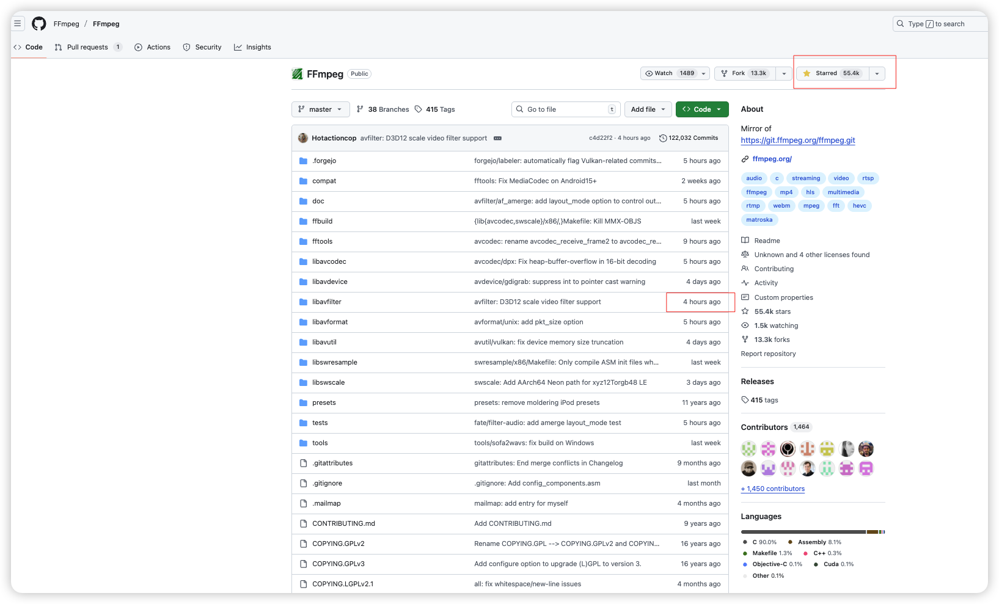
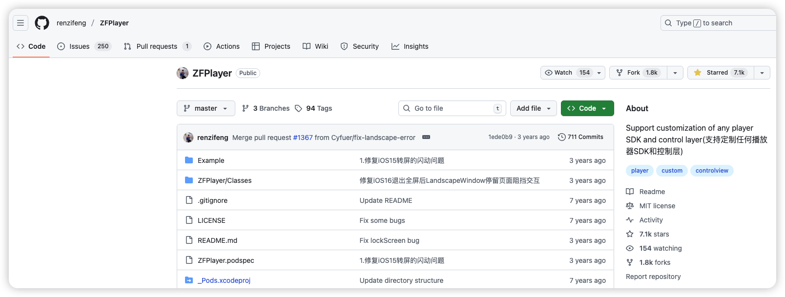
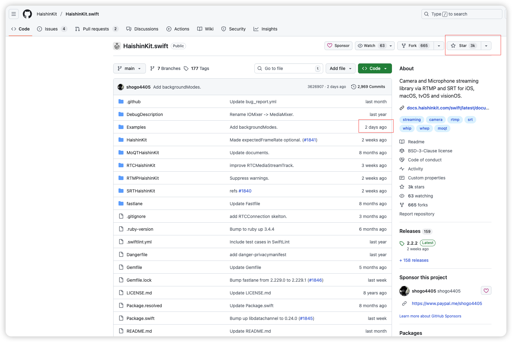
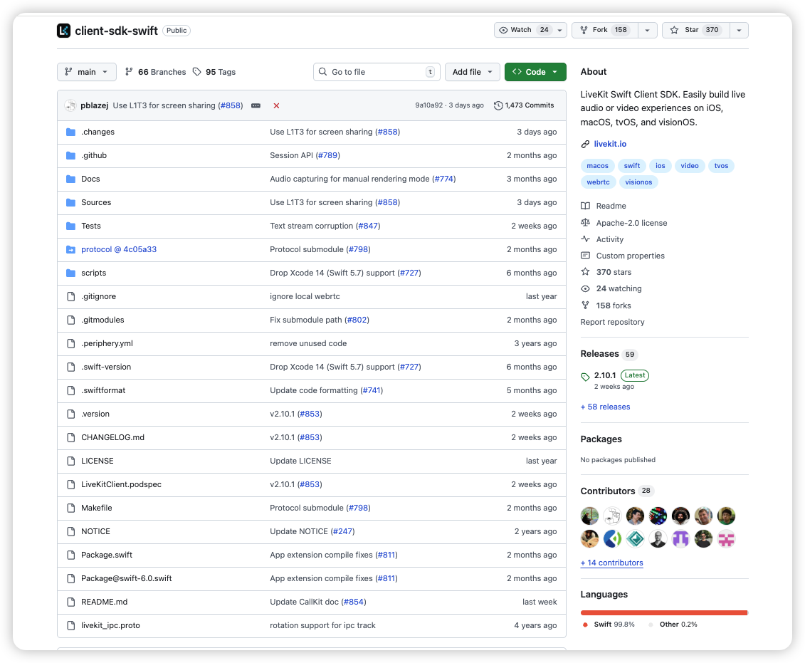
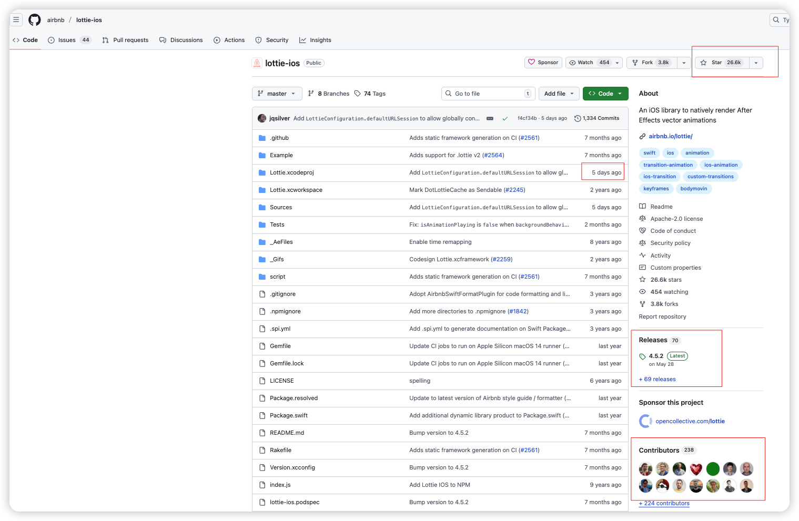
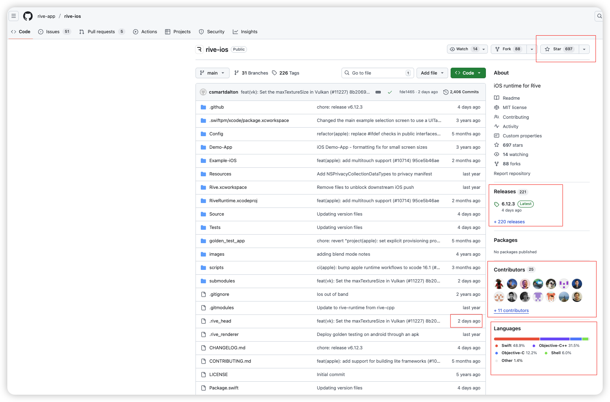
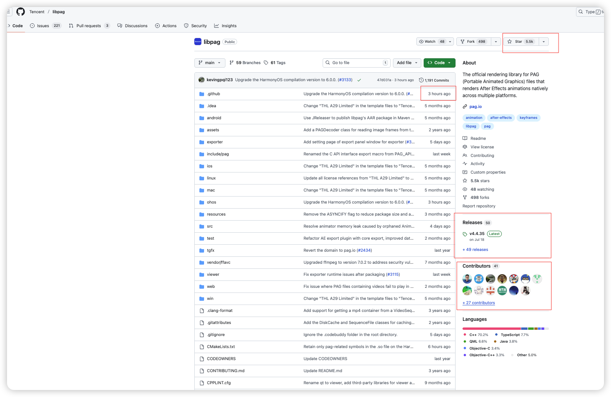

# Swift直播项目核心技术研讨

[toc]

## 一、前言

* 直播项目的核心难点，在于视频数据的处理，以及礼物特效

* 音视频这块是一个独立的领域，没有涉及过的技术人员，从理解基本原理到相关概念入手会比较吃力（在没有AI为辅助的基础上，目测需要3个月时间）

  * 寻找相关文档
  * 验证文档内容的真实可靠性
  * 寻找适合的SDK或者相关开源框架
  * 后端同样需要统一的齐平配合（统一的数据封装协议，流媒体服务器）

* 对于海外项目，特别是涉灰产业，直播这块如果定位于长期战略，<font color=red>**强烈建议自建播放器**</font>

  * 需要将最核心的组件部分，牢牢掌控在自己手里，防止因为政策变动，导致不可用
  * 一定是有内容过滤。是否启用全凭政策，而政策又是摇摆的
  * 大厂的播放器虽然稳定，对程序员来讲极度友好，但是代价（或者是隐患）就是：核心部分还是会打成`*.framework`或者`*.a`/`*.o`文件，如果涉及到特殊需求，可能难以入手

* 音视频的控制粒度很细，全球公认的一个基础起点是[**ffmpeg**](https://www.ffmpeg.org/)（持续更新中...）**至今无人超越**

  

  * 核心代码为C/C++。针对硬件加速（硬解码）的部分，会涉及到汇编

    * 在具体的绑定层，才涉及到具体的特殊的语言转译

  * 依据支持的音视频格式的不一，在代码层，提供了用户自定义的选择（意味着，需要根据自己的实际场景需求去打包）

  * 中国内地大厂的播放器（比如：QQ影音、爱奇艺...），均是在此基础上构建起来的（[**ffmpeg**](https://www.ffmpeg.org/)要求免费开源，而中国大陆项目在商业上使用（收费），所以被[**ffmpeg**](https://www.ffmpeg.org/)钉上了**耻辱柱**）

  * 在中国大陆，涉及到音视频相关产业的工程师的起薪，同级别要比其他要高1～1.5个层次（面试的时候，需要能准确说出[**ffmpeg**](https://www.ffmpeg.org/)指定函数的原理和机制）

  * 因为这个过程非常复杂，传统的做法就是在一些开源的框架上去进行二次封装和开发（深度修改和定制化开发，耗时耗力）我们需要在成本与产出之间寻求一个合理的平衡点

  * 那么，对**普通的用户端**来讲，其实只需要面对一个稳定的播放器（避免卡屏、蓝屏、有声音无图像、有图像无声音、音视频没对齐）足矣（面对一个URL来完成播放），**特效都是建立在播放器控制层来完成的**（比如水印）

    * 对移动端iOS@**OC**，播放器推荐选用[**ZFPlayer**](https://github.com/renzifeng/ZFPlayer)。推荐理由：稳定、Star高、支持高度自定义、内部解耦合理，来自社区9个贡献者

      

    * 对移动端iOS@**Swift**，播放器推荐选用[**BMPlayer**](https://github.com/BrikerMan/BMPlayer)。推荐理由：参考[**ZFPlayer**](https://github.com/renzifeng/ZFPlayer)，作为一个稳定库最近一年也在更新，Star不低，来自社区24个贡献者

      

  * 对主播端来讲，情况就有些复杂，我们要面对复杂的数据采集编码，其中包括但不仅限于：
  
    * 摄像头采集
  * 麦克风采集
    * 视频/音频编码参数（分辨率、码率、帧率、GOP）：
  * RTMP/WebRTC 推流
    * 美颜/滤镜/贴纸（两端都可以做滤镜，**但是更为主流的做法是放在主播端**。云端美颜 / 特效理论上可以，但成本和延迟都很高，一般是大厂、特定业务才会玩）
  * 弱网自适应码率、断线重连（推流侧那一套）
    * 把声音和图像合二为一（**只有多路混流（PK、连麦、大合唱）在服务器端做整合**）
  * 媒体流加密 / 自定义加密：第一层加密肯定是在主播端，服务器只做路由和内容转发。加密也分传输层（协议层）的加密➕内容加密
  
* 服务器端：内容转发、路由、**水印**

  * <font color=red>**对数据进行切片，形成`*.m3u8`，对客户端（HLS）**</font>
  
* 画中画效果：实现端是具体的设备端，比如iOS/Android层

## 二、推流端（主播）架构

* **采集模块**

  * 摄像头采集
  * 麦克风采集
  * 输入参数：分辨率、fps、前/后摄像头、采样率等

* 处理模块

  * 美颜、滤镜、贴纸
  * 通常基于 [**GPUImage**](https://github.com/BradLarson/GPUImage)（历史包袱，已被逐步被淘汰） / **Metal** / 内置美颜 SDK

* **编码模块**

  * H.264 / H.265 视频编码
  * AAC 音频编码
  * 码率、GOP、profile-level 设置

* **网络推流模块（服务器集群）**

  * RTMP / SRT / WebRTC / 自家协议
  * 重连、网络切换（4G ↔ Wi-Fi）

* 会话控制模块

  * 状态机

    ```swift
    enum LivePusherState {
        case idle           // 初始态，什么都没干
        case preparing      // 正在做准备（申请权限、配置 session）
        case ready          // 采集和编码都就绪了，可以 start
        case connecting     // 正在连接推流服务器（RTMP/WebRTC/SRT）
        case publishing     // 推流中（音视频数据在往外发）
        case reconnecting   // 断线重连中
        case stopped        // 正常停止
        case error(LiveError) // 异常终止（权限拒绝/网络挂了/编码失败）
    }
    ```

  * 错误上报、码率统计、丢帧统计、日志上报

## 三、<font color=red>推流端（主播）开源框架</font>

### 1、传统直播（RTMP/SRT/CDN）



*  [**HaishinKit.swift**](https://github.com/HaishinKit/HaishinKit.swift)的推荐理由
  * 纯[**Swift**](https://www.swift.org/)开发，社区很活跃（79名贡献者，159个正式版本，最近一次提交位于2日前）
  * [**HaishinKit.kt**](https://github.com/HaishinKit/HaishinKit.kt)支持**Android**
  * [**haishin_kit**](https://pub.dev/packages/haishin_kit)支持**Flutter**
  * Camera + Mic 采集
  * H.264 视频 + AAC 音频编码
  * RTMP / RTMPS / SRT 推流
  * 支持 iOS / macOS / tvOS / visionOS，一直在更新，10 年老项目。

### 2、互动直播 / 连麦（WebRTC 路线）



* [**livekit**](https://github.com/livekit/client-sdk-swift)推荐理由
  * 纯[**Swift**](https://www.swift.org/)开发，社区很活跃（28名贡献者，59个正式版本，最近一次提交位于3日前）
  * [**client-sdk-flutter**](https://github.com/livekit/client-sdk-flutter)支持**Flutter**
  * [**client-sdk-android**](https://github.com/livekit/client-sdk-android)支持**Android**
  * 基于 WebRTC 的实时音视频框架，**客户端 SDK + 开源服务器**。
  * 整体代码基本开源（只是它同时卖一个托管的 Cloud 服务而已,<font color=red>**付费**</font>），服务端是Go
    * 采集摄像头 / 麦克风
    * 发布本地 tracks（主播）
    * 订阅远端 tracks（观众 / 其他麦位）

## 四、滤镜

* 本质：对音视频信号做一层「加工处理」的算法或效果
  * 对**图像/视频**来说
    * 美颜（磨皮、美白、大眼瘦脸）
    * 变色（黑白、复古、HDR、冷色调、暖色调）
    * 模糊、虚化背景
    * 加边框、加贴纸、加马赛克、抠图换背景
  * 对**音频**来说（对声音波形做处理）
    * 降噪、回声消除
    * 均衡器（调高低音）
    * 混响、变声（男变女、萝莉音）
* <font color=red>**滤镜不止可以运行在客户端，也可以运行在服务器端**</font>
  * 对客户端：在推流之前，对采集到的数据进行处理
  * 对服务器端：缩放分辨率、裁剪、叠加台标（水印）、旋转、打字
* 「滤镜」不是一个具体的控件，而是一套**处理音视频数据的算法/效果链**
* **用现成的美颜SDK（不建议自己搞，工作量很可观）**
  * FaceUnity
  * Banuba / 其他 Beauty AR SDK
  * 腾讯系美颜（TRTC / Beauty AR SDK）

## 五、礼物特效

> 大部分「礼物特效」**严格意义上不叫滤镜**，但实现上会用到跟滤镜类似的渲染技术。<font color=red>**意味着礼物特效的播放是单独的播放引擎来处理**</font>

### 1、可选方案

* [**SVGA**](https://svga.dev/)

  * 优点：

    - 跨平台支持： iOS / Android / Flutter / Web / HarmonyOS
    - 天然支持“**大量贴图 + 关键帧**”类型动画，很适合礼物那种：
      - 大图飞进飞出
      - 星星、爱心、硬币乱飞
    - 支持合成、混合模式，搞一些“假 3D”透视、炫光也没问题。
    - SVGA 在“礼物动画”这种重贴图、多关键帧场景下，通常比 Lottie 更稳定
    - 国内大厂也用（比如，腾讯）

  * 缺点：

    - <font color=red>**已停更**</font>（无法适配更新的系统和硬件，出问题全靠自己修）
    - 源代码是OC
    - **不支持“真 3D”，只能做“伪 3D”。**
    - 矢量支持不如 [**Lottie动画播放器**](https://github.com/airbnb/lottie-ios) 完整，更多是位图 + 路径
    - 设计链路要用它自己的工具链（现在也有 AE 插件，但没有 Lottie 那么主流）

* [**Lottie动画播放器**](https://github.com/airbnb/lottie-ios)：接受的源文件（礼物特效）。UI 在 **After Effects** 里做动画利用插件（Bodymovin / LottieFiles AE 插件）导出特定格式动画

  * 优点：
    * 跨平台支持：iOS / Android / Web / React Native / Windows / Flutter
    * Lottie 是更通用的 UI 动效格式
    * 矢量为主，放大不糊，适合 UI 风格。
    * 和 AE 结合紧密，设计师用 Bodymovin 导出就行。
    * 支持部分表达式、蒙版、渐变等效果。
  * 缺点
    * Lottie 在 **轻量 UI 动效** 很舒服，但做大礼物时：JSON 体积会膨胀、解析 & 渲染压力会增加，容易掉帧
    * AE 里有些复杂效果不支持（比如某些插件/3D 效果）。
    * 大动画（粒子多、图层多）性能和体积会顶不住。
  * 输出格式：
    * 主格式为：`*.json` （包含：图层、形状、路径、关键帧、缓动曲线、外部图片资源）
    * 副格式为：`*.lottie`

  

* [**Rive动画播放器**](https://github.com/rive-app/rive-ios)：矢量 2D + 状态机，比 [**Lottie动画播放器**](https://github.com/airbnb/lottie-ios) 更偏“交互”。[**Rive Editor**](https://rive.app/editor)制作动画源文件导出至`*.riv`

  * **Rive 不支持真正的 3D，它是 2D 矢量动画引擎**。
  
  
  
* [**Tencent@libpag**](https://github.com/Tencent/libpag) :

  
  
* **SpriteKit**：<font color=red>**Apple 自带的 2D 引擎**</font>，本质是做 2D 游戏的：场景（`SKScene`）+ 精灵（`SKSpriteNode`）+ 粒子 + 物理

  * 跟 iOS 底层 Metal 集成得很好，性能强、调度可控。可以自己实现：
    - 精灵帧动画（序列图）
    - 粒子效果（烟花、爆炸、雨雪）
    - 文本/图片拼礼物卡片
  
* #### [**Unity**](https://unity.com/)（好是好，可是太重了，一般用于游戏渲染。不推荐）

  > **个人或者小团队用 Unity，是可以免费用的**；只有做到一定规模、赚钱到一定程度，才必须付费买 Pro / Enterprise。
  >
  > 之前吵得很凶的 **Runtime Fee（按安装收费）已经取消了**，现在就回到传统的「免费 Personal + 付费订阅」模式
  
  * Unity Personal（免费版）
  
    * **价格：免费**
    * 资格条件：最近 12 个月，和这个项目相关的**收入 + 融资 < 20 万美金**（$200,000）。特点：
      - 引擎核心功能都能用
      - 允许商用、上架商店
      - 现在连 “Made with Unity” 开屏都可以去掉（Unity 6 起）。
  
  * Unity Pro <font color=red>**付费**</font>
  
    * 价格：现在大约 **$2,200 美金/年/每个开发者账号**（按座位计费）
    * 资格条件：最近 12 个月相关收入/融资 **> 20 万美金** 且 < 2500 万美金
  
  * Unity Enterprise  <font color=red>**付费**</font>
  
    * 价格：定制报价，更贵
    * 资格条件：最近 12 个月相关收入/融资 ≥ 2500 万美金 

### 2、建议

* 不建议用`*.gif`格式做动效
  * 帧率和画质很不耐看
  * 无法控制播放行为（播放过程中暂停、重启）
* 想生态、安全、教程多：**Lottie** ✅
* 想交互多、以后可玩性高：**Rive** ✅
* 想跟国内视频 / 直播生态更贴：可以研究 **PAG（libpag）**，但上手成本会高一点。
* 前期全部的礼物特效是围绕2D特效展开
* 视频播放也可以作为一个参考面
* 3D特效需要更大的成本开销，在前期试探市场反应的情况下，不建议继续探索。成本更应该用在播放器的推拉流稳定性上

## 六、整体构架

* 底层：视频播放器（OC用[**ZFPlayer**](https://github.com/renzifeng/ZFPlayer)，Swift项目用[**BMPlayer**](https://github.com/BrikerMan/BMPlayer)）
* 中间：普通 UI：弹幕、在线人数、主播信息等
* 顶层：礼物特效层（需要长链接）


