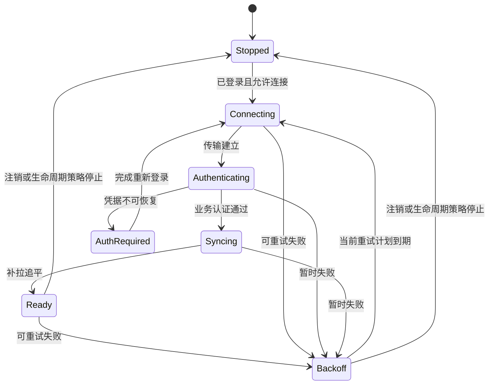

# iOS IM 连接管理与推送后台


[toc]

---

## 🔥 <span id="前言">前言</span>

> [返回《iOS IM 开发研究手册》](../iOS%20IM开发研究手册.md)。本专题解决三个问题：前台如何持续收发、断线如何恢复、后台无法常驻时如何提醒并补齐消息。

**连接负责传输，业务协议负责确认与同步，推送负责通知；三者必须配合，不能互相替代。** 本文讨论普通即时通讯 App；真实音视频通话另有通话框架与后台能力要求。

资料核对日期：**2026-09-25**。以下架构、参数选择与实验是工程设计建议；平台行为以链接中的官方说明、实际 SDK 和真机结果为准。伪代码没有编译运行，不代表任何商业 IM 的内部实现。

阅读路线：<a href="#scope" style="color:red; font-weight:bold;">职责边界</a> → <a href="#transport" style="color:red; font-weight:bold;">传输选型</a> → <a href="#state-machine" style="color:red; font-weight:bold;">状态机</a> → <a href="#lifecycle" style="color:red; font-weight:bold;">后台边界</a> → <a href="#apns" style="color:red; font-weight:bold;">APNs</a> → <a href="#extensions" style="color:red; font-weight:bold;">通知扩展</a> → <a href="#experiments" style="color:red; font-weight:bold;">实验</a> → <a href="#faq" style="color:red; font-weight:bold;">FAQ</a>。

## 一、<span id="scope">先划清职责与成功语义</span>

### 1.1、<span id="layers">一条消息经过哪些层</span>

```text
消息发送意图 → 本地 Outbox → 应用协议 → 连接管理 → TLS / 传输
                                                   ↓
接收 UI ← 本地持久化与同步协调 ← 服务端消息系统 ← 接入网关
                                  ↓
                            APNs 通知链路
```

Outbox 是客户端持久化的待发送任务；消息系统负责服务端接收、分配标识、存储与投递；接入网关负责连接认证、路由和流量控制。即使前台长连接和 HTTP 补拉使用不同接口，最后也要进入同一套幂等落库流程。

### 1.2、<span id="success-levels">不要把多种成功合成一个布尔值</span>

| 观察到的事件 | 可以推断什么 | 不能据此推断什么 |
| --- | --- | --- |
| 本地 `send` 回调没有错误 | 当前发送操作在 API 定义层面成功 | 服务端已持久化消息 |
| TCP 确认或 WebSocket Pong | 对应传输层或协议端点有响应 | 消息已落业务库、接收人已读 |
| 服务端业务 ACK | 服务端完成协议约定的阶段 | 必然已经到达对方设备 |
| 接收设备持久化回执 | 该设备完成约定的本地提交 | 该用户看到了消息 |
| APNs 返回成功状态 | 推送请求被 APNs 成功接收处理 | 设备已经收到或用户已经看到 |
| 通知被点击 | 用户触发了这个通知的动作 | 历史已补齐、消息内容已展示 |

产品中的“发送中、已发送、已送达、已读”应有独立事件与时间戳，且明确“任一设备”还是“所有设备”。服务端业务 ACK 必须写入协议文档，不能由 iOS 客户端根据网络回调自行猜测。

### 1.3、<span id="invariants">连接层必须守住的四条不变量</span>

1、同一账号会话在单个客户端实例内，只有一个连接协调者拥有建连、关闭、重试和令牌刷新决策权。

2、重连可以重复发送同一业务请求，但请求必须复用稳定的幂等标识；重连次数不能变成消息副本数。

3、旧连接和旧账号的异步回调不能修改当前账号的连接状态、数据库或 UI。

4、收到连接成功事件以后，仍须按已持久化游标补齐缺口；“在线”与“同步完成”是两个状态。

## 二、<span id="transport">传输方式如何选择</span>

### 2.1、<span id="transport-matrix">围绕约束选择 API 与协议</span>

| 方案 | 适合的场景 | iOS 侧必须承担的工作 |
| --- | --- | --- |
| [**URLSessionWebSocketTask**](https://developer.apple.com/documentation/foundation/urlsessionwebsockettask) | 服务端提供标准 WebSocket，双向消息频繁 | 生命周期、认证、串行接收入口、超时、补拉与背压 |
| [**Network.framework**](https://developer.apple.com/documentation/network) | 有明确自定义传输需求，或需要较细的连接与协议控制 | 协议分帧、状态管理、读写调度，以及所选传输的兼容验证 |
| HTTP 短轮询 / 长轮询 | 原型、低频消息、受限网络中的降级通道 | 轮询游标、取消、超时、限流、重复响应和空轮询成本 |
| [**SSE**](https://html.spec.whatwg.org/multipage/server-sent-events.html) | 服务端持续向客户端下发事件，上行可以另走 HTTP | 流式解析、事件 ID、重连恢复和上行链路协调 |
| [**MQTT**](https://docs.oasis-open.org/mqtt/mqtt/v5.0/os/mqtt-v5.0-os.html) | 已有 MQTT 基础设施、发布订阅模型适合业务 | SDK 评估、会话与订阅恢复、主题授权、业务幂等与后台策略 |

表格是工程选型建议，不能只按“哪个更底层”作决定。先列业务 SLA、消息规模、协议控制权、代理环境、维护能力，再用同一组弱网与生命周期实验比较。

### 2.2、<span id="websocket-network">WebSocket 与 Network.framework 的边界</span>

标准 WebSocket 已经定义消息、分片、控制帧和关闭过程；采用系统 API 时，不要再手写一套 WebSocket 帧解析。原始 TCP 则只有字节流，需要设计长度前缀、版本、类型和上限，处理任意切分及合并。协议依据见 [RFC 6455](https://www.rfc-editor.org/rfc/rfc6455)。

`Network.framework` 是网络 API 集合，不等于“自定义 TCP 协议”；也不能简单声称它必然比 `URLSession` 快。只有证据显示上层 API 无法满足协议或控制需求时，额外的实现与测试成本才有依据。

### 2.3、<span id="polling-sse">HTTP 轮询与 SSE 的恢复设计</span>

短轮询的时间间隔越短，延迟通常越低，但空请求和无线电唤醒成本越高。长轮询让服务端等待事件再返回，客户端处理后发起下一轮；需要避免两个轮询任务同时推进同一游标。代理提前断开属于常见恢复路径，不能当成无消息。

SSE 使用 `text/event-stream`，事件可以携带 `id`，标准定义了重连时 `Last-Event-ID` 的语义；原生客户端需要实现或选用正确的解析器，不能把每个网络数据块当成一条完整事件。这个 ID 是否能直接作为 IM 同步游标，仍取决于服务端保存、过滤和补拉协议。标准细节见 [WHATWG SSE](https://html.spec.whatwg.org/multipage/server-sent-events.html)。

上述方案都不赋予普通 App 后台永久运行资格。准备降级通道时，必须让长连接消息、轮询结果与 SSE 事件复用同一消息模型和去重规则，避免切换协议时重复入库、重复提示。

### 2.4、<span id="mqtt-qos">MQTT QoS 不等于 IM 业务“恰好一次”</span>

MQTT 的 QoS、会话过期、保留消息、遗嘱、订阅和消息过期各有明确协议语义；它们解决客户端与 Broker 等协议参与者之间的问题。即使采用 QoS 2，也不能自动覆盖“业务服务落库 → 多端扇出 → 接收端数据库 → 未读计数”的整条链路。

评估 MQTT SDK 时，要验证持久会话恢复、客户端标识冲突、离线队列上限和重订阅行为。主题授权应由服务端执行，不能靠客户端约定“用户只订阅自己的 topic”。依据见 [OASIS MQTT 5.0](https://docs.oasis-open.org/mqtt/mqtt/v5.0/os/mqtt-v5.0-os.html)。

## 三、<span id="framing">帧、业务包与接收背压</span>

### 3.1、<span id="frame-envelope">三个长度边界分别处理</span>

TCP 数据片段、WebSocket frame、应用 envelope 是三种不同边界。一个 WebSocket message 可以由多个 frame 构成；一个业务 envelope 也可以承载一批消息。业务批量包必须带条数、协议版本及必要标识，不能仅凭一次回调认定它是“一条聊天消息”。

`URLSessionWebSocketTask.receive` 返回的是拼接完成的 WebSocket message。`maximumMessageSize` 限制其缓冲大小，包含 continuation frames 的累计字节数；还需另设解压后字节数、嵌套深度、单批消息条数等业务上限，防止“小压缩包解成大对象”。见 [maximumMessageSize](https://developer.apple.com/documentation/foundation/urlsessionwebsockettask/maximummessagesize)。

### 3.2、<span id="receive-loop">一个连接只保留一个接收循环所有者</span>

设计上让每个连接拥有一个 receive loop：一次接收成功，验证连接代次后把消息移交有界队列，再等待下一次接收；失败转交连接状态机。这里是为了简化顺序与生命周期的工程约束，不是声称框架通过它提供业务“恰好一次”。

```text
receiveLoop(connection, generation):
    while generation == currentGeneration and not cancelled:
        message = await connection.receive()
        rejectIfOversizedOrUnsupported(message)
        await boundedIngress.enqueue(message, accountEpoch, generation)
    // error → only coordinator decides whether to reconnect
```

不要在 `receive`、心跳失败、网络变化和登录回调中分别启动新的循环。连接已经替换后，旧 loop 即使刚好收到一条有效消息，也必须按原账号与代次校验，不能直接写入当前库。

### 3.3、<span id="bounded-pipeline">背压需要协议配合</span>

接收后同步解析全部历史、建模并通知主线程，会让短时消息洪峰拖垮连接回调。推荐把轻量校验、解码、存储和展示分开，但各层都要有容量上限；并发解码结束顺序不能替代会话序列号。

有界队列满时暂停继续请求消息，只能限制客户端下一段处理量，不能保证网络栈和服务端没有缓冲。可靠方案还应定义服务端窗口、分批拉取、限速，或关闭后通过持久化游标恢复。不能静默丢弃一批消息以后仍推进同步游标。

## 四、<span id="state-machine">连接状态机与异步竞态</span>

### 4.1、<span id="states">状态要能解释下一步动作</span>



这个图展示主要路径；实际实现应让任何活动状态都能响应注销、取消、协议不兼容和凭据失效。`Ready` 表示已经完成本轮必要同步，不只是 WebSocket 握手完成。历史很长时可细分“实时通道可用”和“历史追平进度”，避免 UI 长期只显示连接中。

### 4.2、<span id="generation">代次隔离比到处判断 isConnected 更可靠</span>

`accountEpoch` 表示登录上下文代次，`connectionGeneration` 表示某次连接实例，`attemptID` 表示一次具体异步操作。新登录、注销或替换连接时递增相应代次；每个回调携带创建时的上下文，变更状态前先比较。

这样可以拒绝“旧连接失败回调关闭了新连接”“A 账号刷新令牌成功后覆盖 B 账号令牌”“退后台前的重试定时器在回前台后再创建第二条连接”等竞态。取消任务仍需代次校验，因为取消与回调完成可以同时发生。

### 4.3、<span id="connection-owner">串行协调者只编排，不承包重活</span>

```text
onEvent(event):
    if event.accountEpoch != currentAccountEpoch: ignore
    if event.hasGeneration and event.generation != currentGeneration: ignore
    nextState, effects = reduce(state, event)
    state = nextState
    runEffectsOutsideStateMutation(effects)

replaceConnection():
    increment currentGeneration
    cancel old receiveLoop, heartbeat, reconnectPlan
    close old transport
    start one new transport with currentGeneration
```

协调者可以由串行队列或 actor 实现，但网络请求、解密、数据库事务不应长时间占住其状态变更路径。使用 actor 也要考虑 `await` 之后状态已改变：恢复执行后重新核对账号代次和操作标识。

## 五、<span id="authentication">连接认证与令牌刷新</span>

### 5.1、<span id="auth-protocol">传输建立以后还需要业务会话</span>

TLS 确认的是所连接端点的安全属性，业务认证确认当前账号及权限。认证可放在握手头或应用消息中，具体方式由服务端协议决定；需要协商账号、设备会话、协议版本、能力和恢复参数。不要把持久登录令牌放入容易进入访问日志的 URL 参数。

只有拿到业务认证结果后才发送待发消息或补拉私有历史；认证失败时应停止相关调度。客户端本地时间不可靠，令牌提前刷新可以作为优化，但最终必须处理服务端返回的过期和撤销结果。

### 5.2、<span id="single-flight">single flight：一次刷新，多方等待</span>

同一账号可能同时有长连接、补拉请求、上传请求发现令牌过期。single flight 指这些请求共享一个正在进行的刷新任务，而不是各自刷新；否则刷新令牌轮换时容易互相覆盖并制造失效循环。

```text
validAccessToken(accountEpoch):
    if cachedTokenStillUsable: return cachedToken
    task = existingRefreshTaskForSameEpoch or createAndRegisterOne(accountEpoch)
    try:
        result = await task
        if accountEpoch != currentAccountEpoch: reject stale result
        install result atomically, without overwriting a newer token version
        return result.accessToken
    finally:
        clear refreshTask only if it is still this task and this task has completed
```

失败也需要统一广播与分类。临时网络失败进入有限退避；刷新凭据被服务端撤销则进入需要登录状态。重放原请求时保留消息幂等标识，并设置认证重试预算，禁止每次 401 都无限刷新。

### 5.3、<span id="credential-lifecycle">刷新完成不代表已有连接自动换身份</span>

明确协议是否支持连接内重新认证；不支持时，用新令牌建立连接并同步恢复。不要假设修改内存中的 token 会更新已完成的握手。注销时使账号代次失效、取消刷新任务、停止发送，并按服务端协议解除设备推送绑定。

## 六、<span id="heartbeat">心跳、超时与重连退避</span>

### 6.1、<span id="heartbeat-semantics">先决定要探测哪一层</span>

WebSocket Ping/Pong 用来探测 WebSocket 对端；若网关能够独立响应 Pong，它不能证明下游消息服务和数据库健康。业务心跳可以返回服务器时间、会话有效性或同步提示，但每个字段的含义都要有协议约定。控制帧语义见 [RFC 6455 第 5.5 节](https://www.rfc-editor.org/rfc/rfc6455#section-5.5)。

至少区分建连超时、认证超时、心跳超时、单条消息 ACK 超时和补拉超时。消息 ACK 超时通常代表“结果未知”，需要查询状态或幂等重投；不能直接生成新消息 ID 再发一条。

### 6.2、<span id="heartbeat-tuning">心跳不能拍脑袋固定成通用数字</span>

心跳间隔应结合 NAT / 网关空闲超时、前台消息活跃度、网络 RTT、失败分布与能耗测量。无待确认心跳时才发下一个，记录对应探测 ID；使用单调时钟计算超时，避免系统时钟改变造成误判断。

正常业务流量是否可以替代某种心跳，取决于它能否证明同一个探测目标仍活跃。App 从挂起恢复以后，先重评连接与时间基准，不要一次补发挂起期间所有 Timer 事件。

### 6.3、<span id="retry-jitter">退避、抖动与重试预算</span>

```text
capForAttempt = min(maxDelay, baseDelay * 2^boundedAttempt)
delay = randomUniform(0, capForAttempt)   // full jitter，示例策略
schedule exactly one retry for current generation
```

这是示例策略，参数必须通过压测调整。加抖动是为了避免大量客户端在故障恢复时同时重连；指数增长需要截断，避免数值溢出。稳定在线一段时间或完成有效业务交互后再重置尝试计数，避免“刚连上就断”的故障被不断重置成零延迟。

永久凭据失败、协议版本不支持、明确禁止接入不能无限重试。对暂时失败设置窗口内次数与总耗时预算；服务端下发限流或重试建议时按对应协议处理。用户主动重试也要通过协调者合并请求，不能绕过并发限制。

## 七、<span id="network-change">弱网、切网、TLS 与代理</span>

### 7.1、<span id="path-monitor">NWPathMonitor 不是业务可达性检测器</span>

[**NWPathMonitor**](https://developer.apple.com/documentation/network/nwpathmonitor) 观察网络路径变化；`satisfied` 表示路径可用于建立连接和发送数据，不证明 DNS、TLS、网关认证及业务 API 全部成功。状态定义见 [NWPath.Status](https://developer.apple.com/documentation/network/nwpath/status-swift.enum)。

可以用路径事件触发一次合并后的连接重评、调整大文件传输策略和提示离线，但实际连接结果才是端点可达性的证据。不要先等待监控器判定网络“完美”，才允许首次请求；`requiresConnection` 也不等于永久无网。

### 7.2、<span id="handover">Wi-Fi 与蜂窝切换后怎么处理</span>

切网可能保留连接、导致连接失败，或出现暂时看似在线的半开状态；取决于传输、系统与实际网络。先收集连接状态与读写结果，必要时进行探测或替换连接，随后从持久游标补齐。不要只凭接口名称变化就重建所有连接。

弱网下区分高 RTT、丢包、上行受阻、下行受阻、DNS 失败和服务端过载。它们都可能表现为“转圈”，但修复不同：盲目增加心跳、并发重试和缩短超时，可能把可恢复网络拖成重试风暴。

### 7.3、<span id="tls-proxy">TLS 与代理问题如何定位</span>

排查顺序建议是域名解析 → 目标端口 → TLS 握手与主机名 → HTTP / WebSocket 握手 → 业务认证 → 同步请求。生产环境保留系统证书校验；使用自定义传输时也必须正确配置 TLS，不能把“换成 TCP”理解成可以省略安全验证。

证书错误应检查域名、证书链、有效期、设备时间及企业代理环境。不要用关闭验证来修复生产连接失败。不同 API、代理类型与系统版本的行为需要实测；不能假定所有自定义 socket 都具备 `URLSession` 的代理集成能力。安全入口见 [Apple 安全网络连接](https://developer.apple.com/documentation/security/preventing-insecure-network-connections)。

## 八、<span id="lifecycle">iOS 前后台与执行资格</span>

### 8.1、<span id="background-matrix">把业务任务映射到正确系统机制</span>

| 任务 | 可用机制 | 工程边界 |
| --- | --- | --- |
| 前台实时收发 | 长连接或流式 HTTP | 仍需断线恢复与幂等 |
| 刚退后台时完成已开始的发送 / 保存 | `beginBackgroundTask` | 有限时间，必须处理到期并及时结束 |
| 非实时维护、索引或清理 | 合适的 Background Tasks API | 系统调度，不能承诺某秒运行 |
| 大文件上传 / 下载 | 后台 `URLSession` 文件传输 | 按任务与 session 标识恢复，不是通用 socket 保活 |
| 普通消息提醒 | 用户可见 APNs 通知 | 系统决定呈现，不能替代完整消息同步 |
| 静默刷新 | Background push | 尽力而为，可能延迟、合并和不交付 |
| 真实 VoIP 来电 | PushKit 与 CallKit 的对应流程 | 仅按真实通话用途使用，不能伪装为普通 IM 保活 |

机制选择依据见 [Apple 后台策略](https://developer.apple.com/documentation/backgroundtasks/choosing-background-strategies-for-your-app) 与 [后台文件下载](https://developer.apple.com/documentation/foundation/downloading-files-in-the-background)。新后台 API 的出现也不代表普通聊天连接获得任意时长执行权。

### 8.2、<span id="background-expiration">退后台时保住恢复点</span>

推荐顺序：停止非必要预取 → 保存待发送任务和必要进度 → 尽快结束当前短事务 → 在允许时间内完成必要网络操作 → 结束后台任务。到期处理要可取消、可重入，不在回调里启动全量同步或长事务。

`beginBackgroundTask` 请求的是有限执行时间，并不是“每调一次增加固定分钟数”。每个成功取得的任务标识必须匹配结束调用；请求失败、提前到期和业务完成都要覆盖。具体约束见 [延长后台执行时间](https://developer.apple.com/documentation/uikit/extending-your-app-s-background-execution-time)。

### 8.3、<span id="suspension-recovery">被挂起、被终止、被用户强退要分开测</span>

普通 App 挂起后，自己的 Timer 和接收循环不能作为持续执行保证；进程被终止时也不能依赖某个退出回调保存最后状态。关键任务必须先持久化，启动与回前台均从持久状态恢复。

用户强退与系统回收不是同一实验条件。后台通知可能被系统延后或丢弃，用户强退还会影响后台启动行为；可见通知、静默通知、真实 VoIP 来电应分别测试。不要从“某次真机收到了推送”推导所有状态都能唤醒主 App。背景通知限制见 [Apple Background updates](https://developer.apple.com/documentation/usernotifications/pushing-background-updates-to-your-app)。

## 九、<span id="apns">APNs 与多设备通知一致性</span>

### 9.1、<span id="apns-role">APNs 是提醒与同步线索</span>

[**APNs**](https://developer.apple.com/documentation/usernotifications) 的交付不是消息数据库的可靠复制协议。通知 payload 携带最少必要的消息 / 会话定位与版本线索；真正内容和状态通过可靠同步取得。服务端保存消息是根本，App 没收到某条推送时，下次打开也必须能补齐历史。

不能用“收到 5 条通知”直接给未读数加 5。折叠、延迟、跨端已读和撤回会让这个算法失真；通知中的 badge 也可能过时。回前台以后按可信同步结果校准会话未读和总 badge。

### 9.2、<span id="apns-request">请求成功、设备送达与用户查看分别观察</span>

服务端日志记录业务消息 ID、设备绑定版本、环境、topic、`apns-id`、响应状态与耗时；客户端按可观测入口记录通知回调、扩展处理和点击。APNs `200` 不能直接记为接收设备业务送达；错误应按 `reason` 分类。`BadDeviceToken` 要检查环境，`410` 要处理失效 token，而不是无休止重试。见 [APNs 响应](https://developer.apple.com/documentation/usernotifications/handling-notification-responses-from-apns)。

`apns-expiration` 表示通知仍有价值的时效策略，`apns-collapse-id` 表示可合并通知的身份，`apns-push-type` 与优先级应匹配 payload。会话摘要可以考虑折叠，但撤回、来电与每条独立事件需分别设计；这些头都不是消息去重或排序协议。见 [发送 APNs 请求](https://developer.apple.com/documentation/usernotifications/sending-notification-requests-to-apns)。

### 9.3、<span id="device-token">Token、环境、账号不能混成一列</span>

APNs device token 表示 App 与设备组合的推送地址，不是用户 ID，也不是登录凭据。App 每次启动向系统注册，取得当前 token 后安全上传；不要依赖本地缓存 token 作为长期真值。注册失败要有后续恢复，服务端应支持同一账号的多个设备。依据见 [注册 APNs](https://developer.apple.com/documentation/usernotifications/registering-your-app-with-apns)。

建议绑定键包含 `installationID + environment + topic + pushType`，绑定值包含账号、当前 token、绑定版本与更新时间；这是业务建模建议。开发、生产、多个 Bundle ID 和普通 / VoIP token 分开管理。设备重新安装时本地安装标识也可能变化，不能把它当永久硬件身份。

切换账号时，用鉴权接口完成旧绑定解除和新绑定建立，携带单调绑定版本或服务端会话约束，拒绝晚到的旧请求。离线注销的解除请求可能暂时送不出去，因此通知文案要有隐私兜底，后续补偿解绑，点击与扩展处理都再次核对账号上下文。

### 9.4、<span id="notification-dedup">通知去重、消息去重和多端已读各自建模</span>

消息去重使用稳定业务消息 ID；通知展示去重可使用“账号 + 通知事件 ID + 修订号”；多端已读使用服务端定义的会话已读游标或事件。前台长连接和 APNs 同时到达时，可在 `willPresent` 里结合当前会话与展示策略决定是否提示，入库仍走统一幂等路径。

服务器根据设备活跃租约和已读进度减少无效推送，但状态可能过期，不能完全避免所有重复提醒。另一设备已读后，本机同步更新并清理适用的已投递通知；不能保证远程已经显示的通知在没有本机执行机会时立即消失。前台呈现与通知动作入口见 [处理通知与动作](https://developer.apple.com/documentation/usernotifications/handling-notifications-and-notification-related-actions)。

## 十、<span id="extensions">通知扩展、冷启动与跨进程存储</span>

### 10.1、<span id="nse">NSE 只负责有限的通知加工</span>

[**UNNotificationServiceExtension**](https://developer.apple.com/documentation/usernotifications/unnotificationserviceextension) 可用于通知内容解密、补充展示信息或下载小附件；满足系统条件的可见远程通知及 `mutable-content: 1` 才会触发它。它不是静默通知通用处理器，也不是完整 IM 主进程的替身。

先构造可安全展示的 `bestAttemptContent`，再异步加工。正常完成与 `serviceExtensionTimeWillExpire` 共享一次性完成门，确保只提交一次；到期时取消工作并尽快返回兜底内容。官方说明执行时间有限，不能把文档中的约数当成保证预算。条件与超时行为见 [修改新通知内容](https://developer.apple.com/documentation/usernotifications/modifying-content-in-newly-delivered-notifications)。

原始 payload 的可见文字也要安全，因为扩展不执行、解密失败或超时时，系统可能显示原内容。不要把“把 body 改为空”当作可靠静默取消方案；敏感预览策略应在服务端构造通知时就确定。

### 10.2、<span id="app-groups">App Groups 共享的是文件空间</span>

[**App Groups**](https://developer.apple.com/documentation/xcode/configuring-app-groups) 允许 App 与扩展访问共享容器，但它们仍是不同进程；主 App 的单例、actor、串行队列和内存缓存不会自动对扩展生效。两边都需要正确的 entitlement、容器路径和数据版本约定。

优先让扩展只读取必要快照或写入一个小型、可重放收件箱，主 App 恢复时统一合并；若必须共享数据库，就明确多进程并发、锁超时、迁移所有者与提交边界。不能在 NSE 中抢做复杂数据库迁移，也不能把进程内串行队列当成跨进程锁。

共享偏好适合小配置，不能替代事务日志。共享数据库或文件还需考虑设备锁定时的数据保护可用性；解密密钥是否允许被扩展读取，应由安全方案和 Keychain 访问组决定，不能为了预览把全部密钥复制到普通共享偏好。

### 10.3、<span id="cold-start-routing">点击通知时先恢复上下文，再导航</span>

```text
通知响应 → 解析受控路由意图 → 校验账号与 action → 保存待处理意图
         → 恢复登录 / 打开账号库 → 等待目标 Scene 可用
         → 查询本地消息，必要时补拉 → 导航会话并定位
```

路由结构建议包含 `accountID、conversationID、messageID、action、eventID`。只允许白名单动作，不执行任意 payload URL；目标不存在、被撤回、当前账号不同或权限已取消时，给出可解释的结果。通知点击不应绕过业务鉴权。

尽早设置 `UNUserNotificationCenter.delegate`，把冷启动、热启动和通知动作汇入同一幂等路由队列。Scene 应由用户操作上下文及 App 的场景策略选定，不能直接使用 `connectedScenes.first`。原回调及时完成，导航等待与补拉可以交由拥有生命周期的协调者继续管理。

只有消息达到产品定义的可读条件后才发送已读回执；进入通知回调不等于用户已读。快捷回复要像普通发送一样先建立持久 Outbox 和稳定请求 ID，失败后保留可恢复状态，不能为了回调完成就宣称发送成功。

### 10.4、<span id="pushkit">PushKit 的来电职责不能借作保活</span>

真实 VoIP 来电按照 [Apple PushKit 响应流程](https://developer.apple.com/documentation/pushkit/responding-to-voip-notifications-from-pushkit) 与适用的 CallKit 要求处理，及时报告来电并管理通话状态；服务端带稳定 call ID，防止延迟、重复和已取消来电制造重复界面。

普通文字消息、拉历史、打心跳或后台保活不能伪装成 VoIP push。不能先把 PushKit 当作唤醒工具，再联网判断“其实没有来电”。真实通话的邀请、取消、超时和其他端接听，也要与通话信令状态机对齐。

## 十一、<span id="experiments">可复现的研究与排障实验</span>

### 11.1、<span id="test-harness">先建立可观测实验环境</span>

准备测试账号、可控制的消息服务器、真机和可注入故障的测试网关；服务端支持延迟 ACK、重投、暂停下行、拒绝认证和指定错误。只对自有测试环境实施故障注入，日志去除 token、消息正文与个人信息。

统一记录 `traceID、accountEpoch、generation、attemptID、messageID、connectionState、duration、queueDepth`；token 用不可逆摘要作关联。使用同一消息 ID 串起发送、本地提交、服务端 ACK、通知请求、设备补拉和展示，才能判断丢失发生在哪一层。

### 11.2、<span id="failure-matrix">实验输入、预期和判据</span>

| 实验 | 操作 | 通过判据 |
| --- | --- | --- |
| 半开连接 | 保持网络路径可用但丢弃测试连接下行 | 心跳 / 请求超时可检测，只有一个重连计划 |
| ACK 丢失 | 服务端落库后丢弃 ACK | 原消息 ID 重试，双方各只有一条消息 |
| 切网竞态 | 连续切换 Wi-Fi / 蜂窝并快速回前台 | 旧代次回调不关闭新连接，不出现双接收循环 |
| 令牌失效洪峰 | 多个 API 与连接同时返回过期 | 同账号只有一个刷新任务，失败不会无限循环 |
| 账号切换 | A 正在连接 / 刷新 / 接收时登录 B | B 库、连接和 UI 无 A 的数据或回调污染 |
| 背压 | 下发大批消息并人为降低数据库吞吐 | 队列和内存有上限，恢复后无消息缺口 |
| 后台到期 | 发送中退后台并触发可观察的到期路径 | 任务结束、恢复点保留，下次可继续 |
| 推送重复与乱序 | 相同事件重复发送，旧通知晚到 | 消息不重复，未读不重复加，点击定位正确 |
| NSE 失败 | 解密失败、附件超时、锁屏密钥不可用 | 安全兜底可展示，不泄露原始敏感内容 |
| 冷启动路由 | 终止 App 后点通知，并制造登录过期 | 恢复账号后准确路由，未就绪时不乱跳 |

每项保存设备型号、iOS 版本、构建配置、通知权限、网络条件、应用状态和服务端故障开关。模拟器适合部分逻辑回归，不能替代后台调度、真实 APNs、能耗和切网的真机证据。

### 11.3、<span id="metrics">研究指标与结论怎么写</span>

连接成功率应说明分母是用户会话、连接尝试还是活跃设备；同时报告恢复耗时分位数、重连次数、认证失败类型、同步追平时间、队列峰值和能耗。只看平均连接耗时，会掩盖少数用户持续重试的问题。

推送至少分开统计“请求成功率”“可观察的设备处理率”“用户点击率”；无法观测的设备交付不能假装失败，也不能当作成功。实验结论写成“在这些设备、状态和注入条件下通过”，不要写成“保证任何情况下实时送达”。本文只完成资料与设计整理，上表实验尚未执行。

## 十二、<span id="faq">常见问题与面试追问</span>

### 12.1、<span id="faq-always-online">iOS IM 如何做到后台永远在线？</span>

普通 App 不应以后台永久长连接为架构前提。前台实时收发，后台使用合适的通知与有限执行机制，消息可靠性依靠服务端保存、持久游标、幂等重投和恢复补拉。真实通话按专用机制处理。

### 12.2、<span id="faq-send">WebSocket send 成功能把气泡改成已发送吗？</span>

可以更新为“已交给传输层”，但产品“已发送”若表示服务端持久化，就必须等待对应业务 ACK。ACK 丢失时状态是未知，用同一幂等键重试或查状态，不能换 ID 再造一条。

### 12.3、<span id="faq-receive">为什么建议只保留一个 receive loop？</span>

它让连接代次、取消、接收顺序与背压拥有单一所有者，降低重复订阅和旧回调污染风险。它不是业务去重机制；真正去重仍靠消息身份、唯一约束和同步协议。

### 12.4、<span id="faq-network">NWPathMonitor 显示有网，为什么仍然连不上？</span>

路径可用不证明目标服务正常。DNS、TLS、代理、认证和服务器过载都可能失败。以实际请求错误和分阶段耗时定位，网络监控只作为调度线索。

### 12.5、<span id="faq-heartbeat">心跳间隔是不是固定 30 秒就够了？</span>

没有通用最优值。根据网关 / NAT 超时、RTT、失败模式和能耗实验确定，并区分 WebSocket 端点存活与业务服务健康。低频过慢可能延迟发现，过密则增加网络与耗电成本。

### 12.6、<span id="faq-refresh">十个请求同时令牌过期，应该刷新十次吗？</span>

不应该。同一账号代次共享一次刷新任务；成功后重试各自原请求，失败统一分类。A 账号的刷新结果不能写入切换后的 B 账号，原请求也必须有重试预算和幂等标识。

### 12.7、<span id="faq-apns-success">APNs 返回 200 为什么用户没有看到通知？</span>

它说明请求成功，并不证明用户可见。还可能受设备连通性、时效、系统交付、通知授权、专注模式及呈现设置影响。分别查看 provider 日志、可用的 APNs 诊断和设备入口，不能用一个状态覆盖整条链路。

### 12.8、<span id="faq-silent">每条消息都发静默推送，就能补齐后台消息吗？</span>

不能作为保证。静默推送可能被限流、延迟或不交付，它提供一次刷新机会。正确做法是在任何实际获得执行机会时从持久进度补齐，并在下次打开 App 时继续恢复。

### 12.9、<span id="faq-token">Device token 能当作账号或固定设备 ID 吗？</span>

不能。它是特定 App 与设备组合的推送地址，可能变化且受环境与 topic 约束。账号关系由鉴权的服务端绑定管理，每次系统注册所得 token 都应进入绑定更新流程。

### 12.10、<span id="faq-nse-database">NSE 与 App 可以用同一个数据库单例吗？</span>

不能共享内存单例，它们在不同进程。可以通过 App Groups 共享受控数据，但必须另外处理跨进程并发、锁、迁移和数据保护；复杂同步尽量交给主 App，扩展保持短小。

### 12.11、<span id="faq-notification-read">点击通知后能立即上报已读吗？</span>

要看产品定义。点击时账号、数据库和目标 Scene 可能尚未就绪，消息也可能已经撤回。先完成合法路由与必要加载，满足“已展示 / 已进入阅读范围”等明确条件以后再更新已读。

### 12.12、<span id="faq-pushkit">既然 PushKit 能唤醒，为何不用它接收普通聊天？</span>

VoIP push 有真实来电用途和对应的系统通话处理要求，不是通用后台执行通道。普通聊天使用 User Notifications；需要通知解密可采用符合触发条件的 NSE，消息完整性仍由同步协议保证。

<a id="🔚" href="#前言" style="font-size:17px; color:green; font-weight:bold;">我是有底线的➤点我回到首页</a>
