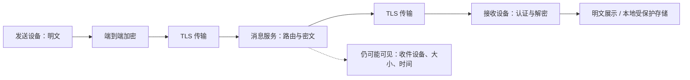
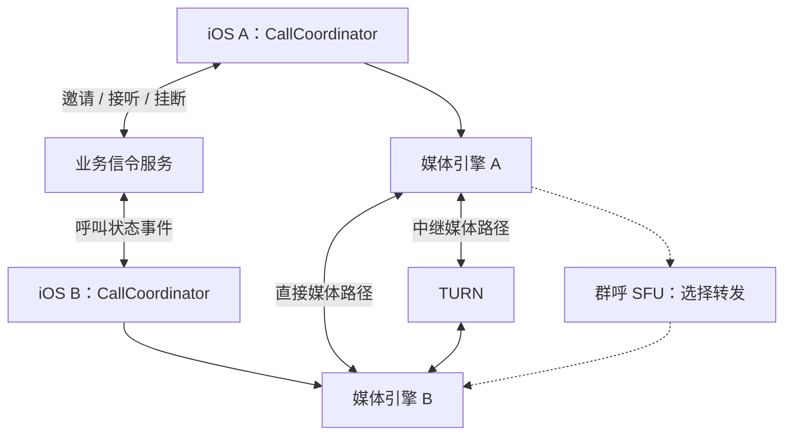
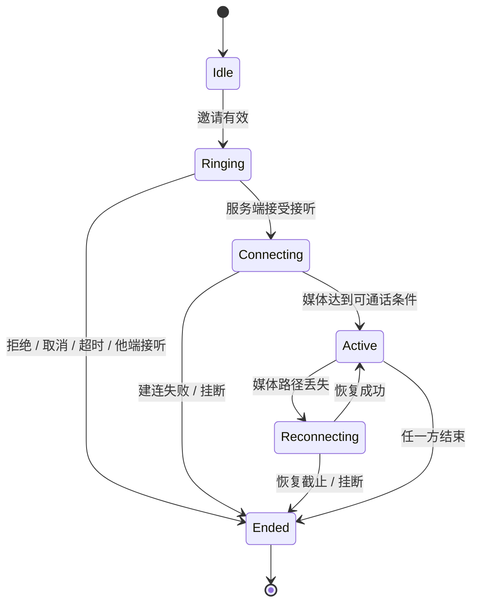

# iOS IM 安全加密与音视频通话


[toc]

---

## 🔥 <span id="前言">前言</span>

返回 [**《iOS IM 开发研究手册》**](../iOS%20IM开发研究手册.md)。本专题研究即时通讯的安全边界、端到端加密、呼叫控制和实时媒体工程；数据库入库与消息同步在主手册及对应专题展开。

<span style="color:red;font-weight:bold;">安全来自清楚的信任边界，通话可靠性来自明确的状态机。</span> 加密算法、媒体 SDK 和系统来电界面都只是组成部分，不能单独代表完整能力。

资料核对日期为 **2026-09-25**。本文中的架构、实验与阈值选择方法是研究设计，不代表任何商业产品内部实现；所有伪代码均未编译，所有实验均为待执行方案，不冒充真机结论。

阅读路径：[威胁模型](#threat) → [密钥生命周期](#keys) → [本机保护](#local) → [附件与内容](#content) → [媒体建连](#rtc) → [呼叫状态机](#call-state) → [系统集成](#system) → [弱网质量](#quality) → [录制与媒体安全](#media-security) → [实验](#experiments) → [FAQ](#faq)。

## 一、<span id="threat">先定义资产、攻击者和信任边界</span>

### 1.1、<span id="assets">资产清单决定保护措施</span>

IM 的资产包括消息正文、附件、身份密钥、登录凭据、通讯录、群成员关系、在线状态、推送地址、设备列表、媒体内容和本地搜索索引。只加密消息正文，会遗漏可还原大量行为的元数据。

| 资产与攻击入口 | 风险 | 工程控制 | 仍然存在的边界 |
| --- | --- | --- | --- |
| 公共网络、代理、DNS 劫持 | 窃听、篡改、冒充服务端 | TLS、系统证书验证、鉴权 | 服务端通常仍能看到解密后的应用数据 |
| 消息服务器、存储、运维权限 | 正文泄漏、伪造设备列表 | E2EE、身份验证、设备变更可见 | 时间、流量、投递关系未必隐藏 |
| 被盗的锁定设备 | 本地记录与密钥泄漏 | Keychain、Data Protection、账号隔离 | 解锁状态、备份和端点失陷需另行评估 |
| 恶意群成员 | 转存消息、传播恶意附件 | 权限控制、内容解析边界、举报 | 合法收件人可拍照或另存明文 |
| 调试、日志与通知链路 | Token、正文、音视频元数据外泄 | 数据最小化、脱敏、访问期限 | 脱敏 ID 仍可能被跨日志关联 |

威胁建模的交付物应包含数据流图、每条跨边界数据、攻击者能力假设、保护目标和不承诺事项。把“设备已被完全控制”与“网络上有人抓包”混为一谈，会导致无法验证的安全口号。

### 1.2、<span id="tls-e2ee">TLS、存储加密与 E2EE 是三个边界</span>

[**TLS**](https://www.rfc-editor.org/rfc/rfc8446.html) 保护传输连接；数据库加密保护指定存储介质；E2EE（端到端加密）让预期通信端点持有内容解密能力。三者可以同时存在，不能互相替代。



图中的 E2EE 是目标设计：若服务端还持有解密密钥，或推送正文、备份明文绕过该链路，就不能沿用同样的安全承诺。真实端点还包括获得密钥的桌面设备、备份恢复端和获准的录制机器人。

### 1.3、<span id="auth-replay">认证、完整性与防重放分别设计</span>

登录 Token 说明请求具有某种账户权限，不自动证明消息由特定设备密钥生成。消息认证说明密文与绑定上下文未被伪造，不自动说明同一条合法消息没有被重放。

成熟协议通过认证加密、消息编号、会话状态与重放处理组合提供保护。工程层仍需把 `accountID / deviceID / conversationID / sessionID / messageID` 的作用区分清楚，按协议绑定必要上下文，不能只依赖可修改的时间戳。

收到相同密文时，传输层可以重复确认投递，但消息表、未读数、提醒、下载任务与通话事件不能重复执行。乱序容忍窗口和保留的跳过消息密钥必须有上限，防止恶意输入导致内存或计算量无限增长。[**Double Ratchet 安全与实现考虑**](https://signal.org/docs/specifications/doubleratchet/)

对应追问见 [FAQ：加密后是否还要幂等](#faq-idempotency)。

## 二、<span id="keys">密钥分发、身份验证与群组加密</span>

### 2.1、<span id="key-lifecycle">把密钥当成有生命周期的业务实体</span>

研究时至少区分设备身份密钥、预密钥、会话状态、消息密钥、附件密钥和备份恢复密钥。每类都要说明创建者、存储位置、使用期限、轮换条件、删除条件、恢复能力和失陷后的处理方式。

| 事件 | 客户端需要处理 | 服务端需要协作 |
| --- | --- | --- |
| 新设备加入 | 证明设备归属、显示设备列表变化、建立会话 | 设备注册鉴权、目录版本、消息路由 |
| 对方身份密钥变化 | 显示变化，按信任策略暂停或重新验证 | 返回可信的变更信息，防止静默替换 |
| 设备撤销 | 停止向该设备的新会话发密文 | 禁止新投递、撤销凭据、传播目录变化 |
| 会话轮换 | 提交新会话状态，处理迟到旧消息 | 有界缓存与可诊断的投递状态 |
| 密钥永久丢失 | 清晰呈现历史无法解密，走批准的恢复流程 | 不伪装成普通网络重试 |

“每周换一个群密钥”不是完整轮换设计。成员变更、离线设备、并发更新、历史访问和重试期间使用哪个密钥，必须由协议规则决定。

### 2.2、<span id="signal">成熟协议的研究层次</span>

[**Signal 官方规范目录**](https://signal.org/docs/) 提供协议原理材料。研究时分别理解初始密钥协商、消息密钥演化和多设备会话管理，不把一个算法名字等同于整套产品。

- [**PQXDH**](https://signal.org/docs/specifications/pqxdh/) 研究离线接收方场景下的初始密钥协商及其威胁假设；使用后仍需处理身份公钥真实性。
- [**Double Ratchet**](https://signal.org/docs/specifications/doubleratchet/) 研究消息密钥持续变化、旧密钥删除与会话恢复边界；前向安全不意味着已在本地保存的明文也被保护。
- [**Sesame**](https://signal.org/docs/specifications/sesame/) 研究设备目录、活动与非活动会话、离线消息以及设备变化；多设备不是简单共享一个数据库文件。
- 密码协议会演进。上线前需核对选定实现和规范版本的对应关系、安全维护、许可、测试向量和平台集成；不能把旧文章中的算法组合作为永久最新结论。

本文不提供自行拼接密码算法的实现教程。生产实现使用经过审查、具有维护和互操作验证的协议库，业务层负责持久化、设备信任、错误恢复与产品可解释性。

### 2.3、<span id="identity">身份验证比“拿到了公钥”多一步</span>

如果公钥目录由服务端返回，恶意或失陷的服务端可能替换公钥。安全码、二维码或独立渠道核验用于把密钥与人关联；设备列表展示与密钥变化提醒帮助用户发现变化，但静默“重新信任”会削弱该保证。

账号找回通常恢复的是账户访问权，不必然恢复旧设备的密码身份或历史密钥。需要明确：手机号重新分配、重装、换机、撤销设备分别是否触发新身份，通讯方将看到什么提示。[**Sesame 身份密钥变化**](https://signal.org/docs/specifications/sesame/#61-authenticating-identity-keys)

### 2.4、<span id="mls">群组加密需要成员状态与密钥状态一起推进</span>

[**MLS，RFC 9420**](https://www.rfc-editor.org/rfc/rfc9420.html) 是群组消息安全协议。其 `epoch` 表示群的一个密码状态阶段；成员与密钥变化通过协议操作推进，客户端不能仅按界面上“踢出成功”判断密码权限已收敛。

研究重点是成员加入与移除、并发提议与提交、离线设备跨多个 epoch 恢复、旧消息保留，以及应用权限如何映射到协议身份。MLS 不是现成的群管理、投递、存储或账号服务。

移除成员后，正确更新可阻止其读取之后由新状态保护的内容；已经交付给该成员的明文和旧密钥无法远程收回。新成员默认是否获得历史，需要另行设计授权历史转移，不能把旧密钥无差别发给新设备。

## 三、<span id="local">iOS 本机密钥、数据保护与账号隔离</span>

### 3.1、<span id="keychain">Keychain 解决小型秘密的保存</span>

[**Keychain**](https://support.apple.com/en-au/guide/security/secb0694df1a/web) 适合 Token、密钥等小型敏感数据。消息和媒体放在适当保护的数据库与文件中，不能把整段聊天历史塞入 Keychain。

| 访问需求 | 可研究的保护类 | 主要取舍 |
| --- | --- | --- |
| 仅设备解锁时使用 | `WhenUnlocked` 系列 | 锁屏后相关工作可能无法取得秘密 |
| 首次解锁后需要后台访问 | `AfterFirstUnlock` 系列 | 首次解锁前不可用，锁屏期间暴露面更大 |
| 不迁移到其他设备 | 对应 `ThisDeviceOnly` 类型 | 换机恢复不能假设仍有原密钥 |
| 强绑定已设置密码的设备 | `WhenPasscodeSetThisDeviceOnly` | 设备密码被移除或重置后条目可能失效 |

准确迁移、同步和备份行为取决于具体保护类；访问组决定哪些签名应用或扩展可以读取，不能把 App Group 文件共享与 Keychain 访问组视为同一机制。来源：[**Apple Keychain 数据保护说明**](https://support.apple.com/en-au/guide/security/secb0694df1a/web)。

### 3.2、<span id="protection">文件保护与后台可用性必须联合验证</span>

数据库、WAL、共享容器、附件、缩略图和导出文件都在保护范围内。主数据库设置了保护属性，不等于所有临时副本都具有同样的保护；创建、移动、解压与分享路径都需要检查。

“锁屏仍能解密推送”与“密钥只在解锁时可读”可能冲突。合理的产品方案包括锁屏显示通用通知、解锁后补解密，或经过威胁评估后选择支持后台访问的保护类；不能遇到读取失败就降低所有数据的保护等级。

开机首次解锁前、普通锁屏后、应用重启后、扩展进程访问时是不同测试场景。把密钥暂时不可读归类为可恢复状态，不能当成“记录不存在”而重新生成密钥覆盖原身份。

### 3.3、<span id="account-isolation">切号是一条完整资源清理链</span>

账号作用域至少覆盖数据库连接、密钥命名空间、附件缓存、搜索索引、网络连接、通知内容、下载任务和通话状态。操作上下文携带账号与登录代际，异步完成后再次校验归属。

```text
开始切号
  → 禁止旧账号新增写入和发送
  → 停止旧连接、媒体、下载及通知处理
  → 关闭旧数据库和密钥会话
  → 撤销或隔离旧凭据、清理策略指定的数据
  → 创建新账号作用域与新登录代际
  → 迟到回调校验代际；不匹配即丢弃业务副作用
```

退出登录、移除本机数据、撤销设备、注销账号是不同操作。退出后是否保留加密历史、是否保留恢复材料应写成产品策略；不能通过删除一个全局 Token 假装清理完成。

### 3.4、<span id="crypto-transaction">会话状态与消息持久化必须可恢复</span>

Ratchet 状态可能在一次加密或解密后改变。若只保存新状态而没有保存对应密文，崩溃后可能无法重发；若只保存密文而回滚会话状态，可能产生状态复用或重复处理问题。

优先选用协议库支持的事务接口，使会话状态变化、收发件箱和消息映射具备一致提交边界。不能简单要求所有秘密都独立写 Keychain 后再写数据库，因为二者没有天然的跨存储原子事务。

可以研究受 Keychain 中包装密钥保护的事务存储，但具体方案需由选定库的安全模型和存储接口确定。验收覆盖加密前、状态更新后、密文持久化后、提交完成前后的崩溃点，并验证恢复不会复用禁止复用的材料。

## 四、<span id="content">附件、富文本、日志与备份</span>

### 4.1、<span id="attachment">附件加密覆盖上传链路与解密副本</span>

E2EE 附件设计通常让端点加密文件后上传密文，再经受保护消息发送解密所需材料与完整性信息。对象存储地址、签名 URL 和访问 Token 不等于内容加密密钥；二者应分开管理。

大文件要按成熟文件加密格式处理分块认证、顺序、长度和截断，不能把同一个 nonce 重复用于不同明文。整文件校验完成前的流式播放必须具有分块认证保证，否则“边下载边播”可能显示未经认证的内容。

下载失败、重试、转发和多设备同步必须明确密文是否复用、授权是否变化、缩略图是否另行加密。临时解密文件、相册保存和系统分享都会产生新的明文副本，删除聊天记录不代表这些副本一起消失。

### 4.2、<span id="richtext">富文本与媒体解析属于不可信输入处理</span>

先校验包体大小、嵌套深度、字段类型、媒体尺寸和声明长度，再进入布局与解码。图片文件很小但像素极大、压缩包展开量远大于下载量、畸形富文本反复触发布局，都可能耗尽移动端资源。

Markdown 或 HTML 消息采用允许列表渲染；链接协议、网页跳转、文件名和下载地址分别验证。禁止让消息内容直接执行脚本、拼接本地文件路径或任意调用应用路由。链接预览还可能向外站暴露访问 IP、时间和认证上下文。

服务端做内容治理不能替代客户端解析安全。端到端加密模式下，服务端通常无法直接扫描明文，应明确客户端防护、用户主动举报材料与产品限制；不能暗中上传全部解密内容破坏既定承诺。

### 4.3、<span id="privacy-surfaces">通知、日志、搜索和备份是新的明文出口</span>

| 出口 | 推荐研究策略 | 容易遗漏的细节 |
| --- | --- | --- |
| 远程通知 | 只放投递提示或满足隐私策略的最小摘要 | 推送服务、系统通知中心、可穿戴设备 |
| 通知扩展 | 有界处理、保护类不可用时通用文案 | 扩展进程不共享主进程内存和无限执行时间 |
| 日志与埋点 | 记录阶段、错误码、脱敏关联 ID | Token、完整 SDP、IP、联系人名字、消息正文 |
| 全文检索 | 本机解密后建立受保护索引 | 索引、摘要和词典本身会泄露内容 |
| 云备份 | 独立的加密、恢复与撤销策略 | 恢复密钥托管者改变整体信任边界 |
| 截屏与分享 | 显示隐私状态，管理导出和后台快照 | 无法承诺阻止收件人用另一台设备拍摄 |

备份恢复需说明旧设备会话状态是否可恢复、是否会回滚序号，以及是否应建立新设备身份后单独恢复历史。检索能力不应通过把明文词条上传给服务端而被偷偷“补齐”。

## 五、<span id="rtc">音视频：信令与实时媒体分工</span>

### 5.1、<span id="rtc-layers">IM 传递呼叫事件，媒体链路传声音和画面</span>

[**WebRTC**](https://webrtc.org/) 提供实时通信机制，但不替业务定义邀请、忙线、接听、权限和多端抢接。IM 长连接可承载业务信令，媒体应进入实时传输链路，不能把编码帧当普通聊天消息逐条入库转发。



信令断线不必立即终止已经连通的媒体；媒体无声也不必然表示 IM 连接断了。分别维护业务呼叫状态、PeerConnection 状态和音频设备状态，最后由协调层决定 UI 表达。

### 5.2、<span id="sdp">SDP Offer / Answer 是能力协商</span>

SDP 描述音视频轨道、方向、编解码能力和连接相关参数。发起端生成 Offer，对端设置远端描述并生成 Answer；双方通过业务信令交换，WebRTC 不规定该信令运输方式。[**WebRTC Peer connections**](https://webrtc.org/getting-started/peer-connections)

视频升级、屏幕共享、轨道替换可能触发重新协商。两个端同时发 Offer 会产生协商碰撞，需按选定引擎推荐策略确定协商角色与回退处理，不能任意覆盖已有远端描述。

SDP 与 ICE candidate 都绑定 `callID` 和协商代际。迟到候选不能投递给下一次通话；远端描述未就绪时的候选需要有界缓存，并按引擎要求按序应用。

### 5.3、<span id="ice">ICE、STUN、TURN 各自解决一段问题</span>

| 机制 | 负责 | 不负责 |
| --- | --- | --- |
| [**ICE，RFC 8445**](https://www.rfc-editor.org/rfc/rfc8445.html) | 收集候选、连通性检查、选择候选对 | 业务接听、用户身份、无限重连 |
| [**STUN，RFC 8489**](https://www.rfc-editor.org/rfc/rfc8489.html) | 地址发现及相关连通性检查机制 | 保证任何 NAT 下都能直连 |
| [**TURN，RFC 8656**](https://www.rfc-editor.org/rfc/rfc8656.html) | 通过中继转发数据 | 自动解决延迟、带宽成本和跨区域质量 |

移动网络切换会使候选路径失效，ICE restart 用于重新协商连接相关信息。应区分短暂断连与确认失败，允许合理恢复窗口，同时保留超时终止和用户主动挂断能力。

TURN 凭据应短期有效并与授权范围匹配；记录中继选择比例和区域质量以规划成本。强制中继可减少向对端暴露直接网络地址的场景，但会增加中继依赖，不能简单等同于匿名通信。

## 六、<span id="call-state">呼叫状态机、多端竞态和恢复</span>

### 6.1、<span id="call-id">呼叫 ID 与消息 ID 分离</span>

`callID` 标识一次呼叫，`eventID` 用于事件去重，`revision` 表示服务端认可的状态版本，`attemptID` 区分一次媒体建连尝试。终态和已处理事件需要保留一段协议定义的期限，防止迟到邀请重新拉起来电。



图中的“服务端接受接听”和“媒体达到可通话条件”不同。用户点击按钮只是意图；不能此时就显示已经接通或累计真实通话时长。

### 6.2、<span id="call-races">服务端裁决共享状态，客户端幂等执行</span>

| 竞态 | 推荐裁决 | 客户端结果 |
| --- | --- | --- |
| 手机与平板同时接听 | 对同一呼叫的接听资格原子裁决 | 一端成功，其余端收到他端接听终态 |
| 主叫取消与被叫接听交错 | 以服务端状态版本和终态规则判定 | 被拒绝接听端立即结束连接准备 |
| 超时后迟到 Answer | 检查终态、截止时间、协商代际 | 不重新激活旧呼叫 |
| 双方同时呼叫对方 | 产品定义合并、忙线或固定胜者 | 不同时出现两套媒体会话 |
| 重复 VoIP 推送与长连接邀请 | 统一映射到同一个呼叫对象 | 按系统接口契约处理，UI 与铃声不重复 |
| 已结束后收到 ICE candidate | 核验 callID 和 attemptID | 丢弃，不重建 PeerConnection |

这是业务状态设计，不是某个传输协议自动提供的保证。客户端计时器用于及时反馈，服务端截止条件用于裁决；恢复时拉取当前快照，不能只回放本机倒计时次数。

### 6.3、<span id="call-reducer">用单一状态归约器执行事件</span>

```text
处理事件(event):
  若账号或登录代际不匹配：结束
  若eventID已处理：返回既有处理结果
  若callID已终止且事件不能合法更新终态：忽略旧事件
  校验revision、权限、截止时间与协商代际
  根据当前状态和事件计算新状态与副作用
  保存必要的终态、事件去重信息与状态版本
  将CallKit、媒体启动、铃声、UI刷新交给各自适配器
  适配器回调携带callID与attemptID重新进入归约器
```

不把 UI 控制器作为通话生命周期所有者；页面关闭、Scene 切换和前后台变化不应意外释放有效通话。反过来，挂断后协调器必须释放媒体资源、计时器、音频路由和重连任务。

## 七、<span id="system">CallKit、PushKit 与音频系统集成</span>

### 7.1、<span id="callkit">系统来电界面与媒体引擎之间增加适配层</span>

[**CallKit**](https://developer.apple.com/documentation/callkit) 承接系统通话界面与相关动作；业务层接收开始、接听、结束、静音等动作，再更新状态机。`fulfill` 或 `fail` 反映动作处理结果，不是随意消除系统回调的标记。

把系统 UUID 与业务 `callID` 稳定映射。接到系统结束动作时，即使信令网络不可用，也应立即停止本地采集、播放和重连，随后按协议补发结束状态。

### 7.2、<span id="pushkit">VoIP 推送承载真实来电</span>

Apple 对传统 `pushRegistry(_:didReceiveIncomingPushWith:for:completion:)` 明确规定：链接 iOS 13 SDK 或以后版本时，VoIP 推送须按要求上报 CallKit；未上报可导致系统终止应用，反复失败可能影响后续投递。[**官方回调契约**](https://developer.apple.com/documentation/pushkit/pkpushregistrydelegate/pushregistry(_:didreceiveincomingpushwith:for:completion:))

因此推送唤醒路径应足够短，不能先等待完整历史同步、远端头像下载、全部媒体初始化完成再处理系统来电；按要求调用 completion，连接业务服务器可并行推进。[**Apple VoIP 推送说明**](https://developer.apple.com/documentation/pushkit/responding-to-voip-notifications-from-pushkit)

该说明限定于引用的 API 契约。使用较新系统新增的通话框架或回调时，重新核对 SDK availability、系统告知的处理要求与分发地区约束；不要把历史规则泛化成所有新 API 的行为。

VoIP 推送不是普通 IM 消息保活工具。服务器要限制邀请有效期并发送正确的推送类型；迟到来电和已取消来电按当前系统契约报告与结束，不能用虚构通话保持后台运行。

### 7.3、<span id="audio-session">AVAudioSession 的所有权必须统一</span>

[**AVAudioSession**](https://developer.apple.com/documentation/avfaudio/avaudiosession) 管理应用对音频系统的使用意图。通话、语音消息播放、录音、视频播放若各自修改 category、mode 和 active 状态，会互相抢占。

建立音频会话协调器，按通话优先级授予能力；媒体引擎与系统通话适配层约定谁配置、谁激活、谁解除。CallKit 的 `didActivate` / `didDeactivate` 是系统激活状态信号，应与引擎实际采集播放同步。[**Apple didActivate**](https://developer.apple.com/documentation/callkit/cxproviderdelegate/provider(_:didactivate:))

音频权限被拒绝时清楚表达“不能发送语音”并允许结束；摄像头被拒绝时可按产品策略降级音频，不能把权限失败报成“网络异常”。启动前检查当前授权，不把授权弹窗耗时算成网络建连耗时。

### 7.4、<span id="audio-route">蓝牙、耳机和中断是持续变化的状态</span>

监听路由变化并读取实际 `currentRoute`，不要只根据用户点击的图标猜测当前输出。耳机移除可能改变私密性，通话场景需明确听筒与扬声器策略，并同步 UI。[**Apple 路由变化**](https://developer.apple.com/documentation/avfaudio/responding-to-audio-route-changes)

蓝牙通话输入输出能力、采样率、声道数与 I/O 缓冲可能随路由变化。媒体格式应在变化后重新核对；不要假设所有蓝牙路由都支持与扬声器相同的采集播放组合。

系统电话、Siri、其他音频服务、媒体服务重置都应进入音频协调层。中断开始时记录是否原本正在通话；结束后依据系统恢复建议、当前呼叫终态和用户意图决定恢复，不能无条件重新开麦。[**Apple 中断处理**](https://developer.apple.com/documentation/avfaudio/handling-audio-interruptions)

音频恢复 API 有新旧 SDK 差异；历史 `shouldResume` 只用于对应 API 范围，落地时核对目标 SDK 的弃用提示与替代通知。本文保留恢复语义，不提供跨版本硬编码示例。

## 八、<span id="quality">媒体拓扑、弱网与质量度量</span>

### 8.1、<span id="topology">一对一与群呼的成本结构不同</span>

一对一可以尝试直接连接，并由 TURN 中继兜底。群呼若每个参与者分别向其余所有人上传，单设备上行随人数增长；总逻辑连接数也快速增长，不适合简单照搬一对一实现。

SFU（选择性转发单元）接收参与者媒体后，按订阅、布局与质量需求转发。客户端可以上传多层编码或多个码率版本，由服务端选择适合接收者的层；能力取决于引擎、编码器、终端与服务端的共同支持。

MCU（混流）可让终端只解码少量合成流，但服务端计算、布局灵活性和媒体明文可见性不同。拓扑选型需同时衡量人数、移动端功耗、总出口带宽、弱网表现和加密承诺，不能只比较 SDK API 数量。

### 8.2、<span id="stats">从可观测链路定位黑屏、无声和卡顿</span>

| 阶段 | 关键观察 | 常见归因方向 |
| --- | --- | --- |
| 发出邀请 → 对方响铃 | 推送与信令阶段耗时、设备状态 | 推送、鉴权、迟到邀请、系统界面处理 |
| 接听 → ICE 连通 | candidate 类型、选中路径、往返时延 | NAT、防火墙、TURN 区域、网络切换 |
| 连通 → 第一段音频 | 收包、解码、音频会话与实际路由 | 音频未激活、静音、设备路由、权限 |
| 连通 → 首帧视频 | 收包、关键帧、解码、渲染 | 发送端未采集、解码阻塞、渲染未挂载 |
| 持续通话 | 丢包、抖动、码率、冻结、温度与功耗 | 拥塞、CPU 限制、热降频、编码负载 |

WebRTC 统计中很多字段是累计计数，速率和比例要用相邻采样差值。切换轨道、重连或统计对象重建时计数可能重置，不能把负差值当成网络改善。[**W3C WebRTC Statistics**](https://www.w3.org/TR/webrtc-stats/)

音频可以关注 `concealedSamples` 的增量比例；它反映丢失或过晚到达样本导致的本地补偿，不能直接当成网络丢包率。视频可以结合冻结时间、解码帧率与实际渲染观察，不以平均码率代表体验。

### 8.3、<span id="degradation">降级需要顺序、滞回和可解释反馈</span>

弱网下优先保护可理解的语音，逐步降低视频码率、帧率、分辨率或暂停非必要订阅。群呼减少不可见参与者视频；热压力高时也要降级，因为 CPU 限制和带宽限制需要不同策略。

采用持续窗口、恢复阈值与冷却时间，避免网络数值在阈值附近抖动时反复开关视频。UI 区分“对方暂停视频”“网络较差降级”“摄像头权限不可用”，不要统一显示黑框。

FEC、重传、抖动缓冲和关键帧请求各有延迟与带宽代价，应使用引擎的拥塞控制并经实验调节。不要同时在业务层反复强制高码率、在引擎层自动降码率，形成互相抵消的控制回路。

## 九、<span id="media-security">媒体加密与通话录制</span>

### 9.1、<span id="rtc-e2ee">媒体传输加密不自动等于跨 SFU 的 E2EE</span>

WebRTC 常见安全媒体传输使用 DTLS-SRTP 等机制。必须画出密钥终止位置：一对一直连、中继转发、SFU 解密再转发，对服务端的信任要求不同。[**WebRTC 安全架构，RFC 8827**](https://www.rfc-editor.org/rfc/rfc8827.html)

TURN 转发并不意味着必须解密媒体；SFU 是否能解密取决于实际密钥和媒体处理架构。若要在服务端转发条件下仍保护内容，研究经过审查的额外帧级加密、群密钥分发与成员变化，并验证选定 iOS 引擎支持。

不能因为文字聊天采用 E2EE 就自动宣传语音、视频、屏幕共享与云录制同样满足；每条媒体路径、转码器和录制参与者都要单独进入威胁模型。

### 9.2、<span id="recording">录制是一项明确的产品能力</span>

采集权限允许使用麦克风或摄像头，不等于用户同意保存整段通话。录制开始、持续状态、暂停与结束应有清楚的视觉或声音指示；Apple 审核指南明确要求记录用户活动时取得明确同意并提供可见或可听提示。[**App Review Guidelines 2.5.14**](https://developer.apple.com/app-store/review/guidelines/#software-requirements)

产品需说明谁发起、谁能下载、保存多久、撤销后的处理、失败的半成品如何清理，以及参与者中途加入时如何获知正在录制。服务端录制机器人若取得内容解密能力，就成为需要声明的通信端点。

不同地区对录制可能有额外要求；将地区合规审查列为发布前独立工作，不在技术文档里编造统一的法定人数、同意形式或上架结论。

## 十、<span id="experiments">实验矩阵与验收证据</span>

### 10.1、<span id="security-matrix">安全与恢复实验</span>

| 实验 | 注入条件 | 需要观察的结果 |
| --- | --- | --- |
| 重复与乱序密文 | 同消息重复、旧消息迟到 | 无重复副作用，合法乱序按协议恢复 |
| 认证失败 | 改动测试密文与绑定上下文 | 拒绝展示、不推进错误会话状态 |
| 会话崩溃恢复 | 在状态与消息提交边界终止测试进程 | 不复用禁止复用材料，无假成功 |
| 设备密钥变化 | 测试账号重装或增加设备 | 设备变化可见，身份策略真实生效 |
| 账号切换 | 旧账号下载或解密回调迟到 | 不写入或展示到新账号 |
| 保护类不可访问 | 重启首次解锁前、普通锁屏后 | 进入可恢复状态，不覆盖旧密钥 |
| 群移除与离线成员 | 移除成员后发送、离线设备恢复 | 新状态权限生效，历史范围符合策略 |
| 敏感信息扫描 | 检查日志、通知、缓存、导出与备份 | 无未声明明文与永久凭据泄漏 |

所有输入使用独立测试账号、测试密钥和合成内容；恢复实验必须保存测试环境配置，避免对真实聊天历史做破坏性验证。

### 10.2、<span id="rtc-matrix">真机通话实验</span>

| 实验 | 组合 | 验收关注 |
| --- | --- | --- |
| 系统来电路径 | 前台、后台、锁屏、进程未运行 | 系统报告、接听动作、首音频、结束清理 |
| 多端抢接 | 手机与平板同时接听 | 单一胜者、另一端正确收敛 |
| 邀请竞态 | 取消与接听同时发生、推送迟到 | 无幽灵来电，无终态复活 |
| NAT 与防火墙 | 直连、仅中继可用、IPv6 环境 | 路径选择、失败原因、TURN 成本 |
| 网络切换 | Wi-Fi 与蜂窝切换、短断网 | ICE 恢复窗口、超时、重新接通反馈 |
| 弱网 | 限带宽、时延、抖动、随机与突发丢包 | 语音连续性、视频降级、恢复滞回 |
| 音频路由 | 听筒、扬声器、蓝牙、耳机插拔 | 真实路由、采集状态、隐私、格式变化 |
| 系统中断 | 电话、Siri、媒体服务重置 | 不盲目开麦，恢复与终态一致 |
| 长通话 | 多参与者、持续视频、后台切换 | 内存、温度、耗电、资源释放 |
| 录制 | 中途加入、停止、上传失败 | 同意与提示、文件权限、半成品清理 |

### 10.3、<span id="evidence">以可复现记录替代“感觉流畅”</span>

每次实验记录设备、系统、应用与媒体引擎版本、网络模型、人数、摄像头与编码配置、持续时间和失败日志。按平台与网络分层统计 p50 / p95；样本量小的时候直接展示原始分布与异常样本。

不要只报告呼叫接通率：同时记录发起失败、被叫未响铃、接听后无声、首帧超时、异常结束、恢复时间和用户主动取消。不同分母对应不同问题，不能把用户拒接算成媒体失败，也不能把无声通话算成成功。

当前文档只完成原理整理和资料核对；没有实现密码协议、搭建信令服务、执行录音或运行上述真机实验。

## 十一、<span id="faq">FAQ：研究与面试追问</span>

### 11.1、<span id="faq-tls">用了 HTTPS，消息就属于端到端加密吗？</span>

**答：不一定。** HTTPS 保护客户端与服务器之间的连接，服务器通常能解密应用数据；E2EE 要继续确认正文密钥只由预期端点持有，并检查推送、备份和其他设备有没有形成明文旁路。[返回 TLS 边界](#tls-e2ee)

### 11.2、<span id="faq-idempotency">消息已经加密，为什么还要做幂等？</span>

**答：认证不能替代业务去重。** 同一条合法消息可能因为网络重试再次到达。协议负责密码状态与重放边界，业务负责消息记录、未读数、提醒和下载不重复执行，两层都不可省。[返回认证与防重放](#auth-replay)

### 11.3、<span id="faq-keychange">对方换机后公钥变化，自动接受就可以了吗？</span>

**答：只能按明确的信任策略处理。** 变化可能来自合法换机，也可能来自身份替换；需要设备变更记录、用户可见提示和必要的独立核验。自动接受会改变原有身份保证，不能同时宣称验证强度完全不变。[返回身份验证](#identity)

### 11.4、<span id="faq-keychain">Keychain 的安全级别越高越适合 IM 吗？</span>

**答：要与访问时机共同选择。** 仅解锁可用的密钥可能无法在锁屏后台解密，允许首次解锁后访问又有不同暴露面。把能力限制反映到通知与恢复流程，不为方便直接降低全部保护等级。[返回本机保护](#keychain)

### 11.5、<span id="faq-revoke">把人踢出群以后，旧消息也能保证看不到吗？</span>

**答：不能。** 群密钥状态更新可以保护后续内容，但对方已经取得的明文、密钥、截图和导出副本无法远程收回。历史转移、撤回和未来权限必须分别定义。[返回 MLS 与群权限](#mls)

### 11.6、<span id="faq-callkit">接入 CallKit 后，音视频通话就完成了吗？</span>

**答：没有。** CallKit 负责系统通话集成；业务还需要呼叫服务与状态机，媒体还需要协商、连通性检查、采集、编码、传输、解码和播放。各层失败信号要能在同一个 callID 下关联。[返回系统集成](#callkit)

### 11.7、<span id="faq-turn">STUN 能打洞，为什么还要 TURN？</span>

**答：地址发现和连通性检查不能保证所有网络直连。** 防火墙、NAT 与网络策略可能阻止直接媒体路径，TURN 通过中继提供另一条路径；它带来带宽、地域与可用性成本，需要持续统计。[返回 ICE / STUN / TURN](#ice)

### 11.8、<span id="faq-answer">手机和平板一起点接听，用客户端布尔值防重够吗？</span>

**答：不够。** 单机锁只能约束本进程，跨设备接听资格需要服务端原子裁决。客户端根据状态版本处理胜者、他端接听与迟到响应，并清理失败端已启动的资源。[返回多端竞态](#call-races)

### 11.9、<span id="faq-connected">WebRTC 显示 connected，为什么仍然无声？</span>

**答：连接建立只是一个阶段。** 继续观察远端是否发包、本地是否收包与解码、音频会话是否激活、麦克风授权、静音状态及实际输出路由。把“接通”“首音频”和“持续可听”拆成不同指标。[返回质量定位](#stats)

### 11.10、<span id="faq-sfu">经过 SFU 转发的媒体还可能端到端加密吗？</span>

**答：可能，但不能由“使用 SFU”直接判断。** 需要确认密钥终止点，以及是否存在服务端不可解密的额外内容保护；同时评估转码、录制和群成员变化是否仍支持该承诺。[返回媒体安全](#rtc-e2ee)

### 11.11、<span id="faq-background">能不能用 VoIP 推送让普通聊天消息一直保活？</span>

**答：不能把它当普通 IM 保活机制。** VoIP 通道用于真实来电，并受系统报告契约约束。普通聊天采用相应消息推送与前台恢复同步，不能创建虚假呼叫绕过平台限制。[返回 PushKit 边界](#pushkit)

### 11.12、<span id="faq-research">没有做过生产 IM，怎样形成可信的科研成果？</span>

**答：先做可复现的小系统与实验。** 明确威胁模型和呼叫状态机，选择维护中的成熟协议与媒体实现，用失败注入验证崩溃恢复、多端竞态和弱网；保存版本、输入、指标与未解决边界。把“设计过、实现过、测过、上线过”分别写清楚。[返回实验矩阵](#experiments)

<a id="🔚" href="#前言" style="font-size:17px; color:green; font-weight:bold;">我是有底线的➤点我回到首页</a>
