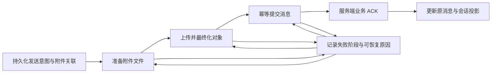

# iOS IM 聊天界面与多媒体工程


[toc]

---

## 🔥 <span id="前言">前言</span>

本文是 [iOS IM 开发研究手册](../iOS%20IM开发研究手册.md) 的界面与附件专题，覆盖消息进入界面、用户输入、媒体准备、发送、失败恢复与资源回收。数据库是可靠状态来源，聊天界面是状态的投影，附件流水线负责另一组独立且必须持久化的工作。

以 [**UIKit**](https://developer.apple.com/documentation/uikit) 为主要讨论对象，不绑定特定 UI 框架。平台事实按 **2026-09-25** 查阅的 Apple 官方资料核验；业务状态机、缓存键和实验方案属于本文建议，应按协议与目标设备调整。所有流程代码均为语言无关伪代码，不能作为已编译的 SDK 示例。

**阅读导航：** [职责与身份](#identity) → [列表与布局](#list) → [滚动锚点](#anchor) → [输入系统](#input) → [消息内容](#content) → [图片](#image) → [音频](#audio) → [视频与上传](#transfer) → [发送恢复](#recovery) → [隐私与无障碍](#accessibility) → [验证](#experiments) → [FAQ](#faq)。

## 一、<span id="identity">职责分层与稳定身份</span> <a href="#前言">🔼</a> <a href="#🔚">🔽</a>

### 1.1、先定义关键对象

| 对象 | 定义 | 生命周期与边界 |
| --- | --- | --- |
| 消息实体 | 内容、发送者、会话和状态组成的业务记录 | 不持有 Cell、图片解码对象或播放器 |
| 展示模型 | 给定消息与环境下，界面需要的不可变数据 | 包含内容版本、状态文案、布局输入 |
| 稳定 UI ID | 同一逻辑消息在列表内不变化的身份 | 不能用当前位置或发送状态生成 |
| 服务端消息 ID | 服务端分配的业务身份 | 发送前可能不存在，不能直接代替本地身份 |
| 渲染版本 | 会改变内容或外观的版本标记 | 和身份分离，改变版本不等于新增消息 |
| 附件记录 | 一份文件的身份、准备和传输状态 | 可被多个消息引用，不归某个 Cell 所有 |

建议分成 `ConversationRepository → MessageWindow → PresentationBuilder → ListRenderer`，附件使用独立 `AttachmentStore → MediaProcessor → TransferCoordinator`。输入面板只提交命令；仓储提交后的变更驱动页面。播放协调器按业务决定跨页继续或停止，不让复用 Cell 自己充当播放器状态仓库。

<span style="color:red"><b>Cell 出现不代表消息已发送；上传进度 100% 不代表服务端已接受消息。</b></span> 区分本地保存、排队、准备附件、上传、提交消息、服务端接受、目标设备送达和已读。UI 展示多少级状态由产品决定，内部状态不能因此合并。[对应 FAQ](#faq-state)

### 1.2、pending 消息与 ACK 的合并

本地发送先生成 `clientMessageID`，同时建立持久 `localMessageKey` 作为 UI ID。ACK 是服务端对业务请求的确认，不是 TCP 确认；收到 ACK 后给原消息填入 `serverMessageID`、服务端时间和顺序号，保留 `localMessageKey`。远端补拉的同一条消息通过协议约定的 `clientMessageID` 或映射表与本地消息合并。

| 事件顺序 | 正确处理 | 常见错误 |
| --- | --- | --- |
| 本地插入 → ACK → 同步回显 | 更新同一个实体与 UI ID | 把回显作为第三条消息 |
| 本地插入 → 同步回显 → ACK | 先合并回显，ACK 再幂等补充 | ACK 到达后删除旧行再插入新行 |
| 请求超时 → 重试 → 原 ACK 到达 | 同一幂等发送操作收敛 | 每次重试生成新消息，重复发送 |
| 服务端排序位置改变 | 保留身份，按确认的排序规则移动 | 用创建时间覆盖可靠顺序号 |

服务端未回传客户端关联标识时，单凭文本、时间和发送者匹配并不可靠，应修改协议或明确无法消除的歧义。消息删除、撤回、编辑也要保留足够版本信息，避免迟到回调重新显示已删除内容。

Apple 的 Diffable Data Source 设计使用稳定标识；模型其他属性变化时，标识不应改变。业务层的 pending 合并策略是本文在此基础上的设计。[Apple：Make blazing fast lists and collection views](https://developer.apple.com/videos/play/wwdc2021/10252/)

### 1.3、会话列表是独立读模型

会话行包含置顶顺序、最后有效消息摘要、最后活动排序键、未读数、免打扰、草稿、提及提示和发送失败提示。把这些字段从每条消息独立拼接，容易出现摘要已更新、未读仍旧值的短暂矛盾；优先发布同一持久化版本对应的会话快照。

草稿是否影响排序、撤回后显示提示还是前一条有效消息、历史补拉是否影响最近会话顺序，都属于显式业务规则。低序号历史消息不应无条件覆盖最新摘要。在线状态、正在输入等短期信号使用失效时间和独立刷新节流，不能每个心跳重新排序全列表。

## 二、<span id="list">长列表、差量更新与布局缓存</span> <a href="#前言">🔼</a> <a href="#🔚">🔽</a>

### 2.1、容器选型与窗口化

`UITableView` 适合相对规则的单列气泡；`UICollectionView` 对多形态布局、组合展示和自定义布局更灵活。选择依据是目标交互、团队维护能力与实测，不是“某个组件天生不卡”。先把数据正确性、测量成本和异步资源管理拆开，再决定容器。

**窗口化**是只保留当前阅读位置附近的消息展示数据。复用 Cell 只限制可见视图数量，不会自动限制消息数组、富文本、图片帧和布局字典的大小。大历史会话应从本地库分页读取，保留前后缓冲窗；窗口淘汰时保护阅读锚点、播放消息和编辑中的目标。

初始打开最新消息、定位未读、搜索跳转历史位置，应分别定义加载入口。定位历史消息时先建目标附近窗口，再补两侧历史；不要从最新页一直向前加载到目标。恢复窗口需要保存消息 ID 与相对位置，不能保存只对旧数组有效的 `IndexPath`。

### 2.2、把一次数据变更压缩成一次合理更新

**Diff**是比较两份列表状态得到插入、删除、移动和内容变更。渲染管线接受一个有序事件流，合并同一短时间内的非关键变化，生成最新快照；已读回执和上传进度不应每一包都触发全量布局。

| 变化 | 首选动作 | 需要检查 |
| --- | --- | --- |
| 发送状态图标变化 | 更新受影响的已存在项目 | 图标占位是否固定，是否改变高度 |
| 文本编辑、翻译展开 | 内容更新并失效该消息布局 | 当前阅读锚点是否需要补偿 |
| 新消息进入当前会话 | 插入稳定 ID | 是否贴底，是否显示新消息计数 |
| 会话顺序变化 | 移动会话 ID | 手势操作期间是否延迟动画 |
| 一次离线补拉大量消息 | 合并提交快照，按窗口展示 | 不为屏幕外全部消息逐条动画 |

快照应用使用单一协调入口，避免两次异步更新交叉操作同一列表。可保存“最后已应用版本”和“待应用最新版本”；更新结束再处理后续版本。具体 API 是否允许在哪个队列计算或应用，应按采用的 SDK 文档处理；视图变更统一归主线程，禁止把“后台准备模型”理解成随意在后台操作 UIKit 对象。

预取可以提前启动数据和图片准备，但预取请求可能取消，也可能没预取就直接显示。因此 Cell 配置必须能独立处理冷缓存。Apple 官方列表样例强调预取和图片准备；业务仍要自行实施有界队列与任务去重。[Apple：Building high-performance lists and collection views](https://developer.apple.com/documentation/uikit/building-high-performance-lists-and-collection-views)

### 2.3、布局缓存必须能正确失效

**测量缓存**保存给定内容与布局条件下的高度、文字排版和附件区域。缓存键至少考虑 `UI ID + 内容版本 + 容器有效宽度 + 字号类别 + 版式版本`；按实现补充显示比例、语言方向、折叠状态、头像分组、引用内容版本。宽度使用实际布局宽度，不能用全屏宽度代替分屏窗口宽度。

| 触发变化 | 失效范围 | 容易漏掉的关联 |
| --- | --- | --- |
| 正文编辑、翻译展开 | 当前消息 | 会话摘要、搜索高亮缓存 |
| 图片尺寸元数据到达 | 当前附件消息 | 消息高度与滚动锚点 |
| 插入或删除相邻消息 | 当前与相邻分组消息 | 昵称、头像、时间分隔和气泡尾巴 |
| 字号、窗口宽度或方向变化 | 当前窗口内相关布局 | 缓存内同 ID 的旧环境结果 |
| 引用消息被撤回 | 所有引用其快照的可见项 | 已缓存引用标题与高度 |

纯文本预处理和线程安全的独立测量可以在受控执行器中进行；不要把正在显示的 `UITextView`、约束树或共享可变排版对象拿到后台复用。测量结果携带输入版本，回主线程应用前再比对，丢弃旧结果。缓存设容量上限并统计命中率，不能用命中率掩盖错误高度。[对应 FAQ](#faq-layout)

### 2.4、异步 Cell 复用协议

每次绑定生成 `bindingGeneration`，保存消息 ID、资源键和请求句柄。解绑或复用时取消本 Cell 的订阅、重置进度、播放指示、占位和无障碍描述；共享资源请求只在没有订阅者且没有其他业务需求时才考虑取消。

```text
bind(cell, item):
  cell.generation += 1
  expected = (item.uiID, item.contentVersion, cell.generation, item.resourceKey)
  renderSynchronousState(item)
  subscribeResource(item.resourceKey, completion):
    dispatchToUI:
      if cell.currentBinding != expected: discard
      else: applyPreparedResource(completion)
```

取消是节省工作，身份与版本校验才是拒绝迟到结果的最后防线。禁止在图片完成回调中使用旧 `IndexPath` 找当前 Cell；若通过数据源更新，也先按稳定 ID 查当前实体。[对应 FAQ](#faq-reuse)

## 三、<span id="anchor">分页、阅读锚点与自动滚动</span> <a href="#前言">🔼</a> <a href="#🔚">🔽</a>

### 3.1、顶部分页保持同一行的视觉位置

**滚动锚点**是一条稳定消息及其相对可见区域的位置。正常正向列表的建议步骤如下；倒置列表也必须保持同一不变量，不能直接照搬坐标符号。

1、更新前记录第一条合适的可见消息 `anchorID`，以及其顶部相对列表可视区域的 `oldVisualY`。同时记录是否贴底、是否拖动和当前布局环境。

2、使用服务端或数据库分页游标加载更早消息，去重后合并到同一消息窗口，生成快照。请求带窗口世代标识；切换会话或跳转搜索结果后拒绝旧分页返回。

3、应用快照并等待本轮实际布局，重新按 `anchorID` 查到 `newVisualY`。对正向列表使用 `contentOffsetY += newVisualY - oldVisualY`，把同一消息移回原来的视觉位置。

4、随后若自适应高度发生二次变化，在更新协调器中继续维护锚点；避免与用户拖动争抢。锚点被撤回或过滤时选最近仍存在的可见邻居；视口变化时按产品确定保顶部阅读位置还是底部阅读位置。

单纯用 `newContentSize.height - oldContentSize.height` 补偿，只适用于变化都发生在锚点之前且高度准确的受限场景。图片高度补全、页脚变化和键盘 inset 同时发生时，应优先用消息几何位置校正。记录坐标所在视图，不能把屏幕坐标、内容坐标和安全区偏移混在一起。[对应 FAQ](#faq-anchor)

### 3.2、新消息是否滚到底部

**贴底**表示距离最新内容末尾处于产品定义的容差内，判断要计入有效底部 inset 与输入面板遮挡。收到新消息前捕获该状态；已贴底时保持末尾可见，正在看历史时保持阅读位置并累加“新消息”提示。

用户主动发送消息通常进入跟随最新消息模式，但引用历史消息、搜索上下文和回复线程可以另设规则。键盘弹出、输入框增高和横竖屏切换沿用同一阅读模式；不能让三个独立回调各调用一次滚到底部，造成争抢和闪动。

## 四、<span id="input">键盘、输入框与页面几何</span> <a href="#前言">🔼</a> <a href="#🔚">🔽</a>

### 4.1、统一输入面板状态

输入面板建议建模为 `idle / keyboard / emoji / attachment / recording`，另存草稿、选择区间、引用对象和焦点。状态切换由一个协调器更新输入区高度、列表底部可见区域和滚动策略，避免“键盘通知管理一次、表情面板再管理一次”的重复 inset。

多行输入设置最小高度与最大可视高度，到上限后只滚动输入框内部。草稿节流持久化，在切会话等关键边界补写；中文拼音组合输入期间保留 marked text，不能每次输入都整段替换文本或强行重新解析 mention，破坏正在组合的输入。

交互收起键盘时，消息列表和输入区同步跟随几何变化；输入框保留焦点和选择区语义。发送动作采用防重复提交标识，按钮防连点只是附加保护。外接键盘的回车、换行、快捷发送也要经过同一个发送命令入口。

### 4.2、键盘布局与安全区

`UIKeyboardLayoutGuide` 表示键盘在当前视图布局中占据的区域；该能力从 iOS 15 引入。非停靠键盘是否跟随是独立配置，默认不等于一直追踪悬浮键盘。系统键盘未显示时，指南默认涉及底部安全区，因此不能再盲目加一次底部安全区。[Apple：Your guide to keyboard layout](https://developer.apple.com/videos/play/wwdc2021/10259/)、[键盘布局样例](https://developer.apple.com/documentation/uikit/adjusting-your-layout-with-keyboard-layout-guide)

采用通知兼容旧系统时，应把键盘 frame 转到当前窗口和页面坐标，求真实遮挡交集并跟随系统动画参数。不能使用“键盘高度固定 216”“全局第一个 Window”或只监听 show/hide。iPad 分屏、悬浮键盘、旋转和外接键盘候选栏都可能改变几何条件。

输入附件视图与页面内输入条是两种实现选择，先选一种几何所有者。当前 Scene 管理自己的窗口、安全区和键盘关系。旋转或窗口调整前后保留阅读锚点、草稿、光标和选择态，重算宽度相关布局；列表短于一屏时另行定义贴底布局，不能依赖负高度填充凑位置。

## 五、<span id="content">富文本、引用与自定义消息</span> <a href="#前言">🔼</a> <a href="#🔚">🔽</a>

### 5.1、文本协议比富文本显示对象更稳定

传输层保存正文与语义实体，例如 `mention(userID, range)`、链接、强调、引用 ID；展示层生成富文本。不要把本地平台专用富文本归档作为跨端协议。实体 range 必须约定按 UTF-8 字节、UTF-16 单元还是 Unicode 字符计算；表情组合、肤色和多语言输入应有跨端样例验证。

mention 以用户 ID 表达身份，昵称只是展示快照；重命名不应改变被提及对象。对正文编辑、粘贴、撤销和选择区删除同步修正实体范围，无法保留完整实体时按约定降级为普通文本。服务端同样校验范围与长度，客户端展示不能假设外部消息合法。

链接识别和预览解耦。点击前校验 scheme、目标和打开策略；预览请求设置大小、重定向和超时限制，不在列表滚动中同步抓网页。外链预览会产生网络可观察行为，可采用服务端代理或显式预览策略；端到端加密产品要评估代理是否额外暴露消息中的链接。

### 5.2、回复、线程与自定义卡片

| 能力 | 需要保存的语义 | 失败与兼容策略 |
| --- | --- | --- |
| 引用回复 | 原消息 ID、可选摘要快照、发送者 | 原文不存在、无权限或撤回时显示对应占位 |
| 回复线程 | 线程根 ID、回复位置、线程读状态 | 主会话与线程的未读规则分别定义 |
| 消息编辑 | 内容版本、编辑时间或事件版本 | 迟到旧版本不能覆盖新版本 |
| 自定义消息 | 类型、schema 版本、结构化 payload | 未知版本显示安全摘要与升级提示 |
| 交互卡片 | 业务资源 ID、动作类型、权限信息 | 展示状态和服务端操作结果分别更新 |

卡片点击提交业务命令后，需要幂等键、当前账号权限和服务端返回；不能因为旧消息显示“可领取”就推断资源仍可领取。反序列化未知 payload 时设置长度、嵌套层数和字段上限；不允许消息携带任意脚本、类名或本地方法名后直接执行。

回复跳转先解析权限与可恢复范围，再加载目标附近消息窗口。引用快照用于“这条回复当时指向什么”，原消息当前状态用于“现在是否允许展示”；撤回、过期和隐私策略应明确决定是否清除快照，避免形成撤回后的旁路保留。

## 六、<span id="image">图片消息、缩略图与动图</span> <a href="#前言">🔼</a> <a href="#🔚">🔽</a>

### 6.1、区分文件大小与解码内存

**Downsample（降采样）**是在解码阶段按目标显示像素生成较小图像。文件只有几 MB，不代表显示时也只占几 MB；例如 4,000 × 3,000、每像素 4 字节的位图，像素缓冲约 45.8 MiB，尚未算中间缓冲、对齐和其他副本。该计算仅说明量级，不代表所有图像固定采用此格式。

列表使用缩略图，预览按显示需求请求更大版本，原图下载由用户动作或策略控制。目标像素由显示点尺寸与显示比例决定，宽高以方向修正后的图像为准。优先使用 [**Image I/O**](https://developer.apple.com/documentation/imageio) 进行尺寸适配，避免先完整解码原图再缩成小图；Apple 把适当缩放和色深控制列为降低图像内存的办法。[Apple：Making changes to reduce memory use](https://developer.apple.com/documentation/xcode/making-changes-to-reduce-memory-use)

把下载字节缓存、解码图像缓存和布局尺寸缓存分开；缓存键包含账号隔离域、附件 ID、版本、目标像素规格和处理方式。签名 URL 只是短期访问凭证，不适合作为唯一内容身份。服务器提供的宽高不可信时做范围校验，未知尺寸使用有意义的加载外观，并在元数据到达后受控修正布局。

### 6.2、动图与超大图

**GIF 或其他动图**需要帧调度与解码预算。不要一次展开所有帧放入数组；限制预解码帧数、总像素和并发数量。只播放当前可见且符合策略的少量动图，离屏、后台或资源压力时停播；复用时通过附件 ID 恢复所需展示状态，而非把上一条动画留在 Cell。

超长图和全景图按目标预览等级加载；特别大的原图可以研究分块显示或服务端分片，但要验证方向、缩放边界和缓存成本。格式类型、压缩率、帧数、像素尺寸都设预算，拒绝损坏或异常资源，避免仅依据文件后缀选择解码器。

发送侧保留选图顺序和原始选择意图，分别产出上传版本与缩略图。默认是否保留 EXIF 定位、原图和动态信息是明确的隐私与质量策略；不要在“压缩一下”的工具函数里隐式决定。内存压力下先清理可重建解码缓存，不能删除待发送且唯一的源文件。[对应 FAQ](#faq-media)

## 七、<span id="audio">语音消息与音频会话</span> <a href="#前言">🔼</a> <a href="#🔚">🔽</a>

### 7.1、录制状态不能由按钮外观推断

**音频会话**是应用向系统声明音频使用意图的机制；**语音消息**是录制后上传的文件，与实时通话链路不同。建议由应用级音频协调器仲裁语音播放、录制、视频播放和通话占用，页面只申请能力和订阅状态。

```text
idle → requestingPermission → preparing → recording → finalizing → ready
                              ↘ failed       ↘ interrupted       ↘ failed
recording → cancelling → idle
ready → attachmentPipeline
```

按下录音先检查权限；用户允许后，还要确认按压会话仍然有效再启动录制，避免弹窗结束时手指早已抬起却开始录音。权限用途需要配置 `NSMicrophoneUsageDescription`；当前文档把旧 `AVAudioSession` 请求录音权限入口标为 deprecated，并指向 `AVAudioApplication`，具体版本分支按项目最低系统校验。[Apple：Recording permission](https://developer.apple.com/documentation/avfaudio/avaudiosession/requestrecordpermission(_:))

停止录制后先完成容器写入，再验证文件存在、可解析和时长，最后移交附件管线。过短录音、磁盘不足、编码失败、页面退出、锁屏与系统打断有不同的用户反馈；未完成的文件不能假装可发送。计时显示用单调时间或实际媒体时间，波形采样用于展示，不作为文件已保存的证明。

### 7.2、中断、路由和贴耳播放

音频中断开始时更新业务状态、停止相关 UI 动画并记录播放位置或录制结果；中断结束后结合系统恢复选项、原先是否播放、用户是否仍希望播放、当前页面和通话状态决定恢复。不能把恢复提示解释为无条件重新开麦。[Apple：Handling audio interruptions](https://developer.apple.com/documentation/avfaudio/handling-audio-interruptions)

耳机插拔、蓝牙切换与会话 category 变化属于路由变化。以实际当前路由为依据，处理“旧输出不可用”等原因；语音从耳机脱落后通常暂停或要求显式继续，避免私密内容突然外放。路由回调进入统一状态执行器，再向主线程发布 UI；不能假定所有系统回调都发生在主线程。[Apple：Route change notification](https://developer.apple.com/documentation/avfaudio/avaudiosession/routechangenotification)

贴耳播放同时涉及距离感应、音频路由和屏幕交互，不能仅改一个扬声器开关。距离感应只在相关播放期间启用，结束后释放；并非所有设备都有距离传感器，启用失败要保留手动听筒/扬声器选择或其他可用体验。[Apple：Proximity monitoring](https://developer.apple.com/documentation/uikit/uidevice/isproximitymonitoringenabled)

另外处理媒体服务重置、耳机与蓝牙能力差异、录音格式协商、波形缓存、连续播放队列和倍速播放策略。收到撤回/过期事件时停止受影响资源的播放；离开 Cell 只解除展示绑定，是否停止声音由播放协调器的规则决定。[对应 FAQ](#faq-audio)

## 八、<span id="transfer">视频、文件与上传流水线</span> <a href="#前言">🔼</a> <a href="#🔚">🔽</a>

### 8.1、先导入稳定文件，再处理和传输

**导入**是把系统选择器交付的资源变成应用可管理的输入。选择完成不等于文件已在本地：资源可能还需从 iCloud 读取，文件 URL 也可能有临时有效期或访问范围。导入失败、取消、资源不可下载和文件供应商失联必须独立反馈；长期任务使用受控副本或正确管理的授权访问。

例如 `NSItemProvider` 的文件表示加载接口可以交付临时副本，相关文档明确说明该副本在完成处理器返回后删除；需要长期使用时应在有效期内复制到受控路径，不能只保存 URL 再让后台任务稍后读取。[Apple：Loading a file representation](https://developer.apple.com/documentation/foundation/nsitemprovider/loadfilerepresentation(fortypeidentifier:completionhandler:))

视频处理先读元数据并判断能否直传；需要转码时确定分辨率、帧率、码率、音频、方向、HDR/SDR 和服务端兼容要求。`AVAssetExportSession` 通过预设和文件类型等条件导出，兼容性需要检查，不能把“扩展名改成 mp4”当转码；导出结果也未必更小。[Apple：AVAssetExportSession](https://developer.apple.com/documentation/avfoundation/avassetexportsession)

转码设置并发上限与取消路径，按当前热状态和用户优先级调度；保留源文件直到产物校验完成。产物先写临时路径，成功后切换到正式附件路径，失败清理半成品。数据库事务无法包住文件系统和云存储所有操作，后续由 [恢复状态机](#recovery) 对账。

### 8.2、上传凭证、断点与后台边界

| 阶段 | 需要持久化的状态 | 恢复动作 |
| --- | --- | --- |
| 准备上传 | 附件 ID、版本、文件校验信息、大小 | 检查源文件与任务仍有效 |
| 创建上传会话 | 服务端 upload ID、分片策略 | 过期或不存在时重建会话 |
| 分片上传 | 已确认分片及服务端返回标识 | 向服务端对账，补传缺失分片 |
| 完成对象 | 目标对象 ID、最终化结果 | 幂等查询或重做最终化 |
| 提交消息 | 附件引用、消息幂等 ID | 按同一消息操作重试并去重 |

签名 URL 到期应重新向业务服务鉴权并取凭证；先确认对象或分片是否已被接受，再重试，避免丢弃可用进度。凭证刷新必须绑定原账号、原附件与原版本，日志不能完整记录签名参数。鉴权失败、文件已删除和临时网络错误采用不同恢复路径。[对应 FAQ](#faq-upload)

“断点续传”需要客户端、传输 API 和服务端协议共同支持。对象存储分片、HTTP 下载续传和 URLSession 上传恢复不是同一种能力；不要假定某个 resume data 可跨任意 URL、请求方法或存储供应商使用。检查服务端确认的字节或分片范围，不能仅依赖客户端显示过的进度。

后台 `URLSession` 可把 HTTP/HTTPS 文件传输交给系统进程，但不承诺立刻执行。系统终止后可按同一会话标识重新关联任务；用户从多任务界面强制退出会取消后台传输，应用不会因此自动重启。用户再次启动后再对账恢复。[Apple：Background session configuration](https://developer.apple.com/documentation/foundation/urlsessionconfiguration/background(withidentifier:))

后台上传应遵守文件型任务的限制，不能把内存流式上传的一套假设直接搬过去；保存任务与业务附件的映射，并让源文件在任务需要期间可读。后台传输成功仍需回到业务消息提交阶段，不能直接把气泡标为送达。[Apple：Downloading files in the background](https://developer.apple.com/documentation/foundation/downloading-files-in-the-background)

### 8.3、附件缓存的保留与淘汰

**缓存配额**按账号和资源类别分配磁盘、解码内存及并发预算，至少区分待发送唯一文件、已上传可重下文件、缩略图、临时转码产物和用户明确离线保留资源。LRU 表示优先淘汰较久未使用的条目，但必须先过滤不能删除的资源。

删除文件采用“引用/租约检查 → 标记待清理 → 执行删除 → 更新索引”，播放、分享、导出和后台上传期间持有资源租约。进程异常后通过超时和任务对账释放旧租约；重建成本高但可恢复的文件可降低淘汰优先级。聊天记录删除和附件删除不能简单一对一，转发与多消息引用可能共享对象。

## 九、<span id="recovery">消息与附件跨资源恢复</span> <a href="#前言">🔼</a> <a href="#🔚">🔽</a>

### 9.1、用依赖关系驱动发送

**Outbox（发件箱）**是持久保存待执行发送意图的记录。每条发送意图关联零个或多个附件，只有所有必需附件满足约定状态才能提交引用这些附件的消息；纯文本不必等待无关上传。



失败恢复根据已持久阶段选择入口，图中的回路不表示盲目重做全部步骤。发送按钮点击后可以先显示“正在准备”的本地消息，但只有发送意图与附件关系已经可靠保存后，才承诺能够跨崩溃恢复。保存失败时保留草稿并明确失败，不清空唯一输入。[对应 FAQ](#faq-state)

### 9.2、逐个枚举崩溃窗口

| 崩溃窗口 | 重启可观察状态 | 恢复原则 |
| --- | --- | --- |
| 已复制文件，尚未记录附件 | 孤立暂存文件 | 暂存清单或超期扫描回收 |
| 已记录附件，文件未完成 | 记录存在但文件不完整 | 验证后重做准备或提示重新选择 |
| 上传已成功，客户端没存结果 | 任务状态落后于云对象 | 用 upload ID 查询服务端结果 |
| 云对象成功，消息被拒绝 | 孤立云对象与失败消息 | 按权限/内容错误提示，服务端延迟回收 |
| 消息已接受，ACK 未收到 | 本地仍等待发送 | 用原幂等 ID 重试或查询结果 |
| 用户取消时迟到成功回调 | 任务可能已完成 | 校验取消世代；按协议撤销/回收，不复活 UI |

云端对象回收由服务端依据引用关系和保留期进行，不能让一个客户端超时就立即删除可能已被其他消息引用的对象。支持端到端加密时，附件密文、密钥封装和缩略图需作为明确资源处理，任何恢复步骤都不能把明文当作无害临时缓存。

## 十、<span id="accessibility">分享、隐私与无障碍</span> <a href="#前言">🔼</a> <a href="#🔚">🔽</a>

### 10.1、系统入口与资源安全

优先通过 `PHPickerViewController` 获取用户选择的照片/视频，不为普通选图先索要全相册权限；选中的项目仍需异步加载。直接管理相册、拍摄和保存到相册是不同权限需求；仅保存内容时采用对应的添加权限级别。[Apple：Selecting Photos and Videos in iOS](https://developer.apple.com/documentation/photokit/selecting-photos-and-videos-in-ios)

文件选择器、系统分享和拖放输入统一进入导入管线：校验类型、大小、文件名和内容，防止路径越界；不信任扩展名，不自动执行附件。用户导出的文件副本有自己的保留与清理规则；系统分享完成回调也不等于某个外部收件人已收到。

转发生成新的消息操作和新的发送身份，按策略引用现有附件或复制资源，不复用原消息 ID。跨会话转发需检查目标权限、内容有效期及端到端加密会话的密钥边界，不能直接搬运仅原会话可解密的引用。

剪贴板读取必须有可理解的用户动作，避免进入聊天页就读取敏感内容。系统 `UIPasteControl` 表达用户的粘贴意图；iOS 16 起程序化读取粘贴内容可能触发授权提示，应适配其实际交互。[Apple：UIPasteControl](https://developer.apple.com/documentation/uikit/uipastecontrol)

账号退出先停止展示订阅和任务回调，再隔离/清理该账号的明文缓存及授权状态；共享设备的缓存键必须包含账号域。日志记录附件 ID、阶段与错误分类，避免消息正文、文件绝对路径、身份凭证或敏感缩略图进入诊断上传。

文件保护等级会影响锁屏后的可访问性：`complete` 在锁屏时不能读写，`completeUntilFirstUserAuthentication` 在开机首次解锁后仍允许后续锁屏期间访问。按资源敏感度和后台传输需求明确选择并测试，不能为了上传方便把所有聊天文件统一降级；设备文件保护也不等于端到端加密。[Apple：FileProtectionType](https://developer.apple.com/documentation/foundation/fileprotectiontype)、[首次解锁保护语义](https://developer.apple.com/documentation/foundation/fileprotectiontype/completeuntilfirstuserauthentication)

### 10.2、可访问性必须进入布局设计

**Dynamic Type**是系统按用户选择调整文字大小的能力。使用系统文本样式或可缩放自定义字体，同时允许控件和气泡高度随之变化；只把字体放大而保持固定高度会裁切。字号变化应进入 [布局缓存键](#list)。[Apple：Scaling fonts automatically](https://developer.apple.com/documentation/uikit/scaling-fonts-automatically)

**VoiceOver**是系统屏幕朗读能力。消息读法建议组织为“发送者、正文或媒体类型、时间、发送状态”，避免把头像、昵称和气泡重复朗读。播放、复制、回复、重试等提供有名称的可访问动作，不能只能靠长按或滑动触发。[Apple：UIAccessibilityCustomAction](https://developer.apple.com/documentation/uikit/uiaccessibilitycustomaction)

**RTL**是从右向左的界面方向。区分语言方向、文本自身方向和消息收发归属；使用方向语义布局，播放进度等控件不应机械镜像。`semanticContentAttribute` 用于表达此类视图语义。[Apple：Semantic content attribute](https://developer.apple.com/documentation/uikit/uiview/semanticcontentattribute)

新消息突发时不逐条打断 VoiceOver 朗读；根据当前焦点和用户阅读模式合并提示并保持焦点。发送失败不能只变红，需有文字或可访问状态；减少动态效果、提高对比度、深浅色和大字号都纳入实验矩阵。[对应 FAQ](#faq-accessibility)

## 十一、<span id="experiments">研究实验与验收矩阵</span> <a href="#前言">🔼</a> <a href="#🔚">🔽</a>

### 11.1、先定预算，再测量收益

性能指标至少包括首个可读消息时间、打开会话耗时、快照应用耗时、布局耗时、主线程停顿、滚动卡顿、解码峰值内存、磁盘缓存量、上传耗时与失败阶段分布。区分冷缓存和热缓存、实时流和离线补拉、短会话和长历史，按设备类别记录分位数而非仅平均值。

60 Hz 与 120 Hz 的显示周期分别约 16.7 ms、8.3 ms，但不能把整段周期都当应用主线程可独占的预算；帧是否完成还受系统调度和渲染工作影响。以 [**Xcode**](https://developer.apple.com/xcode/) 和 Instruments 的实际表现定位瓶颈，不凭视觉感觉认定“异步就没问题”。

| 实验 | 注入方式 | 正确性验收 |
| --- | --- | --- |
| 稳定身份 | ACK、回显、重试随机排序 | 同一消息只出现一次，状态收敛 |
| 历史分页 | 连续向上翻页并插入实时消息 | 当前阅读消息不跳走，顺序不重复 |
| 动态高度 | 缩略图迟到、编辑、字体放大同时发生 | 无裁切，锚点误差在项目阈值内 |
| 高速复用 | 快速滑动并注入乱序图片响应 | 零串图、零旧状态、无残留播放指示 |
| 键盘几何 | 旋转、分屏、悬浮、外接键盘与表情切换 | 输入可见，inset 不重复，草稿保留 |
| 极端媒体 | 超长图、大动图、损坏文件、HDR 视频 | 有界内存，明确拒绝/降级，不假成功 |
| 录音中断 | 来电、拒权、路由变化、磁盘不足 | 不静默丢录音，不自动重新开麦 |
| 上传恢复 | 丢 ACK、签名过期、分片部分完成后终止 | 不重复消息，不重传已确认有效分片 |
| 后台边界 | 正常挂起、系统终止、用户强退分别测试 | 各自符合恢复规则，不混称后台可靠 |
| 跨账号 | 上传中退出并登录另一账号 | 回调、缓存、气泡和凭证不串账号 |
| 无障碍 | 最大字号、VoiceOver、RTL、减少动态效果 | 可阅读、可操作，焦点与语义一致 |

### 11.2、形成可复现的证据

每组保存设备、系统、构建配置、消息分布、资源尺寸、网络条件、缓存状态和操作脚本。比较方案时只改变一个主要变量，例如测量缓存、图片降采样或快照合并；同时记录尾延迟和资源峰值，避免一个指标改善而另一个恶化。

后台行为在真机脱离调试器验证，并区分主动强退和系统终止。当前文档只核验资料与结构，未宣称完成这些真机实验，也未把演示伪代码当成生产库。实验中的阈值由产品规模与最低支持设备确定，不提供“所有 IM 通用”的硬编码标准。

## 十二、<span id="faq">FAQ：带答案的工程追问</span> <a href="#前言">🔼</a> <a href="#🔚">🔽</a>

### 12.1、<span id="faq-state">消息已经出现在列表里，能否显示发送成功？</span>

不能。出现只说明本地展示状态已创建；本地持久化、附件上传、服务端接受、设备送达和已读是不同事实。发送成功标签至少绑定协议定义的业务确认，附件成功不能代替消息确认。崩溃恢复依赖持久发件箱和幂等操作，不依赖 Cell 是否显示过。[返回发送状态](#identity)、[返回恢复设计](#recovery)

### 12.2、<span id="faq-layout">高度缓存只用 messageID 做 key 是否足够？</span>

不够。同一消息在宽度、字号、编辑版本、翻译展开和引用变化后可能高度不同；相邻分组变化也可能影响头像和时间分隔。将影响布局的输入纳入 key 或失效规则，结果应用时验证版本。命中一个错误缓存比重新测量更糟。[返回布局缓存](#list)

### 12.3、<span id="faq-anchor">顶部分页只加 contentSize 的高度差为什么会跳？</span>

因为高度差可能包含锚点之后的变化，也可能仍是估算高度；键盘、图片尺寸与安全区还会共同影响坐标。保存稳定消息 ID 和视觉位置，在实际布局后校正该消息位置，再处理后续高度变化。锚点删除时准备相邻候选。[返回锚点算法](#anchor)

### 12.4、<span id="faq-reuse">图片请求已经 cancel，为什么仍然会串图？</span>

取消和完成回调存在竞态，已排队回调仍可能到达；共享请求也可能继续服务其他页面。绑定时记录 UI ID、内容版本、资源键和世代，回调应用前再次比较。取消负责减少浪费，校验负责保证正确性。[返回复用协议](#list)

### 12.5、<span id="faq-media">图片都已经压缩到 1 MB，为什么还内存暴涨？</span>

压缩文件大小与解码位图大小不是同一维度；多个高像素图片、动图帧和中间副本可以同时占用大量内存。按显示规格降采样，限制解码与动图帧缓存，并分别管理文件缓存和解码缓存。排查时看像素、并发与生命周期。[返回图片工程](#image)

### 12.6、<span id="faq-audio">录音中断结束后自动恢复，体验是否更好？</span>

不一定。恢复播放要结合系统选项与用户意图；恢复录音可能在用户未察觉时重新开麦。保存可用录音或明确提示中断，由用户继续操作，并在状态机中区分播放恢复与录音重新开始。路由改变也要防止私密内容意外外放。[返回音频状态](#audio)

### 12.7、<span id="faq-accessibility">无障碍能否等上线前只补 label？</span>

不能。大字号影响布局和缓存，VoiceOver 影响焦点与操作入口，RTL 影响方向语义，失败提示不能只依赖颜色。只补 label 无法修复固定高度裁切或只能滑动触发的动作；从展示模型、布局和交互设计阶段纳入。[返回无障碍](#accessibility)

### 12.8、<span id="faq-upload">上传成功后消息提交失败，是否必须重新上传？</span>

不必。先按附件版本与上传会话查询有效对象，能复用时只重试消息提交。对象未最终化则补最终化，凭证过期则重新鉴权；只有文件或会话确实不可继续时才重建上传。云对象的延迟回收由引用关系与服务端规则决定。[返回上传管线](#transfer)、[返回崩溃窗口](#recovery)

<a id="🔚" href="#前言" style="font-size:17px; color:green; font-weight:bold;">我是有底线的➤点我回到首页</a>
