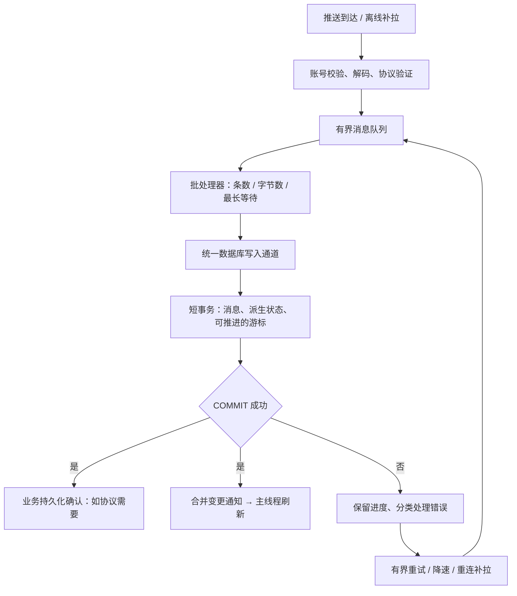

# iOS IM 消息入库架构与 SQL 面试手册


[toc]

---

## 🔥 <font id=前言>前言</font>

**专题归属：** 本篇是 [《iOS IM 开发研究手册》](<../iOS IM开发研究手册.md/iOS IM开发研究手册.md>) 的数据库与消息入库专题。完整研发体系、协议、多端同步、聊天 UI、媒体、安全和通话从总册进入；原始面试题作为本篇案例保留。

> 面向有 iOS 开发经验、尚未深入即时通讯数据库的工程师。从“大量消息到达后如何插入”出发，建立可落地、可追问、可验证的回答。

**IM（Instant Messaging，即时通讯）消息入库同时涉及吞吐、延迟和可靠性。** 把数据库操作搬到子线程，只解决了其中一部分问题。

本文以 [**SQLite**](https://sqlite.org/) 为机制基线，讨论 [**WCDB**](https://github.com/Tencent/wcdb) 等框架的适用位置。资料核对日期：**2026-09-25**。架构方案为教学设计，不代表微信等产品的内部实现；示例规模、批量阈值和评分均不是行业统一标准。

**阅读顺序：** [直接背诵](#answer) → [原回答评分](#review) → [入库架构](#architecture) → [防丢与恢复](#reliability) → [SQL 实操](#sql) → [性能优化](#performance) → [框架认知](#framework) → [iOS 边界](#ios) → [验证](#validation) → [追问与答案](#faq)。

## 一、<span id="answer">面试问题与可直接说出口的回答</span>

### 1.1、原始问题

> 做 IM，一下来了很多消息，需要插入本地数据库，如何在架构上优化？

先确认几个条件：实时消息还是离线补拉、峰值消息量与包体大小、允许的显示延迟、服务端能否重投或补拉、客户端业务确认的含义。确认条件后继续给出默认方案，不把回答停在反问上。

### 1.2、30 秒核心回答

> 我会把消息接收、落库和 UI 刷新解耦，用有容量上限的队列承接消息，由统一写入通道按条数或等待时间触发小批量事务，复用参数化语句。消息用稳定 ID 和唯一约束保证幂等，消息及相关同步进度保持原子一致；只有提交成功后，才确认“已持久化”并通知 UI。失败通过重试、服务端补拉或持久收件箱恢复。最后用事务耗时、排队延迟和查询计划验证效果。WCDB 可以使用，但需要理解它下面的 SQLite 机制。

### 1.3、两分钟展开回答

> 我会先区分在线实时消息和离线历史补拉。实时消息关注可见延迟，历史补拉关注吞吐，但都进入统一的存储协调层，避免多个业务模块各写各的。
>
> 接收层完成必要的校验和解码后进入有界队列；由数据库工作队列统一提交短事务。事务按消息条数、累计字节数或最大等待时间触发，避免逐条提交，也避免无限攒批。插入语句尽量预编译并绑定参数，事务内部不做网络请求和媒体处理。
>
> 正确性上，消息 ID、会话顺序号和同步游标分开建模。用唯一约束处理重投，历史消息不能覆盖较新的会话摘要，重复消息不能重复增加未读数。同步游标只有在协议确认对应范围处理完成后才能前进，并和对应数据一起提交。
>
> 可靠性依赖客户端和服务端共同约定。提交前崩溃，依靠未确认重投或旧游标补拉；提交后确认丢失，再投一次也应无害。如果必须先快速保存原始包、稍后再加工，才引入持久收件箱，并设计重放和清理流程。
>
> 在 SQLite 上，会评估 WAL、索引和分页方式，但 WAL 不会让同一个数据库同时拥有多个写事务。UI 只接收提交后的合并变更，最后在真机压测、注入失败，确认吞吐提高且不丢消息、不重复计数。

完整边界见 [可靠性](#reliability) 和 [FAQ](#faq)。这段回答中的“确认”指应用协议定义的业务确认，不是 TCP ACK。

## 二、<span id="review">原回答评分与逐句校正</span>

### 2.1、主观评分：60 / 100

**按“能否解释完整 IM 入库链路”的面试练习口径，原回答约 60 分。** 已有性能和可靠性意识，但缺少关键机制；这个分数只评价给出的回答，不评价工程师整体水平，也不预测面试结果。

| 维度 | 满分 | 得分 | 判断依据 |
| --- | ---: | ---: | --- |
| 性能瓶颈意识 | 20 | 15 | 意识到大量入库及 I/O 成本 |
| 崩溃恢复设计 | 20 | 8 | 想到了保存消息，但“必须临时数据库”缺少前提和恢复流程 |
| 线程与调度 | 15 | 12 | 知道避开主线程，尚未说明统一写入、有界队列与背压 |
| 事务与 SQL | 15 | 10 | 知道写法影响性能，尚未说出批量事务和语句复用 |
| 消息一致性 | 15 | 3 | 未覆盖去重、乱序、未读数和游标提交 |
| 数据库与框架认知 | 15 | 12 | 理解底层的方向正确，但泛化 SQL、否定框架过于绝对 |
| 合计 | 100 | 60 | 有基础方向，尚未形成完整方案 |

### 2.2、逐句替换

| 原表达 | 保留的判断 | 需要改成的表达 |
| --- | --- | --- |
| 肯定先需要临时数据库存储，避免闪退丢消息 | 需要可靠性设计 | 先确认恢复来源；可直接事务写正式库，必要时增加持久收件箱 |
| 开子线程，在合适时机写库 | 不阻塞 UI | 使用统一写入通道，以条数、字节数和最大等待时间定义触发条件 |
| SQL 不合理导致 I/O 性能下降 | SQL 会影响性能 | 分析事务提交次数、索引维护、扫描量、解析、对象映射和同步开销 |
| 所有数据库都是在 SQL 上封装 | 要理解框架下层 | SQLite 等 SQL 数据库通过 SQL 表达操作；并非所有数据库都以 SQL 为核心 |
| 最好用 SQL，比如 SQLite，不要迷信 WCDB | 不盲信框架 | SQLite 是数据库引擎，WCDB 是基于它的框架；依据能力、维护成本和实测选型 |

**对之前 ChatGPT 回答的评价：** 对“SQL、SQLite、ORM 并非同一层”以及“并非所有数据库最终执行 SQL”的纠正是合理的。但它主要回答了技术分层，没有把原始架构题中的临时库、确认时机、事务和幂等补完整。

<details>
<summary>辅助阅读：面试官可能继续核验的能力</summary>

能够说出某个方案解决什么问题，以及代价落在哪里，比堆术语更有说服力。例如：批处理降低提交频率，同时增加等待；持久收件箱缩短接收关键路径，同时增加写入与重放成本；索引加速部分查询，同时增加写入成本。不要把未实践的设计说成已上线经验。

</details>

## 三、<span id="architecture">消息入库架构</span>

### 3.1、先确定四条不变量

1、重复接收同一消息，最终消息记录和业务副作用不重复。

2、声明“已持久化”的业务确认，不能领先于满足约定耐久级别的提交。

3、同步游标不能越过尚未可靠处理的范围。

4、接收、解析和数据库工作不能无限占用内存，也不能持续阻塞主线程。

### 3.2、默认架构：直接写正式库



图中的“消息、派生状态、游标”在同一数据库文件内提交。消息预处理可以并发，但一个批次必须有明确的提交所有者，不能让任务完成先后替代协议顺序。

| 模块 | 负责 | 应避免 |
| --- | --- | --- |
| 接收层 | 账号归属、包体校验、接收协议 | 收到包就直接刷新会话列表 |
| 批处理器 | 限流、组批、调度公平性 | 队列无限增长、实时消息被历史同步长期饿死 |
| 存储协调层 | 事务、重试、连接生命周期 | 每条消息开一个并发写任务 |
| 消息存储层 | 主键、唯一约束、查询与更新 | 用“先查再插”作为唯一去重防线 |
| 同步状态层 | 重投、缺口、同步游标 | 把最大已见顺序号当成已同步进度 |
| UI 数据层 | 提交后读取、聚合刷新 | 把每条 INSERT 都变成一次全列表刷新 |

### 3.3、可说明的组批策略

**演示起点：** 最多 100 条、累计 256 KiB、最早一条等待 50 ms，任一条件满足即尝试提交；单个超大包需单独限额。这些值只用于解释策略，生产参数由设备、消息大小、延迟目标和实测决定。

- 定时从**最早待写消息**开始计算，不能每来一条就重置等待时间，否则持续来消息会一直不落库。
- 队列同时限制条数和字节数。到达上限后按协议暂停补拉、降低拉取页数或请求重传，不能静默丢弃已接收的业务消息。
- 实时消息与历史补拉可分优先级组批，但同步进度仍按协议规则推进。
- 解析、解压、媒体下载尽量放在事务外；事务只做保证一致性所需的短操作。
- 延迟目标极严或消息很少时，可以立即提交，无需等待凑满。

**异步只改变等待发生在哪里；批量事务才直接改变提交次数。**

## 四、<span id="reliability">临时数据库、防丢与崩溃恢复</span>

### 4.1、三类存储不能混淆

| 存储方式 | 进程退出后能否作为恢复依据 | 适用职责 |
| --- | --- | --- |
| 内存数组、内存队列、`:memory:` 数据库 | 不能 | 缓冲和组批 |
| SQLite `TEMP TABLE` | 不能作为持久恢复依据，生命周期依附连接 | 中间计算 |
| 持久目录中的普通表，并完成可靠提交 | 可以，受耐久配置及存储环境约束 | 正式消息表或持久收件箱 |

所谓“临时库”如果只是业务上的中转库，仍必须解决持久目录、提交、重放与清理问题。`tmp` / `Caches` 不适合作为不可重新获取消息的唯一保存位置。[SQLite 临时文件说明](https://sqlite.org/tempfiles.html)、[Apple 文件系统目录说明](https://developer.apple.com/library/archive/documentation/FileManagement/Conceptual/FileSystemProgrammingGuide/FileSystemOverview/FileSystemOverview.html)

### 4.2、什么时候直接入正式库

消息已经可以低成本解析成正式记录，且服务端支持明确的补拉或重投协议时，先用统一写入通道和短事务直接落正式库。再建一个库未必减少成本：中转记录也要提交，后续还要再次写入、清理和恢复。

对于依赖服务端恢复的方案，必须确认保留时间、游标过期后的处理、账号与设备维度，以及确认后是否仍能补拉。**“服务端应该有”不能当作恢复协议。**

### 4.3、什么时候增加持久收件箱

需要快速可靠地保存原始包，而解码、解密或业务派生处理明显更慢时，可以引入 durable inbox（持久收件箱）：

```text
原始消息包
  → 普通 inbox 表事务提交
  → 按协议确认已可靠接收
  → 后台重放
  → 正式消息、派生状态、处理进度一起提交
  → 标记完成或安全清理 inbox
```

优先评估**同一数据库中的普通 inbox 表**。它与正式表仍共享写入能力，价值在于缩短接收关键路径和支持重放，不是增加一个并行写引擎。

接收游标和业务处理游标需要区分。inbox 已经承担恢复责任时，接收进度可先前进；不能同时谎称业务投影已经完成。原始记录保存到正式表处理成功后才能清理。

如果使用两个数据库文件，需另外设计幂等迁移、跨库状态和故障恢复。尤其在 WAL 模式下，不能把跨多个文件的提交当作一个整体原子事务。[SQLite 多文件事务与临时文件说明](https://sqlite.org/tempfiles.html)

### 4.4、提交与确认之间的故障窗口

下面假设业务 ACK 表示“客户端已承担持久保存责任”，服务端支持未确认重投或从旧进度补拉。

| 故障位置 | 重启后的可信状态 | 恢复动作 |
| --- | --- | --- |
| 仍在内存队列，未入事务 | 没有本地提交记录 | 从旧游标补拉或等待重投 |
| 事务执行中，未提交 | 本批不能声明成功 | 数据库恢复后，从原进度重试 |
| 已提交，业务 ACK 未送达 | 本地已有数据，服务端可能重投 | 通过唯一约束和幂等状态处理重投 |
| 先 ACK，再提交前崩溃 | 服务端可能已停止重投 | 存在丢失窗口，必须改协议或保留另一恢复路径 |
| 已提交，UI 尚未刷新 | 数据已在库中 | 页面重新读取或恢复通知即可 |

TCP ACK、消息接收 ACK、持久化 ACK、已读回执是不同语义；不能要求应用控制 TCP ACK 的发送时机。[对应追问](#faq-ack)

### 4.5、闪退与断电不是同一个保证

<font color=red>**事务原子性保证“不出现半批业务提交”，耐久性讨论“已提交内容在故障后是否仍存在”。**</font>

SQLite 的提交不要求立刻把所有内容搬回主 `.db` 文件；WAL 中的有效提交也属于数据库状态。正常配置下的应用进程崩溃恢复，与操作系统崩溃、设备掉电，需要分别评估。

WAL + `synchronous=NORMAL` 的已提交事务可以跨应用崩溃保留，但掉电或系统崩溃后可能回退近期提交。WAL + `FULL` 增加提交时的同步，提供更强的耐久保障；仍依赖底层文件系统和设备正确履行同步契约。不能把任一设置解释为永不丢失。[SQLite synchronous](https://sqlite.org/pragma.html#pragma_synchronous)、[SQLite 原子提交及存储假设](https://sqlite.org/atomiccommit.html)

如果服务端收到业务 ACK 后立即删除唯一副本，而客户端允许掉电丢最近提交，两端的可靠性承诺就不匹配。需要提高本地耐久级别，或让服务端继续保留可恢复记录。

### 4.6、消息 ID、顺序号、游标分开设计

| 字段 | 回答的问题 | 不能替代的概念 |
| --- | --- | --- |
| `message_id` | 是否同一条业务消息 | 不天然代表时间先后 |
| `seq` | 在协议定义的会话中排在什么位置 | 不天然代表所有之前消息均已取得 |
| `sync_cursor` | 服务端认可的已同步位置 | 不必是数字，不能随意用 `MAX(seq)` 替换 |
| `read_seq` | 本用户在该会话已读到哪里 | 不等于消息总数或同步完成位置 |
| `version` | 同一消息的哪个编辑 / 撤回版本 | 不等于会话顺序号 |

例如先收到 100、102，不能仅凭最大值 102 就声明此前都已同步。101 可能缺失，也可能是协议允许的过滤、删除或非消息事件；由服务端同步契约判断，不能自行假设顺序号一定无空洞。

同一批可拆成多个短事务保存消息，但页级游标只有在整页完成时才能与最后一批一起提交。中途崩溃后重拉整页，之前写过的消息由幂等机制吸收。并发补拉时还需要页依赖或预期游标校验，避免完成较早的后页越过前页。

## 五、<span id="sql">SQL 最小实操：从建表到一致性</span>

### 5.1、示例边界与字段含义

本节是 SQLite 方言，面向已获得服务端消息 ID 和顺序号的消息。使用的 `ON CONFLICT ... DO NOTHING / DO UPDATE` 需要 SQLite **3.24.0 或以上**；实际 App 应检查运行库版本，不能用电脑命令行版本代表 iPhone 或 WCDB 内嵌版本。[SQLite UPSERT](https://sqlite.org/lang_upsert.html)

示例假设：

- `message_id` 在同一账号、同一会话内稳定且唯一；`seq` 在同一账号、同一会话内唯一并决定展示顺序。
- `seq` 可有间隔，因此同步游标使用独立字段；如果协议没有这两个唯一保证，必须调整约束。
- 会话摘要取最新消息 ID 与顺序号。未读数先按查询推导，不在这个小例子里维护额外计数器。
- `is_incoming=1` 表示别人发给当前账号的消息；示例只讨论普通消息，系统事件等是否计未读要另定规则。
- 待发送消息使用独立 Outbox 或另外设计可为空的服务端字段，不能硬塞一个假 `seq`。

### 5.2、建表：约束本身就是正确性防线

```sql
CREATE TABLE message (
    account_id      TEXT NOT NULL,
    conversation_id TEXT NOT NULL,
    message_id      TEXT NOT NULL,
    seq             INTEGER NOT NULL CHECK (seq > 0),
    sender_id       TEXT NOT NULL,
    body            TEXT NOT NULL,
    is_incoming     INTEGER NOT NULL CHECK (is_incoming IN (0, 1)),
    version         INTEGER NOT NULL DEFAULT 1 CHECK (version > 0),
    is_deleted      INTEGER NOT NULL DEFAULT 0 CHECK (is_deleted IN (0, 1)),
    PRIMARY KEY (account_id, conversation_id, message_id),
    UNIQUE (account_id, conversation_id, seq)
);

CREATE TABLE conversation (
    account_id      TEXT NOT NULL,
    conversation_id TEXT NOT NULL,
    last_message_id TEXT,
    last_seq        INTEGER NOT NULL DEFAULT 0,
    read_seq        INTEGER NOT NULL DEFAULT 0,
    PRIMARY KEY (account_id, conversation_id)
);

CREATE TABLE sync_state (
    account_id TEXT NOT NULL,
    stream_id  TEXT NOT NULL,
    cursor     TEXT NOT NULL,
    PRIMARY KEY (account_id, stream_id)
);
```

两组唯一约束分别处理消息身份和会话顺序冲突。对应索引已经存在，不再机械创建同列索引；`(account_id, conversation_id, seq)` 也可服务会话范围查询和排序。[SQLite 复合索引说明](https://sqlite.org/queryplanner.html)

同 ID、不同内容可能是新版本事件或协议异常，不能永远静默跳过；下文的 `DO NOTHING` 只处理原始消息的正常重投。不同 ID 占用同一个 `seq` 会报错，便于暴露数据契约问题。

### 5.3、增：一个小事务保存两条消息与同步位置

下面假设服务端明确保证：这一完整同步页包含两条消息，处理后可以从 `C1` 继续。`C1` 是教学用不透明游标，不从顺序号计算。

```sql
BEGIN IMMEDIATE;

INSERT INTO message (
    account_id, conversation_id, message_id,
    seq, sender_id, body, is_incoming
) VALUES
    ('a1', 'c1', 'm101', 101, 'u2', '第一条消息', 1),
    ('a1', 'c1', 'm102', 102, 'u2', '第二条消息', 1)
ON CONFLICT (account_id, conversation_id, message_id) DO NOTHING;

-- 每个受影响会话每批更新一次；旧消息不能让摘要倒退。
INSERT INTO conversation (
    account_id, conversation_id, last_message_id, last_seq
)
SELECT account_id, conversation_id, message_id, seq
FROM message
WHERE account_id = 'a1' AND conversation_id = 'c1'
ORDER BY seq DESC
LIMIT 1
ON CONFLICT (account_id, conversation_id) DO UPDATE SET
    last_message_id = excluded.last_message_id,
    last_seq = excluded.last_seq
WHERE excluded.last_seq > conversation.last_seq;

INSERT INTO sync_state (account_id, stream_id, cursor)
VALUES ('a1', 'inbox', 'C1')
ON CONFLICT (account_id, stream_id) DO UPDATE SET
    cursor = excluded.cursor;

COMMIT;
```

**预期结果：** `message` 有 2 行，摘要为 `m102 / 102`，同步游标为 `C1`。重复执行同一批，消息仍为 2 行。

这不是通用同步引擎：示例依赖上层保证页顺序和完整性。游标 UPSERT 不负责检测旧页覆盖新页；生产代码应取得写事务后，在事务内校验当前游标是否等于本页预期前驱，不匹配则回滚。也可以通过带预期值条件的更新并检查影响行数实现，不能在事务外检查后直接假定结果仍有效。

`BEGIN IMMEDIATE` 尝试提前取得写事务，可能返回 `SQLITE_BUSY`；若框架已管理事务，就使用框架事务 API，不再手动嵌套 `BEGIN`。[SQLite 事务语义](https://sqlite.org/lang_transaction.html)

### 5.4、生产写入控制流

```text
校验账号和消息契约
复用该连接上的参数化插入语句
开始事务
try:
    在写事务内读取并校验批次前驱游标；不匹配则退出并回滚
    对每条消息执行 bind → step → 检查结果
    立即读取本条插入结果，区分新增、正常重复和异常冲突
    检查 reset 结果；下次覆盖绑定全部参数，或先 clear_bindings
    对受影响会话各更新一次摘要及需要物化的业务状态
    若协议范围已完整处理，则更新同步游标
    执行 COMMIT，并检查提交结果
catch:
    若事务仍有效，则 ROLLBACK，并检查回滚结果
    不宣告成功，不提前发持久化确认
    分类处理失败；连接状态不确定时先恢复连接
提交成功后：确认、发布变更、移除已完成队列项
```

SQL 中途报错不代表整批已经自动回滚，`COMMIT` 本身也可能失败。使用框架时检查其事务闭包、错误传播和回滚契约。[SQLite 事务错误处理](https://sqlite.org/lang_transaction.html)

参数绑定将值与 SQL 结构分开，减少手工转义错误；预编译语句复用减少重复解析。`reset` 不会清除旧绑定，且需要检查返回值。`changes()` 读取应紧跟对应 DML，保持同一连接且无其他语句插入；不要用累积变更数判断当前消息是否新增。[prepare](https://sqlite.org/c3ref/prepare.html)、[bind](https://sqlite.org/c3ref/bind_blob.html)、[reset](https://sqlite.org/c3ref/reset.html)、[changes](https://sqlite.org/c3ref/changes.html)

### 5.5、查：按会话读取与游标分页

首次读取最新 50 条：

```sql
SELECT message_id, seq, sender_id, body
FROM message
WHERE account_id = :account_id
  AND conversation_id = :conversation_id
  AND is_deleted = 0
ORDER BY seq DESC
LIMIT 50;
```

继续向前读取，以**上一页最后一条返回记录的 `seq`**作为 `:before_seq`：

```sql
SELECT message_id, seq, sender_id, body
FROM message
WHERE account_id = :account_id
  AND conversation_id = :conversation_id
  AND is_deleted = 0
  AND seq < :before_seq
ORDER BY seq DESC
LIMIT 50;
```

这里的 `:name` 都需要绑定；不能把消息内容拼进 SQL。倒序结果若要在聊天页按正序展示，可在拿到这一小页后反转。

与深度 `OFFSET` 分页相比，按稳定排序键续查可以避免反复跳过大量前序记录，也减少新消息插入引起的位置漂移；它不保证跨页期间发生删除、编辑时仍是同一个历史快照。若排序键不唯一，需要增加稳定的第二排序键并同步放进分页条件。[SQLite 滚动窗口查询](https://sqlite.org/rowvalue.html#scrolling_window_queries)

### 5.6、改：已读位置单调前进

```sql
UPDATE conversation
SET read_seq = MAX(read_seq, :read_seq)
WHERE account_id = :account_id
  AND conversation_id = :conversation_id;
```

这个标记代表用户确认已读到某位置，上层必须验证位置来源；不能因为拉取到了新消息就自动标为已读。`MAX` 防止较旧回执让状态倒退，多端合并也要遵循协议。

**未读计算的前提是已取得可靠的已读状态。** 建表中的默认值 0 只是示例初值，不证明用户从未读过历史消息；新设备先收到历史、尚未同步已读位置时，应标记为“读状态待同步”。生产模型需另设初始化状态，或使用明确的未知值语义。

简化版未读数查询：

```sql
SELECT COUNT(*) AS unread_count
FROM message AS m
JOIN conversation AS c
  ON c.account_id = m.account_id
 AND c.conversation_id = m.conversation_id
WHERE m.account_id = :account_id
  AND m.conversation_id = :conversation_id
  AND m.seq > c.read_seq
  AND m.is_incoming = 1
  AND m.is_deleted = 0;
```

该值是**本地已落库普通消息的未读数**；若历史同步不完整，不能声称代表服务端全部未读消息。也不能简单写成 `last_seq - read_seq`，因为顺序号可有空洞，且可能包含自身发送、撤回或不计未读的事件。

会话列表规模大、聚合查询确实成为瓶颈时，再考虑存储 `unread_count`。增量计数必须只对真正新增且符合计数规则的消息执行，并与消息写入同事务；历史补拉、已读、撤回和重放都需对账规则。[对应追问](#faq-unread)

### 5.7、改与删：版本保护、撤回和清理

对已经存在的消息，按服务端版本更新内容或保存撤回标记：

```sql
UPDATE message
SET body = CASE WHEN :is_deleted = 1 THEN '' ELSE :body END,
    is_deleted = :is_deleted,
    version = :version
WHERE account_id = :account_id
  AND conversation_id = :conversation_id
  AND message_id = :message_id
  AND version < :version;
```

它只演示“较旧版本不覆盖较新版本”。真实业务还应校验事件权限和允许的状态转换；不可恢复的撤回不能被后续普通编辑复活。

**撤回先于原消息到达时，单纯 UPDATE 会影响 0 行。** 需保存 tombstone（删除 / 撤回占位记录）或待应用事件，再按消息 ID 和版本合并原消息。上面的最小表和 UPDATE 并未实现完整事件合并器。

物理清理是另一件事。以下删除仅适用于已满足保留政策、恢复与去重条件的旧撤回记录，`:purge_before_seq` 为排他的安全界限：

```sql
DELETE FROM message
WHERE account_id = :account_id
  AND conversation_id = :conversation_id
  AND is_deleted = 1
  AND seq < :purge_before_seq;
```

删除后要修复可能引用被删记录的会话摘要；大规模清理分小批进行。若原消息仍可能重投，先保留独立去重 / tombstone 信息，否则删记录会删掉防复活依据。

### 5.8、冲突处理不要偷懒

| 写法 | 行为与边界 |
| --- | --- |
| `ON CONFLICT (消息主键) DO NOTHING` | 仅消化指定身份冲突；仍需判断新版本和内容异常 |
| `ON CONFLICT (...) DO UPDATE` | 明确更新字段，并加版本或状态条件 |
| `INSERT OR IGNORE` | 可能把某些非重复约束错误一起静默跳过，不适合无差别吞错 |
| `INSERT OR REPLACE` | 发生唯一冲突时会删除旧行再插入，可能破坏未显式提供的字段或关联关系 |

**REPLACE 不是普通 UPDATE 的另一种写法。** [SQLite 冲突处理规则](https://sqlite.org/lang_conflict.html)

## 六、<span id="performance">性能优化：先看提交，再看访问路径</span>

### 6.1、批量事务与一条超长 SQL 是两个概念

假设有 1,000 条消息：

| 策略 | 事务提交次数示意 | 主要代价 |
| --- | ---: | --- |
| 每条独立提交 | 1,000 | 反复提交与同步、事务固定开销 |
| 每批 100 条 | 10 | 需要组批等待与批次失败重试 |
| 全部放一个事务 | 1 | 锁持有更久、内存和恢复成本更大、实时写入可能被阻塞 |

这是提交次数对比，不是性能倍数承诺。缓存、耐久配置、消息大小、索引和设备会改变实际收益。[SQLite 提交成本说明](https://sqlite.org/atomiccommit.html)

一个事务内循环执行同一条预编译 INSERT，已经可以获得批量事务收益。多行 `VALUES` 是另一项优化，不必为了组批拼成一条巨大 SQL；还要遵守参数数量及语句长度限制。

### 6.2、索引按真实查询设计

聊天历史常用条件是账号、会话和顺序范围，因此示例保留对应复合索引。反过来，以 `body` 为先导列建索引，通常不能有效服务这个查询。

索引不是越多越好：每次 INSERT / UPDATE 可能还要维护索引页，增加空间与写入成本。也不要把整段消息正文塞进大覆盖索引，只为少一次取行而明显放大写负担。[SQLite 查询规划](https://sqlite.org/queryplanner.html)

```sql
EXPLAIN QUERY PLAN
SELECT message_id, seq, sender_id, body
FROM message
WHERE account_id = 'a1'
  AND conversation_id = 'c1'
  AND is_deleted = 0
  AND seq < 200
ORDER BY seq DESC
LIMIT 50;
```

重点看是否按账号、会话及 `seq` 范围进行索引搜索，以及是否出现额外排序。示例未将 `is_deleted` 放入索引，仍需过滤候选行；大量撤回数据可能增加扫描量，要在真实分布下再评估索引或清理。

`SCAN` 不一定错误：小表、全量需求可能合理。`SEARCH` 也不保证快：范围过大、回表过多仍可能慢。查询计划描述访问策略，不直接提供真实耗时，且输出格式可能随版本变化。[EXPLAIN QUERY PLAN](https://sqlite.org/eqp.html)

### 6.3、WAL 的用途与限制

WAL（Write-Ahead Logging，预写日志）将修改先记录到 WAL，之后通过 checkpoint（检查点）合并到主数据库文件。它通常有利于读写并行，但同一个数据库仍只有一个活跃写事务；也不能承诺完全不会遇到 `SQLITE_BUSY`。[SQLite WAL](https://sqlite.org/wal.html)、[SQLite 事务](https://sqlite.org/lang_transaction.html)

初始化连接时可评估下面的示意配置，先查框架是否已管理这些设置：

```sql
PRAGMA journal_mode = WAL;
PRAGMA synchronous = FULL;
PRAGMA busy_timeout = 1000;
```

- `journal_mode`：检查返回值是否确实为 `wal`；它是持久的数据库模式。
- `synchronous`：按可靠性目标设置写连接，本例用 `FULL`。取舍见 [闪退与断电](#reliability)，不能只为了跑分快而关闭同步。
- `busy_timeout`：此处 1,000 ms 只是演示值，在执行数据库工作的线程上等待锁，不保证最终成功；按延迟预算配置每个连接。

这些设置不应在每条消息写入前反复执行。[SQLite PRAGMA](https://sqlite.org/pragma.html)

长时间读事务可能阻碍 checkpoint 完成并使 WAL 增长。应缩短读取快照、观察 WAL 体积和检查点耗时，避免在每条消息后强制 checkpoint。备份使用数据库 / 框架支持的机制；不能在数据库打开时只复制 `.db` 并忽略 `-wal`。[SQLite WAL 检查点与文件说明](https://sqlite.org/wal.html)

### 6.4、常见热点与第一步动作

| 观察到的现象 | 首先检查 |
| --- | --- |
| 入库慢且提交很频繁 | 是否每条消息独立事务 |
| CPU 高，磁盘并不忙 | 反复 prepare、JSON 编解码、对象映射、日志 |
| 经常锁等待 | 长事务、跨模块写入、扩展进程、连接使用规则 |
| 查历史越往前越慢 | 深度 OFFSET、排序与索引不匹配 |
| 会话列表打开时查询暴增 | 是否一个列表查询后又按每个会话查一次摘要 / 未读，即 N+1 |
| 写库不慢但 UI 卡顿 | 主线程对象转换、全量 diff、每条消息一次刷新 |
| 内存随补拉持续上涨 | 接收队列无界、一次解码整批大对象、读取结果不释放 |
| 数据库文件越清理越忙 | 热路径大批 DELETE、频繁 VACUUM 或强制 checkpoint |

先记录热点，再决定是否分库或分表。每会话一张表会增加表数量、迁移、全局搜索和清理复杂度，不能作为 IM 的默认优化答案。

## 七、<span id="framework">SQL、SQLite 与 WCDB 的关系</span>

### 7.1、分层认知

```text
业务代码
  ↓
WCDB / GRDB 等框架（可提供对象映射、连接与事务管理）
  ↓
SQL 与绑定参数
  ↓
SQLite 解析、查询规划与字节码生成
  ↓
VDBE 虚拟机执行
  ↓
表与索引的 B-Tree
  ↓
Pager / Page Cache / WAL 或回滚日志
  ↓
VFS、操作系统、文件系统与存储设备
```

这是帮助理解的简化路径，不表示每条 SQL 都会访问所有层或发生磁盘读写。缓存命中、语句类型和事务模式会改变实际行为。[SQLite 架构](https://sqlite.org/arch.html)

<font color=red>**SQL 是表达数据操作的语言，SQLite 是执行这些操作的数据库引擎，WCDB 是基于 SQLite / SQLCipher 的数据库框架。**</font> [WCDB 官方说明](https://github.com/Tencent/wcdb)

“SQL 比 ORM 更接近执行层”是便于沟通的相对说法。SQL 本身还是声明式接口：描述要什么结果，具体怎样扫描、排序和更新由引擎决定。非 SQL 数据库也有自己的接口，例如 [**RocksDB**](https://rocksdb.org/docs/getting-started.html) 的键值读写，并不是最终一定执行 SQL。

### 7.2、框架也可以改善性能

WCDB 不只有对象映射，还提供查询构造、连接池等能力，官方也介绍了针对移动端和批量写入的优化。不能推导出“封装越少就一定越快”。能力和默认行为应以项目使用的具体版本为准。[WCDB 功能说明](https://github.com/Tencent/wcdb)

比较框架与直接使用 SQLite 时，控制以下变量：相同数据集、SQL / 索引、事务边界、耐久设置、加密条件、缓存状态、设备和构建方式。否则很容易把配置差异误判成框架优劣。

| 使用方式 | 适合解决的问题 | 需要承担的成本 |
| --- | --- | --- |
| 直接使用 SQLite C API | 需要精确控制语句、绑定、连接和执行过程 | 手动管理资源、错误传播、事务和迁移 |
| WCDB 等框架 | 在工程能力和维护效率之间取得平衡 | 理解生成查询、默认事务 / 连接行为和版本兼容 |
| 框架内对热点做专项优化 | 保留统一存储入口，优化已测出的热点 | 避免新增一套绕过迁移和连接管理的访问路径 |

### 7.3、适合面试的最终表述

> 我倾向于理解 SQL 和 SQLite 的执行机制，而不是只会调用对象增删改查。WCDB 本身没有问题；框架能提高效率，性能问题则需要结合实际 SQL、索引、事务、查询计划、连接和 I/O 来定位。我不会仅凭手写 SQL 就判断一定更快。

## 八、<span id="ios">iOS 工程落地边界</span>

### 8.1、线程与连接

- 数据库工作放在明确的非主线程执行环境；主线程只处理必要的可见状态更新。
- 统一管理写入，不把全局并发队列当成数据库调度策略；使用数据库框架时遵守其连接和线程契约。
- [**Swift**](https://www.swift.org/) 的 `Task`、`async`、`actor` 是并发与隔离工具，不自动承诺数据库代码一定在后台线程执行；发生挂起后还应考虑状态交错，不能把 actor 隔离等同于数据库事务。
- 主 App 与扩展共享数据库时，进程内串行队列不能管理另一个进程；仍需协调写入、处理数据库锁和文件访问条件。

### 8.2、后台、文件与账号

iOS 可能挂起或终止 App，不能依赖“进入后台后慢慢把内存队列写完”。后台执行延长只能用于有限收尾，并需处理到期，不能替代持久化和下次启动恢复。[Apple 后台执行说明](https://developer.apple.com/documentation/uikit/extending-your-app-s-background-execution-time)

需要长期保留的数据按用途存储到持久目录，并决定备份及文件保护策略。数据库打开或写入因文件访问条件失败时，保留失败状态与恢复进度，不能仍然返回保存成功。[Apple 文件系统说明](https://developer.apple.com/library/archive/documentation/FileManagement/Conceptual/FileSystemProgrammingGuide/FileSystemOverview/FileSystemOverview.html)

账号切换需隔离数据库、队列、连接和回调。旧账号的批次完成后，不得更新新账号的会话列表；可以为任务携带账号与会话代次并在提交和通知时校验。

### 8.3、媒体消息与发送侧

数据库保存媒体元信息和状态，下载 / 解码在事务外处理。大附件是否放 BLOB，要结合尺寸、读取与备份方式测试，不能只用“数据库不能放二进制”下结论。

发送侧可采用 Outbox：先保存本地待发记录和稳定 `client_message_id`，再发送；重试复用同一 ID，回执后关联 `server_message_id` 和正式顺序号。服务端也要支持对应幂等契约，否则客户端不能单独保证远端只生成一条消息。

这些能力与接收侧共用存储纪律，但本节 SQL 示例未实现完整收发 SDK。

## 九、<span id="validation">验证方案与排障</span>

### 9.1、先验正确性，再测速度

| 场景 | 必须满足的结果 |
| --- | --- |
| 同一批重复导入 | 行数不增长，未读不重复累计 |
| 先到新消息，再补旧消息 | 摘要不倒退，历史查询仍按协议顺序 |
| 同 ID 编辑版本乱序 | 较旧版本不覆盖较新内容 |
| 撤回早于原消息 | 撤回状态保留，不被迟到原消息复活 |
| 批次中一条数据约束错误 | 无半批业务提交，游标不前进 |
| 提交前进程退出 | 未提交消息和游标不会残留成成功状态 |
| 提交后、确认前进程退出 | 重投不产生重复副作用 |
| 游标中间范围未完成 | 后续批次不能越过未处理范围 |
| 磁盘满、锁等待、文件不可访问 | 显式失败并进入恢复路径，不假成功 |
| 长历史补拉期间持续在线收消息 | 队列有上限，实时消息有延迟预算 |
| 账号切换、后台到期 | 不串账号，不依赖后台一定执行完 |

这张表是生产验证计划，不代表所有场景已在本文完成测试。尤其是断电、后台到期和真实网络 ACK，必须在对应环境验证。

### 9.2、压测记录

先固定设备、系统、SQLite / 框架版本、表结构、索引、加密和同步配置。至少分别测“小消息密集到达、大包消息、离线补拉、重复和乱序输入”，并设置热缓存与冷启动条件。

| 指标 | 含义 |
| --- | --- |
| 持久化吞吐 | 每秒实际新增并成功提交的消息数量，去重跳过不能冒充新增 |
| 接收到可见延迟 | 接收、排队、写入、提交、UI 展示的端到端 P50 / P95 / P99 |
| 事务耗时 | 每批执行与提交耗时，分开记录锁等待 |
| 队列积压 | 条数、字节数、最老消息年龄 |
| 资源使用 | CPU、内存、写入字节、WAL 大小、耗电与卡顿 |
| 正确性计数 | 唯一消息总数、冲突、失败、重试、缺口与恢复完成率 |

不要只比较 SQL 执行时间，也不要因为平均延迟很低就忽略尾部卡顿。用 [**Xcode**](https://developer.apple.com/xcode/) 的性能分析工具结合应用埋点定位哪一段最慢。

### 9.3、本文验证边界

**验证日期：2026-09-25。** 从本文提取全部 **10 个 SQL 代码块**，在本机 SQLite 命令行返回版本 **3.54.0** 的隔离数据库中执行，**19 项检查通过**。

| 已验证范围 | 结果 |
| --- | --- |
| 批量入库、会话摘要与游标 | 2 条消息对应 `m102 / 102 / C1` |
| 重复导入、补旧消息、账号隔离 | 不重复插入，不倒退摘要，不串账号 |
| 最新页与向前分页 | 按 `seq` 倒序，续页不重复边界记录 |
| 已读位置与本地未读 | 位置不倒退，已读 / 撤回后计数符合示例规则 |
| 编辑版本、撤回和清理边界 | 旧版本不覆盖新版本，清理采用排他边界 |
| 显式回滚、非身份唯一冲突 | 显式回滚保留旧状态；定向去重没有吞掉顺序号冲突，失败连接退出后未提交内容撤销 |
| 提交前后强制终止测试进程 | 提交前保留旧进度，提交后保留已提交记录；重启重投不重复插入 |
| 查询访问路径 | 使用会话顺序复合索引，没有额外临时排序 |

查询计划实际输出中的核心部分：

```text
SEARCH message USING INDEX sqlite_autoindex_message_2
(account_id=? AND conversation_id=? AND seq<?)
```

强制终止针对测试启动的 SQLite 子进程，不是设备断电。测试里连接关闭后的自动撤销，不可替代生产代码对错误的显式处理。主 App / 扩展并发、iOS 真机、WCDB API、真实服务端补拉、磁盘故障和掉电耐久性未在这组本地 SQL 验证中覆盖；也未据此宣称任何吞吐提升倍数。

## 十、<span id="faq">面试追问与参考答案</span>

### 10.1、为什么开了子线程，入库还是慢？

**答：** 子线程避免阻塞 UI，但不会自动降低磁盘同步、锁等待和索引维护成本。先检查是否逐条提交、反复编译 SQL、事务太长，以及数据库工作完成后是否把大量对象转换和刷新又放回主线程。[回看性能优化](#performance)

### 10.2、为什么不开十个线程同时插入？

**答：** 同一个 SQLite 数据库同时只有一个写事务。更多写任务可能增加竞争和排队；解析可以并行，写入需要统一调度。多个独立数据库可以有不同的写入并发条件，但跨库一致性与查询复杂度要另行承担。[回看架构](#architecture)

### 10.3、为什么不用一个事务写完十万条？

**答：** 可以减少提交次数，但会延长写事务、增加内存和失败重试成本，并阻塞实时写入。采用有上限的批次，结合实际延迟预算测试；分页拆批后，游标仍只在完整同步范围保存完毕后推进。[回看组批](#architecture)

### 10.4、是否必须先写一份临时数据库？

**答：** 不必须。服务端可恢复、正式消息可快速落库时，直接短事务提交即可。需要先保原始包、后做重处理时，用持久收件箱，并实现重放、幂等和清理；内存库及 TEMP 表不承担跨启动恢复。[回看存储选择](#reliability)

### 10.5、<span id="faq-ack">ACK 到底什么时候发？</span>

**答：** 先说明是哪种 ACK。TCP ACK 不由业务落库控制；承诺“已持久化”的业务 ACK 应在约定的可靠提交之后发。如果协议 ACK 只表示收到，必须有独立持久化 / 补拉协议，不能偷偷把两种含义混成一种。[回看故障窗口](#reliability)

### 10.6、提交成功了，但 ACK 丢了怎么办？

**答：** 接受重投，用稳定消息 ID 和唯一约束去重；摘要、未读、通知等副作用也需幂等。这是“允许重复传输、重复处理不改变最终结果”的设计，不能仅凭本地唯一索引宣称整个网络链路 exactly-once。[回看约束与事务](#sql)

### 10.7、为什么游标不能直接取最大 seq？

**答：** 最大已见顺序号不证明前面的范围已处理完，而且账号同步流与会话排序可能不是同一个维度。依据服务端契约保存游标、缺口或区间完成状态；消息和可推进的进度保持原子一致。[回看游标](#reliability)

### 10.8、<span id="faq-unread">重复消息怎样避免未读数重复加一？</span>

**答：** 先由数据库判断是否真正新增，再结合消息方向、类型及已读位置判断是否计未读。物化计数与消息同事务更新；重复、补历史和重放不能盲目加一。最小方案可以查询推导，本地历史不全时需区分本地值与服务端权威值。[回看未读 SQL](#sql)

### 10.9、为什么不直接 INSERT OR REPLACE？

**答：** 唯一冲突时 REPLACE 可能先删旧行再插入，丢掉旧行中未提供的字段，也可能影响关联关系。明确使用定向去重或带版本条件的 UPDATE / UPSERT，并处理真正的协议冲突。[回看冲突表](#sql)

### 10.10、WAL 已经是日志，还要业务收件箱吗？

**答：** WAL 负责数据库事务与恢复；inbox 记录业务消息的接收及待处理状态，两者职责不同。原始消息还没交给数据库时，WAL 不会自动帮忙保存它；是否需要 inbox，取决于业务处理与接收恢复是否需要解耦。[回看可靠性](#reliability)

### 10.11、WAL + NORMAL 能不能防闪退？

**答：** 已提交事务可以跨应用进程崩溃保留，但不能据此推导出设备掉电或系统崩溃后也保留所有近期提交。根据消息恢复责任选择耐久配置，并考虑服务端保留能力；不能把应用闪退测试当成断电验证。[回看耐久性](#reliability)

### 10.12、索引越多越好，SQL 越短越快吗？

**答：** 都不成立。索引增加写入维护和空间成本，SQL 长度也不代表扫描和排序成本。围绕真实条件、排序、返回字段和数据分布设计索引，再用执行计划和耗时验证。[回看访问路径](#performance)

### 10.13、WCDB 和手写 SQLite 哪个更快？

**答：** 没有脱离场景的答案。框架可能复用连接和语句并优化批量写入；手写也可能逐条提交而更慢。统一事务、索引、加密、同步配置和数据集再比较。选型要同时考虑性能、迁移、可观测性和维护能力。[回看框架分层](#framework)

### 10.14、服务器不支持重投或补拉，本地能保证绝不丢吗？

**答：** 不能保证从网络到本地的全链路绝不丢。尽早把接收内容持久提交可以缩小窗口，但包到达与提交之间仍可能崩溃。必须与服务端一起定义确认和恢复协议，明确保证范围。[回看确认窗口](#reliability)

### 10.15、数据库成功了，UI 通知没发出去怎么办？

**答：** UI 以已提交数据为依据，页面恢复或重新订阅后可重新查询。若某个后续业务事件也要求可靠投递，应把待发送事件和消息一起持久化，再异步投递与确认，不能只靠一次内存回调。[回看架构](#architecture)

### 10.16、没有 IM 项目经历，如何诚实地表达？

**答：** “我没有完整 IM 上线经验，但理解这里的核心是消息身份、提交边界和恢复协议。我会先做统一写入、小批事务、唯一约束和游标一致性，再用重投、乱序和崩溃注入验证。WAL 和框架参数会结合实际版本及真机数据确认。”

**临场记忆链：** <font color=red>**有界接收 → 统一写入 → 小批事务 → 幂等状态 → 安全游标 → 提交后确认 → 合并刷新 → 故障恢复 → 实测验证。**</font>

## 十一、<span id="sources">官方资料索引</span>

正文已在对应结论旁标注来源，以下用于继续学习。架构取舍、业务协议和故障演练方案是本文设计推导，不是这些数据库文档替具体产品做出的承诺。

| 资料 | 阅读目标 |
| --- | --- |
| [SQLite Architecture](https://sqlite.org/arch.html) | SQL、字节码、B-Tree、Pager 与 VFS 的分工 |
| [SQLite Transactions](https://sqlite.org/lang_transaction.html) | 写事务、锁竞争、提交失败及回滚 |
| [SQLite Atomic Commit](https://sqlite.org/atomiccommit.html) | 原子提交成本与底层存储假设 |
| [SQLite WAL](https://sqlite.org/wal.html) | 读写并行、检查点、WAL 文件和限制 |
| [SQLite PRAGMA](https://sqlite.org/pragma.html) | 同步级别、锁等待及连接配置 |
| [SQLite UPSERT](https://sqlite.org/lang_upsert.html) | 定向冲突处理和版本边界 |
| [SQLite ON CONFLICT](https://sqlite.org/lang_conflict.html) | IGNORE、REPLACE 与错误处理差异 |
| [SQLite Query Planner](https://sqlite.org/queryplanner.html) | 复合索引、覆盖索引与排序 |
| [SQLite EXPLAIN QUERY PLAN](https://sqlite.org/eqp.html) | 如何阅读查询访问路径 |
| [SQLite Row Values](https://sqlite.org/rowvalue.html) | 滚动窗口与多字段分页 |
| [SQLite Temporary Files](https://sqlite.org/tempfiles.html) | 临时表、多文件提交与日志 |
| [WCDB 官方仓库](https://github.com/Tencent/wcdb) | 框架定位、功能和各语言教程 |
| [Apple 后台执行](https://developer.apple.com/documentation/uikit/extending-your-app-s-background-execution-time) | 后台收尾与到期边界 |

<a id="🔚" href="#前言" style="font-size:17px; color:green; font-weight:bold;">我是有底线的➤点我回到首页</a>
