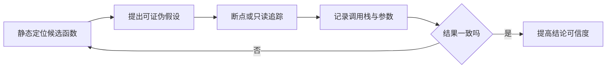

# `iOS 逆向专题：动态分析`


[toc]

---

## 🔥 <font id=前言>前言</font>

> 动态分析是在程序运行时观察真实控制流、参数、返回值、线程和内存。本专题以 LLDB 为主、Frida 只读观测为进阶，并说明 Cycript 的历史位置。所有实验仅限自己编译、公开教学或明确授权且可调试的 App。

## 一、静态结论为什么必须动态验证 <a href="#前言" style="font-size:17px; color:green;"><b>🔼</b></a> <a href="#🔚" style="font-size:17px; color:green;"><b>🔽</b></a>

### 1.1、动态分析回答的是“这一次实际发生了什么”

静态分析能看到所有可能分支，动态分析看到的是某组输入、设备和状态下走过的具体路径。二者应形成闭环：



### 1.2、动态证据也有边界

- 一次没有命中断点，不等于函数永远不会执行。
- 修改返回值只能证明“修改后出现了某现象”，不能证明原始业务意图。
- Release 优化可能内联、删除或重排代码。
- 调试器本身会改变时序，竞态和性能结论需要 Instruments 或专门测试复核。

## 二、LLDB：第一优先级工具

### 2.1、为什么先学 LLDB

[**LLDB**](https://lldb.llvm.org/) 与 [**Xcode**](https://developer.apple.com/xcode/) 调试流程、源码、符号、dSYM 和 Apple 平台工具链直接结合。对自有 App，很多问题不需要越狱、注入或第三方脚本。

### 2.2、最小命令集

在 Xcode 启动自己的 `ReverseLab` 后：

```lldb
help
breakpoint list
breakpoint set --name targetFunction
run
thread backtrace
frame variable
register read
disassemble --frame --mixed
image list
image lookup --name targetFunction
```

Objective-C 方法可使用符号断点：

```lldb
breakpoint set --name '-[RLCalculator calculate:]'
```

[**Swift**](https://www.swift.org/) 方法名可能经过修饰，优先从 Xcode Symbolic Breakpoint、`image lookup -rn` 或已生成的 dSYM 定位，不要硬猜地址。

### 2.3、地址三件套

| 名词 | 含义 |
| --- | --- |
| 文件地址 / 偏移 | Mach-O 文件中的位置 |
| 首选加载地址 | 二进制声明的虚拟地址 |
| 运行时地址 | ASLR 后进程真正使用的地址 |

先用 `image list` 查看当前镜像和 Slide，再把静态工具里的地址映射到运行时；不要把网上样本的绝对地址直接复制到自己的版本。

### 2.4、安全的观察动作

- 断点命中次数与线程。
- 调用栈和当前 Frame。
- 已有变量和寄存器。
- 当前指令附近的反汇编。
- 镜像、符号、UUID 与 dSYM 映射。

入门阶段先不改指令、不写内存、不绕过安全判断。只读观察已经足够建立动态证据链。

## 三、Frida：脚本化只读观测

### 3.1、它适合解决什么

[**Frida**](https://frida.re/) 提供跨平台动态插桩能力，适合在授权环境中批量枚举模块、记录自有函数调用、把重复观测脚本化。它不是 LLDB 的替代品：不了解调用约定和 Runtime 时，脚本输出很容易被误读。

### 3.2、合规 Lab 边界

只对自己构建且允许调试的 Lab：

- 枚举已加载模块和公开符号。
- 记录一个自有测试函数是否被调用。
- 打印非敏感测试参数和线程信息。
- 与 LLDB 的断点次数交叉验证。

本专题不提供绕过证书固定、身份验证、支付、授权、反调试或第三方 App 防护的脚本。

### 3.3、为什么真机步骤不能照搬旧博客

Frida 的 iOS 官方文档同时覆盖越狱设备和“无越狱但由开发者控制的可调试 App”等路径。系统版本、签名、Developer Disk Image、架构和 Gadget 集成都会变化，必须以当前 [**Frida iOS 官方文档**](https://frida.re/docs/ios/) 为准，并只在授权样本中执行。

## 四、Cycript：理解历史，不作为现代主线

### 4.1、它曾经解决什么

[**Cycript**](http://www.cycript.org/) 把 JavaScript 风格交互与 Objective-C / Java Runtime 结合，早期越狱研究中常用于运行时探索和调用对象。

### 4.2、为什么今天优先 LLDB + Frida

- Cycript 的主流教程、设备环境和生态多停留在较早 iOS 时代。
- Swift、arm64e、PAC、新签名与现代系统防护让旧流程失真。
- LLDB 更贴近 Apple 官方调试链；Frida 的现代文档、跨平台和脚本生态更完整。

阅读旧文章遇到 Cycript 时，先理解它要解决的“运行时交互”问题，再映射到当前工具，不要为了复现旧命令搭建不必要的高风险环境。

## 五、动态实验的标准工作流

### 5.1、实验前

1、记录授权边界、工程提交和构建配置。

2、保存 App 与 dSYM UUID。

3、从静态证据提出一个可以被否定的假设。

4、准备不含真实个人数据的测试输入。

### 5.2、实验中

1、用符号断点命中候选函数。

2、记录线程、调用栈、参数和返回路径。

3、重复不同输入，观察分支是否变化。

4、必要时用 Frida 只读追踪重复采样。

5、不把调试器改变时序后的结果直接当性能结论。

### 5.3、实验后

| 字段 | 内容 |
| --- | --- |
| 环境 | 设备、系统、架构、App UUID |
| 触发条件 | 页面、输入、网络与账号状态 |
| 静态假设 | 命中前的判断 |
| 动态证据 | 断点、调用栈、寄存器、日志 |
| 结论 | 被支持、被否定或仍不充分 |
| 副作用 | 是否修改状态；默认应为无 |

## 六、常见故障

### 6.1、断点不命中

- 运行的是另一份构建产物或 UUID 不一致。
- 函数被内联、优化或裁剪。
- 符号名与修饰名不一致。
- 目标路径没有被当前测试输入触发。
- Extension 或 Framework 在另一个进程 / 镜像中。

### 6.2、表达式执行失败

LLDB 表达式会调用编译器和 Runtime，不是纯粹“读取变量”。先使用 `frame variable`、`register read` 和 `memory read` 等观察手段，再决定是否需要表达式求值。

## 七、完成标准与资料

### 7.1、学完应该会什么

你应能使用 LLDB 对自有 App 设置符号断点、解释调用栈和 ASLR 地址，分清 Cycript 的历史位置，并在有必要时设计一个只读 Frida 实验，不把修改结果冒充原始行为。

### 7.2、官方资料

- [**LLDB Tutorial**](https://lldb.llvm.org/use/tutorial.html)
- [**Apple：Debugging with LLDB**](https://developer.apple.com/library/archive/documentation/General/Conceptual/lldb-guide/chapters/Introduction.html)
- [**Frida iOS**](https://frida.re/docs/ios/)
- [**Cycript**](http://www.cycript.org/)

<a id="🔚" href="#前言" style="font-size:17px; color:green; font-weight:bold;">我是有底线的➤点我回到首页</a>
