# iOS项目集成Unity

[toc]

## 前言

* 配置Unity是比较繁琐的，特别是对于以往开发过程中没有接触过此类操作的人员比较虐心，因为包含了很多代码能力以外的经验。笔者退出此文以保姆式教学，助力避坑以求高效开发
* **如果需要iOS模拟器也支持Unity，则需要Unity侧提供关于iOS模拟器的SDK包**，否则只能做[条件编译](#条件编译)
  * 如需[条件编译](#条件编译)，不要把主工程的配置项改的乱七八糟。利用[<font size=4>**`*.xcconfig`**</font>](#xcconfig)的优先级最高的特点对主工程的配置项进行覆写
* Unity这个框架虽然美如画，但是偏重（适用于游戏），而且使用成本也不低，如果没有钻研的较为深入，恐难驾驭
  * 集成了Unity，对项目包的大小会有显著增长，对此敏感的研发人员，需要有一定的心理准备
  * Unity会占用主线程，会影响UI刷新导致一个1秒左右的卡顿（Xcode会提示紫色的警告），且接管系统**UIWindow**，所以仅仅能够集成是远远不够的

## 一、前置条件

* 在 <font size=5>**`unity.app`**</font> 里面导出关于**iOS**侧的工程项目 ➤ 包含 <font size=5>`UnityFramework.framwork`</font>

  

* 引入整个**Unity**生成的Xcode工程 ➤ 主工程项目

  

* 在项目主工程中导入 <font size=5>`UnityFramework.framwork`</font> 


  * 在左侧点开 `Unity-iPhone` 子工程  ➤ **`TARGETS`**，确认里面有一个叫 **`UnityFramework`** 的 target（Unity 新版会有）

    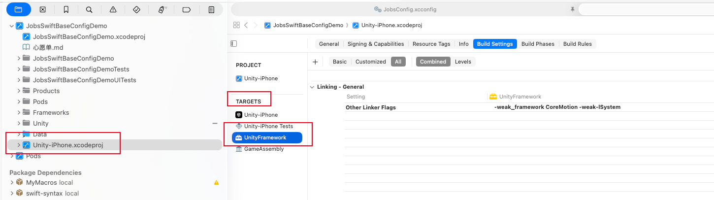

## 二、<font id=无差别导入>无差别导入</font>（适用于Unity侧提供的iOS包兼容iOS模拟器和实体设备）

### 1、**`选中主 App`** ➤ **`TARGETS`** ➤ **`General`** 

#### 1.1、<font id=如果是条件编译，那么这一步跳过>**`Frameworks, Libraries, and Embedded Content`**</font> ➤ <font color=red>**如果是条件编译，那么这一步跳过**</font>

- 点 `+` → 选择 `UnityFramework.framework`（在 `Unity-iPhone` → `Products` 下面）

- `Embed` 一栏改成 **Embed & Sign**

  <table style="width:100%; table-layout:fixed;">
  <!-- 大图单独一行 -->
  <tr>
    <td colspan="2" style="text-align:center;">
      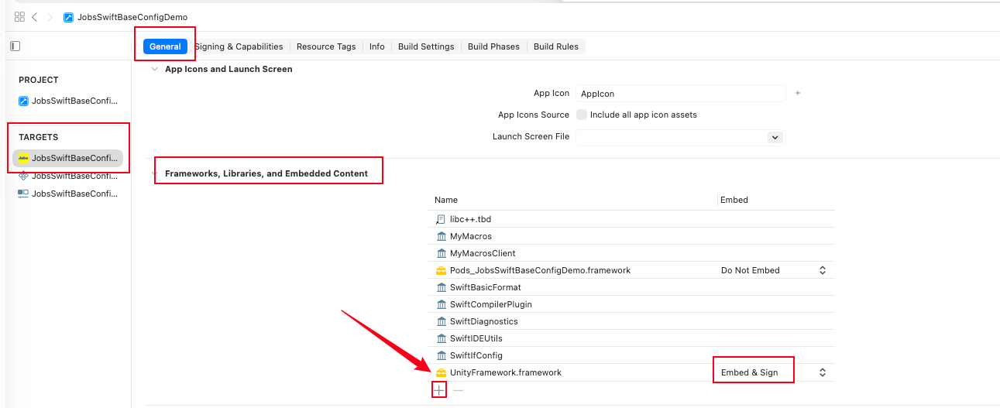
    </td>
  </tr>     
    <tr>
  <td style="text-align:center;">
    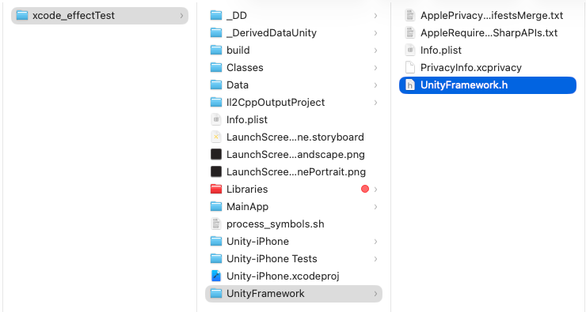
  </td>
  <td style="text-align:center;">
    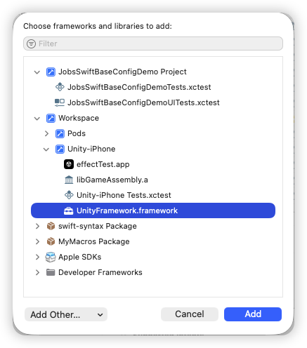
  </td>
  </tr>
    </table>

### 2、**`选中主 App`** ➤ **`TARGETS`** ➤ **`Build Settings`** ➤ 

#### 2.1、`Other Linker Flags` 里加：`-ObjC`

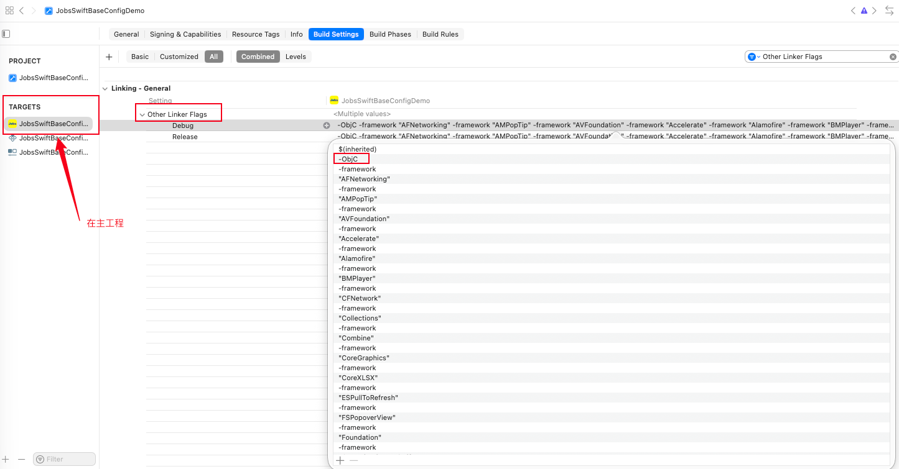

#### 2.2、 `Framework Search Paths` 里加：`"$(SRCROOT)/Unity"`

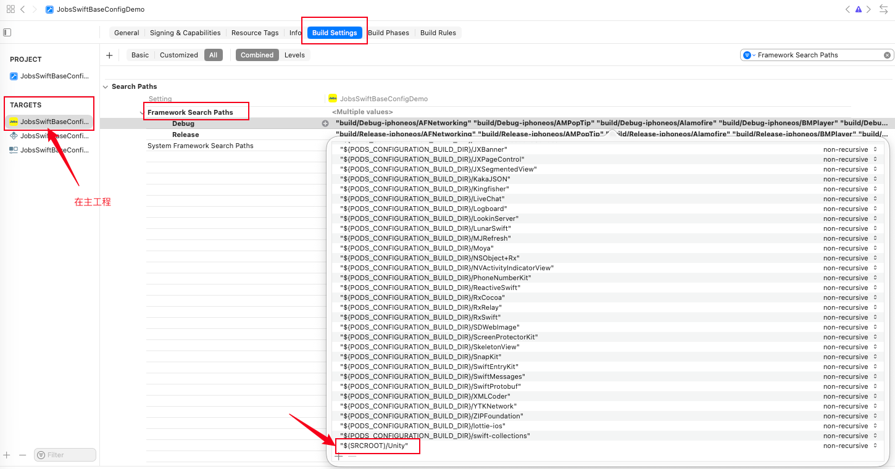

#### 2.3、 `Library Search Paths` 里加：

* `$(PROJECT_DIR)/Unity/xcode_effectTest/Il2CppOutputProject/IL2CPP/build/deploy_arm64`
* `$(PROJECT_DIR)/Unity/xcode_effectTest/Il2CppOutputProject/IL2CPP/build/deploy_x86_64`
* `$(PROJECT_DIR)/Unity/xcode_effectTest/Libraries`

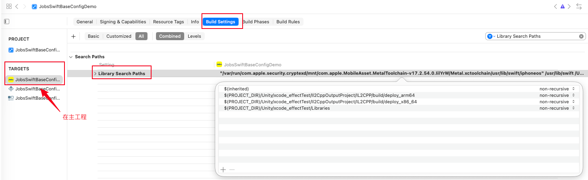

#### 2.4、`Header Search Paths` 里加：

- `"$(SRCROOT)/Unity/xcode_effectTest/Classes"`
  
- `"$(SRCROOT)/Unity/xcode_effectTest/Libraries"`

- `"$(SRCROOT)/Unity/xcode_effectTest"`

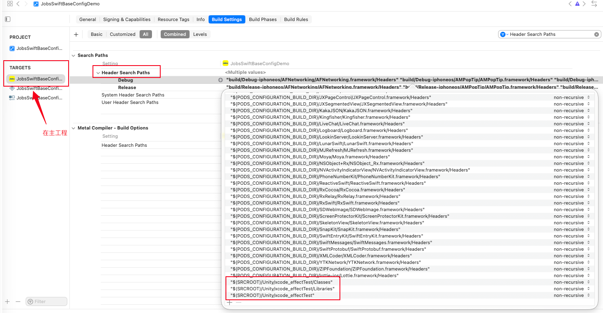

#### 2.5、`Runpath Search Paths` 里确保有：`@executable_path/Frameworks`

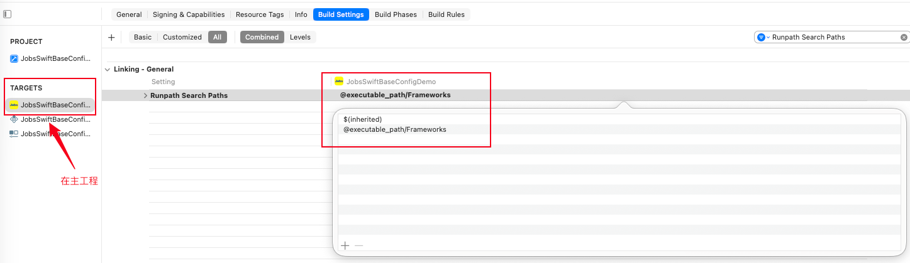


  * <font color=green id=桥接文件>**建立桥接文件**</font>，并写入：

    ```swift
    #import <TargetConditionals.h>
    #if !TARGET_OS_SIMULATOR && __has_include(<UnityFramework/UnityFramework.h>)
    // 只有真机（iPhone / iPad）才加入 Unity
    #import <UnityFramework/UnityFramework.h>
    #endif
    ```

* <font color=red size=5>将**Unity**资源以**Unity**希望的方式进包</font>

  * 将**Unity**工程下的<font size=4>`Data文件夹`</font>  **集成到主工程**

  * Unity官方要求 ➤ 打出的`*.app`这些资源应该是在**文件夹Data**下做统一管理
    
    ```
    JobsSwiftBaseConfigDemo.app/
        Data/                 ← 这个文件夹必须真的出现
            boot.config
            globalgamemanagers
            ...
    ```
    
  * 手动集成 ➤ **直接在Xcode新建蓝色文件夹可能会不灵**
    
    <table style="width:100%; table-layout:fixed;">
      <tr>
        <td style="text-align:center;">
          
        </td>
        <td style="text-align:center;">
          
        </td>
      </tr>
    </table>

## 三、<font id=条件编译 color=red>条件编译</font>（适用于Unity侧提供的iOS包只支持实体设备，而不兼容iOS模拟器）

* **原因是不同设备的CPU架构不一样，涉及到的底层的CPU指令集不同**
* 条件编译的操作只是在[**无差别导入**](#无差别导入)操作基础上进行一些细微的升级

### 1、[跳过 `Frameworks, Libraries, and Embedded Content`](#如果是条件编译，那么这一步跳过)

### 2、**`选中主 App`** ➤ **`TARGETS`** ➤ **`Build Phases`** 

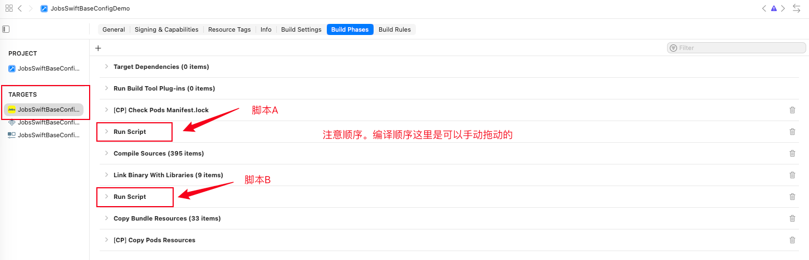

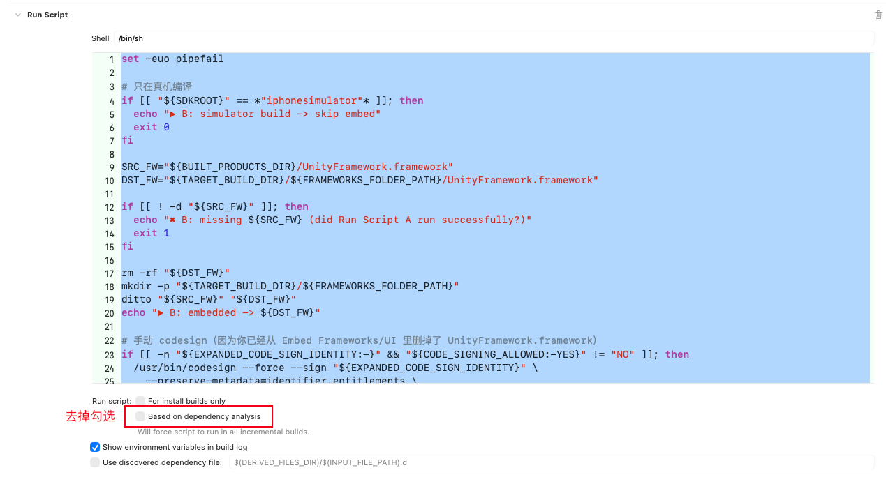

#### 2.1、脚本A ➤ 去掉勾选`Based on dependency analysis`

```shell
set -euo pipefail

# 只在真机执行
case "${SDKROOT}" in
  *iphonesimulator*)
    echo "▶︎ A: simulator build -> skip Unity build"
    exit 0
    ;;
esac

UNITY_PROJ="${SRCROOT}/Unity/xcode_effectTest/Unity-iPhone.xcodeproj"

# 主工程 Debug 时，让 Unity 用 Release（更稳；你也可以强制一直 Release）
UNITY_CONF="${CONFIGURATION}"
if [ "${UNITY_CONF}" = "Debug" ]; then
  UNITY_CONF="Release"
fi

DD_ROOT="${SRCROOT}/.DerivedDataUnity"
SYMROOT="${DD_ROOT}/Build/Products"
OBJROOT="${DD_ROOT}/Build/Intermediates"
mkdir -p "${SYMROOT}" "${OBJROOT}"

DEV_DIR="${DEVELOPER_DIR:-$(/usr/bin/xcode-select -p)}"

echo "▶︎ A: UNITY_PROJ = ${UNITY_PROJ}"
echo "▶︎ A: host CONFIGURATION = ${CONFIGURATION}"
echo "▶︎ A: Unity CONFIGURATION = ${UNITY_CONF}"
echo "▶︎ A: SYMROOT = ${SYMROOT}"
echo "▶︎ A: OBJROOT = ${OBJROOT}"
echo "▶︎ A: DEVELOPER_DIR = ${DEV_DIR}"

# 关键：不用 -derivedDataPath（否则会要求 -scheme）
# 同时用干净环境避免主工程 WRAPPER_NAME/PRODUCT_NAME 污染 Unity build
/usr/bin/env -i \
  PATH="${PATH}" \
  HOME="${HOME}" \
  USER="${USER}" \
  LANG="${LANG:-en_US.UTF-8}" \
  TMPDIR="${TMPDIR:-/tmp}" \
  DEVELOPER_DIR="${DEV_DIR}" \
  /usr/bin/xcodebuild \
    -project "${UNITY_PROJ}" \
    -target "UnityFramework" \
    -configuration "${UNITY_CONF}" \
    -sdk iphoneos \
    -destination "generic/platform=iOS" \
    CODE_SIGNING_ALLOWED=NO \
    CODE_SIGNING_REQUIRED=NO \
    CODE_SIGN_IDENTITY="" \
    ENABLE_DEBUG_DYLIB=NO \
    SYMROOT="${SYMROOT}" \
    OBJROOT="${OBJROOT}" \
    build

SRC_FW="${SYMROOT}/${UNITY_CONF}-iphoneos/UnityFramework.framework"
DST_FW="${BUILT_PRODUCTS_DIR}/UnityFramework.framework"

echo "▶︎ A: SRC_FW = ${SRC_FW}"
echo "▶︎ A: DST_FW = ${DST_FW}"

if [ ! -d "${SRC_FW}" ]; then
  echo "✖︎ A: UnityFramework.framework not produced: ${SRC_FW}"
  exit 1
fi

rm -rf "${DST_FW}"
/usr/bin/ditto "${SRC_FW}" "${DST_FW}"

echo "✅ A: staged UnityFramework.framework into BUILT_PRODUCTS_DIR"
```

#### 2.2、脚本B ➤ 去掉勾选`Based on dependency analysis`

```shell
set -euo pipefail

# 只在真机编译
if [[ "${SDKROOT}" == *"iphonesimulator"* ]]; then
  echo "▶︎ B: simulator build -> skip embed"
  exit 0
fi

SRC_FW="${BUILT_PRODUCTS_DIR}/UnityFramework.framework"
DST_FW="${TARGET_BUILD_DIR}/${FRAMEWORKS_FOLDER_PATH}/UnityFramework.framework"

if [[ ! -d "${SRC_FW}" ]]; then
  echo "✖︎ B: missing ${SRC_FW} (did Run Script A run successfully?)"
  exit 1
fi

rm -rf "${DST_FW}"
mkdir -p "${TARGET_BUILD_DIR}/${FRAMEWORKS_FOLDER_PATH}"
ditto "${SRC_FW}" "${DST_FW}"
echo "▶︎ B: embedded -> ${DST_FW}"

# 手动 codesign（因为你已经从 Embed Frameworks/UI 里删掉了 UnityFramework.framework）
if [[ -n "${EXPANDED_CODE_SIGN_IDENTITY:-}" && "${CODE_SIGNING_ALLOWED:-YES}" != "NO" ]]; then
  /usr/bin/codesign --force --sign "${EXPANDED_CODE_SIGN_IDENTITY}" \
    --preserve-metadata=identifier,entitlements \
    "${DST_FW}"
  echo "▶︎ B: codesigned"
else
  echo "▶︎ B: codesign skipped (no identity or signing not allowed)"
fi
```

### 3、<font id=xcconfig>配置 `*.xcconfig`</font>

#### 3.1、挂载`*.xcconfig`

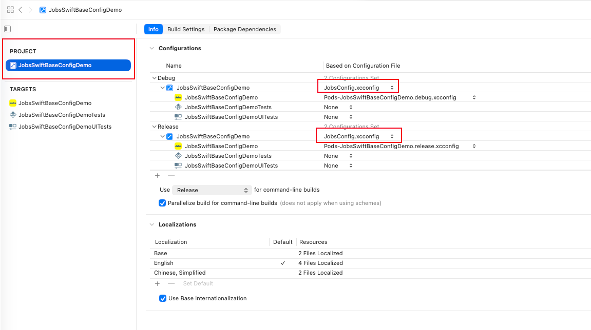

#### 3.2、`JobsConfig.xcconfig`

```shell
//
//  JobsConfig.xcconfig
//  JobsSwiftBaseConfigDemo
//
//  Created by Mac on 11/1/25.
//
//  Configuration settings file format documentation can be found at:
//  https://developer.apple.com/documentation/xcode/adding-a-build-configuration-file-to-your-project
//
//  此文件仅仅针对单一语言环境下的一些配置。
//  在多语言环境下，此文件的某些配置项，将会用各语言的 InfoPlist.strings 进行覆盖

PRODUCT_NAME = SwiftDemo
APP_DISPLAY_NAME = SwiftDemo
INFOPLIST_KEY_CFBundleDisplayName = $(APP_DISPLAY_NAME)
INFOPLIST_KEY_CFBundleName = $(PRODUCT_NAME)

// ================================== Unity iOS 真机专用：模拟器禁用 ==================================
// ObjC/C 宏：#if JOBS_UNITY_ENABLED ...
JOBS_UNITY_ENABLED[sdk=iphoneos*]        = 1
JOBS_UNITY_ENABLED[sdk=iphonesimulator*] = 0
GCC_PREPROCESSOR_DEFINITIONS = $(inherited) JOBS_UNITY_ENABLED=$(JOBS_UNITY_ENABLED)
// Swift 条件：#if JOBS_UNITY_ENABLED ...
SWIFT_ACTIVE_COMPILATION_CONDITIONS = $(inherited)
SWIFT_ACTIVE_COMPILATION_CONDITIONS[sdk=iphoneos*]        = $(inherited) JOBS_UNITY_ENABLED
SWIFT_ACTIVE_COMPILATION_CONDITIONS[sdk=iphonesimulator*] = $(inherited)
// ================================== Unity：只给真机的搜索路径 + 链接参数 ==================================
// 让 linker 在真机时能从 Run Script A 拷贝进来的 BUILT_PRODUCTS_DIR 找到 UnityFramework.framework
JOBS_UNITY_FRAMEWORK_SEARCH_PATHS[sdk=iphoneos*]        = $(inherited) $(BUILT_PRODUCTS_DIR) $(SRCROOT)/Unity
JOBS_UNITY_FRAMEWORK_SEARCH_PATHS[sdk=iphonesimulator*] =
FRAMEWORK_SEARCH_PATHS = $(inherited) $(JOBS_UNITY_FRAMEWORK_SEARCH_PATHS)
// 真机链接 UnityFramework，模拟器清空（不再去找 framework）
JOBS_UNITY_OTHER_LDFLAGS[sdk=iphoneos*]        = -framework UnityFramework
JOBS_UNITY_OTHER_LDFLAGS[sdk=iphonesimulator*] =
OTHER_LDFLAGS = $(inherited) $(JOBS_UNITY_OTHER_LDFLAGS)
// ================================== 其他：保持 inherited ==================================
// bridging header 已经做了条件 import，一般不需要额外 Header Search Paths / CFlags
HEADER_SEARCH_PATHS    = $(inherited)
OTHER_CFLAGS           = $(inherited)
```

## 四、经验交流

* Unity **2019.3** 之前没有 `UnityFramework` 这个玩法，要用老的 `main.mm` hack，比较操心，如果 Unity 很旧，建议升级，否则会非常折磨

* 所有的 Unity 文件（除了资源文件），不能挂在宿主 target

* 不要手动拆 Unity 的 `Data/` 目录，保持 Unity 导出的 Xcode 工程内部结构不变，只是当作子工程引用即可

* 如果你只需要一个 Unity 页面，最简单是直接 present 它；需要多次进出 Unity 时，记得做好状态管理（是否重复初始化、是否需要 unload）

* **嵌入 Unity，包体和首帧时间都会涨**。主工程那边要有心理预期，不要想着它跟一个普通原生页面一样轻量

* [<font size=4>**`*.UnityFramework`** </font>本身是 **Objc 动态库**，需要用 **Bridging Header** 把它桥接进来](#桥接文件)

* 需要iOS主工程项目需要支持iOS模拟器调试，则需要<font size=4>**`unity.app`**</font>单独构建 Simulator 版库，并在 Xcode 里做平台区分

  * **Swift**侧
    
    ```swift
    #if targetEnvironment(simulator) 
    /// 模拟器专用代码
    #else
    /// 真机（iPhone / iPad 设备）代码
    #endif
    ```
    
    ```swift
    #if os(iOS) && !targetEnvironment(simulator)
    // 只有 iOS 真机（iPhone / iPad）代码
    #endif
    
    #if !targetEnvironment(simulator)
    // 只有真机（iPhone / iPad）会编译到这里
    #endif
    ```
    
    ```swift
    #if targetEnvironment(simulator) 
    /// 模拟器专用代码
    #endif
    ```
    
  * **OC**侧
    
    ```objective-c
    #import <TargetConditionals.h>
    #if TARGET_OS_SIMULATOR
        // 模拟器专用代码
    #else
        // 真机（iPhone / iPad 设备）代码
    #endif
    ```
    
    ```objective-c
    #import <TargetConditionals.h>
    #if TARGET_OS_IOS && !TARGET_OS_SIMULATOR
        // 只有 iOS 真机（iPhone / iPad）代码
    #endif
    
    #if !TARGET_OS_SIMULATOR
        // 只有真机（iPhone / iPad）会编译到这里
    #endif
    ```
    
    ```objective-c
    #import <TargetConditionals.h>
    #if TARGET_OS_SIMULATOR
        // 模拟器专用代码
    #endif
    ```
    
    
