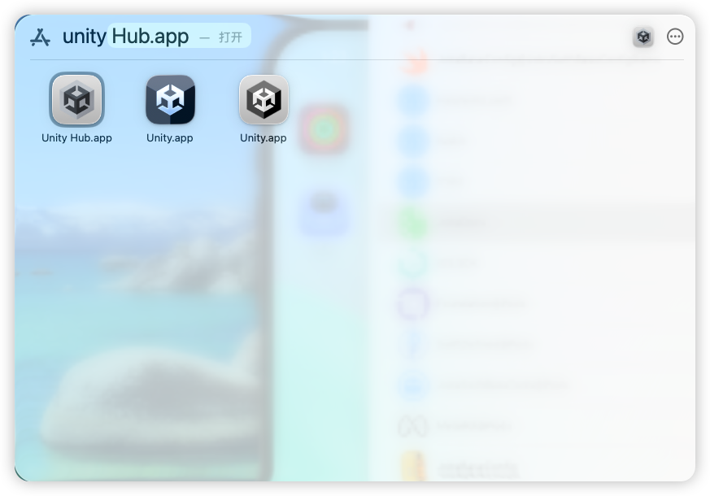
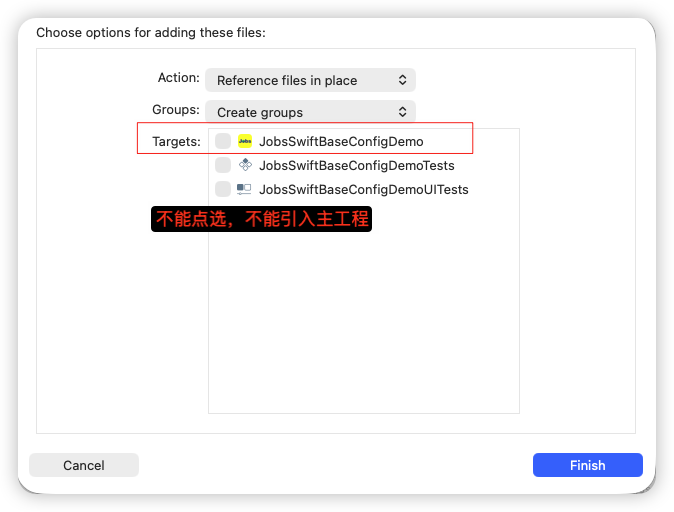
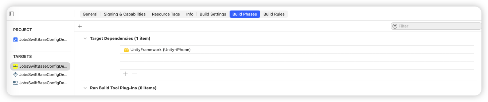
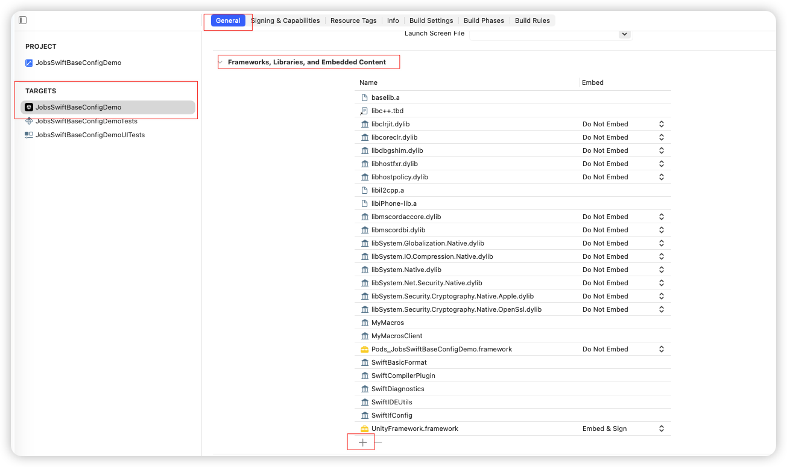
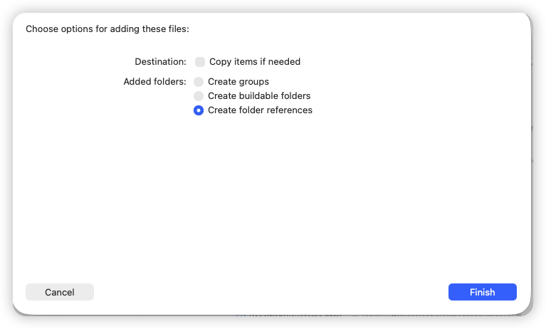
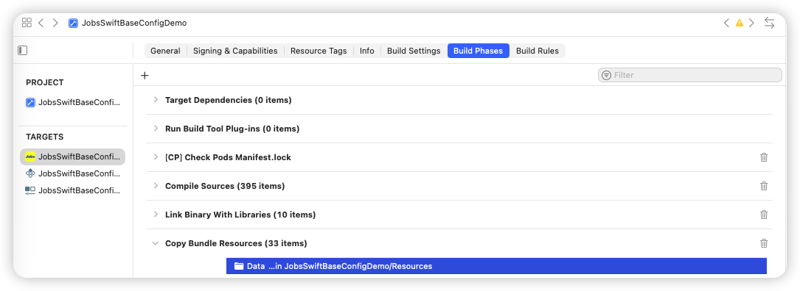

# iOS项目集成Unity

[toc]

## 一、前置条件

* 在**`unity.app`**里面导出关于iOS的工程项目（包含<font size=5>`UnityFramework.framwork`</font>） 

  

* 引入整个**Unity**生成的Xcode工程

  

* 在项目主工程中导入<font size=5>`UnityFramework.framwork`</font> 

  ```
  /Users/mac/Documents/Gits/JobsBaseConfig/JobsBaseConfig@JobsSwiftBaseConfigDemo
  └── Unity
      └── xcode_effectTest
          └── UnityFramework
              └── UnityFramework.h   ✅ 就在这
  ```
  
  <table style="width:100%; table-layout:fixed;">
      <!-- 新增：第一行，只有 Unity 这张，大图单独一行 -->
      <tr>
        <td colspan="2" style="text-align:center;">
          
        </td>
      </tr>     
        <tr>
      <td style="text-align:center;">
        
      </td>
      <td style="text-align:center;">
        
      </td>
    </tr>
    </table>
  
  * 在左侧点开 `Unity-iPhone` 子工程  ➤ **`TARGETS`**，确认里面有一个叫 **`UnityFramework`** 的 target（Unity 新版会有）
  
  * 选中主 App **`TARGETS`** ➤ **General** ➤ **Frameworks, Libraries, and Embedded Content**
    - 点 `+` → 选择 `UnityFramework.framework`（在 `Unity-iPhone` → `Products` 下面）
    - `Embed` 一栏改成 **Embed & Sign**
    
  * 选中主 App **`TARGETS`** ➤ **`Build Settings`** 
    - `Other Linker Flags` 里加上：`-ObjC`
    
    - `Framework Search Paths` / `Library Search Paths` 里加：`"$(SRCROOT)/Unity"`
    
    - `Header Search Paths` 里加：
    
      - ```
        "$(SRCROOT)/Unity/xcode_effectTest/Classes"
        ```
    
      - ```
        "$(SRCROOT)/Unity/xcode_effectTest/Libraries"
        ```
    
      - ```
        "$(SRCROOT)/Unity/xcode_effectTest"
        ```
    
    - `Runpath Search Paths` 里确保有：`@executable_path/Frameworks`
    
  * 建立桥接文件，写入：
    
    ```swift
    #import <UnityFramework/UnityFramework.h>
    ```
  
* <font color=red size=5>将**Unity**资源以**Unity**希望的方式进包</font>

  * 将**Unity**工程下的<font size=4>`Data文件夹`</font>  **集成到主工程**
  
  * Unity官方要求 ➤ 打出的`*.app`这些资源应该是在**文件夹Data**下做统一管理
    
    ```
    JobsSwiftBaseConfigDemo.app/
        Data/                 ← 这个文件夹必须真的出现
            boot.config
            globalgamemanagers
            ...
    ```
    
  * 手动集成 ➤ **直接在Xcode新建蓝色文件夹可能会不灵**
    
    <table style="width:100%; table-layout:fixed;">
      <tr>
        <td style="text-align:center;">
          
        </td>
        <td style="text-align:center;">
          
        </td>
      </tr>
    </table>

## 二、经验交流

* Unity **2019.3** 之前没有 `UnityFramework` 这个玩法，要用老的 `main.mm` hack，比较操心，如果 Unity 很旧，建议升级，否则会非常折磨

* 所有的 Unity 文件（除了资源文件），不能挂在宿主 target

* 不要手动拆 Unity 的 `Data/` 目录，保持 Unity 导出的 Xcode 工程内部结构不变，只是当作子工程引用即可

* 如果你只需要一个 Unity 页面，最简单是直接 present 它；需要多次进出 Unity 时，记得做好状态管理（是否重复初始化、是否需要 unload）

* **嵌入 Unity，包体和首帧时间都会涨**。主工程那边要有心理预期，不要想着它跟一个普通原生页面一样轻量

* <font size=5>**`*.UnityFramework`** </font>本身是 **Objective-C 动态库**，需要用 **Bridging Header** 把它桥接进来
