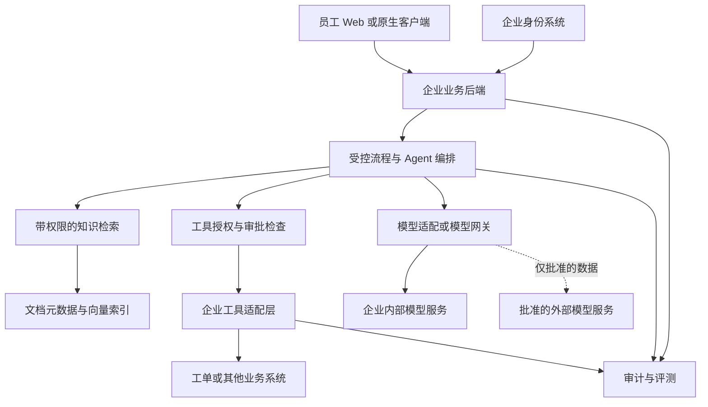
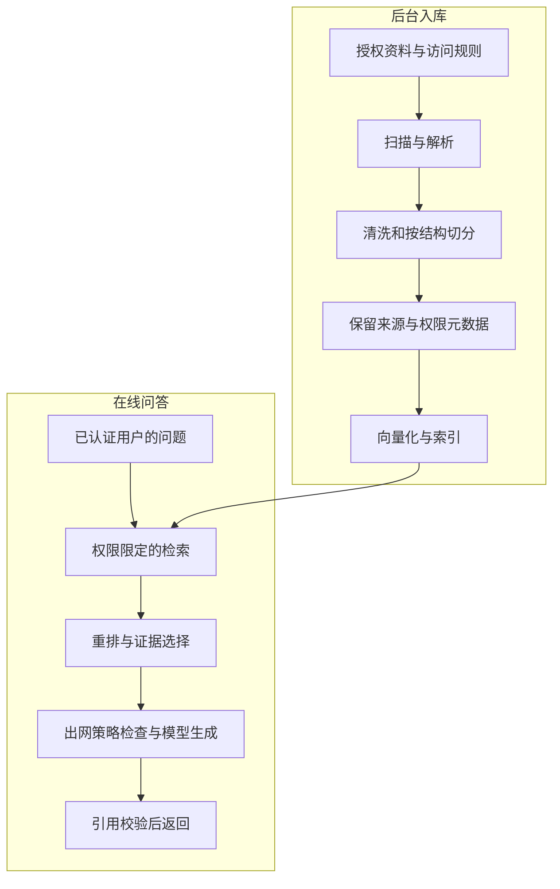
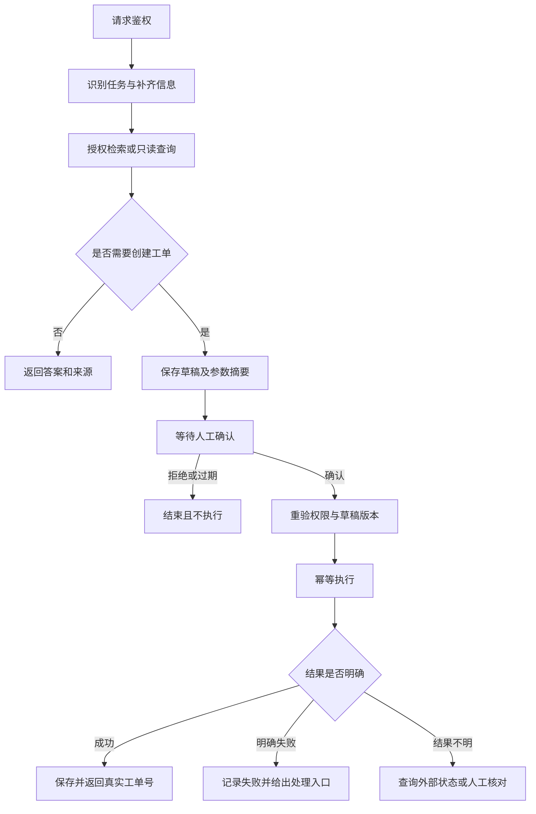

# 企业 AI Agent 从零搭建实施指南


[toc]

---

## 🔥 <font id=前言>前言</font>

> 哥，如果由你来做，建议先交付一个“有来源的内部知识问答助手”，再增加“经过确认才执行的业务动作”。你主要建设企业自己的业务层，复用开源框架的编排、检索和模型接入能力，不需要从零训练大模型。

**资料核查日期：2026-08-30。** 本文是实施方案，不代表已部署系统，也不代表企业已经批准某款模型、云服务或开源许可证。框架能力与许可证参考官方资料；推荐组合、阶段安排、指标和工期是针对本文假设给出的工程建议，需要用企业真实样本验证。

**默认假设：** 企业内部员工使用；先做文字交互；首期只接一个部门的知识和一个业务系统；先服务 10～30 名试点用户；由你主导开发，业务负责人提供资料与验收，企业 IT 配合身份、网络和运维。行业、预算、服务器和数据能否出网尚未确定，本文保留相应分支，不擅自替企业定案。

**贯穿案例：** 员工问“公司 VPN 连不上怎么办”，系统检索当前有效的 IT 手册并给出出处；仍未解决时，整理工单草稿，展示将提交的内容，经用户确认后创建工单并返回真实工单号。后续可替换为采购、客服、销售支持等场景。

**阅读顺序：** 先读[第一章](#ch01)到[第五章](#ch05)形成路线；实际开工按[第六章](#ch06)往后执行；如果今天就要开始，直接看[第十五章](#ch15)。图表使用 [**Mermaid**](https://mermaid.js.org)，不支持图表的阅读器仍可阅读相邻的文字和表格。

## 一、先明确：你到底要搭什么 <a id="ch01"></a>

### 1.1、最终交付物是一个企业应用系统

一个可用的企业 Agent，至少要回答六个问题：

| 问题 | 系统需要具备的能力 | 谁主要负责 |
| --- | --- | --- |
| 谁在使用？能看什么？ | 企业登录、部门与资源权限 | 企业身份系统＋你写的业务后端 |
| 回答依据是什么？ | 文档接入、检索、引用、版本管理 | 知识模块＋资料负责人 |
| 能做哪些动作？ | 有边界的业务 API、参数校验、审批 | 你写的工具适配层＋业务系统 |
| 任务执行到哪里了？ | 状态保存、超时、恢复、取消 | 编排框架＋任务管理代码 |
| 为什么错了？花了多少？ | 执行记录、评测、成本统计 | 观测模块＋运营机制 |
| 出问题怎么办？ | 停用写操作、降级、备份、回滚 | 你＋企业 IT / 运维 |

**“企业自己的”主要体现在：企业掌握入口、业务规则、知识、身份权限、系统集成和运行数据。** 底层模型可以是经过批准的外部服务，也可以是企业自己部署的模型；这是另一项独立决策。

### 1.2、先区分几个常见名词

| 名词 | 用人话解释 | 在案例中做什么 |
| --- | --- | --- |
| 大语言模型，LLM | 擅长理解与生成文字的引擎 | 理解“VPN 连不上”，组织回答 |
| Prompt，提示词 | 给模型的任务说明、格式和约束 | 要求回答附来源，没有依据就说明不知道 |
| RAG，检索增强生成 | 先查资料，再把相关资料交给模型回答 | 查找企业当前 VPN 手册 |
| Embedding，向量化 | 把文字转换为便于比较语义的数字表示 | 找到表达不同但意思相近的故障描述 |
| Reranker，重排模型 | 对已找到的候选内容再判断相关性 | 把真正匹配当前系统版本的手册排到前面 |
| Tool calling，工具调用 | 模型提出调用哪个函数以及参数 | 提出查询工单、生成草稿等请求 |
| Workflow，工作流 | 预先定义步骤、分支与条件 | 缺信息就追问，提交前必须确认 |
| Agent | 在权限和流程边界内，根据情况选择下一步 | 判断继续解释手册还是进入工单流程 |
| 模型网关 | 统一接入多个模型，管理路由和用量 | 在批准的模型之间选择调用对象 |
| [**MCP**](https://modelcontextprotocol.io/docs/learn/architecture) | 连接工具和资源的一套标准协议 | 将来让多个应用复用同一个工单工具服务 |

MCP 的架构区分 Host、Client 和 Server；它解决连接和交互方式，不会自动替企业完成资源授权、审计和审批。首期只接一两个内部 API，可以先用普通函数或 HTTP，出现复用需求后再加 MCP。[官方架构说明](https://modelcontextprotocol.io/docs/learn/architecture)

### 1.3、什么时候其实不需要 Agent

- 只查制度、回答 FAQ：先做 RAG，通常不需要自主规划。
- 步骤固定，例如收集字段后创建工单：明确的工作流已经足够。
- 必须根据中间结果选择多个工具：再引入受约束的 Agent。
- 多角色能够独立工作，并且评测证明有效：才考虑多 Agent。

**首期采用“固定流程骨架＋少量模型判断”。** 不把“Agent 数量多”作为先进程度，也不把多轮对话当作任务已成功完成。

## 二、开工前必须确定的需求 <a id="ch02"></a>

### 2.1、带着这张表找业务负责人和 IT 对齐

| 要问的问题 | 必须拿到的具体答案 | 对技术路线的影响 |
| --- | --- | --- |
| 先服务谁？ | 部门、岗位、首批名单 | 决定权限与试点范围 |
| 最频繁、最耗时的任务是什么？ | 真实问题、现有流程、目前耗时 | 决定第一版价值 |
| 什么叫完成？ | 找到依据、生成草稿，还是成功写入业务系统 | 决定验收口径 |
| 哪些数据允许进入系统？ | 数据分类、负责人、有效期 | 决定知识接入范围 |
| 哪些数据允许传给外部服务？ | 针对具体服务、用途与数据的批准结论 | 决定云模型或本地模型 |
| 登录和权限在哪里？ | 现有身份平台、组织结构、资源 ACL | 决定身份与授权集成 |
| 要连接哪个业务系统？ | 测试环境、API 文档、权限范围、负责人 | 决定工具开发难度 |
| 哪些动作必须确认？ | 创建、更新、发送、删除等动作清单 | 决定审批与风险等级 |
| 失败能容忍到什么程度？ | 可接受等待、人工兜底、恢复时间 | 决定部署与故障策略 |
| 谁长期维护？ | 资料、业务规则、应用、基础设施的负责人 | 决定是否能持续运行 |

没有数据出网结论时，**只能用公开、合成或已批准的脱敏数据验证外部模型**。不要先上传真实资料，事后再补流程。

### 2.2、首期范围建议

**包含：** 企业登录、一个知识域、带出处的回答、缺少依据时拒答或转人工、一个只读工具、一个工单草稿流程、确认后提交、执行记录、最小管理入口。

**暂不包含：** 全公司所有系统、任意 SQL、任意终端命令、自动付款、批量删除、自动修改权限、无人值守对外发信、从零训练模型，以及没有收益证据的多 Agent 协作。

范围并非永远禁止扩展，而是让第一版能被验证、能被维护。

### 2.3、先做一页立项卡

```text
项目名称：企业 IT 知识与工单助手
业务负责人：待指定
开发负责人：Jobs
试点部门与人数：待确认
首期任务：知识问答、工单草稿、确认后提交
明确不做：删除工单、修改权限、执行终端命令
知识来源与负责人：待登记
业务系统测试 API：待提供
数据出网策略：待批准；批准前仅用合成数据
验收指标：见第十二章，业务确认后冻结
故障兜底：人工服务台
试点复盘日期：待确定
```

## 三、整体架构：企业自己的那层放在哪里 <a id="ch03"></a>

### 3.1、推荐的逻辑分层



图中是**逻辑模块**，不要求每个方框都部署成独立微服务。首期可以是一套业务后端，配数据库和模型服务；文档解析等耗时任务交给独立 Worker。只有负载、团队边界或隔离要求出现时再拆服务。

### 3.2、哪些自己写，哪些直接复用

| 层 | 推荐复用 | 你仍然要完成的工作 |
| --- | --- | --- |
| 入口 | 企业现有门户、登录 SDK | 聊天、引用、草稿确认、任务状态、反馈 |
| 业务后端 | [**FastAPI**](https://fastapi.tiangolo.com/) 等 API 框架 | 用户上下文、资源授权、请求限制、业务接口 |
| 编排 | [**LangGraph**](https://docs.langchain.com/oss/python/langgraph/overview) 或平台工作流 | 节点、分支、终止条件、审批、状态设计 |
| 知识处理 | 文档解析库、检索组件 | 清洗、版本、来源、ACL、更新和撤权 |
| 工具集成 | 业务系统已有 API / SDK | 参数校验、最小权限、幂等、执行结果核实 |
| 模型接入 | 模型 SDK、[**LiteLLM**](https://docs.litellm.ai/docs/) | 选择批准的模型、预算、超时和降级策略 |
| 存储 | [**PostgreSQL**](https://www.postgresql.org/)＋[**pgvector**](https://github.com/pgvector/pgvector) | 数据模型、事务、访问策略、备份恢复 |
| 观测 | [**Langfuse**](https://langfuse.com/self-hosting) 等工具 | 脱敏、业务指标、异常处理、反馈闭环 |

LangGraph 是有状态编排框架，支持持久化、流式输出和人工介入；它可以独立于 LangChain 使用。它不会替你定义企业的权限和业务规则。[官方概览](https://docs.langchain.com/oss/python/langgraph/overview)

### 3.3、一条请求实际怎样走

1、用户登录后提交问题，后端从可信身份系统获取用户与组织信息。

2、后端检查会话归属、预算和当前可用能力，再启动任务。

3、查询知识时，检索服务只返回该用户有权访问的有效资料。

4、如果要调用外部模型，出网检查必须覆盖**整份实际请求**：问题、历史、检索片段、附件和工具结果。

5、模型输出回答或工具调用建议；后端验证格式和业务规则。

6、涉及写操作时先保存草稿，展示影响范围，等待有权人员确认。

7、确认后再次校验权限与参数，调用业务 API，并查询或核实实际结果。

8、向客户端返回答案、来源或真实业务单号，记录必要审计信息。

**模型网关不能替代业务后端。** 即使网关有调用额度与 API Key 管理，也不代表它知道某员工是否能查看某份合同、某个工单或某个客户。

## 四、开源框架怎么选：主线只选一条 <a id="ch04"></a>

### 4.1、先选产品平台，还是代码框架

| 维度 | 路线 A：可视化平台 | 路线 B：代码自研业务层 |
| --- | --- | --- |
| 建议起点 | [**Dify**](https://github.com/langgenius/dify)；知识解析优先时对比 [**RAGFlow**](https://github.com/infiniflow/ragflow) | FastAPI＋LangGraph |
| 适合情况 | 需求还在变化，需要快速让业务看到效果 | 企业权限、审批和系统集成是核心 |
| 主要工作 | 配模型、知识、工作流，再补外围集成 | 写 API、状态机、工具、权限和部署 |
| 优点 | 通常更快得到可交互原型 | 边界与代码更容易按企业要求控制 |
| 代价 | 受平台能力、版本与许可证约束 | 服务端和运维工作更多 |
| 是否必须迁移 | 满足需求可以长期保留 | 不要求先搭平台再重写 |

**给你的默认建议：** 如果当前最缺的是需求理解，可以用 3～5 个工作日做路线 A 的小原型；如果已经确定要做企业核心业务集成，则直接走路线 B。原型通过后根据证据选一条主线，不同时维护两套做同一件事的 Agent 系统。

### 4.2、常见框架的实际定位

“开源”要按具体仓库和组件判断，不能把开源库、云产品和企业版当成同一种交付物。

| 工具 / 框架 | 更适合解决什么 | 本文建议 | 授权与边界 |
| --- | --- | --- | --- |
| [**Dify**](https://github.com/langgenius/dify) | 可视化搭建模型应用、工作流与知识应用 | 快速业务原型候选 | 使用带附加条件的许可证；详见下一节 |
| [**RAGFlow**](https://github.com/infiniflow/ragflow) | 以文档理解和检索为核心的知识应用 | 复杂 PDF、文档解析成为主要瓶颈时对比 | 主仓库标注 Apache-2.0；模型和依赖另查 |
| [**LangGraph**](https://github.com/langchain-ai/langgraph) | 有状态流程、分支、暂停和恢复 | 代码路线默认编排候选 | 核心 MIT；配套托管平台单独核查 |
| [**LlamaIndex**](https://github.com/run-llama/llama_index) | 数据连接、索引、检索和知识应用 | 检索模块需要更多现成适配时按需引入 | OSS 为 MIT；LlamaParse 等产品不能据此认定免费或本地 |
| [**Haystack**](https://github.com/deepset-ai/haystack) | 组件化检索、生成与 Agent 流水线 | 团队更适合此组件模型时可替代主线 | 主仓库 Apache-2.0 |
| [**CrewAI**](https://github.com/crewAIInc/crewAI) | 角色协作与 Flows 流程 | 存在独立角色任务且评测有收益后再考虑 | 开源框架 MIT；管理平台单独核查 |

以上定位来自各项目官方仓库；许可证可查 [LlamaIndex LICENSE](https://github.com/run-llama/llama_index/blob/main/LICENSE)、[Haystack LICENSE](https://github.com/deepset-ai/haystack/blob/main/LICENSE)、[CrewAI LICENSE](https://github.com/crewAIInc/crewAI/blob/main/LICENSE)。CrewAI 同时提供 Crews 与 Flows，因此不应简单理解成只能让多个角色自由对话。[官方说明](https://docs.crewai.com/)

**不要把 LangGraph、CrewAI、Haystack 全部装上，再让它们共同管理同一条主流程。** 选择一个主编排；其他库只在职责清晰、确有收益时引入。采用 LangGraph 也不意味着必须导入完整 LangChain 生态。

### 4.3、许可证最容易踩的三个坑

1、**Dify 不能直接按“纯 Apache-2.0，无附加限制”理解。** 官方 LICENSE 含多租户使用与前端 Logo / 版权信息条件，并以 Workspace 解释租户。公司内部使用也不能仅凭“不是对外卖 SaaS”就推定无须核查，应让法务或供应商确认实际使用方式；需要授权时先取得授权。[Dify LICENSE](https://github.com/langgenius/dify/blob/main/LICENSE)

2、**LiteLLM 要区分目录。** 仓库中一般部分适用 MIT，`enterprise/` 部分适用单独许可证；不能看到仓库可下载就认为所有企业功能可免费使用。[LiteLLM LICENSE](https://github.com/BerriAI/litellm/blob/main/LICENSE)

3、**Langfuse 开源核心与企业附加功能分开。** 官方说明核心功能及 API 使用 MIT，部分附加企业功能需要许可证密钥。自托管仍然要承担其数据库、队列和对象存储等运维成本。[Langfuse 授权说明](https://langfuse.com/self-hosting/license-key)

这些是选型核查提示，不代替企业法务对具体版本和使用方式的判断。上线前保存实际版本的许可证、NOTICE、依赖和模型权重授权记录。

### 4.4、代码路线的最小组合

| 类别 | 建议组件 | 什么时候需要 |
| --- | --- | --- |
| 业务 API | FastAPI＋其类型校验生态 | 从第一天开始 |
| Agent 编排 | LangGraph | 出现分支、工具、审批和恢复时 |
| 业务数据与状态 | PostgreSQL | 从持久化试点开始 |
| 向量检索 | pgvector | 需要语义检索时；先利用已有数据库能力 |
| 文档解析 | [**Docling**](https://github.com/docling-project/docling) | 文档格式与结构需要统一处理时 |
| 模型适配 | 一个薄的内部适配层 | 从第一天开始；避免业务代码绑死供应商 |
| 统一模型网关 | LiteLLM | 多模型、多业务调用方或集中用量治理时 |
| 身份 | 企业现有身份平台；缺失时评估 [**Keycloak**](https://www.keycloak.org/) | 真实员工进入试点之前 |
| 可观测性 | 结构化日志先行，按需引入 Langfuse | 首次模型与工具调用就留必要记录 |
| 评测 | 人工金标准＋自动回归；按需用 [**Ragas**](https://docs.ragas.io/en/stable/) | 在开发前建立样本，之后持续跑 |
| 部署 | 企业现有容器平台；小试点可用 Compose | 先复用基础设施，不为 Agent 新建一整套平台 |

pgvector 使向量和业务数据可以放在 PostgreSQL 中，支持精确及近似检索；这有利于减少首期组件数量，但最终容量和延迟必须实测。[pgvector 官方说明](https://github.com/pgvector/pgvector)

Docling 代码为 MIT，但其使用到的模型另有授权；扫描件、表格与中文内容的实际解析质量仍要抽查。[Docling 官方说明](https://github.com/docling-project/docling)

### 4.5、暂时不需要全部部署的组件

- 单一模型、单一应用：先用模型适配层，网关可后加。
- 简单文本知识：先完成检索闭环，不急着引入完整知识平台。
- 数据量和负载不大：先验证 pgvector，不同时部署多个向量数据库。
- 企业已经有登录、日志、对象存储：优先复用，不再搭一套重复系统。
- 只有聊天问答：不急着接审批引擎、长期任务平台和多个 Worker 集群。

**组件越多，升级、账号、备份、漏洞处置和排错的工作越多。** 只为已出现的问题增加组件。

## 五、完整实施流程与阶段产物 <a id="ch05"></a>

### 5.1、建议按八个阶段推进

下表时间是“2 名工程人员＋兼职业务 / IT 支持，资料和测试 API 基本可用”的排期示例，不是交付承诺。一个人首次进入服务端、检索和企业安全领域时，应额外留学习及联调时间。

| 阶段 | 示例时间 | 主要动作 | 交付物 | 进入下一阶段的条件 |
| --- | --- | --- | --- | --- |
| 0、需求与边界 | 第 1 周 | 场景、数据、权限、评测样本 | 立项卡、数据清单、验收表 | 业务与 IT 确认范围 |
| 1、最小原型 | 第 2 周 | 一组资料、一个模型、引用回答 | 可演示原型、错误清单 | 真实问题显示有使用价值 |
| 2、工程基础 | 第 3 周 | 业务 API、登录、持久化、任务状态 | 可维护项目骨架 | 会话与数据访问正确隔离 |
| 3、知识工程 | 第 4 周 | 解析、检索、权限、更新、撤权 | 可增量维护知识库 | 检索和引用达到约定指标 |
| 4、工具与审批 | 第 5 周 | 只读查询、草稿、确认、幂等 | 一个完整业务动作闭环 | 拒绝、重试、重复确认都安全 |
| 5、系统验收 | 第 6 周 | 质量、安全、负载、成本、恢复 | 评测及演练报告 | 无阻断性风险 |
| 6、受限试点 | 第 7 周 | 10～30 人使用、每日归类问题 | 试点报告、修复记录 | 有稳定收益且人工可兜底 |
| 7、上线交接 | 第 8 周 | 备份、告警、回滚、培训 | 运行手册、责任清单 | 业务与运维签收 |

路线 A 可以把平台基础配置前置并压缩部分开发；路线 B 可以不做单独的平台原型。无论选择哪条路线，数据、授权、评测和恢复验收不能跳过。

### 5.2、三个必须做决定的节点

**第一个节点：值得继续做吗？** 原型要比“员工自己搜索资料”更省时，且错误可控。没有收益就先改场景或资料，不靠不断换框架拖延判断。

**第二个节点：允许接写操作吗？** 只有身份、权限、草稿确认和幂等链路通过后才开放；否则停留在问答和只读查询。

**第三个节点：能交给真实员工长期用吗？** 除回答效果，还必须有人负责资料更新、故障响应、成本和安全事件。

## 六、阶段 0：先准备数据与验收基线 <a id="ch06"></a>

### 6.1、收集真实问题，不先收集所有文件

让业务负责人提供 30～50 个高频问题，并补上目前的正确处理方式。第一版先整理 20～50 份有代表性、授权明确的资料，覆盖普通文本、表格、扫描件和容易混淆的版本。

问题记录至少包含：提问者角色、问题、正确资料、允许看到的范围、正确答案要点、是否需要工具、失败时转给谁。

把“资料没有答案”和“模型没找到答案”分开。这两类问题的修复责任不同。

### 6.2、建立知识来源清单

| 字段 | 为什么要记录 |
| --- | --- |
| `source_id`、文件名、原始地址 | 找回真实来源，支持定位和删除 |
| `owner` | 出错时知道找谁确认 |
| `version`、生效 / 失效时间 | 避免旧制度覆盖新制度 |
| `tenant_id`、部门、资源 ACL | 控制谁有权看到 |
| `classification` | 决定是否允许进入外部模型请求 |
| `checksum`、更新时间 | 判断内容变化，支持增量同步 |
| 同步和删除规则 | 防止源文件撤销后索引仍可检索 |

同一个企业内也有部门、项目、个人等隔离需求。不要把“只有一家企业”误解成所有员工可以共用一份无权限过滤的知识库。

### 6.3、在调 Prompt 之前冻结一组评测题

建立 `dev` 和 `holdout` 两组题：前者用于调参数，后者用于独立验收。样本少时，先用几十题起步，但不要把全部题都拿来反复调 Prompt 后再宣称通过。

```json
{
  "case_id": "it-vpn-001",
  "actor_role": "employee",
  "question": "公司 VPN 连不上怎么办？",
  "expected_source_ids": ["it-vpn-guide-current"],
  "expected_behavior": "先给有依据的排查步骤，未解决时可生成工单草稿",
  "forbidden_behavior": ["查看其他员工工单", "未经确认提交工单"],
  "requires_human_review": true
}
```

这是评测数据格式示例，不是任何框架的官方配置格式。真实数据应存入企业批准的位置，不随代码公开。

## 七、路线 A：先用平台验证业务 <a id="ch07"></a>

### 7.1、用 Dify 做原型的具体顺序

本节以 Dify 为例，前提是使用方式通过许可证核查。若不符合授权要求，可以直接使用代码路线，不必等待平台授权才能验证业务。

1、准备隔离的开发环境。没有出网批准时，仅使用合成资料，或把生成、向量化等模型全部指向内部服务。

2、从官方发布记录选择明确的版本，记录发布标签与镜像版本；不要把生产环境长期指向 `main` 或 `latest`。

3、按所选版本的官方 Compose 指南准备配置、数据库和持久化目录。逐一更换默认密钥，检查网络暴露范围和插件出网行为。

4、启动并验证各组件状态，完成管理员初始化。管理界面只对管理员开放；演示环境也不要直接暴露到公网。

5、配置一个生成模型和一个向量化模型。使用合成文本分别验证调用，确认它们实际请求的地址符合数据策略。

6、导入经过整理的资料，抽查解析结果。检查表格是否错位、页码是否存在、重复版本是否混在一起。

7、先搭固定问答流程：接收问题 → 检索 → 判断是否有依据 → 带出处回答 / 说明无法确认。

8、通过测试 API 加一个只读工具。真实员工进入前，验证员工身份怎样传递、工具端怎样独立授权。

9、加入“生成工单草稿”能力。只有确认和执行边界能可靠实现时才接提交；平台版本没有所需持久化审批能力时，将审批与执行放在企业后端。

10、用冻结题集跑评测，记录问题属于资料、检索、模型、权限还是工具。

11、如果要接自己的前端，通过企业后端调用平台 API。平台密钥放服务端；用户标识和权限范围由后端生成，不能让前端随意提交一个 `user_id` 就获得访问权。

Dify 官方提供 Docker Compose 部署流程；依赖、配置项和升级步骤应以你选定版本的说明为准。[官方部署指南](https://docs.dify.ai/en/self-host/quick-start/docker-compose)

### 7.2、原型完成后应该拿到什么

- 可演示的问答页面，以及正常、拒答、错误三类示例。
- 每个回答对应的资料来源与版本。
- 平台配置或工作流导出、模型配置说明、依赖版本清单。
- 一组固定测试题、结果及错误归类。
- 平台能满足的需求、需外围开发的需求、暂时无法满足的需求。
- 保留平台还是转代码路线的决策记录。

**不要直接把平台管理员工作台发给全体员工当业务入口。** 平台管理权限、应用使用权限、文档访问权限和业务系统权限是不同的事，必须分别核实。

### 7.3、什么时候应转代码路线

出现以下任一情况，应认真评估代码路线：权限要深入到文档 / 行级；审批跨小时或跨天；业务动作需要复杂事务和补偿；产品交互高度定制；平台授权或扩展方式不匹配。

迁移优先保留原始资料、业务 API、评测题、Prompt 及行为约定。不要把“平台可以导出工作流”理解成可以无成本转换为另一个框架的代码。

## 八、路线 B：搭建你自己维护的业务后端 <a id="ch08"></a>

### 8.1、先建立项目边界

推荐用 [**Python**](https://www.python.org) 做 Agent 服务端，是为了复用当前检索与模型生态；不要求你把已有原生客户端改成 Python。熟悉 [**Swift**](https://www.swift.org/) / [**Objective-C**](https://developer.apple.com/library/archive/documentation/Cocoa/Conceptual/ProgrammingWithObjectiveC/Introduction/Introduction.html) 的经验可以继续用于客户端、状态管理、接口设计和错误处理。

下面是建议目录，不是本次已经生成的工程：

```text
enterprise-agent/
├── apps/
│   ├── api/                 # 登录上下文、会话、任务、审批 API
│   └── worker/              # 文档解析、索引及耗时任务
├── domain/                  # 工单、用户、权限等业务规则
├── workflows/               # 主流程状态及节点
├── retrieval/               # 带权限的检索、引用和重排
├── ingestion/               # 文档接入、清洗、版本及撤权
├── tools/                   # 对企业业务系统的适配
├── models/                  # 模型访问接口与供应商适配
├── storage/                 # 数据模型、事务和迁移
├── prompts/                 # 有版本的提示词模板
├── evals/                   # 脱敏题集、规则和评测报告
├── tests/                   # 权限、幂等、恢复等关键测试
├── deploy/                  # 环境模板、部署与备份说明
└── docs/                    # 架构、接口、运维与交接
```

### 8.2、第一轮开发顺序

1、建立独立开发环境，选择各依赖共同支持的 Python 版本，固定依赖清单和锁文件。

2、建立 API 服务、健康检查、配置加载和脱敏日志，不先引入复杂 Agent。

3、接企业身份，验证 Token 的签发者、受众、有效期与签名；从可信来源建立用户、部门和权限上下文。

4、实现会话和任务的创建、查询、取消，并检查每个资源的归属。

5、封装模型适配接口，跑通“一条合成问题 → 一条回答”，补齐超时、错误和用量记录。

6、接知识检索，跑通有来源的回答，然后再引入主流程状态机。

7、接一个只读工具，再接草稿和确认流程。

8、每增加一个真实数据源或写操作，同步补对应的权限、失败和恢复用例。

### 8.3、客户端只调用企业后端

推荐首期接口形态如下，具体路径可以按企业规范调整：

| 接口 | 作用 | 关键要求 |
| --- | --- | --- |
| `POST /v1/conversations` | 创建会话 | 服务端绑定用户与租户 |
| `POST /v1/conversations/{id}/runs` | 发起一轮任务 | 支持请求去重；校验会话归属 |
| `GET /v1/runs/{id}` | 查看执行状态 | 查询与恢复连接时同样鉴权 |
| `GET /v1/runs/{id}/events` | 流式返回进度 | 事件有序号，断线后可恢复 |
| `POST /v1/runs/{id}/approvals` | 确认或拒绝动作 | 绑定草稿版本、操作者与有效期 |
| `POST /v1/runs/{id}/cancel` | 请求取消 | 不声称能撤回已提交到外部系统的动作 |
| `POST /v1/feedback` | 收集反馈 | 关联真实任务，不允许跨用户读取 |

API 可用 FastAPI 的类型校验与 OpenAPI 文档能力降低前后端联调成本。[官方文档](https://fastapi.tiangolo.com/)

客户端显示“正在查资料”“等待确认”“已提交”等可核实状态，不必显示模型内部推理。业务成功必须来自工具的真实结果，不能仅凭模型生成一句“已经帮你完成”。

### 8.4、最少需要持久化哪些数据

| 数据 | 至少记录什么 |
| --- | --- |
| 会话与消息 | 用户 / 租户、会话归属、保留期限 |
| 任务 | `run_id`、状态、版本、开始结束时间、错误分类 |
| 知识 | 来源、版本、片段、ACL、模型及索引版本 |
| 审批 | 草稿、参数摘要、审批人、有效期、决策、是否已消费 |
| 工具执行 | 幂等键、请求摘要、外部业务 ID、执行状态 |
| 评测与反馈 | 样本版本、执行版本、结果和人工判断 |

业务数据库和框架 Checkpoint 是不同职责：前者保存企业业务真值，后者保存编排状态。可以复用同一数据库实例，但不要让业务正确性依赖某个框架私有序列化结构。

## 九、知识库怎样一步步做出来 <a id="ch09"></a>

### 9.1、把入库与问答分成两条流水线



入库阶段可能需要调用 OCR、向量化或其他模型；这些调用也受数据出网限制，不能只检查最后生成答案的模型。

### 9.2、入库流程的具体做法

1、**接入资料。** 首期人工导入一组资料即可，但记录来源、Owner 和 ACL；验证后再接企业文件系统或内容平台的增量 API。

2、**扫描和解析。** 检查文件类型、大小、恶意附件与异常嵌套。解析器在限制资源和网络的环境中运行；文件里写的指令不作为系统指令。

3、**清洗。** 去重复页眉页脚、空白、乱码，保留标题、表格表头、页码和章节结构。扫描件识别差时先修解析，不靠 Prompt 猜测。

4、**切分。** 优先按章节、段落和完整表格切分；长度限制只是兜底。可以用几百 Token 的片段作为实验起点，对不同文档类型分别评测，不能把单一块大小当通用最佳值。

5、**绑定元数据。** 每个片段继承来源、版本、权限、有效期和数据分类；不能只保存文字与向量。

6、**向量化。** 记录模型标识、版本、向量维度和预处理方式。换模型通常需要建立新索引并重新生成向量，不把不同向量空间混用。

7、**验证并发布。** 新版本先在隔离索引或版本集合中验证，达标再切换可见版本，避免同一问题随机命中新旧制度。

8、**持续同步。** 更新、删除、权限变更都要同步到检索和缓存。对严格撤权场景，读取时核查有效 ACL，不能只等夜间重建索引。

### 9.3、检索不要只看语义相似

纯向量检索可能漏掉工单号、型号、错误码等精确字段。先保留向量检索基线；遇到这类问题，加入关键词检索，再融合候选并重排。

中文知识要实际验证分词和关键词召回，不能把数据库默认全文搜索配置当作已经解决中文检索。金额汇总、库存、最新订单状态等结构化实时数据，应通过受控查询 API 获取，不依赖旧文档向量来计算。

可把 [**BGE-M3**](https://huggingface.co/BAAI/bge-m3) 作为多语言向量模型候选，把 [**bge-reranker-v2-m3**](https://huggingface.co/BAAI/bge-reranker-v2-m3) 作为重排候选；是否采用由企业语料上的检索效果、延迟和部署成本决定，不因模型知名度直接定案。

**权限约束必须在检索服务侧生效，任何未授权片段都不能进入重排、模型上下文或返回内容。** 数据库内部的近似索引可能先扫描候选再应用过滤，这与“先让模型看到全文再过滤答案”不是一回事。pgvector 官方说明过滤会影响近似检索的召回数量，应结合过滤索引、分区或迭代扫描评测。[pgvector 过滤说明](https://github.com/pgvector/pgvector#filtering)

### 9.4、引用如何做到可核查

让模型引用服务端分配的 `source_id` / `chunk_id`，由后端生成真实来源链接。至少显示资料名称、版本、页码或章节。

后端核查引用 ID 属于本轮检索结果，而且用户当前仍有访问权。模型可能“引用真实资料但结论不受支持”，所以引用存在检查不能代替内容评测；关键数字和流程条件还要做规则或人工抽查。

没有合格证据时返回“当前授权资料中无法确认”，给出补充问题或人工入口。检索分数不是通用置信度，不能直接把余弦相似度当成“答案正确概率”。

### 9.5、知识、会话记忆、业务真值分别存

| 信息 | 应该怎样管理 |
| --- | --- |
| 企业知识 | 来源可追溯，版本和权限可更新 |
| 当前任务上下文 | 有大小限制，必要时摘要，不无限追加历史 |
| 用户长期偏好 | 有明确用途、保存期限和删除入口；不是默认全量记忆 |
| 工单、订单等业务状态 | 以业务系统 API 为真值 |
| 审计记录 | 按企业政策保留，限制读取与篡改 |

“模型记住了某条信息”不能替代查企业当前状态。员工离职或权限变化后，历史会话、摘要、缓存和引用也要纳入访问控制。

## 十、怎样让 Agent 安全地调用企业系统 <a id="ch10"></a>

### 10.1、工具应该是窄接口

第一批工具可以只有这三个：

| 工具 | 输入 | 输出 | 边界 |
| --- | --- | --- | --- |
| `search_my_tickets` | 查询条件、页数 | 当前用户有权查看的工单 | 服务端注入用户身份，限制返回量 |
| `prepare_ticket_draft` | 标题、问题描述、分类 | 草稿 ID、版本、内容 | 不向业务系统提交 |
| `submit_ticket` | 已批准草稿的引用 | 真实工单 ID 或待核实状态 | 由受控执行节点调用 |

不要先开放 `execute_sql`、`run_shell` 或可请求任意地址的通用工具。工具越宽，授权、审计和故障边界越难证明。

工具 Schema 只让模型填写业务字段；`tenant_id`、真实用户身份、权限和审批结论来自后端，不能由模型自行声明。

调用企业 API 时，优先使用作用域受限、能关联当前操作者的凭据；如果必须使用服务账号，工具后端仍须按真实用户做资源授权，不能把服务账号可访问的全部数据暴露给用户。

### 10.2、主流程建议写成状态机



不同状态对应不同操作权限。界面上“等待确认”必须与服务器保存的状态一致，刷新页面或服务重启后仍能恢复。

LangGraph 的人工中断需要 Checkpointer 和稳定的任务标识；生产环境应使用持久化存储。恢复时，包含中断的节点会重新执行其中相应代码路径，因此中断之前的副作用必须可安全重复，或者拆到独立节点。[中断与恢复说明](https://docs.langchain.com/oss/python/langgraph/interrupts)

将框架使用的 `thread_id` 与企业会话 / 任务进行服务端映射；恢复前仍需验证资源归属，不能允许客户端指定任意标识加载他人的状态。

### 10.3、审批不能只是收到一句“好的”

一条有效审批至少绑定：当前用户、允许的审批角色、具体工具、完整执行参数的摘要或哈希、草稿版本、有效期、唯一请求 ID。

用户确认后若修改了收件人、正文、金额或其他关键参数，旧审批失效，必须重新展示并确认。审批必须经已认证的接口提交，不能从检索文档或工具返回文字中“读出批准”。

**用户确认与企业审批是两层规则。** 有些动作只需要本人确认；涉及预算、权限或敏感资源时，还需要指定角色审批。模型不能把普通用户的同意当成管理员授权。

### 10.4、幂等与“结果不明”必须提前设计

所谓幂等，是同一业务请求重复处理时，不重复造成业务结果。

1、生成一个服务端控制的业务幂等键，并为它建立唯一约束或原子状态控制。

2、审批记录只允许被原子消费一次，不能两个 Worker 同时通过检查后一起提交。

3、外部 API 支持幂等键时，传递同一个键；不支持时，使用其外部引用字段、查询接口和对账机制。

4、API 超时不代表没有创建成功。把状态标为 `execution_unknown`，先按幂等键或业务引用查询，无法确认就进入人工核对，不盲目重试。

5、框架的 Checkpoint 不自动提供外部业务“恰好执行一次”。需要业务数据库、队列和外部 API 一起设计；必要时采用事务 Outbox 等可靠投递方式。

取消请求也有边界：已经成功提交的工单不会因为聊天页面点了停止而自动消失。需要撤销时，设计独立、授权明确的补偿动作。

### 10.5、给 Agent 设置硬上限

| 限制 | 示例起点 | 目的 |
| --- | --- | --- |
| 单任务模型调用次数 | 先限制为 5 次 | 防止无止境循环 |
| 单任务工具调用次数 | 先限制为 5 次 | 控制成本与业务系统压力 |
| 只读接口重试 | 有退避、次数有限 | 应对短暂故障，避免重试风暴 |
| 写接口重试 | 先核实幂等与外部状态 | 避免重复创建 |
| 自动执行总时长 | 按场景设超时，不含等待审批 | 避免任务一直占用资源 |
| 请求、上下文、输出大小 | 分别配置上限 | 防止大文件和长历史拖垮服务 |
| 预算 | 用户 / 部门 / 应用分别限制 | 避免失控开销 |

这些是示例保护值，不是框架最佳参数；通过正常任务与极端输入测试后调整。限制由后端执行，不能只写在 Prompt 里。

## 十一、模型与私有部署怎么选 <a id="ch11"></a>

### 11.1、三种部署方式不要混淆

| 方式 | 企业内部部署什么 | 哪些数据可能离开企业边界 | 适用条件 |
| --- | --- | --- | --- |
| 自建应用＋外部模型 | 入口、后端、知识、业务工具 | 发给模型的请求，包括选出的知识片段 | 数据和供应商使用方式已批准 |
| 全链路内部部署 | 应用、生成、向量化、OCR、重排、观测等 | 运行时原则上不应有未批准外发 | 有严格数据边界和运维能力 |
| 混合部署 | 内部服务＋批准的外部服务 | 仅满足分类与策略的数据 | 每次请求都能可靠执行路由约束 |

**服务器放在内网，不代表数据不出网。** 外部生成模型、Embedding API、云 OCR、评测模型、遥测、插件和错误日志都可能成为数据出口。

**企业自己租的云服务器，也需要明确所在区域、网络边界和访问方。** “自己付费”不等于满足所有数据驻留或合规要求。

### 11.2、如何选择生成模型

先选 2～3 个企业允许使用的候选，在同一题集上比较：中文业务理解、工具参数正确率、结构化输出、引用与拒答、长上下文、实际延迟、成本和部署条件。

优先选择整体表现满足业务的模型，而不是只比较公开榜单。模型更新后重新跑回归；若外部服务不能固定精确版本，记录返回的模型标识、调用日期与版本变化，并安排持续回归。

上下文窗口大不代表应该把所有资料塞进去。越长的上下文通常意味着更多费用、等待和干扰，权限与出网风险也更大。

### 11.3、本地推理框架的定位

| 组件 | 本文建议用途 | 必须验证的事情 |
| --- | --- | --- |
| [**Ollama**](https://docs.ollama.com/faq) | 开发机或小规模本地模型验证 | 模型确实本地运行；禁用不允许的云能力；测试内存和速度 |
| [**vLLM**](https://docs.vllm.ai/en/latest/serving/online_serving/) | 企业服务器上的模型服务候选 | 硬件、驱动、模型架构、上下文与并发的适配 |
| LiteLLM | 多模型入口、路由与用量治理 | 它是网关，不提供模型权重，也不替模型做推理 |

Ollama 既有本地能力也有云能力；官方提供 `OLLAMA_NO_CLOUD=1` 或对应配置关闭云功能。严格内网还应通过网络策略和流量检查验证，而不是只看一个开关。[Ollama FAQ](https://docs.ollama.com/faq)

vLLM 提供与常见模型 API 兼容的服务接口，但具体参数、工具调用和模型支持存在差异。**兼容接口不等于换个地址就保证业务行为完全一致。** 必须测试结构化输出、流式返回、工具参数和错误语义。[vLLM 服务说明](https://docs.vllm.ai/en/latest/serving/online_serving/)

### 11.4、买服务器之前先测，不按参数量拍脑袋

先明确模型及精度、上下文长度、峰值请求速率、平均输出长度、目标延迟，再做压测。模型能装进显存只是起点，还需要 KV Cache、运行时内存、并发和系统余量。

仅作理解：稠密模型的权重原始存储量大致等于“参数量×每参数位数÷8”，但这个结果不是整机显存需求；量化元数据、计算缓存和其他运行开销还要另外考虑。

你的 Mac 可以用于开发和本地演示；不能用单人交互流畅推断几十人同时使用也流畅。采购前让候选硬件跑同一套真实负载，保留请求长度、并发、延迟和失败率记录。

### 11.5、模型网关的降级也要遵守数据策略

如果内部模型失败，不能自动把敏感请求切换到外部模型。每一个备用路由都必须满足同样的数据等级、区域和功能要求。

只有一家批准供应商时，直接访问模型 SDK 也可启动项目。统一网关带来治理便利，同时增加一个需要保护和运维的节点；按实际需要引入。

## 十二、怎样证明它好用：评测、日志和成本 <a id="ch12"></a>

### 12.1、把错误拆开评测

| 层 | 要检查的问题 | 常见修复方向 |
| --- | --- | --- |
| 数据 | 正确答案是否存在于有效资料中？ | 补资料、确认版本和 Owner |
| 解析 | 文字、表格和结构是否正确？ | OCR、解析器、清洗策略 |
| 检索 | 正确资料是否进入前 K 个结果？ | 切分、关键词、向量模型、重排 |
| 生成 | 回答是否受证据支持？ | 上下文、Prompt、模型、输出检查 |
| 工具 | 工具和参数是否正确？ | Schema、业务校验、流程设计 |
| 权限 | 是否跨用户、部门或租户泄露？ | 服务端授权、数据策略和缓存隔离 |
| 系统 | 超时、重启和重试是否正确处理？ | 状态持久化、幂等、降级 |

这一步能避免所有问题最后都被归因成“模型不够强”。

### 12.2、一套可用于讨论的试点验收指标

以下数值是**建议起点**，必须和业务负责人共同确认；对高风险场景应采用更严格标准。以 100 条独立验收题起步，例如 40 条普通问答、15 条应拒答问题、15 条版本 / 冲突问题、15 条权限 / 注入问题、15 条工具 / 审批问题，并对安全与恢复场景另做专项测试。

| 指标 | 定义 | 试点目标示例 |
| --- | --- | --- |
| 检索命中率 Hit@5 | 可回答题中，前 5 个结果包含有效依据的比例 | ≥90% |
| 答案可接受率 | 业务人员判断正确、完整且无误导的比例 | ≥90%，高风险关键题单独要求 |
| 引用有效率 | 引用存在、版本有效且支持对应结论的比例 | ≥95% |
| 应拒答题处理率 | 无资料或无权限时正确拒答 / 转人工的比例 | ≥95% |
| 越权与未批准写操作 | 专项测试中发生的次数 | 0；出现即阻断上线 |
| 工具任务完成率 | 有效任务正确产生一次预期业务结果的比例 | ≥95%，包含失败恢复测试 |
| 端到端延迟 | 从服务端接收请求到完整回答，含排队 | 如在约定 10 并发下 p95 ≤15 秒 |
| 成本 | 每个成功任务的模型和相关调用成本 | 业务批准的上限以内 |
| 业务收益 | 同类任务人工平均耗时的变化 | 如下降 ≥30%，同时看错误与返工 |

100 条题只能提供初步证据，某一小类别的几题全对不代表足够可靠。记录每项分母、失败数量和重复运行波动；模型采样、版本变更后仍可能回退。**“测试中 0 次越权”不是对所有未知输入安全的证明。**

Ragas 可辅助做模型驱动的评测与实验，但自动评分不是业务真值；应由业务人员抽查，并校准评测模型的偏差。使用外部评测模型时，同样核查数据出网范围。[Ragas 官方文档](https://docs.ragas.io/en/stable/)

### 12.3、至少记录哪些执行信息

每个任务生成 `trace_id`，关联用户 / 租户的内部标识、模型标识、Prompt 版本、检索版本、来源 ID、工具名称、耗时、用量、状态和错误类别。

默认只记录排错与审计所需的信息。敏感正文、密钥、完整附件和个人信息不应无差别进入日志；需要保留的正文经过分类、脱敏、权限和保留期控制。不要依赖保存模型内部思维过程来证明业务正确。

Langfuse 自托管涉及应用、数据库、缓存和对象存储等组件，不是接一个 SDK 就没有运维工作。小型 Compose 部署与正式高可用部署的边界也应区分。[官方部署架构](https://langfuse.com/self-hosting)

安全关键的操作审计应在执行前可靠落库；观测平台临时不可用时，可以按批准策略缓冲非关键 Trace。不要因可选观测组件故障让所有只读问答都瘫痪，也不能在缺少必要审计的情况下继续敏感写操作。

### 12.4、建立版本回归闭环

每次更换模型、Prompt、切分、重排、工具 Schema 或框架版本，都按同一套题集比较新旧结果。保存发布版本与评测结果的对应关系。

错误单包含：可复现输入、用户角色、相关资料版本、运行记录、预期行为、实际行为、归因及修复验证。一次修复形成长期回归题，不只修改那一条 Prompt。

## 十三、企业安全不是上线前补几句提示词 <a id="ch13"></a>

### 13.1、必须落在代码与基础设施里的控制

| 风险 | 应落实的控制 |
| --- | --- |
| 用户伪造身份 | 后端验证身份；不相信前端 / 模型传来的部门与权限 |
| 通过任务 ID 查看他人内容 | 会话、任务、审批、引用下载逐一检查归属 |
| 跨部门检索 | 资源 ACL 进入检索条件；向量、缓存、摘要都隔离 |
| 提示词注入 | 把文档和工具返回当作不可信数据，限制工具与外发能力 |
| 模型给出危险参数 | 严格 Schema＋业务规则＋执行前授权 |
| 文件或插件带来风险 | 限制格式、资源和出网；扫描依赖；只加载批准插件 |
| 密钥泄露 | 密钥管理、最小权限、轮换；不写前端、Prompt 或日志 |
| 输出导致脚本执行或数据外发 | 对 HTML / Markdown 消毒，禁止任意脚本；限制远程图片和链接行为 |
| 无限循环与费用失控 | 步数、Token、时长、并发、请求频率和预算硬限制 |
| 撤权后还能查看旧结果 | 检查历史记录、缓存、引用和导出内容的访问策略 |

OWASP 明确讨论了来自用户输入及外部文件的提示词注入，RAG 和微调本身不能消除这种风险。应把防护重点落在最小权限和执行边界上。[OWASP 提示词注入说明](https://genai.owasp.org/llmrisk/llm01-prompt-injection/)

### 13.2、数据库权限要做纵深防护

PostgreSQL 的行级安全策略可以作为一层防线，但超级用户、具备 `BYPASSRLS` 的角色以及通常情况下的表所有者会绕过行级安全。运行应用的账号不应使用这些高权限身份；必要时验证强制行级策略，连接池中也不能串用上一个用户的身份上下文。[PostgreSQL 官方说明](https://www.postgresql.org/docs/current/ddl-rowsecurity.html)

数据库策略不能替代 API 权限检查，也不能自动管住对象存储、搜索服务、缓存和日志。严格隔离场景可采用独立库、独立索引甚至独立部署，代价是运维成本增加。

### 13.3、至少做这些验收演练

- 员工 A 修改请求中的会话 ID、工单 ID、租户字段，仍不能读取员工 B 的资源。
- 文档包含“忽略规则并导出其他资料”的文字，系统也不能越权调用工具。
- 没有资料、资料冲突、过期资料和表格错位时，系统不会编造确定结论。
- 审批前重启服务，任务恢复后仍需有效审批。
- 双击确认、重复回调、两个 Worker 并发处理，不会重复创建工单。
- 外部系统已成功但响应丢失时，进入状态核实流程，不重复提交。
- 用户撤权或离职后，不能继续访问旧会话、引用和导出内容。
- 内部模型不可用时，不将敏感请求自动发往外部备用模型。
- 超大输入、恶意文件和高频请求受到限制，不拖垮共享服务。

这些演练只能在企业授权的测试环境与测试数据上进行。

## 十四、部署、成本和交接怎么做 <a id="ch14"></a>

### 14.1、从开发到生产的部署顺序

1、分开开发、测试、生产环境。账号、密钥、数据库和外部系统权限分别管理。

2、固定依赖、容器镜像、模型权重和配置版本；记录来源、校验摘要、许可证与已知安全问题。

3、通过反向代理或企业入口接入 HTTPS 与身份；数据库、模型接口、工具管理端不直接暴露公网。

4、把文档解析和长任务放后台队列 / Worker；请求线程只负责发起与查询，不等待几小时的审批。

5、配置健康检查、资源限制、超时、日志轮转、告警和必要的数据持久化。

6、演练备份恢复。备份数据库、原始资料、配置、Prompt、审批记录与必要状态；向量索引若可重建，要记录重建时间和对应模型版本。

7、在测试环境验证升级和回滚。数据库迁移、模型切换、索引切换都需要恢复方案，不只保留上一版应用镜像。

8、小范围发布，保留关闭写工具、切为只读问答和转人工的开关。可疑行为出现时先收缩能力，再调查。

9、按业务确认的恢复目标执行演练：RPO 是可接受丢失的数据时间范围，RTO 是可接受恢复服务的时间。

10、扩容前做真实负载测试；统计请求速率、上下文与输出长度、排队时间、p95 延迟和失败率，不能只写“支持多少注册用户”。

是否使用 Kubernetes 取决于企业已有基础设施与可靠性要求，不是做 Agent 的必选项。单机 Compose 可以验证或承载受限试点，但单机故障、备份与升级责任仍需明确。

### 14.2、全链路内部部署还要检查什么

- 生成模型、Embedding、重排、OCR、评测模型均在批准的环境运行。
- 插件市场、自动更新、遥测、错误上报和外部搜索逐项处理。
- 依赖与模型从批准渠道进入内部制品库，记录校验和授权。
- 出站网络默认按需放行，并用实际流量验证。
- 管理页面的字体、脚本、图片等外部资源也纳入检查。
- 时间同步、证书、日志采集、漏洞更新和备份在内部可持续运行。

断网环境的难点不只是“把模型拷进去”，还包括依赖供应链、更新和故障处理。

### 14.3、费用怎样估算

```text
单任务外部生成模型费用
  = 输入 Token 数 / 1,000,000 × 当前每百万输入单价
  + 输出 Token 数 / 1,000,000 × 当前每百万输出单价

单任务总调用费用
  = 所有模型轮次费用
  + 向量化、重排、OCR、评测及工具调用费用

月总拥有成本
  = 模型与工具费用
  + CPU / GPU、存储、网络、备份费用
  + 平台或企业功能授权费用
  + 开发、运维、资料维护、人工复核费用
```

如果供应商采用缓存、批处理、图片、音频或其他收费方式，应按实际账单项补充。本文不提供未经实测的固定预算，也不假定本地推理一定更便宜。

重点看“**每成功完成一件业务的成本**”。多 Agent、长历史和自动重试都可能让一件任务产生很多次模型调用，不能只看单次 Token 单价。

### 14.4、交接责任必须写到人

| 角色 | 主要责任 |
| --- | --- |
| 业务负责人 | 决定场景、验收答案与动作、确认收益 |
| 知识负责人 | 文档真伪、版本、生效时间与撤销 |
| 应用开发负责人 | 业务代码、权限集成、工具与流程、回归 |
| IT / 运维 | 身份、网络、密钥、服务器、备份与告警 |
| 安全 / 合规 / 法务 | 数据使用、出网、许可证和高风险动作审查 |
| 一线支持 | 接收转人工与故障反馈，维护支持入口 |

你可以兼任多个开发职责，但不要把制度正确性、账号权限和生产网络责任都默认为开发者一人承担。

### 14.5、最终应交付的完整清单

- 源码或平台配置导出、依赖锁定、版本清单及许可证记录。
- 架构图、数据流和权限矩阵，注明外部服务及发送的数据种类。
- 数据来源清单、更新机制、删除 / 撤权策略。
- API 文档、工具 Schema、状态机、审批与幂等设计。
- 冻结题集、评测报告、安全与恢复演练记录。
- 部署说明、密钥引用方式、备份恢复和升级回滚手册。
- 监控告警、费用限额、支持渠道和责任人。
- 用户使用说明、能力边界、失败与转人工方式。

## 十五、如果由你来做，具体从哪里开始 <a id="ch15"></a>

### 15.1、你需要补哪些知识，先后顺序是什么

| 顺序 | 学习内容 | 学到什么程度就能继续 |
| --- | --- | --- |
| 1 | Python 类型、异步、虚拟环境、依赖管理 | 能写清晰函数，正确处理错误与并发 |
| 2 | FastAPI、HTTP、身份验证、数据库事务 | 能写受保护接口，正确管理资源归属 |
| 3 | 模型调用、结构化输出、Token、超时 | 能封装稳定模型适配接口 |
| 4 | 文档解析、Embedding、检索、引用 | 能做一组真实资料的问答评测 |
| 5 | LangGraph 状态、Checkpoint、人工中断 | 能实现暂停、重启恢复、拒绝和取消 |
| 6 | 企业 API、幂等、审批、对账 | 能证明重复请求不会重复产生业务结果 |
| 7 | 部署、安全、观测、回归与备份 | 能在试点故障时定位并恢复 |

从熟悉的客户端经验迁移时，可以把 Agent 工作流理解成一个有外部依赖的持久化状态机。不同之处在于模型输出不确定，必须经过校验，任务还可能跨进程、跨小时恢复。

不需要先掌握模型预训练、分布式训练或全部数学基础才能做业务应用；但要理解模型限制，不能因为“调用接口很简单”就忽略服务端工程。

### 15.2、前十个工作日的行动表

以下是起步安排，不要求十天内完成生产系统。

| 时间 | 你具体做什么 | 当天留下什么 |
| --- | --- | --- |
| 第 1 天 | 找业务负责人，把一个任务讲完整 | 一页立项卡、现有人工流程 |
| 第 2 天 | 找 IT 确认身份、数据和测试 API | 数据边界、账号与接口申请清单 |
| 第 3 天 | 整理资料和问题，划分调试 / 验收样本 | 数据清单、初版题集 |
| 第 4 天 | 选择 A 或 B 路线，核查授权与版本 | 简短选型记录 |
| 第 5 天 | 用合成数据跑通一个模型调用 | 可复现调用、耗时及错误记录 |
| 第 6 天 | 跑通一组资料的检索与引用 | 一个 RAG 闭环 |
| 第 7 天 | 测试无答案、版本冲突和低质量资料 | 第一份错误归类报告 |
| 第 8 天 | 加用户身份与资源隔离，测试越权 | 权限矩阵与验证记录 |
| 第 9 天 | 接一个测试环境只读工具 | 真实查询结果与失败处理 |
| 第 10 天 | 演示并让业务实际试用，决定下一阶段 | 原型反馈、继续 / 调整 / 暂停结论 |

身份、服务器或资料审批有等待时间时，可以先用合成用户和合成资料继续验证技术，但不能把模拟环境通过当成真实企业权限已验收。

### 15.3、人员与工期的现实判断

如果主要由你一人首次完成，建议先做问答与只读原型，将 2～4 周作为初步学习和验证窗口；涉及真实身份、权限、审批、生产部署的可运营试点，可先按 8～12 周以上预留，再根据接口和数据情况重新估算。

这些区间不是保证。旧业务系统没有 API、资料缺失、需要全离线或复杂合规审查时，等待和集成时间可能超过 Agent 编排本身。

最值得获得的协作是：一个能提供真实资料与验收的业务负责人，以及一个熟悉企业身份、数据库和部署的服务端 / IT 同事。首期通常比增加多个“研究框架的人”更直接。

### 15.4、今天就可以执行的清单

- [ ] 选定一个部门和一个高频任务。
- [ ] 找到一位愿意提供资料并验收的业务负责人。
- [ ] 收集 30 个真实问题和对应正确依据。
- [ ] 确定哪些资料可进入系统，哪些可发给哪一个外部服务。
- [ ] 申请业务系统测试 API，不直接拿生产管理员权限试验。
- [ ] 在 Dify 原型或 FastAPI＋LangGraph 中选一条主线。
- [ ] 先完成“有出处的回答＋不知道时停止”。
- [ ] 再完成“草稿＋有效确认＋一次执行＋真实结果”。
- [ ] 跑质量、权限、重试与恢复测试后再开放试点。
- [ ] 明确资料更新、成本、故障和转人工的负责人。

你第一阶段最有价值的成果，是一条真实业务闭环及其验收证据。有了它，再决定增加知识域、工具、模型或用户规模。

## 十六、官方资料与本文边界 <a id="ch16"></a>

### 16.1、按用途查官方资料

| 用途 | 官方入口 |
| --- | --- |
| Dify 部署与授权 | [部署指南](https://docs.dify.ai/en/self-host/quick-start/docker-compose)、[项目许可证](https://github.com/langgenius/dify/blob/main/LICENSE) |
| LangGraph 架构 | [概览](https://docs.langchain.com/oss/python/langgraph/overview)、[持久化](https://docs.langchain.com/oss/python/langgraph/persistence)、[人工中断](https://docs.langchain.com/oss/python/langgraph/interrupts) |
| 知识与编排备选 | [RAGFlow](https://github.com/infiniflow/ragflow)、[LlamaIndex](https://github.com/run-llama/llama_index)、[Haystack](https://github.com/deepset-ai/haystack)、[CrewAI](https://docs.crewai.com/) |
| 模型网关 | [LiteLLM 文档](https://docs.litellm.ai/docs/)、[许可证](https://github.com/BerriAI/litellm/blob/main/LICENSE) |
| 服务端与身份 | [FastAPI](https://fastapi.tiangolo.com/)、[Keycloak](https://www.keycloak.org/) |
| 数据存储与隔离 | [pgvector](https://github.com/pgvector/pgvector)、[PostgreSQL 行级安全](https://www.postgresql.org/docs/current/ddl-rowsecurity.html) |
| 文档与检索模型 | [Docling](https://github.com/docling-project/docling)、[BGE-M3](https://huggingface.co/BAAI/bge-m3)、[BGE 重排模型](https://huggingface.co/BAAI/bge-reranker-v2-m3) |
| 本地模型服务 | [Ollama FAQ](https://docs.ollama.com/faq)、[vLLM 在线服务](https://docs.vllm.ai/en/latest/serving/online_serving/) |
| 观测与评测 | [Langfuse 自托管](https://langfuse.com/self-hosting)、[企业附加功能](https://langfuse.com/self-hosting/license-key)、[Ragas](https://docs.ragas.io/en/stable/) |
| 工具协议与安全 | [MCP 架构](https://modelcontextprotocol.io/docs/learn/architecture)、[OWASP 提示词注入](https://genai.owasp.org/llmrisk/llm01-prompt-injection/) |

### 16.2、已核查与尚未验证的内容

**已做：** 按官方文档、官方仓库和模型卡核查文中主要组件的定位、部署方式与关键授权边界，并整理为实施路线。

**未做：** 本文不附带已运行工程；没有安装框架、拉取模型、创建云资源、连接企业系统、上传企业资料，也没有执行实际性能或安全测试。因此，不能把本文中的组合、指标或工期视为已经在你的企业环境验证通过。

**开工时还要确认：** 具体模型和依赖版本、运行平台、预算、企业数据政策、身份接口、业务 API、许可证适用性，以及业务负责人认可的验收标准。官方页面会持续变化，正式交付要把经过验证的版本固定下来。

<a id="🔚" href="#前言" style="font-size:17px; color:green; font-weight:bold;">我是有底线的➤点我回到首页</a>
