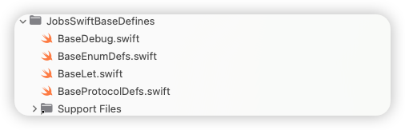
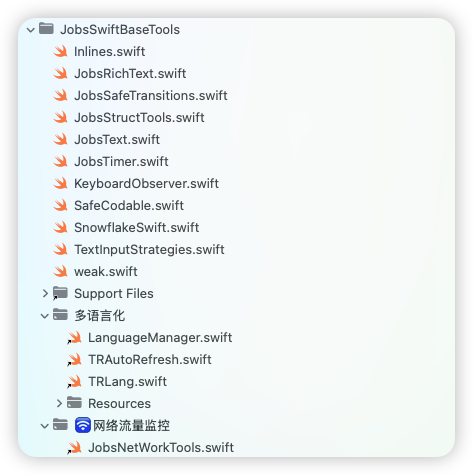

# 制作(发布)Pods组件


## 一、`*.podspec` 模板

* 普通模板

  

  ```ruby
  Pod::Spec.new do |s|
    s.name         = 'JobsSwiftBaseDefines'          # Pod 名
    s.version      = '0.1.4'
    s.summary      = '一些全局的基础定义'
    s.description  = <<-DESC
                        全局常量/协议定义/结构体/枚举
                     DESC
    s.homepage     = 'https://github.com/JobsKits/JobsSwiftBaseDefines'
    s.license      = { :type => 'MIT', :file => 'LICENSE' }
    s.author       = { 'Jobs' => 'lg295060456@gmail.com' }
  
    s.platform     = :ios, '15.0'
    s.swift_version = '5.0'
    s.source       = { :git => 'https://github.com/JobsKits/JobsSwiftBaseDefines.git',
                       :tag => s.version.to_s }
    s.source_files = '**/*.swift'
    s.frameworks   = 'UIKit'
  
  end
  ```

* 带子Pod的模版

  
  
  ```ruby
  Pod::Spec.new do |s|
    s.name         = 'JobsSwiftBaseTools'          # Pod 名
    s.version      = '0.1.11'
    s.summary      = 'Swift@基础工具集'
    s.description  = <<-DESC
                        关于Swift语言下的基础工具集
                     DESC
  
    s.homepage     = 'https://github.com/JobsKits/JobsSwiftBaseTools'
    s.license      = { :type => 'MIT', :file => 'LICENSE' }
    s.author       = { 'Jobs' => 'lg295060456@gmail.com' }
  
    s.platform      = :ios, '15.0'
    s.swift_version = '5.0'
  
    s.source = {
      :git => 'https://github.com/JobsKits/JobsSwiftBaseTools.git',
      :tag => s.version.to_s
    }
  
    # 全局排除脚本 / 图标
    s.exclude_files = [
      'MacOS/🫘JobsPublishPods.command',
      'icon.png',
    ]
  
    # ====================== 根层基础工具（根目录 Swift） ======================
    s.source_files = [
      'Inlines.swift',
      'JobsRichText.swift',
      'JobsSafeTransitions.swift',
      'JobsText.swift',
      'JobsStructTools.swift',
      'JobsTimer.swift',
      'KeyboardObserver.swift',
      'SafeCodable.swift',
      'SnowflakeSwift.swift',
      'TextInputStrategies.swift',
      'weak.swift'
    ]
  
    # ====================== 系统库依赖：所有代码共享 ======================
    s.ios.frameworks = 'UIKit',
                       'QuartzCore',
                       'Network',
                       'CoreTelephony',
                       'Photos',
                       'PhotosUI',
                       'AVFoundation',
                       'CoreLocation',
                       'CoreBluetooth',
                       'UniformTypeIdentifiers'
  
    # ====================== 第三方依赖：所有代码共享 ======================
    s.dependency 'RxSwift'
    s.dependency 'RxCocoa'
    s.dependency 'NSObject+Rx'
    s.dependency 'SnapKit'
    s.dependency 'Alamofire'
    s.dependency 'JobsSwiftBaseDefines'
  
    # ====================== 多语言化（中文目录 + Localizable.strings） ======================
    s.subspec '多语言化' do |ss|
      # 多语言化文件夹下的 Swift：LanguageManager / TRAutoRefresh / TRLang 等
      ss.source_files = '多语言化/**/*.swift'
  
      # 多语言化下的所有 Localizable.strings
      # 例如：
      #   多语言化/en.lproj/Localizable.strings
      #   多语言化/zh-Hans.lproj/Localizable.strings
      ss.resources = '多语言化/**/*.strings'
    end
  
    # ====================== 🛜网络流量监控（中文目录） ======================
    s.subspec '🛜网络流量监控' do |ss|
      # 目录：🛜网络流量监控/JobsNetWorkTools.swift
      ss.source_files = '🛜网络流量监控/**/*.swift'
    end
  end
  ```

## 二、自检（QSA@[**Cocoapods**](https://cocoapods.org/)）

> 命令行操作需要定位于此库路径下

* 自检不一定靠谱。因为自检的时候，可能用的是本地源。在最后推送到远端的时候，也会自检，以此为准

  ```shell
  pod lib lint --allow-warnings JobsSwiftBaseTools.podspec
  ```

## 三、推送

> 命令行操作需要定位于此库路径下

* 推送到[**Github**](https://github.com/)，并打对其打**tag**

  ```shell
  git tag 0.1.0
  ```

* 注册邮箱会收到一封短信，需要进行点击确认

  ```shell
  pod trunk register lg295060456@gmail.com 'Jobs' --description='JobsSwiftBaseTools.podspec'
  ```

* 自检成功 + 注册邮箱确认短信成功 +  推送到[**GitHub**](https://github.com/)并打tag（注意版本号对齐） => 发布成功

  ```shell
  pod trunk push JobsSwiftBaseTools.podspec  --allow-warnings
  ```

## 四、查询

> 命令行操作需要定位于此库路径下

```shell
pod trunk info JobsSwiftBaseTools
```

## 五、注意事项

* [**Github**](https://github.com/)和[**Cocoapods**](https://cocoapods.org/)是2套独立的系统。也就意味着，仅仅做了`git push`而没有做`pod trunk push`是不行的（当然可以用[**Github**](https://github.com/)的工作流来解决）

  * 如果在[**Github**](https://github.com/)上单方面的修改了Tag（常见操作是合并Tag，或者删除Tag）那么`pod trunk push`将会找不到这个Tag导致失败

* 如果在[**Cocoapods**](https://cocoapods.org/)有一个和目前版本相同的版本，则推不上去

* 有些时候**CND**没有来得及同步，拉不了最新的版本，需要添加官方源进行处理

  ```ruby
  source 'https://github.com/CocoaPods/Specs.git'
  ```

* 拉不到最新库，需要进行更新

  ```shell
  pod install --repo-update
  ```

* 如果因为缓存出现紊乱，还原**Pods**

  > 删除文件📃 `Podfile.lock`
  >
  > 删除文件📃 `*.xcworkspace`
  >
  > 删除文件夹📁 `Pods`

  ```shell
  pod deintegrate
  ```
  
* 作者无法主动删除自己发布的[**Cocoapods**](https://cocoapods.org/)

  * 废弃并非删除

    ```shell
    pod trunk deprecate JobsSwiftBaseTools
    pod trunk deprecate JobsSwiftBaseTools 0.1.0 # 废弃掉某个指定的版本
    ```

  *  真实删除（从 Specs 仓库抹掉）一般只有严重法律问题、安全问题之类，才会由 [**Cocoapods**](https://cocoapods.org/) 官方手工处理，<font color=red>**作者自己是做不到的**</font>。

