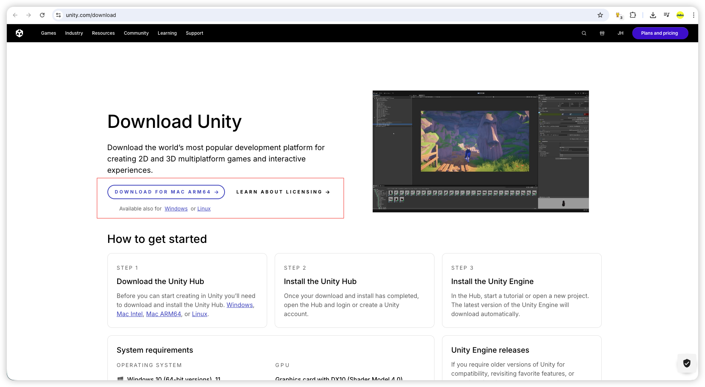
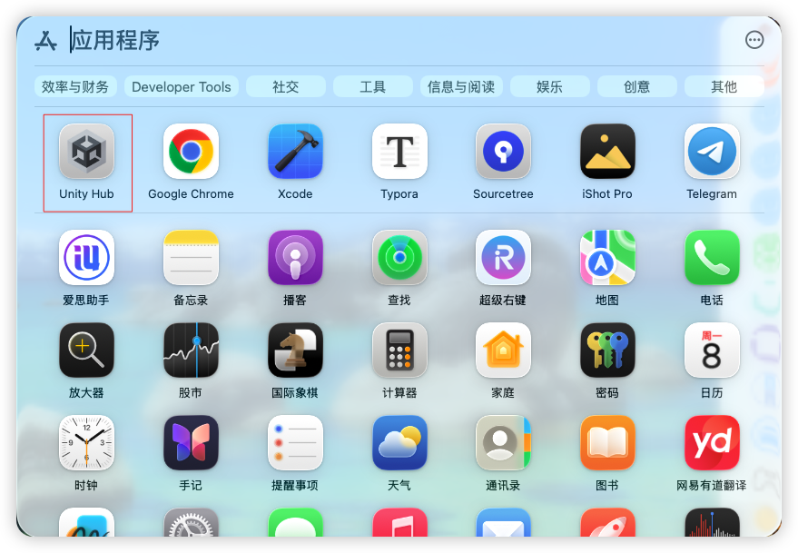
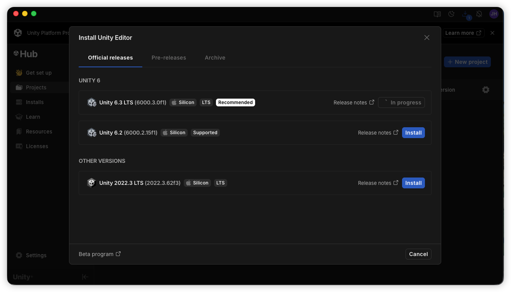
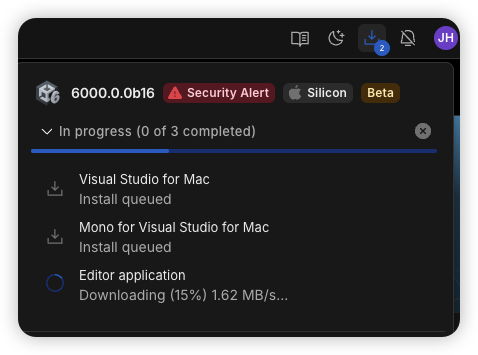
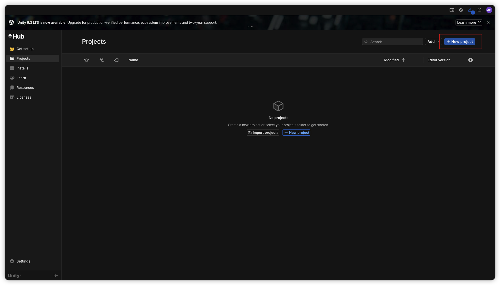
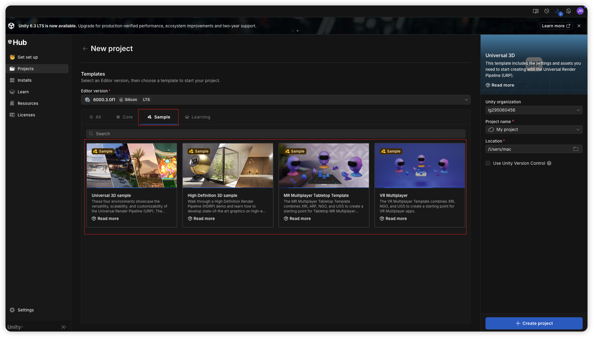
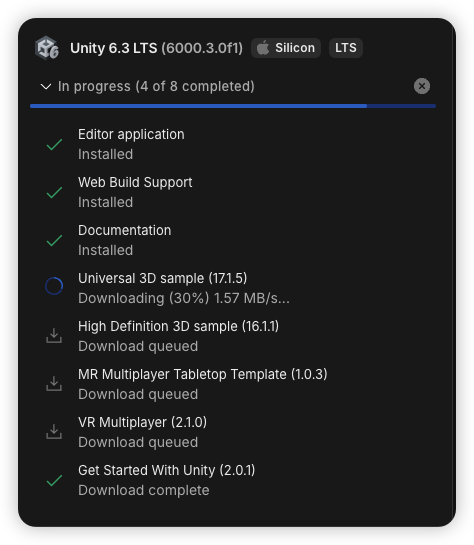

# 制作Unity

[toc]

## 一、准备工作

### 1、下载安装[**Unity Hub**](https://unity.com/download)

### 2、运行[**Unity Hub**](https://unity.com/download)

* 需要注册并登陆账户

### 3、下载SDK

### 4、下载编辑器

## 二、使用

* 来自于[**Unity Hub**](https://unity.com/download)的演示资源

  * 新建工程

    

  * 下载演示资源
  
    <table style="width:100%; table-layout:fixed;">
      <tr>
        <td>
          
        </td>
        <td>
          
        </td>
      </tr>
    </table>

* 现成的资源（一般用于开发和测试）。相当一部分社区的案例是不支持模拟器的
  * [**Unity 官方的 UAAL 示例**](https://github.com/Unity-Technologies/uaal-example)
  * [**别人已经搞好的 Swift Demo**](https://github.com/superbderrick/UnitySwift)
  
* 需要首先利用[**Unity Hub**](https://unity.com/download)将Unity资源导出至iOS平台所需要的`*.framework`

  * `Unity-iPhone.xcodeproj`
  * 以及一个 `UnityFramework.framework`（在它的 Products 里）

* 框架导入：`#include <UnityFramework/UnityFramework.h>`

