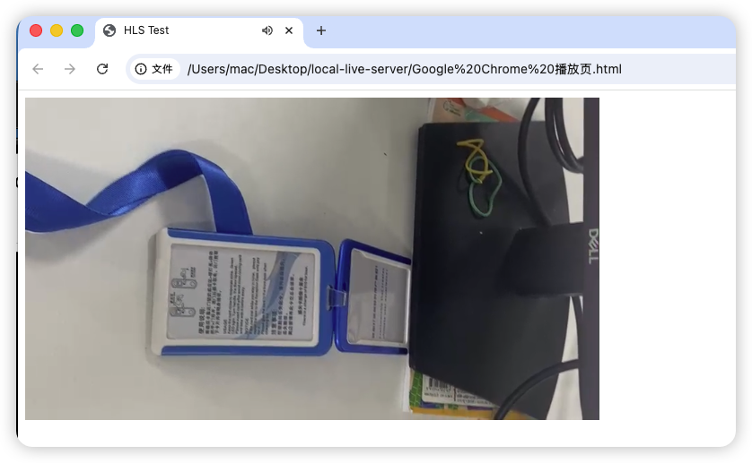

# 直播推流/拉流在**iOS**@[**Swift**](https://www.swift.org/)5x最小实践

* 服务器（本地）：以**MacOS**和本地局域网为基础，辅以[**Homebrew**](https://brew.sh/) ➤ [**node**](https://nodejs.org/en) ➤ [**node-media-server@2.3.8**](https://github.com/codivoire/node-media-server)

* 视频采集端：**iOS**@[**Swift**](https://www.swift.org/)5x➕ [**HaishinKit**](https://github.com/HaishinKit/HaishinKit.swift) ➤ 输出视频流

* 服务器端（本地）：利用**Apple主导的HLS技术**切片成<font size=5>`*.ts`</font>格式，➤ 进行推流
  * 因为是直播，所以<font size=5>`*.ts`</font>文件，<font color=red>**滚动生成，阅后即焚**</font>
  
* 推流的效果（日志）
  
  * 建立推流成功输出
  
    ```shell
    12/9/2025 11:07:44 74341 [INFO] [rtmp connect] id=QJ4MR2YV ip=::ffff:192.168.2.2 app=live args={"swfUrl":null,"audioFourCcInfoMap":{"Opus":2},"app":"live","objectEncoding":0,"videoCodecs":128,"tcUrl":"rtmp://192.168.65.91:1935/live","audioCodecs":1024,"fpad":false,"flashVer":"FMLE/3.0 (compatible; FMSc/1.0)","videoFunction":1,"fourCcList":["hvc1","Opus"],"videoFourCcInfoMap":{"hvc1":3},"capsEx":0,"capabilities":239,"pageUrl":null}
    12/9/2025 11:07:45 74341 [INFO] [rtmp publish] New stream. id=QJ4MR2YV streamPath=/live/jobs_test streamId=1
    [postPublish] {
      id: undefined,
      StreamPath: '/live/jobs_test',
      args: [Object: null prototype] {}
    }
    12/9/2025 11:07:45 74341 [INFO] [Transmuxing HLS] /live/jobs_test to /Users/mac/Documents/Gits/JobsDocs/直播推流:拉流@Swift5x/local-live-server/media/live/jobs_test/index.m3u8
    12/9/2025 11:07:45 74341 [INFO] [rtmp connect] id=4LJDLZKI ip=::ffff:127.0.0.1 app=live args={"app":"live","flashVer":"LNX 9,0,124,2","tcUrl":"rtmp://127.0.0.1:1935/live","fpad":false,"capabilities":15,"audioCodecs":4071,"videoCodecs":252,"videoFunction":1}
    12/9/2025 11:07:45 74341 [INFO] [rtmp play] Join stream. id=4LJDLZKI streamPath=/live/jobs_test  streamId=1 
    12/9/2025 11:07:45 74341 [INFO] [rtmp publish] Handle audio. id=QJ4MR2YV streamPath=/live/jobs_test sound_format=10 sound_type=2 sound_size=1 sound_rate=3 codec_name=AAC 48000 1ch
    12/9/2025 11:07:45 74341 [INFO] [rtmp publish] Handle video. id=QJ4MR2YV streamPath=/live/jobs_test frame_type=1 codec_id=7 codec_name=H264 0x0
    ```
  
  * 采样设备黑屏输出
  
    ```shell
    12/9/2025 11:09:01 74341 [INFO] [rtmp publish] Close stream. id=QJ4MR2YV streamPath=/live/jobs_test streamId=1
    [donePublish] {
      id: undefined,
      StreamPath: '/live/jobs_test',
      args: [Object: null prototype] {}
    }
    12/9/2025 11:09:01 74341 [INFO] [rtmp disconnect] id=QJ4MR2YV
    12/9/2025 11:09:01 74341 [INFO] [rtmp play] Close stream. id=4LJDLZKI streamPath=/live/jobs_test streamId=1
    12/9/2025 11:09:01 74341 [INFO] [rtmp disconnect] id=4LJDLZKI
    12/9/2025 11:09:01 74341 [INFO] [Transmuxing end] /live/jobs_test
    ```
  
* 拉流的效果
  
  * [**Google@Chrome浏览器**](https://www.google.com/intl/zh-CN/chrome/)不支持**HLS**，[**需要做特殊处理**](#对Chrome的特殊处理)
  
    
  
  * Apple自带的Safari浏览器天生支持**HLS**
  
    