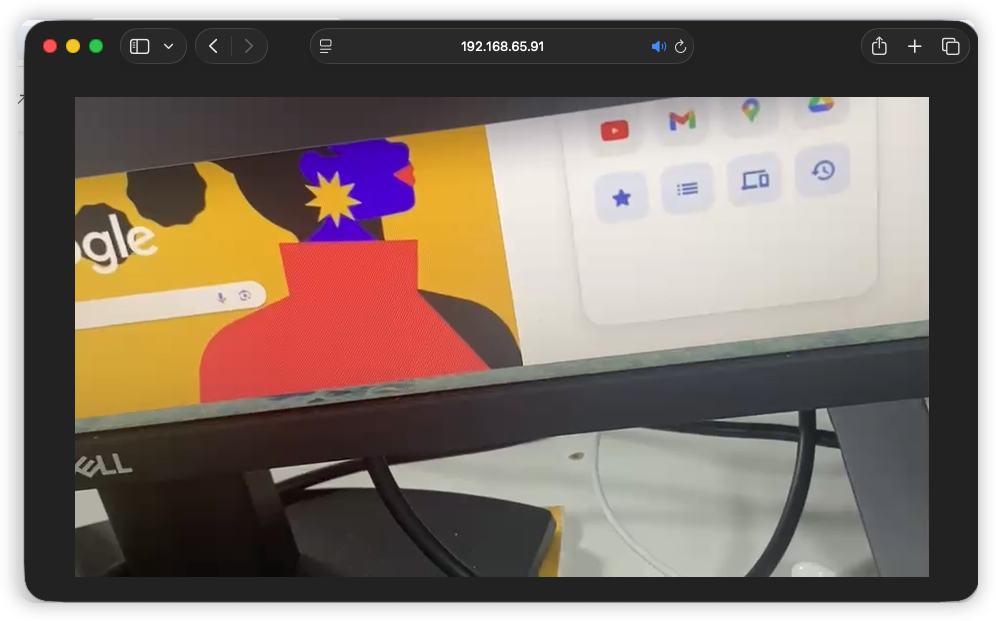
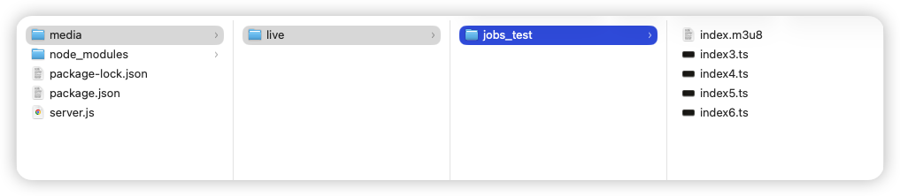

# 【MacOS】配置本地的直播服务器

[toc]

## 一、实践目的

* 服务器（本地）：以**MacOS**和本地局域网为基础，辅以[**Homebrew**](https://brew.sh/) ➤ [**node**](https://nodejs.org/en) ➤ [**node-media-server@2.3.8**](https://github.com/codivoire/node-media-server)

* 视频采集端：**iOS**@[**Swift**](https://www.swift.org/)5x➕ [**HaishinKit**](https://github.com/HaishinKit/HaishinKit.swift) ➤ 输出视频流

* 服务器端（本地）：利用**Apple主导的HLS技术**切片成<font size=5>`*.ts`</font>格式，➤ 进行推流
  * 因为是直播，所以<font size=5>`*.ts`</font>文件，<font color=red>**滚动生成，阅后即焚**</font>
  
* 推流的效果（日志）
  
  * 建立推流成功输出
  
    ```shell
    12/9/2025 11:07:44 74341 [INFO] [rtmp connect] id=QJ4MR2YV ip=::ffff:192.168.2.2 app=live args={"swfUrl":null,"audioFourCcInfoMap":{"Opus":2},"app":"live","objectEncoding":0,"videoCodecs":128,"tcUrl":"rtmp://192.168.65.91:1935/live","audioCodecs":1024,"fpad":false,"flashVer":"FMLE/3.0 (compatible; FMSc/1.0)","videoFunction":1,"fourCcList":["hvc1","Opus"],"videoFourCcInfoMap":{"hvc1":3},"capsEx":0,"capabilities":239,"pageUrl":null}
    12/9/2025 11:07:45 74341 [INFO] [rtmp publish] New stream. id=QJ4MR2YV streamPath=/live/jobs_test streamId=1
    [postPublish] {
      id: undefined,
      StreamPath: '/live/jobs_test',
      args: [Object: null prototype] {}
    }
    12/9/2025 11:07:45 74341 [INFO] [Transmuxing HLS] /live/jobs_test to /Users/mac/Documents/Gits/JobsDocs/直播推流:拉流@Swift5x/local-live-server/media/live/jobs_test/index.m3u8
    12/9/2025 11:07:45 74341 [INFO] [rtmp connect] id=4LJDLZKI ip=::ffff:127.0.0.1 app=live args={"app":"live","flashVer":"LNX 9,0,124,2","tcUrl":"rtmp://127.0.0.1:1935/live","fpad":false,"capabilities":15,"audioCodecs":4071,"videoCodecs":252,"videoFunction":1}
    12/9/2025 11:07:45 74341 [INFO] [rtmp play] Join stream. id=4LJDLZKI streamPath=/live/jobs_test  streamId=1 
    12/9/2025 11:07:45 74341 [INFO] [rtmp publish] Handle audio. id=QJ4MR2YV streamPath=/live/jobs_test sound_format=10 sound_type=2 sound_size=1 sound_rate=3 codec_name=AAC 48000 1ch
    12/9/2025 11:07:45 74341 [INFO] [rtmp publish] Handle video. id=QJ4MR2YV streamPath=/live/jobs_test frame_type=1 codec_id=7 codec_name=H264 0x0
    ```
  
  * 采样设备黑屏输出
  
    ```shell
    12/9/2025 11:09:01 74341 [INFO] [rtmp publish] Close stream. id=QJ4MR2YV streamPath=/live/jobs_test streamId=1
    [donePublish] {
      id: undefined,
      StreamPath: '/live/jobs_test',
      args: [Object: null prototype] {}
    }
    12/9/2025 11:09:01 74341 [INFO] [rtmp disconnect] id=QJ4MR2YV
    12/9/2025 11:09:01 74341 [INFO] [rtmp play] Close stream. id=4LJDLZKI streamPath=/live/jobs_test streamId=1
    12/9/2025 11:09:01 74341 [INFO] [rtmp disconnect] id=4LJDLZKI
    12/9/2025 11:09:01 74341 [INFO] [Transmuxing end] /live/jobs_test
    ```
  
* 拉流的效果
  
  * [**Google@Chrome浏览器**](https://www.google.com/intl/zh-CN/chrome/)不支持**HLS**，[**需要做特殊处理**](#对Chrome的特殊处理)
  
    
  
  * Apple自带的Safari浏览器天生支持**HLS**
  
    

## 二、相关环境配置

### 1、安装[**node-media-server**](https://github.com/codivoire/node-media-server)

* [**Homebrew**](https://brew.sh/) ➤ [**node**](https://nodejs.org/en) ➤ [**node-media-server@2.3.8**](https://github.com/codivoire/node-media-server)

  ```shell
  /bin/bash -c "$(curl -fsSL https://raw.githubusercontent.com/Homebrew/install/HEAD/install.sh)"
  brew install node
  npm install node-media-server@2.3.8 # 一定是要2.3.8稳定
  ```

* 确认安装

  ```shell
  node -v
  npm -v
  ```

* <font id=杀进程和启动>**杀进程和启动**</font>

  ```shell
  pkill -f server.js
  node server.js
  ```

### 2、安装[`ffmpeg`](https://www.ffmpeg.org/)➤用于HLS技术将视频流切片成`*.ts`

```shell
brew install ffmpeg
```

## 三、新建一个本地直播服务器项目

* 这个包就是一个用 **Node.js** 写的 **RTMP**/**HLS**/**HTTP-FLV** 服务器

  ```shell
  mkdir local-live-server
  cd local-live-server
  npm init -y
  npm install node-media-server
  ```

* <font size=5>**`server.js`**</font> 

  ```JavaScript
  // 运行环境：Node.js（服务端脚本，不是浏览器里跑的那种 JS）
  // server.js（适配 v2.x）
  const NodeMediaServer = require('node-media-server');
  const path = require('path');
  
  const mediaRoot = path.resolve(__dirname, 'media');
  console.log('mediaRoot =', mediaRoot);
  
  const config = {
    logType: 3, // 打满日志，方便看 HLS/ffmpeg 有没有跑起来
  
    rtmp: {
      port: 1935,
      chunk_size: 60000,
      gop_cache: true,
      ping: 30,
      ping_timeout: 60,
    },
  
    http: {
      port: 8000,
      mediaroot: mediaRoot,
      allow_origin: '*',
    },
  
    // ✅ v2.x 官方写法：这里才是真正启动 HLS 转封装
    trans: {
      ffmpeg: '/opt/homebrew/bin/ffmpeg', // 你机器上的 ffmpeg 路径
      tasks: [
        {
          app: 'live', // rtmp://IP:1935/live/xxx 里的 live
          hls: true,
          hlsFlags: '[hls_time=2:hls_list_size=3:hls_flags=delete_segments]',
          // dash: true,
          // dashFlags: '[f=dash:window_size=3:extra_window_size=5]',
        },
      ],
    },
  };
  
  const nms = new NodeMediaServer(config);
  
  nms.on('postPublish', (id, StreamPath, args) => {
    console.log('[postPublish]', { id: id.id, StreamPath, args });
  });
  
  nms.on('donePublish', (id, StreamPath, args) => {
    console.log('[donePublish]', { id: id.id, StreamPath, args });
  });
  
  nms.run();
  
  console.log('✅ Node-Media-Server 启动完成');
  ```

## 四、查询本地局域网IP（非公网IP）

```shell
➜  Desktop ipconfig getifaddr en0
192.168.65.91
```

## 五、双端代码配置

### 1、直播推流端（iOS@Swift5.x）

* 💥重点💥`Node-Media-Server`默认的 **RTMP** 路径形式是➤ <font size=5>`rtmp://服务器IP:1935/live/<streamName>`</font>

  ```swift
  // MARK: - 推流配置（根据你的服务器改掉即可）
  /// RTMP 服务器地址，例如：
  /// - 本机 NMS/SRS: rtmp://192.168.65.91:1935/live
  /// - 云端:        rtmp://example.com/live
  private let rtmpURI = "rtmp://192.168.65.91:1935/live"      // TODO: 换成你的 RTMP 地址
  private let streamName = "jobs_test"                        // TODO: 换成你的 streamName / 推流 key
  ```

* 完整代码

  ```swift
  //
  //  HaishinKit@直播推流.swift
  //  JobsSwiftBaseConfigDemo
  //
  //  Created by Jobs on 12/8/25.
  //
  
  import UIKit
  import AVFoundation
  import SnapKit
  import HaishinKit      // HaishinKit / RTMPHaishinKit
  
  final class HKLiveVC: BaseVC {
      deinit {
          JobsNetworkTrafficMonitorStop()  /// 停止网络实时监听
          JobsCancelWaitNetworkDataReady() /// 停止网络数据源监听
      }
      // MARK: - 推流配置（根据你的服务器改掉即可）
      /// RTMP 服务器地址，例如：
      /// - 本机 NMS/SRS: rtmp://192.168.1.10:1935/live
      /// - 云端:        rtmp://example.com/live
      private let rtmpURI = "rtmp://192.168.65.91:1935/live"      // TODO: 换成你的 RTMP 地址
      private let streamName = "jobs_test"                        // TODO: 换成你的 streamName / 推流 key
      // 实际完整推流 URL = rtmp://192.168.65.91:1935/live/jobs_test
      // MARK: - HaishinKit 管线（2.x 写法）
      /// 采集（摄像头 + 麦克风）都挂在这里
      private let mixer = MediaMixer()
      /// RTMP 连接（长链接）
      private let connection = RTMPConnection()
      /// RTMP 推流流对象
      private lazy var stream = RTMPStream(connection: connection)
      /// 当前摄像头朝向
      private var currentPosition: AVCaptureDevice.Position = .back
      /// 是否正在推流
      private var isStreaming = false
      // MARK: - UI（懒加载 + 你的链式 API + SnapKit）
      /// 预览视图：HaishinKit 提供的 Metal 预览
      private lazy var previewView: MTHKView = {
          let v = MTHKView(frame: .zero)
          v.videoGravity = .resizeAspectFill
          // 链式封装：添加到 self.view 并用 SnapKit 约束全屏
          v.byAddTo(view) { make in
              make.edges.equalToSuperview()   // 全屏铺满
          };return v
      }()
      /// 状态文案
      private lazy var statusLabel: UILabel = {
          UILabel()
              .byTextColor(.white)
              .byNumberOfLines(0)
              .byFont(.systemFont(ofSize: 14))
              .byTextAlignment(.center)
              .byText("准备就绪")
              .byAddTo(view) { [unowned self] make in
                  make.left.right.equalToSuperview().inset(16)
                  make.bottom.equalTo(recordButton.snp.top).offset(-12)
              }
      }()
      /// 开始/停止推流按钮（沿用原来的样式）
      private lazy var recordButton: UIButton = {
          UIButton.sys()
              .byBackgroundColor(.systemRed, for: .normal)
              .byBackgroundColor(.systemGray, for: .disabled)
              .byTitle("开始推流", for: .normal)
              .byTitle("停止推流", for: .selected)
              .byTitleColor(.white, for: .normal)
              .byTitleFont(.systemFont(ofSize: 16, weight: .medium))
              .byContentEdgeInsets(.init(top: 10, left: 20, bottom: 10, right: 20))
              .byCornerDot(diameter: 10, offset: .init(horizontal: -6, vertical: 6)) // 红点提示
              .onTap { [weak self] btn in
                  self?.toggleStreaming(btn)
              }
              .byAddTo(view) { [unowned self] make in
                  make.left.right.equalToSuperview().inset(24)
                  make.bottom.equalTo(self.view.safeAreaLayoutGuide.snp.bottom).inset(32)
                  make.height.equalTo(44)
              }
      }()
      /// 切换前后摄像头按钮
      private lazy var switchCameraButton: UIButton = {
          UIButton.sys()
              .byBackgroundColor(UIColor.black.withAlphaComponent(0.4), for: .normal)
              .byImage("camera.rotate".sysImg, for: .normal)
              .byCornerRadius(20)
              .onTap { [weak self] _ in
                  guard let self else { return }
                  /// 切换前后摄像头（2.x 写法，不再用 DeviceUtil）
                  currentPosition = (currentPosition == .back) ? .front : .back
                  Task { @MainActor in
                      guard let device = AVCaptureDevice.default(
                          .builtInWideAngleCamera,
                          for: .video,
                          position: self.currentPosition
                      ) else {
                          print("⚠️ 找不到对应方向摄像头：\(self.currentPosition)")
                          return
                      }
  
                      do {
                          try await self.mixer.attachVideo(device)
                          let posText = (self.currentPosition == .back) ? "后置" : "前置"
                          self.statusLabel.byText("📷 已切换到 \(posText) 摄像头")
                      } catch {
                          print("⚠️ 切换摄像头失败：\(error)")
                          self.statusLabel.byText("❌ 切换摄像头失败：\(error.localizedDescription)")
                      }
                  }
              }
              .byAddTo(view) { [unowned self] make in
                  make.top.equalTo(self.view.safeAreaLayoutGuide.snp.top).offset(20)
                  make.right.equalToSuperview().inset(20)
                  make.size.equalTo(CGSize(width: 40, height: 40))
              }
      }()
      // MARK: - 生命周期
      override func viewDidLoad() {
          super.viewDidLoad()
          view.backgroundColor = .black
          networkRichListenerBy(view)
          // 触发懒加载
          previewView.byVisible(YES)
          recordButton.byVisible(YES)
          switchCameraButton.byVisible(YES)
          statusLabel.byVisible(YES)
  
          requestCameraAndMicrophoneAuthorization()
          setupAudioSession()
  
          // 初始化 HaishinKit 采集管线
          Task { @MainActor in
              await setupCapturePipeline()
          }
      }
  
      override func viewWillDisappear(_ animated: Bool) {
          super.viewWillDisappear(animated)
          Task { [weak self] in
              guard let self else { return }
              await self.cleanup()
          }
      }
      // MARK: - 权限
      /// 申请摄像头 + 麦克风权限（简单版）
      private func requestCameraAndMicrophoneAuthorization() {
          Task {
              _ = await AVCaptureDevice.requestAccess(for: .video)
              _ = await AVCaptureDevice.requestAccess(for: .audio)
          }
      }
      // MARK: - AVAudioSession
      /// 配置音频 Session（来自官方 README 的写法，2.x 推荐）
      private func setupAudioSession() {
          let session = AVAudioSession.sharedInstance()
          do {
              try session.setCategory(
                  .playAndRecord,
                  mode: .videoRecording,
                  options: [.defaultToSpeaker, .allowBluetoothHFP]
              )
              try session.setActive(true)
          } catch {
              print("⚠️ 配置 AVAudioSession 失败：\(error)")
          }
      }
      // MARK: - HaishinKit 采集管线（2.x 正确写法）
      /// 初始化采集（绑定摄像头 + 麦克风，串起来 mixer -> stream -> previewView）
      @MainActor
      private func setupCapturePipeline() async {
          // 1. 准备采集设备
          guard
              let videoDevice = AVCaptureDevice.default(
                  .builtInWideAngleCamera,
                  for: .video,
                  position: currentPosition
              ),
              let audioDevice = AVCaptureDevice.default(for: .audio)
          else {
              statusLabel.byText("❌ 找不到摄像头或麦克风")
              return
          }
          // 2. 把设备 attach 到 MediaMixer
          do {
              try await mixer.attachVideo(videoDevice)
          } catch {
              print("⚠️ attachVideo 失败：\(error)")
          }
  
          do {
              try await mixer.attachAudio(audioDevice)
          } catch {
              print("⚠️ attachAudio 失败：\(error)")
          }
          // 3. mixer 输出到 RTMPStream
          await mixer.addOutput(stream)
          // 4. RTMPStream 再输出到预览视图
          await stream.addOutput(previewView) // 预览
          statusLabel.byText("✅ 采集已就绪，点击“开始推流”")
      }
      /// 释放资源
      private func cleanup() async {
          if isStreaming {
              await stopStreaming()
          }
          await mixer.stopRunning()
      }
      // MARK: - 推流控制
      private func toggleStreaming(_ sender: UIButton) {
          Task { @MainActor in
              if isStreaming {
                  await stopStreaming()
              } else {
                  await startStreaming()
              }
          }
      }
      /// 开始推流：连接 RTMP 服务器 + publish
      @MainActor
      private func startStreaming() async {
          guard !isStreaming else { return }
          statusLabel.byText("🔌 正在连接服务器...")
          do {
              // 1. 建立 RTMP 连接（长链接）
              let connectResponse = try await connection.connect(rtmpURI)
              print("✅ RTMP connect: \(connectResponse)")
              statusLabel.byText("🚀 正在发起推流请求...")
              // 2. 开始推流
              let publishResponse = try await stream.publish(streamName)
              print("✅ RTMP publish: \(publishResponse)")
  
              isStreaming = true
              recordButton.isSelected = true
              statusLabel.byText("🟢 已开始推流")
          } catch RTMPConnection.Error.requestFailed(let response) {
              statusLabel.byText("❌ 连接失败：\(String(describing: response.status))")
              print("⚠️ RTMPConnection.Error.requestFailed: \(response)")
          } catch RTMPStream.Error.requestFailed(let response) {
              statusLabel.byText("❌ 推流失败：\(String(describing: response.status))")
              print("⚠️ RTMPStream.Error.requestFailed: \(response)")
          } catch {
              statusLabel.byText("❌ 推流异常：\(error.localizedDescription)")
              print("⚠️ startStreaming 失败：\(error)")
          }
      }
      /// 停止推流：关闭 RTMP 连接（服务器侧会自动 unpublish）
      @MainActor
      private func stopStreaming() async {
          guard isStreaming else { return }
          statusLabel.byText("⏹ 正在停止推流...")
          do {
              try await connection.close()
              isStreaming = false
              recordButton.isSelected = false
              statusLabel.byText("✅ 已停止推流")
          } catch {
              // close 失败一般问题不大，但还是打印一下
              statusLabel.byText("⚠️ 停止推流异常：\(error.localizedDescription)")
              print("⚠️ stopStreaming 失败：\(error)")
          }
      }
  }
  ```
  

### 2、直播拉流端（只简单的面对一个URL）

* 重点

  ```url
  http://192.168.65.91:8000/live/jobs_test/index.m3u8
  ```

* 完整代码

  ```shell
  //
  //  PlayerRemoteVC.swift
  //  JobsSwiftBaseConfigDemo
  //
  //  Created by Mac on 10/28/25.
  //
  
  import UIKit
  import SnapKit
  import BMPlayer
  
  final class PlayerRemoteVC: BaseVC {
      deinit {
          JobsNetworkTrafficMonitorStop()  /// 停止网络实时监听
          JobsCancelWaitNetworkDataReady() /// 停止网络数据源监听
      }
      // MARK: - 懒加载：播放器
      private lazy var player: BMPlayer = { [unowned self] in
          BMPlayer()
              .byResource(BMPlayerResource(
                  name: "BigBuckBunny",
                  definitions: [
                      BMPlayerResourceDefinition(
  //                        url: "https://commondatastorage.googleapis.com/gtv-videos-bucket/sample/BigBuckBunny.mp4".url!,
  //                        url: "http://cdn3.toronto360.tv:8081/toronto360/hd/playlist.m3u8".url!,
                          url: "http://192.168.65.91:8000/live/jobs_test/index.m3u8".url!,
                          definition: "默认"
                      )
                  ],
                  cover: nil,
                  subtitles: nil
              ), definitionIndex: 0, autoPlay: true)
              .byVideoGravity(.resizeAspect)      // 需要铺满可改 .resizeAspectFill
              .byPanGestureEnabled(true)
              .byBack { [weak self] isFull in
                  guard let self else { return }
                  if !isFull { self.navigationController?.popViewController(animated: true) }
              }
              .byAddTo(view) { [unowned self] make in
                  if self.view.jobs_hasVisibleTopBar() {
                      make.top.equalTo(self.gk_navigationBar.snp.bottom).offset(10)
                      make.left.right.equalToSuperview()
                      make.height.equalTo(400)
                  } else {
                      make.edges.equalToSuperview()
                  }
              }
      }()
  
      override func loadView() {
          super.loadView()
          jobsWaitNetworkDataReady(
              onWiFiReady: {
                  print("✅ Wi-Fi 已有真实流量")
              },
              onCellularReady: {
                  print("✅ 蜂窝已实际可用，可以走后续逻辑")
                  // 比如这里再去重试接口、发起播放等
              }
          )
      }
      // MARK: - 生命周期
      override func viewDidLoad() {
          super.viewDidLoad()
          view.backgroundColor = .systemBackground
          networkRichListenerBy(view)
          jobsSetupGKNav(title: "网络单播")
          player.byVisible(YES)
      }
  
      override func viewWillDisappear(_ animated: Bool) {
          super.viewWillDisappear(animated)
          if self.isMovingFromParent {
              player.byPause()          // 阻断后续 autoPlay
          }
      }
  }
  ```

## 六、启动<font size=5>`Node-Media-Server`</font>

* [**启动**](#杀进程和启动)以后<font size=5>`Node-Media-Server`</font>会维持一个长链接服务（此运行窗口不能关闭）

  

  * 此时文件夹<font size=5>`media/`</font>为空

  

* 移动端iOS侧启动直播推流（注意手机不能息屏）

  * 此时会生成文件夹➤`./media/live/jobs_test`/
  * 文件夹下面会生成**m3u8**目录索引文件➤`*.m3u8`，以及**m3u8**视频切片文件➤<font size=5>`*.ts`</font>

  

* 如果是Apple自带的Safari浏览器，就直接在浏览器地址栏输入➤`http://192.168.65.91:8000/live/jobs_test/index.m3u8`

* <font id=对Chrome的特殊处理>对**Google@Chrome**浏览器的支持</font>

  ```html
  <!DOCTYPE html>
  <html lang="zh-CN">
  <head>
    <meta charset="UTF-8" />
    <title>HLS Test</title>
  </head>
  <body>
    <video id="video" controls width="640" height="360"></video>
  
    <script src="https://cdn.jsdelivr.net/npm/hls.js@latest"></script>
    <script>
      const video = document.getElementById('video');
      const src = 'http://192.168.65.91:8000/live/jobs_test/index.m3u8';
  
      if (Hls.isSupported()) {
        const hls = new Hls();
        hls.loadSource(src);
        hls.attachMedia(video);
        hls.on(Hls.Events.MANIFEST_PARSED, function () {
          video.play();
        });
      } else if (video.canPlayType('application/vnd.apple.mpegurl')) {
        // Safari / iOS
        video.src = src;
        video.addEventListener('loadedmetadata', () => {
          video.play();
        });
      } else {
        console.error('HLS not supported');
      }
    </script>
  </body>
  </html>
  ```
